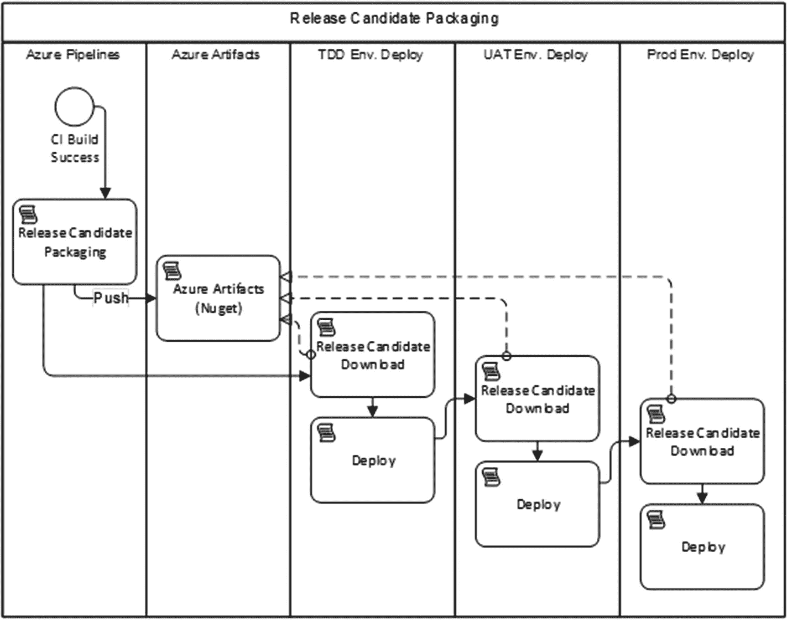

# 八、发布候选的创建

您之前已经学习了如何编码、构建和验证软件版本。为了使该版本成为发布候选版本，您必须以适合于产品发布的格式打包该版本。此外，为了使我们的持续集成“提交阶段”更加健壮，您将不得不打包构建以发布到 TDD(测试驱动开发)环境。在前面的章节中，这个环境已经作为一个专门用于执行自动化测试的部署环境进行了介绍。在这种环境下执行的测试类型是验收测试。 <sup>[2](#Fn2)</sup> 对于 web 应用，您通常会使用 Selenium <sup>[3](#Fn3)</sup> 通过用户界面进行测试。您还可以创建其他测试套件，这些套件需要部署软件系统的完整部署实例。这一章将集中于您将设计和配置的基本元素，以便将一个构建转换成一个版本化的发布候选，适合于部署到下游环境。这一章将涵盖所涉及的原则，软件包与软件架构的模型和关系，以及存储和使用软件包的过程。

## 设计你的候选发布架构

为了给你的发布候选包指定架构，你需要分析你的 4+1 架构 <sup>[4](#Fn4)</sup> 的逻辑和物理层，并确定部署的单元。请记住这些发布候选包的经验法则:

*   **构建/打包一次，部署多次**

成功的持续集成构建将打包一组发布候选包。这些包应该适合部署到任何环境，包括生产环境。不要配置分支或构建，以便单独构建每个环境。我们构建和打包一次，以便在我们的 DevOps 管道中执行的每个后续活动进一步证明发布候选版本对于我们的生产环境用户的适用性。当发现一个问题时，发布候选就不再有资格发布。当一个候选版本通过我们的整个管道时，我们可以确信它已经为我们的用户准备好了。

*   **每个运行时组件一个包**

一般来说，一个候选版本由一组包组成(NuGet packages for our。NET 应用)。我们的物理架构层中的每个运行时组件组成一个包。也就是说，我们的网站完全打包在一个 NuGet 包中。我们的 SQL Server 数据库模式和迁移脚本打包在一个单独的 NuGet 包中，等等。

*   **使用 NuGet 包格式**

虽然任何人都可以发明一种新的包格式，但是最好使用具有查看器等工具的行业标准格式。那个。NET 包格式是 a∫。nupkg 文件(读作 NUPKEG)。虽然技术上你可以把你的文件放在一个。zip 文件，对于您的平台，使用更具体的格式会更好。同样，如果您正在开发一个 NodeJS 应用，您将使用*。npm 包格式。

*   **嵌入构建号作为发布候选版本**

内部版本号根据您指定的格式自动分配。将构建号一直传递到您的发布候选包中。如果您已经构建了 3.4.352，那么您的候选发布版本的 NuGet 包应该都标记为 3.4.352。这确保了无论环境如何，您总是知道被测试的候选发布版本和创建候选发布版本的构建。

*   **仅打包应用工件**

注意不要打包任何特定于环境的文件或配置。放入每个应用组件包的内容应该适合部署到任何环境。全局配置是合适的，但是从一个环境到另一个环境的任何配置都应该在部署时推入，而不是在打包时推入。警惕包中包含引用环境名称的任何内容。

### 创建和使用发布候选包

让我们首先来看看发布候选的流程部分。图 [8-1](#Fig1) 展示了我们 DevOps 管道中的事件顺序。



图 8-1

发布候选包是构建和部署之间的桥梁

发布候选包由 CI 构建创建，并由部署配置使用。在 Azure Pipelines 中，无论运行时组件的数量有多少，您都将拥有一个单一的应用持续集成版本。对于包含 Visual Studio 解决方案的单个 Git 存储库，您将有一个构建。在所有步骤成功的基础上，这个构建应该将您的应用打包到一组 NuGet 包中进行部署。我们将很快介绍如何确定包的数量。

一旦发布候选(即将成功的构建的结果)被打包，构建配置应该将它们推入 Azure 工件。Azure Artifacts 为你的团队提供了一个内置的 NuGet feed。除非你有特别的理由要用别的，用这个。一旦发布候选包被推送，CI 构建完成并报告成功。如果发布候选不能被打包或存储，那么构建应该会失败。

虽然我们还没有讨论发布配置或部署(这将在后面的章节中讨论)，但是让我们讨论一下包的使用过程。每个下游环境(TDD、UAT 和 Prod)都将有一个部署过程，从检索候选发布的 NuGet 包开始。这个过程将访问 Azure 工件中托管的 NuGet 提要，检索包，提取包，并使用内容来部署应用。组成单个候选版本的相同包应该用于部署到每个环境中。

### 定义包的边界

大多数应用有不止一个运行时组件。因此，在组成一个发布候选的包集合中应该有不止一个 NuGet 包。以特定方式部署的应用的每个部分都应该单独打包，如图 [8-2](#Fig2) 所示。让我们深入研究如何确定每个包的边界。


图 8-2

应用的每个运行时组件都应该有自己的包

让我们考虑一个具有三个可部署组件的应用。第一部分是一个使用 ASP.NET 的 web 应用。它被部署到 web 服务器或 Azure AppService。第二部分是离线工作。也许是一个批处理作业或一个监听队列的处理程序服务。这些非常常见，它们被部署为 Windows 服务或 Azure 功能或 WebJobs。第三个是 SQL Server 数据库。无论是内部部署还是在 Azure SQL 中，我们都必须部署模式和全局数据更改。

应用的这三个组件都在各自的内存空间、各自的进程中运行，因此它们具有不同的部署特征。部署目标不同。由于这些原因，每个都应该打包在自己的 NuGet 包中。这允许将每个部署到适当的目的地，同时保持灵活性。虽然您有可能将所有三个组件部署到一台服务器上，但是您也可以将每个组件部署到完全不同的服务器上。事实上，您可以将 web 应用 ASP.NET UI 部署到 web 场中的许多服务器上，或者部署到多个 Azure 区域上。您的发布候选包的结构应该映射到应用运行组件的物理架构，而不考虑服务器环境的拓扑结构。

除了每个应用组件之外，您总是会有一些额外的资产伴随着候选发布。这些资产不是生产代码，只是为了验证发布候选而存在的。在图 [8-2](#Fig2) 中，您会看到“验收测试”在 Visual Studio 中，这表现为一个项目，可能是 NUnit 或另一个测试框架。如果应用是 web 应用，Visual Studio 项目中包含的测试可能会使用 Selenium 来测试完全部署的应用。因为需要完全部署的应用，所以这些测试与应用的版本相关联；因此，它们属于某个候选版本，需要与其他组件一起打包和部署。在本章前面的流程图中，您看到了 TDD 环境是部署的第一个环境。在应用完全部署之后，验收测试包将被检索并安装在部署服务器上。然后，针对从 TDD 环境中运行的已部署的候选版本运行测试。通过这种方式，我们可以打包额外的资产，目的是使我们的 DevOps 管道更加健壮，以便它可以在将候选发布提升到下一个下游环境之前检测到更高百分比的缺陷。

## 发布候选的 Azure 工件工作流

既然您已经看到了如何为您的发布候选包确定架构，那么让我们来看看它是如何工作的。我们将在 Azure DevOps 服务中的示例应用中使用此配置。在您的项目配置中，您将希望确保将 Azure 工件作为管道的启用服务。 <sup>[5](#Fn5)</sup> Azure Artifacts 是一个独立的产品，但它是与 Azure 管道一起使用的。它是由持续集成构建产生的发布候选组件的存储服务。

我们将要打包的应用有三个可部署的组件，它们是一起构建和版本化的:

*   网站用户界面(UI)

*   离线工作

*   数据库ˌ资料库

除了这些应用组件之外，该应用还有将被打包和部署的验收测试。回头参考第 7 章,了解在验证 web 应用时，如何组织全系统验收测试。为了在 TDD 环境中对我们的应用运行这些验收测试，我们必须打包并存储属于这个应用版本的验收测试版本。版本号必须匹配。

前面，我强调了版本控制在 DevOps 管道中的重要性。在图 [8-3](#Fig3) 中，检查 Azure 工件中的发布候选包。


图 8-3

候选发布版本印在 NuGet 包以及其中的每个程序集上

因为正确的版本号现在嵌入到每个程序集中，所以您的代码可以访问它。无论您是将其显示在屏幕底部，还是将其包含在诊断遥测或日志中，您都可以使用版本号来了解问题或错误是在旧版本上还是在当前版本上。没有版本号，你就瞎飞。不要试图使用日期和时间戳来解密您正在处理的版本。显式地将版本号推入每个资产。

不要试图使用日期和时间戳来解释您正在处理的版本。将版本号显式推入每个发布候选 NuGet 包中的每个程序集。

### 指定如何创建包

要结束关于如何制作包的循环，请回头参考我们的构建脚本，您会希望将它保存在您的 Git 库的顶层。参见图 [8-4](#Fig4) 。


图 8-4

我们的 PowerShell 构建脚本存储在 Git 存储库的顶部，命名为 build.ps1

当在本地工作站上运行我们的私有构建时，打包是不必要的，但是当这个脚本作为 CI 构建的一部分运行时，打包是构建应该返回成功之前的最后一步。这个 PowerShell 函数负责将项目打包成 NuGet 包。

```
Function Pack{
        Write-Output "Packaging nuget packages"
    exec{
        & dotnet publish $uiProjectPath -nologo --no-restore --no-build
        -v $verbosity --configuration $projectConfig
    }

    exec{
            & .\tools\octopack\Octo.exe pack --id "$projectName.UI"
            --version $version
            --basePath $uiProjectPath\bin\$projectConfig\$framework\publish
            --outFolder $build_dir --overwrite
        }

    exec{
            & .\tools\octopack\Octo.exe pack --id "$projectName.Database"
            --version $version --basePath $databaseProjectPath
            --outFolder $build_dir --overwrite
        }

    exec{
        & dotnet publish $jobProjectPath -nologo --no-restore --no-build
            -v $verbosity --configuration $projectConfig
    }
        exec{
             & .\tools\octopack\Octo.exe pack --id "$projectName.Job"
             --version $version
             --basePath $jobProjectPath\bin\$projectConfig\$framework\publish
             --outFolder $build_dir --overwrite
        }

    exec{
        & dotnet publish $acceptanceTestProjectPath -nologo --no-restore
            --no-build
            -v $verbosity --configuration $projectConfig
    }

    exec{
            & .\tools\octopack\Octo.exe pack --id "$projectName.AcceptanceTests"
            --version $version --basePath
            $acceptanceTestProjectPath\bin\$projectConfig\$framework\publish
            --outFolder $build_dir --overwrite

        }
}

```

因为我们有四个必须部署的组件，所以我们有四个 NuGet 包。请注意，我使用的是 Octo.exe 工具。 <sup>[6](#Fn6)</sup> OctoPack 是全称，是 NuGet 的开源包装器，你可以在 GitHub 上找到源码。NuGet 最初是作为库依赖的包格式设计的，后来才被应用于应用打包。您当然可以直接使用 NuPack，但是 OctoPack 包装了 NuPack，克服了一些默认的约定和假设，这些约定和假设在打包应用组件进行部署时不太合适。

在我们的构建脚本中使用前面的 PowerShell，我们可以配置 Azure 管道，如图 [8-5](#Fig5) 所示。


图 8-5

Azure Pipelines 调用存储在 Git 中的构建脚本，以最小化全局步骤配置

注意，在 build.ps1 文件中调用了“CIBuild”函数。该功能如下:

```
Function CIBuild{
        Init
        MigrateDatabaseRemote
        Compile
        UnitTests
        IntegrationTest
        Pack
}

```

Pack 函数是最后调用的。然后，在正确创建了 NuGet 包之后，我们的“NuGet push”构建步骤将它们放在 Azure 工件服务中，这使得它们可用于访问 NuGet 提要的任何其他进程。参见图 [8-6](#Fig6) 。


图 8-6

候选版本 1.0.594 的数据库组件包含升级模式所必需的数据库迁移脚本

因为我们有数据库迁移工具和完整的脚本，所以我们能够从我们选择的任何服务器上运行数据库迁移过程。并且在我们的包中包含 helper *. PS1 文件将限制必须在 Azure 管道中显式配置的步骤。

虽然 YAML 将成为所有构建和发布的格式，但是该功能的工具还没有准备好。希望在适当的时候转移到基于 YAML 的配置。YAML 将使您能够在 Git 存储库中存储整个管道配置。

### 在部署配置中使用发布候选包

虽然我们将在下一章深入部署，但了解构建或发布配置如何按需从 Azure 工件中检索 NuGet 包是有用的，如图 [8-7](#Fig7) 所示。


图 8-7

回顾环境部署如何调用 Azure 工件来获取包

记住我们环境的顺序。在 TDD 环境的情况下，您将需要部署完整的应用，然后获取并安装 AcceptanceTests 包，以便可以运行这些测试。AcceptanceTests 包的寿命不会超过 TDD 环境。如果您创建必须在完全部署的环境中运行的其他类型的测试套件，您将使用相同的模式将它们打包成一个包，将它们存储在 Azure 工件中，并在部署期间检索它们。

“下载包”步骤允许轻松地检索任何候选版本的 NuGet 包，如图 [8-8](#Fig8) 所示。因为一个 NuGet 包本质上是一个∫。这个步骤在用作代理的服务器的目标目录上检索并提取 NuGet 包，无论它是托管代理还是您自己的私有代理。您可以看到内部版本号对管道有多重要。一切都与内部版本号有关。


图 8-8

TDD 环境发布/部署配置的一部分

### 共享库呢？

如果您的 Visual Studio 解决方案包含您希望与其他团队或其他应用共享的类库，请将其视为应用组件。将其打包为 CI 构建的一部分。推到 Azure Artifacts 上去。可以访问该 NuGet 提要的其他开发人员将能够像使用公共 NuGet 包一样使用这个库。当您有一个新的库构建时，提要将自动接收新构建的库。

## 包裹

在这一章中，你学习了如何将你的应用打包成一个候选版本，由一组 NuGet 包组成。我们的经验法则是

*   一次构建，多次部署。

*   将内部版本号作为正式版本号传递给所有人。

*   使用 NuGet 作为您的包格式。

*   在 Azure 工件中归档您的发布候选。

*   打包必须在部署环境中执行的测试套件。

*   通过 Azure 工件打包并发布共享库。

## 文献学

(未注明日期)。从 OctoPack GitHub 项目中检索: [`https://github.com/OctopusDeploy/OctoPack`](https://github.com/OctopusDeploy/OctoPack)

(未注明日期)。从微软文档中检索:用 Selenium 测试: [`https://docs.microsoft.com/en-us/azure/devops/pipelines/test/continuous-test-selenium?view=azure-devops`](https://docs.microsoft.com/en-us/azure/devops/pipelines/test/continuous-test-selenium%253Fview%253Dazure-devops)

狄克逊。*深入探究天蓝色文物*。检索自 [`https://azure.microsoft.com/en-us/blog/deep-dive-into-azure-artifacts/`](https://azure.microsoft.com/en-us/blog/deep-dive-into-azure-artifacts/)

杜瓦尔，下午(2007 年)。持续集成:提高软件质量，降低风险。艾迪森·卫斯理。

克鲁希滕，p .(未注明)。取自架构蓝图——软件架构的“4+1”视图模型: [`www.cs.ubc.ca/~gregor/teaching/papers/4+1view-architecture.pdf`](http://www.cs.ubc.ca/%257Egregor/teaching/papers/4%252B1view-architecture.pdf)

威尔斯博士。*验收测试*。检索于 2019 年 4 月 3 日，来自 [Extremeprogrammi ng。org](http://extremeprogramming.org) : [`www.extremeprogramming.org/rules/functionaltests.html`](http://www.extremeprogramming.org/rules/functionaltests.html)

<aside class="FootnoteSection" epub:type="footnotes">Footnotes [1](#Fn1_source)

杜瓦尔，2007 年

  [2](#Fn2_source)

北达科他州威尔斯

  [3](#Fn3_source)

微软文档:使用 Selenium 进行测试，未注明

  [4](#Fn4_source)

锅碗瓢盆

  [5](#Fn5_source)

新奥尔良迪克森

  [6](#Fn6_source)

OctoPack GitHub 专案，未指定。

 </aside>