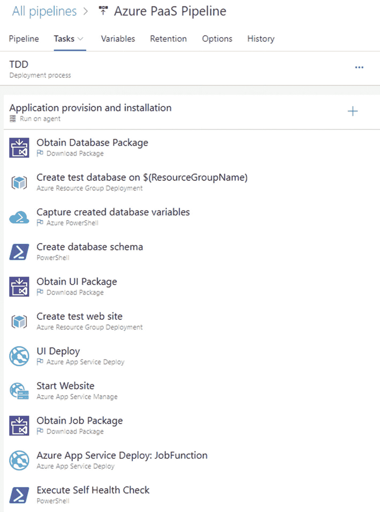
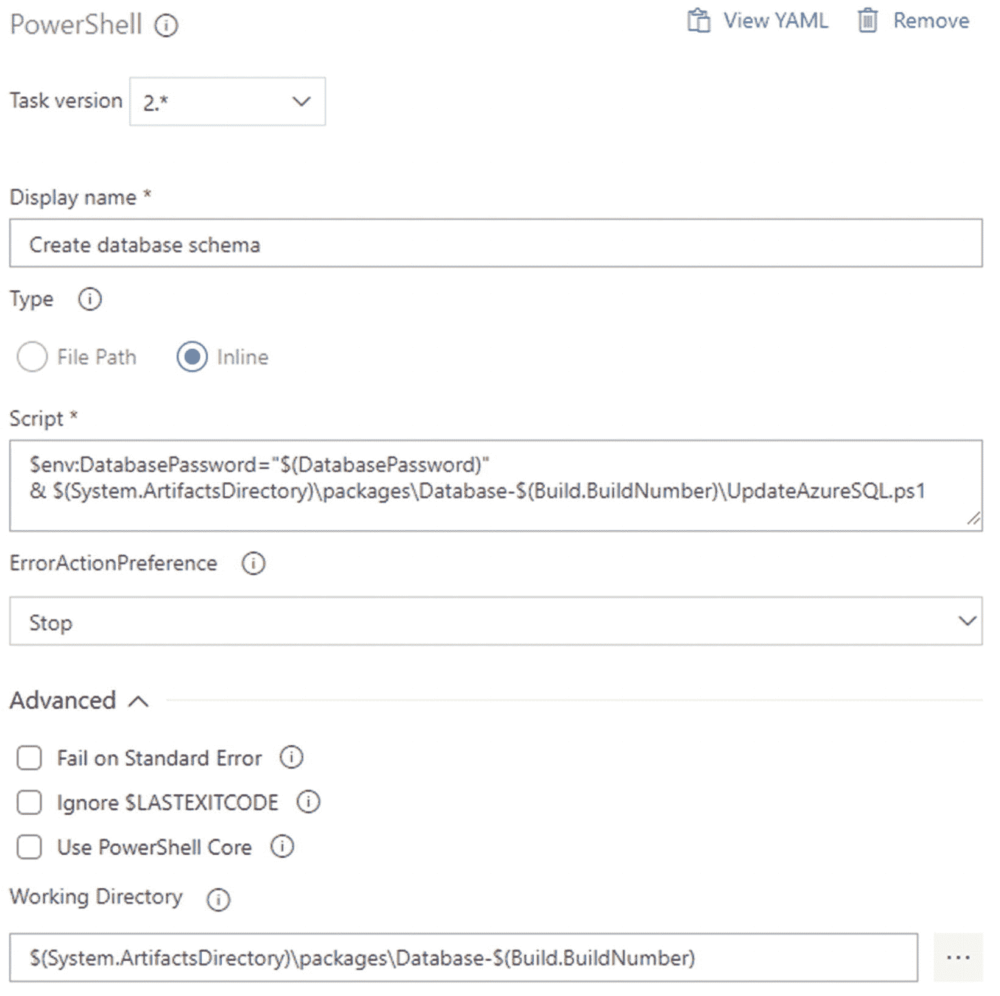
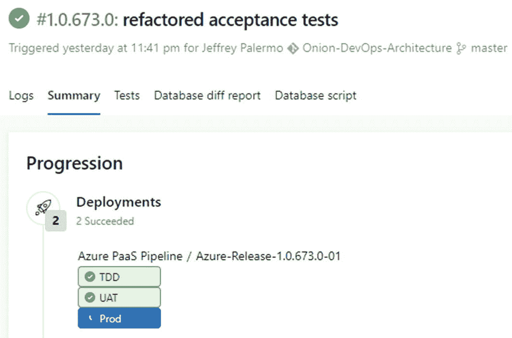

# 9.部署版本

也许你已经跳过了这一章，而没有阅读前面所有的章节。没关系，但是其他的话题被故意放在这个话题之前。的确，在我们真正将 bits 部署到环境中之前，没有人能够使用它们。然而，部署管道是所有现有技术提供其挤出缺陷的价值的地方，因此它们没有被推广给我们的用户。在本章中，您将学习设计部署管道的模型、要在其中配置的环境类型，以及部署期间必需的活动类型。

## 设计您的部署管道

为了确定部署管道的适当结构，您必须决定要配置多少个环境以及它们之间的差异。在我们深入这个主题之前，让我们考虑一些指导这些决策的原则:

*   **建立一个，部署多个**

    无论您有多少个环境，您都将部署相同的发布候选，从一个单一的持续集成构建中产生多次，每个环境类型一次(至少一次)。一旦版本进入部署活动，不要做任何从源代码重新构建或重新编译的事情。如果任何地方有问题，就认为这个候选版本已经失效了，纠正这个问题，并继续使用一个不同版本的候选版本。

*   **第一次生产时什么都不做**

    设计部署管道，以便在生产环境中执行活动之前，至少在一个生产前环境中执行部署中必需的每个独特活动。例如，如果您的生产环境运行在一个具有几个批处理作业服务器和一个大型 SQL Server 群集的 web 场上，那么在所有生产前环境中使用单服务器配置是不明智的。此外，在持续集成构建打包了发布候选之后，不应该创建或更改任何用于生产的文件。生产部署所需的一切都应该在 CI 构建结束时放入发布候选包中。如果您发现缺少某些东西，停止这一行，将缺少的部分添加到代码库中，并让 CI 构建包含所有必要内容的另一个发布候选包。

*   **管道能力左移**

    在部署应用组件以及配置设置和数据时，将逻辑推送到存储在应用 Git 存储库中的脚本文件中。虽然 CI 构建配置和部署步骤允许运行存储在任意位置的脚本，但是您通过这种策略创建了全局和临时依赖关系。确保尽可能多的命令、脚本和逻辑来源于 Git 存储库和构成正在部署的发布候选的包。

### 确定环境

我们的行业有许多关于服务器环境的术语。每个人都有生产。还有以下用途:

*   当地的

*   沙箱

*   偏差

*   综合

*   试验

*   用户

*   用户接受测试

*   质量保证

*   质量控制

*   接受

*   脚手架

虽然没有标准，但似乎众所周知的云前集合是开发、测试、试运行和生产。随着易于创建和修改的环境的出现，任何标准化环境名称和阶段的概念都变弱了。我们将试图避开这种混乱，谈论各种环境的目的。

在 DevOps 环境中，团队的部署环境绝不会少于三(3)个。考虑图 [9-1](#Fig1) 中的表格。


图 9-1

DevOps 管道中的三种不同类型的环境

下表显示了设计部署管道时需要的三种环境。你可以随意选择每种类型的数量，但是这三种类型中的每一种都不能少于一个。大家都懂生产。它是为那些从使用你的软件中获得价值的人而存在的。生产前的下一个环境适用于任何类型的手动测试。我们称之为 UAT，因为它更关注用户而不是工程团队。最后，我们有一个只用于各种自动化验证的环境。为了消除过去使用的其他环境名称的歧义，我们称之为 TDD 环境，是测试驱动开发的缩写。在 TDD 环境中，不允许人类进入。如果一个人试图利用这个环境，他们会发现它被创造和破坏的速度之快，排除了任何有价值的用途。

让我们看一些例子，在决定每种类型选择多少时可以使用。

#### 生产

在生产环境中，您可以选择为每个客户提供一个专用的生产环境，或者让所有客户使用一个生产环境。你们

#### 用户接受测试

如果您的组织很小，您可以有一个单一的手动验证环境。或者，您可能有几个不同的用户或者涉众团体，他们可能会从拥有这种类型的专用环境中受益，这样他们就可以选择接受准备好的下一个候选版本的节奏。您可能还会决定提供另一个这种类型的环境来对一个特别大的数据集进行探索性测试——看看系统是否提供了一个快速的用户体验，即使是一个非常大的数据库。

#### TimeDivisionDuplex 时分双工

这种类型的环境适合于完全自动化的建设和破坏。每一次成功的构建都应该针对这种环境类型进行一次新的部署。因为您可能同时有许多功能分支，所以您的 CI 构建应该配置为可并行化，也就是说，发生多个构建，每个活动分支一个。因为每个构建都会导致部署到这个环境类型，所以您可以一次创建这个环境的多个实例。例如，如果您和您的同事同时提交对您的特性分支的变更，您希望构建、打包和部署到您的 TDD 环境中能够快速进行，而不需要等待您的同事。您可以通过让您的构建或分支参数化环境的命名，并创建一个专用于您的构建的 TDD 环境的实例来实现这一点。然后，您的验收测试执行(通过或失败)，环境被破坏。

### 将验证步骤分配给环境

您可以控制 DevOps 管道中有多少实际环境。你永远不会少于三种，但取决于你选择的每种类型的数量，你可能会有更多。您还可以选择串联放置哪些环境，并联放置哪些环境。例如，如果两个涉众团体都需要一个专用的 UAT(手动验证)环境，您可以决定每个团体都可以同时接收新的发布候选，并并行地对其进行验证。在本例中，您将提供两个环境(或者永久保留该环境)并同时部署到每个环境。从流程的角度来看，在部署到生产环境之前，您应该等到每个小组都验证了候选发布。这里有一种方法来思考在每种环境类型中，什么类型的活动可能适合执行。


图 9-2

每种环境类型都是为不同的部署和验证步骤而构建的

图 [9-2](#Fig2) 中的表格说明了适用于每种环境类型的部署和验证步骤。随着我们从自动验证(TDD)到手动验证(UAT)再到生产，我们执行的步骤越来越少。环境中的进展设计旨在预先加载尽可能多的验证检查，以便发现问题。“左移” <sup>[1](#Fn1)</sup> 是一个在 DevOps 社区中日益流行的价值陈述。左移型思维的目的是设计一个过程，在过程的早期发现尽可能多的缺陷。预防和去除方法都被用来使软件产品在过程中越往下越无缺陷。在前面的表格中，TDD 环境包括了所有的活动，从从头创建环境到从零开始构建数据库，再到运行完整的验收测试套件。当您需要重新创建环境或重新加载测试数据时，UAT 环境有一些按需选项，但是我们总是需要部署新版本的应用和迁移数据库。这最后一点怎么强调都不为过。手动验证环境应该总是完全自动地部署。这包括数据库和数据存储以及所有应用组件。这是无人值守生产部署的实践。我们不想在第一次生产中做任何事情。我们不希望在生产部署过程中有任何手动步骤。

### 跨环境部署数据更改

面对现实吧。数据库在 DevOps 中有一些独特的挑战。应用组件没有任何状态。它们可以很容易地被销毁和放回原处。存储组件必须将数据保存数年。当我们讨论“数据库”时，同样的思想和原则将适用于任何数据存储，无论它是关系数据库引擎、blobs、表、json 集合，还是仅仅是网络共享上的文件目录。这些数据必须通过应用组件的许多部署来保护和保存。模式或组织数据的结构必须不断升级和修改，同时保持数据库的完整性。在本书的前面，我们详细介绍了数据库迁移工具的过程。在部署期间，您必须考虑不同环境类型的数据需求。为了浏览这个主题，让我们回顾一下要在我们的 DevOps 环境中管理的不同类型的数据，如图 [9-3](#Fig3) 所示。


图 9-3

四种不同类型的数据都有不同的管理方式

在软件系统中，我们可以将所有数据和数据关注点细分为四种不同的类型。这些类型在我们的 DevOps 管道中以不同的方式管理。让我们回顾一下:

*   **模式**

    模式，或者说数据的结构，是由软件系统所拥有的，并且在每个环境中都应该是完全相同的。这包括 SQL Server 存储过程、视图、索引、函数等。模式应该进行版本控制，并与应用代码一起存储。

*   **模式数据**

    这些数据是架构模式的一部分，在不同的环境中应该是相同的。例如，标准列表就属于这一类别。这些列表可以填充应用中的下拉框。常见的姓名前缀(先生、夫人等。)都是很好的例子。这些是在开发过程中定义的。这个模式数据应该随着模式的改变而创建和部署，同时与应用代码一起存储在版本控制系统中。

*   **配置数据**

    配置数据属于环境本身。它不应该与应用代码存储在一起，因为它可能因环境而异。其中一些可能本质上是敏感的，例如密码、令牌和凭证。有些配置数据可能在 XML 或 JSON 配置文件中。其他配置数据可能存储在数据库表中。存储位置不会改变数据的性质，也不会因环境而异。因此，在部署应用和数据库时，应该将其部署到环境中。无论是将字符串插入 XML 文件，还是将记录插入 SQL Server 数据库表，自动化部署过程都应该处理检索针对环境的配置数据并正确部署它的过程。

*   **行政数据**

    管理数据归支持环境的组织所有。一个常见的例子是顶级用户帐户或客户标题记录。在许多应用中，如果没有一个用户帐户记录，软件就什么也做不了。至少，可能需要存在一个全局管理员记录来启用功能。管理数据可能因环境而异，但也不是必须如此。因为它是由支持环境的组织决定的，所以它可能在两个环境中是相同的，而在另一个环境中是不同的。这些数据应该自动部署到环境中，不应该与应用代码一起存储，因为它可能包含凭证。

*   **用户数据**

    用户数据属于创建数据的用户。因环境而异。这是您最熟悉的数据类型。它在不断发展，随着人们使用这个系统而不断变化。它应该跨部署进行保存。所有自动化数据库迁移流程和工具都旨在保持用户数据的完整性。

在上图中，将处理数据的方式分为生产和生产前。我们的两个预生产环境(TDD、UAT)中的用户数据不是最终用户或客户数据集。在 UAT，用户数据集是由一个利益相关群体建立或管理的(或者可能是从删除了敏感信息的生产备份转换而来的)。这组数据可以根据需要从其来源重新加载。在我们的 TDD 环境中，用户数据可能什么都不是。因为每个自动化验收测试将负责建立运行测试所需的记录，所以可能绝对没有用户数据要部署。那就是找到。在验收测试运行之后，数据库将包含相当多的用户数据，因为每个测试场景和执行的应用事务都将创建用户数据。

### 选择您的运行时架构

对于任何给定的具有许多逻辑组件的应用，您将有几个可行的运行时架构。在 4+1 架构中， <sup>[2](#Fn2)</sup> 物理层旨在描述应用如何在硬件中运行的结构。因此，如果我们决定使用微软的硬件，在 Azure 中，在一个特定的地区，我们仍然必须决定和指定使用哪些 Azure 服务来运行我们应用的每个组件。考虑我们在图 [9-4](#Fig4) 中的逻辑架构。


图 9-4

我们应用的逻辑架构

我们的应用有三个逻辑组件，最高级别的是验收测试套件，为了在 TDD 环境中执行应用，必须以某种方式部署该套件。有了这个应用，我们在选择如何设计一个合适的环境时有了大量的选项，如图 [9-5](#Fig5) 所示。


图 9-5

每个应用都可以部署在一系列环境类型上

考虑一下这里的选择范围。我们可以选择任意数量的选项来部署应用。左边的选项给了我们更多的控制，但也给了我们更多的责任和维护。右边的选项限制了我们可以控制的计算资源的范围，但也让我们免除了更多的责任和维护。因为我们对计算环境的控制更少，所以我们负责的维护也更少。随着选项向右移动，应用可用的 API 和资源越来越少。例如，如果您的 web 应用使用自定义字体来呈现屏幕，它将与 Azure App Services 不兼容，因为 Azure App Services 不提供在底层服务器上安装字体的功能。但是，如果您的应用只利用该环境中可用的 API，那么这是运行 web 应用和离线作业最不需要维护的方式。

我们已经确定，我们不会将物理服务器安装到我们自己的数据中心的机柜中，但是这个选项可以很好地运行我们的应用。我们可以与一家地区托管公司签约，请他们为我们提供一些虚拟服务器。我们还将在 Azure 中配置一些虚拟机。我们可能会配置几个 web 服务器，一个或多个服务器来运行离线作业，然后我们需要一个 SQL Server 集群来运行我们的数据库。在验收测试套件执行时，我们可以使用任何服务器作为主机。

如果我们不想管理服务器操作系统，我们可以在 Azure 中使用容器或 PaaS(平台即服务)。Windows 容器越来越成熟，但仍然存在一些挑战。Linux 容器更加成熟，如果您的目标是 Linux，那么它是一个选项。NET 核心应用。比容器更进一步的是 PaaS 服务，比如 Azure 应用服务。这些可以托管 web 应用、离线作业以及容器映像。如果 Azure 云有个性，Azure 应用服务可能会说，“不要问太多问题。给我你的密码。我会为你运行它。”该行业无疑正在从光谱的左侧向右侧移动。你和你的团队能走多远，走多快，完全取决于你和你目前操作的软件。对于本书，我们将部署到图 [9-6](#Fig6) 所示的运行时架构。


图 9-6

已经为我们的应用指定了物理架构

对于本书的示例应用，我们为 ASP.NET UI 选择 Azure App Services，这是一个 web 应用。离线工作将被部署为 Azure 功能，并托管在应用服务中。SQL Server 数据库将在 Azure 的 SQL 数据库服务中运行。验收测试将被部署到 Azure Pipelines 提供的托管代理。测试可以从那里执行。

## 在 Azure 管道中实现部署

既然我们已经为我们的应用决定了我们的环境和物理(或运行时)架构，下一步就是从我们的持续集成扩展我们的管道，在我们的三个环境中构建和配置部署。正确配置后，概览将如图 [9-7](#Fig7) 所示。


图 9-7

我们的发布配置包含三个环境，并从 CI 构建中触发

我们看到我们的管道发布配置有四个关键部分。让我们一次解决一个问题:

*   **神器**

    发布需要知道什么工件是可用的。该工具中有几个选项，但是您将在这里指定表示应用 CI 构建的构建配置。您将配置发布，以便在构建成功时自动开始。

*   **TDD 阶段**

    发布可以有串联、并联或两者兼有的多个阶段。对于任何应用，这都是最小、最短的管道。TDD 阶段对应于完全自动化的 TDD 环境，并且您的自动化全系统验收测试在那里运行。

*   **UAT 赛段**

    UAT 阶段表示将应用部署到 UAT 环境中。

*   **生产阶段**

    生产阶段表示将应用部署到生产环境中。

接下来，我们将浏览每个需要为其设置一些配置的屏幕。


图 9-8

指定将触发发布的 CI 构建

图 [9-8](#Fig8) 包含将 CI 构建与自动触发的发布连接起来所需的设置。使用“最新的”默认版本，以便您的发布配置可以与来自任何可能活动的分支的任何构建一起工作。这样，您可以维护单个 CI 构建配置和单个发布配置。

构建工件的属性页包含两个重要的设置。第一个是允许在每次有新的构建可用时创建一个发布。第二个重要的设置是构建分支过滤器。**虽然这可能显示为一个下拉框，但是将鼠标光标放在其中并键入星号(∵)**。这将确保来自每个分支的构建都会触发发布。为了将管道部署到 TDD 环境并运行验收测试，您需要这样做。每个阶段/环境还包括分支过滤器，这样您就可以排除基于分支的发布候选，使其不再继续沿着管道前进，如图 [9-9](#Fig9) 所示。


图 9-9

启用连续部署以自动触发发布

对于 TDD 环境，将所有设置保留为默认值，并确保该环境在发布后自动触发，如图 [9-10](#Fig10) 所示。这是您唯一需要的设置。Azure Pipelines 在几个地方有过滤器和不同的逻辑点，所以除非你出于某种原因要改变它，否则保持默认设置不变。


图 9-10

TDD 环境的预部署条件

当您配置 TDD 环境时，如图 [9-11](#Fig11) 所示，您将有三个部分，因为我们的应用有三个打包的组件。我们有网站、离线作业和 SQL 数据库。这个部分为正在安装的应用组件检索 NuGet 包。它正确地提取并安装该组件，然后继续下一个组件。最后，执行健康检查，调用适当的 URL 或 API，这样应用就可以运行内置的例程，检查是否一切都已启动并联机。



图 9-11

TDD 环境部署过程

每个阶段(思考环境)可以配置多个“作业”。第二个配置的作业是运行某种类型的自动化验证。我们的应用有一个全系统验收测试套件，它使用 Selenium 来驱动 web 浏览器，如图 [9-12](#Fig12) 所示。测试在 NUnit 运行时中运行，并通过 VsTest 适配器执行。由于我们的测试被打包在一个 NuGet 包中，并与应用的其余部分具有相同的版本号，因此我们使用相同的方法来检索正确的测试套件以供执行。在测试运行、通过或失败之后，我们运行 Azure 资源管理器部署，并使用在 DevOps 管道中的这个阶段创建的 TDD 环境销毁资源组。最后一步很重要，因为每个开发人员每天都要执行多个构建和发布周期。如果你不删除 Azure 中创建的资源，你会欠下一笔 Azure 账单；然而，您可能会达到 Azure 订阅限制，这将导致您的部署失败，并出现一个错误，需要时间进行调试。


图 9-12

TDD 环境的第二个主要任务是运行验收测试

### 用 ARM 创建 TDD 环境

本书附带的示例应用包含 ARM (Azure Resource Manager)模板，这些模板将创建适合部署的环境。TDD 环境不需要扩展到生产所需水平的环境。因此，通过参数化要选择的资源层来提供一个缩减的环境通常可以很好地工作。例如，在我们的 TDD 环境中，我们使用免费层创建一个应用服务资源。我们可以一遍又一遍地这样做，运行我们的验收测试，并验证新的候选版本是否继续正常运行。但是我们需要注意的是，当我们用完它的时候，我们会破坏环境。如果我们做不到这一点，我们就不会增加我们的账单，因为我们使用的是免费层。但是 Azure 对任何时候有多少自由层资源是活动的有限制。这些限制不能保证，并且可以随时更改。不用说，如果你一直在创造新的环境而不破坏它们，不管它是什么水平，你都会遇到极限。那么您的管道将开始失败，错误消息可能会也可能不会很快引导您找到根本原因。最好的经验是自己清理干净。对于 TDD 环境，这意味着在您运行了适当的测试套件之后，销毁环境并结束部署过程。

虽然本章不能突出发布配置步骤中的每个设置，但本书的数字资源包括构建和发布配置的完整导出。另外，可以参考 [`https://dev.azure.com/clearmeasurelabs/Onion-DevOps-Architecture`](https://dev.azure.com/clearmeasurelabs/Onion-DevOps-Architecture) 的 Azure DevOps Services 公共项目。

### 部署应用组件

在我们继续之前，让我们详细看看从 Azure 工件中检索应用组件并部署它的过程。在这一部分，我们将选择大多数应用中最复杂的组件。这是 SQL 数据库。为了部署数据库，我们需要准备好所有需要的资产，并且我们需要在 TDD 环境中创建数据库本身。


图 9-13

构成 SQL 数据库的配置和部署的四个步骤

图 [9-13](#Fig13) 中的四个步骤负责 SQL 数据库的按需供应和模式的创建。以下是完整的 YAML 清单。

在撰写本文时，YAML 配置可用于构建，但不可用于发布配置。

```
steps:
- task: DownloadPackage@0
  displayName: 'Obtain Database Package'
  inputs:

    feed: '<some guid>'
    definition: '<some guid>'
    version: '$(Build.BuildNumber)'
    downloadPath: '$(System.ArtifactsDirectory)/packages
/Database-$(Build.BuildNumber)'
variables:
  ResourceGroupName:
'$(System.TeamProject)-$(Release.EnvironmentName)-$(Release.ReleaseId)'
  DatabaseUser: 'dbuser'
  DatabaseName:
'db-$(Release.EnvironmentName)-$(Build.BuildNumber)-$(Release.ReleaseId)'
  DatabaseEdition: 'Basic'
  DatabasePerformanceLevel: 'Basic'
- task: AzureResourceGroupDeployment@2
  displayName: 'Create test database on $(ResourceGroupName)'
  inputs:
    azureSubscription: '<redacted>'
    resourceGroupName: '$(ResourceGroupName)'
    location: 'South Central US'
    csmFile: '$(System.ArtifactsDirectory)/packages
/Database-$(Build.BuildNumber)/DatabaseARM.json'
    overrideParameters: '-databaseLogin $(DatabaseUser)
-databaseLoginPassword $(DatabasePassword) -skuCapacity 1
-databaseName $(DatabaseName) -collation SQL_Latin1_General_CP1_CI_AS
-edition $(DatabaseEdition) -maxSizeBytes 1073741824
-requestedServiceObjectiveName $(DatabasePerformanceLevel)'
variables:

  ResourceGroupName:
'$(System.TeamProject)-$(Release.EnvironmentName)-$(Release.ReleaseId)'
- task: AzurePowerShell@3
  displayName: 'Capture created database variables'
  inputs:
    azureSubscription: '<redacted>'
    ScriptType: InlineScript
    Inline: |
     $azureRmResourceGroupDeployment = Get-AzureRmResourceGroupDeployment
-ResourceGroupName "$(ResourceGroupName)" | Sort-Object Timestamp
-Descending | Select-Object -First 1

     $azureRmResourceGroupDeployment.Outputs.GetEnumerator() | ForEach-Object {
         $variableName = $_.key
         $variableValue = $_.value.Value
         Write-Host
             "##vso[task.setvariable variable=$variableName;]$variableValue"
         Write-Host "$variableName $variableValue"
     }
    azurePowerShellVersion: LatestVersion

- powershell: |
   $env:DatabasePassword="$(DatabasePassword)"
   & $(System.ArtifactsDirectory)\packages
\Database-$(Build.BuildNumber)\UpdateAzureSQL.ps1
         workingDirectory: '$(System.ArtifactsDirectory)\packages
\Database-$(Build.BuildNumber)'
         displayName: 'Create database schema'

```


图 9-14

下载包步骤配置

如果您没有大量使用过，前面的 YAML 配置可能相当神秘。图 [9-14](#Fig14) 表示下载包任务的定制属性。此任务从 Azure 工件下载指定的 NuGet 包，并将内容展开到指定的目标目录中。请记住，我们将在多个分支上同时进行多个发布，所以我们希望对创建环境的任何东西进行参数化，这样我们就不会意外地创建任何全局依赖。为了获得我们想要的发布候选版本的 NuGet 包，我们指定了包的全名:oniondevpsarchitecture . database。在这种情况下，我们有当前的$(Build。BuildNumber)可用，所以我们指定。

因为我们将我们的 CI 构建配置为一个工件依赖项，所以在发布配置中我们可以使用该构建的变量。我们将在整个管道中使用的变量是$(Build。BuildNumber)。一切都取决于内部版本号。

如果你是一个喜欢确切了解幕后时刻发生的事情的人，你可能希望将 Azure Pipelines 代理安装到你自己的工作站上，这样你就可以密切观察所使用的目录和文件放置的位置。由于历史原因，大多数人会将代理下载到一个文件名为“vsts-agent-win-x64-#-#”的文件中。#.其中#是最新的版本号。如果您正在进行试验，您可以随意安装任意数量的运行代理实例。为此，请确保将 zip 文件解压缩并运行到不同的位置。

我们数据库部署的下一步是在我们的 TDD 环境中创建 Azure SQL 数据库，如图 [9-15](#Fig15) 所示。在顶部，您会注意到$(ResourceGroupName)。我们还没有涉及变量，但是这个变量的值被设置为

```
$(System.TeamProject)-$(Release.EnvironmentName)-$(Release.ReleaseId)

```


图 9-15

在 Azure 中创建 SQL 数据库使用 ARM 模板

我们不想硬编码这些东西。许多 TDD 环境可以被同时提供，因为特性分支利用了环境创建和验收测试执行。我们采用足够多的其他变量，构造一个保证惟一的资源组名。我们在 TDD 环境中为这个版本化部署创建的每个 Azure 资源都将进入这个资源组。当我们完成时，我们销毁资源组，我们可以确信我们已经进行了适当的清理。注意，我们在这个变量中嵌入了三条信息:

*   团队项目名称(按照惯例，我们从不在团队项目名称中添加空格)

*   环境名称

*   发布 ID(我们不使用 BuildNumber，因为资源组名不能包含点)

当我们指定其他属性时，我们没有足够的空间来显示基本的 Azure 设置，但您将指定您的已验证 Azure 订阅和您的目标区域。然后您将指定 ARM 模板文件的路径。这个文件是由 OnionDevOpsArchitecture 提取的。数据库 NuGet 包，以便您可以使用它。这个 ARM 模板存储在 Git 存储库中，归“数据库”Visual Studio 项目所有。您可以通过下载本书附带的代码来参考完整的文件细节。这个 ARM 模板有一些被具体化为参数的变量，以便部署过程可以控制设置。您可以看到“覆盖模板参数”文本区域。我们正在指定其中的几个设置，以使 ARM 模板通用，并可在需要 Azure SQL 数据库的其他应用中重用。通过这些变量，我们可以控制数据库的版本、大小等等。

下一步是获取创建数据库模式所需的变量，如图 [9-16](#Fig16) 所示。我们刚刚创建了一个新的 Azure SQL 数据库，但我们不知道如何访问它。必须创建一个新的 SQL Server 数据库来容纳任何数据库，并且这些数据库始终具有唯一的主机名。在 ARM 部署的执行过程中，我们遍历资源组部署的输出，并将其作为变量捕获，以便在部署的后续步骤中使用。在本例中，我们将捕获一个名为“resourceGroupUniqueString”的输出。因此，我们现在有了可以用来执行模式迁移工具的服务器名称。我们通过使用以下值来构造变量$(DatabaseServer ):

```
databaseserver$(resourceGroupUniqueString).database.windows.net

```


图 9-16

我们在创建 SQL 数据库后捕获输出变量

Azure SQL 对数据库服务器的主机名使用这种模式。捕获到这个变量后，我们可以继续访问我们新创建的数据库服务器。



图 9-17

在 TDD 环境中创建完整数据库模式的数据库部署步骤

这个 PowerShell 任务是“左移”的另一个例子，因为我们将需要执行的逻辑推到我们的 Visual Studio 解决方案中。为了运行它，我们需要提供存储在$(DatabasePassword)变量中的敏感凭证。标记为“secret”的变量不会自动成为环境变量。我们的 PowerShell 代码片段明确地将它作为当前流程的环境变量。纯文本中的其他变量可以自动作为环境变量使用。UpdateAzureSQL.ps1 文件是代码的一部分，来自数据库 NuGet 包，它与我们的发布候选一起存储在 Azure 工件中。这个 ps1 的内容如下:

```
#
# UpdateAzureSQL.ps1
#
$DatabaseServer = $env:DatabaseServer
$DatabaseName = $env:DatabaseName
$DatabaseAction = $env:DatabaseAction
$DatabaseUser = $env:DatabaseUser
$DatabasePassword = $env:DatabasePassword

Write-Host "Executing & .\scripts\AliaSQL.exe $DatabaseAction $databaseServer
$databaseName .\scripts $databaseUser $databasePassword"

& .\scripts\AliaSQL.exe $DatabaseAction $DatabaseServer $DatabaseName
.\scripts $DatabaseUser $DatabasePassword

```

PowerShell 脚本非常简单。我们传递位置和凭证，以便访问 SQL Server 并创建或更新特定的数据库名称。我们的数据库迁移工具 AliaSQL， <sup>[3](#Fn3)</sup> 访问存储在。\scripts\ folder 并执行它们以构建数据库模式。

在撰写本文时，有几种自动化的数据库迁移工具。最好的商业工具是 Redgate 的 SQL 变更自动化(SCA)。其他免费的 OSS 选项有 DbUp 和 Roundhouse。

对于运行捆绑在发布候选版本的 NuGet 包中的 PowerShell 脚本来说，另一个重要的设置是工作目录。正如你在图 [9-17](#Fig17) 中看到的，我们将工作目录设置为我们的 NuGet 包被解压的目录。通过这样做，PowerShell 脚本的创作和维护得到了简化。这是一个正常的假设，脚本将使用相对路径的路径存在。通过这样做，我们的脚本可以在所有可能执行它的地方和环境中很好地工作。随着这个命令的执行，我们的 TDD 环境现在拥有了一个完整的 SQL Server 数据库，并加载了完整的模式和模式数据。我们已经有了完整的连接字符串，可以使用了。其他应用组件遵循相同的模式:

*   检索 NuGet 包

*   在工作目录中提取 NuGet 包

*   戳任何配置变量

*   调配服务器/云环境

*   安装应用组件

*   启动应用组件

现在您已经知道了安装应用的模式，让我们转向 TDD 环境中的自动验证。

### 使用发布配置运行测试套件

既然我们的应用已经部署，那么 TDD 环境的价值就在于我们验收测试的自动执行。本书附带的示例应用包含许多简单的验收测试，验证我们可以添加新的费用报告并将它们列在屏幕上。我们通过 Chrome 浏览器使用 NUnit 测试框架和 Selenium 的 web 驱动程序。下面是我们的测试代码清单:

```
using System;
using System.IO;
using System.Reflection;
using ClearMeasure.OnionDevOpsArchitecture.Core.Model;
using ClearMeasure.OnionDevOpsArchitecture.IntegrationTests;
using NUnit.Framework;
using OpenQA.Selenium;
using OpenQA.Selenium.Chrome;
using Shouldly;

namespace ClearMeasure.OnionDevOpsArchitecture.AcceptanceTests
{
    public class GetAllExpenseReportsTester
    {
        private string _appUrl;
        private IWebDriver _driver;

        [OneTimeSetUp]
        public void Setup()
        {
            _appUrl = new DataConfigurationStub().GetValue("AppUrl",
                Assembly.GetExecutingAssembly());
            _driver = new ChromeDriver(".");
            new ZDataLoader().LoadLocalData();
        }

        [OneTimeTearDown]
        public void Teardown()
        {
            _driver.Close();
            _driver.Quit();
            _driver.Dispose();
        }

        [TestCase("000001",
            TestName = "Should add new expense report numbered '000001'")]
        [TestCase("000010",
            TestName = "Should add new expense report numbered '000010'")]
        [TestCase("000100",
            TestName = "Should add new expense report numbered '000100'")]
        [TestCase("001000",
            TestName = "Should add new expense report numbered '001000'")]
        [TestCase("010000",
            TestName = "Should add new expense report numbered '010000'")]
        [TestCase("100000",
            TestName = "Should add new expense report numbered '100000'")]
        public void ShouldBeAbleToAddNewExpenseReport(string expenseReportNumber)
        {
            void ClickLink(string linkText)
            {
                _driver.FindElement(By.LinkText(linkText)).Click();
            }

            void TypeText(string elementName, string text)
            {
                var numberTextBox = _driver.FindElement(By.Name(elementName));
                numberTextBox.SendKeys(text);
            }

            Console.WriteLine($"Navigating to {_appUrl}");
            _driver.Navigate().GoToUrl(_appUrl + "/");
            _driver.Manage().Window.Maximize();
            TakeScreenshot($"{expenseReportNumber}-Step1Arrange");

            ClickLink("Add New");

            TypeText(nameof(ExpenseReport.Number), expenseReportNumber);
            TypeText(nameof(ExpenseReport.Title), "some title");
            TypeText(nameof(ExpenseReport.Description), "some desc");

            TakeScreenshot($"{expenseReportNumber}-Step2Act");

            _driver.FindElement(By.TagName("form")).Submit();

            TakeScreenshot($"{expenseReportNumber}-Step3Assert");

            var numberCells = _driver.FindElements(
                By.CssSelector(
                 $"td[data-expensereport-property=\"{nameof(ExpenseReport.Number)}\"]
                 [data-value=\"{expenseReportNumber}\"]"));
            numberCells.Count.ShouldBeGreaterThan(0);
            numberCells[0].Text.ShouldBe(expenseReportNumber);

        }

        private void TakeScreenshot(string fileName)
        {
            var chromeDriver = ((ChromeDriver) _driver);
            chromeDriver.GetScreenshot().SaveAsFile($"{fileName}.png");
            TestContext.AddTestAttachment($"{fileName}.png");
        }
    }
}

```

我们使用 DataConfigurationStub()来清除 TDD 环境中的数据库，并预加载一些记录。我们使用相同的 NUnit 测试来运行六个测试用例。他的测试步骤如下

1.  导航到主页。

2.  找到并单击“添加新项”链接。

3.  找到数字文本框并输入一个值。

4.  找到标题文本框并输入一个值。

5.  找到描述文本框并输入一个值。

6.  提交表单。

7.  找到表格的行和数字列。

8.  确保数字的值是预期值。

该测试遵循安排、行动、断言 <sup>[4](#Fn4)</sup> 约定，这是测试驱动开发的基本原则。随着这个测试的执行，它将打开服务器上的本地 Chrome 浏览器并执行这些步骤。让我们看看这在 Azure 管道中是如何配置的。


图 9-18

全系统验收测试就像任何其他 NUnit/XUnit 测试套件一样运行

一旦我们下载了包含验收测试套件的 NuGet 包，执行几个关键步骤:

1.  我们将包提取到 Azure DevOps 代理服务器上的工作路径中。

2.  ConnectionString 和 AppUrl 配置设置被插入测试套件的配置文件中。 <sup>[5](#Fn5)</sup>

3.  VSTest 任务是针对包含我们的测试的∗AcceptanceTests.dll 程序集运行的。

4.  没有第四步——因为我们使用 VSTest，测试输出由 Azure DevOps 自动捕获作为测试运行。

在我们继续之前，让我们检查一下用于验收测试的 NuGet 包，如图 [9-19](#Fig19) 所示。


图 9-19

验收测试包包含 Selenium 驱动程序以及测试组件

请注意，chromedriver.exe 包含在包中，以及测试程序集和附带的配置文件中。还有更多依赖程序集不适合这个屏幕截图，但是运行测试所需的一切都在这里。除了 NUnit 测试代码和 VSTest Azure Pipelines 任务，我们还集成了 Azure 测试计划的一些内置功能。请注意前面的代码行:

```
            TestContext.AddTestAttachment($"{fileName}.png");

```

Azure 测试计划跟踪所有的测试运行、测试以及每个测试的结果。并且运行的每个测试都可以归档任意文件附件。对于通过浏览器 UI 运行的全系统验收测试，最有用的附件之一是测试运行时看到的每个屏幕的截图。我们在 C#中的测试场景通过调用 ChromeDriver 来截图，然后我们保存文件并将其附加到 TestContext。当 VSTest 运行这些测试时，它会收集所有的信息并将其存档在 Azure 测试计划中。让我们一步一步来看看这个。首先，我们可以看到 CI 构建的结果。

在图 [9-20](#Fig20) 所示的构建摘要页面上，我们可以看到成功的构建以及对 TDD 和 UAT 的成功部署。我们还可以看到，到 Prod 的部署已经就绪，正在等待(但是没有人工批准，将不会继续)。



图 9-20

“构建摘要”页面显示该构建已经跨环境部署

当我们从 build 页面点击到我们的 TDD 部署时，如图 [9-21](#Fig21) 所示，我们可以看到关于发布的信息，并深入到每个环境中查看发生了什么的细节。


图 9-21

TDD 发布视图显示了 TDD 部署的顶层细节

除了查看您的部署日志之外，这对于调试它直到它正常工作是至关重要的，Tests 选项卡是您进入验收测试世界的入口，如图 [9-22](#Fig22) 所示。在我们的例子中，我们有六个测试。在业务关键型应用中，您将拥有超过 100 个。一个好的经验法则是问问你自己，你的验收测试是否与每个屏幕上的每个文本框和每个按钮都进行了交互。你不想要基本的功能差距。你不必寻找每一个边缘情况，但你想要基本的覆盖面。接下来，让我们选择并单击列表中的最后一个测试，“应该添加编号为‘100000’的新费用报告”。


图 9-23

选择一个测试会给我们更多关于该测试及其运行的信息


图 9-22

Tests 选项卡让我们可以访问已经运行的验收测试

虽然您可以将工作项与测试相关联，并查看它的历史，但是大多数时候您希望运行测试，并且只知道它们通过了。当一个新的提交破坏了一个测试时，这个值就出现了，现在您必须找出原因。这就是附件出现的地方。因为我们在 Selenium 测试运行时截取了屏幕截图，所以如果出现问题，我们可以参考它们。你可以在图 [9-23](#Fig23) 中看到，当我们运行测试断言时，我们可以看到屏幕的预览。让我们更仔细地看看那个截图。

有了这个功能，如果测试失败，我们可以在屏幕上看到发生了什么变化，如图 [9-24](#Fig24) 所示。因为您正在查找带有 CSS 选择器或名称的元素，所以您可以选择将完整的 HTML 页面源代码存储为附件。这完全取决于你。


图 9-24

展开附件视图会显示一个完整的预览，能够链接一个工作项来记录一个 bug

使用 Selenium 和 ChromeDriver，您可以在验收测试运行时捕获页面的截图。窗口内的所有内容都将被捕获并作为测试运行的附件存储。

虽然 Azure 测试计划不在本书的讨论范围之内，但是测试运行本身的数据支持 Azure 测试计划产品中更多的仪表板和分析。随着您积累更多的测试，您可能会开始问这样的问题

*   为什么有些类型的测试看起来比其他的更脆弱？

*   为什么有些测试比其他测试慢？

*   为什么有些测试被删除了？

*   为什么我们的测试与代码的比率会随着时间而变化？

没有这些指标，你就没有能力考虑这些问题。


图 9-25

正常运行时，完整的管道看起来像这样

一旦您的 TDD 环境被创建、配置、部署和测试，您的管道中的其他部署将紧随其后。根据需要参与软件验证和测试的人群，您可以创建和部署任意多的环境。您将在 TDD 环境中的烧杯图标旁边看到一个 100%。这表明测试套件运行了，并且所有测试都通过了。如果任何测试被忽略，它将显示少于 100%。

### UAT 和生产环境的差异

虽然 TDD 环境的部署过程应该与 UAT 和 Prod 相同，但是为了维护基于主干的开发的所有分支功能，您将有一些关键的不同。首先，UAT 状态部署需要被配置为忽略由特性分支生成的发布候选，如图 [9-26](#Fig26) 所示。


图 9-26

UAT 环境应该只部署由主分支生成的发布候选

每个环境都依赖于由特定构建生成的发布候选。您可以通过添加过滤器来过滤部署的触发方式。在这种情况下，我们希望在 TDD 阶段成功时自动部署 UAT 环境，但前提是发布候选来自主分支。大多数时候，开发团队之外的涉众想要完全集成的非常稳定的发布候选。如果它适合于部署这些特性分支发布候选，您可以选择修改它。UAT 阶段的其他差异不是过程差异，而是变量差异。


图 9-27

变量可以在每个阶段不同，也可以在整个版本中相同

图 [9-27](#Fig27) 是用于沿着我们的 DevOps 管道部署和测试应用的变量的子集。大多数变量在每个阶段都是相同的，因为环境名可以用来构造变量值。例如，注意 DatabaseName 变量。无论任何时候有多少环境或多少特性分支处于活动状态，我们都会生成唯一的数据库名称以防止冲突。环境名称甚至分支名称都嵌入在 DatabaseName 中，这样我们就可以根据需要提供任意多的环境。DatabaseAction 不同。对于整个版本，DatabaseAction 变量没有默认值。相反，我们指定不同的值，以便我们的流程使用正确的命令行参数运行我们的数据库模式迁移工具。在 TDD 环境中，我们希望从头开始构建一个全新的数据库。这证明我们并不依赖环境中的任何东西来拥有一个可以通过验收测试的数据库。在 UAT 环境中，我们不重建数据库。相反，我们保留数据库和数据，并通过只运行∑来更新它。尚未在该环境中运行的 sql 文件。这由“更新”值表示。当这完全成功时，我们有高度的信心，当我们在生产上运行相同的例程时，数据将被保留，并且模式将被适当地更新。接下来，检查生产部署阶段的不同配置。

因为您将创建许多版本，所以您需要可变的值来适应开发运维的重复性。


图 9-28

生产配置指定了一个批准的

发布阶段的审批者可以是个人、多个个人或一个组。你有几个选择。此外，您可以启用 Gates 特性，该特性提供了构建一些业务逻辑的能力，以确定是否应该允许进行部署。配置选项的组合提供了一种可靠的方法，通过这种方法可以限制在获得批准的情况下自动或手动部署到生产环境的能力。一旦获得批准并满足任何关卡或过滤器的要求，部署阶段就会进入队列。参见图 [9-29](#Fig29) 。


图 9-29

一旦获得手动批准，生产阶段将对部署进行排队

如果以前的版本已被放入批准队列，新版本将等待它。如果您意外地看到前面的屏幕，请查找尚未批准的以前版本。有可能其他一些版本正在这个发布阶段的队列中。

生产部署批准后，屏幕上会自动更新进度，如图 [9-30](#Fig30) 所示。您可以在它执行时观察它，或者关闭窗口，稍后再回来。因为您已经调用了内置的应用健康检查，所以如果部署报告成功，您将知道应用的所有部分及其依赖项都已部署，并且一切都在线且运行正常。


图 9-30

您可以在部署执行时看到部署的进度

## 包裹

在本章中，您学习了如何设计您的部署管道，并且看到了执行正确配置的发布配置的体验。确定正确的环境数量和类型非常重要。您还为每个环境分配了验证步骤，包括内置的应用运行状况检查。您了解了通过部署部署或供应的不同类型的数据，并回顾了 Azure 中用于在 Azure PaaS 服务或其他服务中运行代码的不同选项。最后，您看到了发布配置中的各种接触点，包括变量对部署步骤执行的影响。您还学习了如何将一个完整的系统验收测试套件集成到您的 TDD 环境中，无论是从功能分支还是从主环境发布。接下来，我们将了解如何正确操作、监控和支持我们的应用，因为它们在生产中运行并被我们的客户使用。

## 文献学

贝克，K. (2002 年)。测试驱动开发:通过例子。艾迪生-卫斯理专业。

*从班哲明日*打造&发布工具。(未注明日期)。检索自 [`https://marketplace.visualstudio.com/items?itemName=bendayconsulting.build-task`](https://marketplace.visualstudio.com/items%253FitemName%253Dbendayconsulting.build-task)

JeffreyPalermo.com。(未注明日期)。从 AliaSQL 中检索–自动化数据库变更管理中的新名称: [`https://jeffreypalermo.com/2014/01/aliasql-the-new-name-in-automated-database-change-management/`](https://jeffreypalermo.com/2014/01/aliasql-the-new-name-in-automated-database-change-management/)

克鲁希滕，p .(未注明)。取自架构蓝图——软件架构的“4+1”视图模型: [`www.cs.ubc.ca/~gregor/teaching/papers/4+1view-architecture.pdf`](http://www.cs.ubc.ca/%257Egregor/teaching/papers/4%252B1view-architecture.pdf)

*左移使测试快速可靠*。(未注明日期)。从微软文档中检索: [`https://docs.microsoft.com/en-us/azure/devops/learn/devops-at-microsoft/shift-left-make-testing-fast-reliable`](https://docs.microsoft.com/en-us/azure/devops/learn/devops-at-microsoft/shift-left-make-testing-fast-reliable)

<aside class="FootnoteSection" epub:type="footnotes">Footnotes [1](#Fn1_source)

左移以使测试快速可靠。

  [2](#Fn2_source)

锅碗瓢盆

  [3](#Fn3_source)

JeffreyPalermo.com，纽约。

  [4](#Fn4_source)

贝克，2002 年

  [5](#Fn5_source)

来自美国北卡罗来纳州本杰明·戴的构建和发布工具

 </aside>