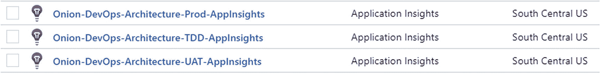
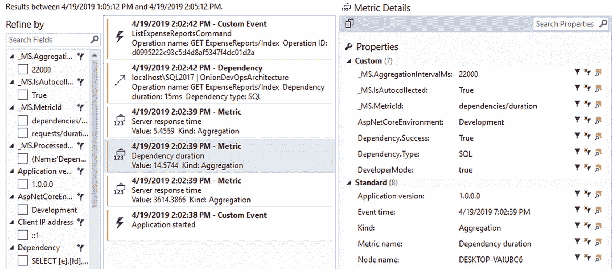

# 10.操作和监控释放

一旦我们的软件变更在生产中部署和运行，我们才刚刚开始。考虑我们的 DevOps 模型，该模型在本书开头的图 [10-1](#Fig1) 中介绍。我们必须有一个操作策略。然后，我们必须始终如一地执行该策略，并采取措施来确保我们所期望事情正在发生。我们围绕外部的 DevOps 循环要求将学习作为对未来变化规划的反馈。通过让真正的客户使用该软件，我们可以


图 10-1

Onion DevOps 架构为完整的 DevOps 环境提供了一个模型

1.  确认我们的客户能够实现他们的目标

2.  了解下一步最好的改变是什么

在围绕洋葱外部的循环中，释放阶段刚好过了循环的中点。在将软件发布给我们的客户之后，我们必须很好地操作它，了解它是如何执行的，然后将这种学习反馈到未来的计划中。本章将介绍操作我们的的基础知识。Azure 中的. NET 软件。

## 原则

在围绕质量和测试的讨论中，软件系统的一个理想特征被称为**可测试性**。软件架构师和工程师可以讨论系统的设计和其中的组件，并评估设计的可测试性。当在 Azure 或任何环境中操作软件系统时，系统的一个理想特性是**可观察性**。以下是原则:

*   **随时了解你的软件在做什么**

    仅仅知道服务器已启动或网站在线是不够的。如果系统的任何功能不再按需要运行，那么客户就停机了。我们应该从我们的客户和他们的目标的角度考虑问题。如果客户不能工作，那么客户就停机了，即使我们系统的技术部分是正常的。有了这个镜头，我们可以问自己“我们需要知道什么，才能确信我们的客户已经上线？”

*   **听听你的系统在说什么**

    通过各种类型的遥测，你可以让你的软件系统发射，它说话。倾听系统的要求。Eric Hexter 是 DevOps Diagnostics 的一位远见卓识者，他在向 Azure DevOps 用户组 <sup>[1](#Fn1)</sup> 演示时提到，通过遥测技术，系统可以请求非功能性功能或维护。通过检查日志和指标，我们可以发现需要在系统上完成的工作。这项工作可能不会出现在常规的产品积压中。

许多团队讨论应该成为软件一部分的日志级别。此外，许多公司已经建立了某种类型的警报。如果来自客户的故障单或问题报告，这是系统缺乏可观察性和复杂性的一个迹象。把这方面的工作看作是一份保险。为了在这个领域取得成功，确实需要在产品上投入精力、时间和金钱。这种保险政策有一个保费，必须支付风险规避的回报。如果忽略这一点，并且没有支付保险费，您的组织将支付业务中断的全部损失。这是“左移”思维方式的另一个例子，我们可以在系统中设计可观察性，从而为我们的客户提供更好的服务。

Sam Guckenheimer 在 Azure DevOps 播客采访中讨论了可观察性及其重要性。 <sup>[2](#Fn2)</sup>

## 可观察性架构

虽然这一章不能涵盖可观察性可以采取的所有技术或形式，但我们将把重点放在普遍适用于作者认为如果> 80%。商业世界中的. NET 应用程序。让我们从您的软件应该发出的遥测类型开始:

*   **指标/性能计数器**

其中许多都内置在 Azure 平台中，但是如果你使用队列，你会想要捕捉队列长度。另一个有用的指标是过去一小时/一天内当前使用您的系统的用户数量(按类型)。这些类型的趋势可以用来触发警报。例如，如果您的正常使用量意外下降，您可能遇到了需要调查的技术问题。

*   **日志消息/日志文件**

虽然这是最常见的遥测方式，但并不总是如此。系统执行的每个操作或事务都应该被记录。此外，应该将来自各种组件的日志文件和日志消息聚集并集中到一个存储库中，该存储库可以作为一个整体进行查询，以便提供系统正在做什么的完整画面。

*   **心跳**

它是活的吗？心跳可以来自外部，也可以直接内置于应用程序组件本身。这些是内置健康检查的信号和合成事务。例如，如果一个关键的集成是在应用程序和一个支付处理器之间，那么知道与支付处理器的连接是起作用的是有用的。集成因中断而臭名昭著，持续测试集成的心跳可以在客户沮丧地通知我们某个软件功能不起作用之前提醒我们。

图 [10-2](#Fig2) 展示了 Azure 中可观察性的架构模型。虽然市场上有许多产品可以收集、聚合和搜索遥测数据，但我们将重点关注 Azure 内置的功能。


图 10-2

每个应用都应该向单个应用洞察服务发送遥测和诊断信息

Application Insights 能够从应用的每个运行组件中收集大量信息，包括作为系统一部分的 DevOps 管道本身。我们提高软件可观察性的方法之一是在同一个地方收集所有可用的信息。Application Insights 提供了。如果你以前从未使用过 Application Insights，也称为 AppInsights，微软在其文档中有一个很好的概述。 <sup>[3](#Fn3)</sup>

正如你在我们的 DevOps 管道中看到的，我们有一个稳定的生产环境，一个或多个 UAT 环境，以及一大堆不断被创建和破坏的 TDD 环境。您将希望 AppInsights 中的数据能够在环境发生变化时保持持久性。考虑下面的环境架构。

通过为每个环境类型提供一个 AppInsights 实例，我们可以针对受众调整每个环境类型的查询。例如，我们的 TDD 环境将随着新构建的产生而有环境来来去去。通过在执行全系统验收测试时捕获性能指标，我们可能能够检测到事务的运行时变化何时超过某个百分比。这可能表示版本之间的性能下降。此外，我们的生产 AppInsights 存储库应该配置了警报。参见图 [10-3](#Fig3) 。


图 10-3

每个环境都受益于 AppInsights 实例，然后可以将该实例聚合到日志分析或其他分析接收器

AppInsights 的目的是为每个应用提供一个 AppInsights 服务。虽然您可以向遥测添加自定义标记，以便在单个 AppInsights 实例中过滤掉环境，但该服务并没有考虑到这一点。该服务旨在从单个应用程序中收集遥测数据。也就是说，一个版本化的、完整的软件单元。如果您已经使用多个 DevOps 管道将您的软件分成多个 Git 存储库，您仍然可以为在生产中运行的软件系统使用单个 AppInsights 服务。要做出这个决定，您必须问自己希望对数据执行什么样的查询，以及希望如何将数据分段。对于我们的示例应用程序，我们有多个组件将遥测发送到每个环境的单个 AppInsights 实例。我们总共有三个 AppInsights 服务，每个环境一个。现在您可以看到应用程序组件和 AppInsights 之间的关系，让我们开始在我们的软件中启用可观察性。

## 跳跃启动可观察性

虽然我们在破坏和重建 TDD 环境——有时还有 UAT 环境——但我们希望 AppInsights 经久耐用。因此，我们将 AppInsights 服务放在一个与可能被破坏的环境分开的资源组中。


图 10-4

资源组

这些服务位于它们自己的资源组“Onion-devo PS-Architecture-diagnostic”中。您可以随意命名这个资源组。与您的预生产环境相比，该资源组将存在很长时间，如图 [10-5](#Fig5) 所示。一旦我们准备好 AppInsights，就该准备发送遥测数据的应用程序了。首先，将 AppInsights NuGet 包添加到 Visual Studio 中的项目中。ASP.NET 项目有一些快速启动工具来帮助解决这个问题，但是您可以将这些包添加到您喜欢的任何项目中。在我们的 Visual Studio 解决方案中，我们将核心项目的依赖性保持在最低限度——本质上，这个库包含普通的旧 C#对象(POCOs)。正因为这些，我们才会选择 UI 和核心。接收 AppInsights 依赖项的 AppStartup 项目，如图 [10-6](#Fig6) 所示。


图 10-6

核心项目只是没有依赖关系的 POCOs，因此 AppInsights 将被添加到 Core 中。AppStartup 和 UI



图 10-5

每种环境类型在与环境相同的区域中都有一个专用的 AppInsights 实例

要选择的 NuGet 包是 Microsoft . application insights . aspnetcore。此包适用于在 Azure AppServices 中运行的代码，包括 WebJobs 和 Azure 函数。在 Windows 虚拟机上运行的软件还有其他软件包，但是如果您的应用程序。网芯，你只需要这一个。

一旦您有了可用的 AppInsights NuGet 包，您将希望在应用程序中找到一个架构上合适的位置来观察正在发生的事务，以便可以将信息发送到 AppInsights。在这个应用程序中，我们已经实现了一个总线模式，用户意图被打包成一个 C#消息(对象)。命令和查询对象沿总线“向下”发送以供执行。我们可以在 TelemetrySink 类中添加一些拦截代码，如下所示:

```
using Microsoft.ApplicationInsights;
using Microsoft.ApplicationInsights.DataContracts;

namespace ClearMeasure.OnionDevOpsArchitecture.Core.AppStartup
{
    public class TelemetrySink : ITelemetrySink
    {
        public void RecordCall<TResponse>(IRequest<TResponse> request,
            TResponse response)
        {
            var telemetryClient = new TelemetryClient();
            EventTelemetry telemetry = new EventTelemetry();
            telemetry.Name = request.GetType().Name;
            telemetryClient.TrackEvent(telemetry);
            telemetryClient.TrackTrace(request.GetType().Name +
                ":- " + request.ToString(), SeverityLevel.Information);
        }
    }
}

```

如果您还没有研究本书示例应用程序的源代码，以下代码来自 ExpenseReportController ASP.NET MVC 控制器操作:

```
public IActionResult Index()
{
    var command = new ListExpenseReportsCommand();
    ExpenseReport[] reports = _bus.Send(command);
    var orderedReports = reports.OrderBy(report => report.Number);
    return View(orderedReports.ToArray());
}
//..//
public class ListExpenseReportsCommand : IRequest<ExpenseReport[]>
{

}

```

用户界面中的代码接收用户的请求，并通过总线发送出去。请求是列出费用报告。这个类实现了 IRequest <t>接口。我们的 TelemetrySink 可以通过几行代码访问流经应用程序的每个请求，并记录该请求的跟踪和自定义事件。在您的应用程序中，您可能会提取关于应用程序正在做什么、执行操作的用户以及其他相关元素的更多信息，以供以后查询。除了此代码之外，还要注意确保 appsettings.json 文件不会将遥测数据从工作站发送到环境的 AppInsight 实例。事实上，注意不要意外地从 AppInsights 资源中获取任何插装键。appsettings.json 文件可能如下所示:</t>

```
{
  "Logging": {
    "LogLevel": {
      "Default": "Debug"
    }
  },
  "AllowedHosts": "∗",
  "ApplicationInsights": {
    "InstrumentationKey": "bogus value"
  }
}

```

通过在 ApplicationInsights 中放一个假值。InstrumentationKey，您将确保不会从本地开发人员工作站发送遥测数据。相反，您可以通过在调试(F5)模式下运行应用来试验和验证您的遥测技术。

Application Insights 搜索窗口可能有点难找到，但它允许您在本地开发诊断功能，而不必连接到 Azure。您需要确保您正在导出您认为是您导出的遥测数据。当您在调试模式下运行应用程序时，您不仅可以检查您添加的遥测数据，还可以检查为您自动捕获的大量数据。参见图 [10-7](#Fig7) 。


图 10-7

AppInsights 窗口可用于查看本地工作站上的遥测，而无需连接到 Azure

您在图 [10-8](#Fig8) 的顶部添加了自定义事件，但是您没有添加任何内容来捕获从应用程序运行到 SQL Server 数据库的 SQL 语句。该视图允许您搜索任意数量的属性，以了解有关您的应用程序的更多信息。要挖掘更多数据，您可以在调试会话中捕获遥测数据的同时，从命令行运行全套自动化全系统验收测试:

```
dotnet vstest .\ClearMeasure.OnionDevOpsArchitecture.AcceptanceTests.dll

```


图 10-9

运行验收测试后，您可以在 Application Insights 中看到所有捕获的遥测数据



图 10-8

AppInsights 为您捕获通用指标和依赖关系

(参见图 [10-9](#Fig9) )。

如果您从 acceptance tests assemblies 的文件夹中运行前面的命令，您可以收集相当多的遥测数据进行搜索。当您等待浏览器窗口停止在屏幕上闪烁时，您会想要休息一会儿喝杯茶或咖啡，因为所有的 Selenium 测试都会尽可能快地测试您的应用程序。

有趣的是，Application Insights 不会自动捕获任何数据、参数或参数。因此，您必须添加代码来显式地做到这一点。当您这样做时，请注意将任何敏感数据字段导出到监视系统，该系统可能具有与生产数据库不同的数据安全控制。然后，一旦你对你的应用程序有一个有用的遥测迭代感到满意，就该把应用程序与你的 Azure 订阅中各种特定于环境的 AppInsights 服务链接起来了。

Application Insights 不会自动捕获任何用户数据或 SQL 参数。如果您需要捕获参数，您可以直接添加，注意敏感的数据字段。

为了执行我们的部署，知道新的候选版本何时从一个环境升级到另一个环境是很重要的。为此，您将向您的部署步骤添加一个发布注释任务。


图 10-10

发布注释任务在 AppInsights 中标记部署

您可能希望将此作为第一个任务，这样即使部署失败，Application Insights 也会收到一个标记，表明部署已经开始。这样，即使部署中途失败，AppInsights 也会记录一个版本开始部署。在以后的某一天，当回顾一段时期的异常和糟糕的失败时，您不必绞尽脑汁去记住一个糟糕的部署与一段时期的高异常相关联。在“UI Deploy”步骤中，您还将把 appsettings.json 文件添加到 json 变量替换文本区域，以便针对 JSON 替换对变量进行评估。


图 10-11

AppInsights 检测密钥位于 appsettings.json 文件中

一旦完成了配置，并且为每个环境添加了一个带有 InstrumentationKey 的正确命名的变量之后，您的发布配置就可以部署了。参见图 [10-12](#Fig12) 。


图 10-12

每种环境都需要自己的工具密钥

当您的下一个版本运行时，您将能够看到来自每个环境的版本标记和遥测。除了您获得的生产可观察性之外，发现非功能性缺陷(如可伸缩性问题)也很有用。随着您的验收测试的运行，您的发布候选接受它的第一次全系统测试。

我们的示例应用程序只有少量的验收测试，因此捕获的数据仅仅来自这些测试；然而，当您有多个并行执行发布的特性分支，并且您有多个同时创建操作的 TDD 环境时，您将在图 [10-13](#Fig13) 中看到所有这些。搜索将能够关联版本。


图 10-13

我们的 TDD 环境的 AppInsights 性能视图现在显示了我们的发布标记，它与验收测试的运行相关联

在每个中标记和嵌入版本号。NET 程序集对下游有好处和影响。Application Insights 中的遥测记录版本号。确保版本号可用。

如果您单击 Azure 门户中的版本标记，您可以看到关于部署了负责记录遥测的应用程序的版本的详细信息。

发布标记包括返回到发布和 Azure DevOps 项目的超链接，该项目针对的是发出遥测数据的应用程序，如图 [10-14](#Fig14) 所示。BuildNumber 起源于持续集成构建，它包含了 Application Insights 中记录的每一个遥测数据。现在，您已经将 Visual Studio 中的代码与 Azure 环境中实时捕获的使用数据连接起来，存储在 Git 中。


图 10-14

AppInsights 中的发布标记记录了关于部署应用程序的发布的大量信息

## 包裹

你做到了！您已经在上完成了整个 DevOps 流程。NET for Azure。“DevOps 过程”这个术语在某些圈子里被讨论得好像是一件简单的事情。您可以从本文中看到，为了实现“DevOps 流程”的功能，有许多概念、决策和步骤需要一起完成。当适当地组合在一起时，团队行动迅速，可以在需要时进行更改，并且能够很好地操作软件。您可能希望采取与本书中的指导不同的一些步骤。如果您已经有了一个完全可操作的 DevOps 环境，并且至少具备了本书中介绍的所有功能，那么您就已经掌握了。实现你的想法。如果您还没有一个至少具备这些功能的全功能 DevOps 环境，本文作者建议您“按常规”实现 DevOps。然后，一旦您可以在非常短的代码变更周期内操作到生产环境中的稳定部署，就进行您的变更。在你的 DevOps 之旅中，使用 ShuHaRi <sup>[4](#Fn4)</sup> 的概念。在 [`https://dev.azure.com/clearmeasurelabs/Onion-DevOps-Architecture`](https://dev.azure.com/clearmeasurelabs/Onion-DevOps-Architecture) 经常回头参考本书附带的在线公共项目。

## 文献学

福勒，硕士(未注明)。*舒哈里*。从 [MartinFowler 检索。com](http://martinfowler.com) : [`www.martinfowler.com/bliki/ShuHaRi.html`](http://www.martinfowler.com/bliki/ShuHaRi.html)

Guckenheimer，S. (2018，9 24)。Sam Guckenheimer 谈测试、数据收集和 DevOps 报告的状况。(J. Palermo，采访者)检索自 [`http://azuredevopspodcast.clear-measure.com/sam-guckenheimer-on-testing-data-collection-and-the-state-of-devops-report-episode-003`](http://azuredevopspodcast.clear-measure.com/sam-guckenheimer-on-testing-data-collection-and-the-state-of-devops-report-episode-003)

赫克斯特，e .(未注明)。*devo PS Diagnostics w/Eric hex ter(Azure devo PS 用户组)。*检索自 [`www.youtube.com/watch?v=6O-17phQMJo`](http://www.youtube.com/watch%253Fv%253D6O-17phQMJo)

微软。(未注明日期)。*什么是应用洞察？*从微软文档中检索: [`https://docs.microsoft.com/en-us/azure/azure-monitor/app/app-insights-overview`](https://docs.microsoft.com/en-us/azure/azure-monitor/app/app-insights-overview)

<aside class="FootnoteSection" epub:type="footnotes">Footnotes [1](#Fn1_source)

德克斯特

  [2](#Fn2_source)

古肯海默，2018

  [3](#Fn3_source)

微软，挪威

  [4](#Fn4_source)

北卡罗来纳州福勒

 </aside>