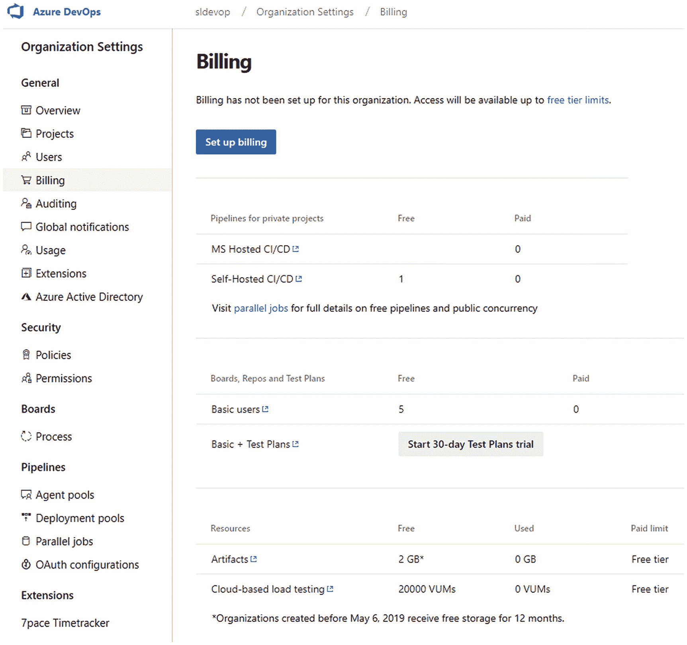

# 一、Azure Boards 入门

[Lesson 1-1\. Creating an Azure DevOps Organization](#Sec1) [Lesson 1-2\. Creating a Public/Private Agile Project](#Sec2) [Lesson 1-3\. Comparing Project Templates](#Sec3) [Work Item Types](#Sec4) [Process Templates](#Sec5) [Work Item State Flows](#Sec6) [Lesson 1-4\. Navigating Azure Boards](#Sec7) [Summary Page](#Sec8) [Dashboards](#Sec9) [Wiki](#Sec10) [Work Items](#Sec11) [Boards](#Sec12) [Backlogs](#Sec13) [Sprints](#Sec14) [Queries](#Sec15) [Lesson 1-5\. Customizing Organization Settings](#Sec16) [Lesson 1-6\. Previewing Features and Themes](#Sec17) [Summary](#Sec18)

本章的目标是让你开始使用 Azure DevOps 中的 Azure Boards。您将首先创建一个新的 Azure DevOps 组织。在本章中，你将学习不同的过程模板，并对 Azure Boards 有一个全面的了解，然后在接下来的章节中深入讨论更多的细节。

## 第 1-1 课。创建 Azure DevOps 组织

本课解释如何创建新的 Azure DevOps 组织。

***先决条件*** :你需要有一个微软账号( [`https://account.microsoft.com/account`](https://account.microsoft.com/account) )。

按照以下步骤创建一个新的 Azure DevOps 项目:

图 1-2

命名组织

1.  Go to `dev.azure.com`. If you have a Microsoft account, you can log in by clicking “Sign in to Azure DevOps.” Otherwise, you can use the “Start free” option. See Figure [1-1](#Fig1).

    

    图 1-1

    Azure DevOps 登录页面

2.  登录 Azure DevOps 或通过 start free 流程后，您可以创建一个新的 DevOps 组织。登录后，单击新建组织。

3.  为新组织命名，并从下拉列表中选择组织区域。该区域定义了正在创建的 Azure DevOps 组织的主要 Azure 区域。但是，您的数据被复制到其他 Azure 数据中心，以确保高可用性。在本例中，您可以看到组织名称是 sldevop。输入相关详细信息后，单击继续按钮创建一个组织。参见图 [1-2](#Fig2) 。

这大约需要一分钟，然后您将被重定向到新 Azure DevOps 组织的起始页。

在本课中，您创建了一个新的 Azure DevOps 组织，将在本书的其余课程中使用。

## 第 1-2 课。创建公共/私有敏捷项目

在本课中，我们将讨论如何使用敏捷流程模板创建私有和公共项目。创建新的 DevOps 项目时，可以将项目创建为公共项目或私有项目。如果项目是私有的，只有授权的人才能访问项目。如果您创建了一个公共项目，任何拥有 Microsoft 帐户的人都可以访问该项目，这在您处理开源项目时非常有用。

***先决条件*** :你需要有一个 Azure DevOps 组织。

让我们创建一个私有项目，以敏捷为过程模板，以 Git 为版本控制系统。

图 1-3

创建新的 DevOps 项目

1.  转到`dev.azure.com`并使用您的 Microsoft 帐户凭证登录。

2.  在“组织”部分，选择您在上一课中创建的组织。

3.  当您访问新创建的组织时，默认情况下，您将获得项目创建页面作为起始页。如果组织中有可用的项目，您将在 Azure DevOps 起始页的右上角看到“创建项目”按钮。

4.  输入项目名称，选择 Private，将 Git 设置为版本控制系统，将 Agile 设置为工作项流程。然后点击“创建项目”来创建项目。参见图 [1-3](#Fig3) 。

现在，您已经使用敏捷流程模板创建了一个新的 DevOps 项目。

Azure DevOps 提供了四个流程模板。这些是基本、敏捷、CMMI 和 Scrum。创建新项目时，可以从“工作项流程”下拉列表中选择首选流程模板。

本课解释了如何创建一个新的 Azure DevOps 项目，使用 Git 作为版本控制系统，使用 Agile 作为流程模板。此外，你学习了用基本、CMMI 和 Scrum 过程模型创建项目是可能的。让我们在下一课中了解有关这些项目模板的更多信息。

## 第 1-3 课。比较项目模板

Azure DevOps 促进了四种主要的过程模型:基本、Scrum、敏捷和 CMMI。通过参考本课中的比较说明，您可以发现这些流程模型之间的差异。

### 工作项类型

在理解什么是流程模型之前，我们必须在 Azure DevOps 中定义工作项。一个*工作项目*是你作为团队成员或作为一个团队所做的任何类型的工作。Azure DevOps 中的*工作项类型* (WIT)带有字段和特定的工作流，使您能够跟踪团队正在执行的工作。特性、用户故事/需求/产品待定项、Bug、任务、测试用例等等，是一些默认的可用工作项类型。您甚至可以引入自己的工作项类型，并改变现有默认工作项类型的行为。

### 流程模板

有了这样的理解，让我们看看 Azure DevOps 中可用的流程模板。

1.  **基础**:大多数轻量级流程模型提供三种工作项类型作为默认工作项:Epic、Issue 和 Task。想要简单地开始并在继续使用 Azure DevOps 时建模流程的团队可以选择这个模板。

2.  Scrum :这个模板最适合将 Scrum 作为过程模型的团队。默认情况下，在 Scrum 模板中，bug 是和产品 backlog 项目一起被跟踪的，您可以配置 Boards 来跟踪与任务工作项目级别相同级别的 bug。此流程模板中的任务仅跟踪剩余的工作。

3.  敏捷:使用敏捷方法(包括 Scrum)的团队可以使用这个过程模型。默认情况下，系统会在 Agile 模板的任务级别上跟踪 bug，但是您可以配置在用户故事级别上跟踪 bug。

4.  CMMI:遵循能力成熟度模型并使用更正式的过程来跟踪变更需求的团队可以使用这个模板来跟踪他们的工作。可以跟踪需求、变更请求、评审和风险，使团队能够遵循和坚持 CMMI 过程标准。

图 [1-4](#Fig4) 显示了比较每个流程模型的流程模板概述。

图 1-4

流程模型概述

在敏捷和 CMMI 过程模型中，您可以配置 Bug 工作项，以便与用户故事/需求级别一起被跟踪，类似于 Scrum 模板的默认 Bug 工作项的跟踪行为。在 Scrum 过程中，你可以将 bug 设置在与任务相同的层次上。这些配置将在后面的章节中讨论，届时你将在实践课程中学习如何配置 Azure Boards。

所有过程模板中都有一组公共的工作项类型。对于管理测试，有以下工作项类型:测试计划、测试套件、测试用例共享步骤和共享参数。反馈请求和反馈审核用于管理项目反馈。代码评审请求和代码评审响应是支持管理代码评审的两种工作项类型。所有这些不同类型的工作项都将在本书的相关区域中讨论。

### 工作项状态流

每个流程模型中的工作项都包含一个表示工作项当前状态的状态字段。基本模板包含四个可用流程模板中最简单的状态工作流。图 [1-5](#Fig5) 显示了默认情况下每个模板中的状态。可以引入自己的状态，用继承的模板修改模板；这将在本书第五章[中讨论。](05.html)

图 1-5

工作项状态

在 Azure DevOps 中，工作项状态被分类到状态类别中。每个流程模板都包含“已提议”、“进行中”和“已完成”状态类别。移除状态类别在 Scrum 和敏捷模板中使用。“已解决状态”类别用于 Agile 和 CMMI 模板中。图 [1-6](#Fig6) 显示了每个模板中使用的状态类别以及默认分配给它们的状态。您可以在“已解决”类别和“进行中”类别中看到“已解决”状态。这是因为在 bug 的上下文中，两个模板的“已解决状态”类别中都使用了“已解决状态”。但是，两个模板中的用户情景/需求都处于“进行中”类别下的“已解决”状态。

图 1-6

国家类别

除了在工作项状态之间转换时的工作流状态之外，您还可以选择状态转换的原因。当您将一个工作项从 New 状态转移到 Active 状态时，Implementation Started 就是这样一个原因。这些原因进一步解释了状态转换。在本书后面的章节中，您将了解到更多关于每种工作项类型的状态转换。图 [1-7](#Fig7) 显示了敏捷模板中用户故事工作项的默认转换。

图 1-7

用户故事默认过渡

在本课中，我们确定了 Azure DevOps 中流程模板之间的主要差异。当您为团队选择合适的模板时，这些信息将非常有用。

## 第 1-4 课。导航 Azure Boards

你可以通过左侧菜单浏览 Azure DevOps 中几乎所有的主页面。本课将让您简要了解概述和电路板部分的可用功能。

将鼠标悬停在左侧菜单中的概述菜单项上。然后，您将在模型窗格中看到摘要、仪表板和 Wiki。我们现在将确定每个区域的特征。

### 摘要页面

你可以进入 Azure DevOps 摘要页面，方法是转到 Azure DevOps 项目的左侧菜单，选择概述菜单，然后选择摘要子菜单项。参见图 [1-8](#Fig8) 。

图 1-8

摘要子菜单项

在摘要页面上，您会发现五个部分。参见图 [1-9](#Fig9) 。

图 1-9

摘要页面

图 1-15

当前项目类型和邀请按钮

1.  **Edit project name**: Click the pencil icon next to the project name. See Figure [1-10](#Fig10). After clicking the pencil icon, you will navigate to the project’s edit page.

    

    图 1-10

    项目的编辑铅笔图标

    On the project’s edit page, you will find the sections shown in Figure [1-11](#Fig11).

    

    图 1-11

    项目属性编辑页面

    1.  编辑项目名称。

    2.  添加或编辑项目描述。

    3.  查看过程模板。

    4.  将项目可见性选项更改为私有或公共。

    5.  保存更改。

    6.  添加项目管理员。

    7.  Remove services from the project by clicking the button in front of each service. After clicking the button, the Remove Service pop-up will appear. As an example, if you click the On button in front of Boards, a pop-up will open that has a Remove Boards button on it. See Figure [1-12](#Fig12). After clicking the Remove Boards button, the Boards service will be removed from the project.

        

        图 1-12

        删除电路板服务的服务弹出窗口

    8.  通过单击“删除”按钮删除项目。

2.  **Project welcome message section**: You can see a welcome message and buttons to navigate through the project. This area has buttons to navigate to boards, repos, pipelines, test plans, and artifacts. Also, there is a link to navigate to the service management area of a project’s edit page. See Figure [1-13](#Fig13).

    

    图 1-13

    项目欢迎消息部分

3.  **项目状态区**:该区域显示项目进度图。您将在后面的章节和本系列的其他书籍中探索这一点。

4.  **Members**: The names of all the project members are displayed here. See Figure [1-14](#Fig14). It is possible to view more information about each member by clicking the name of the member.

    

    图 1-14

    项目成员姓名

5.  **添加新成员**:该部分有两个按钮。灰色按钮表示当前的项目类型。这可以是私有的，也可以是公共的。第二个按钮是邀请按钮。见图 [1-15](#Fig15) 。

单击邀请按钮后，左侧模型窗格将会打开。您可以添加和搜索团队成员的姓名。然后单击添加按钮将成员添加到仪表板。参见图 [1-16](#Fig16) 。

图 1-16

邀请成员加入项目

### 仪表盘

仪表板帮助您可视化项目进度。Azure DevOps 提供了创建多个仪表板的工具。您可以从 marketplace 添加默认的小部件和附加的小部件，以便在这些仪表板中可视化项目进度。让我们看一下图 [1-17](#Fig17) 来理解仪表板中的选项。

图 1-17

Azure DevOps 仪表板

1.  添加新仪表板、在仪表板之间导航、搜索仪表板以及浏览所有可用的仪表板选项。

2.  The team profile settings in the right-side model pane will open when you click this icon. In the team settings section, you can see the names of the project members and navigate through the project. There is a capability to navigate to boards, backlogs, sprints, and dashboards. See Figure [1-18](#Fig18).

    

    图 1-18

    团队设置

3.  By clicking the edit button, it is possible to add, edit, move, or resize the dashboard widgets. Azure DevOps provides a facility to add marketplace widgets, as well as charts generated using the project queries, to the team dashboard. See Figure [1-19](#Fig19).

    

    图 1-19

    添加小部件

4.  您可以通过单击此刷新图标来刷新仪表板。

5.  单击此嵌齿轮图标仪表板设置后，窗口打开。您可以通过弹出窗口更改仪表板设置。

6.  将页面视图更改为全屏模式。

7.  在新的项目中，你会发现这个按钮。这将帮助您导航到图 [1-19](#Fig19) 中提到的小部件管理区域。

### 维基网

Azure DevOps 有一个 wiki 部分，它提供了创建自己的文档的工具。创建维基有两种选择。见图 [1-20](#Fig20) 。本课解释了如何创建自己的维基。我们将在本系列的未来书籍(Azure Repos)中讨论如何将代码作为 wiki 选项发布。将代码发布为 wiki 是一种允许您通过引用存储库文件夹中的`.md`文件来创建 wiki 的机制。

图 1-20

添加 wiki 页面

单击创建 wiki 按钮后，您将被导航到 Wiki 的编辑页面。见图 [1-21](#Fig21) 。

图 1-21

维基的编辑页面

1.  维基有三个标题选项。您可以单击向下箭头，然后选择标题。

2.  向 wiki 添加粗体文本。

3.  向维基添加斜体文本。

4.  添加指向 wiki 的链接。

5.  向 wiki 添加代码。

6.  向 wiki 添加项目符号列表。

7.  向 wiki 添加编号列表。

8.  向 wiki 添加任务列表。

9.  向 wiki 添加表格。

10.  在 wiki 中提及工作项目。

11.  将文件插入维基。

12.  向 wiki 添加 HTML。

13.  点按“更多选项”后，您将能够看到 wiki 的其他可用功能。

    The options are as follows:
    *   插入目录

    *   插入视频

    *   插入 Yaml 标记

    *   插入公式

    *   插入团队成员

    *   插入查询结果

14.  您可以选择“仅编辑视图”、“仅预览视图”或“编辑和预览视图”

15.  保存 wiki。

16.  单击名为 Pages 的侧窗格后，可以从部分显示中添加新页面。

到目前为止，您已经浏览了 Overview 下的子菜单项。下一节将带您浏览电路板菜单。您可以找到工作项、板、积压、冲刺和查询作为板的子菜单项。

### 工作项目

您可以在 Azure DevOps 项目的 Boards 下找到 Work Items 子菜单项。参见图 [1-22](#Fig22) 。

图 1-22

侧菜单中的工作项目子菜单项

让我们确定工作项下可用的特性。参见图 [1-23](#Fig23) 。

图 1-23

工作项目页面

1.  您可以使用此下拉列表中可用的过滤器来过滤工作项。以下是过滤选项:
    *   **最近更新的**:显示最近更新的工作项目

    *   **分配给我**:显示分配给登录的指定团队成员的工作项目

    *   **跟随**:显示标记如下的工作项

    *   **提及的**:显示与提及的标签有讨论的工作项

    *   **我的活动**:显示工作项，以及成员在每个工作项上执行的活动的详细信息

    *   **最近完成的**:显示属于已完成类别的工作项

    *   **最近创建的**:显示最近创建的工作项

2.  您可以从此部分添加新的工作项。当您单击向下箭头时，您可以在下拉列表中看到工作项类型。此下拉列表包含当前过程模板中可用的工作项列表。在 Agile 流程中，您可以查看以下工作项目:
    *   病菌

    *   史诗

    *   特征

    *   问题

    *   工作

    *   判例案件

    *   用户故事

3.  您可以通过单击此按钮导航到查询。

4.  After clicking the column options button, the left-side model pane will open. You can add or remove columns from here. Furthermore, you can change the column order. See Figure [1-24](#Fig24).

    

    图 1-24

    列选项窗格

5.  您可以删除工作项目，回收站将包含已删除的项目。

6.  您可以看到视图选项。这允许您打开按钮来查看已完成的工作项目。

7.  这允许您查看过滤器。您会发现以下过滤器选项可用:
    *   **按关键字过滤**:按关键字过滤工作项

    *   **类型**:根据工作项类型过滤工作项

    *   **分配给**:根据分配的用户过滤工作项

    *   **状态**:根据状态过滤工作项

    *   **区域**:按区域过滤工作项

    *   **标签**:按标签过滤项目

8.  您可以在这里更改屏幕尺寸。这允许您移动到全屏模式。

### 板子

您可以在这里看到 board 视图中的工作项。默认情况下，您可以在面板中看到四列，分别代表 Agile 流程中工作项生命周期的各个阶段。让我们来确定“公告板”页面上的功能。参见图 [1-25](#Fig25) 。

图 1-25

公告板页面

1.  In front of the team name you can see the down arrow to open a drop-down. From this drop-down you can select the teams available in the project and search teams. See Figure [1-26](#Fig26).

    

    图 1-26

    团队下拉列表

2.  您可以通过单击此图标导航到工作项的 backlog 视图。

3.  您可以通过点击此图标打开团队设置窗口。

4.  速度图为您提供了团队在每个 sprint 中的速度，基于在给定 sprint 期间完成的 backlog 项目的大小。对于每个 sprint，图表中会显示一个条形。我们将在第 [6](06.html) 章对此进行更多讨论。

5.  累积流程图提供了特定时间段内每个状态下工作项目数量的面积图。我们将在第 [6](06.html) 章进一步讨论这一点。

6.  您可以从此下拉列表中选择不同的工作项类型，以过滤板上的工作项。默认情况下，您只能找到用户故事和要素类型。

7.  您可以使用此视图选项来打开实时更新选项。如果您启用实时更新，对其他地方的工作项目所做的更改将自动更新到您的留言板中。

8.  您可以添加过滤器来过滤板上的工作项目。以下是可用的过滤器选项:
    *   **按关键字过滤**:使用关键字过滤，例如工作项名称的一部分

    *   **类型**:按工作项类型过滤，如特征

    *   **分配给**:通过给出团队成员名称来过滤值

    *   **标签**:用标签值过滤值

    *   **迭代**:过滤属于所选迭代的值

    *   **区域**:过滤属于每个团队的值

    *   **父工作项**:使用父工作项类型进行过滤

9.  您可以通过单击此图标进入设置页面。

10.  您可以使用此按钮切换到页面的全屏模式。

11.  您可以使用此箭头隐藏新列。

12.  您可以使用此箭头隐藏闭合的列。

13.  您可以添加新的工作项。

14.  您只能筛选第一列中的值。

### 存货

待办事项为您提供了待办事项列表。您可以从向 backlog 添加工作项开始。默认情况下，选择产品积压级别作为积压级别。您可以使用 Backlogs 页面右上角的下拉菜单来更改投资组合积压级别。参见图 [1-27](#Fig27) 。

图 1-27

积压水平

backlog 允许您选择一些选项来启用不同的视图。参见图 [1-28](#Fig28) 。

图 1-28

查看待办事项的选项

1.  这允许您显示待定项的父层次结构。当此选项打开时，无法打开预测。

2.  预测允许您根据工作项的大小和团队的速度来预测交付待定项需要多少次迭代。我们将在本书后面的章节中讨论这一点。

3.  此设置定义是否在 backlog 视图中显示进行中状态的 backlog 项目。

4.  此设置在侧窗格中显示父项目组合待办事项。

5.  此设置在侧窗格中显示迭代。这在计划迭代时更容易，因为您可以将项目从 backlog 拖到迭代中。

6.  您可以关闭侧窗格。

Filter 支持通过一些有用的字段或者通过关键字搜索来过滤工作项，关键字搜索可以搜索 backlog 项的标题。参见图 [1-29](#Fig29) 。

图 1-29

过滤积压

在 backlog 页面上还有其他几个有用的选项。让我们快速浏览一下。见图 [1-30](#Fig30) 。

图 1-30

积压页面中的选项

1.  您可以向待办事项中添加新的工作项。

2.  这允许你选择不同的团队。我们将在本书的第 [7](07.html) 章讨论同一个团队项目中的多个团队。

3.  将当前团队添加到收藏夹列表。

4.  查看右侧弹出的团队设置窗格。

5.  切换到板子视图。

6.  Backlog 视图侧窗格中的打开列选项。您可以通过拖放来添加/删除列或对它们进行重新排序。

7.  为待办事项创建查询。

8.  通过电子邮件发送从待办事项中选择的工作项。

9.  切换待办事项视图级别。

10.  速度图为您提供了团队在每个 sprint 中的速度，基于在给定 sprint 期间完成的 backlog 项目的大小。对于每个 sprint，图表中会显示一个条形。我们将在第 6 章中讨论这一点。

11.  累积流程图提供了特定时间段内每个状态下工作项目数量的面积图。我们将在第 6 章中讨论这一点。

12.  这些是我们之前讨论过的视图选项。

13.  这些是我们之前讨论过的过滤器。

14.  板的设置。我们将在第 4 章中讨论这一点。

15.  将 backlog 视图扩展到全屏。

### 短距离赛跑

Sprints 页面允许您查看以前、当前和未来的 sprint。让我们快速浏览一下 Sprints 页面中的可用选项。见图 [1-31](#Fig31) 。

图 1-31

Sprints 页面选项

1.  这显示了 task board 视图，其中 sprint/iteration 的故事/(产品待办事项)pbi/bug 将与子任务一起显示。

2.  这是 sprint/iteration 工作项的 backlog 视图。

3.  This is the capacity for team members. You can define Activity as the daily capacity of team members and set the days for the individuals or for the team. See Figure [1-32](#Fig32) .

    

    图 1-32

    团队能力

4.  当项目中有多个团队时，您可以切换团队。

5.  您可以将团队添加到收藏夹列表。

6.  打开“团队设置”侧窗格。

7.  Add new work items to the sprint/iteration. If bugs are set to use at the User Story/PBI/Requirement level, you can add bugs to the sprint as well. See Figure [1-33](#Fig33). We will discuss configuring the bug behavior in Chapter [3](03.html).

    

    图 1-33

    向 sprint backlog 添加一个项目

8.  您可以选择 sprint/iteration 来查看。

9.  这是设置迭代日期的快捷方式。

10.  The view options (see Figure [1-34](#Fig34)) for the Sprints page in the task board view allows you to group tasks by assigned person or by the parent backlog item. The group by options are not available in the Sprints backlog view. The side pane provides two view options. “Work details” shows the capacity versus effort requirements when the capacity for the team is defined and tasks are added with remaining work. We will discuss details about capacity and remaining work in Chapter [2](02.html). The Planning option will show current and future sprints, allowing you to drag and drop work items for planning purposes.

    

    图 1-34

    “弹簧”页面上的视图选项

11.  筛选器允许您筛选和搜索工作项。

12.  这将在 task board 视图或 sprint backlog 的上下文中打开团队的设置。我们将在第 [4](04.html) 章讨论这些设置。

13.  这允许您扩展到全屏模式。

14.  这是冲刺阶段的燃尽图。我们将在第 6 章中讨论这一点。

15.  这是任务板视图中的待办事项工作项卡片。

16.  这允许您为给定的待办事项添加子任务。

### 问题

查询有助于您查看和可视化您的工作项。你可以在 Azure DevOps 中编写简单和复杂的查询。我们将在第 [6](06.html) 章深入讨论查询。现在让我们快速浏览一下查询页面上的可用内容。见图 [1-35](#Fig35) 。

图 1-35

查询页面

1.  收藏夹显示标记为您的收藏夹或团队收藏夹的查询。

2.  这将列出所有查询。

3.  您可以开始创建新的查询。

4.  您可以创建文件夹，将查询分组到“我的查询”或“共享查询”下。

5.  您可以过滤查询。

6.  “我的查询”是您唯一可以使用的查询。

7.  团队的所有成员都可以查看共享查询。

“我的查询”列表在每个查询的上下文菜单中有几个选项。见图 [1-36](#Fig36)

图 1-36

我的查询菜单

1.  运行查询。

2.  在查询编辑器中编辑查询。我们将在第 [6](06.html) 章详细讨论查询。

3.  重命名该查询。

4.  删除该查询。

在“共享查询”区域，有几个附加菜单选项可用。见图 [1-37](#Fig37) 。

图 1-37

共享查询菜单

1.  将查询添加到团队收藏夹。

2.  为共享查询设置安全性。

3.  将查询添加到仪表板以实现可视化。

在这一课中，我们给了你一个 Azure Boards 及其接口的概述。

## 第 1-5 课。自定义组织设置

Azure DevOps 中有几个组织级别的设置，允许您设置 Azure DevOps 组织的行为。让我们看看本课中的可用选项。

您可以通过单击 Azure DevOps 组织主页中的“组织设置”导航到组织的设置页面。见图 [1-38](#Fig38) 。

图 1-38

获取组织设置

在“概述”选项卡上，您可以根据需要更改组织名称。但是，这样做应该小心，因为组织的 URL 会随着名称的改变而改变。从旧 URL 的重定向不会发生，用户必须手动开始使用新的 URL。此选项用于将网址从 [`https://orgname.visualstudio.com`](https://orgname.visualstudio.com) 更改为 [`https://dev.azure.com/orgname`](https://dev.azure.com/orgname) 。默认情况下，任何新组织都使用新的 URL 模式。隐私策略 URL 可以设置为您组织的数据保护和隐私策略文档 URL。可以在概览页面上更新组织的时区选择。可以将组织的所有权转移给另一个可以从“概述”( Overview)选项卡访问组织的用户。见图 [1-39](#Fig39) 。如果不再需要该组织，您也可以从概览页面中删除该组织。

图 1-39

组织设置页面上的概述选项卡

“项目”选项卡列出了组织中所有可用的团队项目。您可以重命名团队项目或删除团队项目。单击“新建项目”将允许您创建新的团队项目。见图 [1-40](#Fig40) 。

图 1-40

项目选项卡

用户选项卡将在第 [8](08.html) 章中用安全选项描述。

“计费”选项卡允许您通过将 Azure DevOps 组织与 Azure 订阅连接来设置计费。见图 [1-41](#Fig41) 。设置好账单后，你就可以从 marketplace 向 Azure DevOps 添加付费扩展了。我们将在第 10 章[中讨论扩展。测试计划的默认可用试用延期可从该计费页面激活 30 天试用。](10.html)

图 1-41

Azure DevOps 的计费

“审核”选项卡允许您查看组织中的管理操作审核。日志可以按日期范围过滤，并可以 CSV 和 JSON 格式下载。见图 [1-42](#Fig42) 。

图 1-42

审计

全局通知允许您禁用默认情况下进行的组织级通知订阅。通过此页面上的设置，您可以将向成员电子邮件发送通知作为一项全局策略。见图 [1-43](#Fig43) 。这可以在项目级别被覆盖。我们将在第 4 章[中详细讨论通知。](04.html)

图 1-43

全局通知

使用选项卡将显示 Azure DevOps 与几个过滤器功能的使用情况。您可以按时间段、用户等进行筛选，以查看使用情况的详细信息。见图 [1-44](#Fig44) 。

图 1-44

使用

我们将在第 [10 章](10.html)中讨论扩展选项卡。Azure Active Directory 选项卡允许您将 Azure DevOps 组织与贵公司的 Azure Active Directory 相关联。如果您的组织是使用组织用户创建的，那么它将自动与组织的 Azure Active Directory 链接。但是，您可以将使用 Microsoft 帐户创建的 Azure DevOps 组织与公司 Azure Active Directory 相关联。在关联之前，您需要将 Azure DevOps 组织的所有权转移给公司中有权访问公司 Azure Active Directory 的用户。关于如何做到这一点的更多信息，您可以参考 [`http://chamindac.blogspot.com/2019/05/join-personal-azure-devops-organization.html`](http://chamindac.blogspot.com/2019/05/join-personal-azure-devops-organization.html) 。

我们将在本书的第 [8](08.html) 章讨论 Azure DevOps 组织级别的安全策略和权限。其他组织设置将在本系列的相关书籍中介绍。例如，代理池将在*Azure Pipelines*手册中介绍。

在本课中，我们讨论了一些有助于设置 Azure DevOps 组织行为的组织级设置。

## 第 1-6 课。预览功能和主题

Azure DevOps 服务通常带有预览功能。您可以为自己启用这些功能，也可以为您的组织启用其中一些功能。此外，您可以选择在 Azure DevOps 中使用浅色或深色主题。让我们看看如何设置这些选项。

点击 Azure DevOps 左上角的个人资料头像会显示一个菜单。在此菜单中，您可以单击“预览功能”来查看任何可用的预览功能。主题菜单项可用于打开主题设置。见图 [1-45](#Fig45) 。

图 1-45

预览功能和主题

单击“预览功能”后，将打开一个窗格，您可以在其中为您的帐户或组织启用或禁用预览功能。见图 [1-46](#Fig46) 。

图 1-46

预览功能

在主题设置中，您可以选择一个可用的主题，它将应用于您。见图 [1-47](#Fig47) 。

图 1-47

主题

在本课中，您学习了如何根据您的偏好启用预览功能和更改主题。

## 摘要

在本章中，您探索了如何通过创建 Azure DevOps 组织开始。我们解释了如何使用不同的模板创建团队项目，并比较了过程模型/模板，让您了解 Azure Boards 在支持典型的软件开发过程模型(如敏捷、Scrum 和 CMMI)方面的能力。此外，我们讨论了基本流程模型，以便帮助您的团队以最简单的方式开始使用 Azure Boards。此外，我们还讨论了如何定制组织设置，如何启用和禁用预览功能，以及如何使用主题。

我们给了你一个 Azure Boards 和 overview 部分中所有可用区域的快速概述。现在，您对电路板有了一个总体的了解，可以在接下来的章节中深入了解各个领域。在下一章，我们将讨论如何以一种简单的方式建立一个团队项目，让你在一个小团队的环境中开始使用 Azure Boards。