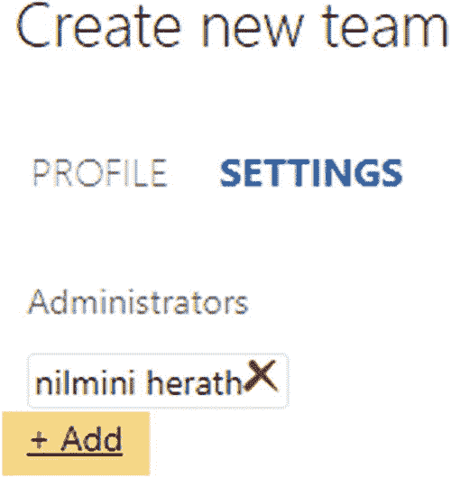
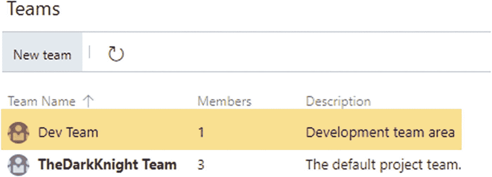
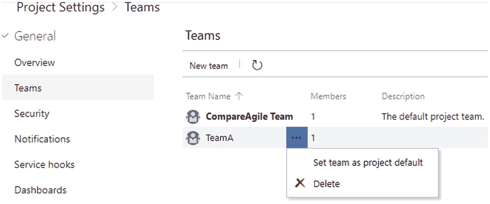
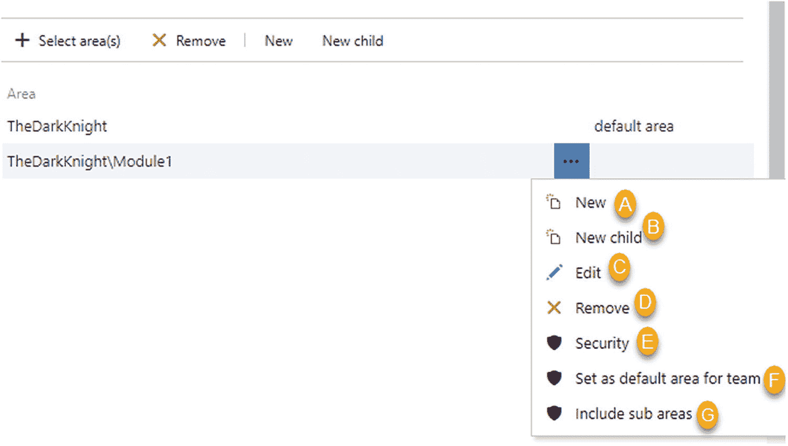
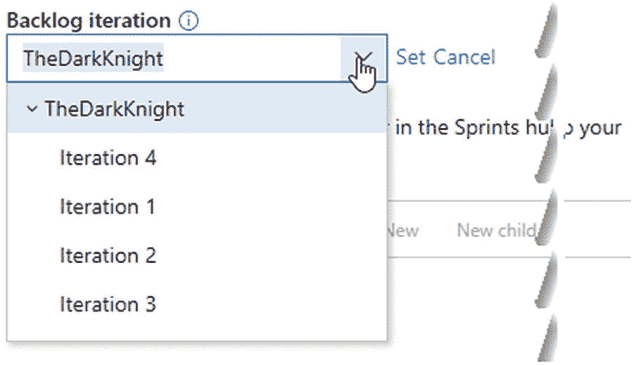
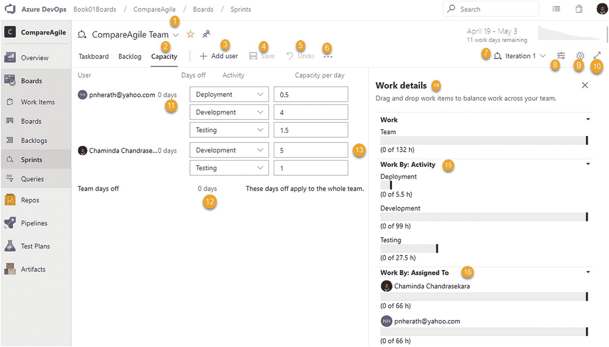
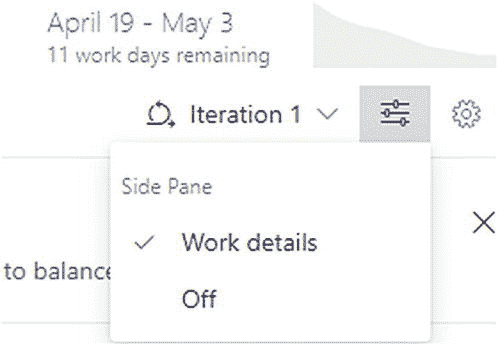

# 二、设置团队项目

[Lesson 2-1\. Creating a Team](#Sec1) [Lesson 2-2\. Defining Common Project Settings](#Sec2) [Project Settings](#Sec3) [General Project Settings](#Sec4) [Boards Settings](#Sec5) [Lesson 2-3\. Setting Up Areas](#Sec6) [Project Areas](#Sec7) [Team Areas](#Sec8) [Lesson 2-4\. Setting Up Releases and Iterations](#Sec9) [Team Project Iterations](#Sec10) [Team Iterations](#Sec11) [Lesson 2-5\. Setting Up Team Members and Permissions](#Sec12) [Lesson 2-6\. Defining Team Capacity and Days Off](#Sec13) [Summary](#Sec14)

本章的目的是帮助你创建一个 Azure DevOps 项目，并使用 Azure Boards 来计划和交付工作。最初的准备包括添加团队成员、设置区域和迭代，以及规划团队能力。在本章结束时，你将对 Azure Boards 团队项目中的初始设置要求有一个透彻的理解。

## 第 2-1 课。创建团队

作为起点，让我们看看如何在团队项目中创建新团队。我们在前一章中介绍了如何建立一个新的团队项目。

***先决条件*** :你需要有一个微软账号，并在你担任管理员的 Azure DevOps 组织中有一个新的 Azure DevOps 团队项目。

在 Azure DevOps 项目中，您可以在设置部分创建新团队。转到项目设置，然后在常规部分选择团队。您将看到“新团队”链接。单击链接添加新团队。见图 [2-1](#Fig1) 。此外，您将能够在团队部分看到现有的团队。

图 2-1

使用项目设置添加新团队

点击“新团队”链接后，您将看到一个弹出菜单，允许您创建一个新团队。让我们来识别弹出窗口的每个部分。参见图 [2-2](#Fig2) 。

图 2-2

创建新团队的弹出窗口

图 2-4

添加新团队管理员

1.  说出队伍的名字。

2.  添加团队描述。

3.  You can add the team to any existing security groups in this drop-down. Then members of this team will get the same permission as the selected group. See Figure [2-3](#Fig3).

    

    图 2-3

    选择安全组以添加团队权限

4.  如果要用团队名称创建区域路径，可以选中此复选框；否则，您可以创建没有区域路径的团队。有些情况下，您可能需要将团队添加到现有区域路径或根区域路径中。因此，您可以取消选中该复选框，并创建一个没有区域路径但有团队名称的团队。

5.  您可以转到设置选项卡。您可以在此设置部分添加团队管理员。移至 Settings 选项卡后，您将看到现有的团队管理员，以及用于添加新团队管理员的 Add 链接。参见图 [2-4](#Fig4) 。

完成此操作后，单击添加链接，将会打开一个新的弹出窗口。您可以使用此弹出窗口添加管理员。您将能够看到身份下拉列表。您可以从此下拉列表中选择将成为新团队管理员的项目成员。参见图 [2-5](#Fig5) 。此外，您可以添加 Azure DevOps 服务当前不知道的新用户。输入新用户的登录地址后，您可以点击“检查姓名”来验证输入姓名的有效性。选择或输入团队成员后，单击“保存更改”将所选成员添加为管理员。

图 2-5

选择现有项目成员作为管理员

如果您单击“浏览”链接，您可以搜索并选择现有项目成员作为管理员。参见图 [2-6](#Fig6) 。选择成员后，您可以单击“添加”按钮将所选成员添加为管理员。

图 2-6

搜索团队成员

1.  单击“创建团队”按钮创建团队。

2.  单击“取消”按钮取消团队的创建。

创建新团队后，您将能够在“项目设置”页面的“团队”部分看到该团队。参见图 [2-7](#Fig7) 。

图 2-7

新创建的团队

在本课中，您学习了如何在 Azure DevOps 项目中创建新团队。您也知道您可以根据您的项目需求添加多个团队。

## 第 2-2 课。定义通用项目设置

让我们看看本课中的所有项目设置，同时详细了解以前课程中未涉及的部分。

### 项目设置

要查看项目设置，可以点击团队项目页面左下方的“项目设置”(图 [2-8](#Fig8) )。项目设置部分有多个区域。

图 2-8

项目设置

1.  导航到项目设置部分。

2.  该区域包含常规设置。

3.  此区域包含与 Azure Boards相关的设置。

4.  此区域包含与 Azure 管道相关的设置。

5.  此区域包含与 Azure repos 相关的设置。

6.  此区域包含与测试相关的设置。

让我们看看与 Azure Boards 相关的常规和 Boards 部分。其他部分将在本系列的后续相关书籍中讨论。

#### 常规项目设置

常规项目设置是团队项目的通用设置。这个区域有几个分区。参见图 [2-9](#Fig9) 。

图 2-9

常规设置

图 2-16

仪表板权限

1.  **概述**:此部分包含项目名称和项目可见性选项等设置，以启用或禁用项目的 Azure DevOps 服务。我们在第 [1](01.html) 章中详细介绍了这一部分。

2.  **Teams**: This section contains a list of teams available in the team project. You can create a new team by clicking “New team.” Each team has a context menu that allows you to set the team as the default team of the team project or delete the default setting, if it is not the default one anymore. See Figure [2-10](#Fig10).

    

    图 2-10

    团队部分

3.  **安全**:团队项目的安全设置可以在这里定义。我们将在第 8 章[中进一步讨论这个问题。](08.html)

4.  **Notifications**: This section lets you subscribe to notifications generated by Azure DevOps based on events that occur on work items, builds, and so on. See Figure [2-11](#Fig11).

    

    图 2-11

    通知

    1.  Allows you to create a new subscription for a notification/alert. Select the category of the alert and use the available template to set up the notification. See Figure [2-12](#Fig12).

        

        图 2-12

        新订阅

    当您单击“下一步”时，您将能够添加通知和订阅的过滤标准。我们将在第 [3](03.html) 章讨论订阅通知。

    1.  “帮助”将带您到有关通知的 Microsoft 文档。

    2.  您可以将界面扩展到全屏模式。

    3.  这表明对警报的订阅是默认订阅。这些不能编辑。但是，它们可以被禁用，如 f 所示。

    4.  您可以启用或禁用订阅。

    5.  这将打开订阅上下文菜单。

    6.  您可以查看默认订阅的详细信息。编辑和删除选项将可用于创建的自定义订阅。

    7.  您可以为团队项目选择一个团队。

    1.  The “Delivery setting” section lets you set the preferences of notification delivery for a given team. You can set up notifications to be delivered to a fixed e-mail address, deliver them to individual team members, or not deliver them at all. See Figure [2-13](#Fig13).

        

        图 2-13

        “传送设置”部分

5.  **Service hooks**: These can be created for many services such as Microsoft Teams to allow you to notify those services based on an event in Azure DevOps. You can get notified at your own web URL as well. For that you can select Web Hooks in the dialog that appears after clicking “Create subscription” in the Service Hooks section. See Figure [2-14](#Fig14).

    

    图 2-14

    设置服务挂钩

    You can select from the many events available such as work item created, build completed, and so on. See Figure [2-15](#Fig15).

    

    图 2-15

    服务挂钩触发器

    然后，您可以提供想要将事件发布到的 URL，还可以包含任何身份验证信息，以授权发布到该 URL。您还可以过滤发送的信息，并为 web 挂钩定义格式。更多信息，请参考 [`https://docs.microsoft.com/en-us/azure/devops/service-hooks/services/webhooks?view=azure-devops`](https://docs.microsoft.com/en-us/azure/devops/service-hooks/services/webhooks%253Fview%253Dazure-devops) 。

6.  **仪表板**:这个部分允许您定义团队成员创建、编辑和删除仪表板的权限。只有团队管理员或更高级别的用户(如项目管理员或集合管理员)可以更改这些设置。见图 [2-16](#Fig16) 。

#### 电路板设置

在 Boards 设置中，您可以定义迭代、团队项目级别的区域以及给定团队的区域和迭代。此外，在“电路板”部分还可以设置一些通用设置。让我们首先确定 Boards 下的子部分。参见图 [2-17](#Fig17) 。

图 2-17

电路板设置

1.  **项目配置**:这个部分允许您为团队项目定义区域和迭代。我们将在本章的下两节课中详细讨论这些。

2.  **团队配置**:您可以在这里为选定的团队选择团队迭代和区域以及一些其他设置。让我们看看您可以在此部分设置的团队设置。

3.  **GitHub 连接**:这允许你建立一个连接，这样你就可以在集成到 GitHub repos 时使用 Azure Boards。我们将在第 10 章[中进一步讨论这个问题。](10.html)

##### 团队配置常规选项卡

在此选项卡上，可以通过在团队项目中选择一个团队来设置常规设置。参见图 [2-18](#Fig18) 。

图 2-18

团队设置，常规选项卡

1.  选择一个团队。

2.  选择团队的待办事项级别。

3.  定义团队的工作日。

4.  定义如何在团队中使用 bug 工作项。选项是用需求/用户故事/产品 backlog 项管理同一级别的 Bug，用任务管理 Bug，或者不在公告板中显示 Bug 工作项。我们将在第 [3](03.html) 章讨论这一点。

我们将跳过对迭代和区域标签的讨论，因为我们将在本章中为它们提供单独的课程。

##### 团队配置模板选项卡

Template 选项卡允许您为选定团队中的工作项创建模板。使用模板链接，您可以使用模板中定义的预定义值创建新的工作项。参见图 [2-19](#Fig19) 。

图 2-19

团队设置，模板

1.  选择团队。

2.  选择工作项。

3.  创建新模板。

4.  这是模板的上下文菜单。

5.  编辑模板。

6.  删除模板。

7.  复制链接以使用模板创建工作项。

8.  创建模板的副本，并使用选定的模板值打开新的模板创建对话框。

在“新建模板”“创建/编辑模板”对话框中，可以定义模板的名称和描述。您可以在此对话框中为模板选择多个字段并为其设置值。此外，您可以提供一个注释，当通过模板提供的链接创建工作项时，该注释将被添加为讨论注释。参见图 [2-20](#Fig20) 。

图 2-20

编辑模板

您可以拷贝该链接，并在任何浏览器或应用中使用它。该链接将带您到相关的工作项创建页面，模板中的值会自动填充。见图 [2-21](#Fig21) 。

1.  我们将在第 [10](10.html) 章讨论 GitHub 连接。

图 2-21

使用模板创建工作项

在本课中，您了解了常见的常规设置和与主板相关的设置。这些设置对你开始使用 Azure Boards 很重要。

## 第 2-3 课。设置区域

Azure DevOps 中的区域路径通过按产品、功能或业务区域对工作项进行分组，帮助您将工作模块化。新项目将有一个对应于项目名称的根区域，以及在创建新团队项目时创建的默认团队。

### 项目领域

要查找项目中可用的区域路径列表，请选择“项目设置”，选择“项目配置”，然后选择“区域”选项卡。您将能够看到项目的所有可用区域路径。见图 [2-22](#Fig22)

图 2-22

项目设置的区域路径部分

您将能够看到根区域和所有作为子区域添加的区域。您可以在此部分添加新的子区域。见图 [2-23](#Fig23)

图 2-23

区域列表

1.  当您选择子区域时，此链接将被启用。它允许您在与所选项相同的级别中添加另一个区域。

2.  您可以将子项目添加到选定的项目中。

3.  可以拓展一个层次。

4.  可以折叠一级。

您可以使用点按现有区域名称前面的三个点时打开的面板中的选项来添加新项目。见图 [2-24](#Fig24) 。

图 2-24

选定项目区域上下文菜单

如果您单击根项目前面的三个点，您将能够看到“New child”和 Security 项目是唯一启用的项目。让我们来识别窗格中的每个选项。

图 2-28

区域安全

1.  Add a new item to the same level as the selected item. Click New, and a pop-up will open. You can name the new area path, and the default location is the root area. See Figure [2-25](#Fig25).

    

    图 2-25

    添加新的区域路径

2.  向选定项添加新的子项。点击此链接后，您将能够看到类似于图 [2-25](#Fig25) 的弹出窗口。

3.  Click Edit to edit the name of the area path and change the parent item of the area path. After you click Edit, pop-up will open. It allows you to change the area path name and location. See Figure [2-26](#Fig26).

    

    图 2-26

    编辑区域名称和位置

4.  You can delete the area by clicking Delete. If you click Delete, you will see a pop-up message. You can delete an area by clicking the “Delete path” button in the pop-up, and any existing work item will be moved to the reassignment path selected, as shown in Figure [2-27](#Fig27).

    

    图 2-27

    删除区域

5.  您可以使用此选项控制给定区域的权限。当您单击上下文菜单中的安全性时，将会打开一个安全性弹出窗口，允许您控制区域权限。参见图 [2-28](#Fig28) 。

既然您已经为项目级别配置了区域路径，那么让我们来研究团队级别的区域路径设置。

### 团队区域

团队可以选择团队项目中定义的区域的子集。一个区域可以由多个项目共享，并且可以使用单独的区域路径将同一团队项目中一个团队的工作项与另一个团队的工作项隔离开来。

单击项目设置，展开讨论板，然后单击团队配置。然后单击区域选项卡查看团队的区域设置。参见图 [2-29](#Fig29) 。

图 2-29

团队区域

1.  您可以在选定区域的同一层创建一个新区域。

2.  您可以为所选区域创建一个新子区域。

3.  您可以编辑选定的区域。

4.  您可以从团队中移除所选区域。

5.  您可以打开选定区域路径的“权限”对话框，在其中设置权限。

6.  您可以将所选区域设置为团队的默认区域。

7.  您可以包含所选区域的子区域，以便团队可以看到所选区域及其所有子区域的工作项。

1.  您可以在团队项目中选择一个团队。

2.  可以更改团队的默认区域。当在团队的上下文中创建时，团队的默认区域决定了新创建的工作项的区域路径字段被设置为哪个区域路径。

3.  Select the area for the team using the pop-up that opens. It is possible to select multiple areas at once using the +Area button. You can check the Include subareas to make work items belong to the selected areas and all child areas of the selected areas and make them visible to the team. Removing a selected area before saving is possible via the X in the right corner of the selected area path. See Figure [2-30](#Fig30).

    

    图 2-30

    为团队选择区域

4.  移除选定的区域。

5.  在所选区域的同一层创建一个新区域。当您从团队中添加区域时，它们也将在团队项目级别可用。

6.  为所选区域创建子区域。

7.  团队的默认区域自动选择为选定区域。

8.  This loads the context menu of a given selected area. See Figure [2-31](#Fig31).

    

    图 2-31

    选定的团队区域上下文菜单

在本课中，您探索了团队项目和团队级别的区域路径配置。这些知识将帮助您根据业务需求对工作项目进行分组。

## 第 2-4 课。设置发布和迭代

迭代路径允许您基于时间盒间隔对工作项进行分组，例如 sprints 或迭代。与区域路径类似，迭代路径可以在项目级别定义，团队可以将它们作为共享或独立的迭代使用。这一课将解释如何在项目层面上建立迭代，并在团队层面上使用它们。

### 团队项目迭代

让我们尝试从团队项目的设置页面向 Azure DevOps 项目添加新的迭代。

单击“项目设置”，然后在“板”部分选择“项目配置”。然后，您将能够看到“迭代”选项卡。选择 Iterations 选项卡，您将看到 Azure DevOps 团队项目中的默认迭代集。见图 [2-32](#Fig32) 。

图 2-32

团队项目迭代

您会发现一个迭代，其名称与项目名称及其子迭代的名称相似。从这里可以添加新的子迭代。如果你点击根迭代(图 [2-32](#Fig32) 中的 DarkKnight)，你会看到一个变灰的新链接。当您单击子项目时，它会变成可单击的。这是因为您不能在根迭代级别中创建相同级别的迭代。您可以使用任何子级迭代中的新链接在同一级别添加新的迭代。要向任何选定的迭代添加子迭代，请使用“New child”链接。见图 [2-33](#Fig33) 。

图 2-33

迭代工具栏

1.  将新项目添加到与选定项目相同的级别。

2.  向选定项添加新的子项。

3.  扩展一级。

4.  折叠一级。

让我们用新的链接在迭代 1 的相同级别添加一个新的迭代。选择迭代 1 并单击新链接。将出现一个弹出窗口，允许您通过给出迭代名称、迭代开始日期和迭代结束日期来创建新的迭代。见图 [2-34](#Fig34) 。您可以将开始日期和结束日期留空，并在以后需要时进行设置。

图 2-34

新迭代

如果您试图向迭代 1 添加一个新的子迭代，您将能够看到相同的弹出窗口。唯一的区别是位置将是 DarkKnight\Iteration1。

除了使用前面提到的 New 和“New child”链接之外，您还可以通过单击每个迭代旁边的三个点时打开的上下文菜单来添加新的迭代。见图 [2-35](#Fig35) 。

图 2-35

迭代上下文菜单

图 2-38

迭代权限

1.  将新迭代添加到与所选迭代相同的级别。

2.  向所选迭代添加新的子迭代。

3.  You can edit the iteration values using this option. After clicking the edit button, a pop-up will appear, and you will be able to edit the iteration name, start date, end date, and location from the pop-up dialog. See Figure [2-36](#Fig36).

    

    图 2-36

    编辑迭代

4.  Delete the selected iteration with the Delete option. After you click Delete, you will see the pop-up where you can select a path to reassign the work items if any belong to the deleted iteration. See Figure [2-37](#Fig37).

    

    图 2-37

    删除迭代

5.  您可以使用这个选项来控制迭代的安全性。单击此安全菜单项后，将出现一个弹出窗口。您可以通过此弹出窗口控制迭代权限。见图 [2-38](#Fig38)

到目前为止，您已经了解了如何向 Azure DevOps 项目添加迭代。现在，您将学习当您的项目有多个团队时，如何使用迭代。

### 团队迭代

转到项目设置，然后选择常规下的团队。您将看到团队项目中可用团队的列表。见图 [2-39](#Fig39)

图 2-39

组

现在单击所需团队之一。团队档案将会打开。单击“管理此团队的其他设置”项目下的“迭代和区域”链接。见图 [2-40](#Fig40) 。这将导航到所选团队的团队配置值。单击迭代选项卡。

图 2-40

团队简介

你可以点击“项目设置”,然后点击 Boards 下的“团队配置”,而不是浏览该路径。然后可以点击 Iterations 选项卡，并从页面顶部的下拉列表中选择所需的团队。见图 [2-41](#Fig41) 。

图 2-41

团队迭代

图 2-43

为团队选择迭代

1.  您可以在这里找到团队的默认迭代。团队的默认迭代决定了在团队上下文中创建新工作项时要添加到哪个迭代中。本例中的开发团队将所选择的当前迭代作为默认迭代。这意味着当您添加一个新的工作项时，它会被添加到当前的迭代中。

2.  You can change the backlog iteration of the team from here. The backlog iteration determines which work items are shown in the team’s backlog and boards. You can change these backlog iteration values by using the Change link. After clicking the Change link, select iterations from the drop-down and click Set to save the selected value or click Cancel to dismiss the changes. See Figure [2-42](#Fig42).

    

    图 2-42

    更改待定项迭代

3.  您可以将迭代添加到团队中。在图 [2-43](#Fig43) 中，您可以看到没有为团队选择迭代。您可以点击“选择迭代”链接，并将迭代添加到团队中。见图 [2-43](#Fig43) 。

添加迭代之后，团队将能够使用迭代/冲刺。此外，您将看到一个上下文菜单可用于一个选定的迭代，其中包含我们在团队项目的选定迭代中讨论过的相同操作。见图 [2-44](#Fig44) 。

图 2-44

选定的迭代上下文菜单

因为迭代在结构上是分层的，并且您可以根据实际需要定义时间盒，比如将多个迭代组合成一个发布迭代。这违背了敏捷方法，敏捷方法是关于在每一次冲刺/迭代中交付一个可交付的产品。然而，在现实世界中，即使您可能在每次迭代中都有可交付的产品，交付给实际的客户也可能发生在几次迭代之后。设置示例如图 [2-45](#Fig45) 所示。

图 2-45

发布和迭代

在本课中，您了解了如何在团队项目中设置迭代并在团队中使用它们。如前所述，在给定的团队中，迭代可以被共享或者单独使用。

## 第 2-5 课。设置团队成员和权限

一个团队应该有团队成员来执行工作。本课将介绍如何向团队中添加新成员。您可以单独或成组添加成员。

首先，让我们确定 Azure DevOps 团队项目中可用的默认组以及每个组的权限。

转到项目设置，并在常规部分选择安全性。您将被导航到安全区域，在这里您可以控制团队成员和组的权限。见图 [2-46](#Fig46) 。

图 2-46

团队项目安全性

让我们在本课中确定安全设置的基本功能；你会在本书的第 8 章学到更多关于安全的知识。见图 [2-47](#Fig47) 。

图 2-47

团队项目权限

1.  Create a new group using this link. Clicking this link will open up a dialog. You will be able to add new group details using the pop-up window. See Figure [2-48](#Fig48).

    

    图 2-48

    创建新的安全组

2.  您可以过滤用户和组。

3.  您可以显示 Azure DevOps 项目中所有可用的团队。

4.  您可以显示 Azure DevOps 项目中可用的所有组。

5.  “权限”( Permission)选项卡显示所选团队或组的所有权限。

6.  “成员”( Members)选项卡显示所选团队或组的成员。

7.  您可以编辑或删除选定的团队或组。

现在你对 Azure DevOps 团队项目中的组有了一个基本的概念；让我们转到 Azure DevOps 项目的团队设置，看看如何在那里设置权限。

转到项目设置，选择团队，并从团队列表中选择特定团队的名称。您将被导航至团队简介。

单击“添加”按钮添加新成员。参见图 [2-49](#Fig49) 。

图 2-49

向团队添加成员

将出现一个弹出窗口，允许您添加新的团队成员。您可以通过提供登录地址或群别名来添加成员。见图 [2-50](#Fig50) 。

图 2-50

添加新成员或组

此外，您可以从团队简档中添加团队管理员。单击添加按钮，将出现一个弹出窗口。见图 [2-51](#Fig51) 。

图 2-51

添加团队管理员

使用弹出窗口将单个成员或组添加为团队管理员。

我们在本课中讨论了团队权限设置。您学习了如何将个人成员和组添加为团队成员。此外，我们讨论了如何向团队中添加管理员。

## 第 2-6 课。定义团队能力和休息日

我们在上一课中定义了迭代。在迭代中，您可以定义团队的能力，以允许您找到团队中每种活动类型的可用能力。这将增强团队承诺完成迭代的能力，并让您了解团队是否能够满足所做的承诺。

从 Boards 下的侧边菜单中选择 Sprints/Iterations 菜单项。从下拉列表中选择需要定义产能的团队。然后转到容量选项卡。见图 [2-52](#Fig52) 。

图 2-52

团队能力

1.  选择团队。在此下拉列表旁边，您可以单击星号图标将团队添加到收藏夹列表，并且您可以单击人员图标来查看团队档案。

2.  您可以在此选择容量选项卡。

3.  您可以将团队成员添加到能力规划中。

4.  您可以保存容量计划。

5.  您可以在保存之前撤消对容量规划所做的更改。

6.  You can add all the team members and copy the capacity planning of the previous sprint/iteration to the current/future one. See Figure [2-53](#Fig53).

    

    图 2-53

    团队能力上下文菜单

7.  您可以选择冲刺/迭代。

8.  You can show/hide work details in the side pane. See Figure [2-54](#Fig54).

    

    图 2-54

    配置侧窗格

9.  您可以打开设置页面，我们将在接下来的章节中讨论。

10.  您可以转到全屏视图。

11.  You can define individual days off. You can add multiple periods of days off and remove added days off by clicking the X to the right of the days off. See Figure [2-55](#Fig55).

    

    图 2-55

    个人休息日

12.  您可以定义适用于团队所有成员的团队休假。

13.  You can add another activity type from the available list to a given member and set capacity. You can remove the user or one of the activity types for a user as well. See Figure [2-56](#Fig56).

    

    图 2-56

    团队休息日

14.  您可以在侧窗格中查看工作细节。我们将在第 [3](03.html) 章中讨论这个窗格，其中描述了分配给给定 sprint 的工作项目的工作评估。

15.  您可以按活动查看工作能力和工作分配。

16.  您可以按团队成员查看工作能力和分配。

在本课中，您探索了如何为给定迭代的团队成员建立团队能力。我们将在接下来的章节中更多地讨论团队能力和工作评估。

## 摘要

在本章中，您探索了如何在团队项目中创建团队，以及如何使用常规和 Azure Boards 相关的设置。此外，我们讨论了如何建立区域、迭代和团队能力。这将使您能够开始使用 Azure DevOps 板，并遵循本书中的后续课程。

在下一章中，你将学习到如何设置面板和工作条目，以及如何使用面板来处理工作条目。