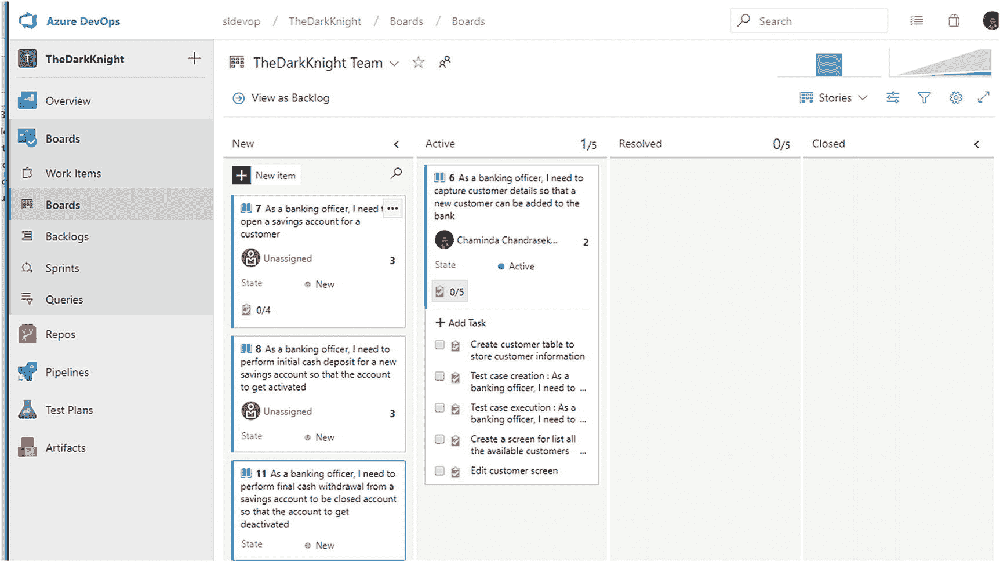
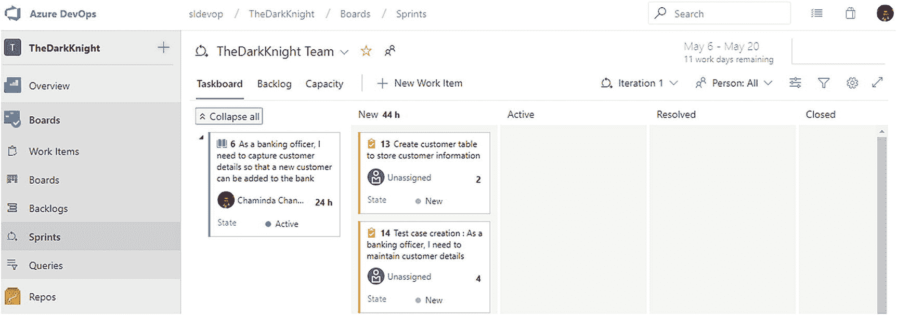

# 3.处理积压工作和纸板

[Lesson 3-1\. Understanding the Backlog Hierarchy](#Sec1) [Lesson 3-2\. Defining a Backlog](#Sec2) [Organizing Epics in a Hierarchy](#Sec3) [Adding Features to Epics](#Sec4) [Adding Stories to Features](#Sec5) [Adding Tasks to User Stories](#Sec6) [Changing the Parent](#Sec7) [Using the Work Item Context Menu in the Backlog View](#Sec8) [Lesson 3-3\. Exploring Important Work Item Fields](#Sec9) [Common Important Work Item Fields](#Sec10) [Lesson 3-4\. Selecting Work to Move to an Iteration](#Sec11) [Lesson 3-5\. Using Kanban Boards and Task Boards](#Sec12) [Kanban Boards](#Sec13) [Task Boards](#Sec14) [Lesson 3-6\. Working with a Bug Work Item](#Sec15) [Managing Bugs with Tasks](#Sec16) [Managing Bugs with Requirements](#Sec17) [Bugs Not Managed with Requirements or Tasks](#Sec18) [Summary](#Sec19)

跟踪您的团队所做的工作非常重要，这样您就可以对团队的工作方式进行流程改进并提高生产率。你的团队的工作可以在 Azure DevOps 中被捕获为*工作项*，你可以使用各种板子和 backlogs 来组织和计划工作项。在这一章中，我们将介绍 Azure Boards 中的一些选项，这些选项用于分层组织工作，使用看板规划工作流程，以及使用迭代来规划基于时间的工作周期。我们还将讨论使用敏捷/Scrum 或传统流程成功运行您的项目团队的可用特性，包括您必须处理在开发和测试流程或生产过程中发现的软件错误的选项。

***先决条件*** :你必须已经通读了这本书的前两章，这样你就具备了成功学习本章内容所需的基本理解。

## 第 3-1 课。了解积压层次结构

Azure DevOps 允许您在 backlog 中创建一个层次结构，根据业务需求对工作进行分组。默认情况下，Azure DevOps 团队中启用了两个级别的积压工作，如第 2-2 课所述。它们是敏捷、Scrum 和 CMMI 所有三个模板的特性，敏捷工作流的用户故事，Scrum 中的产品待办事项，或者 CMMI 的需求。第 2-2 课还解释了如何启用 Epic 的顶层待办事项。还有另一种方法来启用或禁用团队的待办事项级别。在团队的 backlog 或 board 视图中，您可以通过单击页面右上角累积流程图正下方的齿轮图标来打开设置弹出窗口。在“设置”弹出窗口的“常规”部分，您可以在“积压”选项卡上启用或禁用团队中要使用的积压级别。见图 [3-1](#Fig1) 。选择本课的史诗、特写和故事级别。

图 3-1

选择积压级别

为了理解积压级别，让我们看一个常见的业务示例，比如银行系统。在实施银行系统时，可能会有一个广泛的需求，即“需要有一个银行系统来管理储蓄和贷款账户。”这一要求可以分为两个层次:“需要储蓄账户管理工具”和“需要管理主要账户，如个人和汽车贷款”您可以使用 Epics 级别通过父子层次结构来管理这三个需求。(您将在第 3-2 课中学习如何以这种方式创建工作项。)

如果您选择 loans 部分，可能会有几个特性，比如“捕获新客户和贷款需求的详细信息”、“审查贷款申请和批准的过程”等等。您可以使用 Features backlog 级别来将 backlog 组织成 Features，作为先前定义的 Epics 级别的子需求。(你将在本章的第 3-2 课中学习如何做到这一点。)

要实现这些特性，您可能需要几个故事，每个故事可能需要几个任务来实现。用户故事(敏捷)/产品待办事项(Scrum)/需求(CMMI)可以被创建为相关特性工作项的子工作项。甚至有可能在一个工作项类型中创建多个级别。但是，建议将故事/PBI/需求级别保持为一个平面级别，而不要创建层次结构。这个建议的一个原因是防止 Azure DevOps 中对规模和工作量的估计过大；你将在第 3-3 课学到这一点。此外，敏捷过程中的一个故事应该是一个独立的可测试的工作单元，除了实现这个故事所需的一组任务之外，它不应该包含任何依赖关系。任务应该是用户故事工作项的子项。见图 [3-2](#Fig2) 。

图 3-2

银行系统样本积压

在本课中，我们以一个银行应用程序为例来解释如何使用 backlog 层次结构。

## 第 3-2 课。定义积压

在本课中，您将学习如何创建工作积压并将其添加到您的团队项目和团队中，这将允许您扩展您在前一章中获得的理解。

***先决条件*** :你需要完成章节 [1](01.html) 和 [2](02.html) ，并且熟悉 Azure Boards 的导航和各种可用选项。你还需要完成第 3-1 课。您在 Azure DevOps 中为您的团队创建了一个团队项目，并启用了 Epics、Features 和 Stories backlog 级别。

### 以层级结构组织史诗

您可以在 Azure Boards 的工作项、板或积压页面中创建工作项的积压。让我们使用 backlog 页面，这样您就可以按层次定义您的待办事项。单击 Backlog，并在“Backlog work item type”选择下拉列表中，选择 Epics。单击页面中间或工具栏中的 New Work Item 按钮，您将能够提供第一部史诗的标题。在文本框中输入**作为银行家，我需要一个银行应用程序来维护客户储蓄账户和贷款设施**作为标题，如图 [3-3](#Fig3) 所示，然后点击“添加到顶部”按钮。因为这是第一个工作项，所以将其添加到顶部、添加到选择处以及添加到底部都将具有相同的效果。

图 3-3

创建第一个史诗级的工作项

你可以点击第一部史诗的标题来查看它的细节。在 epic 表单/页面中，检查默认设置的迭代路径和区域路径。正如在第 [2](02.html) 章中所讨论的，您可以在团队配置页面中将团队首选项设置为默认迭代和默认区域，迭代和区域将会为在团队上下文中创建的任何工作项自动设置。

一旦添加了第一个 epic，您可以通过点击 backlog 中 epic 旁边的+号来添加一个子特性工作项。见图 [3-4](#Fig4) 。

图 3-4

向 Epic 工作项添加子功能工作项

然而，在添加特性之前，您需要添加子 epic，因为您将使用父和子两个 epic 级别来对需求进行分组。

### 小费

您可以添加更多的积压工作级别，以避免在同一工作项类型中创建父子关系。您将探索如何在定制过程模板的同时添加更多的 backlog 级别。

要第一次将另一个 epic 级别作为子级添加到现有的 Epic 工作项，您必须使用父级 Epic 工作项表单中的“添加链接”选项。通过单击标题打开您刚刚创建的史诗。在工作项表单中，您会看到一个名为“相关工作”的部分。在这里，当您单击“添加链接”时，您将能够使用一组预定义的关系将另一个工作项链接到当前工作项。由于您尚未创建第二级史诗，请单击“新建物品”见图 [3-5](#Fig5) 。

图 3-5

添加新工作项作为相关工作

将“链接类型”设置为 Child，将“工作项类型”设置为 Epic。然后输入标题**作为一名银行家，我需要储蓄账户管理工具**，并单击 OK 在当前 epic 工作项下创建新的子 Epic。见图 [3-6](#Fig6) 。然后保存并关闭工作项表单，以保存两个工作项之间的父子链接。

图 3-6

添加子 epic 来创建两个级别的 Epic 工作项

在继续之前，让我们简单地讨论一下工作项之间的可用关系。

*   **Child-Parent** :这种关系用于使用一对多关系来组织层次结构中的工作项。

*   **影响-受影响者(仅限 CMMI)**:用于跟踪需求的变更请求。

*   **Duplicate-Duplicate of** :可以定义一个工作项是另一个工作项的副本。当您想要将多个父工作项添加到一个工作项时，这尤其有用，因为重复的工作项可以链接到不同的父工作项(Azure DevOps 中的任何工作项只允许一个父项)。

*   **通过引用引用**:这用于将测试用例链接到共享参数，允许使用不同的数据重复测试。我们将在本系列的*实践 Azure 测试*一书中进一步讨论这个问题。

*   **关联**:用于标识同一层级的工作项之间的关系。

*   **继任者-前任**:该链接用于标识工作项之间的依赖关系。在开始另一个任务工作项之前，确定应该完成的任务特别有用。

*   **Tested By-Tests** :这是测试用例与工作项目之间的链接，比如用户故事、特性或者史诗。

*   **测试用例共享步骤**:用于在多个测试用例之间共享公共步骤。我们将在本系列的*实践 Azure 测试*一书中进一步讨论这个问题。

### 注意

有关工作项链接类型的更多信息，请参考 [`https://docs.microsoft.com/en-us/azure/devops/boards/queries/link-type-reference?view=azure-devops#work-link-types`](https://docs.microsoft.com/en-us/azure/devops/boards/queries/link-type-reference%253Fview%253Dazure-devops%2523work-link-types) 。

既然您已经在主银行系统 epic 下为银行中的储蓄帐户区域添加了一个子 epic，那么您应该能够在 epic backlog 视图中的同一工作项类型中看到一个分层的 backlog。可以在任何可用的待办事项级别中创建这种类型的层次结构；然而，如前所述，建议将故事水平保持为平面水平。

要在 backlog 视图中添加另一个 epic，请单击“New Work item”并输入标题**作为银行家，我需要贷款工具以允许授予个人**。点按“添加到底部”这将添加一个新的 epic 工作项，但不是作为主银行系统 Epic 的子工作项。要将第三个 epic 作为子代添加到第一个 epic 中，请打开第一个 epic 的工作项表单，并单击相关工作部分中的“Add link”。然后点击“已有项目”打开弹出窗口，添加一个已有工作项目的链接(见图 [3-5](#Fig5) )。您可以通过键入标题的一部分或者工作项的 ID 来搜索第三个 epic，然后从出现的列表中选择正确的一个。见图 [3-7](#Fig7) 。然后保存并关闭工作项表单，以保存两个工作项之间的父子链接。

图 3-7

将现有工作项添加为子链接

使用前面描述的任何一个过程，向银行系统的主 epic 添加另一个标题为“作为银行家，我需要贷款工具来批准汽车贷款”的子 epic。参见图 [3-8](#Fig8) 。

图 3-8

等级史诗

您可以使用上下文菜单添加指向任何工作项的链接，而不是打开工作项表单并尝试添加链接。参见图 [3-9](#Fig9) 。

图 3-9

通过上下文菜单添加到工作项的链接

您已经为一个示例银行系统创建了子图，并将它们分组为父系统下的子系统，从而在主银行系统 epic 下创建了一个层次结构。你也可以使用 epic 的 Boards 视图向给定的 epic 添加子特性，我们将在第 3-5 课中讨论。

### 向史诗添加特征

既然您已经有了作为示例银行应用程序需求的三个主要主题，那么让我们继续来确定如何在这些主题下创建特性。要创建新的特性，您可以通过在 Backlogs 页面右上角的下拉菜单中选择特性来切换到特性 backlog 视图。但是，如果您以这种方式添加特性，您必须手动创建带有所需 epics 的子-父链接。因此，让我们停留在 epic backlog 视图中，通过单击每个 epic 右侧的+号，从 Epics 视图中为每个 epic 添加特性。一旦您点击+号，一个新的特性工作项表单将会打开，并且有一个带有相关 epic 的父链接。参见图 [3-10](#Fig10) 。提供一个标题为“方便客户开立储蓄账户”的功能，并保存该功能。

图 3-10

向 epic 添加子功能

现在，为 epic 添加更多的功能，比如“促进柜台储蓄现金存款”和“促进柜台储蓄现金取款”您甚至可以在储蓄账户 epic 下的功能级别创建另一个子功能级别，如启用 ATM 交易，或者您可以添加一个子功能级别，如我们前面所讨论的。

### 向功能添加故事

既然您已经将示例应用程序的史诗和特性组织到一个层次分组中，那么让我们添加用户故事来实现每个特性。同样，您可以使用 Backlogs 视图页面中的下拉菜单移动到 user story backlog 视图，以添加新的用户故事。但是，建议您使用功能或 epic backlog 视图，并使用每个功能的+号右侧(参见图 [3-11](#Fig11) )或每个功能的上下文菜单，将所需的子故事添加到功能工作项中。或者您可以使用 feature board 视图来添加子用户故事到特性工作项中，我们将在第 3-5 课中讨论。

图 3-11

向功能添加子用户故事

在相关特性中添加几个用户故事。例如，您可以添加“方便客户开立储蓄账户”和如下用户案例:

*   “作为一名银行职员，我需要收集客户的详细信息，以便向银行添加新客户”

*   作为一名银行职员，我需要为一位客户开一个储蓄账户

*   作为一名银行职员，我需要为一个新的储蓄账户进行首次现金存款，以便激活该账户

见图 [3-12](#Fig12) 。

图 3-12

添加到特写的故事

添加更多的特性和用户故事，以充分理解如何使用父子关系来分层组织 backlog。

### 向用户情景添加任务

为了实现用户故事/产品待办事项/需求，您可以定义*任务*。要向给定的用户故事添加任务，您可以使用用户故事 backlog 视图，甚至 epic backlog 视图。在任一视图中，你可以点击用户故事右边的+号(见图 [3-13](#Fig13) )或者使用上下文菜单选择“添加链接”然后“新项目”

图 3-13

向用户情景添加任务

为每个用户故事添加几个任务，这样您就可以在 backlog 视图中看到它的样子并理解它是如何工作的。

### 更改父项

您可以通过使用该工作项的上下文菜单并选择“Change parent”来更改除了最高待办事项层(目前 epic 是最高的待办事项层)之外的任何待办事项项的父项见图 [3-14](#Fig14) 。您可以选择多个相同类型的工作项并更改其父项。

图 3-14

更改家长

一个弹出窗口将允许您从 backlog items 中选择直接的顶层工作项，您可以将工作项重新设置到该工作项。参见图 [3-15](#Fig15) 。

图 3-15

更改父弹出窗口

此外，您可以在 backlog 视图中使用拖放来更改给定工作项的父项。您可以选择相同类型的多个工作项并更改其父项。见图 [3-16](#Fig16) 。

图 3-16

拖放以更改父级

### 使用 Backlog 视图中的工作项上下文菜单

您已经在工作项上下文菜单中使用了几个选项。让我们探索每一个可用的菜单操作，以确保您理解所有这些操作。见图 [3-17](#Fig17) 。

图 3-17

积压视图中的工作项上下文菜单

1.  Selecting Edit will open a dialog that will allow you to edit work item fields selectively. You can select multiple work items from different types and perform bulk edits on all selected work items using this option. You are allowed to add a note while you make the edit to the fields, which will appear in the history of each work item edited. See Figure [3-18](#Fig18).

    

    图 3-18

    编辑工作项字段

2.  “分配给”将允许您一次性将选定的工作项目分配给用户。

3.  “复制到剪贴板”允许您将 backlog 视图中所选工作项的可见列复制到剪贴板。当您在 Word、Excel 等中粘贴时，除了数据之外，您还会获得一个指向临时查询的链接，您可以在该链接中导航到所选工作项的查询视图。

4.  删除允许你将工作项目移动到回收站，回收站可以通过 Azure Boards 的工作项目页面找到。将弹出一条消息来确认删除。从回收站中，您可以恢复已删除的工作项目或永久删除它们。

5.  Template 允许您从单个工作项中捕获模板；我们在第 2-2 课讨论了模板的用法。

6.  “添加链接”允许您添加链接的工作项，正如我们在本课中所讨论的那样。

7.  “移动到迭代”允许您将选定的工作项移动到给定的迭代中。

8.  “更改父项”允许您更改所选工作项的父工作项，正如我们在本课中所讨论的。

9.  “移动到位置”允许您按照待办事项的顺序移动工作项目。当你有一个较长的待办事项清单，并且你想把底部的一个项目移动到顶部或者靠近顶部的时候，这是非常有用的。

10.  “更改类型”允许您更改所选工作项的工作项类型。例如，您可能已经创建了一组项目作为用户故事，但是您可能希望使它们成为特性而不是故事。您可以使用此选项轻松地更改工作项类型，而不必重新创建每个工作项。

11.  您可以将选定的工作项移动到 Azure DevOps 组织中的其他团队项目。您可以选择目标团队项目、区域路径或迭代路径，甚至可以在移动过程中更改工作项类型。

12.  You can e-mail selected work items to the required team members. See Figure [3-19](#Fig19).

    

    图 3-19

    通过电子邮件发送工作项

13.  “新分支创建”允许你创建一个 Azure Git 回购分支，我们将在本系列的*Azure 回购实践*中讨论。

14.  “进行探索性测试”让您基于工作项实现探索系统，并记录测试用例。我们将在本系列的*Azure 测试实践*中讨论更多相关内容。

在本课中，我们讨论了如何使用 Azure Boards 的 backlog 视图分层组织 backlog。

## 第 3-3 课。浏览重要的工作项字段

在上一课中，您创建了两个不同类型的工作项，所以现在是探索给定工作项的一些重要字段的好时机。

### 常见的重要工作项字段

让我们看一下所有工作项类型都可用的公共和重要的工作项字段。

*   ID:这是项目集合/Azure DevOps 组织中所有项目中每个工作项的唯一 Id。

*   **标题**:这是工作项目的简短描述。

*   **描述**:您可以在这里提供工作项目的详细信息。

*   **验收标准**:这在用于 Epic、Feature、PBI 和 Bug 工作项的 Scrum 模板中是可用的。在关闭工作项之前，定义允许工作项使用验收标准评估其完成情况的标准是很有用的。

*   **重现步骤**:你可以在这个字段写下重现 bug 的步骤。这在 Bug 工作项中是可用的。

*   **区域路径**:这是工作项的团队区域或者模块。

*   **迭代路径**:这是工作项当前所属迭代的路径。

*   **分配给**:工作项可以被分配给一个团队成员，当前被分配人的名字会被记录在这个字段中。

*   **讨论**:讨论域允许多个团队成员通过在讨论域中提供评论来讨论工作项。讨论区中的每个评论都将记录日期和时间，您可以在讨论中使用丰富的文本和图像，使它们更有用。

*   **Priority** :这是基于与业务流程的相关性的工作项目的主观评级。例如，可以将值设置为 1，表示优先级最高；换句话说，没有这个工作项的完成，产品是不可交付的。较低的值可能表明这个工作项可以被认为是一个“值得拥有”的特性。

*   **风险**:这是故事完成的相对不确定性。

*   **严重性**:这是考虑对系统影响的相对值。

*   **故事点(敏捷)/工作量(Scrum)/规模(CMMI)** :这是工作项目的相对规模。在敏捷中，相对大小是用故事点来衡量的。

*   **标签**:工作项可以添加标签，这将在 4-5 课中详细讨论。

通过在 backlogs 视图中选择“Backlog Work Item type”下拉列表，转到用户故事 Backlog。然后，您可以使用拖放或者在用户故事的上下文菜单中选择“移动到位置”来根据业务优先级对它们重新排序。

通过单击每个用户故事的标题打开最上面的用户故事，并填写故事要点。在敏捷中，你应该召集你的团队，决定每个用户故事的大小。我们将在本书的第 10-3 课中讨论这一点。样品积压见图 [3-20](#Fig20) 。

图 3-20

样品积压

此外，单击一个工作项将在任何视图中打开该工作项，例如工作项、backlog 视图或 boards 视图。工作项表单可用于编辑给定工作项的字段。每个工作项中都有一个上下文菜单，用于对给定的工作项执行若干操作。

我们在本课中讨论了最常用的工作项字段。在本书系列中，我们将进一步讨论这些领域。

## 第 3-4 课。选择要移动到迭代的工作

既然你已经在 3-2 课中创建了一个 backlog，我们将在这一课中展示你如何将工作转移到一个有时间限制的迭代/冲刺中。

***先决条件*** *:* 你需要完成本章的第 3-2 课和第 3-3 课，并创建一个待办事项。

打开用户故事的 backlog 视图。然后启用侧窗格以显示规划视图，如您在第 1-4 课中所学。要为一个迭代选择故事，您可以简单地将它们拖到 Planning 侧窗格中所需的迭代中。见图 [3-21](#Fig21) 。当您这样做时，在用户故事中定义的任何子任务也将被自动移动到迭代中。此外，通过使用工作项、backlog 视图或 boards 视图中工作项的上下文菜单选项“移动到迭代”,以及通过更改工作项表单中的迭代路径，可以将工作项移动到迭代中。

图 3-21

将故事拖放到迭代中

在 Planning 窗格中，迭代将向您显示为迭代选择的故事和任务的数量。见图 [3-22](#Fig22) 。

图 3-22

为迭代选择的故事和任务

现在，通过点击 Boards 部分左侧菜单中的 Sprints，进入 iteration backlog 视图。单击“容量”选项卡，并按照第 2-6 课所述设置您的小组容量。见图 [3-23](#Fig23) 。

图 3-23

团队能力

转到 Sprint 页面的 Backlog 选项卡，您将能够看到为当前迭代选择的用户故事。展开一级，可以看到每个故事下的任务。启用带有工作细节的侧窗格，您将能够看到您的团队的能力是根据每个迭代中的天数并考虑团队成员的活动类型能力来计算的。见图 [3-24](#Fig24) 。

图 3-24

带有工作细节的 Sprint backlog 视图

现在打开为迭代选择的每个任务，并定义它的活动类型和剩余工作。任务工作项中的“剩余工时”域定义了完成任务所需的工作量(通常以小时为单位)。见图 [3-25](#Fig25) 。但是你也可以用你自己的单位来代替小时。唯一的条件是在容量和剩余工作中应该使用相同的度量单位，以使其在 Azure Boards 中有效。

图 3-25

任务活动和剩余工作

一旦您定义了每项任务的剩余工作和活动，您将能够看到团队的能力何时被填满，并在“工作详细信息”侧窗格中按活动类型查看工作。见图 [3-26](#Fig26) 但是，您会注意到团队成员能力还没有被使用。这是因为到目前为止，团队成员还没有被分配任何任务。在第 3-5 课中，你将探索如何在黑板上分配任务，然后你可以进一步检查工作细节，以查看团队成员的能力是否被工作填满。如果分配的工作超出了团队、成员或活动类型的能力，它将突出显示并填充红色而不是绿色。

图 3-26

工作明细容量

在本课中，您探索了如何为给定的迭代选择工作，以及如何使用工作细节来显示团队在每项任务的活动类型方面的能力。

## 第 3-5 课。使用看板和任务板

既然您已经创建了一个 backlog，并且已经为当前的迭代选择了项目，那么让我们来研究看板，以了解您如何利用它们来执行团队的工作。

***先决条件*** *:* 你需要学习完本章及之前章节的所有课程。您已经准备好了一个 backlog，并且已经为当前的迭代选择了故事。

### 看板板

单击 Boards 部分下的 Boards 子菜单，并从“Work item type”下拉列表中选择 Epics 视图。你可以在新的状态栏中看到每部史诗的卡片。见图 [3-27](#Fig27) 。您可以将卡片拖放到相关列，状态将自动更新。

图 3-27

Epics 委员会

当您将工作项目从纸板中的“新建”列移动到“活动”列时，该工作项目的状态会更改为“活动”，并被分配给登录并进行更改的人员。见图 [3-28](#Fig28) 。您可以从卡本身的团队成员中为工作项目选择不同的受理人。一旦您进行了更改，它将自动保存到工作项中。

图 3-28

在棋盘上移动卡片

如图 [3-28](#Fig28) 所示，您可以在卡片中查看和添加子工作项，子工作项的计数显示了可用工作项中已完成的数量。让我们跳过特性板，通过在 Boards 视图的“Work item”选择下拉列表中选择用户故事来移动到故事板。将最上面的用户故事移动到活动列，您会看到它被分配到 epics board 显示子任务的方式，并且与此类似。见图 [3-29](#Fig29) 。通过选中每个子任务旁边的小框，您可以在此视图中添加任务或将其标记为已完成；任务状态将更改为已关闭。此外，请注意，默认情况下，用户故事的大小(故事点)显示在卡片中。我们将在第 4-3 课中讨论定制卡。

图 3-29

故事板视图

在图 [3-29](#Fig29) 中，请注意累积流程图和速度图已经填充了数值。我们将在第 6-1 课详细讨论这些图表。此外，请注意，活动和其他进行中的状态(如已解决)会在每一列中显示卡的数量，默认情况下预设最多允许五张。这并不意味着您不能添加五个以上的工作项到活动状态。一旦您添加了五个以上的工作项，数字就会变成红色，这表明您已经超出了工作项的限制。自定义这些容量设置和板列将在第 4-1 课中讨论。

在故事板中，您可以单击任务的上下文菜单来编辑任务标题、删除任务或打开任务。见图 [3-30](#Fig30) 此外，你可以在 Azure Repos 中创建一个分支，我们将在本系列的*实践 Azure Repos* 一书中讨论。甚至点击卡片中的任务标题或者故事标题都会打开相关的工作项。epic 和 feature board 卡也可以使用这个子上下文菜单和单击标题打开工作项行为的功能。

图 3-30

纸板中的子工作项上下文菜单

### 任务板

现在让我们转到 sprint board 视图，在 board 部分单击 Sprints 并选择 Taskboard 选项卡。默认情况下，任务板以扩展模式打开，您可以使用第 [1](01.html) 章中介绍的过滤器轻松找到任务。见图 [3-31](#Fig31) 。类似于看板的拖放功能也存在于任务板中。

图 3-31

任务板

一旦任务被移动到活动列，它将被分配给登录的用户，并且如果需要，它可以在任务卡本身中被更改为另一个团队成员。您可以在任务板视图中启用“工作详细信息”侧窗格。请注意，一旦任务被分配给团队成员，该成员的能力就开始填满。见图 [3-32](#Fig32) 。此外，每个故事范围的新列中的绿色+符号将允许您在板上为给定的故事添加任务。

图 3-32

活动任务和工作详细信息

单击 Collapse All 将显示迭代中所有故事的概要视图，您可以展开所有的故事，或者逐个展开。见图 [3-33](#Fig33) 。

图 3-33

任务板的折叠视图

在本课中，我们探讨了看板和任务板在开发流程中的用法。Azure Boards 通过 board settings 页面为你提供了更加丰富的功能，我们将在第 [4](04.html) 章讨论。

## 第 3-6 课。使用 Bug 工作项

您可以定义如何在 Azure Boards 中为每个团队处理 Bug 工作项。您可以在与任务相同的级别上跟踪它们，在与需求相同的级别上跟踪它们，或者根本不跟踪它们。让我们快速了解一下本课中每个设置的工作原理。

如第 2-2 课所述，您可以在“常规”选项卡上的团队配置设置中设置 bug 行为的首选项。此外，您可以在任何待办事项视图或看板或任务板视图中单击“设置”齿轮来打开“设置”页面。在“设置”页面的“常规”部分，您会看到“处理 bug”选项卡，您可以在其中指定您的首选项。见图 [3-34](#Fig34) 。

图 3-34

Bug 行为设置

让我们探究每种行为。

### 用任务管理 bug

默认情况下，在 Agile 项目模板中，bug 被设置为通过任务来管理。这意味着你可以通过任务板添加 bug 作为故事的子工作项(见图 [3-35](#Fig35) )。

图 3-35

在任务板中添加错误

图 [3-36](#Fig36) 显示了如何在故事积压中添加 bug。

图 3-36

通过故事积压添加 bug

### 用需求管理 bug

将 bug 设置为根据需求进行管理将允许它们被添加到故事板中的故事级别(参见图 [3-37](#Fig37) )。

图 3-37

在故事板上添加 bug

他们也可以被添加到 stories backlog 中(见图 [3-38](#Fig38) )。

图 3-38

在故事积压中添加 bug

### 未用需求或任务管理的 bug

有了这个设置，你可以只在工作项标签页(见图 [3-39](#Fig39) )或者在你执行测试的时候添加 bug，我们将在本书系列的*动手 Azure 测试*一书中讨论。

图 3-39

在工作项中添加 bug

在本课中，您探索了依赖于团队偏好的 Bug 工作项行为。

## 摘要

这一章讲述了管理层级积压工作，使用公共工作项字段，将工作分配给迭代，以及使用委员会。此外，您还探索了定义团队首选项时 bug 工作项的行为。

在下一章中，我们将展示如何开始定制板来突出丰富的特性，您可以启用这些特性来可视化 Azure 板中的信息，以帮助您的团队高效地工作。