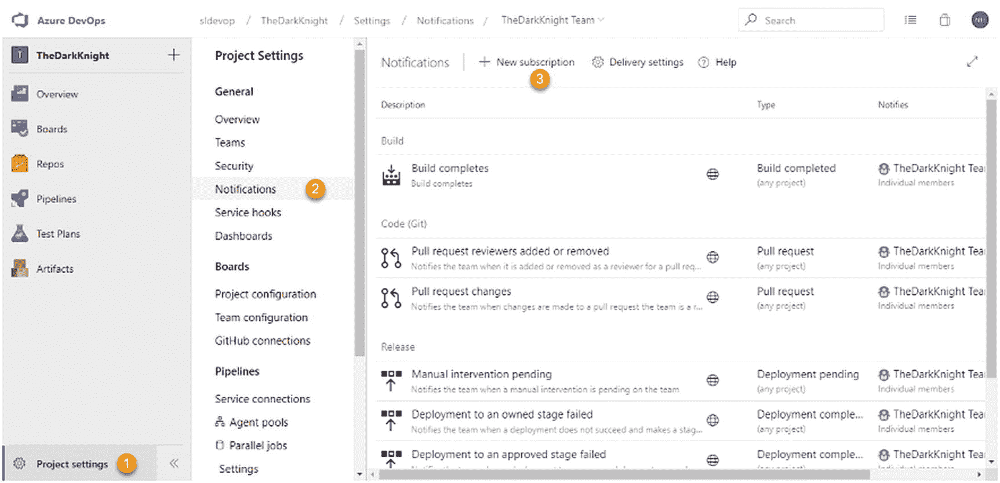
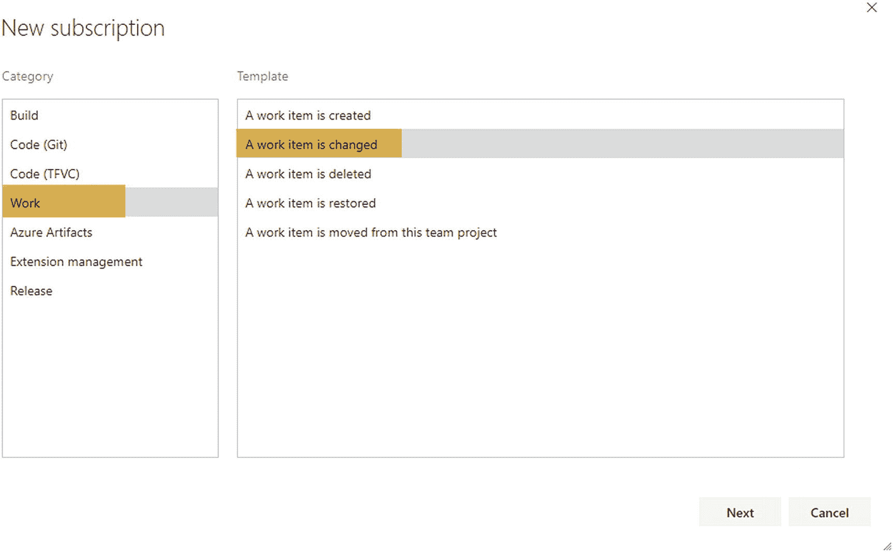
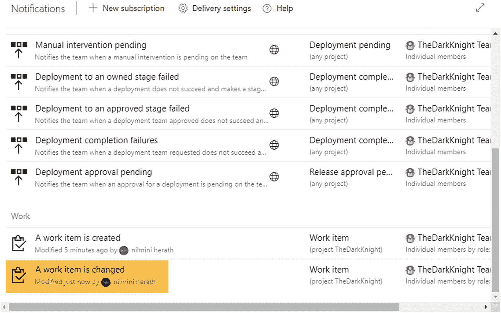
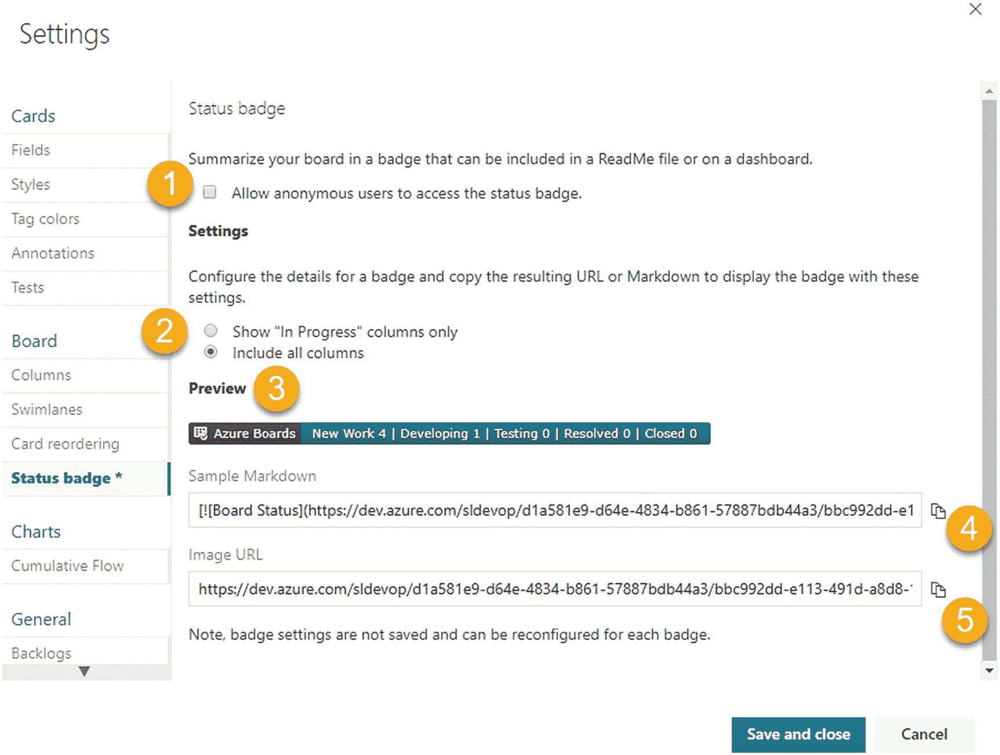

# 4.工作项通知、标记和自定义

[Lesson 4-1\. Setting Up Work Item Tags](#Sec1) [Lesson 4-2\. Setting Up Work Item Notifications](#Sec2) [Lesson 4-3\. Customizing a Kanban Board’s Card](#Sec3) [Customizing Fields](#Sec4) [Adding Card-Style Rules](#Sec5) [Setting the Tag Color](#Sec6) [Customizing Tests](#Sec7) [Lesson 4-4\. Customizing a Kanban Board’s Settings](#Sec8) [Customizing Columns](#Sec9) [Using Swimlanes](#Sec10) [Reordering Cards](#Sec11) [Setting Up a Status Badge](#Sec12) [Summary](#Sec13)

在本章的前半部分，你将会发现如何在工作项中使用标签，以及如何在团队中订阅工作项通知。在本章的下半部分，你将关注 Azure Boards 的定制。Azure Boards 允许你进行多层次的定制。在这一章中，你将探索如何定制看板中的卡片来发出有价值的信息。我们还将讨论如何更改看板栏和添加看板来定制看板的工作流程。

## 第 4-1 课。设置工作项标记

*标签*是工作项目上的标记，用来表示它们的目的或识别一组工作项目的特性。本课解释如何向工作项添加标记，以及如何使用添加的标记来筛选和搜索工作项。

***先决条件*** :你需要一个有多个工作项的 Azure DevOps 板。

让我们先添加一个新标签。本课展示了如何向用户情景添加标签。通过点击看板中的标题，打开用户故事工作条目的卡片。

单击注释旁边的“添加标签”标签，并添加标签值；例如，选择“柜员”表示这与银行的柜员操作相关。见图 [4-1](#Fig1) 。点击保存&关闭按钮保存修改。添加工作项标记时，请使用有意义的值。例如，如果工作项与 ATM 取款相关，您可以添加一个名为 ATM 的标记。

图 4-1

向工作项添加标记

可以向一个工作项添加多个标记。如果要添加更多标签，请单击添加的标签值旁边的+号。如果要删除标记值，请单击标记上的 X 图标。既然您已经学习了如何向工作项添加标签，那么探索标签的使用是值得的。

您已经知道您可以向单个项目添加数百个工作项。如果您需要在数百个工作项中找到一些特定的工作项，您需要一种简单的方法来完成。Azure DevOps 提供了很多过滤选项，帮助你轻松找到一个工作项。通过标签过滤是 Azure DevOps 中可用的过滤选项之一。您可以添加自己的标记名，并使用它们来过滤工作项。

点击 filter 图标，您将会看到有一个选项可以通过标签来过滤工作条目。此外，您可以通过一次选择多个过滤器来过滤值。见图 [4-2](#Fig2) 。

图 4-2

使用标记筛选工作项

除了过滤之外，Azure DevOps 还允许使用标签值搜索工作项。在 Azure DevOps 的搜索框中，键入**标记:**，然后用双引号括住标记的名称。您将看到一个下拉列表，其中包含关于应用运算符和过滤字段的建议。见图 [4-3](#Fig3) 。之后，按回车键开始搜索。您可以使用运算符给出多个标记值。

图 4-3

使用标记搜索工作项

Azure DevOps 提供的另一个功能是，你可以通过给它们着色来突出显示这些添加的标签。此选项仅在看板卡中可用。标签颜色将在本章的第 4-3 课中解释。

Azure DevOps 还有一个基于标签查询工作项的特性。我们将在课程 6-2 和 6-4 中讨论使用标签查询工作项。

在本课中，我们确定了标签的用途和重要性。此外，您还学习了如何向一个工作项添加多个标记，以及如何使用标记来过滤和搜索工作项。

## 第 4-2 课。设置工作项通知

当你们作为一个团队工作时，得到关于项目中发生的变化的通知是很重要的。Azure DevOps 有不同类型的全局通知，如第 1-7 课所述。此外，您还在第 2-2 课中探讨了小组通知设置，但如何订阅通知除外，这将在本课中讲述。

让我们添加一个新的通知，当一个工作项发生变化时，向团队中选定的成员发送一封通知邮件。

转到项目设置，并在所需团队的范围内选择项目设置下的通知。然后单击“新建订阅”添加新通知。参见图 [4-4](#Fig4) 。

图 4-4

添加新通知

一个新窗口将会打开。您可以从该窗口中选择通知类别和模板。若要发送工作项更改的通知，请在“类别”部分中选择“工作”,并在“模板”部分中选择“工作项已更改”。参见图 [4-5](#Fig5) 。然后单击“下一步”进入下一步。

图 4-5

选择类别以创建通知

让我们确定工作类别中的模板项。

*   **创建一个工作项目**:当一个新的工作项目被添加时，邮件接收者将被通知。

*   **工作项目变更**:工作项目变更时会通知邮件接收者。

*   **一个工作项目被删除**:当一个工作项目被删除时，邮件接收者将被通知。

*   **一个工作项目被恢复**:当一个工作项目从 Azure Boards 的回收站被恢复时，邮件接收者将被通知。

*   **一个工作项从此团队项目移动**:当一个工作项从团队项目移动到另一个团队项目时，邮件接收者将得到通知。

单击“下一步”按钮后，您将导航到可以选择通知接收者的窗口。参见图 [4-6](#Fig6) 。

图 4-6

添加通知接收者

1.  这是工作项的描述。

2.  这是通知的创建者。

3.  Select the notification receivers from this drop-down. There are several options to select the notification e-mail receivers. See Figure [4-7](#Fig7).

    

    图 4-7

    下拉列表选择通知接收者

    1.  A notification is sent to the members of TheDarkKnight team, which has a selectable role. See Figure [4-8](#Fig8). As an example, the notification is sent to a previously assigned user of the changed work item.

        

        图 4-8

        角色

    2.  “交付给”收件人由团队或组的交付设置决定。

    3.  通知将发送到以逗号分隔的自定义电子邮件地址。

    4.  团队的所有成员都会收到通知。

    5.  SOAP 允许您定义一个 URL，您可以在其中开发一个可以接收 SOAP 消息的 web 应用/API。

4.  在这里，您可以为“交付至”下拉选择提供值。

5.  选中“跳过发起者”时，不会向发起事件的用户发送通知。

6.  您可以使用筛选器选项来选择团队项目。

7.  选择团队项目。

8.  添加查询以定义过滤条件。您可以添加其他字段并更改过滤标准来创建自定义通知。

9.  创建并保存通知。

您可以在通知部分找到新添加的工作项。参见图 [4-9](#Fig9) 。

图 4-9

新添加的通知

当您订阅通知时，您将收到一封基于通知设置的电子邮件。例如，当其他人向您分配工作项目时，您会收到工作项目已被分配的通知。参见图 [4-10](#Fig10) 。

图 4-10

分配了通知电子邮件的工作项

我们在本课中讨论了 Azure DevOps 团队通知。您学习了如何创建一个工作项通知，并验证通知是否按照定义发送给了相关的接收者。

## 第 4-3 课。定制看板的卡片

可以定制看板卡片，以便在 Azure Boards 中有效地可视化积压的信息。在本课中，您将了解 Azure DevOps 看板卡定制功能。

***先决条件*** :你需要一个带有工作项的待办事项。

Azure DevOps 允许分别定制 epic、feature 和 storyboard 卡。每个纸板可以有不同的卡片视图。卡片视图定制的主要目的是在团队会议(如每日站立会议)上轻松跟踪项目进度。

转到故事板，然后单击设置。

“纸板设置”窗口将会打开。您可以在“卡片”下找到“字段”部分。先说现场定制。

### 自定义字段

Azure DevOps 提供了各种带有定制选项的卡。您可以选择需要在卡片上显示的字段。

您将在字段定制区域看到两个主要部分。一个是显示默认字段的核心字段区域。另一个区域是“附加字段”区域，您可以在其中向卡片添加新字段。

核心字段在每个字段名称的左侧都有一个复选框。如果要从卡片视图中删除核心字段，可以取消选中该核心字段旁边的复选框。

核心字段是 ID、分配给、故事点和标签。见图 [4-11](#Fig11) 。

图 4-11

核心字段

您可以通过单击+字段按钮并从下拉列表中选择一个字段名称来添加任何字段。如果要删除某个字段，可以通过单击字段值右侧的红色 X 来删除该字段。在页面底部，您会看到一个复选框，允许您决定是否应该在卡片上显示空字段。参见图 [4-12](#Fig12) 。

图 4-12

附加字段

在我们的例子中，故事板卡片中有四个核心字段和两个附加字段。让我们转到故事板，验证卡片上的字段。参见图 [4-13](#Fig13) 。

图 4-13

故事板卡片字段

1.  工作项 ID

2.  分配的团队成员

3.  故事要点

4.  标签值

5.  工作项状态

6.  工作项类型

您可以看到故事板上显示的所有选定字段值。如果转到 epic 或 features 板，这些字段值在卡上是不可见的。

到目前为止，您已经看到了如何定制看板卡。如果您转到 sprint 的任务板，您可以添加不同的定制。转到任务板的设置。您可以将相同的规则添加到任务板的任务、bug 和用户故事中。参见图 [4-14](#Fig14) 。

图 4-14

具有多个工作项自定义项的任务板

您已经了解了 Azure DevOps 提供的不同板卡字段定制选项。现在我们来讨论如何添加卡片式规则。

### 添加卡片式规则

Azure DevOps 有一个纸板定制功能，允许您向卡片添加样式规则。当一个工作项目符合多个规则的标准时，将使用第一个规则并将其应用到卡上。让我们向工作项添加一些规则。

去一个故事板，打开设置对话框。在卡片部分选择样式。单击样式规则以添加新规则。

对于第一个规则的名称，输入**最近没有状态变化**。设置它，以便当卡片保持相同状态超过五天时，工作项目卡片的颜色变为红色。见图 [4-15](#Fig15) 。

图 4-15

添加卡片规则

让我们确定规则的每一部分。

1.  这是规则名称。您可以输入任何有意义的名称。

2.  您可以更改卡片颜色。符合规则要求的牌会变成这种颜色。

3.  您可以在此部分更改卡片标题字体。

4.  您可以在此部分添加规则标准。

对于第二条规则，输入**当前迭代项作为名称，设置**规则，如图 [4-16](#Fig16) 所示。

图 4-16

以蓝色查看当前迭代项的规则

对于第三个规则，输入**当前迭代标题字体变化**作为名称。根据当前迭代设置标题字体和颜色。见图 [4-17](#Fig17) 。

图 4-17

更改工作项标题字体

您可以对工作项的字体进行以下更改:

1.  更改字体颜色。

2.  标题文本使用粗体。

3.  标题文本使用斜体。

4.  给标题加下划线。

您可以向卡片添加不同的样式规则，并将规则保持在禁用状态。这些规则仅在处于启用模式时使用。参见图 [4-18](#Fig18) 。

图 4-18

样式规则列表

单击规则上的三个点。然后，您将能够看到允许您对规则执行三个操作的窗格。

1.  删除该规则。

2.  创建规则的克隆。

3.  规则顺序很重要，因为当一个工作项有多个匹配项时，第一个规则适用。您可以使用此选项更改规则的顺序。

通过添加这些类型的规则，您可以轻松地确定项目的进度。例如，如果有一个工作项处于同一状态超过五天，那么完成该工作可能会出现阻塞问题。如果这些类型的项目以不同的颜色显示在板上，团队成员可以很容易地识别工作项目并采取正确的行动。参见图 [4-19](#Fig19) 。

图 4-19

带规则的纸板定制

到目前为止，我们已经讨论了两种卡定制选项。让我们看看 Azure DevOps 中的另一个可用功能。

转到“电路板”并打开“设置”窗口。您将在卡片下看到“标签颜色”部分。

### 设置标签颜色

单击“标签颜色”图标。

从标记下拉列表中选择标记，然后选择标记的颜色。您可以为项目待定项中的每个可用标记赋予颜色。参见图 [4-20](#Fig20) 。

图 4-20

添加标签颜色

让我们来识别图 [4-20](#Fig20) 所示页面的各个部分。

1.  添加新标签。

2.  从下拉列表中选择一个标记值。

3.  选择颜色。

4.  启用或禁用标签颜色。

5.  删除标签颜色。

添加标签颜色后，保存更改。去相关的董事会。您将能够看到标签颜色已经改变。见图 [4-21](#Fig21) 。

图 4-21

在板上标记颜色变化

让我们讨论一下卡片定制选项的注释部分。你可以在卡片下面找到注释部分。选择注释。

默认情况下，您将在卡定制部分看到三个注释值。它们是任务、错误和测试。参见图 [4-22](#Fig22) 。

图 4-22

启用和禁用注释

我们将在本系列的*动手测试*一书中讨论 bug 和测试。请注意，我们将在这里讨论任务的视觉线索是如何工作的。您可以决定是否在故事卡上显示任务。您可以使用复选框启用或禁用该任务。如果您在此处禁用任务，任务将不会显示在故事板上。见图 [4-23](#Fig23) 。

图 4-23

故事项目上显示的任务

在 epic 卡中，您可以将功能作为子项目显示在卡片上，而在功能卡中，您可以将故事作为子项目显示，类似于故事卡中的任务。

### 定制测试

卡定制选项中的测试部分将在本系列的*动手测试*一书中讨论。

在本课中，您学习了 Azure DevOps 中可用的不同卡定制功能。您了解了如何向卡片添加新字段、添加卡片规则以及添加标记颜色。最后，在本课中，您看到了如何自定义注释。

## 第 4-4 课。定制看板的设置

Azure DevOps 中的看板可以使用看板的设置对话框进行定制。当在项目模板(Agile/Scum/CMMI/Basic)级别与过程定制结合使用时，定制是有限的但是强大的，它可以用于引入新的工作条目或者向工作条目添加新的状态和字段。我们将在第 [5](05.html) 章中讨论这些带有项目模板的过程定制。在本课中，让我们看看“设置”对话框中的可用选项，这些选项可让您通过引入新栏、将栏拆分为正在进行和已完成列表、引入泳道、重新排序卡片以及使用状态徽章来更改公告板的外观。这里描述的定制可以应用于任何一个 backlog 级别，即 epics、features 和 user stories/PBI/requirements。

要启动看板的设置对话框，请在看板页面上点击右上角的齿轮图标。选择“故事板”视图，并通过单击嵌齿轮打开“设置”对话框。参见图 [4-24](#Fig24) 。

图 4-24

启动电路板的设置对话框

### 自定义列

默认情况下，史诗、特性和用户故事的敏捷团队待办事项流程是新➤有效➤解决➤关闭。新状态被认为属于“建议状态”类别，而关闭状态属于“完成状态”类别。中间状态“活动”和“已解决”属于“进行中”状态。在纸板的列定制设置中，不允许您改变纸板中第一列或最后一列的顺序或状态，它们分别属于“建议状态”和“完成状态”类别。第一列唯一可用的上下文菜单选项是“向右插入”，它会在第一列的右侧添加一个新列。最后一列的上下文菜单有一个左侧插入选项，允许您在看板中最后一列的左侧添加一列。但是，您可以更改看板的第一列和最后一列的名称，以适应您的偏好。让我们将第一列重命名为 New Work。参见图 [4-25](#Fig25) 。

图 4-25

定制看板的第一列

现在，让我们转到第二列“活动”,与第一列进行一些比较，并进行一些定制。参见图 [4-26](#Fig26) 。

图 4-26

自定义“进行中”栏

图 4-29

看板列中完成的定义

1.  这允许您在选定列的左侧添加一列。当您选择第一列并单击此按钮时，新列将被添加到第一列的右侧。

2.  “进行中”类别列的上下文菜单将允许您删除列。您可以向左或向右移动一列(在图 [4-26](#Fig26) 中，该列只能向右移动，因为它紧挨着第一列)，并且您可以在当前列的左侧或右侧插入另一列。

3.  您可以根据自己的喜好重命名该列。让我们把 Active 改名为 Developing。

4.  You can set a limit for the work in progress (WIP) for the column. This means you should not have more work items than the number specified for the WIP limit. However, this does not prevent you from adding more items to the Kanban board column than the specified limit. Rather, it will indicate the work in progress limit has been exceeded by changing the color of the number that appears on top of the column to red. See Figure [4-27](#Fig27).

    

    图 4-27

    超过在制品限制

5.  将列分为“进行中”和“完成中”有助于您在同一列中识别两个阶段。让我们为开发(活动)列选择“将列拆分为正在进行的和已完成的”。

6.  The state mapping can be provided for the backlog work item type for the column. Dragging and dropping an item to a given column will make the state change to the specified state. This is useful when new states are introduced to work items that change the process flow, which we will discuss in Chapter [5](05.html). There can be multiple work item states to map. For example, if you are managing the Bug work items with the requirements (as you learned about in Lesson 3-6), you have to set both the work item states here. See Figure [4-28](#Fig28).

    

    图 4-28

    列的工作项状态映射

7.  当您考虑此列中的工作项时，您可以定义完成标准的定义。当项目满足条件时，当它被拆分为正在进行和已完成时，它将被移动到右侧的列或列内的已完成区域。让我们在 Developing 列中添加一个 Done 的定义，比如“所有的开发任务通过满足单个任务接受标准而结束”。这将在看板中的列标题附近设置一个小的信息标签，当您将鼠标悬停在该图标上时，它将显示该列的 Done 定义。参见图 [4-29](#Fig29) 。

让我们在 Developing 和 Resolved 之间添加另一列，并将其命名为 Testing。将用户故事的状态设置为 Active，并将该列拆分为 Doing 和 Done。

图 4-30

看板流程已修改

1.  完成所有更改后，单击保存并关闭以保存对纸板栏的更改。电路板看起来应该如图 [4-30](#Fig30) 所示。

即使您成功地修改了用户故事板的看板工作流，用户故事工作项的相同活动状态在开发和测试列之间共享。这使得不可能通过更改工作项的状态来将列更改为 Testing，因为当状态被设置为 Active 时，它将总是移动到 Developing。将它移动到 Testing 列的唯一方法是拖放它。你可以通过给工作项引入新的状态来解决这个问题，这将在第 5-3 课中解释。

### 使用泳道

泳道允许您在“建议类别”状态(新)和“完成类别”状态(已关闭)之间创建额外的水平泳道。在看板的设置对话框中，选择看板部分的泳道选项卡。然后单击+泳道添加新的泳道。例如，您可以将其命名为“加速”,以表示该通道中的工作应该比其他通道中的工作项目具有更高的优先级。见图 [4-31](#Fig31) 。

图 4-31

看板板的泳道设置

1.  这允许您在当前选定的泳道上方添加泳道。

2.  您可以移除泳道(移除不适用于默认泳道)，上下移动泳道，并在当前泳道选项的上方或下方插入泳道。

让我们将新添加的泳道快速移动到顶部，然后保存并关闭它。这将在看板板上添加新的快速通道。当看板中有多个泳道时，您可以折叠和展开。见图 [4-32](#Fig32) 。

图 4-32

看板中的泳道

### 重新排序卡片

在看板中，当您将卡片从一列拖放到另一列时，卡片重新排序设置可用于定义卡片顺序的行为。要更改卡片重新排序设置，请选择看板设置中“板”部分的“卡片重新排序”选项卡。见图 [4-33](#Fig33) 。

图 4-33

卡片重新排序设置

1.  当您拖放工作项时，根据您放置的位置，工作项将在 backlog 中重新排序。

2.  当您拖放时，工作项将根据 backlog 中设置的工作项顺序自动移动并定位在板上。如果你是 Azure Boards 的新手，这将是更可取的选择，以防止意外重新排序 backlog 项目。

### 设置状态徽章

状态徽章可以用来在仪表板中快速传达 Azure 板的状态。可以在看板部分的“状态徽章”选项卡上的看板中更改“状态徽章”设置。见图 [4-34](#Fig34) 。

图 4-34

董事会的“状态徽章”设置

1.  您可以允许匿名访问状态徽章。

2.  您可以包括所有公告板栏或仅包括“进行中”栏，这将忽略工卡的第一栏和最后一栏。

3.  将显示徽章预览。

4.  复制降价内容，您可以在仪表板或团队 wiki 页面的降价小部件中使用它。

5.  使用此 URL 可以查看徽章的图像。

当您在 wiki 或仪表板中使用时，保存的“状态徽章”设置不会被应用。您可以设置您的首选项，复制降价或图像 url，并在网页或 wiki 页面中使用复制的 URL。然后改变偏好，获得更多的降价代码或图片网址。两者将同时工作，没有任何不同设置的问题。

让我们复制状态徽章的图像 URL，同时允许匿名访问和所有列。然后粘贴到一个新的浏览器窗口的地址栏，并按下回车键。徽章将会出现。将设置更改为“进行中”列，打开另一个浏览器窗口，然后尝试访问 URL。现在，您将只能在公告板的“进行中”栏中看到状态徽章。见图 [4-35](#Fig35) 。

图 4-35

浏览器中的状态徽章图像

图片 URL 可以在一个 readme HTML 文件中使用，也可以在任何其他合适的地方显示 Azure Boards 的状态。

您可以将状态标记的降价代码添加到仪表板中的小部件，以使用户能够在仪表板中查看标记。见图 [4-36](#Fig36) 。我们将在第 6-8 课中讨论如何在仪表板中使用 Markdown 小部件。

图 4-36

仪表板中的板状态徽章

在本课中，我们讨论了如何更改列、添加泳道、重新排序卡片以及使用状态徽章。但是，您可以使用这些选项来定制任务板(sprint/iteration 板)。对任务板的自定义只能通过任务工作项的状态更改来应用，这将在第 5-3 课和第 5-4 课中讨论。

## 摘要

在本章中，我们讨论了如何在 Azure Boards 中订阅工作项通知。此外，我们展示了如何设置看板样式定制，包括添加字段、改变颜色和使用标记颜色。我们还展示了如何更改列、添加泳道、重新排序卡片以及使用状态徽章。

在下一章中，我们将继续进行流程定制，这将允许您对 Azure 板和工作项的行为方式进行更多的更改，以便您可以更改 Azure 板来模拟您希望流程如何流动。