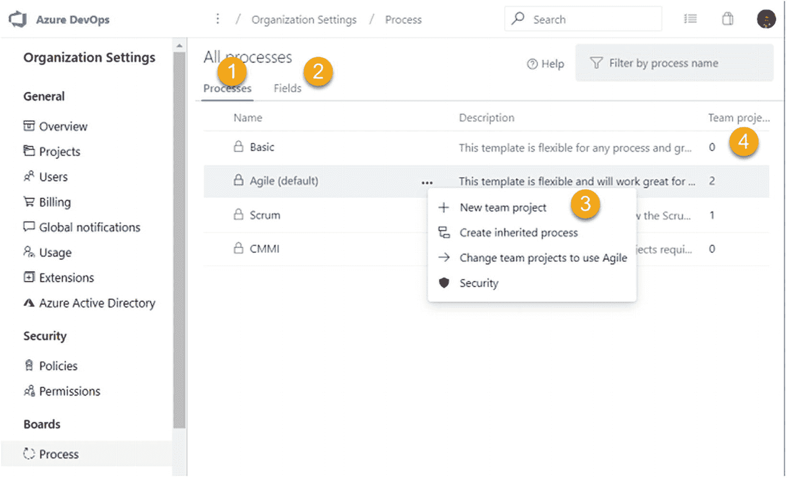

# 五、定制流程

[Lesson 5-1\. Creating an Inherited Process](#Sec1) [Lesson 5-2\. Editing Work Item Types](#Sec2) [Editing the Work Item Color and Icon](#Sec3) [Modifying the Layout of the Work Item Form](#Sec4) [Editing an Inherited Field](#Sec5) [Editing an Inherited Group](#Sec6) [Adding a New Page to the Layout](#Sec7) [Adding a New Group to the Layout](#Sec8) [Adding a Custom Field](#Sec9) [Lesson 5-3\. Changing the State Workflow of a Work Item](#Sec10) [Lesson 5-4\. Adding New Work Item Types](#Sec11) [Lesson 5-5\. Adding a Top-Level Backlog](#Sec12) [Lesson 5-6\. Defining Custom Work Item Rules](#Sec13) [Summary](#Sec14)

我们在上一章详细讨论了如何定制看板和卡片。在这些知识的基础上，本章将带你进一步体验定制 Azure Boards 的旅程。我们将讨论如何定制工作项，改变工作项状态流，引入新的工作项类型，并展示如何在史诗、特性和故事之上添加顶级积压工作。此外，定制工作项规则可以让您能够在工作项字段上设置定制行为，以迎合各种业务场景。我们不会讨论基于 XML 的模板定制，这些模板可用于 Azure DevOps 的本地版本。

***先决条件*** *:* 你是 Azure DevOps 服务器或服务的集合管理员。(设置安全性将在第 [9](09.html) 章中讨论。)

## 第 5-1 课。创建继承的流程

要自定义继承的流程，首先需要从现有流程模板创建继承的流程模板。Azure Boards 有四个现成的过程模板，即敏捷、Scrum、CMMI 和基本。您可以继承这些模板来创建自定义流程。

由于您在前面的章节中已经使用了 Agile 模板，因此在本课中，您将创建一个 Agile 模板的继承模板。转到 Azure DevOps 主页，如果您有多个组织，请选择所需的组织，然后单击“组织设置”见图 [5-1](#Fig1) 。

图 5-1

“组织设置”项目

在左侧的“组织设置”下，选择“董事会”部分中的“流程”。见图 [5-2](#Fig2) 。

图 5-2

流程项目

让我们确定流程页面上的区域。

1.  这将显示可用的流程模板。开箱即用有四个模板。

2.  这里列出了工作项中的所有字段。我们将在第 5-2 课中讨论该选项卡。

3.  在过程模板的上下文菜单中，您可以使用模板创建新的团队项目，创建继承的过程模板，更改现有项目以使用模板，以及管理模板的安全性。

4.  这显示了使用过程模板的项目数。

让我们点击上下文菜单中的“创建继承流程”,创建一个继承的 Agile 流程模板。将会打开一个对话框，您可以输入一个名称，如 **DemoAgileCustom** 和对继承模板的描述。然后点击“创建流程”按钮，根据 Agile 流程模板创建新的继承模板。见图 [5-3](#Fig3) 。

图 5-3

创建继承的流程

让我们检查一下新创建的继承过程模板的上下文菜单。见图 [5-4](#Fig4) 。

图 5-4

继承的流程模板上下文菜单

1.  使用过程模板创建新的团队项目。

2.  编辑过程模板的名称和描述。

3.  创建当前模板的副本，作为父模板的继承模板。

4.  将父流程模板(本例中为 Agile)或父模板的任何继承模板中的项目更改为使用当前模板。您不能将其他父模板中的项目更改为使用当前选择的继承模板或父模板。例如，可以使用 Agile 模板或其继承的模板，但只能由已经在使用 Agile 或其继承流程的团队项目使用。不允许将项目从一个默认模板移动到另一个默认模板或其继承的流程。

5.  将模板设置为组织的默认模板，当您尝试从组织主页或组织设置的“项目”选项卡上创建新的团队项目时，该模板将被选为默认模板，如第 1-2 课中所述。“设为默认流程”菜单选项在除当前默认模板上下文菜单之外的任何模板上下文菜单中都可用。

6.  您可以禁用除默认流程模板之外的任何流程模板。禁用模板后，任何使用该模板的现有团队项目都将正常工作。但是，您将无法创建新项目或将现有项目更改为使用禁用的模板。然而，如果它是现成的，您将能够从禁用的模板创建继承的流程，或者如果它是继承的，您可以复制该流程。禁用流程模板后，上下文菜单选项将会发生变化，它允许您通过上下文菜单而不是禁用选项来启用流程。

7.  只要模板未被设置为组织的默认模板，并且该模板未被任何团队项目使用，就可以删除任何继承的自定义过程模板。

8.  可以在此设置过程模板的安全性。我们将在第 8-4 课中讨论安全选项。

让我们尝试通过单击“更改团队项目以使用 DemoAgileCustom”来更改您在本书中一直使用的现有团队项目，以使用新的自定义继承模板在出现的对话框中，您可以从“可用项目”中选择所需的项目，然后单击“确定”将过程模板更改为新的继承模板。见图 [5-5](#Fig5) 。

图 5-5

更改项目以使用给定的模板

在本课中，您探索了从 Azure DevOps 中可用的现成模板创建继承的流程模板的能力。此外，您选择了一个使用 Agile 模板的项目，并将其更改为使用继承的 Agile 自定义模板。

## 第 5-2 课。编辑工作项类型

通过修改继承的过程模板中的工作项，可以定义工作项类型的行为方式、工作项表单的外观以及工作项中显示的字段。可以向工作项中引入新的字段，或者对字段进行修改。让我们在本课中探索修改工作项类型的选项。

### 编辑工作项颜色和图标

在“组织设置”中的“流程”选项卡上单击继承流程的名称，将打开该流程的“工作项类型”选项卡。参见图 [5-6](#Fig6) 。

图 5-6

过程模板工作项类型

图 5-7

编辑工作项类型

1.  这是“工作项类型”选项卡，它将列出所有的工作项类型。

2.  这些是流程模板的积压级别。我们将在第 5-5 课中探讨这个标签。

3.  此选项卡上列出了使用该模板的项目。

4.  您可以通过单击“+新建工作项类型”开始创建新的工作项类型，我们将在第 5-4 课中对此进行进一步讨论。

5.  工作项类型上下文菜单将允许您禁用除测试用例、测试计划和测试套件之外的任何工作项类型。当某个工作项类型被禁用时，任何使用该模板的项目都无法创建被禁用的工作项类型的新工作项。但是，禁用工作项类型的团队项目中的任何现有工作项仍然可以使用和更新。禁用的工作项一旦被禁用，就可以使用同一上下文菜单来启用；菜单文本将变为启用而不是禁用。单击 Edit 将打开一个对话框，您可以在其中编辑工作项类型的描述、图标颜色和图标。参见图 [5-7](#Fig7) 。

### 修改工作项窗体的布局

单击流程模板的“工作项类型”选项卡上显示的工作项类型名称(请参见图 [5-6](#Fig6) )会将您带到工作项类型的布局选项卡。让我们打开用户故事工作项的布局。您可以看到布局中有一个名为 Details 的页面和三列。见图 [5-8](#Fig8) 。

图 5-8

工作项布局

1.  这是工作项的布局选项卡。

2.  这是“状态”选项卡，您可以在其中更改工作项类型的状态工作流，我们将在第 5-3 课中对此进行讨论。

3.  这是为工作项类型定义自定义规则的规则选项卡，我们将在第 5-6 课中讨论。

4.  您可以添加一个新字段，我们将在本课稍后讨论这一点。

5.  您可以添加一个新组，我们将在本课稍后讨论这一点。

6.  您可以向工作项布局添加一个新页面，我们将在本课的后面讨论这一点。

7.  您可以在工作项布局中使用来自市场的扩展，我们将在第 10-2 课中讨论。

8.  您可以刷新布局。

9.  这是详细信息页面。它有一个上下文菜单，允许您单击编辑并打开一个对话框来编辑页面的名称。

10.  The Description and Acceptance Criteria fields both have a context menu, which allows the fields to be hidden from layout and allows you to edit the field’s label. However, it is not possible to move the field out from the group that the field is in since it is an inherited field from the parent process. See Figure [5-9](#Fig9). Any other inherited field such as Story Points, Priority, and so on, has the same context menu and has the same restriction that you cannot change the group or column the field is appearing in by default.

    

    图 5-9

    继承字段上下文菜单

11.  发展和相关工作字段可以从页面布局中隐藏，但不能编辑或移动到其他位置。

### 编辑继承字段

在描述字段的上下文菜单中单击编辑。您将只能编辑标签。参见图 [5-10](#Fig10) 。

图 5-10

继承字段标签编辑

在编辑字段的选项选项卡上，您可以将该字段设置为必填字段，并为该字段提供默认值。见图 [5-11](#Fig11)

图 5-11

继承字段选项

不能编辑继承字段的“定义”选项卡上的信息，即名称、类型或描述。

### 编辑继承的组

继承的组，如 Planning，有一个上下文菜单(见图 [5-12](#Fig12) )，允许你添加一个新字段到组中，并通过一个对话框编辑组名。但是，您只能编辑继承的组和列的名称；不能更改组当前所处的位置。

图 5-12

继承的组上下文菜单

### 向布局添加新页面

在工作项的布局选项卡上，您可以点击“新建页面”(见图 [5-8](#Fig8) )来添加一个新页面。您可以在弹出对话框中为页面提供一个名称，然后单击 OK 在工作项布局中创建一个新页面。新创建的页面有一个包含两个选项的上下文菜单。“编辑”将允许您编辑页面的名称，而“删除”将删除页面。见图 [5-13](#Fig13) 。

图 5-13

布局中的新页面

### 向布局添加新组

在布局页面中，您可以单击“新建组”(见图 [5-8](#Fig8) )向所选页面添加新组。将会打开一个弹出窗口，您可以为该组提供一个名称，选择要添加该组的页面，并定义应该将该组添加到的列。见图 [5-14](#Fig14) 。

图 5-14

添加组

在一个组中，有几个上下文菜单选项可用。参见图 [5-15](#Fig15) 。

图 5-15

自定义组上下文菜单

“新字段”允许您向组中添加新字段。对于自定义添加的组，您可以编辑和更改添加组的页面的名称、页面或栏。编辑可以更改该组的页面等详细信息。删除将删除该组。“上移”和“下移”或拖放可用于更改布局页面中自定义组的列或位置。

### 添加自定义字段

让我们向用户故事工作项类型组添加一个新字段。为此，您可以在组上下文菜单中单击新字段，或者在布局页面上单击“新字段”。在“定义”选项卡上，您可以指定名称、选择数据类型并提供描述。参见图 [5-16](#Fig16) 。您可以添加工作项布局中不存在的现有字段，而不是添加新字段。如果使用现有字段，则不允许更改数据类型或描述。对于本例，选择一个新字段，键入 **Operation Area** 作为名称，并选择“选项列表(字符串)”作为类型。见图 [5-16](#Fig16) 。

图 5-16

添加新的自定义字段

选择选择列表后，您可以定义选择列表的值。参见图 [5-17](#Fig17) 。

图 5-17

选项列表类型自定义字段

在选项选项卡上，您可以根据需要设置字段，并设置是否允许选项列表中的值以外的用户输入。此外，您可以为该字段设置默认值。参见图 [5-18](#Fig18) 。

图 5-18

新字段选项

“新字段”对话框的“布局”选项卡允许您通过选择页面和布局中的组来定义新字段的位置。您甚至可以在这里创建一个新组，并向其中添加新字段。参见图 [5-19](#Fig19) 。

图 5-19

新字段布局

使用字段上下文菜单中的编辑字段创建字段后，您可以添加或移除选项列表数据类型的值。但是，一旦添加了新字段，就不能对其进行重命名，也不能更改数据类型。所有其他值，如是否需要、默认值和布局选项，都可以通过编辑字段来更改。添加新字段，并检查团队项目中使用您修改的模板的用户故事工作项。新字段应该在工作项中可见。参见图 [5-20](#Fig20)

图 5-20

用户故事中的新领域

在本课中，您了解了工作项布局更改选项，以及如何向工作项类型添加新的自定义字段。

## 第 5-3 课。更改工作项的状态工作流

有了上一章的知识，你知道如何使用看板列引入新的工作流程。然而，我们讨论了当不止一个看板列共享相同的状态时，无法使工作流变更生效的问题。状态的改变总是会将工作项移动到利用该状态的面板中最左边的列。为了创建有效的状态工作流，能够在工作项类型中添加或移除状态是非常有用的。

在第 4-4 课中，我们添加了名为“开发和测试”的“进行中”看板列，而不是“活动”,并在两列中共享活动状态。现在让我们为用户故事工作项创建实际的开发和测试状态。

在过程模板中，选择用户故事工作项类型，然后转到“状态”选项卡。您可以看到这些状态被分为建议、进行中、完成和删除几个组。见图 [5-21](#Fig21)

图 5-21

工作项类型状态

上下文菜单允许您隐藏除关闭状态之外的任何现成状态。但是每个州类别中必须至少有一个州可用。单击“+新状态”按钮添加新状态。见图 [5-21](#Fig21) 将出现一个对话框，允许您选择现有的州名或提供新的州名；选择状态类别和状态的颜色。见图 [5-22](#Fig22) 。

图 5-22

添加新状态

让我们向 Progress 类别添加两个新的状态，Developing 和 Testing，并隐藏 Active 状态。见图 [5-23](#Fig23)

图 5-23

修改用户故事状态

当您在使用已更改的过程模板的团队项目中查看用户情景板时，它将显示一条错误消息，因为您隐藏了用户情景的活动状态，而该用户情景已在板列中使用。见图 [5-24](#Fig24)

图 5-24

用户故事板出错

您可以按照第 4-4 课中的说明，使用看板板的设置页面为开发和测试栏选择正确的状态。这种修正将使看板工作。但是，您会注意到，处于活动状态的用户故事已经从板上消失了。您可以转到团队项目的 Boards 部分的 Work Items 选项卡，以筛选处于活动状态的所有用户情景。见图 [5-25](#Fig25)

图 5-25

活动状态用户故事

然后，您可以批量编辑它们，并适当地将它们更改为开发或测试状态，以便它们出现在用户的故事板上。见图 [5-26](#Fig26)

图 5-26

出现在公告板中的新状态的故事

同样，您可以编辑任何其他工作项类型的状态工作流，例如 Epic、Feature 或 Bug。如第 4-4 课所述，任务板无法通过任务板的设置页面添加列。但是，如果您更改任务工作项的状态分叉流，它将自动应用到任务板列。见图 [5-27](#Fig27)

图 5-27

状态工作流更改为包括发展中状态的任务板

在本课中，我们讨论了如何使用继承的过程模板来更改工作项类型的状态工作流。

## 第 5-4 课。添加新的工作项类型

有时，您的团队可能无法在现成的模板中找到您正在寻找的工作项的确切类型。例如，您可能需要一个工作项来跟踪后续工作。或者您可能想要添加一个积压级别。

在本课中，让我们尝试向继承的名为 Initiative 的 Agile 流程模板中添加一个新的工作项类型，您可以在第 5-5 课中使用它来添加一个新的待办事项级别。

在过程模板的“工作项类型”选项卡上，单击“+新建工作项类型”参见图 [5-28](#Fig28) 。

图 5-28

单击“+新工作项类型”

提供名称和描述，并在弹出的对话框中为新的工作项选择图标和颜色。参见图 [5-29](#Fig29) 。

图 5-29

创建新的工作项类型

一旦创建了新的工作项类型，您将会看到新工作项的布局页面。在那里，您可以根据第 5-2 课中的说明，从现有字段添加新字段或作为新的自定义字段。按照第 5-3 课中的说明，根据您的偏好更改状态工作流。在使用修改后的模板的团队项目的工作项选项卡中，现在您可以看到新的工作项类型可供您添加和使用。见图 [5-30](#Fig30)

图 5-30

新工作项类型

在本课中，您探索了如何使用继承的过程模板创建新的工作项类型。

## 第 5-5 课。添加顶级待办事项

如果您正在处理一个大型项目，您可能需要为您的待办事项增加分组级别。对于在第 5-4 课中创建的名为 Initiative 的新工作项，让我们看看如何将它添加为顶级 backlog。

单击继承的流程模板中的“积压级别”选项卡。见图 [5-31](#Fig31) 。

图 5-31

积压水平

1.  这是项目组合积压级别，具有现成的 epic 和 feature 级别。

2.  您可以向项目组合待办事项级别添加更多的顶级待办事项级别。

3.  这是需求积压。

4.  这是迭代积压。

5.  此部分包含其他工作项类型。请注意，Bug 工作项是特殊的，它可以处于需求或迭代 backlog 级别。新添加的工作项也在其他 backlog 级别中。

6.  A context menu is available for the portfolio, requirement, and iteration backlog levels. Edit/Rename will open a dialog box where you can change the backlog level name, add available work items to the backlog level, and set a default work item type for the backlog level. Clicking “+ New work item type” in the “Edit backlog level” dialog lets you add a new work item type by providing a name icon and an icon color. See Figure [5-32](#Fig32).

    

    图 5-32

    编辑积压级别

7.  重置菜单选项将删除对待办事项级别所做的所有自定义更改。

让我们点击“+ New top level portfolio backlog”来为您创建的计划工作项创建计划顶层 backlog。在打开的对话框中，为 backlog 级别提供一个名称，选择一种颜色，并检查 Initiative 工作项。您可以选择此级别的默认工作项作为方案。单击“保存”添加待办事项级别。见图 [5-33](#Fig33) 。

图 5-33

创建新的顶级项目组合待办事项

一旦在使用修改后的过程模板的团队项目中添加了积压工作级别，请转到“委员会设置”,并在“常规”部分的“积压工作”选项卡上，为团队选择新的积压工作级别。保存并关闭设置页面。见图 [5-34](#Fig34) 。

图 5-34

董事会设置中的新积压级别

计划积压将对团队可用，并且您将能够向其中添加子 Epic 工作项。见图 [5-35](#Fig35)

图 5-35

正在使用新的积压级别

在本课中，您学习了如何将工作项添加到积压工作级别，以及如何创建顶级项目组合积压工作级别。

## 第五至六课。定义自定义工作项规则

作为流程的另一个定制级别，您可以为 Azure Boards 中的每个工作项类型定义定制规则。定制规则可能有助于控制流程，或者根据业务需求强制获取一些有价值的信息。

***先决条件*** :你需要完成本章之前的所有课程。

在本课中，让我们探讨如何定义自定义规则。单击继承的流程模板用户情景，并选择“规则”选项卡。见图 [5-36](#Fig36)

图 5-36

工作项规则

单击“新建规则”将显示规则设置页面。见图 [5-37](#Fig37) 。

图 5-37

自定义工作项规则

1.  一旦添加了第一个规则，就可以使用“+ New rule”来添加更多的规则。

2.  您可以输入规则的名称。

3.  这些是规则的条件。您可以从下拉列表中可用的预定义条件集中选择条件。

4.  您可以使用 AND 运算符向条件中添加附加条件。

5.  这些是当条件为真时要执行的操作。可以从预定义的动作集中选择动作。

6.  您可以添加更多操作。

7.  保存规则。

例如，选择用户故事状态正在发展的条件，使新的自定义字段操作区域成为必填字段，并保存规则。如果您尚未添加自定义字段，请将描述字段设置为必填字段。在使用修改后的过程模板的团队项目中，尝试在不选择操作区域/描述字段的情况下将用户情景状态更改为正在开发。尝试保存故事时，您将看到一条错误消息，指出操作区域/描述字段不能为空。见图 [5-38](#Fig38)

图 5-38

应用于用户情景的自定义规则

一旦您填写了操作区域/描述字段，您将能够以发展中状态保存故事。

在本课中，您了解了如何定义自定义工作项规则。

## 摘要

在本章中，您学习了如何进行过程定制，例如更改工作项布局，添加新的定制字段，添加新的工作项类型，以及添加项目组合积压级别。当你用 Azure Boards 创建自己的流程流时，这些课程会很有用。

在下一章中，让我们看看如何使用现成的报告和各种自定义查询、图表和仪表板来可视化数据。