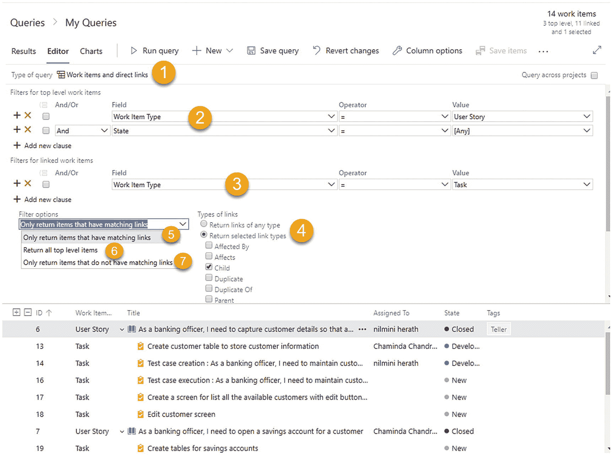
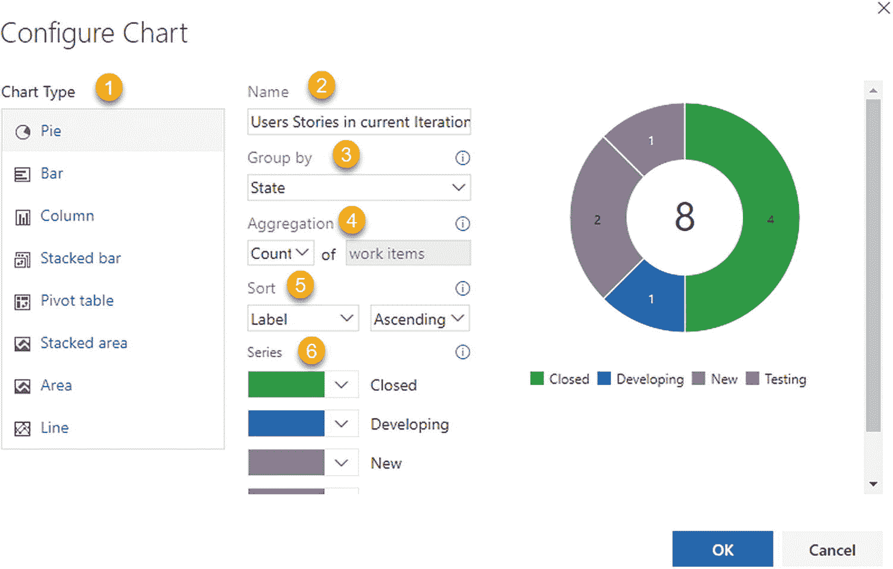
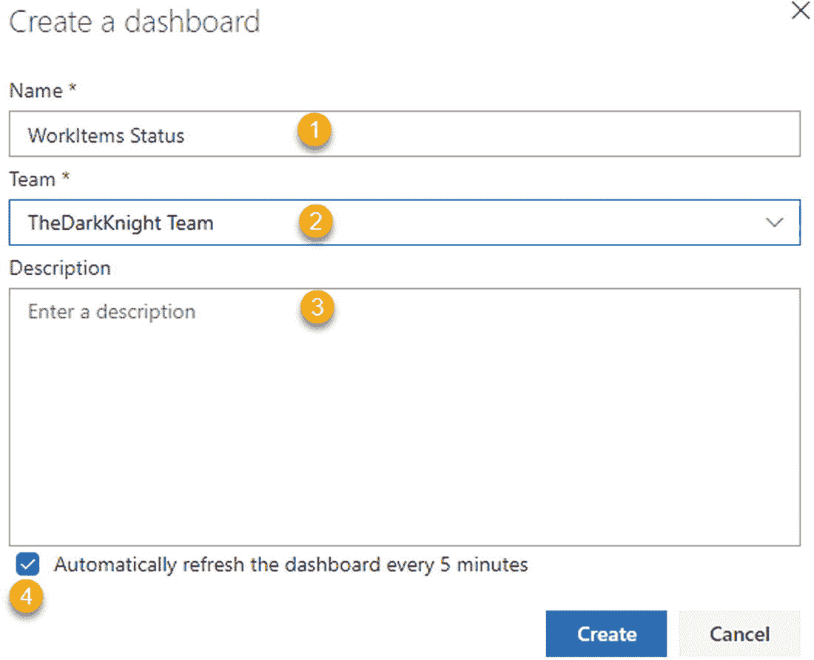

# 六、Azure Boards 中的可视化和报告

[Lesson 6-1\. Exploring the Out-of-the-Box Reporting of Azure Boards](#Sec1) [How the Work Is Progressing?](#Sec2) [Bulges in Cumulative Flow](#Sec3) [Flat Lines and Scope Changes](#Sec4) [Lesson 6-2\. Creating Personal Queries](#Sec5) [Lesson 6-3\. Sharing Queries with the Team](#Sec6) [Favorite Queries](#Sec7) [Lesson 6-4\. Writing Complex Queries](#Sec8) [Lesson 6-5\. Creating Charts with Queries](#Sec9) [Lesson 6-6\. Adding Charts to the Dashboard](#Sec10) [Lesson 6-7\. Creating Dashboards](#Sec11) [Lesson 6-8\. Adding Widgets to a Dashboard](#Sec12) [Lesson 6-9\. Using Widgets to Visualize Work Items](#Sec13) [Summary](#Sec14)

在 Azure Boards 中可用的各种报告和图表中可视化和分析您团队的工作将帮助您决定如何改进您团队的工作方式。Azure Boards 中有几种现成的图表类型，如速度、累积流量、燃尽等，允许您监控和跟踪团队的工作进度，并根据趋势预测未来的交付。在本章的第一课，你会发现 Azure Boards 中现成的报告和图表。在本章接下来的几课中，您将重点学习查询和可视化项目进度，以及基于查询创建的不同类型的报告和图表。您将探索如何编写查询，如何使用查询创建图表，以及如何将生成的图表添加到 Azure DevOps 仪表板。最后，我们将讨论 Azure DevOps 中可用的仪表板小部件，它们对于可视化项目的各个方面非常有用。

## 第 6-1 课。探索 Azure Boards 的开箱即用报告

Azure Boards 提供了非常有用的图表来显示团队的进展，这些图表是监控团队进展和预测趋势的重要部分。

***先决条件*** :你需要在 Azure Boards 中有一块板子，上面有工作项目。

转到 Azure Boards。您将在页面的右上角看到两个图表。见图 [6-1](#Fig1) 。

图 6-1

Azure Boards 图表

1.  **Velocity chart**: This type of chart shows fully completed and done stories and bug fixes, and the accumulated size gives the velocity of the iterations that have been completed. In Azure DevOps, the velocity chart provides information on completed sizes as well as in-progress sizes. It is arguable whether team velocity for a completed iteration should be considered in the progress velocity as well. However, in reality, in-progress work adds no value to the customer, and considering that, a team’s velocity has no validity. This chart further helps you to identify how much work your team can complete during a sprint. By referring to the data in the velocity chart, you can identify the average velocity of the team, which makes it possible to make decisions such as how much work your team can handle during a future iteration. The velocity chart also shows how a team has progressed over a couple of iterations. See Figure [6-2](#Fig2). You can see the completed work displayed in green and the remaining work in blue. Sprint 2017.32, which is a completed iteration, has met a velocity of 135 points, while 14 points are in progress, so the actual team velocity for the iteration is 135 points.

    

    图 6-2

    速度图

有一个小部件可以提供更多关于速度的信息，我们将在第 6-9 课中讨论。

您可以在预测待办事项中使用平均速度，来预测需要多少次迭代来完成确定优先级和大小的待办事项。在视图选项中启用预测，并提供平均速度来查看预测。见图 [6-3](#Fig3) 。

图 6-3

预测

1.  **Cumulative flow chart**: This type of chart shows the progress of the count of work items in each column of the Kanban board over time. It shows how many New, Developing, Testing, Resolved, and Closed work items are in the board as of a given date. See Figure [6-4](#Fig4).

    

    图 6-4

    累积流程图

您可以单击累积流程图中的编辑，使用您在累积流程图设置中的首选项来配置图表。您可以设定开始绘制图表的日期。此日期应该是最近 30 周内的日期，因为图表中允许显示的最大时间段是 30 周。您可以使用设置定义是否在图表中包含看板的第一列和最后一列。见图 [6-5](#Fig5) 。

图 6-5

累积流程图设置

累积流程图设置允许您通过几个方面了解团队的进展。让我们来看看每个选项。

### 工作进展如何？

一般来说，由于敏捷实践中限制进行中的工作的原则，进行中的工作应该主要有细平行线。最后一栏应该是递增的，逐渐显示工作的完成。如果在进行中的工作(WIP)中有一个不断扩大的差距，这表明工作没有完成，团队正在并行处理太多的项目。换句话说，这不是一个好兆头。团队应该采取行动，作为一个团队一起完成工作，而不是开始其他新的工作。见图 [6-6](#Fig6) 。

图 6-6

累计流程中的 WIP 增加

### 累积流量的膨胀

当工作的某个部分没有按预期完成时，累积流程中可能会出现膨胀。例如，如果测试工作比开发工作进行得更慢，那么在开发完成状态下可能会出现膨胀。通常，膨胀表示流程的下一个阶段(状态)中的问题，而不是显示膨胀的状态。在这个示例场景中，您可以通过让开发成员也参与测试活动来支持您的测试团队成员。这是跨职能和多技能团队在敏捷实践中有价值的主要原因。见图 [6-7](#Fig7) 。

图 6-7

累积流量预算

### 扁平线和范围变化

当团队花费了比计划更多的时间将工作从一个流程状态转移到另一个流程状态时，累积流程图(CFD)中可能会出现一条平线。这可能是因为团队没有定期更新工作项，这可能导致了平坦的线条。如果团队不定期更新工作项，即使在燃尽图和燃尽图中也会出现类似的效果，我们将在本课稍后讨论这一点。您应该总是鼓励团队将工作项目拖到看板中的相关列，每天的 Scrum 会议是检查工作项目是否在正确列的好时机。当多个流程状态没有按计划进行时，会出现平线，如果一个状态进行而另一个状态没有进行，则可能会出现上一节所述的凸起。参见图 [6-8](#Fig8) 。

图 6-8

范围变更，累积流量无进展

如果您转到 sprint 部分，您将能够在 Sprints 页面的右上角看到另一个重要的图表显示。这是短跑燃尽图。它显示了一个 sprint 的剩余工作。燃尽图将帮助团队确定他们是否在完成 sprint 中的所有工作项目。让我们来看看这张 sprint burndown 图表的最大化视图。参见图 [6-9](#Fig9) 。

图 6-9

冲刺燃尽图

你会看到图表有两条线。一个是可用容量线。它显示了团队在冲刺阶段的总能力，以及它在冲刺阶段将如何变化。换句话说，它显示了完成团队工作还剩下多少工作时间。

一条理想的趋势线显示了为了完成 sprint 计划的所有工作，每天应该进行多少工作。如果你的团队实际剩余工作维持在理想趋势线以下或接近理想趋势线，说明冲刺正在按计划进行，你将能够完成所有工作。当实际的剩余工作高于理想的趋势线时，这表明团队由于某种原因没有如预期的那样取得进展，这种情况应该尽快得到纠正。如果实际剩余时间或理想趋势线高于可用能力线，则表明团队能力不足以满足工作负载。

图表为您和您的团队提供了关于您的团队工作进展情况的宝贵信息。向团队传达这些图表的含义以及如何解读它们非常重要。通过了解这些图表中的信息，团队可以做出必要的改进，快速、高质量地为您的最终用户(客户)增加价值。

## 第 6-2 课。创建个人查询

在这一课中，让我们讨论 Azure DevOps 的查询功能。在 Azure DevOps 中，您可以创建自己的查询作为我的查询，您可以保存这些查询供自己使用。您可能需要为不同的目的过滤工作项。为此，您可以创建自己的查询，并保存和重用它们来根据不同的需要过滤工作项。

让我们看看如何创建个人查询。

转到左侧菜单中“公告板”部分的“查询”，然后单击“新建查询”然后导航到“我的查询”部分，您可以在其中创建新的查询。参见图 [6-10](#Fig10)

图 6-10

添加新查询

1.  您可以移至显示查询结果的结果页面。

2.  编辑器允许您添加/编辑查询。

3.  您可以根据查询结果创建图表，这些图表将显示在图表页面上。

4.  您可以使用“运行查询”图标运行查询。

5.  您可以通过单击“新建”图标并选择工作项类型来添加新的工作项。然后工作项创建窗口将会打开，您可以在其中给出值并创建一个工作项。

6.  After you add the query filters, you can save the query by clicking the “Save query” icon. After clicking the “Save query” icon, a pop-up will open where you can give the query name and the location. See Figure [6-11](#Fig11).

    

    图 6-11

    保存查询

    1.  为查询提供一个名称。

    2.  从文件夹中，您可以选择保存查询的位置。如果选择“我的查询”,查询将被保存为个人查询。

    3.  通过选择“共享查询”选项，可以将查询保存为其他团队成员可以访问的共享查询。

7.  您可以通过单击“恢复更改”图标来恢复对查询所做的更改。

8.  查询结果以表格形式显示，您可以使用“列选项”部分在结果中添加或删除列。

9.  运行查询后，您将能够看到过滤后的结果。有时，您可能需要通过使用工作项上下文菜单的 edit 选项，或者通过单击每个工作项并在 review 窗格上编辑它们，来编辑这些过滤的工作项的值。当进行这样的编辑时，您可以使用“Save items”按钮来保存已更改的工作项。

10.  When you click the three dots, you will get access to more commands. See Figure [6-12](#Fig12).

    

    图 6-12

    更多命令

    1.  You can send the query results through mail using the “Email query” option. A pop-up window will open. See Figure [6-13](#Fig13).

        

        图 6-13

        查询结果邮件

        1.  提供邮件接收者。

        2.  给邮件一个主题。

        3.  给邮件添加注释。

        4.  这些是查询返回的经过筛选的工作项。

        5.  点击此按钮发送邮件。

            我们已经讨论了如何发送查询结果邮件。现在让我们回到命令部分。

    2.  “Copy query URL” allows you to copy the URL of the query. After clicking this icon, a window will open where you can copy the query URL. See Figure [6-14](#Fig14).

        

        图 6-14

        复制查询 URL

    3.  您可以通过单击导出到 CSV 图标，将工作项目导出到 CSV 文件。

11.  您可以通过单击此图标来展开页面。

12.  选中“跨多个项目查询”旁边的复选框，以创建查询来过滤所有项目的值。

13.  Select the query type. Azure DevOps has three query types. See Figure [6-15](#Fig15).

    

    图 6-15

    查询类型

    1.  工作项的平面列表

    2.  工作项和直接链接

    3.  工作项树

    这是编写查询的三种不同方式。我们将在第 6-4 课讨论这些。

14.  您可以通过单击红色 X 来删除查询行，也可以通过单击绿色+号来添加查询行。

15.  选择要查询的字段。

16.  选择要查询的操作员。

17.  选择过滤器的值。

18.  向查询中添加新字段。

在本课中，您了解了在 Azure Boards 中创建查询可用的选项。

## 第 6-3 课。与团队分享疑问

本课将向您介绍如何创建查询并与团队成员分享。我们讨论了 Azure DevOps 中可用于创建查询的特性。您可以创建仅供查询创建者使用的查询，也可以创建与团队成员共享的查询。让我们看看如何创建共享查询。

转到查询的“全部”选项卡。您将能够看到“我的查询”部分和“共享查询”部分。如果您将鼠标悬停在“我的查询”或“共享查询”上，您将看到点，您可以单击这些点来访问更多操作。见图 [6-16](#Fig16)

图 6-16

问题

1.  单击可向任何共享查询节添加新查询。

2.  After clicking this, a window will open that allows you to create a new folder in the My Queries or Shared Queries section. See Figure [6-17](#Fig17).

    

    图 6-17

    在“共享查询”部分创建新文件夹

3.  您可以通过单击安全性下拉选项导航到共享查询的安全性控制窗口。我们将在第 8 章中讨论更多关于安全性的内容。

要将查询从“我的查询”移动到共享查询，您可以使用“查询”页面的“所有查询”选项卡上的拖放操作。参见图 [6-18](#Fig18) 。

图 6-18

拖放到共享查询

您也可以将查询从共享查询拖放到我的查询中。但是，只有当您希望其他团队成员不再看到共享查询中的查询时，才应该这样做。

### 收藏夹查询

除了“我的查询”和“共享查询”之外，还有一个将查询设为您的收藏夹或团队收藏夹的选项。通过单击显示在每个查询旁边的星号，可以将查询设置在您的收藏夹列表中。使用共享查询的上下文菜单，您可以将查询添加到团队收藏夹。参见图 [6-19](#Fig19) 。

图 6-19

添加到收藏夹

一旦将查询作为团队收藏夹添加到同一上下文菜单中，就可以将其从团队收藏夹中移除。您可以通过单击星号来添加和删除您最喜欢的查询。收藏夹查询显示在“查询”页面的“收藏夹”选项卡上。

在本课中，您学习了如何与团队共享查询，以及如何在您的收藏夹和团队收藏夹中添加和删除查询。

## 第 6-4 课。编写复杂的查询

到目前为止，我们已经讨论了 Azure DevOps 中可用的基本查询功能。本课将指导您创建复杂的查询来筛选工作项值。Azure DevOps 中有三种类型的查询。

1.  这是选择作为工作项和直接链接的查询类型。

2.  这是顶层的查询条件。

3.  这是第二级的查询条件。

4.  这是顶级和二级链接类型的列表。您可以将其设置为使用任何链接类型，或者根据您的偏好选择特定的链接类型。

5.  考虑到链接类型，将只返回具有匹配链接类型的顶级项目。

6.  这将返回与顶级查询条件匹配的所有顶级项目，而不管它们在第二级中是否有匹配的链接。

7.  这将返回在第二级中没有匹配链接项的顶级项。
    *   **Tree of work items**: The “Tree of work items” type allows you to write queries that can retrieve work items as a hierarchical structure depending on their Parent/Child or Duplicate Of/Duplicate link types. See Figure [6-22](#Fig22).

        

        图 6-22

        工作项树

8.  查询的类型被设置为“工作项树”

9.  这是顶级查询条件。

10.  这是二级查询条件。

11.  链接类型为“父/子”或“复制/重复”。

12.  首先应用顶级标准，然后为满足链接规范的二级标准找到匹配项。这将使所有顶级项目都返回有或没有二级标准项目。

13.  首先匹配第二级标准，以找到满足链接规范的顶级标准的工作项。只有在通过链接找到第二级标准项时，才会返回顶级工作项。

*   **Flat list of work items**: Using this query type, you can filter user stories in the New and Closed states with Teller or CDM tags. Also, you can filter bugs in the Developing and New states with Teller or CDM tags. See Figure [6-20](#Fig20).

    

    图 6-20

    平面列表查询

*   **Work items and direct links**: Work item direct links allow you to create a query in two levels. You can define the top query level criteria and define another criterion for the second level. The first and second levels can be linked with the relationships available in work items. See Figure [6-21](#Fig21).

    

    图 6-21

    工作项和直接链接查询

在每种类型的查询中，可以使用多组条件来创建复杂的查询。

在本课中，您学习了如何设置三种不同的查询类型:平面列表、工作项直接链接和工作项树。这些查询有助于检索具有各种标准的工作项，以一种有用的方式可视化它们。

## 第 6-5 课。使用查询创建图表

在前面的课程中，您创建了几个查询。现在让我们看看查询最重要的用途之一，那就是创建图表。您可以使用查询以不同的方式过滤工作项，Azure DevOps 具有将这些查询结果可视化为图表的功能。

转到查询并选择一个查询。然后转到“图表”选项卡，单击“新建图表”创建一个新图表。将会打开图表创建窗口。见图 [6-23](#Fig23)

图 6-23

创建查询图表

1.  Azure DevOps 提供了创建不同类型图表的工具。在这里，您可以看到您可以创建的不同类型的图表。

2.  这是查询的名称。

3.  您可以使用此下拉列表选择数据分组方式。创建饼图时，可以按“分配给”状态和“工作项”类型或查询中的其他输出列对工作项进行分组。

4.  您将为工作项目计数创建一个图表。这显示在聚合部分。

5.  您可以使用标签或值按升序或降序对图表值进行排序。

6.  您可以自定义图表每个部分的颜色。

### 注意

数据透视表图表允许您选择行和列字段，这允许您计算匹配这两个字段的工作项。

在本课中，您学习了如何在 Azure DevOps 中使用查询创建图表。

## 第六至六课。将图表添加到仪表板

在上一课中，我们讨论了如何通过查询创建图表。本课将解释如何在仪表板中使用创建的图表。您只能将共享查询添加到仪表板，因为“我的查询”中的私有查询仅对您可见。

转到查询的图表部分。将鼠标悬停在图表上，您会看到出现三个点。单击圆点查看配置选项。见图 [6-24](#Fig24)

图 6-24

图表配置

1.  单击编辑图标编辑图表。

2.  单击删除以删除图表。

3.  Click “Add to dashboard.” A pane will open on the right side of the page. Select the dashboard from the drop-down where you need to display this chart and click OK. See Figure [6-25](#Fig25).

    

    图 6-25

    选择仪表板以添加图表

现在，如果您转到相关的控制面板，您将能够看到图表。见图 [6-26](#Fig26) 将鼠标悬停在图表上方将显示附加信息，如果单击图表，将打开查询。

图 6-26

在 TheDarkKnightTeam 仪表板上添加了图表

在本课中，我们讨论了如何向仪表板添加图表，以便可视化您为团队创建的工作项查询。这些可视化将允许您创建团队进展的整体视图。

## 第六至七课。创建仪表板

Azure DevOps 允许您向项目添加多个仪表板。这允许一个团队以不同的方式可视化他们的表现或进展。例如，团队可以拥有一个显示 CI/CD 管道数据的仪表板，以及另一个显示工作项细节的仪表板。此外，可以为每个团队创建单独的仪表板。每个团队可以决定他们希望如何可视化团队表现和进展。

让我们看看如何创建新的仪表板。

转到仪表板，并从下拉列表中选择“新仪表板”。见图 [6-27](#Fig27)

图 6-27

创建新仪表板

单击“New dashboard”后，将会打开一个窗口，您可以在其中提供创建新仪表板的详细信息。见图 [6-28](#Fig28)

图 6-28

创建仪表板

1.  提供仪表板的名称。

2.  选择仪表板的团队。

3.  为仪表板添加描述。

4.  选中该复选框可每五分钟刷新一次仪表板。

提供仪表板详细信息后，单击“创建”为所选团队创建仪表板。成功创建仪表板后，您将能够在仪表板下拉列表中找到该仪表板。

拥有本课中描述的多个仪表板对于分别可视化每个团队的进度、创建所有团队的整合视图以及可视化工作的不同方面(例如工作项、CI/CD 管道、测试执行等)非常有用。注意，我们将在本系列的其他书中讨论 CI/CD 和测试执行可视化。

## 第六至八课。向仪表板添加小部件

我们讨论了如何为团队创建新的仪表板。本课将讨论如何向仪表板添加小部件。

打开需要添加小组件的仪表板，然后单击编辑按钮。参见图 [6-29](#Fig29)

图 6-29

仪表板的编辑按钮

仪表板编辑模式将被启用，您将看到侧窗格，您可以在其中搜索小部件并将它们添加到仪表板。见图 [6-30](#Fig30)

图 6-30

仪表板的编辑模式

1.  使用搜索文本框搜索小组件，或从下面的列表中选择，然后单击添加按钮将小组件添加到控制面板。

2.  如果在给定列表中找不到您想要的 widget，您可以点按“扩展图库”这将把你带到市场，在那里你可以找到更多的部件。添加扩展将在第 [10](10.html) 章中讨论。

3.  您可以使用此按钮保存并退出编辑模式。

4.  单击齿轮图标后，图表的配置窗格将会打开。您可以在此面板中编辑基本图表配置，并且可以更改图表的大小。

5.  从仪表板中移除图表。

如果您想要更改图表的位置，可以在仪表板的编辑模式下，通过将图表拖放到您的首选位置来实现。有些小部件允许您自定义图表使用多少方块作为其宽度和高度。

让我们将 Azure Boards 徽章添加为一个小部件，以了解如何将小部件添加到仪表板。你可以在公告板的设置页面找到公告板徽章的降价内容。复制降价内容。见图 [6-31](#Fig31) 。我们在第 4-4 课中讨论了电路板设置。

图 6-31

Azure Boards 的状态徽章

在团队仪表板中，单击编辑。然后在小部件中，搜索 Markdown，选择 Markdown 小部件，并单击 Add 按钮。然后单击齿轮图标来配置小部件。使用降价语法为工卡添加标题，并粘贴从公告板设置页面复制的降价内容。见图 [6-32](#Fig32) 。定义徽章的大小，然后单击保存按钮将 Azure Boards 状态徽章小部件添加到仪表板。

图 6-32

将 Azure Boards 状态徽章添加到仪表板

如果你点击仪表板中的状态徽章，它将打开相关的 Azure 看板。

在本课中，您了解了如何向仪表板添加小部件，以使用它们来可视化工作。

## 第六至九课。使用小部件可视化工作项目

Azure DevOps 仪表板中提供了各种有用的小部件，可以帮助团队在仪表板上可视化团队信息。

*   **Chart for work items**: This widget visualizes work items using the shared work item queries. The chart in Figure [6-33](#Fig33) displays the work items in the current iteration.

    

    图 6-33

    当前迭代中工作项的透视图表

*   **累计流量**:我们在本章第一课已经讨论过累计流量图。除了板子和积压工作中默认可用的累积流程图之外，您还可以将累积流程小部件添加到仪表板。

*   **Velocity**: This widget allows you to visualize more information about the velocity of the team than the out-of-the-box chart available in the team backlogs and boards. You can configure date thresholds to consider work as planned or completed late in this widget. The chart shows you planned, completed, and completed late work as well as incomplete work. See Figure [6-34](#Fig34).

    

    图 6-34

    速度小部件

*   **交付时间和周期时间小部件**:确定团队的交付时间和周期时间有助于您确定完成开发和测试过程需要多长时间。您将能够在图表中看到中值周期和交付时间的偏差。图 [6-35](#Fig35) 和 [6-36](#Fig36) 中图表中工作项类型彩色圆圈越大，工作项计数越高。如果您单击任何图表工作项彩色圆圈，您将被带到一个自定义查询，该查询会自动生成并筛选到相关的工作项。

*   **Cycle time**: This is the time taken to complete the work item from the time that active work was started on it. See Figure [6-35](#Fig35).

    

    图 6-35

    周期

*   **Lead time**: This is the total time taken to complete the work item from the time it was created. See Figure [6-36](#Fig36).

    

    图 6-36

    研制周期

*   **burndown 和 Burn Up**:Burn Down 和 Burn Down 小部件提供了许多选项来显示关于您的团队的进展的有价值的信息，例如发布 Burn Down 等等。根据您的团队要求配置这些图表并理解每个值和线条的含义是很重要的。
    *   **总范围**:考虑到已完成的工作，显示项目的范围变化。在图 [6-37](#Fig37) 中，显示的范围有了显著的增加。

    *   **Burndown**: The burndown line plotted in the chart shows how fast your team completes the work. In Figure [6-37](#Fig37), the average burndown shows as a minus value because the burndown rate has decreased as an average due to increased remaining work or a significant scope increase in the project.

        

        图 6-37

        Burndown 部件

燃尽图从另一个角度展示了工程在上述期间的进展情况。尽管范围已经扩大，但是团队已经完成了大量的工作。总的范围增加了将近 50 %,这证明了图 6-38 中的负燃耗平均值是正确的。

图 6-38

燃耗图

我们在本课中讨论了一些有用的小部件。您可以探索更多的工作项小部件，甚至可以从 Visual Studio marketplace 获得作为扩展的工作项小部件。我们将在第 [10](10.html) 章讨论添加扩展。

## 摘要

在这一章中，我们以不同的方式讨论了可视化工作。您探索了现成的图表并创建了基于工作项查询的图表。此外，我们解释了如何使用仪表板以及向仪表板添加定制图表和小部件。此外，我们探索了一些有用的小部件，让您更深入地了解 Azure Boards 的可视化功能。

在下一章，我们将讨论如何配置 Azure Boards 来处理大型团队，当你必须处理更大的应用实现时，这将是必需的。