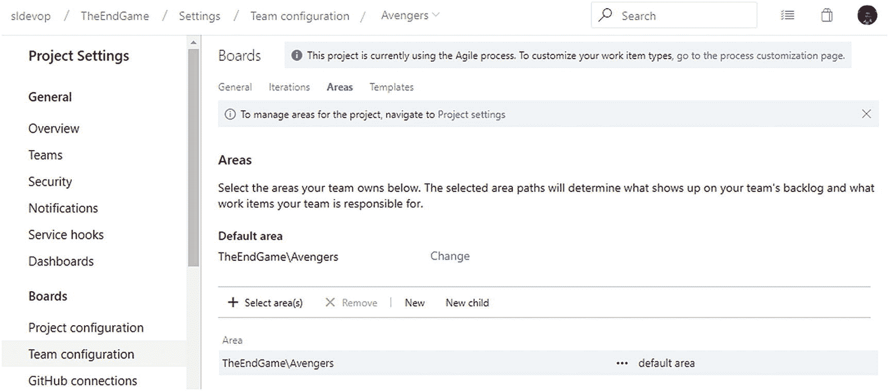

# 七、在团队项目中管理大型团队

[Lesson 7-1\. Understanding the Requirements of Multiple Teams](#Sec1) [Lesson 7-2\. Configuring Areas and Teams to Isolate Backlogs](#Sec2) [Isolating the Backlogs](#Sec3) [Achieving a Hierarchical Team Structure](#Sec4) [Sharing the Same Backlog with Multiple Teams](#Sec5) [Lesson 7-3\. Sharing the Same Iteration with Multiple Teams](#Sec6) [Lesson 7-4\. Working with Different Release Cadences for Teams](#Sec7) [Lesson 7-5\. Sharing a Team Member Across Multiple Teams](#Sec8) [Summary](#Sec9)

敏捷原则和现代迭代软件开发实践表明，一个软件开发团队应该由六到九个成员组成。然而，由于软件项目的复杂性或规模，或者要求苛刻的客户期限，您可能不得不容纳更多的团队成员来满足所需的目标。在这种情况下，敏捷实践建议将软件项目划分成模块，这些模块可以由理想规模的 6 到 9 人的敏捷团队来处理。这意味着多个团队一起工作来实现项目目标。

在这一章中，我们将首先讨论大型团队的需求，以及如何有效地将一个大型团队组织成多个子团队。然后，我们将介绍如何利用 Azure Boards 的功能来组织和管理一组团队，以实现单个项目目标。

## 第 7-1 课。理解多个团队的需求

在某些情况下，您必须管理一个相当大的团队，可能是因为项目/产品的复杂性或紧张的截止日期。敏捷实践并不推荐大型团队，因为它们会导致团队合作、协作、交流和其他问题的复杂化。

当一个团队变得太大，要交付的工作量很大或很关键时，在子团队之间划分工作是处理这种情况的最好方法。您可能会选择一种技术方法来将工作分成多个团队，比如让一个团队处理数据库更改，另一个团队处理后端代码编写(比如数据访问逻辑)，另一个团队编写业务模块，另一个团队负责用户界面实现。然而，这种分工是不推荐的，并且经常导致项目不成功。此外，这种以技术为中心的团队完全违背了敏捷的概念，敏捷推荐拥有一个多技能和跨职能的团队。例如，当您有一个只处理数据库的专家团队时，其他团队必须等到数据库团队完成他们的工作后才能开始工作。这种孤立的思维定势将会产生，并导致完成工作以达到需求的协作减少。

因此，当你划分团队时，确保你关注的是业务模块而不是技术原因。您希望团队是跨职能的，并且能够专注于独立完成业务需求。单个团队的贡献应该在一个更大的软件系统中创建组件，并且应该尽可能与其他团队的工作松散耦合。

确保随时监控所有团队的工作进展也是至关重要的。如果你不这样做，很可能你会错过最后期限，或者你会在软件开发过程中遇到最后的障碍或风险。来自不同子团队的利益相关者之间的沟通不畅是另一件需要注意的事情。对项目的发展方向没有清晰的认识是很危险的。此外，当团队开始发布系统的每个组件并在它们之间进行集成时，如果您没有提前制定适当的计划，事情会变得更糟。在接下来的课程中，我们将讨论如何在利用 Azure Boards 特性的同时，划分一个大型团队并有效地管理它。

正如我们在第 [2](02.html) 章中所讨论的，对于小型团队，您从创建团队项目开始。不管你的团队规模有多大，这一步都差不多。正如我们所讨论的，您可以选择任何现成的模板(敏捷、Scrum、基本或 CMMI)，或者使用任何定制的过程模板来创建团队项目。为了避免管理的复杂性，您必须在过程的早期阶段决定如何执行项目/产品开发。例如，让我们假设这个项目很复杂，有几个模块，比如成员管理、事件管理、财务管理、案例管理等等。在这种情况下，什么是理想的前进方式？您应该模块化开发过程，以便所有应用模块由多个团队并行开发。话虽如此，挑战在于决定如何划分您的团队来并行交付模块。有各种各样的方法可以做到这一点，我们将讨论为您的产品/项目最终用户快速提供最大商业价值的最佳解决方案。受技术启发的团队成员可能希望根据技术方面来划分团队。例如，他们可能希望将工作分成如下几类:前端开发、业务流程和插件开发、数据库开发等等。这种方法的危险在于，整个团队可能最终会失去对项目商业目的的关注，而继续只关注其技术方面。在任何时候，团队的目标都应该是向最终用户交付价值。像这样的部门，你和你的团队没有向最终用户释放价值。相反，你的团队只专注于完成分配给他们的工作。结果，集成变得繁琐，并导致不必要的延迟。

因此，最合适的团队划分方式是基于项目的业务功能。例如，您可以创建不同的团队来开发成员管理、财务管理、案例管理、事件管理等等。每个团队都有自己的开发人员和测试人员，以及自己的 Scrum 大师。您可以创建两个不同的团队来处理开发工作和支持工作。同样，您可以在主团队项目下创建相关团队，并将团队成员分配到您创建的每个团队。您可能希望每个团队都有一个发展子团队和一个支持子团队。见图 [7-1](#Fig1) 。

图 7-1

嵌套团队结构

然而，嵌套团队在 Azure Boards 中是不可能的，这意味着你不能拥有如图 [7-1](#Fig1) 所示的团队结构。其实没必要有这么复杂的团队结构。显然，对于一个大的团队和一个复杂的项目，你可以有一个或两个独立的支持团队来处理所有模块的支持活动。因此，你可以为每个模块建立一个团队，然后在根团队下建立一两个支持团队。话虽如此，如果您真的希望每个模块都有一个开发团队和一个支持团队，因为您在技术上以完全解耦的方式处理每个单独的模块，并且每个模块都有自己独立的发布节奏，那么您应该怎么做呢？解决这个问题的一个办法是创建所有需要的团队，并为他们分配区域，然后将需要的模块开发或支持团队区域作为子模块移动到相关的模块区域下。这听起来是不是很混乱？让我们在本章的下一课中通过实际实现一个解决方案来简化它。

与理想规模的团队一样，您必须为大型团队的项目/产品开发定义交付节奏。请记住，这是很棘手的，因为不同的团队将致力于他们被分配到的每个模块的特性，并且他们承担的工作可能有不同的复杂程度。一些团队可能会根据他们正在工作的功能要求更长的交付节奏。例如，一个团队可能想要三周的交付周期，而另一个团队可能想要四周的交付周期。即使 Azure Boards 支持不同长度的迭代，如果您没有正确地设置迭代和管理工作，您的项目交付目标和交付质量很可能会陷入混乱。因此，为了使您的工作更简单，您可以设置一个相同长度的交付节奏，每个团队都将与之保持一致。当涉及到集成时，这是很方便的，因为您将向客户发布完全烘焙好的产品。然而，这个决定同样依赖于您的团队选择交付给项目的技术架构和平台。在您开始项目之前，很好地计划并定义您的每个团队的交付节奏是很重要的。对于这一点，你需要得到你的技术团队的支持，考虑方方面面；例如，如果您有一个松散耦合的模块设计，能够用不同模块的新版本支持其他模块的旧版本，那么您可以考虑让每个模块有不同的交付节奏。或者，您可能希望在每个模块中使用不同的迭代周期，但是对所有模块保持相同的交付步调。为此，您可以与所有模块共享一个迭代级别来表示发布，然后为每个模块团队拥有不同的子迭代。这些只是一些想法，但是为了让你的迭代设置真正工作，你需要弄清楚你想要它如何工作，然后操纵 Azure Boards 以你想要迭代的方式工作。让我们在本章的下一课中实际设置它，这样你就可以理解实际中可能的实现。

当您开始执行项目/产品开发工作时，了解您团队的当前状态是极其重要的。当您执行大型项目时，尽早发现任何挫折或延迟是至关重要的，这样您就可以采取纠正措施来减轻问题。正如第 6 章所解释的，Azure Boards 附带了一套报告工具，比如查询、图表、看板和仪表板；这些能让你和你的团队保持联系。

## 第 7-2 课。配置区域和团队以隔离积压工作

您可以使用区域路径设置来隔离单个团队项目中每个团队的积压工作。即使不支持嵌套团队，区域路径也可以用作实现分层团队结构的变通方法。此外，您可以与多个团队共享区域路径，以共享共同的 backlog。让我们探索在团队项目中使用区域和团队来建立大型项目的团队结构的选项。

### 隔离积压

让我们尝试使用区域路径隔离每个团队的积压工作。为此，首先创建一个名为 **TheEndGame** 的新团队项目。然后在团队项目的项目设置中，转到“常规”部分中的“团队”选项卡，并单击“新建团队”。命名团队**复仇者**。确保创建一个带有团队名称的区域路径。见图 [7-2](#Fig2) 。

图 7-2

创建新团队

创建另一个名为 **IronMan** 的队伍，队伍名称带有区域路径。现在团队项目中应该有三个团队:TheEndGame 团队，它是团队项目的根团队(团队项目的默认团队)，以及您刚刚创建的两个新团队，复仇者联盟和钢铁侠。见图 [7-3](#Fig3) 。

图 7-3

组

让我们通过选择“Project configuration”并转到 Areas 选项卡来检查团队项目中的区域路径设置。你应该看到根区域路径被设置为 EndGame，并且有两个子区域，复仇者联盟和钢铁侠。见图 [7-4](#Fig4) 。

图 7-4

项目区域配置

然后选择“团队配置”并选择 EndGame 团队，这是默认或根团队。团队的默认区域应该设置为结束游戏，并且它已经在结束游戏团队的选定区域下被选中。让我们单击 EndGame 选定区域的上下文菜单，然后单击“Include sub areas ”,使 EndGame 团队可以看到该团队项目中的所有待定项。当您包括子区域时，将出现一条警告消息，指出该团队项目的所有工作项都将显示在此团队中。单击 OK，因为这是您要实现的预期行为。最终游戏团队的区域配置应该类似于图 [7-5](#Fig5) 。您使每个 backlog 工作项对根/默认团队可见，这样您就可以从默认团队的角度监视整个项目的进展。

图 7-5

包含子区域的根/默认团队区域路径集

选择复仇者团队查看复仇者团队的区域设置。目前，您不必选择“包括该团队的子区域”,因为您还没有实现嵌套团队，如第 7-1 课所述。只要确保复仇者团队的默认区域设置为 EndGame\Avengers 即可。参见图 [7-6](#Fig6) 。

图 7-6

复仇者联盟团队区域设置

验证 Ironman 团队区域路径设置为使用 EndGame\IronMan 作为默认区域路径，并且不包括子区域。

转到默认团队 EndGame 的 Iterations 选项卡，通过更改当前选择将默认迭代设置为 EndGame，当前选择是@currentiteration。您这样做是因为您希望新的 backlog 项位于 Backlog 迭代中，Backlog 迭代是 EndGame 的根级迭代，而不是当前的活动迭代。参见图 [7-7](#Fig7) 。我们已经在第 2-2 课中详细描述了这些选项。

图 7-7

根迭代设置为默认和待定迭代

游戏结束应该被设置为复仇者联盟和钢铁侠这两个团队的 backlog 和默认迭代，如图 [7-7](#Fig7) 所示。这将确保您从任何团队添加的任何项目都将迭代路径设置为根迭代，也就是 EndGame。不要担心任何团队的选定迭代，因为我们将在第 7-3 课中讨论共享公共迭代，以遵循所有团队的相同交付步调。我们将在第 7-4 课中讨论使用独立的迭代路径为每个团队提供独立的交付步调。

现在让我们在游戏结束时给团队添加一些待办事项。现在，您可以跳过 Epic 和 Feature 工作项，使用 board 或 backlog 视图将用户故事添加到 backlog 中。例如，参见图 [7-8](#Fig8) 。

图 7-8

根团队 backlog 中的系统故事

假设从 backlog 来看，teller 模块是由复仇者团队开发的，而 customer 模块是由 IronMan 团队开发的交易模块。如果你检查每个团队的积压，你将无法在复仇者联盟团队或铁人三项团队的积压视图中看到任何用户故事。参见图 [7-9](#Fig9) 。

图 7-9

《复仇者联盟》和《钢铁侠》的空白积压

让我们回到 EndGame 团队的面板，将出纳员用户故事分配到复仇者区域路径，将客户用户故事分配到 IronMan 团队区域。即使在将它们分配给团队之后，故事仍然会出现在根团队的 backlog 中，因为您已经设置了根团队来显示根区域的子区域的所有工作项。参见图 [7-10](#Fig10) 。

图 7-10

分配给各自团队区域的故事

如果你现在检查复仇者联盟和铁人三项团队的积压，你将能够看到只有相关的故事出现在他们的积压，按照每个团队的区域设置。见图 [7-11](#Fig11) 。

图 7-11

仅显示与每个团队相关的积压工作的团队

这个示例场景展示了如何使用区域路径来隔离每个团队的积压工作，并让团队专注于他们自己的工作，而不用担心另一个团队的工作项目。但是，根/默认团队将帮助您跟踪整个项目，并从仪表板中的 boards 视图或任何图表等查看项目的进度。

### 实现分层团队结构

让我们来看一个场景，你用过的复仇者团队和铁人团队都需要有独立的开发和支持团队，正如我们在第 7-1 课中讨论的。为了实现嵌套的团队结构，这对于团队来说是不可用的，您可以使用层次区域。首先创建另外四个团队，AvengersDev、AvengersSupport、IronManDev 和 IronManSupport，并为这些团队创建区域路径。这将在 EndGame 团队区域下创建一个扁平的团队结构。参见图 [7-12](#Fig12) 。

图 7-12

项目团队区域

可以将复仇者 Dev 和复仇者 Support 区域拖放到复仇者区域，将 IronmanDev 和 IronManSupport 区域拖放到 IronMan 区域，创建一个层次化的区域结构，如图 [7-13](#Fig13) 所示。

图 7-13

分层区域结构

现在你必须进入复仇者联盟和铁人联盟的团队区域设置，并在每个团队中为选定的团队区域包含分区。这一改变将允许你从复仇者团队中监控分配给复仇者开发或复仇者支持的任何工作。IronMan 战队也是如此。TheEndGame 团队可以用来监控整个项目进度。

### 与多个团队共享相同的待办事项

如果您需要与多个团队共享同一个 backlog，并让他们处理任何工作项，您可以通过为两个团队选择相同的区域路径来实现。

在本课中，我们讨论了如何在多团队设置中使用区域路径来隔离或共享积压工作。

## 第 7-3 课。与多个团队共享同一个迭代

与不同的团队共享相同的交付节奏可以使监控整个项目更加容易。在这一课中，您将学习如何与迭代路径共享一个共同的交付步调。

让我们转到项目设置，选择“项目配置”，并转到迭代选项卡来设置迭代的层次结构，如图 [7-14](#Fig14) 所示。

图 7-14

项目迭代

然后转到每个团队，并为团队选择已定义的迭代。比如复仇者联盟队伍的迭代可以设置如图 [7-15](#Fig15) 所示。

图 7-15

为复仇者联盟选择的迭代

一旦所有团队都设置了迭代，您就可以为每个团队定义容量。在这里，您可以将所有团队的所有成员添加到根/默认团队中。然后，您可以添加单个团队成员。这有助于您为整个项目迭代以及单个团队建立容量规划。在图 [7-16](#Fig16) 中，为了简单起见，每个团队只添加了两个成员，所有四个成员都被添加到了根团队。然后，考虑到活动类型以及所有三个团队，迭代 1 的容量被正确地计划。您在第 2-5 课中学习了如何设置容量。

图 7-16

多个团队共享迭代时的容量规划

现在将你在 7-2 课中定义的所有故事从游戏团队转移到迭代 1 中。然后到每个团队迭代板上，为每个故事添加一些任务，包括剩余的工作和相关的活动类型。例如参见图 [7-17](#Fig17) 。你在第三章[中学习了如何添加任务和使用电路板。](03.html)

图 7-17

添加到团队用户情景中的任务

现在，当你在复仇者联盟和铁人三项团队中查看迭代 1 的工作细节时，你可以按工作类型查看容量和增加的工作。如果您通过向成员分配任务来开始迭代中的工作，那么每个单独的容量使用情况也会显示出来。参见图 [7-18](#Fig18) 。

图 7-18

单个团队的工作细节

在 default/root 团队中，您将能够看到两个团队在迭代 1 中的容量和使用情况的概述。参见图 [7-19](#Fig19) 。

图 7-19

迭代的总容量和使用视图

您现在了解了如何与多个团队共享迭代，并设置容量规划，以允许您使用默认团队来启用子团队进度的概览。您可以对分层团队使用相同的方法，并通过在共享相同的发布节奏时遵循相同的原则，获得每个团队的有效概述。

## 第 7-4 课。为团队使用不同的发布节奏

让我们试着为你在第 7-3 课中使用的相同的两个团队实现不同的发布步调。

作为先决条件，使用根团队将所有待定项从迭代 1 移回待定项。参见图 [7-20](#Fig20)

图 7-20

将所有工作项移动到待办事项中

为团队项目配置设置迭代，如图 [7-21](#Fig21) 所示。前缀用于标识迭代所属的团队。

图 7-21

不同节奏的团队的迭代

然后你可以选择单个团队迭代(见图 [7-22](#Fig22) )，分别设置每个团队(复仇者联盟和钢铁侠)中的能力和工作项目。您可以在单个团队内获得每个团队的工作详细进度。然而，当您在每个子团队中有不同的交付节奏时，就不可能获得容量的综合视图。

图 7-22

每个选定团队的不同迭代

您可以设置根团队来使用来自两个团队的迭代。见图 [7-23](#Fig23)

这允许您通过根团队看到两个迭代视图，比如工作细节和计划。尽管这不如使用相同交付节奏时的整合视图有用，但它仍然是有用的信息。

图 7-23

根团队中的迭代选择

在本课中，您学习了如何为各个团队设置不同的发布节奏。然而，正如我们在第 7-1 课中所讨论的，应该尽可能避免这种方法。此外，设置不同的交付步调将不允许合并视图，这对于单个软件项目的计划和执行是有用的。然而，如果一个组织正在使用不同的团队处理一个团队项目中的多个项目，拥有不同的发布节奏的能力是有用的。然后一个项目团队可以被认为是根团队，它可能有使用区域路径层次的子团队，这样每个项目可以有给定项目团队的子团队迭代的合并视图，使用在第 7-3 课中解释的相同概念。

## 第 7-5 课。在多个团队中共享一个团队成员

当你没有足够的技术资源时，在多个团队中共享团队成员会很有用，即使敏捷原则不鼓励你在团队中共享资源。但是，出于实际需要，您可能会让同一个团队成员在不同的团队中工作。

让我们来看看在将同一个团队成员分配到多个团队时，您需要考虑什么。

将用户添加到任何团队都非常简单，第 [8](08.html) 章给出了更多关于如何设置安全性的细节。只要用户被添加到相关的团队中，用户就能够处理该面板中的工作项。

然而，一个人每天的能力是有限的。如果您使用小时作为工作单位，敏捷实践建议在给定的一天中使用最多 6.5 小时的计划能力，因为一天中的其余时间可能需要平衡敏捷仪式(如冲刺计划、每日站立、回顾和回顾)所花费的时间。因此，当您设置总容量时，请注意分配给每个团队的容量是如何累加到一个人身上的。比如图 [7-24](#Fig24) 中的用户 Chaminda，同时被分配到复仇者联盟和钢铁侠战队，但总产能不足 6.5 小时。

图 7-24

分配多个团队的能力

在本课中，您了解了将同一个人分配到多个团队时的注意事项。然而，我们建议尽可能不要这样做，因为这会降低人们的工作效率，这是由于环境的转换，在多个团队中集中精力工作的困难，以及敏捷实践建议中提到的许多其他原因。

## 摘要

在本章中，您探索了为什么需要建立多个团队来处理单个团队项目中的大型项目。详细解释了隔离积压工作和获得共享迭代的合并视图的选项。此外，我们讨论了设置不同的交付节奏，以及在多个团队之间共享团队成员。使用本章中获得的知识，您可以尝试区域路径和迭代路径的不同设置，以得出满足您特定需求的解决方案。Azure Boards 灵活且可定制；通过使用团队、区域和迭代，您可以解决现代软件开发团队可能遇到的几乎任何需求。

在下一章，你将会看到 Azure Boards 中可用的安全选项；您将学习如何在每个区域(如团队、项目甚至组)中设置适当的访问权限，以正确组织权限结构。