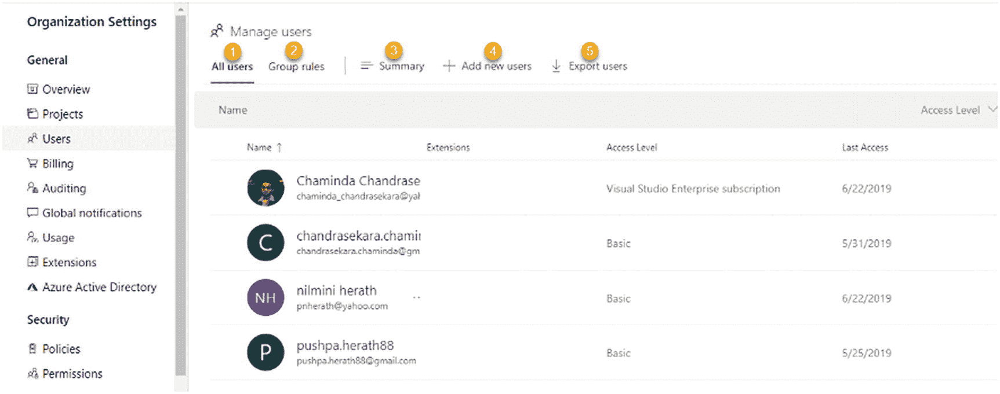
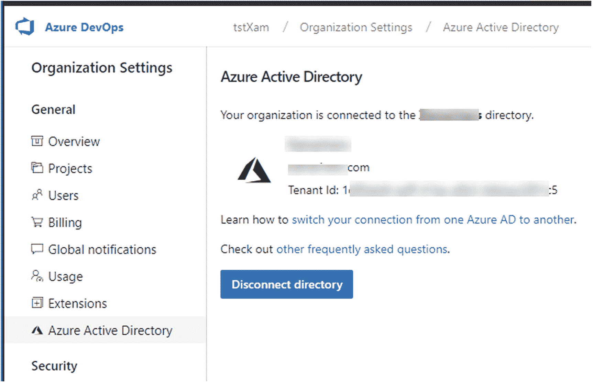
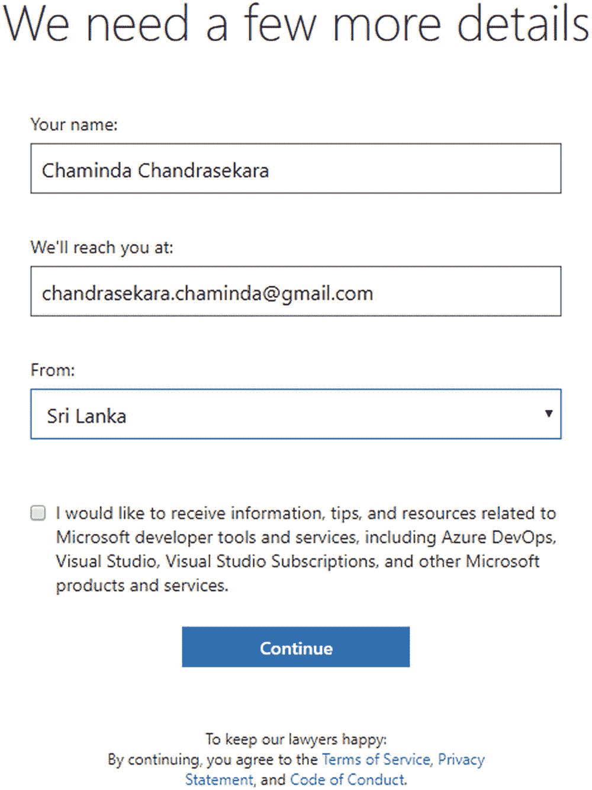
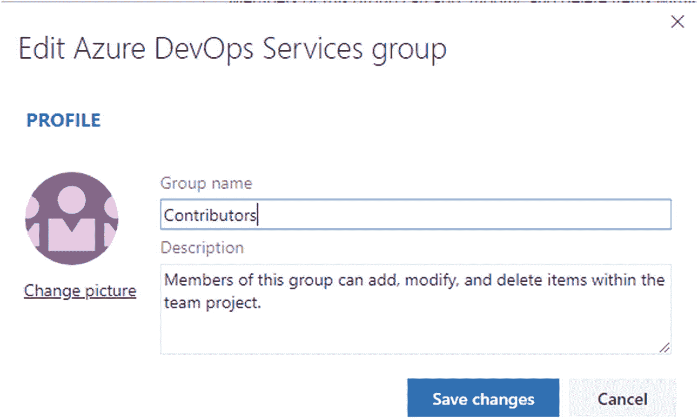
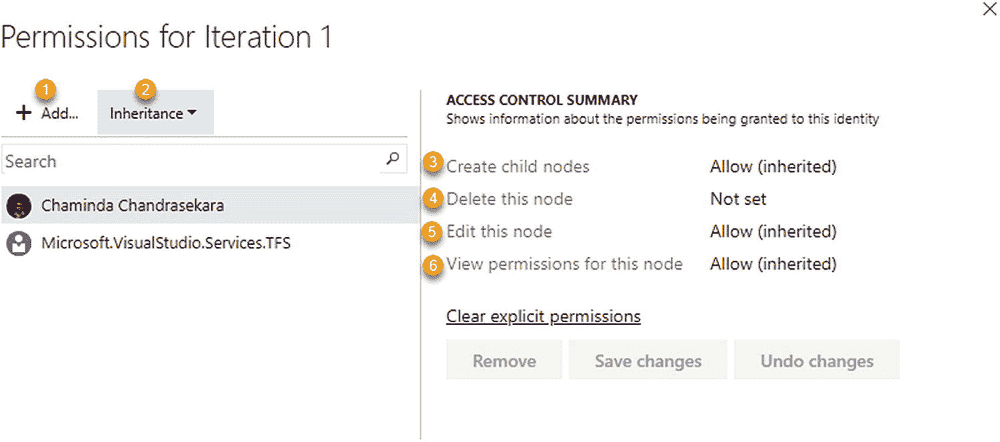

# 8.Azure DevOps 安全选项

[Lesson 8-1\. Adding Users to Azure DevOps](#Sec1) [Lesson 8-2\. Setting Up Azure DevOps Organization-Level Security Policies and Permissions](#Sec2) [Lesson 8-3\. Enabling Access to External Users in Organization-Backed Azure DevOps Accounts](#Sec3) [Lesson 8-4\. Granting a License for Extended Paid Features](#Sec4) [Lesson 8-5\. Setting Up Organization-Level Security Options for a Process Template](#Sec5) [Lesson 8-6\. Setting Up Project-Level Security Options](#Sec6) [Iteration Permissions](#Sec7) [Area Permissions](#Sec8) [Shared Queries Permissions](#Sec9) [Lesson 8-7\. Setting Up Team-Level Security](#Sec10) [Lesson 8-8\. Setting Up User-Level Security Options](#Sec11) [Personal Access Token](#Sec12) [Alternate Credentials](#Sec13) [SSH Public Keys](#Sec14) [Summary](#Sec15)

Azure DevOps 提供了广泛的访问控制和安全功能。您可以使用 Azure DevOps 权限控制谁可以访问项目、团队、源代码、构建部署管道、工作项等等，这些权限适用于个人和用户组。Azure DevOps 中的权限范围从组织级权限到团队项目权限到团队权限再到个人用户权限。此外，每个功能区都有与安全相关的选项。例如，区域路径、迭代路径和查询都有自己的安全设置和权限。

在这一章中，你将看到与 Azure DevOps 组织、团队项目和团队相关的每个可用的安全和权限选项，以及与 Azure Boards 相关的整体权限。我们将跳过其他权限领域，如管道、回购和测试管理，因为我们将在本系列的相关书籍中讨论它们。

## 第 8-1 课。将用户添加到 Azure DevOps

本课将解释如何向 Azure DevOps 添加用户，以及如何为每个用户管理不同的访问权限。

在组织设置下，选择常规部分中的用户。您将看到用户管理页面。见图 [8-1](#Fig1) 。

图 8-1

Azure DevOps 组织的用户管理

1.  在本节中，您将看到 Azure DevOps 组织的所有现有用户。

2.  您可以定义组规则，这些组规则将显示在此处。

3.  左窗格将显示组规则摘要。

4.  Click the “Add new users” link to add new users to the Azure DevOps organization. A pane will open where you can enter details for the new user. See Figure [8-2](#Fig2).

    

    图 8-2

    添加新用户

    1.  输入用户名。您可以通过用户名或电子邮件地址进行搜索。

    2.  选择访问级别。
        *   **基础**:获得对版本控制、敏捷工具、Java、构建和发布管理等特性的基础级用户访问。

        *   **涉众**:该访问权限允许用户管理工作项，批准构建和发布。

        *   **Visual Studio 订阅者**:在这个权限级别，用户获得所有的访问权限，包括基本级别的特性访问权限。例如，除了 Visual Studio 订户用户的基本用户功能之外，还允许测试管理功能。

    3.  从列表中选择一个项目。

    4.  选择需要添加此用户的 Azure DevOps 组。以下是可用的组:
        *   **项目贡献者**:用户有权限贡献项目代码和工作项跟踪。

        *   **项目阅读者**:用户有查看项目信息的权限，但没有修改项目信息的权限。

        *   **项目管理员**:用户拥有管理所有团队和项目的权限。

    5.  启用“发送电子邮件邀请”选项，向添加的用户发送邀请。

5.  “导出用户”选项允许您下载 CSV 文件格式的用户详细信息。

当您选择组策略部分时，您会看到菜单项已经更改。参见图 [8-3](#Fig3) 。

图 8-3

分组规则菜单项

单击“添加组规则”链接添加新的组规则。单击它后，左侧窗格将打开，您可以输入组规则详细信息。参见图 [8-4](#Fig4) 。

图 8-4

“添加群组规则”面板

1.  您可以选择项目并将其添加到组规则中。

2.  选择项目后，将启用 Azure DevOps 组部分。您可以从下拉列表中选择用户权限-项目参与者、项目读者和项目管理员。

1.  创建新的 Azure DevOps 组或在 Azure DevOps 或 Azure Active Directory (AAD)中选择一个组。

2.  更改选项以将用户从 AAD 和 Azure DevOps 添加到组。

3.  组规则可以有三个访问级别。
    *   **基础**:获得对版本控制、敏捷工具、Java、构建和发布管理等特性的基础级用户访问。

    *   **利益相关方**。此访问权限允许用户管理工作项以及批准版本和发布。

    *   **Visual Studio 订阅者**。在此权限级别，用户获得所有访问权限。

“重新评估规则”选项允许工厂重新评估规则。如果 AAD 有任何变化，这些变化将在重新评估后影响该组。这个过程大约需要十分钟才能完成。

在本课中，我们讨论了如何向 Azure DevOps 添加用户以及如何定义组规则，这将帮助您基于组设置访问级别。

## 第 8-2 课。设置 Azure DevOps 组织级安全策略和权限

Azure DevOps 允许您控制不同级别的安全性。例如，可以在组织层或项目层控制安全性。本课将解释组织级别可用的安全功能。

***先决条件*** :你需要有一个 Azure DevOps 组织。

转到 Azure DevOps 组织设置。您将看到一个包含策略和权限项目的安全部分。选择策略部分以标识策略功能。您将在本页看到“应用程序连接策略”和“安全策略”部分。参见图 [8-5](#Fig5) 。

图 8-5

组织政策

Azure DevOps 提供了将其他应用程序与其服务和资源相集成的能力。当使用这些类型的工具建立连接时，Azure DevOps 引入了三种身份验证机制，允许您访问 Azure DevOps，而无需多次提供用户凭据。您可以看到，每个策略前面都有一个下拉框，其中包含启用或禁用每个策略的值。

1.  **替代认证凭证**:我们将在第 8-8 课中解释这一点。

2.  **通过 OAuth 的第三方应用程序访问**:使用 OAuth 2.0 协议授权应用程序，并生成访问令牌，这允许您从应用程序调用 REST API。

3.  **SSH 验证**:您可以通过启用此选项为 Azure DevOps 设置 SSH 访问。

4.  **允许公共项目**:如第 [1](01.html) 章所述，你可以通过在 Azure DevOps 中创建公共和私有项目来控制项目认证。只有在启用此策略后，您才能创建公共项目。

    Let’s move to the Permissions section now. Two tabs are available on this page: Groups and Users. Several groups are listed in this page. See Figure [8-6](#Fig6). Let’s identify each group.

    

    图 8-6

    权限组

5.  **项目集合管理员**:该组成员拥有执行 Azure DevOps 中所有可用操作的权限。

6.  **项目集合构建管理员**:该组的成员拥有查看实例级信息、创建工作区、管理构建资源权限、管理构建资源以及查看构建资源的权限。

7.  **项目集合生成服务帐户**:该组的成员几乎拥有项目集合生成管理员组拥有的所有权限。他们有权查看实例级信息、创建工作区、管理搁置的更改、管理生成资源、使用生成资源以及查看生成资源。

8.  **项目集合代理服务帐户**:该组的成员拥有查看实例级信息、创建工作区和查看构建资源的权限。

9.  **项目集合服务帐户**:该组成员除了删除团队项目的权限之外，几乎拥有所有权限。

10.  **项目集合测试服务帐户**:该组的成员拥有查看实例级信息、创建工作区和查看构建资源的权限。

11.  **项目集合有效用户**:这个组的成员拥有查看实例级信息、创建工作区和查看构建资源的权限。

12.  **安全服务组**:该组成员拥有与项目集体有效用户组相同的权限。

双击任一组以查看该组的权限。此外，在“成员”选项卡上，您将看到组的现有成员，并可以向组中添加新用户。使用“隶属于”选项卡，您可以将选定的组添加为另一个组的成员。参见图 [8-7](#Fig7) 。

图 8-7

群组权限

让我们看看如何将组添加到“成员”选项卡。转到“成员”选项卡，然后单击“添加成员”按钮。在页面左侧，您可以搜索现有组并将其添加为所选组的成员。参见图 [8-8](#Fig8) 。

图 8-8

将一个组添加为另一个组的成员

如果您想向组中添加新成员，请转到“成员”选项卡，然后单击“添加成员”按钮。窗格左侧将会打开，您可以在其中搜索 Azure DevOps 用户并将其作为成员添加到所选组。参见图 [8-9](#Fig9) 。

图 8-9

添加新的组成员

在本课中，我们讨论了 Azure DevOps 组织设置中可用的安全功能。在本课中，您学习了如何在组织级别设置 Azure DevOps 控制策略和权限。

## 第 8-3 课。允许访问组织支持的 Azure DevOps 帐户中的外部用户

如果您已经创建了 Azure DevOps 组织并将其连接到该组织的 Azure Active Directory (AAD ),您可能希望外部利益相关方能够在没有 AAD 帐户的情况下访问您的 Azure DevOps 组织。在这一课中，让我们看看如何授予外部用户对 AAD 支持的 Azure DevOps 组织的访问权限。

您可以通过在“组织设置”下选择 Azure Active Directory 来确定 Azure DevOps 组织是否受 Azure Active Directory 支持。转到常规部分。参见图 [8-10](#Fig10) 。

图 8-10

由 AAD 组织支持的 Azure DevOps

在 Azure DevOps 组织安全策略(可在组织设置的安全部分找到)中，您必须将“外部来宾访问”设置为打开。参见图 [8-11](#Fig11) 。请注意，您需要拥有项目集合管理员权限才能进行此策略更改。

图 8-11

外部来宾访问已启用

在组织设置的“常规”部分的“用户”选项卡上，单击“添加新用户”当您键入用户名时，将列出组织用户，您可以快速将组织用户添加到 Azure DevOps。但是，当您键入某个组织用户的电子邮件地址时，会出现一条警告消息，提示您正在邀请外部用户。该警告进一步指出，外部用户必须单击 Azure DevOps 发送的电子邮件中的链接，才能开始使用 Azure DevOps 组织。确保选中发送电子邮件邀请的选项，然后单击“添加用户”根据用户的授权，可以将访问级别设置为基本、利益相关者或 Visual Studio 订户。参见图 [8-12](#Fig12) 。

图 8-12

向 AAD 支持的 Azure DevOps 添加外部用户

将向外部用户发送一封邀请电子邮件。然后，外部用户可以单击“加入”按钮来访问组织。参见图 [8-13](#Fig13) 。

图 8-13

邀请加入 AAD 支持的 Azure DevOps

出现提示时，外部用户必须使用他们的 Microsoft 帐户提供凭据和登录信息。然后，将出现一个查看权限对话框，授予组织访问权限以捕获活动，如登录 Azure DevOps 组织。参见图 [8-14](#Fig14) 。

图 8-14

接受权限

一旦它们被接受，外部用户需要提供一些附加信息，如图 [8-15](#Fig15) 所示。

图 8-15

捕获的附加信息

这样，外部用户将能够登录到 AAD 支持的 Azure DevOps 组织。

在本课中，您探索了将外部用户添加到组织的 AAD 支持的 Azure DevOps 所需的步骤。当您想要添加外部涉众，比如产品所有者或您的软件项目客户时，这将特别有用。

## 第 8-4 课。授予扩展付费功能的许可证

许多扩展在 Visual Studio market place for Azure devo PS 中可用。(事实上，我们将在第 [10](10.html) 章讨论设置扩展。)其中许多是免费的，但也有一些附带了付费用户许可证。对于这样的扩展，用户需要被授予可用的许可证。让我们看看在 Azure DevOps 中授权访问付费扩展所需的步骤。

在“组织设置”的“常规”部分的“用户”选项卡上，列出了组织的所有用户。选择一个用户并单击三个点以获得该用户的上下文菜单。参见图 [8-16](#Fig16) 。

图 8-16

管理用户的分机

在用户扩展管理弹出窗口中，您可以看到付费扩展列在扩展选项卡上。如果您有可用的许可证，可以选中所需扩展的复选框，以授予用户对该扩展的访问权限。参见图 [8-17](#Fig17) 。

图 8-17

授予访问扩展的权限

在您单击“保存更改”后，用户将能够使用该扩展的附加功能

在本课中，我们讨论了在 Azure DevOps 中向用户授予付费扩展访问权限所需的步骤。

## 第八至五课。为过程模板设置组织级安全选项

众所周知，Azure DevOps 提供了四种现成的过程模板:基本、Scrum、敏捷和 CMMI。除了使用这些模板之外，您还可以基于现有模板创建自定义的流程模板。Azure DevOps 具有控制每个流程模板的访问权限的功能，以便用户可以自定义它们。让我们学习本课中可用的流程模板安全选项。

转到“组织设置”,并在“董事会”部分选择“流程”。您将能够看到流程模板。单击过程模板名称前面的三个点，然后选择“安全性”。

“权限”窗口将会打开，您可以在其中为用户授予权限。参见图 [8-18](#Fig18) 。

图 8-18

过程模板的安全性

默认情况下，您不能编辑项目集合管理员的权限。添加新用户，并通过单击“未设置”值来更改该用户的“创建流程”权限。通过单击该值，您可以将权限值更改为允许或拒绝。此外，您可以使用三个按钮来更新权限。

*   **删除**:从权限网格中删除选中的用户

*   **保存更改**:保存权限更改

*   **撤销更改**:撤销对权限的更改

您已经了解了可以为过程模板用户设置什么类型的权限。但是在定制流程模板时，您有更多的权限选项。让我们看看如何控制自定义流程模板的权限。转到过程模板区域。单击自定义流程模板名称前面的三个点，然后选择安全性。您可以使用此窗口添加新用户来控制流程权限。参见图 [8-19](#Fig19) 。

图 8-19

自定义过程模板权限

使用此窗口，您可以控制对自定义模板三种类型的访问。

*   **管理流程权限**:完全控制权限

*   **删除流程**:删除流程模板的权限

*   **编辑流程**:编辑流程模板的权限

本课向您介绍了流程模板设置中可用的安全选项，以便您可以控制 Azure DevOps 用户的权限。

## 第八至六课。设置项目级安全性选项

团队项目主要用于在 Azure DevOps 中确定客户端软件项目或产品的范围。一些组织使用单个团队项目来管理他们所有的软件项目。在这两种情况下，确定团队项目级别上可用的安全选项对于设置访问权限和控制谁可以访问哪些功能至关重要。让我们看看 Azure DevOps 中可用的每个项目级安全选项。

项目安全性主要可以在项目设置的安全性选项卡上进行设置。参见图 [8-20](#Fig20) 。

图 8-20

项目安全性

1.  这允许您创建一个安全组。一个组可以成为其他组的成员，并且可以包含其他组或成员。

2.  每个团队都将创建一个小组。一般来说，一个新的团队被添加为 Contributors Azure DevOps 组的成员，以便向该团队授予向项目贡献工作的权限。

3.  此处提供内置 Azure DevOps 组和自定义组。

4.  You can edit the selected group’s name, description, and image using the dialog that opens when you click the Edit link. See Figure [8-21](#Fig21).

    

    图 8-21

    编辑群组

5.  此处提供了团队的项目级权限规范。您可以更改项目管理员组以外的其他组的权限。

6.  On the Members tab, you can add individuals or groups or teams as members of the selected group. See Figure [8-22](#Fig22).

    

    图 8-22

    向组中添加成员

7.  You can view the groups the currently selected group or team is a member of. You can make the current group or team a member of another group or team if required. See Figure [8-23](#Fig23).

    

    图 8-23

    使一个团体成为另一个团体的成员

团队项目中的项目管理员组被授予团队项目的所有权限，并且这些权限不能更改。

在 Azure DevOps 中，权限是从用户所属的组继承的。当权限被继承时，它将显示为允许(继承)。点击为什么？权限旁边显示了该权限是从哪个组继承的。参见图 [8-24](#Fig24) 。

图 8-24

继承的权限

您可以单击单个权限，它们将从“未设置为允许”轮换到“拒绝”。如果给定的权限是从组继承的，则当权限未显式设置为允许或拒绝时，将应用继承的允许。拒绝权限会覆盖从组继承给个人或组的任何允许权限。

### 迭代权限

在项目的“配置”选项卡上，您可以单击“迭代”。然后，在每次迭代中，您可以通过在迭代的上下文菜单中单击 security 来设置安全性选项。您可以设置创建子节点、删除当前节点、编辑当前节点和查看节点权限的权限。您可以保存对可用用户的权限更改，添加新用户或组并设置他们的权限，甚至删除已经拥有权限的组或用户。单击“清除显式权限”将删除所选用户或组的允许权限，并使其成为“未设置”当您执行此操作时,“保存”按钮将被启用，您可以保存或更改您的更改。参见图 [8-25](#Fig25) 。

图 8-25

项目级别的迭代权限

### 区域权限

在项目的配置选项中，您可以选择区域选项卡，并通过在每个区域的上下文菜单中单击安全性来设置单个区域的权限。您可以使用区域权限执行的操作类似于迭代权限。但是，还有其他权限，例如在给定的区域路径中编辑工作项。参见图 [8-26](#Fig26) 。

图 8-26

项目级别的区域权限

### 共享查询权限

可以在团队项目级别设置共享查询权限。您可以在单个共享查询的上下文菜单中单击安全性，也可以在共享查询文件夹中单击安全性，您可以通过查询页面的“全部”选项卡访问该文件夹。可以允许用户/组提供、读取、删除和管理共享查询文件夹或单个共享查询的权限。参见图 [8-27](#Fig27) 。

图 8-27

共享查询权限

在本课中，您探索了团队项目级别的权限，包括适用于项目级别的迭代和区域的权限。此外，我们讨论了项目级别的共享查询权限。

## 第八至七课。设置团队级别的安全性

Azure DevOps 能够创建多个团队，当您有多个团队时，控制每个团队的访问权限非常重要。您可以将不同团队中具有相同权限的用户分组。

转到项目设置，并在常规部分选择团队。单击一个团队。您将能够看到团队档案，您可以在其中添加团队管理员。参见图 [8-28](#Fig28) 。

图 8-28

团队简介

转到项目设置页面上的团队配置部分。您将看到 boards 部分，其中包含 General、Iteration、Areas 和 Templates 选项卡。转到“迭代”选项卡。

单击迭代值前面的三个点，并选择安全设置。“迭代权限控制”窗口将会打开。参见图 [8-29](#Fig29) 。

图 8-29

迭代权限

1.  您可以向权限添加新用户和组。

2.  您可以启用或禁用继承。

    您可以控制添加到“迭代权限”窗口中的每个用户或组的以下权限。

3.  “创建子节点”权限允许或拒绝添加子节点。

4.  “删除此节点”权限允许您删除选定的节点。

5.  “编辑此节点”权限允许您编辑选定的节点。

6.  您可以查看此节点的权限。

关闭此权限窗口并返回到公告板部分；然后转到区域。您将在页面底部看到面积值。单击面积值前面的三个点，然后选择安全。“区域权限”窗口将会打开。参见图 [8-30](#Fig30)

图 8-30

区域许可

1.  添加新节点的权限

2.  删除所选节点的权限

3.  编辑所选节点的权限

4.  编辑所选节点中工作项的权限

5.  管理测试计划的权限

6.  管理测试套件的权限

7.  权限查看所选节点的权限

8.  查看所选节点的工作项的权限

## 第八至八课。设置用户级安全性选项

有几种方法可以在 Azure DevOps 中提供替代的访问凭据。您可以使用个人访问令牌、备用凭证和 SSH 公钥。在本课中，我们来看看这些可用的选项。

登录 Azure DevOps，点击右上角的用户头像，点击安全菜单选项。见图 [8-31](#Fig31)

图 8-31

用户安全性

在“用户设置”菜单中，选择安全，您将看到三个可选的凭证选项。见图 [8-32](#Fig32)

图 8-32

用户的替代凭据选项

### 个人访问令牌

Azure DevOps 中的*个人访问令牌* (PAT)是一个备用密码，您可以使用它来通过 Azure DevOps 进行身份验证。为用户创建 PAT 时，可以将其设置为与用户具有相同的访问级别。如果需要，您还可以缩小访问范围。让我们来看看在 Azure DevOps 中创建 PAT 的步骤。

在“个人访问令牌”选项卡上，您可以单击“+新令牌”来创建新令牌。可以按视图过滤现有令牌，这样您还可以看到活动的、所有的、已撤销的和过期的令牌。见图 [8-33](#Fig33)

图 8-33

个人访问令牌选项卡

单击“+新令牌”创建新 PAT 后，将会打开一个窗格，允许您创建令牌。您可以为令牌提供名称并设置到期日期。令牌的范围可以设置为“完全访问”，这允许用户访问他们通常有权访问的所有功能。或者，您可以将范围缩小到给定令牌的特定访问级别。见图 [8-34](#Fig34) 。

图 8-34

创建 PAT

单击 Create 按钮后，将为定义的范围创建 PAT，您必须复制 PAT 值并将其保存在安全的位置，因为它只会显示一次。见图 [8-35](#Fig35)

图 8-35

PAT 已创建

创建 PAT 后，您可以在“个人访问令牌”选项卡上选择它。选择 PAT 后，您可以为其重新生成令牌。但是，如果您已经在使用以前生成的令牌值，则必须在重新生成令牌后，在使用它的每个地方用新生成的值替换它。您也可以通过在“个人访问令牌”选项卡上选择 PAT 来撤销令牌。要编辑给定令牌的范围、名称和到期日期，请单击“编辑”按钮。见图 [8-36](#Fig36)

图 8-36

编辑、撤销和再生 PAT

当使用 Azure DevOps REST API 以及执行与第三方应用程序的各种集成时，个人访问令牌非常有用。第 9 章将介绍如何在 REST API 中使用 PATs。

### 备用凭据

您可以设置备用凭据来使用 Azure Git Repos。与 pat 不同，备用凭据没有到期日期。见图 [8-37](#Fig37) 。

图 8-37

备用凭据

### SSH 公共密钥

您可以使用运行 Git for Windows 的 Linux、macOS 和 Windows 中生成的 SSH 密钥来认证 Azure DevOps。有关 SSH 密钥在 Azure DevOps 中使用的更多详细信息，请参考 [`https://docs.microsoft.com/en-us/azure/devops/repos/git/use-ssh-keys-to-authenticate?view=azure-devops`](https://docs.microsoft.com/en-us/azure/devops/repos/git/use-ssh-keys-to-authenticate%253Fview%253Dazure-devops) 。

在本课中，我们讨论了 Azure DevOps 中用户可用的替代凭据选项。在这些选项中，个人访问令牌是常用的，您将在第 [9](09.html) 章中了解更多关于它们和 REST APIs 的内容。

## 摘要

我们在本章中讨论了 Azure DevOps 中与 Azure Boards 相关的安全选项。组织级权限以及团队项目和团队权限已经过详细描述，以便您能够根据团队要求设置用户的访问级别。此外，我们探讨了如何将外部用户添加到 AAD 支持的 Azure DevOps 组织中，以及如何向个人用户授予付费扩展的许可证。我们还描述了流程模板权限，以便您可以控制谁被允许扩展和自定义您的 Azure DevOps 组织的流程。此外，您还探索了项目级别、团队级别和个人用户级别的权限，包括如何创建个人访问令牌，以便与 REST APIs 和其他第三方应用程序集成一起使用。

在下一章中，我们将讨论 REST APIs 和 Azure DevOps 命令行接口，它允许您开发扩展，将 Azure DevOps 与其他工具集成，并以灵活和更快的方式管理 Azure DevOps 服务和资源。