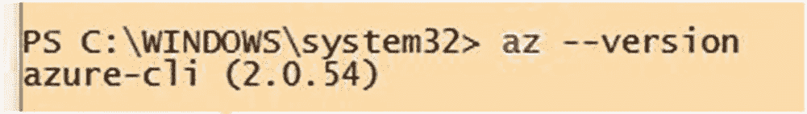

# 九、使用 REST APIs 和 CLI

[Lesson 9-1\. Understanding the REST API Components](#Sec1) [The Request URI](#Sec2) [HTTP Request Message Header Fields](#Sec3) [HTTP Request Message Body](#Sec4) [HTTP Response Message Header Fields](#Sec5) [HTTP Reponses Message Body Fields](#Sec6) [Lesson 9-2\. Using a REST API from a Browser](#Sec7) [Lesson 9-3\. Using a REST API with PowerShell](#Sec8) [Authorization](#Sec9) [Calling the REST API](#Sec10) [Executing the Script](#Sec11) [WIQL](#Sec12) [Lesson 9-4\. Creating a Work Item with a REST API](#Sec13) [Lesson 9-5\. Getting Started with the Azure DevOps CLI](#Sec14) [Showing a Work Item](#Sec15) [Updating a Work item](#Sec16) [Summary](#Sec17)

Azure DevOps 附带了一些表述性状态转移(REST)API，它们是支持 HTTP 操作的服务端点。Azure DevOps 中的这些 HTTP 方法允许您在 Azure DevOps 中创建、检索、更新和删除资源。REST APIs 可用于开发 Azure DevOps 的扩展，或将各种第三方应用与 Azure DevOps 集成。您可能正在使用 ServiceNow 之类的应用来管理票证，如果您希望 ServiceNow 和 Azure DevOps 集成，您可以利用 REST API 中的功能。ServiceNow 的 Azure Pipeline 应用( [`https://store.servicenow.com/sn_appstore_store.do#!/store/application/fa788cb5dbb5630040669c27db961940`](https://store.servicenow.com/sn_appstore_store.do%2523%2521/store/application/fa788cb5dbb5630040669c27db961940) )就是一个很好的使用 REST APIs 进行集成的例子。Visual Studio Marketplace 中 Azure DevOps 可用的许多扩展也使用 REST API 功能来扩展和增强 Azure DevOps 的功能。

例如，Azure 命令行界面(CLI)扩展可用于提供对 Azure DevOps 的命令行访问。您可以使用 Windows、macOS 和 Linux 的 Azure DevOps 命令行形式。Azure DevOps CLI 允许您使用命令在 Azure DevOps 上执行各种任务，而无需担心 GUI 流。CLI 可能是与 Azure DevOps 交互的更快、更灵活的方式。

在本章中，让我们进一步了解 Azure DevOps REST APIs 和 CLI，并探索如何通过实践课程使用它们。

## 第 9-1 课。了解 REST API 组件

REST API 请求/响应对中有几个组件。让我们来看看本课中的每个组件。

### 请求 URI

Azure DevOps REST API 的请求 URI 可以标识如下:

```
VERB https://{instance}[/{team-project}]/_apis[/{area}]/{resource}?api-version={version}

```

**动词**:这是一个 HTTP GET、POST、HEAD、PUT 或 PATCH，是一个必需的 HTTP 方法。

**实例**:这是 Azure DevOps 服务组织或 TFS/Azure DevOps 服务器集合。

*   对于 Azure DevOps 服务，这将是`dev.azure.com/{OrganizationName}`。

*   对于 Azure DevOps 服务器/TFS，这将是`{server:port}/tfs/{CollectionName}`。

**资源路径**:这是格式为`_apis/{area}/{resource}`的 Azure DevOps 资源的路径，如`_apis/wit/workitems`所示。

**API 版本**:这是要使用的 REST API 的版本。根据您使用的 Azure DevOps 服务或 Azure DevOps 服务器版本，应该通过调用 REST API 来指定 REST API 版本。以下是一些例子:

*   `api-version=5.0`

*   `api-version=5.1-preview.3`

### HTTP 请求消息头字段

头字段将是 HTTP 动词(这是必需的)和 HTTP 方法的授权头细节。

### HTTP 请求消息正文

为了让 HTTP POST 和 PUT 方法支持 HTTP 操作，这个可选组件是必需的。例如，要创建一个工作项，您必须将请求主体中工作项的细节传递给工作项。此外，有些服务要求您定义多用途互联网邮件扩展(MIME)类型，如`application/json`。

### HTTP 响应消息头字段

在 REST API 调用之后，将返回 HTTP 响应状态代码。响应代码 2xx 给出成功状态，其中 4xx 和 5xx 给出错误响应。按照 API 文档中的规定，可以返回特定于服务的响应代码，而不是一般的响应代码。可以包括附加的响应报头字段来支持响应，例如`content-type`。

### HTTP 响应消息正文字段

在 GET 请求返回数据等情况下，可以在 HTTP 响应体中返回响应对象。通常，返回的对象将是 JSON 或 XML 数据，类型将在响应头字段的`content-type`字段中指明。

在本课中，您了解了 REST API 调用中的组件，从而了解了 REST API 调用。这些信息将在本章的后续课程中有用。

## 第 9-2 课。从浏览器使用 REST API

调用 REST API GET 请求的最简单方式是通过浏览器实例。在这一课中，让我们探索如何使用 Chrome 浏览器从 Azure DevOps REST API 中检索信息。

***先决条件*** :你需要有一个 Azure DevOps 组织，有项目和工作项。

使用以下 URI 调用 Azure DevOps REST API 来获取可用工作项的列表。将`{organization}`替换为您的 Azure DevOps 组织名称。用您的团队项目的名称替换`{project}`。将`{ids}`替换为您想要检索的团队项目的逗号分隔的工作项 id。

```
https://dev.azure.com/{organization}/{project}/_apis/wit/workitems?ids={ids}&api-version=5.0

```

这里有一个例子:

```
https://dev.azure.com/sldevop/TheDarkKnight/_apis/wit/workitems?ids=52,56,57&api-version=5.0 Open a chrome browser instance.

```

启动 Chrome 浏览器，将 REST API URI 复制到地址栏，按 Enter 调用 REST API GET 请求。出现提示后，使用您的凭据登录 Azure DevOps 组织。您应该能够看到指定工作项的工作项数据作为 JSON 内容被检索到浏览器中。见图 [9-1](#Fig1) 。


图 9-1

在浏览器中使用 REST API 列出工作项

为了增强 Chrome 浏览器中返回的 JSON 内容的视图，可以添加一个扩展，比如 JSON 格式化程序或 JSON 查看器。将扩展添加到浏览器后，您将看到从 Azure DevOps REST API 返回的 JSON 的格式化视图。参见图 [9-2](#Fig2) 。


图 9-2

REST API 调用后格式化的 JSON

在 Azure DevOps 中，可以向 REST API 调用传递几个附加参数。让我们看看几个有用的参数，您可以在 REST API 调用中使用这些参数来获得工作项列表。

*   **fields** :这允许您以逗号分隔的列表形式指定要检索的工作项的字段。

    下面举个例子: [`https://dev.azure.com/sldevop/TheDarkKnight/_apis/wit/workitems/6?fields=system.title,system.id&api-version=5.0`](https://dev.azure.com/sldevop/TheDarkKnight/_apis/wit/workitems/6%253Ffields%253Dsystem.title,system.id%2526api-version%253D5.0) 。

*   **asof** :您可以定义检索工作项的日期和时间。这对于检索截止到给定日期的工作项详细信息，而不是检索给定工作项的最新状态，是非常有用的。

*   **$expand** :这允许您定义检索到的工作项细节的范围。

在本课中，您探索了如何从浏览器调用 Azure DevOps REST API 调用来执行 GET 请求。在浏览器中使用 REST API 调用有助于快速理解检索到的数据的内容，并有助于在应用、扩展或正在实现的程序中使用 REST API 调用之前对其进行测试。

## 第 9-3 课。在 PowerShell 中使用 REST API

您可以通过多种方式使用 PowerShell 来轻松地与 Azure DevOps REST API 进行交互。例如，您可能希望在 CI/CD 管道期间执行某些活动，以从 Azure DevOps 检索和更新数据。(CI/CD 管道将在本系列的另一本书中讨论。)您甚至可以在使用 REST API 的同时，使用 PowerShell 为 CI/CD 管道创建扩展和其他任务。让我们来看看如何开始使用 PowerShell 调用 Azure DevOps REST API。

### 批准

当从 PowerShell 调用 REST API 时，您需要提供头部信息来授权请求。为此，您可以创建个人访问令牌，如第 8-8 课所述。PAT 的范围可以设置为工作项读/写，因为您将在本课和下一课中使用 REST API 调用来读取和更新工作项。见图 [9-3](#Fig3) 。将 PAT 保存在安全位置的文件中，以便在课程中使用。


图 9-3

*工作项目读/写补丁*

打开 PowerShell ISE 窗口并添加新的脚本文件。在脚本文件中，添加以下代码段以准备用于 Azure DevOps REST API 授权的标头:

```
param(
  [Parameter(Mandatory=$true)]
  [string] $token,
  [Parameter(Mandatory=$true)]
  [string] $collectionUri,
  [Parameter(Mandatory=$true)]
  [string] $teamProjectName,
  [Parameter(Mandatory=$true)]
  [string] $workitemIDs,
  [string] $restAPIversion = '5.0'
)

$User=""

# Base64-encodes the Personal Access Token (PAT) appropriately
$base64AuthInfo = [Convert]::ToBase64String([Text.Encoding]::ASCII.GetBytes(("{0}:{1}" -f $User,$token)));
$header = @{Authorization=("Basic {0}" -f $base64AuthInfo)};

```

我们将在本章后面讨论除了`$token`以外的参数。令牌与用户名(可以是空字符串)一起使用，生成 Base64 编码的授权令牌。然后，它被添加到一个名为`$header`的变量中，以便作为 REST API 调用的头进行传递。

### 调用 REST API

添加下面两行代码来准备 URI 并调用 REST API。注意，这个头被传递给了`Invoke` REST 方法。

```
$Uri = $collectionUri + '/' + $teamProjectName + '/_apis/wit/workitems?ids='+ $workitemIDs + '&api-version=' + $restAPIversion

$workItems = Invoke-RestMethod -Method Get -ContentType application/json -Uri $Uri -Headers $header

```

要获取的内容类型被定义为`application/json`。让我们再添加几行代码来遍历检索到的工作项，如下所示:

```
foreach($workitem in $workItems.value)
{
  Write-Host ("Work item - Id:{0} Title: {1}" -f $workitem.id, $workitem.fields.'System.Title')
}

```

代码将遍历每个工作项，并打印每个工作项的 ID 和标题。

上一个示例的完整代码如下:

```
param(
  [Parameter(Mandatory=$true)]
  [string] $token,
  [Parameter(Mandatory=$true)]
  [string] $collectionUri,
  [Parameter(Mandatory=$true)]
  [string] $teamProjectName,
  [Parameter(Mandatory=$true)]
  [string] $workitemIDs,
  [string] $restAPIversion = '5.0'
)

$User=""

# Base64-encodes the Personal Access Token (PAT) appropriately
$base64AuthInfo = [Convert]::ToBase64String([Text.Encoding]::ASCII.GetBytes(("{0}:{1}" -f $User,$token)));
$header = @{Authorization=("Basic {0}" -f $base64AuthInfo)};

$Uri = $collectionUri + '/' + $teamProjectName + '/_apis/wit/workitems?ids='+ $workitemIDs + '&api-version=' + $restAPIversion
$workItems = Invoke-RestMethod -Method Get -ContentType application/json -Uri $Uri -Headers $header

foreach($workitem in $workItems.value)
{
  Write-Host ("Work item - Id:{0} Title: {1}" -f $workitem.id, $workitem.fields.'System.Title')
}

```

#### 执行脚本

保存脚本文件；您可以将 PowerShell ISE 的目录更改为脚本的保存文件夹。然后，要执行该脚本，请使用以下语法:

```
.\GetWorkItems.ps1 -token 'patvalue' -collectionUri 'collectionuri' -teamProjectName 'teamprojectname' -workitemIDs 'workitemids'

```

这里有一个例子:

```
.\GetWorkItems.ps1 -token 'h6gayknpatvalueml7qi74luna' -collectionUri 'https://dev.azure.com/sldevop' -teamProjectName 'TheDarkKnight' -workitemIDs '52,56,57'

```

当您执行这个脚本时，您将会看到工作项被检索，并且 ID 和标题被打印出来。参见图 [9-4](#Fig4) 。


图 9-4

在 PowerShell 中使用 REST API 检索工作项

### 威尔 will

前面使用的示例是一个简单的示例，它通过 ID 检索工作项。还可以使用工作项查询语言(WIQL)实现 REST API 调用来检索工作项。例如，下面的代码传递一些 WIQL，并检索和打印匹配查询条件的每个工作项的工作项 id 和 REST API URI:

```
param(
  [Parameter(Mandatory=$true)]
  [string] $token,
  [Parameter(Mandatory=$true)]
  [string] $collectionUri,
  [Parameter(Mandatory=$true)]
  [string] $teamProjectName,
  [Parameter(Mandatory=$true)]
  [string] $wiql,
  [string] $restAPIversion = '5.0'
)

$User=""

# Base64-encodes the Personal Access Token (PAT) appropriately
$base64AuthInfo = [Convert]::ToBase64String([Text.Encoding]::ASCII.GetBytes(("{0}:{1}" -f $User,$token)));
$header = @{Authorization=("Basic {0}" -f $base64AuthInfo)};

$Uri = $collectionUri + '/' + $teamProjectName + '/_apis/wit/wiql?api-version=' + $restAPIversion

$requestBody = '{"query":"' + $wiql + '"}'

$workItems = Invoke-RestMethod -Method Post -ContentType application/json -Uri $Uri -Body $requestBody -Headers $header

foreach($workitem in $workItems.WorkItems)
{
  Write-Host ("Work item - Id:{0} url: {1}" -f $workitem.id, $workitem.url)
}

```

您可以将 WIQL 传递给脚本并执行它，如下所示:

```
.\GetWorkItemswithWIQL.ps1 -token 'h6gayknpatvaluexbml7qi74luna' -collectionUri 'https://dev.azure.com/sldevop' -teamProjectName 'TheDarkKnight' -wiql 'Select [System.Id], [System.Title], [System.State] From WorkItems Where ([System.WorkItemType] = "Task" AND [State] <> "Closed")'

```

一旦执行，这个脚本打印出每个工作项的 ID 和 URI。参见图 [9-5](#Fig5) 。


图 9-5

使用 REST API 执行 WIQL

在本课中，我们介绍了使用 PowerShell 授权和调用 Azure DevOps REST API GET 请求所需的步骤。您可以使用这些知识创建定制脚本，通过使用 Azure DevOps 的 REST API 查询工作项来生成报告。您可以在 [`https://docs.microsoft.com/en-us/rest/api/azure/devops/?view=azure-devops-rest-5.0`](https://docs.microsoft.com/en-us/rest/api/azure/devops/%253Fview%253Dazure-devops-rest-5.0) 通过 REST API 文档了解 REST API 的其他选项。

## 第 9-4 课。使用 REST API 创建工作项

我们在本章的前几课中讨论了如何使用 REST API 来检索工作项，所以现在让我们看看如何使用 REST API 来创建一个新的工作项。

***先决条件*** :你需要已经完成了本章之前的课程，并且对用 PowerShell 调用 REST APIs 有很好的理解。

打开 PowerShell ISE 并创建新脚本。使用以下代码作为示例代码，通过 REST API 创建一个工作项:

```
param(
  [Parameter(Mandatory=$true)]
  [string] $token,
  [Parameter(Mandatory=$true)]
  [string] $collectionUri,
  [Parameter(Mandatory=$true)]
  [string] $teamProjectName,
  [Parameter(Mandatory=$true)]
  [string] $workitemType,
  [Parameter(Mandatory=$true)]
  [string] $workitemTitle,
  [string] $restAPIversion = '5.0'
)

$User=""

# Base64-encodes the Personal Access Token (PAT) appropriately
$base64AuthInfo = [Convert]::ToBase64String([Text.Encoding]::ASCII.GetBytes(("{0}:{1}" -f $User,$token)));
$header = @{Authorization=("Basic {0}" -f $base64AuthInfo)};

$Uri = $collectionUri + '/' + $teamProjectName + '/_apis/wit/workitems/$' + $workitemType + '?api-version=' + $restAPIversion

$requestBody = '[{
  "op": "add",
  "path": "/fields/System.Title",
  "from": null,
  "value": "' + $workitemTitle + '"
 }]'

$workItemCreated = Invoke-RestMethod -Method Post -ContentType application/json-patch+json -Uri $Uri -Body $requestBody -Headers $header

Write-Host $workItemCreated

```

注意，REST API URI 被设置为使用给定工作项类型名称的参数值。应该为参数`$workitemType`提供准确的工作项类型名称。例如，用户故事、Bug、产品待定项和任务是一些有效的工作项类型。前面代码中的请求体是用工作项标题作为提供的参数定义的。REST 方法调用的另一个变化是内容类型被设置为`application/json-patch+json`。

您可以使用以下语法调用前面的脚本来创建新的工作项:

```
.\CreateWorkItem.ps1 -token 'h6gayknpatvalueluna' -collectionUri 'https://dev.azure.com/sldevop' -teamProjectName 'TheDarkKnight' -workitemType 'User Story' -workitemTitle 'created with api 01'

```

一旦脚本执行完毕，团队项目中就会创建一个新的工作项(在本例中是一个用户故事)。参见图 [9-6](#Fig6) 。


图 9-6

使用 REST API 创建工作项

在本课中，您使用 REST API 在 Azure DevOps 中创建新的工作项。通过遵循 [`https://docs.microsoft.com/en-us/rest/api/azure/devops/?view=azure-devops-rest-5.0`](https://docs.microsoft.com/en-us/rest/api/azure/devops/%253Fview%253Dazure-devops-rest-5.0) 上的文档，您可以进一步实现使用 REST API 更新或删除工作项的能力。

## 第 9-5 课。Azure DevOps CLI 入门

Azure DevOps 的命令行界面允许您在 Azure DevOps 中执行各种任务，而不用担心 GUI 流。使用 Azure DevOps CLI，您可以灵活快速地针对 Azure DevOps 执行命令。Azure DevOps CLI 是 Azure CLI 的扩展。在这一课中，让我们看看让您的计算机准备好使用 Azure DevOps CLI 所需的步骤。

作为第一步，您必须确保您的系统安装了 Azure CLI 2.0.49 或更高版本。您可以打开 PowerShell 窗口并执行`az --version`来检查 Azure CLI 版本。见图 [9-7](#Fig7) 。



图 9-7

检查 Azure CLI 版本

如果您的计算机中没有安装 Azure CLI，请按照 [`https://docs.microsoft.com/en-us/cli/azure/install-azure-cli?view=azure-cli-latest`](https://docs.microsoft.com/en-us/cli/azure/install-azure-cli%253Fview%253Dazure-cli-latest) 中的说明进行安装。

要添加 Azure DevOps CLI 扩展，请在 PowerShell 中执行以下命令:

```
az extension add --name azure-devops

```

现在执行`az --version`将显示扩展已添加到您的机器中。参见图 [9-8](#Fig8) 。


图 9-8

添加了 Azure DevOps CLI 扩展

### 显示工作项目

既然您已经设置了 Azure DevOps CLI，让我们执行一个简单的命令来看看它是如何工作的。您需要登录到您的 Microsoft/organization 帐户，该帐户已连接到 Azure DevOps 组织，以便使用 CLI。您可以通过使用`az login`命令来完成此操作。出现提示时提供您的凭据，并完成登录。然后在 PowerShell 窗口中，您可以执行以下命令来显示给定的工作项数据:

```
az boards work-item show --id workitemid --org azuredevopsorganization

```

这里有一个例子:

```
az boards work-item show --id 60 --org https://dev.azure.com/sldevop

```

该命令给出了工作项目的详细信息，如图 [9-9](#Fig9) 所示。


图 9-9

使用 Azure CLI 显示工作项

### 更新工作项

您可以在 Azure CLI 中轻松更新工作项。让我们尝试使用以下命令语法来编辑工作项的标题:

```
az boards work-item update --id workitemid --title "updated title" --org azuredevopsorganization

```

例如，您可以更新用户故事的标题，如下所示。参见图 [9-10](#Fig10) 。


图 9-10

使用 Azure DevOps CLI 更新工作项标题

```
az boards work-item update --id 60 --title "title updated with CLI" --org https://dev.azure.com/sldevop

```

在本课中，我们讨论了如何开始使用 Azure DevOps CLI。您可以使用位于 [`https://docs.microsoft.com/en-us/cli/azure/ext/azure-devops/boards?view=azure-cli-latest`](https://docs.microsoft.com/en-us/cli/azure/ext/azure-devops/boards%253Fview%253Dazure-cli-latest) 的 Azure Boards 文档来识别各种可用的命令，并使用它们来查看和更新工作项、板、区域、迭代等等。

## 摘要

在本章中，我们讨论了如何在浏览器和 PowerShell 中使用 REST API。此外，您还学习了如何使用 REST API 来检索和创建工作项。此外，我们介绍了 Azure DevOps CLI，并展示了如何开始使用 CLI。我们展示了如何使用 CLI 来显示和更新工作项，并且您知道在哪里可以找到 REST APIs 和 Azure DevOps CLI 的文档来做进一步的探索。当与其他工具集成、开发扩展或在工作项目或板上执行快速任务时，Azure DevOps 中的 REST APIs 和 CLI 都很有用。

在下一章，你将会看到使用来自 Visual Studio Marketplace 的扩展来开发 Azure DevOps。您将探索一些有用的扩展，并了解如何让 GitHub 和 Azure Boards 集成工作。