# 10.通过 Azure Boards 使用扩展并通过 GitHub 链接

[Lesson 10-1\. Using Extensions in Azure DevOps](#Sec1) [Lesson 10-2\. Using Work Item Layout Extensions](#Sec2) [Lesson 10-3\. Using a Few Other Useful Extensions](#Sec3) [Delivery Plans](#Sec4) [Estimate](#Sec5) [Feature Timeline and Epic Road Map](#Sec6) [Lesson 10-4\. Linking GitHub to Azure Boards](#Sec7) [Summary](#Sec8)

您可以向 Azure DevOps 添加简单的附加组件，以自定义和扩展 Azure DevOps 的功能。这些扩展是用 HTML、JavaScript、CSS 和 PowerShell 编写的，它们使用 REST APIs 与 Azure DevOps 服务以及其他应用程序和服务进行交互。Azure DevOps 扩展在 Visual Studio Marketplace 中发布( [`https://marketplace.visualstudio.com/azuredevops`](https://marketplace.visualstudio.com/azuredevops) )。具体来说，Azure DevOps 扩展可以用来在仪表盘中提供自定义视图作为小部件；向 CI/CD 管道添加任务；扩展工作项窗体的功能；开发新的行动，在总览、公告板、回购、渠道或测试体验中心运行；并创建新的中心来执行新的操作。

在这一章中，我们将展示如何从 marketplace 向您的 Azure DevOps 组织添加扩展，以及如何使用一些特定的扩展来增强 Azure Boards 的功能。

GitHub 是微软的子公司，它是一个流行的发现、共享和构建软件的地方。它是一个基于 Git 的 web 托管的源代码控制平台，已经被开源开发者社区广泛接受。Azure DevOps 与 GitHub 紧密集成，现在你可以在 GitHub 中使用 Azure Boards。

在这一章中，我们将讨论如何将 Azure Boards 与 GitHub 结合使用，并通过集成在 GitHub 中提供出色的项目执行体验。

## 第 10-1 课。在 Azure DevOps 中使用扩展

Azure DevOps 的扩展已在 Visual Studio market place([`https://marketplace.visualstudio.com/azuredevops`](https://marketplace.visualstudio.com/azuredevops))中发布并提供。微软、其他供应商和社区开发了这些扩展。这些扩展中有许多是免费使用的；其他的是作为商业扩展创建的，你需要购买在你的 Azure DevOps 组织中使用。在这一课中，让我们看看如何为您的 Azure DevOps 组织安装和管理扩展。

在 Azure DevOps 中，在您的个人资料图片附近，单击购物袋图标以访问浏览市场和“管理扩展”菜单项。见图 [10-1](#Fig1) 。

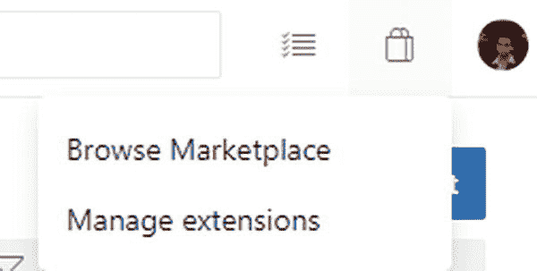

图 10-1

浏览和管理扩展的选项

如果您点击浏览市场，您将被重定向到 [`https://marketplace.visualstudio.com/azuredevops`](https://marketplace.visualstudio.com/azuredevops) ，在那里您可以搜索并安装扩展。单击“管理扩展”将打开“组织设置”页面的“扩展”选项卡。

现在，点击浏览市场，这样你就可以找到你的第一个扩展来安装到你的 Azure Boards。在市场中，搜索*估算*；您将在结果中看到一些相关的扩展。见图 [10-2](#Fig2) 。

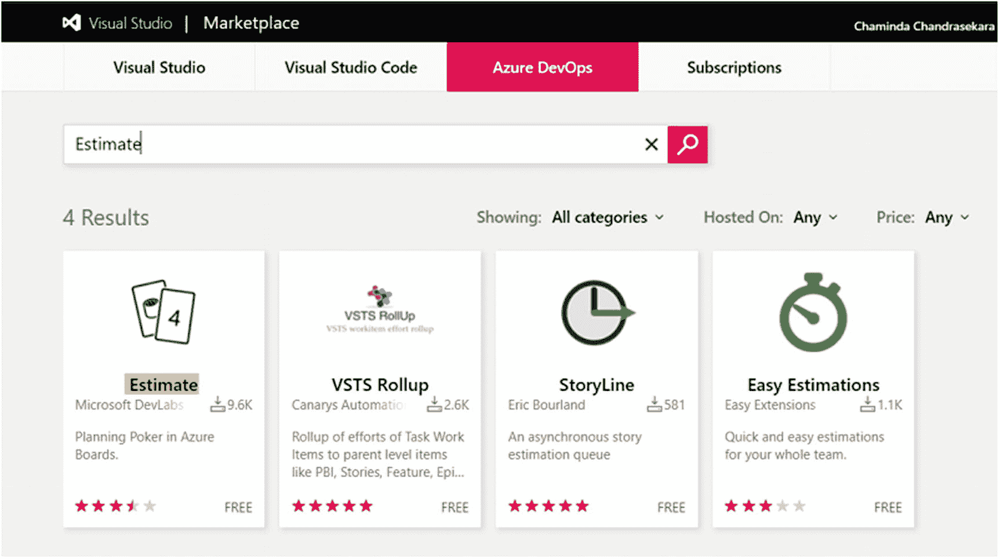

图 10-2

搜索扩展名

在本课中，让我们安装 Microsoft DevLabs 的评估扩展；我们将在第 10-4 课解释如何使用这个扩展。

在搜索结果中单击该扩展的卡片将会把您带到 marketplace 中该扩展的页面。如果是免费扩展，可以点击“免费获取”按钮。见图 [10-3](#Fig3) 。

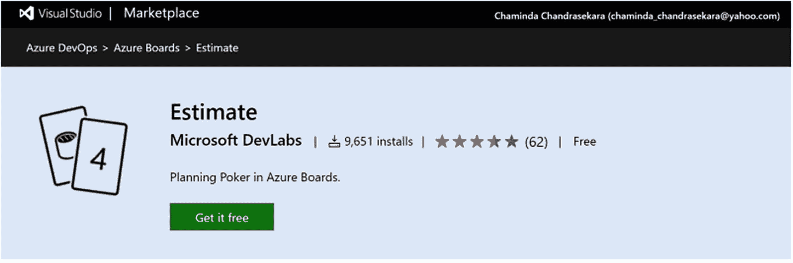

图 10-3

免费获得延期

将打开一个新窗口，您可以在其中选择要为其安装扩展的 Azure DevOps 组织。如果您在 Azure DevOps 组织中拥有集合管理员权限，则允许您自己安装扩展。见图 [10-4](#Fig4) 。对于 Azure DevOps Server(内部部署服务器)，可以下载扩展的`.vsix`文件，并在“管理扩展”页面上传。

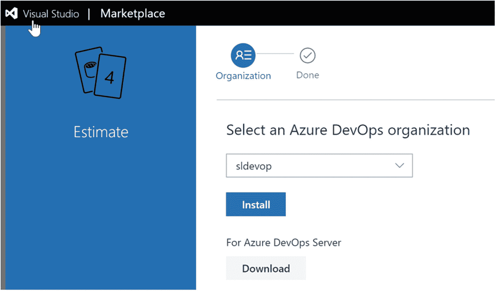

图 10-4

安装延伸部分

如果您没有足够的权限在 Azure DevOps 组织中安装扩展，您可以向您的组织管理员提出安装扩展的请求，并提供您需要扩展的原因。见图 [10-5](#Fig5) 。

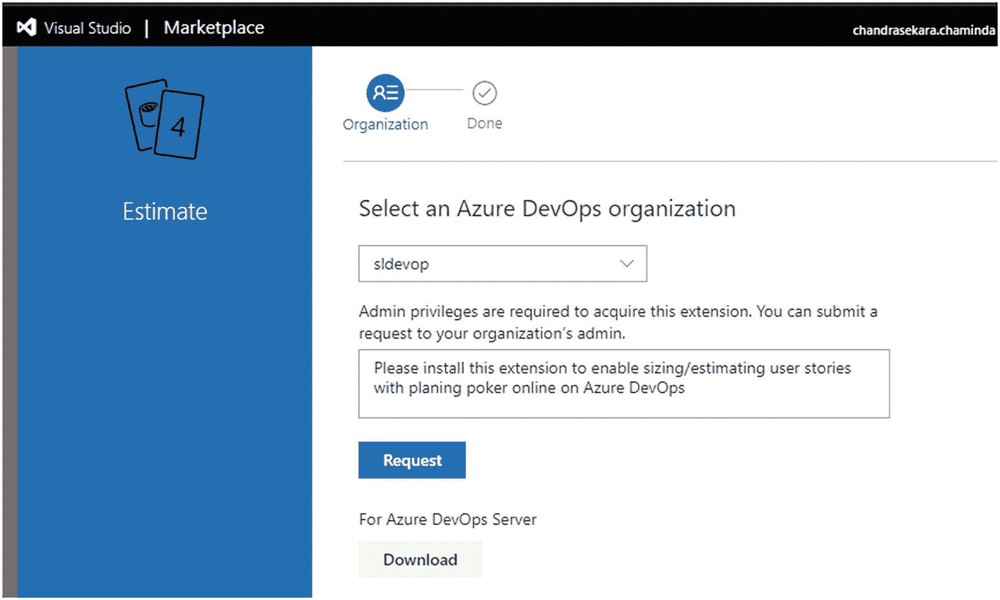

图 10-5

请求扩展安装

一旦提出请求，将通过电子邮件通知集合管理员。集合管理员可以在“组织设置”的“扩展”页面的“请求”选项卡上查看安装扩展的请求。管理员可以在“请求”选项卡上按待定、批准和拒绝的扩展进行筛选。见图 [10-6](#Fig6) 。

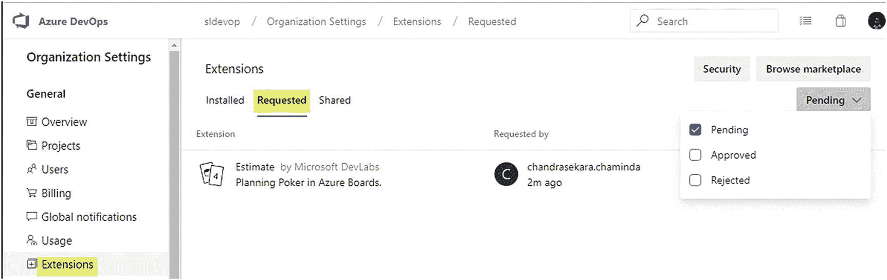

图 10-6

请求的扩展列表

单击待处理的延期请求，如果您拥有集合管理员权限，您可以批准或拒绝该请求。见图 [10-7](#Fig7) 。

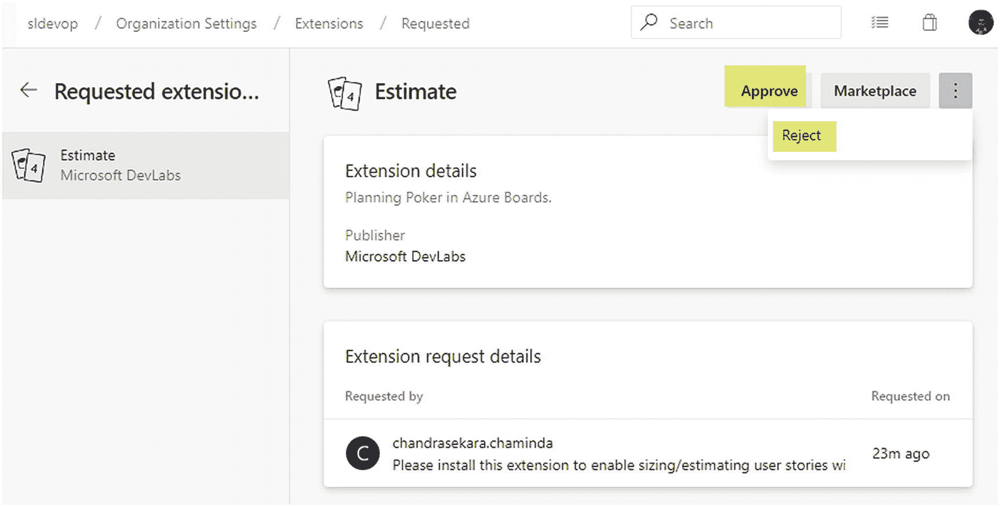

图 10-7

批准或拒绝延期

单击“批准”按钮将带您回到该扩展的 Visual Studio Marketplace 页面。您可以点击“免费获取”按钮(或获取付费扩展)并为 Azure DevOps 组织安装扩展。安装后，它将列在“组织设置”中“扩展”页面的“已安装”选项卡上。如果需要，您可以单击已安装的扩展并卸载或禁用它。参见图 [10-8](#Fig8) 。

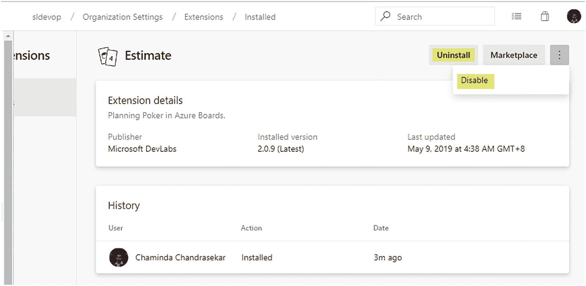

图 10-8

卸载或禁用扩展

此外，扩展发布者可能会私下在 Visual Studio Marketplace 中发布扩展，并将其与您的 Azure DevOps 组织共享。这些共享扩展出现在“扩展”页面的“共享”选项卡上。参见图 [10-9](#Fig9) 。您可以单击一个共享扩展将其打开，然后单击“安装”，这将带您到 Visual Studio Marketplace 中的扩展页面，在那里您可以为 Azure DevOps 组织安装扩展。

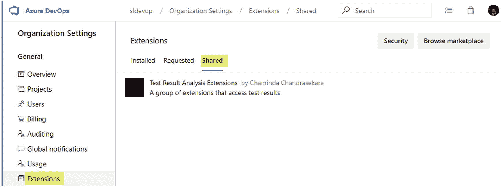

图 10-9

共享扩展

在已安装的扩展中，当新版本可用时，会出现“需要操作”通知。参见图 [10-10](#Fig10) 。

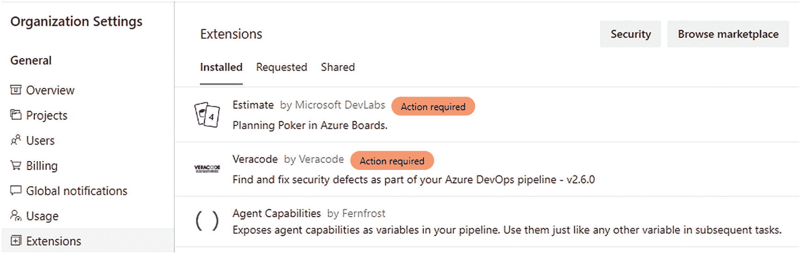

图 10-10

扩展所需的操作

单击扩展将向您显示一个可用的新版本，您可以单击授权按钮将扩展更新到最新版本。参见图 [10-11](#Fig11) 。

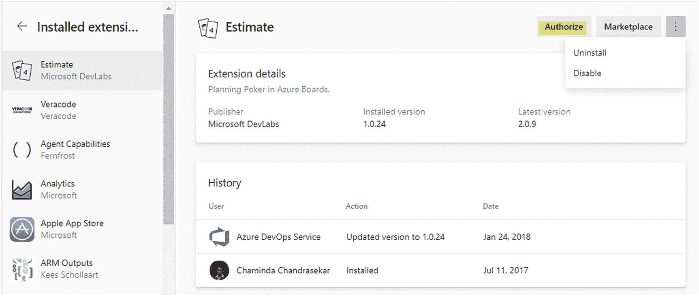

图 10-11

授权更新扩展

在本课中，您了解了如何为 Azure DevOps 组织安装扩展，以及如何禁用、更新和卸载现有扩展的选项。此外，我们讨论了如果您不是 Azure DevOps 组织的集合管理员，如何请求扩展，以及管理员如何批准或拒绝扩展安装请求。

## 第 10-2 课。使用工作项布局扩展

某些扩展可以帮助您自定义过程模板。我们在第 [5](05.html) 章中讨论了定制过程，您可以向定制添加更多的功能，尤其是使用 Visual Studio Marketplace 中的工作项布局扩展向工作项表单和字段添加功能。

要搜索工作项布局扩展，首先打开一个继承的流程模板的工作项布局(在第 [5](05.html) 章中解释)，然后单击“获取扩展”参见图 [10-12](#Fig12) 。

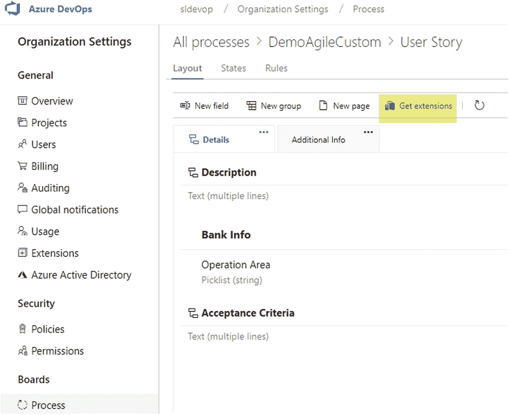

图 10-12

获取工作项布局扩展

您将被重定向到 Visual Studio Marketplace，使用特殊的搜索标准*控件组选项卡页面*，使用过滤器 Azure Boards 和 Cloud。参见图 [10-13](#Fig13) 。

图 10-13

搜索工作项布局扩展

Microsoft 和社区成员为工作项布局提供了几个扩展。让我们添加“颜色选项列表控件”扩展，看看它是如何工作的。要安装扩展，请单击扩展卡，然后在打开的扩展页面中单击“免费获取”。然后按照我们在第 10-1 课中讨论的那样安装扩展。一旦安装了扩展，您可以看到附加的菜单项“Add custom control”出现在 Process 页面的 Layout 选项卡上。参见图 [10-14](#Fig14) 。

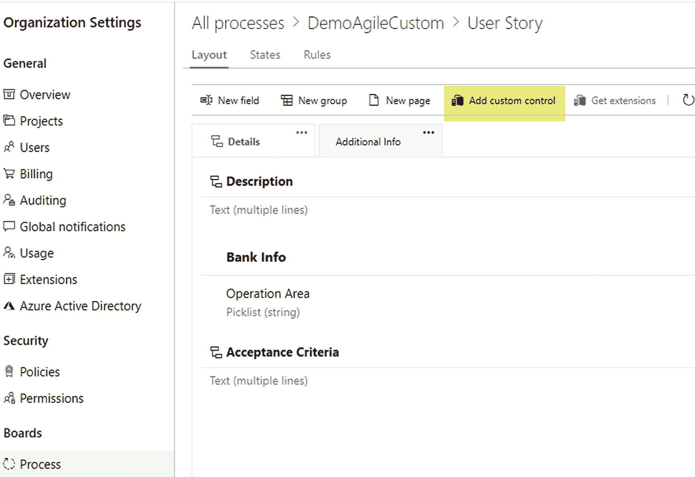

图 10-14

添加自定义控件

当您单击“添加自定义控件”时，将会打开一个对话框，您可以选择已安装的“颜色选项列表控件”扩展。参见图 [10-15](#Fig15) 。

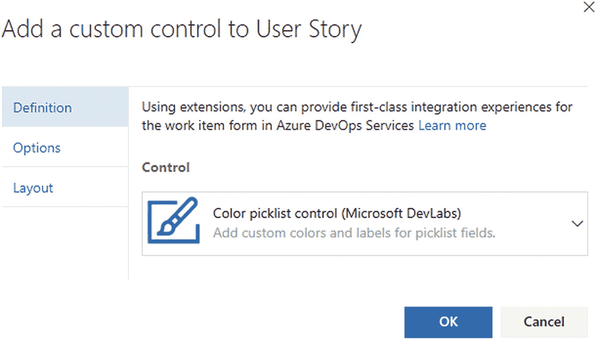

图 10-15

添加“颜色选项列表控件”扩展

在对话框的选项选项卡上，您可以选择要应用“颜色选项列表控件”扩展的字段。让我们选择优先级字段并指定标签和颜色。参见图 [10-16](#Fig16) 。

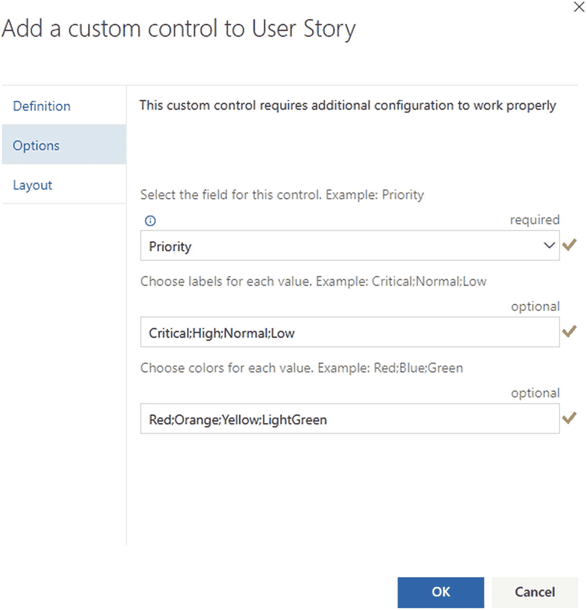

图 10-16

颜色选项列表字段的选项

在对话框的“布局”选项卡上，让我们将“优先级”字段设置为出现在详细信息页面的“规划”部分。参见图 [10-17](#Fig17) 。

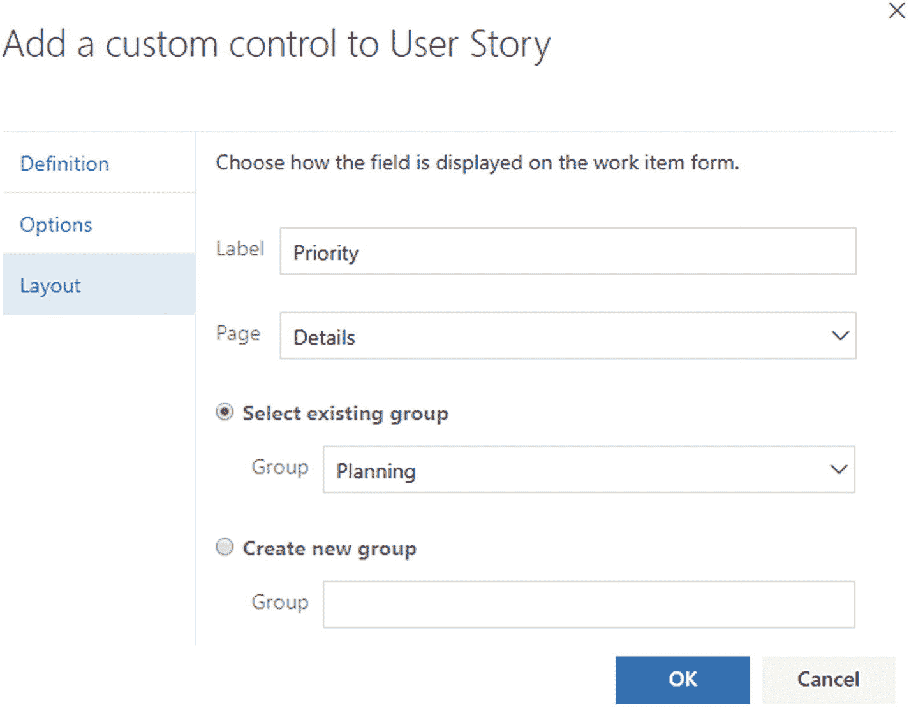

图 10-17

颜色选项列表的布局

因为您已经为 Priority 字段添加了自定义扩展控件，所以默认的可用 Priority 字段可以隐藏在工作项的布局中。参见图 [10-18](#Fig18) 。

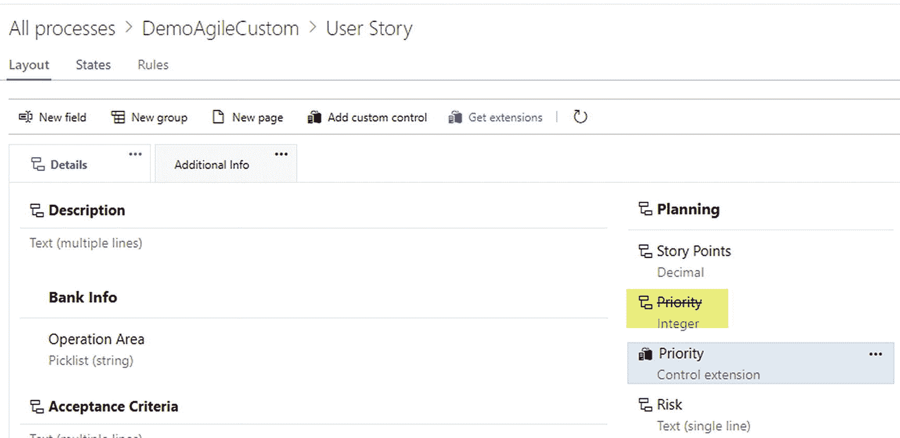

图 10-18

隐藏默认字段

通过这一更改，用户故事工作项的优先级字段将有一个彩色选项列表。默认的优先级字段被使用并被扩展，以通过使用该扩展来引入颜色。参见图 [10-19](#Fig19) 。

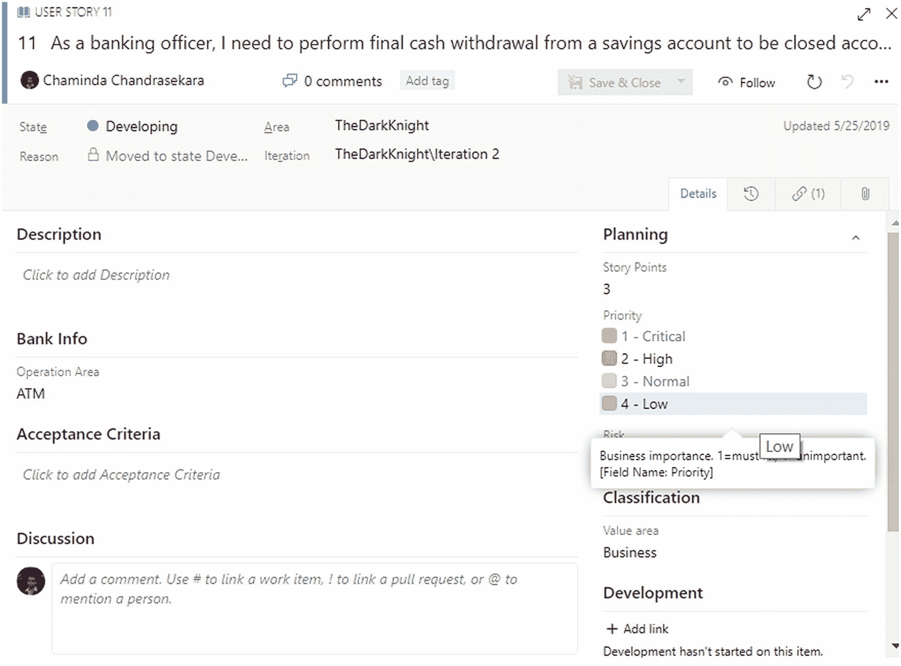

图 10-19

用户故事工作项中作为颜色选项列表的优先级字段

在本课中，我们讨论了如何添加自定义布局控件作为 Azure Boards 的扩展来增强工作项布局，并且您使用了其中一个扩展来了解它是如何工作的。您可以添加更多的扩展，并进一步增强 Azure Boards 中流程的定制体验。

## 第 10-3 课。使用一些其他有用的扩展

针对 Azure Boards 的 Visual Studio Marketplace 中有许多有用的扩展。在这一课中，你将简单看一下几个流行的扩展来理解它们给 Azure Boards 带来的价值。

### 交付计划

一旦您在 [`https://marketplace.visualstudio.com/items?itemName=ms.vss-plans`](https://marketplace.visualstudio.com/items%253FitemName%253Dms.vss-plans) 安装了交付计划插件(扩展)，您将会看到一个计划选项卡被添加到 Boards 部分。参见图 [10-20](#Fig20) 。

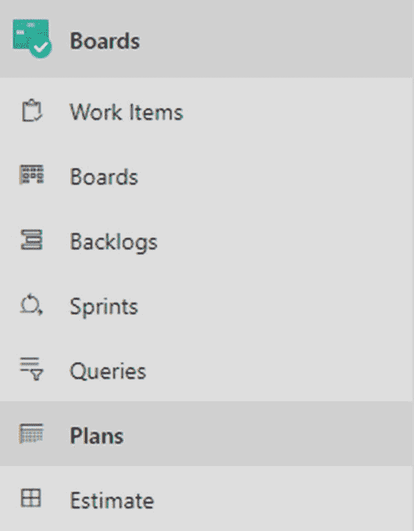

图 10-20

计划选项卡

那么，您可以在什么地方使用这个工具，它能为您提供什么级别的信息？有时，两个或更多的团队会在同一个项目上一起工作，可能是因为项目的复杂性，也可能是为了加速交付。您的项目经理/产品负责人希望看到整个画面。

您可以轻松创建交货计划。不需要任何查询，您可以使用 backlog 中的现有信息。为了让工具工作，您必须首先设置团队和您的发布节奏。此外，您必须将您的工作项目分配给团队。一旦所有这些都到位了，建立交付计划就相当容易了。只需点击“新建计划”按钮即可创建一个新计划。参见图 [10-21](#Fig21) 。

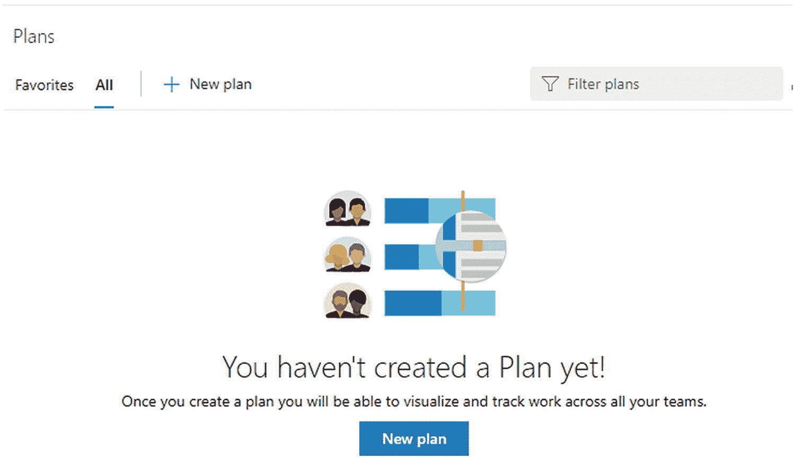

图 10-21

新计划

这个附加组件的好处是你可以有多个计划，这使它成为产品管理的理想工具。通常，对于产品管理，您需要有一个当前计划和一个未来计划，其中未来计划提供信息来回答最终用户的查询。所以，让我们回到多个团队在同一个项目中工作的场景。尝试创建计划时，可以指定要包含在计划中的团队项目、团队和积压工作级别。此外，您可以指定过滤标准。参见图 [10-22](#Fig22) 。

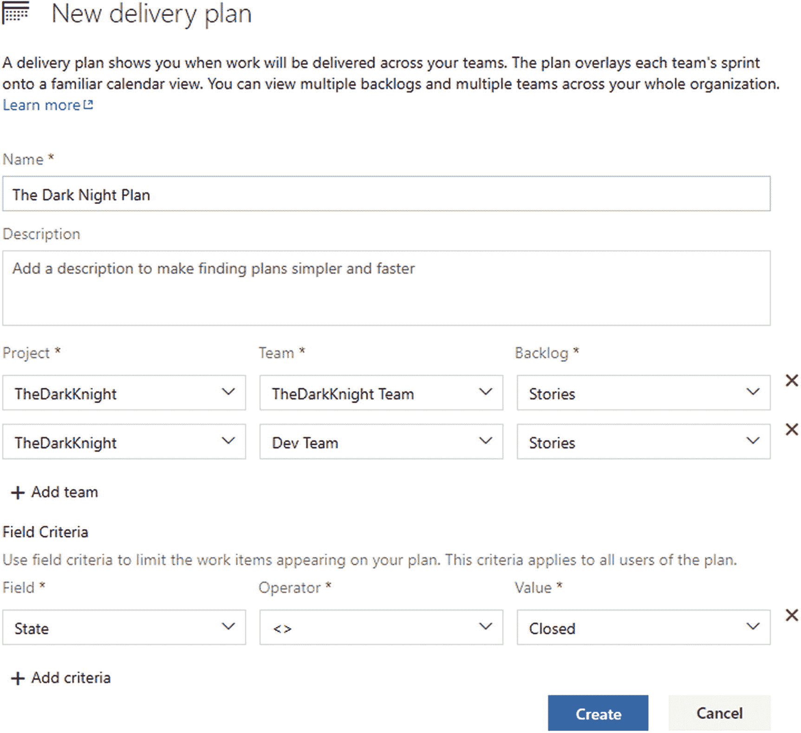

图 10-22

创建交货计划

一旦您创建了计划，您将会看到该计划包含了来自每个团队的 backlog 项(甚至是来自多个团队项目，如果您已经选择包含它们的话)。该计划的页面上还提供了一些其他功能。参见图 [10-23](#Fig23) 。

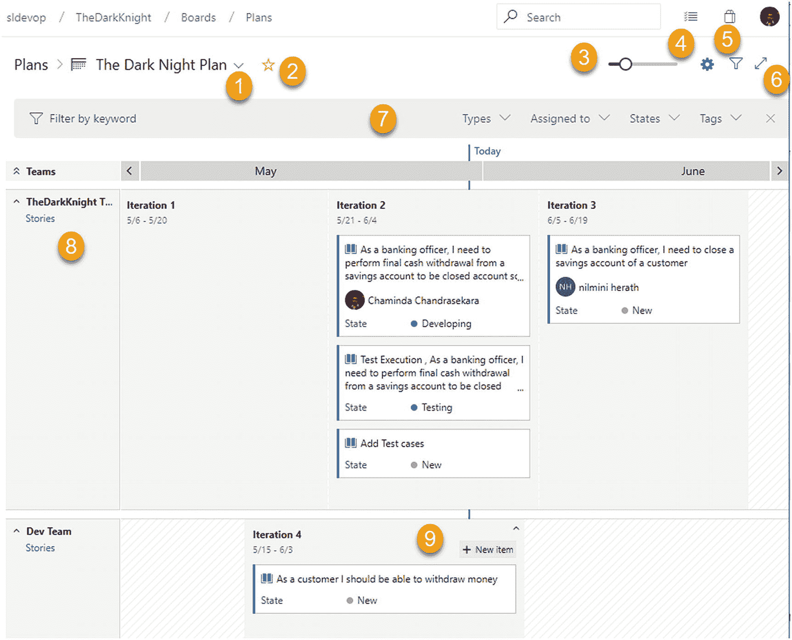

图 10-23

交付计划

1.  您可以选择一个交货计划。

2.  您可以将计划添加到收藏夹列表。

3.  您可以缩放平面视图。

4.  您可以打开计划的设置。

5.  您可以在计划中启用额外的过滤器，以使用不同的工作项集来可视化计划。

6.  你可以全屏显示计划。

7.  您可以筛选条件窗格。

8.  这列出了团队项目中的团队。

9.  您可以从计划中添加新的工作项。

当你建立你的计划时，它看起来类似于图 [10-24](#Fig24) 。

在交付计划设置中，除了修改团队项目、团队、积压工作和计划的筛选条件之外，您还可以添加标记来指定里程碑，例如发布截止日期。

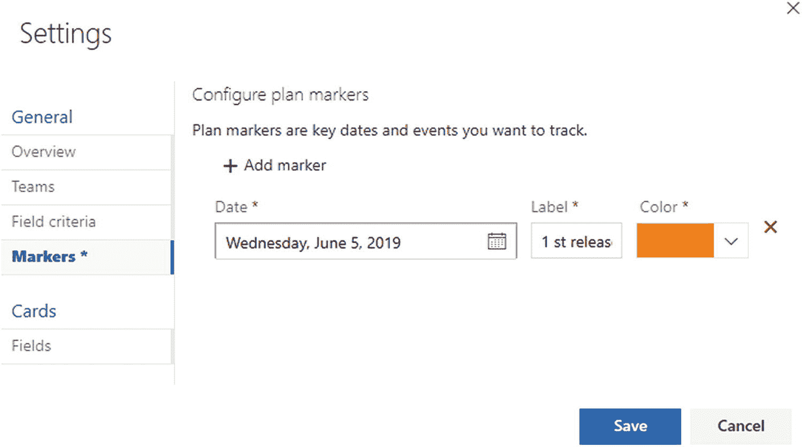

图 10-24

标记

此外，您可以使用设置来自定义卡片在交货计划中的显示方式。参见图 [10-25](#Fig25) 。

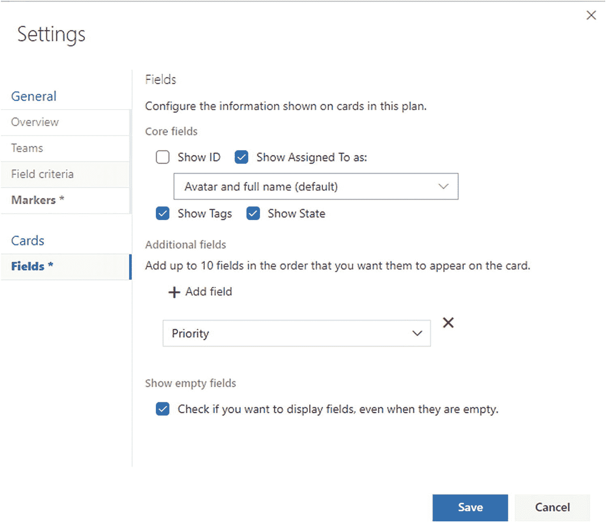

图 10-25

交货计划中的卡片字段

保存后，标记和卡片定制将应用于交付计划。参见图 [10-26](#Fig26) 。

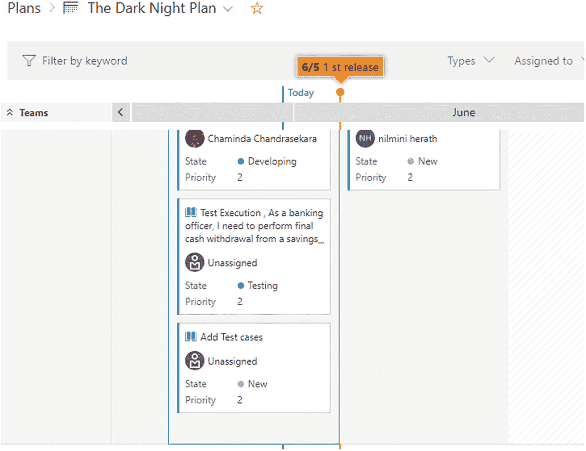

图 10-26

交货计划标记

您可以使用交付计划，通过从计划本身中拖放工作项来将它们移动到所需的迭代中。当与多个团队一起创建以获得项目的整体视图时，交付计划为项目经理提供有用和有价值的信息，使交付计划插件成为 Azure Boards 的宝贵扩展。

### 估计

评估工作是项目交付的重要部分。在敏捷开发中，授权给你的团队并确定他们的速度(他们在一次迭代中能交付多少)是特别重要的。对于一般敏捷/Scrum 实践中的待办事项，您熟悉使用相对大小进行估计。工作项字段 Story Points/Effort/Size 用于捕获待定项的相对大小。微软 DevLabs 开发的估算扩展是有效的，并与 backlog 项目很好地集成，以在 backlog 上玩规划扑克( [`https://marketplace.visualstudio.com/items?itemName=ms-devlabs.estimate`](https://marketplace.visualstudio.com/items%253FitemName%253Dms-devlabs.estimate) )。让我们看看如何使用这个扩展来估计工作项。

您可以通过选择 backlog 中的工作项并单击上下文菜单中的“评估工作项”来启动评估会话。参见图 [10-27](#Fig27) 。

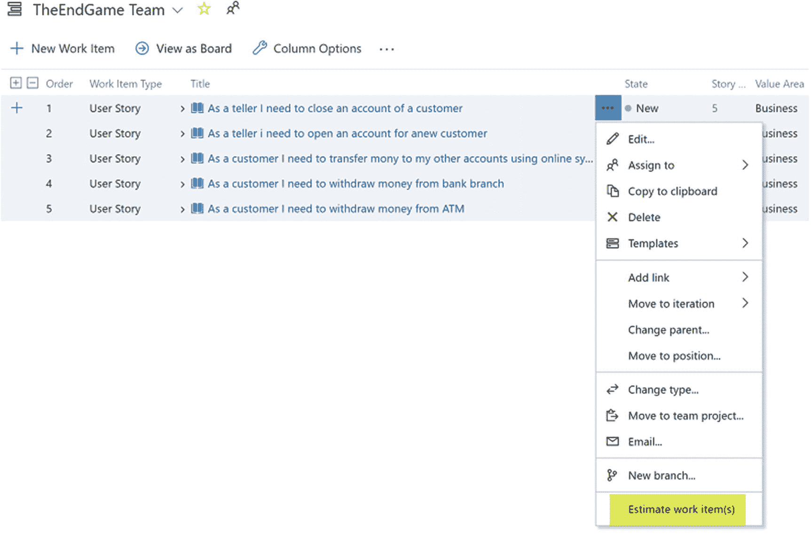

图 10-27

启动评估工作项会话

您可以为评估会话提供一个名称，并选择尺寸卡作为尺寸或默认的卡数。然后以在线或离线模式创建会话。参见图 [10-28](#Fig28) 。

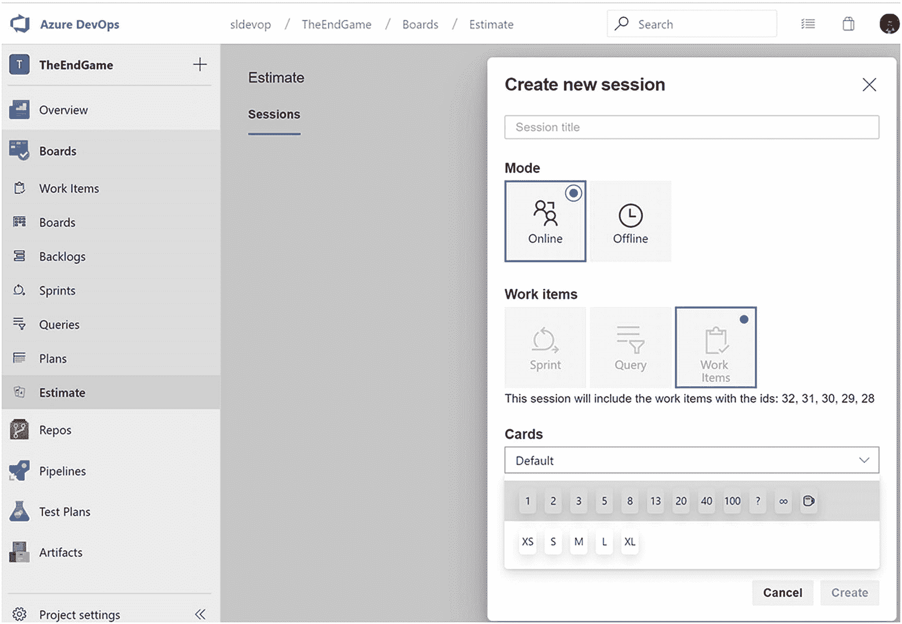

图 10-28

新评估会话

或者，您可以转到“估价”标签，创建一个新的会话。在新的会话中，您可以选择一个查询来获取要评估的工作项，或者使用一个迭代来选择工作项。参见图 [10-29](#Fig29) 。如果您想使用 work items 选项，您必须从 backlog 中选择工作项，并使用上下文菜单，如前所述。

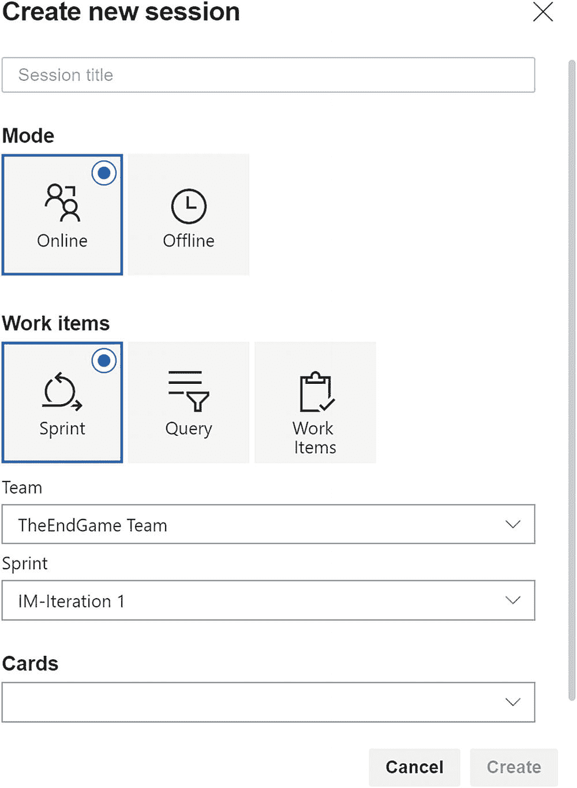

图 10-29

从评估页面启动新的评估会话

无论哪种方式，一旦会议开始，其他团队成员可以通过评估页面加入现有的评估会议。一旦团队加入，你就可以开始讨论故事，每个成员都可以投票。其他成员的投票值将被隐藏，直到每个人投票或会话发起者显示投票。参见图 [10-30](#Fig30) 。在离线模式下，个人可以在分析工作项后随意投票。

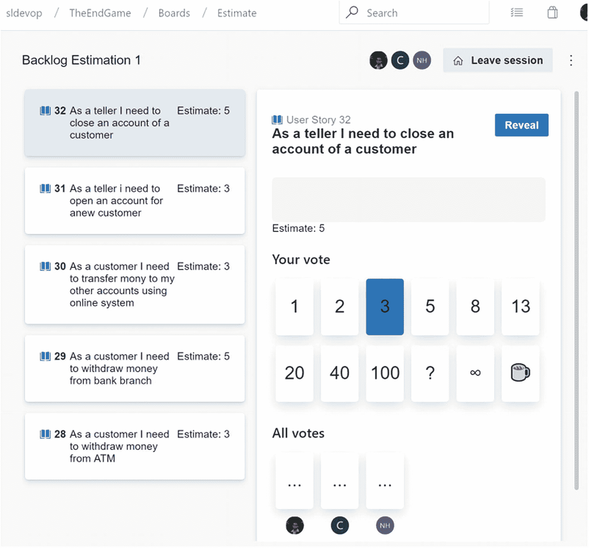

图 10-30

为一个故事投票

一旦投票显示出来，您就可以从投票的值中选择一张卡片，将其作为评估应用到工作项中，或者您提供一个自定义值，并将其作为评估保存到工作项中。参见图 [10-31](#Fig31) 。如果需要，您可以点击一个故事开始新的投票。

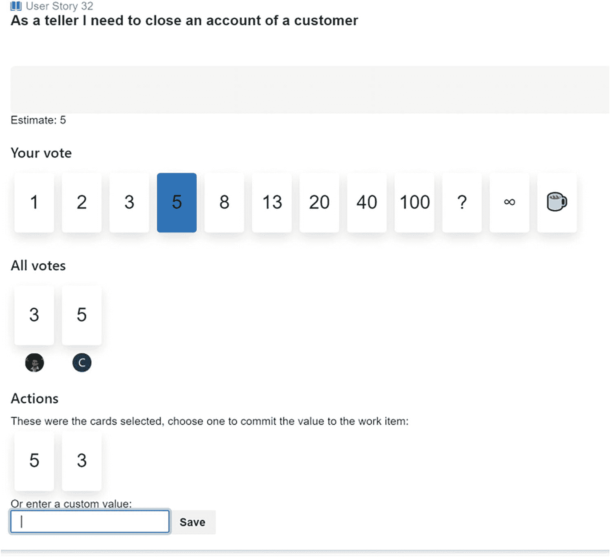

图 10-31

将评估保存到故事中

estimate 扩展非常有用，因为它可以帮助敏捷/Scrum 团队轻松地确定积压工作的大小，尤其是在离线模式支持下。

### 特色时间轴和史诗般的路线图

使用 [`https://marketplace.visualstudio.com/items?itemName=ms-devlabs.workitem-feature-timeline-extension`](https://marketplace.visualstudio.com/items%253FitemName%253Dms-devlabs.workitem-feature-timeline-extension) 中可用的扩展，可以在 sprint 日历中可视化项目组合积压级别的特性和史诗。此扩展对于跟踪功能的进度非常有用；它给你一个设施来规划你的功能，并给你一个史诗的路线图。将扩展安装到您的 Azure DevOps 组织，让我们看看它是如何工作的。

安装完扩展后，您可以在 Boards 部分单击 Backlogs 页面的 Feature Timeline 选项卡。参见图 [10-32](#Fig32) 。

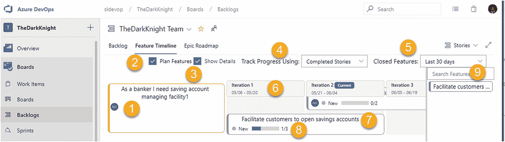

图 10-32

功能时间轴

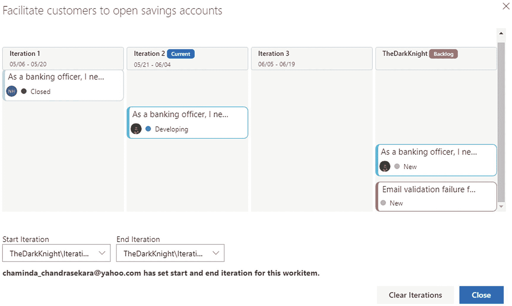

图 10-33

时间线中的功能计划

1.  这是一张史诗卡。单击标题将打开史诗工作项。

2.  您可以通过从侧窗格中拖动来添加可用于时间线的要素，侧窗格在选择“测量图要素”框时打开。

3.  你可以在特色卡片上展示故事细节，如#8 所示。

4.  您可以将故事的进度显示为已完成的故事计数或相对于总估计值的已完成估计值。您可以从该下拉列表中选择选项。

5.  您可以选择一个范围来显示时间线中的闭合要素。

6.  这是迭代日历。

7.  这是一张特色卡。您可以拖动卡片的右边缘，将特性扩展到下一个迭代。单击标题将打开功能工作项。

8.  这是故事情节的进展。单击进度将打开要素平移卡对话框。在这个对话框中，您可以将故事从一个 backlog 中拖放到一个迭代中，将故事拖放到不同的迭代中或者放回到 backlog 中，并为特性设置开始和结束迭代。见图 [10-33](#Fig33) 。单击故事或 bug 的标题将打开相关的工作项表单。

该扩展向 Azure Boards 添加了另一个名为 Epic Roadmap 的选项卡，它允许您跨多个团队工作的多个功能跟踪 Epic 的进度。参见图 [10-34](#Fig34) 。

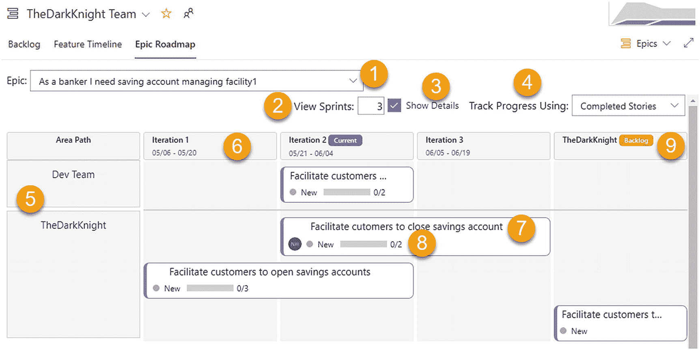

图 10-34

Epic 路线图选项卡

1.  你可以选择史诗来查看几个团队的路线图。

2.  您可以设置在路线图上显示多少次冲刺。

3.  功能卡详情将显示进度，如#8 所示。

4.  您可以使用故事计数或使用估计大小值来跟踪进度。

5.  您可以设置不同团队的区域路径。

6.  这是迭代日历。

7.  这是一张特色卡。它可以从右侧拖动以展开到下一个迭代。单击标题将打开该功能。

8.  这是显示故事计数或估计值进度的功能进度。点击进度将打开一个特性时间线计划对话框，允许你将故事拖放到特性的不同迭代中，并设置特性的开始和结束迭代，如图 [10-33](#Fig33) 所示。

特性时间线和 epic 路线图对于可视化和计划团队的进展非常有用，尤其是 epic 路线图，它将为您提供一个机会来跟踪多个团队正在进行的 epic。

在这一课中，我们讨论了一些真正有用的扩展，它们增强了 Azure Boards 的功能。针对 Azure Boards 的 Visual Studio Marketplace 中提供了更多的扩展，您可以试用它们，并根据您的团队需求向 Azure Boards 添加功能。

### 注意

除了使用可用的扩展，您还可以为 Azure DevOps 构建自己的扩展。你可以在 [`https://docs.microsoft.com/en-us/azure/devops/extend/get-started/node?view=azure-devops`](https://docs.microsoft.com/en-us/azure/devops/extend/get-started/node%253Fview%253Dazure-devops) 找到更多关于构建你自己的扩展的信息。

## 第 10-4 课。将 GitHub 链接到 Azure Boards

GitHub 是微软的子公司，免费提供云托管服务来处理源代码控制，拥有无限的公共和私有存储库。三个贡献者的限制适用于任何免费使用的私有库，但是如果付费的话，你可以添加更多的贡献者。您可以将 Azure Boards 集成到 GitHub 中，以便在 GitHub 中处理 repos 时使用 Azure Boards 跟踪您的项目工作。让我们看看这种集成是如何工作的。

***先决条件*** :你需要熟悉使用 GitHub，并且有一个 GitHub repo，里面有你想和 Azure Boards 集成的代码。

去 GitHub 市场搜索 *Azure* 。你应该在搜索结果中看到 Azure Boards。点击 Azure 板。见图 [10-35](#Fig35) 。

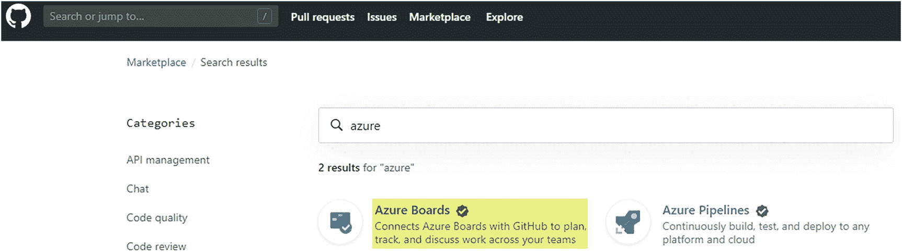

图 10-35

GitHub 市场中的 Azure 板

在打开的页面上，单击“设置计划”按钮。然后点击“免费安装”按钮。参见图 [10-36](#Fig36) 。

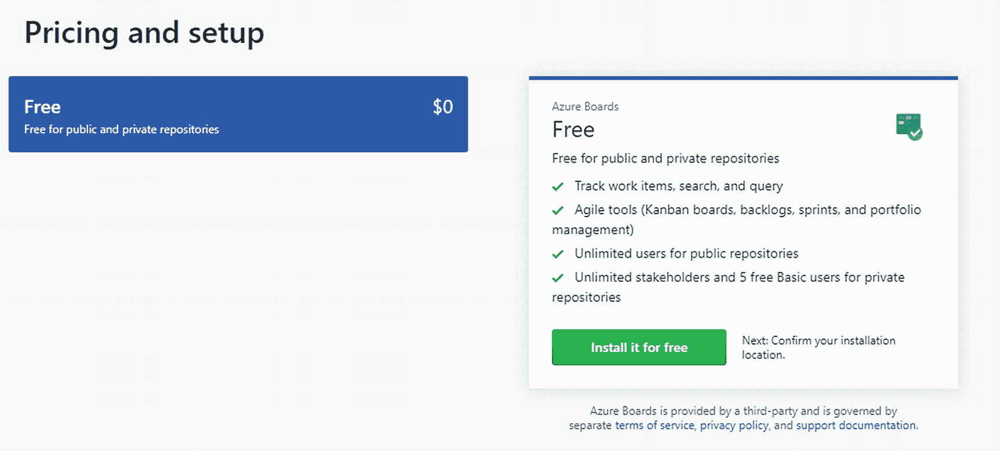

图 10-36

免费安装

然后单击出现在下一页的“完成订单并开始安装”按钮。见图 [10-37](#Fig37) 。

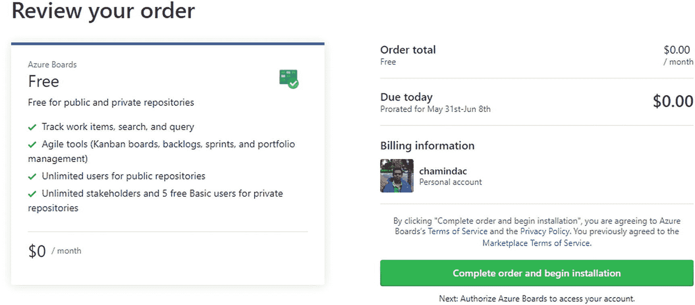

图 10-37

开始安装

在下一页上，选择您想要与 Azure Boards 集成的存储库，然后单击 Install & Authorize 按钮。参见图 [10-38](#Fig38) 。

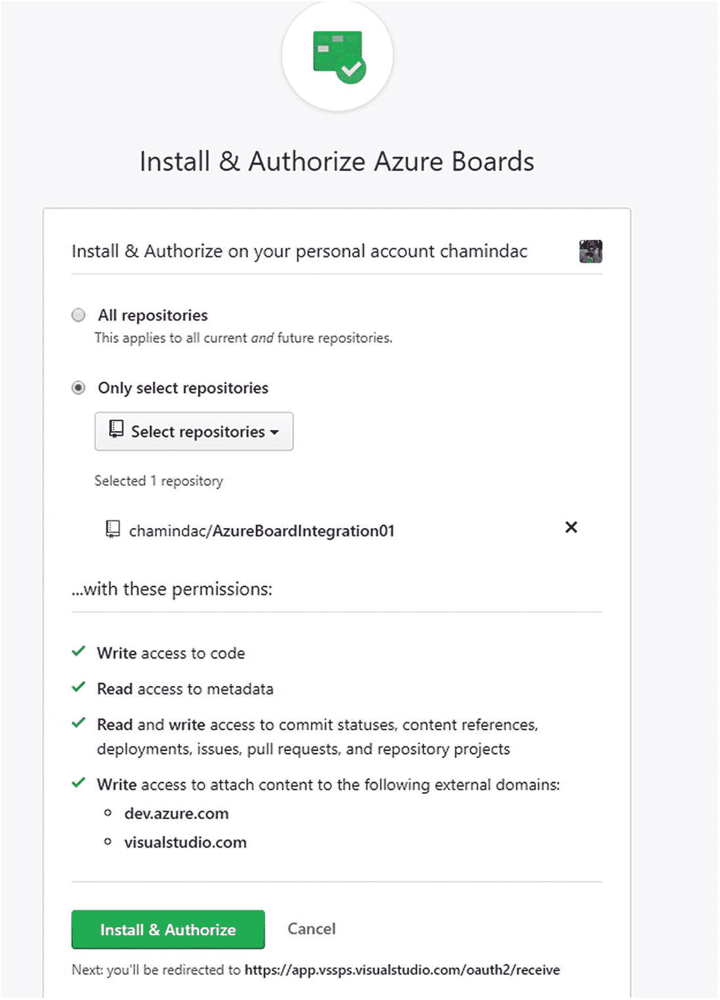

图 10-38

安装和授权

下一页将要求您确认您的 GitHub 密码以继续。提供密码并点击“确认密码”按钮。系统将提示您使用凭据登录 Azure DevOps。登录并继续。然后在下一个加载的页面中，允许您创建或选择新的 Azure DevOps 组织和团队项目。选择现有项目或提供名称以创建新项目后，点按“继续”。参见图 [10-39](#Fig39) 。

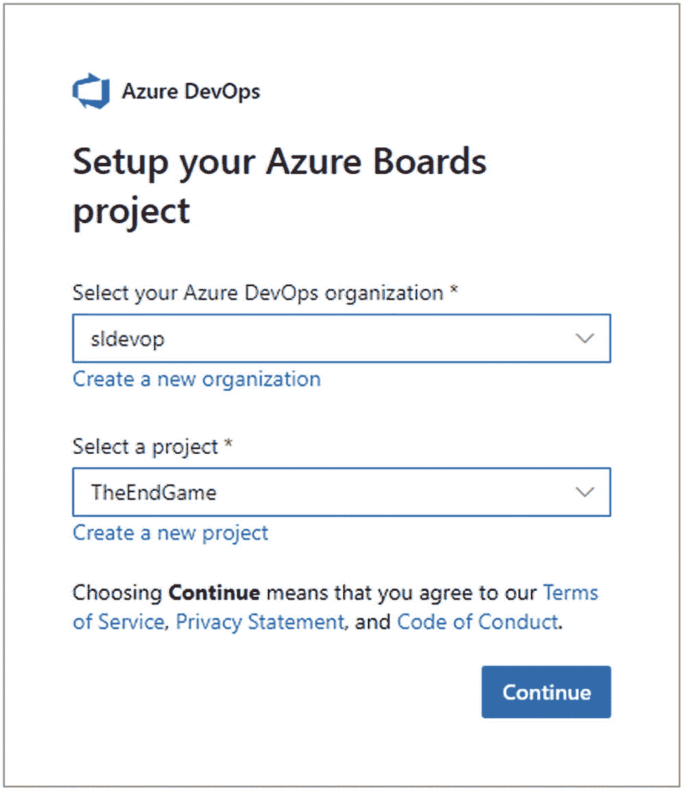

图 10-39

设置 Azure 板

然后你将被导航到 Azure Boards，并能够创建一个新的故事，创建一个新的 pull 请求，并在 GitHub 中添加一个 Azure Boards 徽章。让我们继续这些步骤。参见图 [10-40](#Fig40) 。

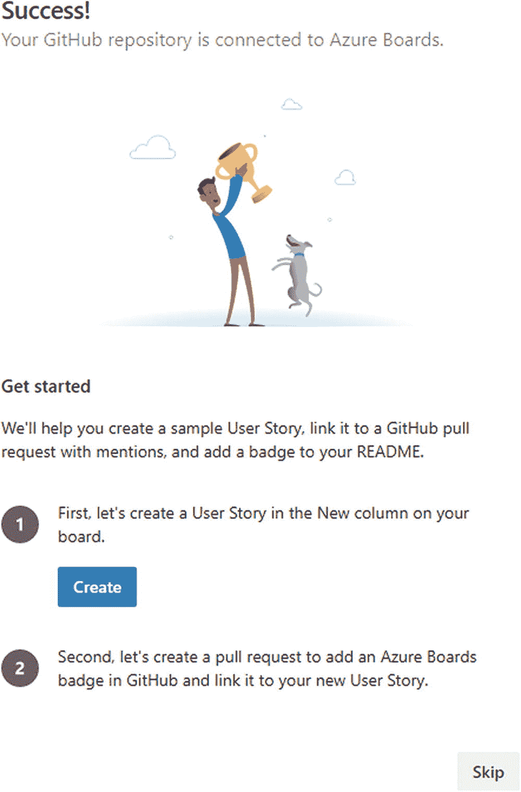

图 10-40

创建工作项和拉请求以添加 Boards 工卡

一旦这两个步骤完成，您就可以通过点击“查看工作项”来查看工作项见图 [10-41](#Fig41) 。

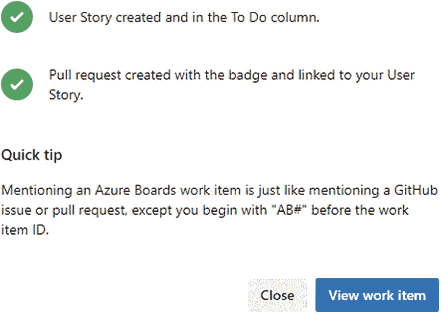

图 10-41

查看工作项

如图 [10-41](#Fig41) 所示，在 GitHub 中，你可以在工作项 ID 前使用 AB#前缀来引用 Azure Boards 中的任何工作项。这将把提交和拉请求与 Azure Boards 中的工作项联系起来。一旦您打开在上一步中创建的工作项，您可以看到一个提交和一个拉请求被链接到这个工作项。见图 [10-42](#Fig42) 。

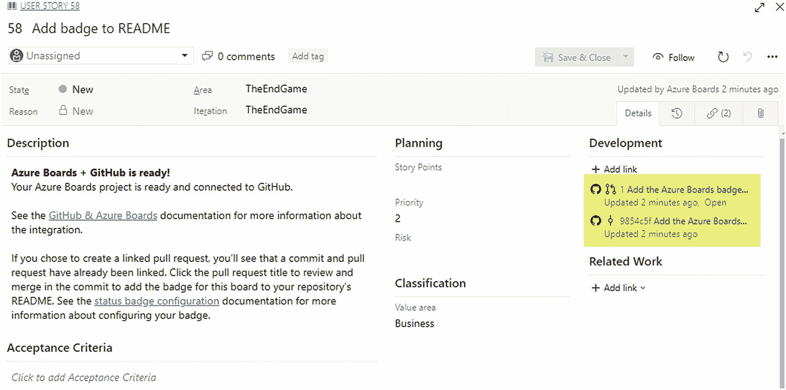

图 10-42

链接到 GitHub 的工作项

您可以单击任何链接导航到提交或提取请求。点击“拉取请求”链接。你可以看到它提到了修正 AB# *workitemID* 。通过合并请求来完成请求。见图 [10-43](#Fig43) 。

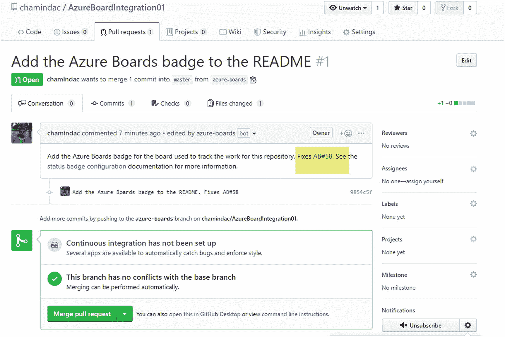

图 10-43

合并拉取请求

*fix* 、*fix*和*fix*这几个词可以用在 pull 请求或 commit 中，使合并 pull 请求自动关闭 Azure Boards 中的工作项。点击“合并拉取请求”并确认合并以完成拉取请求。当 Azure Boards 工作项被刷新时，你可以看到它被自动关闭。见图 [10-44](#Fig44) 。

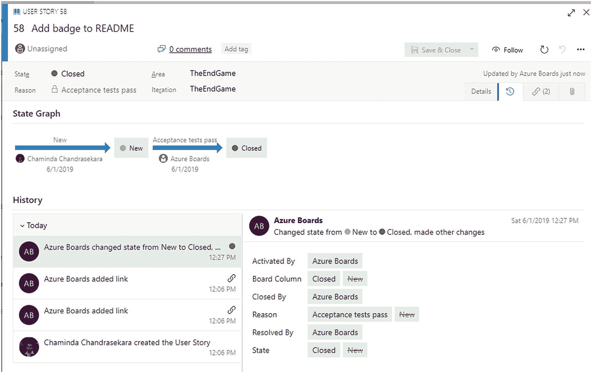

图 10-44

通过合并拉请求关闭的工作项

在 GitHub 中，你可以看到 readme 添加了一个 Azure Boards 状态徽章。参见图 [10-45](#Fig45) 。

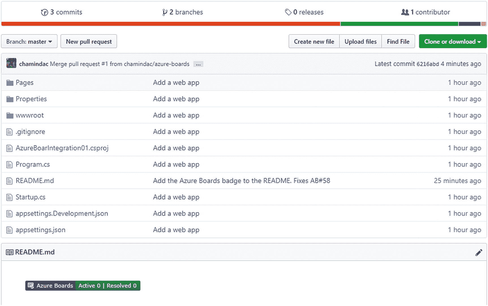

图 10-45

GitHub 中的板状态徽章

您也可以从 Azure Boards 的项目设置中创建从 Azure Boards 到 GitHub 的连接。由于您已经将 Azure Boards 与 GitHub repo 链接起来，您将在当前项目中看到一个现有的链接。参见图 [10-46](#Fig46) 。

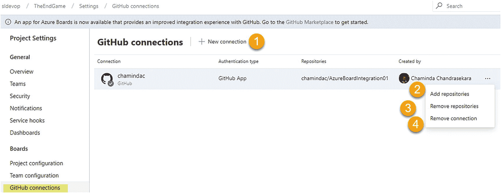

图 10-46

用 Azure Boards 链接 GitHub

1.  这允许您向 GitHub 添加新的连接。系统会提示您输入 GitHub 凭证，然后您可以创建连接并添加存储库。

2.  You can add more repositories. See Figure [10-47](#Fig47).

    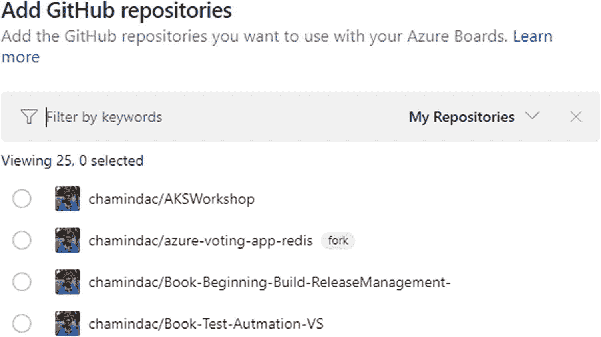

    图 10-47

    添加存储库

3.  您可以删除任何连接的存储库。

4.  你可以从 Azure Boards 中移除 GitHub 连接。

从 Azure Boards 连接到 GitHub 后，您可以打开任何工作项，并从工作项表单的开发组链接一个 GitHub 提交或一个 pull 请求。参见图 [10-48](#Fig48) 。

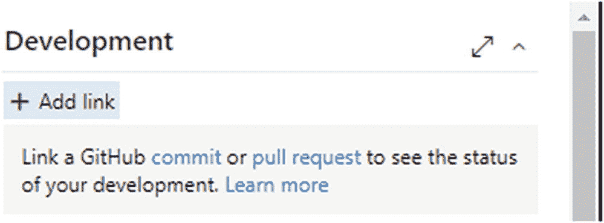

图 10-48

向工作项添加 GitHub 链接

您可以从下拉列表中添加或选择 GitHub commit 或 GitHub pull 请求，并使用 URL 将其与工作项链接起来。参见图 [10-49](#Fig49) 。

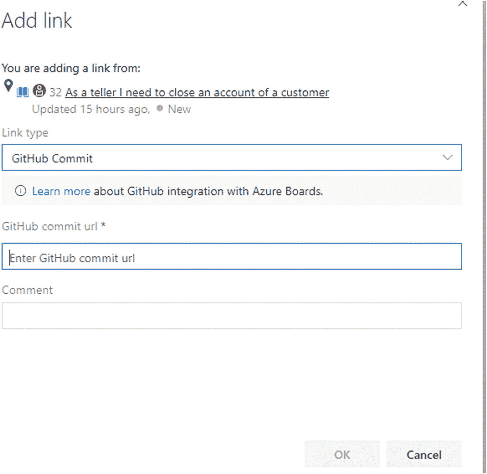

图 10-49

链接 GitHub 提交

在 GitHub 中，您可以通过使用 AB# *workitemID* 提及工作项，将提交或拉请求链接到工作项。在提交中使用 AB# *workitemID* 之前的 *fix* 、*fix*或*fix*将使工作项目在通过对主设备的 pull 请求合并时完成。

在本课中，我们讨论了如何将 GitHub 与 Azure Boards 集成。使用 Azure Boards 在 GitHub 中跟踪项目工作极大地改善了您使用 GitHub 的方式。

## 摘要

在本章中，我们讨论了如何使用扩展来增强 Azure Boards 的功能和特性。此外，我们详细探讨了几个有用的扩展。此外，我们讨论了如何将 Azure Boards 与 GitHub 集成，以提供丰富的 GitHub 和 Azure Boards 体验。

在本书中，我们详细讨论了 Azure Boards，从入门到为小型和大型团队配置它，再到定制它。我们讨论了 Azure Boards 的报告和可视化功能，让您的团队能够跟踪项目的进展。此外，我们还讨论了安全性和管理，以及 REST API 和命令行的使用。这本书全面介绍了 Azure Boards 的特性，以及如何使用它们有效地计划和跟踪团队的工作。

在本系列的下一本书中，我们将探索 Azure DevOps 的源代码控制功能。实际操作 Azure Repos 将通过实例详细介绍 Team Foundation 版本控制(TFVC)和 Azure Git Repos。