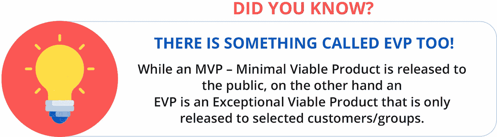
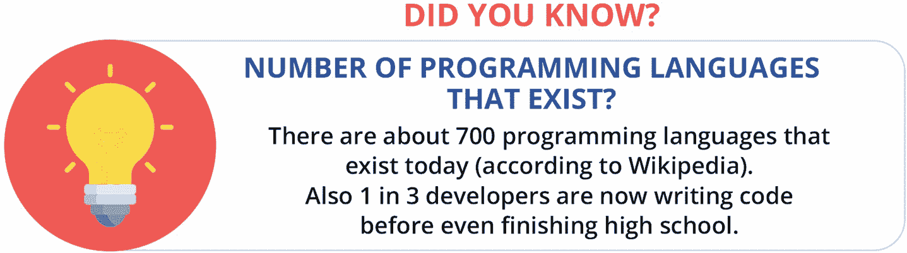
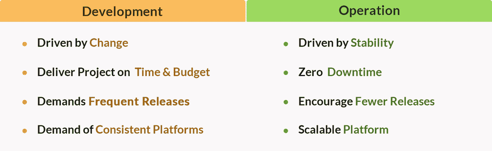
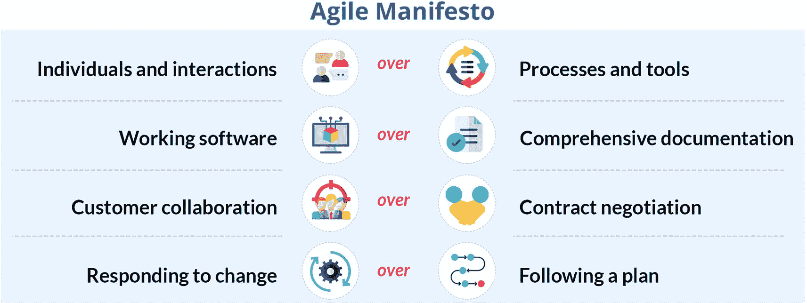

# 1.介绍

在这一章中，我们将介绍敏捷及其在弥合传统上各自为政的开发和运营团队之间的鸿沟方面的相关性。本章将涉及的主题如下:

*   敏捷历史

*   进化软件团队

*   弥合开发和运营之间的差距

*   用开发运维补充敏捷

*   基础设施运营的敏捷性

*   敏捷宣言

在 21 世纪，数字企业在科技、经济、城市化、生物技术和医药等诸多领域不断创新和发展。这些领域都是根据客户需求不断发展的，只有快速适应不断变化的需求，才能取得成功。这些行业的企业也了解数据的重要性，并利用技术来即时访问这些数据。快速访问数据有助于组织做出明智的决策，准备组织路线图，为新的和创新的计划制定预算，并为未来做好准备。所有这一切之所以成为可能，是因为技术平台的采用使公司能够访问可重用的组件，从故障中快速恢复，并保持全球联系。技术平台的管理和维护由信息技术部门负责，该部门是满足内部和外部客户各种信息技术需求的骨干力量。这些 IT 团队也与时俱进，变得更加敏捷，能够支持数字业务。团队愿意快速转型，以便为客户提供及时的服务。对他们来说，敏捷性不再是可选的；相反，它已经成为一种必然。如今，组织不仅利用 IT 团队来解决基本的运营任务，还利用他们来快速构建合规且安全的新系统。典型的瀑布应用程序开发项目需要几个月甚至几年；使用敏捷方法，每周或每月都会推出新的更新。有些组织每天甚至一天发布多次更新。随着技术和流程的发展，IT 团队正在采用新的敏捷工作方式。

关于敏捷的采用如何帮助组织快速扩展、快速失败、在迭代中交付，以及通过基于客户反馈优先化他们的需求而脱颖而出，有许多成功的故事。敏捷宣言及其 12 条原则是让组织成功的关键驱动力。事实上，许多组织已经确定并设计了最适合他们的人员、过程和技术生态系统的定制敏捷方法。从最初到现在，敏捷已经改变了向消费者交付产品和解决方案的方式。这个概念并不局限于 IT 界，也让许多非 IT 公司受益。

尽管敏捷的概念在 IT 行业已经存在了二十多年，但在未来的许多年里，它仍将是一个不断发展的主题。每一个计划采用敏捷或者已经采用敏捷的公司都有一个清晰的愿景，那就是在不牺牲安全性和质量的情况下“快速交付”。为了满足不断增长的市场需求和频繁变化的客户需求，通过实践敏捷原则的高效自治团队，快速部署的能力是可能的。多年来，已经设计了各种方法和工具来简化敏捷在多个行业的应用。引入了新的运营框架，其中包括优化的流程以及培育协作和问责文化的新角色和职责。队伍的位置现在不再是一个限制。拥有云计算和数字化路线图的公司正在迅速转向敏捷。像 Nexus，Spotify 等敏捷模式。正在被大规模采用。伴随着敏捷运动，像站点可靠性工程师这样的新角色正在出现。大多数组织对这些新角色的需求都在增长，期望减少对人工操作的依赖，并尽可能多地引入自动化。组织正在对他们的团队进行交叉技能和再技能训练，以便在敏捷开发和运营中工作。

一些组织从自下而上的方法开始，其中他们首先以“敏捷”为目标，这意味着他们从较小的应用程序团队或基础设施运营团队开始，并让他们采用敏捷的工作方式。然后他们通过“做敏捷”慢慢过渡到企业采用，这意味着在所有级别都有可见性和责任。利用各种敏捷工具和技术来确保组织转型成功，团队实践信任和透明的文化。关于敏捷及其在应用程序开发领域的应用，有大量的最佳实践、出版物和指南；然而，当谈到在运营领域采用敏捷时，它仍然被 ITSM 方法论所主导，比如 ITIL。这本书将分享在基础设施、云和应用程序操作领域采用敏捷的经验和最佳实践。它还着眼于在基础设施领域保持敏捷的需求和原因，重点关注敏捷性、改进的可见性和沟通、团队责任、持续学习、提高的生产率和客户体验。尽管敏捷已经在软件开发领域的组织中广泛使用，但是它在基础设施领域的采用和使用仍然是一个灰色地带。Scrum、看板、XP 等的实践。，都有很好的文档记录，关于这些的指南也有很多；然而，当谈到“什么”和“如何”在基础设施操作空间中采用这些方法时，存在缺失的环节。在现场可靠性工程(SRE)、开发运维以及基础设施即代码(IaC)方面有多种最佳实践、方法和工作模式，它们具有重叠的指南、流程和角色。这本书联系了所有这些概念，并为成功运行端到端开发和运营提供了丰富的指导。它还通过不同的场景比较框架和运行，允许团队为他们的组织选择最佳的方法和操作模型。

关于在软件开发领域采用敏捷，有很多现有的文献和指南。本出版物旨在将这些内容引入基础架构和云运营领域，并解决以下问题:

*   传统敏捷工作方式向现代敏捷工作方式的转变

*   需要在基础架构和云运营方面保持敏捷

*   敏捷世界中的新兴角色

*   理解不同的敏捷方法以及如何实现它们

*   比较各种敏捷方法和优势

*   采用敏捷的新技术平台

## 敏捷历史:起点

官方的说法是，敏捷开始于 20 世纪 90 年代早期，当时有一些组织实践极限编程(XP)、Scrum 方法和其他敏捷过程来加速他们的交付时间表。在 2000 年代早期，敏捷原则被正式化为一个宣言，并为更广泛的消费而出版。但它真正被接受是在 21 世纪初。敏捷总是被开发团队很好地接受和宣扬，并且成为交付软件事实上的标准。敏捷的四个核心指导原则包含了新的文化，这种文化对即时的变化做出反应，并关注团队协作。基础架构运营等其他部门仍继续使用传统方法、详细的文档记录、多个审批关口和冗长的手动流程。在产品开发领域存在两个世界；一个是敏捷驱动的，另一个是非敏捷的，遵循严格的流程和审批工作流，以及瀑布模型来进行规划和交付。

有趣的是，受益于敏捷概念的不仅仅是 it 部门；还有其他利用敏捷工具和实践的领域，比如国防、航空航天等。有一个有趣的故事，一位名叫保罗·杰克逊的皇家海军后勤军官相信敏捷原则，并在他在新船上的第一次任务中受益匪浅。在第一项任务中，他研究到使用敏捷原则可以将船只的维护计划从几周缩短到仅仅五天。在这五天里，他必须确保船上的工作人员在海上 90 天的旅程中有足够的物资。他开始每天进行站立训练，以优先考虑和满足需求，而不是执行详细的计划。每天的会议都有助于他和他的团队根据需要重新安排优先级。最后，这五天花费在迭代中的努力帮助 Paul 成功完成了他的工作。迭代方法帮助了 Paul 和他的团队，他们成为了敏捷的信徒。全球有成百上千的成功案例表明，具有敏捷思维的短迭代周期有助于团队轻松实现目标。敏捷成功背后的思想是迭代交付，这比传统的瀑布方法要好，传统的瀑布方法是以顺序的方式交付产品和服务，集成测试在过程的最后进行。这种采用不仅仅是新的流程和工作方式，还引入了新的角色定义。像 Scrum master、产品经理等角色。，这激励了专业人员进行升级，团队经历了结构性的变化以适应新的交付模式。很明显，团队应该在被命名为 *sprints* 的小迭代中交付产品，这些可交付产品被称为*最小可行产品* (MVP)。一个 MVP 可以被想象成一个原型，它有足够的特性可以被客户验证。客户对 MVP 的反馈为未来的产品开发和变更提供了增强。在每个 sprint 的末尾，焦点是从客户或利益相关者那里获得反馈，并迭代地实现这些反馈，以便开发的每个产品都满足客户的期望。这种方法帮助团队在交付周期中向前推进时愉快地接受变更。这对开发团队来说很容易，但是在基础设施领域应用这些原则仍然是一个挑战。见图 [1-1](#Fig1) 。

图 1-1

你知道吗？

## 进化的软件团队:转向新的工作方式

让我们后退一步，看看产品生命周期中的不同团队。传统的软件团队包括五个主要的团队:开发、测试/QA、安全、操作和治理/PMO。尽管每个团队都致力于快速交付，但他们实践自己的一套规则，这导致了延迟或问题。不同群体之间的沟通也是一个挑战。随着时间的推移，敏捷原则开始流行，并对软件交付产生积极的影响，开发团队很快采用了敏捷原则。但是其他团队由于其传统方法(如手动检查点、合规性和安全性检查的多个审批关口、宽松的 SLA 等)而落后。

基础设施运营继续他们僵化的工作方式。这并不是没有原因的，技术和过程的限制决定了基础设施团队的运作方式。僵化的一个关键原因是他们的责任，确保系统是可靠的、高度可用的、符合架构标准的、安全的和经过验证的，并由指定的批准机构批准。此外，内部基础架构必须在计划好的瀑布模型中运行，并且需要进行详细的规划，以确保每个组件都能与其他硬件组件协同工作。因为基础设施团队处理的是硬件而不是软件，所以需要有详细的规划、架构和文档。硬件组件的任何缺失都会使项目推迟数月，因为必须采购、运输和安装新组件。一些过程对于可靠和安全的软件开发也是必不可少的。为了确保可靠性和安全性，制定了包含多个步骤和多个利益相关者批准者的变更和发布管理流程。这些过程成为了日常事务和文化的一部分，过了一段时间，它们在人们的头脑中变得如此根深蒂固，以至于任何偏离这些过程的行为都成为了组织变革管理的问题。因此，一方面，开发团队定期交付，并希望立即部署新的变更。另一方面，基础设施运营有明确的时间表，对系统进行频繁更改对他们来说是一项艰巨的任务。基础设施运营团队是任何组织的骨干，因为它管理服务器和平台，与安全部门集成，并与其他团队合作，以确保系统符合规定的策略、程序和法律要求。

开发和基础设施运营团队之间的这种差距存在了很多年。但是，随着 IT 的不断变化和新平台的出现，组织明白他们需要改变工作方式。他们需要使基础设施运营团队更接近开发团队，并使自己能够敏捷和持续地交付，这是使软件能够更快地向客户推出的唯一方法。否则，它将会被编码、测试和集成，但是不会被部署在生产系统上，因此对客户来说是不可用的，从而破坏了敏捷和迭代交付的整个目的。所有这一切之所以成为可能，是因为技术向云的转移，在云上，基础设施可以像软件组件一样使用代码来创建和销毁。这种结构性的技术转变现在影响着团队的结构、技能和运作方式。参见图 [1-2](#Fig2) 。

图 1-2

你知道吗？

## 弥合开发和运营之间的差距

因此，在一端，开发团队总是期待在生产中推出新代码，而运营团队抵制变化。一个常见的场景是，开发团队需要一个环境，但是他们必须遵循一个繁琐的过程来请求这个新的基础设施，其中包括多个批准。这种传统的过程有很长的周转时间，导致开发团队感到沮丧。在许多组织中，运营团队在几周内而不是几天内就交付了此类请求。当开发团队想要更快时，操作会减慢他们的速度。参见图 [1-3](#Fig3) 。

图 1-3

开发和运营愿望清单

随着业务环境的变化和最新技术的可用性，组织已经接受了这样一个事实，即敏捷性和 DevOps 是当前的需要，他们需要快速确定弥合开发和运营团队之间裂痕的方法。因此，不仅仅要培养敏捷，还需要在组织的所有团队中接受 DevOps。大多数组织都在寻找快速部署和方法来增强其团队的能力，以便他们可以访问即时基础架构并获得其产品生命周期的端到端可见性。通过激励员工、提高技能、投资新技术以及简化流程以减少周转时间，所有这些都成为可能。

## DevOps:补充敏捷

DevOps 这个术语是由比利时 IT 顾问和敏捷实践者 Patrick Debois 在 2009 年创造的。DevOps 的核心原则是在开发和运营之间提供更好的集成，减少开发和运营团队之间的摩擦，并确保实现更快向客户交付产品的敏捷承诺。DevOps 涵盖了从设计到运营的整个产品生命周期，旨在实现持续部署。

DevOps 提倡以下主要原则:

*   *不再有孤岛*:在整个产品生命周期中以及开发和运营团队之间加强协作，将会提高生产力，减少运营问题。

*   *失败是正常的*:预防所有的失败是不可能的，但 DevOps 专注于从失败中学习，并将它们视为改进的机会。

*   *渐进变化*:在较小的 sprints 中对环境进行增量和渐进的变化，目的是增加吞吐量，将工作软件交到消费者手中，并通过转移到持续部署的模型来实现敏捷的目标。

*   *自动化*:自动化是 DevOps 的重点；它旨在实现持续的集成、测试、开发和部署，并消除手动步骤。

*   *度量*:应该测量变更，并分析变更的影响，以推动持续的服务改进。

## 基础设施运营的敏捷性:当务之急

虽然自动化是可以实现的唾手可得的果实，但最具挑战性的部分是将开发和运营团队聚集在一起，并培养信任和问责的环境。当开发团队实践敏捷时，基础设施运营团队需要跟上速度。他们需要得到指导，了解以敏捷方式进行运营的必要性，还需要在自动化平台上提升自己，以减轻工作负担。在过去的十年中，作为代码的基础设施的兴起获得了动力，并导致基础设施层更高水平的抽象和自动化。此外，越来越多的人采用云平台，这加速了弥合开发和基础设施运营团队之间差距的过程，并为自动化和基础设施即代码提供了正确的基础。开发团队正变得越来越强大，因为他们可以根据需要启动和停用开发和测试环境，另一方面，基础设施运营团队拥有工具和技术来实现更快的部署，这现在通过自动化管道成为可能。两端的团队都意识到了敏捷的好处和必要性。

事实上，这为许多组织树立了榜样，这些组织对环境中的突然变化做出了响应，并能够迅速发布新的功能和特性，从而提高了他们的技术、客户群和收入的采用率。

## 敏捷宣言:简单的指导原则

敏捷宣言是由一群软件和方法专家在 2001 年 2 月写的。这份宣言很容易理解。它陈述了图 [1-4](#Fig4) 中提到的敏捷价值观。强调图形 [1-4](#Fig4) 两边提到的值将存在；然而，应该把更多的注意力和精力放在左边提到的价值观上。就像个人和交互一样，过程和工具都将存在，但是与过程和工具相比，更应该关注与个人建立交互。

图 1-4

敏捷价值观

虽然敏捷服务于快速交付的目的，但是它需要通过自动化连接团队和过程的真正的 DevOps 文化来补充。本质是不仅要简化流程，还要关注人员和工具。当敏捷关注开发团队时，另一方面，DevOps 承诺将团队(开发、质量保证、运营)结合在一起。敏捷和 DevOps 都是实现耦合和内聚原则的优秀中介；因此，DevOps 和敏捷相辅相成。敏捷指的是交付软件的迭代方法，而 DevOps 指的是开发和运营之间的工作方式(端到端的工程实践)。注意到组织如何采用敏捷和开发运维，以及如何应对不断变化的生态系统，这是一个有趣的旅程。

这本书概括了所有以前的主题，并将它们与敏捷和 DevOps 世界中出现的新趋势相结合，特别是对于基础设施和云运营团队。一些新的方法、角色和期望已经发展起来，我们将通过真实的例子来介绍它们。这个想法是要提供一个 360 度的视角，让人们了解产品团队如何使用正确的敏捷方法和工具有效地运作。我们将看看用吉拉、詹金斯等工具实现敏捷方法的真实例子，比如看板和 Scrum。整本书引用了各种各样的例子，包括基础设施和云操作故事写作、故事评估技术，以及云技术和平台如何帮助团队快速构建和交付服务。快速失败的技术是必不可少的，这在本书中与帮助团队失败和恢复的各种方法产生了共鸣。我们将重点关注基础设施和云运营应该利用的最佳实践，以便在敏捷和开发运维领域取得成功。

## 摘要

敏捷是当今的一个重要需求。除了软件应用程序开发团队，甚至基础设施运营团队也在采用敏捷思维来快速交付。这些团队实践敏捷原则，专注于以小增量交付价值，持续监控反馈并培养有效的协作。引入新平台，如云、容器技术、自动化部署等。，正在加快更新工作方式的步伐，这种方式不再是一种选择，而是一种需要。新的角色也在不断演变，使团队更加负责任，联系更加紧密。这本书是所有团队的入门工具包，尤其是云和基础设施运营团队，他们正在寻找关于采用敏捷和 DevOps 的指导和建议。