# 2.传统基础设施运营

在本章中，我们将讨论在基础设施运营中使用 IT 服务管理流程的传统工作方式，而敏捷尚未应用于运营。如今，大多数组织都在这种模式下运行基础架构和云运营，而少数组织已经成功迁移到敏捷的运营方式。本章将涉及的主题如下:

*   IT 服务管理方法

*   传统基础设施团队的缺点

*   变革的需要

基础架构运营团队是专门管理环境(内部、云等)的 IT 团队。)并可能同时向内部和外部客户提供服务。内部客户可能是开发团队，他们请求围绕资源调配、升级和管理环境(如开发、测试、生产等)的服务。).外部客户是访问承载应用的生产系统的用户。环境可以被视为一组集成的组件，例如计算、存储、网络、备份、安全、监控、管理以及以合规和安全的方式运行该机器所需的一切。InfraOps 团队负责监控、管理、维护、升级、安装和配置组件，以及维护安全。该团队与治理和安全团队密切合作，定期验证正在使用的系统。任何必须引入到系统中的东西都要通过一套明确定义的流程进行良好的测试和批准。这些团队采用并运行符合 ITIL、IT4IT 等的最佳实践和流程。，跟踪和审计他们的行动。多年来，这些团队一直各自为政，遵循他们自己的过程和原则，并且他们与应用开发团队的协作有限。见图 [2-1](#Fig1) 。

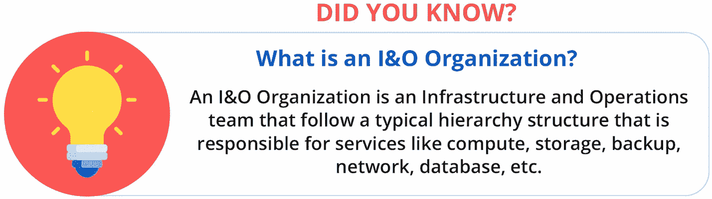

图 2-1

你知道吗？

## ITSM 方法

基础设施运营团队充当骨干服务。该团队为多个具有不同基础架构需求的内部团队提供服务，但通常按照严格的流程运作。有趣的是，该团队长期以来一直很成功，这要感谢像 ITIL(以前是信息技术基础设施库的缩写)这样的框架帮助团队遵循定义的过程。这些团队拥有定义完善的支持课程，包括操作系统和内核支持、物理服务器和虚拟机维护、服务器配置、服务器修补、备份、存储、数据库、用户身份管理、活动目录、高可用性/灾难恢复(HA/DR)、服务器监控等。重点是确保系统的安全性和合规性，确保流程的每个步骤都得到定义，并通过服务级别目标和服务级别协议记录和衡量每个操作。在生产中部署新变更的流程是经过精心规划的，并且是在各个技术业务线多次批准后执行的。这些部署计划在非工作时间或周末进行。还有备份和恢复以及在更改失败的情况下恢复到原始配置的过程和步骤。在大型复杂的数据中心变更期间，需要来自基础架构、虚拟化、存储、网络、灾难恢复、业务连续性计划(BCP)、变更经理和应用团队的多个团队。供应新基础设施的请求也遵循严格的流程。

开发和 QA 团队一直在与这种传统方法作斗争，因为他们的快速交付目标由于基础设施领域缺乏敏捷性而受到了损害。开发人员和测试人员必须等待环境被供应，这延迟了他们的里程碑。参见图 [2-2](#Fig2) 。

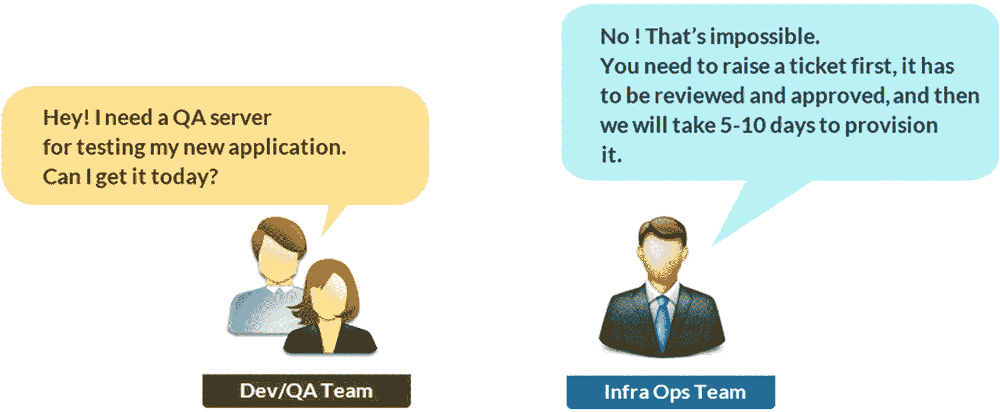

图 2-2

传统运营的现实检验

大多数 InfraOps 团队全天候运营，应用开发团队通过信息技术服务管理(ITSM)工具(如 ServiceNow、Remedy、吉拉等)联系他们。InfraOps 团队通过严格的 SLA 提供跨不同领域的支持。现在让我们深入了解一下 ITIL，它一直是 IT 服务管理流程的支柱。

ITIL 包括实现 IT 服务管理的详细实践和流程。它可以被视为一个目录，列出了完成服务所需的流程、任务和清单。换句话说，它是管理和改进 it 服务和支持所需的最佳实践的集合。服务生命周期侧重于管理 IT 服务生命周期所必需的各个部门、团队和流程之间的协调。IT 服务由专注于客户业务流程和需求的 IT 服务提供商提供给客户。ITIL 在 [`https://www.axelos.com/best-practice-solutions/itil`](https://www.axelos.com/best-practice-solutions/itil) 展示了 ITIL 4.0 通用流程。

ITSM 有四个关键支柱，称为*四个 p*，如图 [2-3](#Fig3) 所示。

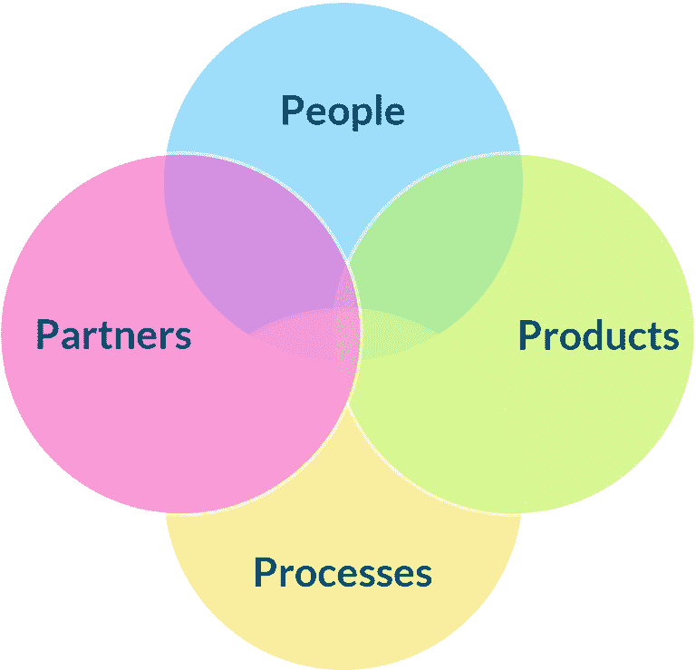

图 2-3

ITSM 的四个 p

*   *过程*:过程应该是可测量的，并有具体的结果，这些结果是可量化的，以客户为中心，并为他们提供满足他们期望的价值。

*   *人员*:人员是在组织内创建服务或消费服务的所有必需的涉众。

*   *产品*:产品是指 IT 服务人员用来实现 ITIL 流程的工具。所需的工具被集成并用于执行组织过程。

*   *合作伙伴*:组织有许多在 IT 服务方面与他们一起工作的合作伙伴。这需要将支持协议和要求传达给合作伙伴。

ITSM 有各种各样的角色，列举如下:

*   *流程负责人*:流程负责人拥有流程，参与流程设计，设计策略，还定义流程关键绩效指标(KPI)。

*   *流程经理*:流程经理管理资源，将资源分配给不同的角色，跟踪流程绩效，并对流程进行改进。

*   *流程从业者*:流程从业者在一个流程的多个任务上工作，并确保准确性。此人还在各自的工具中更新任务的状态，以便顺利交接。

*   *服务负责人*:服务负责人负责服务交付，是主要的客户联系人。服务所有者还扮演业务分析师或服务需求的角色，并确定服务的改进。

该框架包括五个基本阶段。

### 服务策略

服务策略关注服务生命周期，并描述如何设计、开发和实现服务管理(参见图 [2-4](#Fig4) )。它定义了目标客户和服务将提供的价值。它帮助服务提供商实现业务目标。这一阶段涉及如下关键流程:

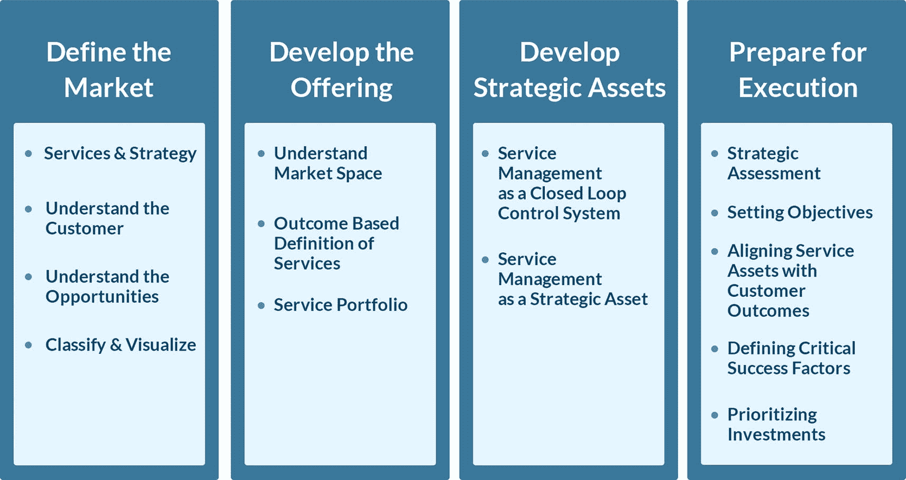

图 2-4

服务策略

*   *需求管理*:这与了解客户需求有关。有必要通过提供符合约定保修条款的服务来满足客户的期望。

*   *财务管理*:这有助于服务的预算和成本，并执行财务审查。

*   *服务组合管理*:服务组合是由服务提供者管理的一组服务。这些服务是服务目录的一部分。它拥有活跃的服务，可供消费者使用。

*   *商业关系管理*:这都是关于客户互动和沟通的。客户与项目的业务关系经理互动。他们管理与利益相关者的业务关系。

### 服务设计

服务设计包括基于为客户提供价值的业务需求和目标来设计服务(参见图 [2-5](#Fig5) )。它专注于交付符合业务需求的有效 It 解决方案。它描述了设计服务和流程的“如何”部分。它包括如下关键流程:

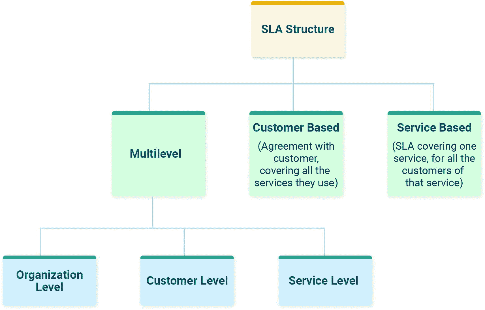

图 2-5

服务水平管理

*   *服务水平管理*:这确保为所有 IT 服务制定具体且可衡量的目标。它与客户满意度直接相关，因为它关系到问题的响应速度，以及问题的解决和质量。它包括服务级别要求、服务级别协议、操作级别协议、基础合同和服务改进计划。

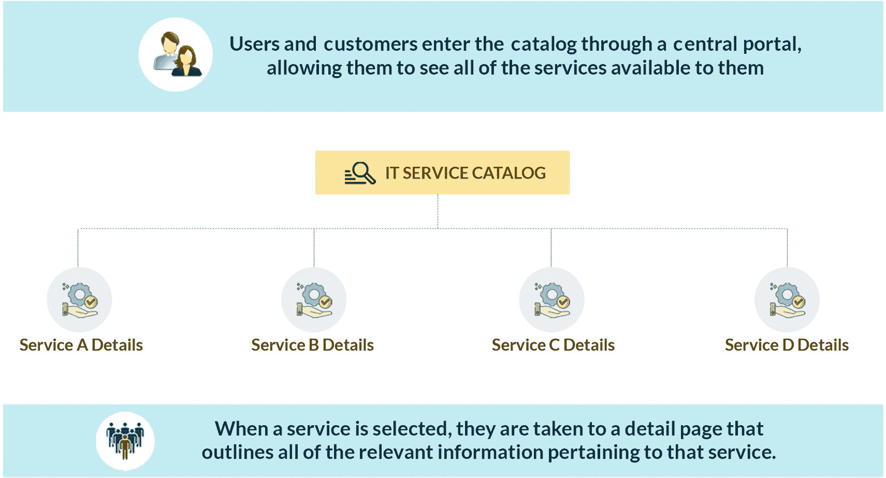

图 2-6

服务目录管理

*   *供应商管理*:该阶段管理供应商及其向客户提供的服务。

*   *服务目录管理*:这包含所有运营和计划的服务及其细节，包括状态、接口和依赖关系。服务目录中的详细信息应定期更新，包括自动实时更新。图 [2-6](#Fig6) 显示了一个样本目录及其创建。

*   *可用性管理*:在当今时代，it 基础设施和应用始终可用非常重要。这个阶段设计、实现、测量、管理和改进 IT 服务和组件的可用性。可用性以百分比表示，如下所示:

可用性=(约定服务时间-停机时间)* 100

-

约定服务时间

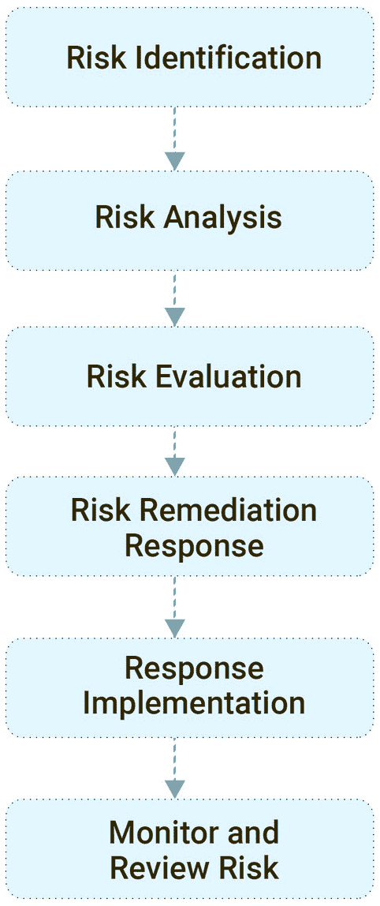

图 2-7

风险框架

*   *容量管理*:这里的目标是以经济高效的方式提供所需的基础设施，并确保其有效利用。组织正在从内部基础架构过渡到云，以获得更好的基础架构利用率。当组织从内部基础架构转向按需基础架构时，容量管理会发生巨大变化。FinOps 在云容量管理中发挥着关键作用，需要整合为一项功能来管理云资源及其消费，以及云计算环境中可用的各种消费模式的财务管理。

*   *服务* *连续性管理*:这确保在出现故障或灾难的情况下可以恢复所需的服务。它包括执行风险评估和风险管理以主动避免风险或灾难发生的任务(见图 [2-7](#Fig7) )。它旨在通过制定恢复计划来降低风险，以便在业务活动中断时恢复业务活动。

*   *信息安全管理*:这使 IT 安全与业务合规性保持一致。它在所有服务和服务管理活动的所有方面实现安全性。它还涉及风险分析和风险管理。

*   设计协调:这是所有活动和过程之间的单点协调。它还确保服务设计阶段的目标得以实现，并移交给服务转换阶段。

### 服务转型

服务转换解释了如何管理新的或修改的服务的转换(见图 [2-8](#Fig8) )。它包括如下关键流程

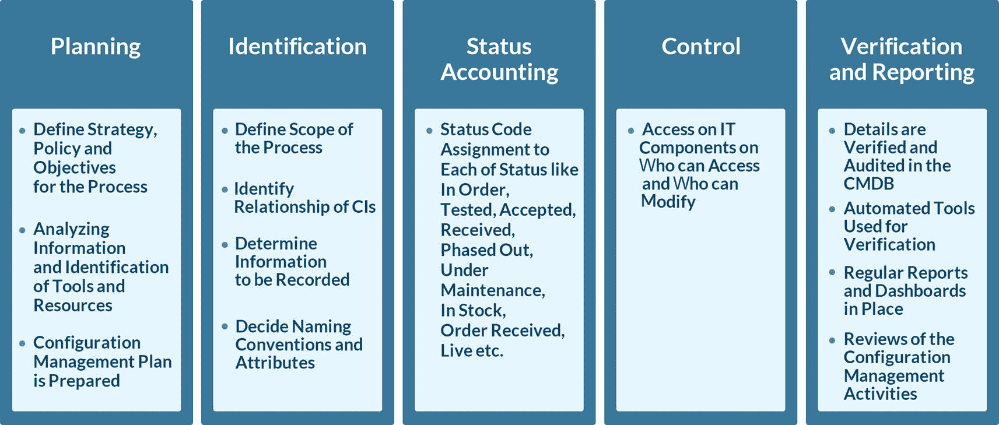

图 2-8

服务转型

*   *过渡规划和支持*:这涉及所有相关利益方(如供应商、服务团队等)的服务规划和协调。它还确保来自服务策略的需求从设计阶段到服务运营平稳地过渡到开发的服务。

*   *服务资产和配置管理*:必须管理服务和基础设施的所有组件。其配置详情，如当前和计划状态、历史信息等。，需要维护。配置管理数据库(CMDB)广泛用于维护基础设施的配置细节。它还通过为资产提供配置信息来支持服务管理过程。

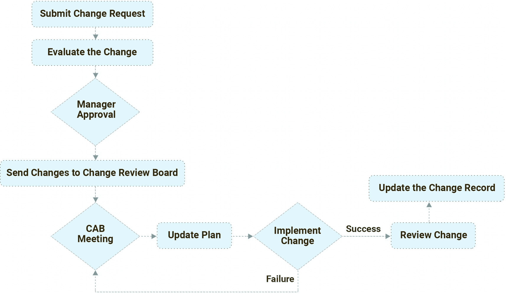

图 2-9

变更管理流程

*   *变更管理*:变更管理流程的目标是确保变更被记录或输入到相应的 ALM(应用生命周期管理)工具中，然后进行评估；在变更审核委员会或会议中讨论；然后按计划的日期和时间进行优先级排序、计划和实现(见图 [2-9](#Fig9) )。变更管理需要使用标准化的方法和程序来有效和高效地处理变更。对服务和配置项的所有更改都会在配置管理系统中更新。

*   *发布和部署管理*:目标是在目标环境中构建、安装、测试和部署应用或服务。这个过程确保新的或更新的服务或配置能够满足正确的需求。有各种各样的自动化工具可以用来自动化发布和部署管理活动。

*   *知识管理*:目标是利用和收获知识以便重用，而不是重新发明和重新发现知识。当创建、维护和定期更新服务知识管理系统时，这是有益的。

### 服务操作

服务运营是指协调和执行服务平稳运行所需的活动(见图 [2-10](#Fig10) )。它确保按照商定的服务级别交付所需的服务。它包括如下关键流程:

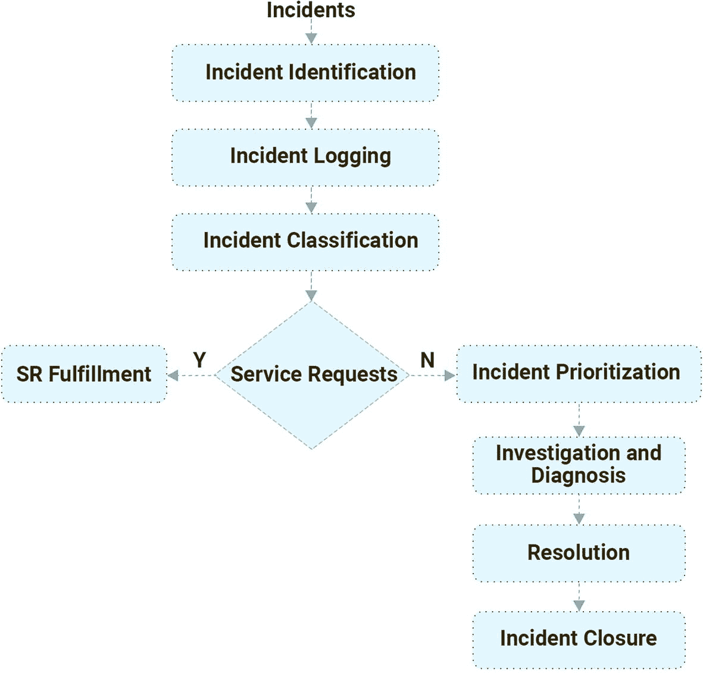

图 2-10

事故管理流程

*   *事件管理*:目标是检测所有级别的事件，并采取适当的措施处理事件。自动化工具监控事件，并根据为其设置的流程生成警报。它为主动监控和服务改进提供了基础。这已经发展成一个新的领域，叫做可观察性，重点是使用日志、度量、事件和跟踪的端到端监控。这包括提供端到端视图的高级功能，并提供跨基础架构和应用的关联，以便能够找出问题的根本原因。

*   *事故管理*:目标是尽可能快地恢复服务运营，避免对业务造成影响。它专注于在最短的停机时间内提供高质量的服务和更高的可用性。事件可以是由事件管理检测到或由用户报告的故障。

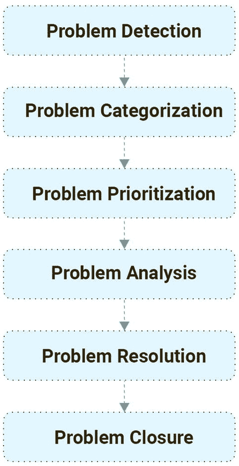

图 2-11

问题管理生命周期

*   *问题管理*:目标是通过找到事件发生的根本原因来防止事件发生(见图 [2-11](#Fig11) )。消除周期性发生的事件，专注于最大限度地降低无法预防的事件的影响。

*   *请求完成*:目标是完成用户提出的服务请求。服务请求分为不同的类别，如服务状态信息、访问请求、投诉等。

*   *访问管理*:目标是为授权用户提供使用服务所需的访问权限。访问管理遵循为安全性和可用性管理列出的策略。

### 持续服务改进

此阶段重点关注如何重新调整 IT 服务以适应业务变化。它通过实现已确定的改进领域来完善 It 服务。它遵循著名的戴明循环，该循环有四个阶段:计划、执行、检查和行动。它还遵循服务改进流程中的七个步骤(见图 [2-12](#Fig12) )。参见图 [2-13](#Fig13) 中的提示。

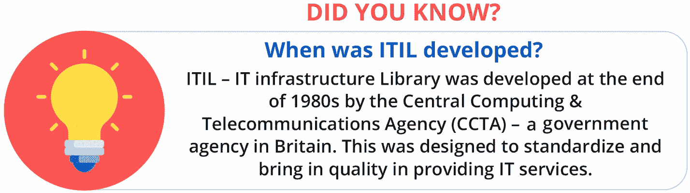

图 2-13

你知道吗？

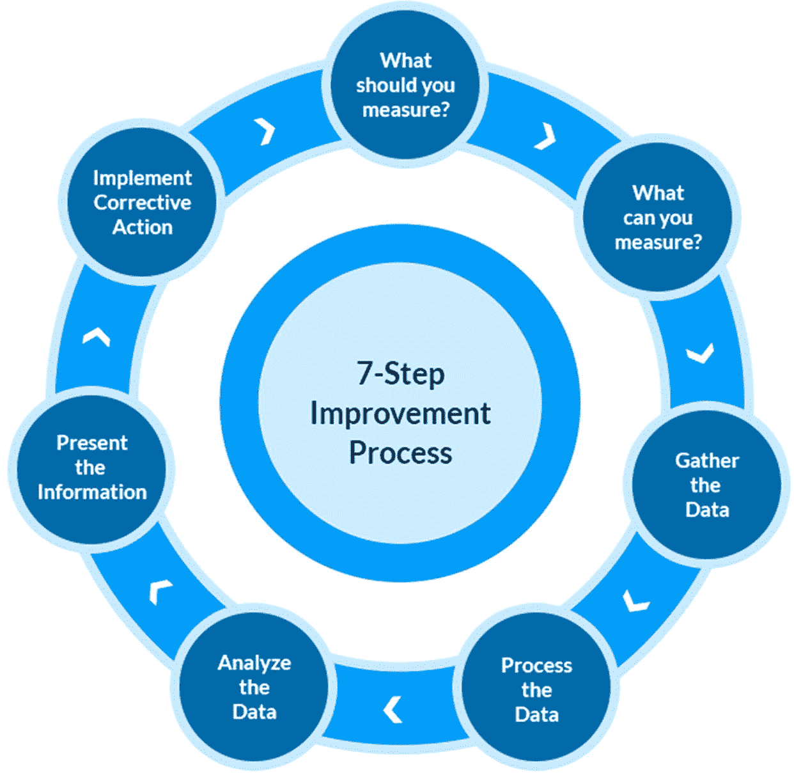

图 2-12

七步改进流程

## 传统 InfraOps 团队的缺点

InfraOps 团队可以继续这些年的运营方式，但时代已经变了，迫切需要转向一种新的运营模式，这种模式与云、容器化和基础设施代码等新技术更加一致。让我们来看看传统基础架构运营模式的一些缺点:

*   *结构化但僵化的流程*:没有灵活的余地，重复性的任务都是手工完成的。多年来，InfraOps 团队一直信赖人工工作方式，并继续采用这种策略。

*   *与其他团队的有限协作*:通过票证和电子邮件提交请求；有依赖；预计会有延误。

*   *竖井式专业化*:这种方法具有 I 型专业知识，导致移交增加，并影响客户期望。

*   *高度定制的内部环境*:需要手动设置新的基础架构或对现有基础架构进行更改。遵循手动清单来跟踪变化。集成和架构都很复杂。

*   *基于票证的沟通*:实现变更时需要多次批准和交接，从而增加了等待时间。

## 变革的需要

传统的方法是好的，直到行业转向数字。组织意识到，只有当他们很好地了解他们的客户，并且能够响应和提供相关的、需要的服务时，他们才能成功。这个数字时代需要新的思维、战略和流程，以及对人和新工具和技术的投资，以帮助他们优化。例如，如果一个测试人员被授权使用自助服务在同一天建立一个测试环境，而不是等待两个星期，这不是有助于提前完成任务吗？

不仅仅是交付速度的压力促使基础架构运营变得敏捷，还有其他因素也在迫使组织实现基础架构 It 运营的现代化，如技术漂移、客户兴趣、全球业务等。参见图 [2-14](#Fig14) 。

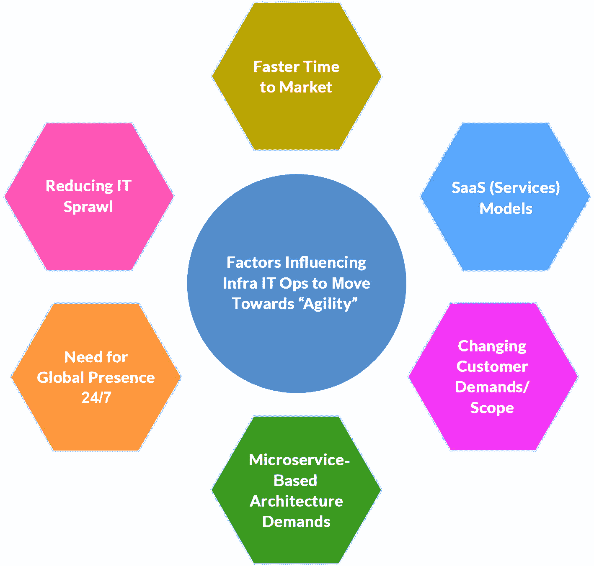

图 2-14

需要采用敏捷的基础设施运营

从传统运营到敏捷运营的转变将使不同层次的团队受益，并培养协作文化。它还帮助团队专注于一个目标:按时交付高质量的服务。虽然许多组织已经将自己转变为敏捷和 DevOps 生态系统，但是仍然有一些组织需要发起和采用新的文化。建立跨职能团队、培养自助服务和工具合理化标准化都是 InfraOps 团队需要立即考虑的事情。即使是已经实现了 DevOps 和 agile 的组织也需要集成 InfraOps，并在交付 IT 服务时实现整体协调。由于敏捷 InfraOps 相对较新，由于缺乏可用的最佳实践和现成的解决方案和加速器，组织还无法向前发展。这本书旨在弥合差距，并从实际项目中为基础设施运营中实现敏捷提供见解。

## 摘要

IT 基础架构运营团队传统上负责管理提供计算、存储、网络、安全、备份、高可用性、灾难恢复、监控、管理等服务的内部数据中心。他们的重点一直是集成 IT 资产，并确保安全性和合规性不受影响。IT 基础架构组织也一直在实践 ITIL，这是一个包含最佳实践的框架，指导组织如何提供 IT 服务。这些服务是标准化的，帮助团队跟踪和满足 SLA。但是随着时代的变化，僵化的流程需要更新，以前与应用开发团队合作有限的团队现在需要以敏捷的方式合作并提供服务，而不是以传统的方式运行。通过敏捷和 DevOps 的原则，这种改变是可能的。

在下一章中，我们将开始讲述敏捷和 DevOps 原则，然后开始在基础设施运营领域实现这些方法的最佳实践。