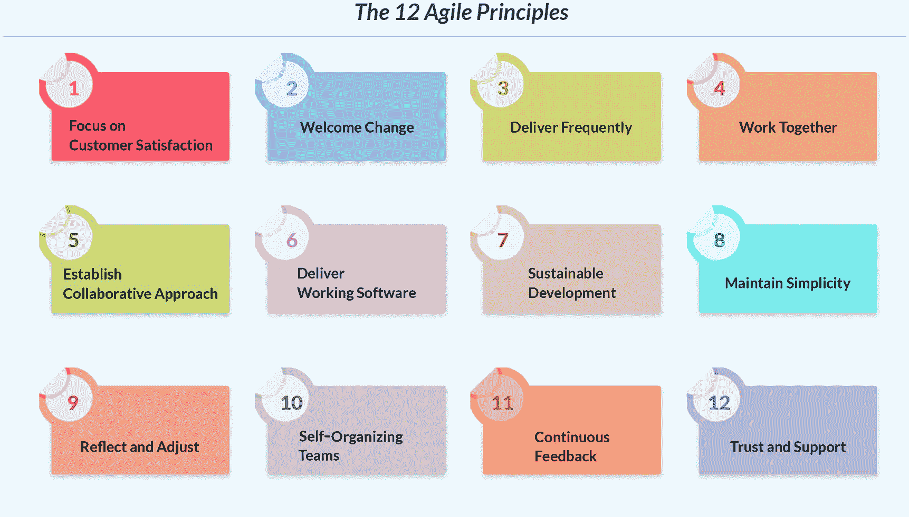
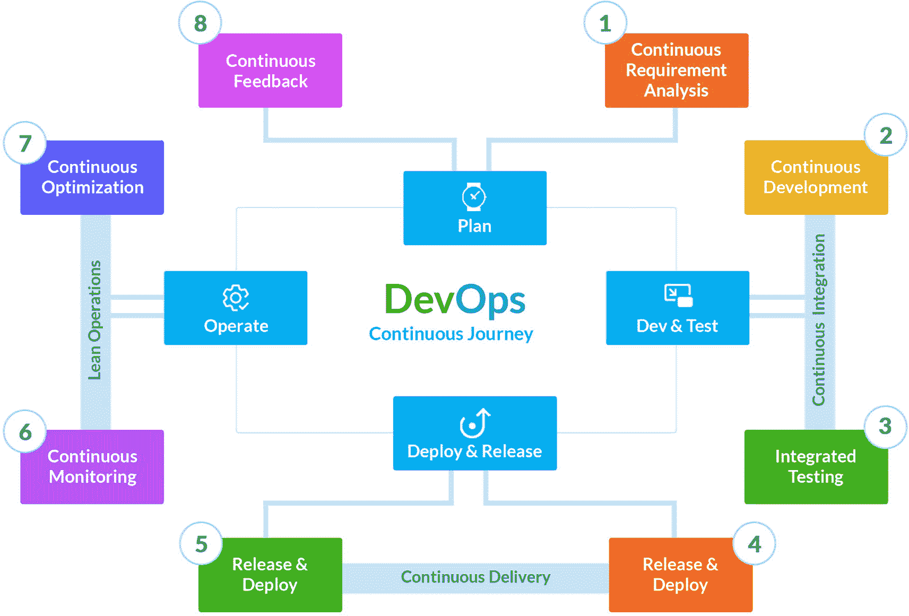
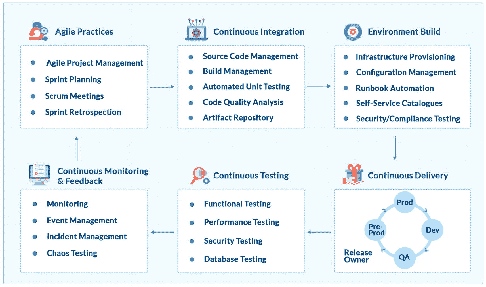

# 三、敏捷和 DevOps 简介

本章将介绍敏捷和 DevOps，包括当两者一起工作时的价值、原则和好处。本章将涉及的主题如下:

*   你应该什么时候采用敏捷？

*   敏捷原则

*   敏捷优势

*   使用 DevOps 灵活扩展

*   什么时候应该采用 DevOps？

*   产品生命周期中的 DevOps

我们意识到敏捷和 DevOps 是相辅相成的，它们的采用使组织能够超越并经常交付。虽然敏捷侧重于持续交付，但是 DevOps 引入了最佳实践，可以快速跟踪开发和运维团队的集成以及敏捷最佳实践的采用。那么，我们可以只采用敏捷或者 DevOps 吗？敏捷和 DevOps 有哪些重叠和融合点？我们如何一起实现它们？我们能在基础设施运维中使用敏捷和 DevOps 吗？要回答这些问题，我们需要更详细地理解敏捷和 DevOps。

## 何时采用敏捷？

敏捷是一种围绕迭代交付推荐、促进和提供指导的方法，通过连接的团队、开放的协作、产品生命周期阶段的端到端集成以及对客户反馈的持续工作，这是可能的。当团队需要在短时间内交付最小可行产品(MVP)时，采用敏捷是有帮助的，在这种情况下，客户的反馈对于驱动产品的下一个变更或特性是重要的。因此，开发团队从他们产品的客户那里获得了更多的信心和信任。与其一个月发布一次，将集成测试推到最后，不如关注快速发布，获得反馈，并在周期的早期提供工作软件。

## 敏捷原则

IT 团队一直在采用包含图 [3-1](#Fig1) 中所示的 12 条原则的敏捷方法。

图 3-1

敏捷原则

**原则 1:关注客户满意度**

任何企业的一个关键目标是增加客户足迹，并辅以出色的满意度。为了获得良好的客户满意度，我们需要快乐的客户，他们正在寻找能够满足其需求的灵活服务产品。这是通过与客户保持密切联系并经常获得他们的反馈来实现的，这有助于 IT 团队及时地规划和改变路线。早期的反馈也有助于团队在过程的后期避免大的变化。如今，许多公司在更大的最终产品发布之前，会小批量推出他们的产品，通常被称为阿尔法版本和 T2 版本。这有助于他们了解客户偏好，并根据需要更改产品路线图。倾听客户的反馈使团队能够构建客户需要的东西，而不是为没有投票的东西做计划。因此，每个客户都很重要，无论是需要建立新环境的内部产品团队，还是使用产品或服务的外部客户。一个好的分数清楚地表明顾客喜欢这个产品。这也成为团队的关键绩效指标(KPI)。

**原则二:欢迎改变**

变化是不可避免的，团队应该在产品生命周期的每个阶段都欢迎变化。这可以通过指导团队并帮助他们理解采用变革的目的来实现。团队应该为变化做好准备，以便满足客户需求。如果没有做到这一点，那么产品就会落后于竞争对手，最终对组织产生负面影响。另一种欢迎变化的方式是在开发的初始阶段，客户的反馈有助于及时改变行动的过程。通过简化的流程工作流来接受频繁的变更有助于团队变得敏捷。当然，最终目标是向客户交付价值，当团队共享并同意由客户驱动的使命陈述时，这是可以实现的。

**原则三:频繁交货**

客户反馈在产品开发生命周期中起着关键作用。根据客户的期望对需求进行优先排序和更改。现代产品是分阶段交付的，这有助于 IT 团队了解每个阶段的实际需求，并相应地采取正确的措施。每个阶段都需要交付可工作的软件，并与客户共享以获得他们的反馈。这个最小可行产品(MVP)使团队能够定期封装客户反馈，并确保产品在正确的方向上构建。因此，与其在几个月内交付一个应用，不如将周期时间减少到几周甚至几天。如果不经常交付工作软件，最终需要的变更将是巨大的，所有完成的工作可能会浪费掉。也有可能在几个月的工作后，当产品交付时，市场需求和所需的特性已经发生了巨大的变化，因此产品可以工作，但不再需要它当前的形状和形式。

**原则 4:共同努力**

传统上，您会发现业务团队和 IT/技术团队各自为政，协作有限。业务团队定义需求，IT 团队构建产品来满足这些需求。为了确保产品交付价值，这两个团队都需要联系并定义满足客户需求的共同目标。事实上，在一个 IT/技术团队中，有许多其他团队按照他们自己的步调工作(例如开发团队、基础设施团队、架构团队、安全团队、操作团队等)。).不管他们的职能或层级如何，IT 组织中的所有团队都需要协作，朝着共同的愿景前进。当团队共享遵循优化流程的工具和平台，并提供透明度和协作时，这是可以实现的。这些团队也需要在变得敏捷方面得到指导。

**原则 5:建立协作方法**

协作就是团队合作，通过透明的沟通取得成功。无论团队在哪里，都需要在 IT 组织中培养一种共享和协作的文化。应该鼓励团队分享他们的观点并实践问责制的概念。当团队得到敏捷方面的指导，并且他们理解信任和透明的重要性时，他们就被授权了。团队需要接受“拉动工作”的文化，而不是“推动工作”这是一个核心的敏捷实践，团队在其中变得自给自足。团队可以利用优秀的平台进行持续的沟通和协作，以解决产品生命周期中的每个阶段。团队应该相互合作来识别障碍，并作为一个团队来解决它们，而不是各自为战。

**原则 6:交付工作软件**

MVP 的概念是很重要的，应该经常练习。MVP 是一个产品胶囊，交付一个可以独立测试和验证的特定功能。当团队合作从各个角度(如弹性、质量、安全性、合规性等)验证产品时，这是成功的。一个可行的解决方案证明需求已经被理解，并且团队已经努力按照需求交付它。在敏捷开发的初始阶段，团队发现很难及时交付 MVP。这可能有各种各样的原因，比如需求的差异、不正确的工作量估计等等。但是随着时间的推移，随着团队在敏捷实践上的扩展，他们交付 MVP，与客户分享，并期待他们的反馈。这种工作软件应该交付客户要求的价值，并且随着时间的推移而增加，这意味着随着产品的增长，新的特性会增加。

**原则 7:可持续发展**

敏捷开发专注于在迭代中交付解决方案，因此它在很长一段时间内是可持续的。每个与产品生命周期相关的利益相关者都应该能够以一致的速度前进。为了实现可持续发展，需要一个健康的工作生态系统，激励每个人专注并发挥出最佳水平。团队可以通过不断监控他们的技术优势来实践敏捷性，从而交付好的设计。这一原则是通过检查团队的满意度和不让他们失去焦点来培养的。团队应该能够参与并吸收期望，而不是让自己超负荷。事实上，他们应该定期计划和交付恒定的价值。

**原则 8:保持简单**

这一原则的重点是不要使交付复杂化。想法很简单:从小处着手，及时交付，并在此基础上不断增加。一般来说，团队不会直接接触客户，他们从业务团队获得需求，并在这些需求的基础上开始构建。为了简化开发生命周期，如果团队理解他们为什么要构建一个特性，它会给他们更多的细节，帮助他们更好地计划。当他们构建产品时，这将有助于他们专注于为客户提供价值的核心可交付成果，并减少镀金和不需要的功能。使用有效的沟通和透明工具有助于简化。简单而有效的产品交付是 IT 组织最终需要的。

**原则 9:反思和调整**

虽然主要重点是让客户满意，但 IT 组织需要反思需要改进的地方。已经确定采用敏捷方法的组织应该研究他们的工作方式，并根据需要定期修改方法。例如，回顾帮助团队识别构建新架构的技术培训的需求，或者，对他们的评估技术进行返工，以确保 MVP 按时交付。团队需要吸收新的变化，并在需要时寻求帮助以快速调整。

原则 10:自组织团队

团队是敏捷组织的重要核心元素。成功的敏捷团队是那些随着时间的推移变得自力更生的团队。必须向本组织灌输一种所有权和问责制的文化。这将使团队共享一个共同的愿景。持续的指导和授权将有助于团队升级和成长，这可以通过采用正确的技术和平台作为推动创新的催化剂来实现。被授权的团队采用自下而上的方法工作，而不是自上而下的方法。这使得在现场工作的团队承担责任，并使他们能够做出及时交付价值所需的正确决策。如果产品所有者定义了产品的“什么”方面，那么自组织团队关注的是“如何”方面。

**原则 11:持续反馈**

产品的成功在于被接受。积极的反馈表明产品正朝着正确的方向发展，并且符合客户的期望。处理客户反馈有助于团队对需求进行优先排序，并随着进展做出改变。毕竟这是一个不断学习和提高的过程。事实上，应该在产品开发的初始阶段收集客户反馈，以便及时接受反馈。应该监控和跟踪这些反馈，以便记录客户的声音，并重新审视产品路线图。

**原则 12:信任和支持**

敏捷中两个最重要的原则是信任和支持。当组织信任自组织团队在现场做出决策时，敏捷模型就起作用了。能够独立决策并快速改变路线的小型自组织团队是敏捷中成功的关键。成功的团队是那些定期培养新技能和最佳实践的团队。当团队被激励、被授权做出决策并对他们计划贡献的价值负责时，他们就能构建成功的项目。信任团队，为他们提供所有需要的平台，以便他们能够交付价值。应该实践服务型领导文化，以避免复杂的等级结构贯穿僵化的流程。

## 敏捷优势

主要地，敏捷原则已经被开发团队有效地使用，并且通过利用这些原则已经实现了巨大的利益。IT 领域和其他领域的大多数项目都是使用敏捷方法交付的。这些原则现在在 IT 运维部门越来越受欢迎，团队正在实践这些原则，并采用敏捷方法和价值观。如表 [3-1](#Tab1) 所述，有四个关键的敏捷价值观有助于实现敏捷原则。

表 3-1

敏捷价值观及其相关性

   
| 

敏捷价值观

 | 

关联

 | 

工具

 |
| --- | --- | --- |
| 过程和工具之上的个人和交互 | 自我指导和授权的团队。团队执行并参与产品交付决策，如评估、范围、风险等。 | 协作和沟通工具，如微软团队、WebEx 等。 |
| 综合文档之上的工作软件 | 以小冲刺的方式交付 MVP。专注于提供价值。 | 物理和虚拟敏捷板 |
| 合同谈判中的客户协作 | 灵活适应合同要求。始终与客户就“完成”的目标和定义进行合作 | 产品演示等仪式 |
| 响应变化而不是遵循计划 | 持续的积压更新和优先排序。随着变化进行扩展和调整。 | 冲刺计划、回顾、每日站立等仪式。 |

## 使用 DevOps 灵活扩展

随着敏捷软件开发规模的不断扩大，也需要将这些原则扩展到运维团队。这就是德沃普斯前来救援的地方。如前所述，敏捷不能在筒仓中运行；它需要被缩放。应用需要基础设施来运行，这也是基础设施和团队需要被鼓励采用和实践敏捷的地方。随着产品发布的频繁管理，开发和运维团队可以一起加快价值创造和成本节约的速度。

## 什么时候采用 DevOps？

DevOps 使用文化哲学、实践和工具的组合来提高组织高速交付应用和服务的能力。当与敏捷结合时，它提高了团队协作和生产力。最近，许多组织重新审视他们的工作方式，鼓励团队保持联系，最大限度地利用自动化。当产品团队不仅希望连接开发和运维团队，而且希望在整个产品生命周期中集成流程时，他们会采用 DevOps，这可以通过利用流程、工具和自动化来实现。

持续之旅是 DevOps 取得成功的重要条件。DevOps 的原则弥合了孤立团队之间的差距，并利用自动化来优化连接产品整个生命周期的流程。生命周期中的每个阶段都有自己的工具、流程和团队。虽然 CI 和 CD 为应用世界中的集成铺平了道路，但基础结构世界中的元素仍然在孤岛中运行。DevOps 模型集成了每个阶段和每个工具，简化了流程，并专注于一个共同的愿景——“我们构建它，我们运行它。”采用新工具、迁移到云、利用 API 等。，使团队能够快速联系并共享通用流程和工作流。核心原则在于相信这是一个持续的改进之旅。见图 [3-2](#Fig2) 。

图 3-2

DevOps 连续旅程

## 产品生命周期中的 DevOps

图 [3-3](#Fig3) 显示了 DevOps 框架中的步骤。

图 3-3

DevOps 框架

1.  业务规划中的*敏捷实践*步骤建立业务目标，并根据客户反馈对其进行调整，这有助于提高敏捷性和业务成果。这有助于赢得客户对交付物所交付价值的信任和信心。产品生命周期的第一阶段是正确构建产品旅程的垫脚石。通过正确采用工具和技术，这个阶段变得必不可少，并与其他阶段集成在一起。举行正确的仪式、评估和计划交付速度，以及在团队中拥抱变革文化，这些都起着至关重要的作用。这个阶段一般通过工具来管理，比如 Atlassian 吉拉、Azure Boards、VersionOne、LeanKit 等。这些工具通过其他生命周期工具进行扩展，以获得端到端的可追溯性。

2.  *持续* *集成*是一种实践，在这种实践中，软件开发人员经常将他们代码库中的代码与应用的代码集成在一起，其他团队成员也会添加他们的代码。这有助于在构建代码时早期发现集成缺陷，如果在后期发现，修复起来将会非常昂贵。构建 CI 渠道是当今许多组织的常见实践，也是事实上的标准。虽然这个管道是在应用空间中实现的，但今天它也适用于构建基础设施管道。像 Jenkins，TravisCI，CircleCI，TeamCity 等工具。都是众所周知的工具，它们编排了从构建代码到交付可执行文件/二进制文件的关键步骤。完整的 CI 管道包括源代码管理、构建执行、单元测试、代码覆盖和工件/二进制部署。

3.  *环境构建*通过采用运行手册自动化、配置管理工具和自助服务目录，专注于即时基础架构供应。这一领域的自动化有助于减少 IT 蔓延。构建环境包括各种活动，如供应和配置基础设施、准备运行手册自动化、执行和自动化安全扫描，以及将基础设施管道与 ITSM 工具集成。在接下来的章节中，我们将举例说明如何在应用和基础设施领域实现 CI，以及它们是如何集成的。

4.  *连续* *交付*实践关注于跨不同环境发布产品。定义良好的发布和部署流程可以确保及时交付高质量的产品。部署的每个阶段都要通过一系列质量检查。成功之后，它将被部署到目标环境中。例如，如果 CI 构建成功，CD 管道将从开发环境中提取二进制文件，并将它们部署到测试/QA 环境中。如果 CI 管道不成功，部署将不会继续。类似地，如果工件必须从测试/QA 环境转移到预生产环境，那么工件将需要更多的质量关口，例如配置和接受的覆盖率、安全分数等。工具如 Jenkins、Azure DevOps、GitHub Actions & Runners、Atlassian Bamboo 等是执行连续部署操作的好例子。

5.  *持续测试*是一种实践，意味着在生命周期的早期进行更早和持续的测试以检测缺陷，这将导致成本的降低。这有助于建立对产品质量的持续反馈。通过自动化测试用例，并在每个代码集成和构建过程中执行，可以实现连续测试。如今，测试范围已经扩大，不仅仅局限于功能、性能和安全性测试。随着应用转向基于微服务的架构，满足客户群日益增长的市场需求，扩展测试的需求变得至关重要，包括 API 测试、可访问性测试、弹性测试等。这一领域的一些工具有 Selenium、Appium、JMeter、HCL One Test Suite 等。

6.  *持续监控和反馈*实践包括监控所有阶段的应用和基础设施，并确认来自客户的反馈。这将有助于制定优化和改进应用的措施，从而提升客户体验和价值。部署的应用的每一个事件或问题都会受到严密监控，并得到灵活处理。ITSM 工具，如 ServiceNow、Remedy 等。，来拯救这个空间。

因此，我们有敏捷原则和 DevOps 关联模型，使组织能够紧密合作并更快地前进。

## 摘要

敏捷和 DevOps 是相辅相成的，但是它们不应该被认为是彼此的替代品。一方面，如果敏捷侧重于具有持续反馈原则的迭代开发，那么 DevOps 侧重于将相互协作的团队聚集在一起，并计划持续的改进之旅。实践敏捷的组织很容易过渡并扩展到 DevOps 工作模型。实践敏捷和 DevOps 的 IT 团队获得了长期的好处，例如:

*   协作和自组织的团队

*   通过信任和透明拥抱变化

*   通过自动化缩短上市时间

*   通过反馈循环持续改进

*   简化的流程和集成的工作流程

*   降低成本

*   更高的客户满意度得分

*   更好的业务一致性

接下来让我们看看加速基础设施运维向敏捷转型的关键因素。