# 四、产生敏捷运维的因素

在这一章中，我们将讨论向敏捷和微服务、部署的转变，以及持续测试是如何在不同层面上发生的。本章中您将了解的主题如下:

*   向敏捷的转变

*   敏捷性的优势

*   云计算

*   微服务架构

*   部署模式和自动化

*   左移测试

*   影响运维的架构变化

如今，数字组织正在采用敏捷运维，因为它已经成为一种必要。在麦肯锡([`https://www.mckinsey.com/business-functions/organization/our-insights/the-impact-of-agility-how-to-shape-your-organization-to-compete`](https://www.mckinsey.com/business-functions/organization/our-insights/the-impact-of-agility-how-to-shape-your-organization-to-compete))2021 年 5 月的一项调查中，观察到高度成功的敏捷转型产生了 30%的运维绩效，这是由持续改进和消除交接推动的。该调查还衡量了敏捷运维成熟度模型(针对 2，190 名受访者)及其业务影响。整个样本中大约有 10%的人推动了成功的敏捷转型，其中敏捷被大规模地推动以创造价值。调查还显示，敏捷转型现在正成为人们感兴趣的主流话题。

在不同的地区和行业进行了类似的调查，它们表明运维模式正在发生转变。但这不是一夜之间发生的。像云这样的新兴平台和像微服务这样的新软件开发模式，都促进了对业务敏捷方法的需求。对敏捷性、弹性、凝聚力团队、安全环境、快速周转时间、数字化、智能自动化和端到端集成的需求是基础设施运维团队采用敏捷的激励因素。见图 [4-1](#Fig1) 。

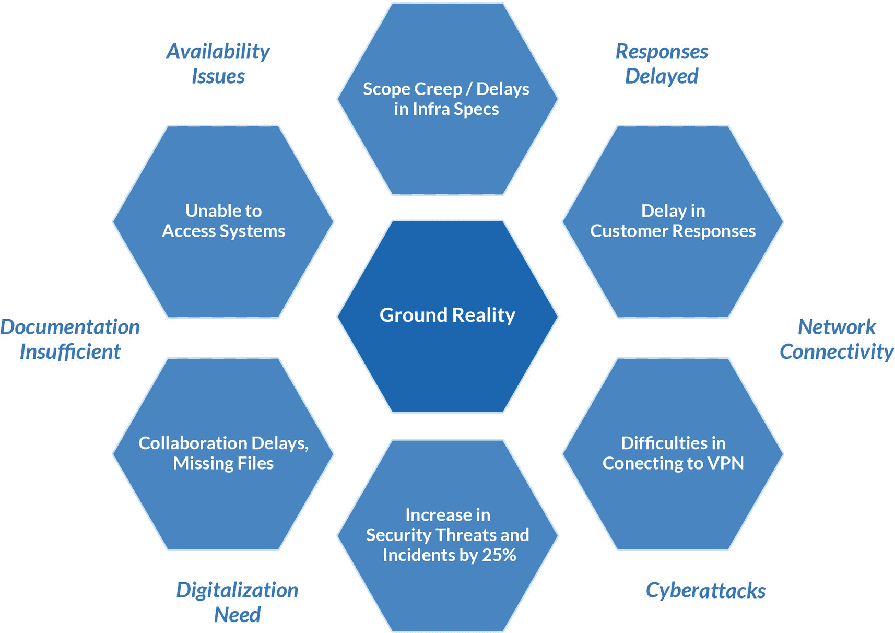

图 4-1

传统运维面临的共同挑战

的确，运维团队的愿景是确保系统稳定。到目前为止，传统的工作方式是好的，但这些规范现在正以满足和维持数字业务需求的方式发生变化。因此，当务之急是从传统的运维方式转向敏捷运维。虽然愿景保持不变，但基本的工作方式必须转变。这就需要提升我们团队的技能，并引入和采用敏捷性和自动化来交付基础设施服务。基于里程碑的路线图将使组织能够从传统运维转变为敏捷运维。这些里程碑将包括现代技术的元素，如云、无服务器计算或人员方面，包括建立跨职能团队、创建站点可靠性工程(SRE)团队、引入可观察性和自动化，以及为团队提供自助服务目录，这些目录可通过目录和 API 使用。这些变化将影响图 [4-2](#Fig2) 中所示的 IT 的“运维业务”和“改变业务”部分。

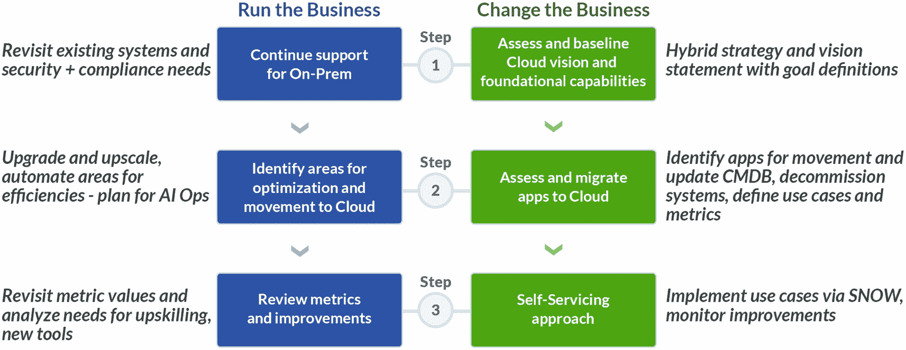

图 4-2

面向云采用的“运维业务”和“改变业务”计划示例

## 向敏捷的转变

从传统 IT 运维到敏捷运维的转变需要精心规划，并应定期重新评估以衡量采用率。还需要在人员、流程和自动化方面进行跟踪。让我们来看看传统和敏捷 IT 运维之间的一些关键差异；见表 [4-1](#Tab1) 。

表 4-1

传统 IT 运维和敏捷 IT 运维的比较

   
| 

面积

 | 

传统 IT 运维

 | 

敏捷 IT 运维

 |
| --- | --- | --- |
| **人** | 每个职能/技术的专门团队 | 跨职能/技术的跨技能团队 |
| 开发和运维团队独立工作，并作为孤立的团队工作 | 开发和运维团队紧密合作，作为一个整体团队工作 |
| **流程** | 具有多次移交的严格流程 | 自动化使有限的移交成为可能，简化了流程 |
| 依赖手动干预的事件/票证驱动方法 | 自助式运维模式 |
| **工具和自动化** | 有限或孤立的自动化 | 推动 IT 交付的标准化自动化框架 |
| 交付定制的基础架构非常耗时 | 通过基础架构代码加快配置速度 |
| 利用孤立的监控工具来扫描应用和基础架构 | 集成和优化的工具集，用于监控基础架构和应用 |
| 多个控制面板，用于跟踪和管理基础架构服务和安全性 | 具有自动调解功能的集成仪表板 |

当从传统到敏捷的转变以有计划的、分阶段的方式完成时，它在组织中是成功的。当组织在敏捷技术中指导他们的操作团队时，他们也将基础设施实现为代码和可观察性技术。这有助于团队标准化他们的基础设施设置，并限制任何人工干预；现在大多数操作要么是全自动的，要么是增加了自动化。实现自动化系统有助于运维团队遵守安全性和合规性标准。

## 敏捷性带来的好处

在敏捷模式下工作有一系列的好处，没有副作用。团队可能需要一些时间来适应和扩展，但是从长远来看，组织将会获得采用敏捷的好处。看看通过实现四个敏捷原则可以获得的一些关键好处(见图 [4-3](#Fig3) )。

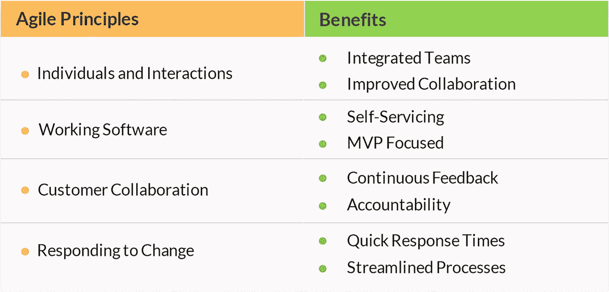

图 4-3

敏捷基础运维的优势

值得注意的一点是，向敏捷工作方式的转变需要团队的指导和训练。虽然自动化工具将带来自助服务和自动调解的直接好处，但重点是简化流程和授权团队。因此，尽管敏捷性很有帮助，但组织需要考虑构建强大的服务组合。这是处理容器、云等新兴技术所必需的。让我们来看看一些促使组织在其生态系统(包括基础架构运维)中推动敏捷性的技术中断。

## 云计算

云计算作为一个术语包括不同类型的服务，包括基础设施即服务(IaaS)、平台即服务(PaaS)、软件即服务(SaaS)、容器即服务(CaaS)和功能即服务(FaaS)。不同的产品在监控、管理和行政方面有着非常不同的需求。随着您从基础架构即服务发展到 SaaS，客户管理环境的责任将会减轻，因为基础层将由云提供商完全自动管理。如果你使用的是 Gmail，这是谷歌的 SaaS 产品，你不需要管理运行 Gmail 的基础设施或应用；你只是作为消费者来使用它，因为所有的底层基础设施和应用都是由谷歌为你管理的。如果您使用 Microsoft Exchange 托管自己的电子邮件服务器，那么整个基础架构和 Microsoft Exchange 平台都需要由您来管理。在电子邮件领域采用 SaaS 实际上使得内部部署的 Microsoft Exchange 类型的部署变得微不足道，因为组织已经转移到 SaaS。让我们更详细地看看云计算的三个主要模型，如图 [4-4](#Fig4) 所示。

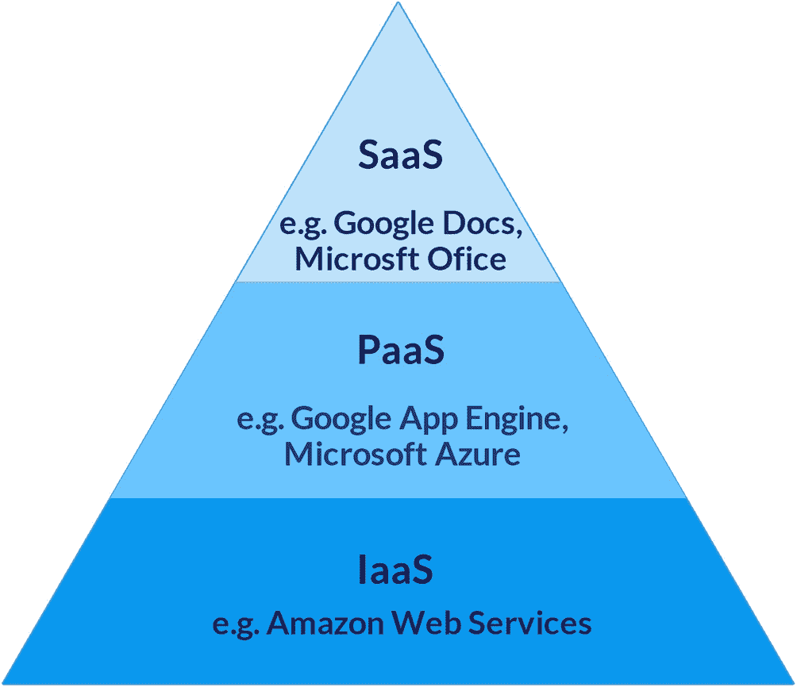

图 4-4

云计算模型

### 基础设施即服务

在 IaaS 中，云提供商为用户提供对服务器、存储和网络等计算资源的访问。组织在此基础架构之上使用自己的平台和应用，并管理操作系统及其之上的层。

**IaaS 特性**

*   客户不需要租赁数据中心，购买网络、计算和存储硬件，或者集成所有这些元素。云提供商以按使用付费的方式向客户提供所有这些服务。客户能够根据需求扩大和缩小规模。

*   客户省去了规划、采购、安装和运行基础设施的工作。

*   由于计算基础架构由云提供商自动管理，因此像手脚支持、数据中心布线以及网络和硬件故障事件等活动不再需要由客户的支持团队来处理。

### 平台即服务

在 PaaS 中，云提供商为用户提供了一个云环境，用户可以在其中开发、部署和管理应用，而无需担心基础架构和平台组件。除了 IaaS 中提供的服务之外，PaaS 还提供操作系统、平台抽象和这些组件的自动管理，以便客户可以专注于应用代码。

**PaaS 特性**

*   PaaS 平台提供了托管应用和数据库的平台；它还提供了开发、测试和部署应用的工具。

*   云提供商管理操作系统、数据库、中间件或其他平台，这些平台与基础架构组件和安全、备份等一起作为服务提供。

*   PaaS 平台释放了客户管理团队的资源，并使用简单直观的屏幕减少了管理和监控开销，从而减少了配置和管理这些服务的访问和安全性的工作。

*   操作系统管理员、数据库管理员、中间件和平台管理员的管理活动大部分是自动化的，由云提供商交付。

### 软件即服务

在 SaaS，云提供商为用户提供在云上运行的全功能应用。用户可以在云平台上进行身份验证并开始使用应用。SaaS 可以是简单的应用，如电子邮件或协作客户端，也可以是复杂的业务应用，如 ERP 解决方案。

**SaaS 特色**

*   整个应用以订阅的按使用付费模式提供给用户。

*   由于基础设施和平台是抽象的，用户不需要安装、配置或管理这些组件。此外，由于应用也是由云提供商提供的，客户不需要开发、部署、升级或管理应用。

*   客户可以从不同的位置使用应用，可以管理用户和访问，并可以提供角色和用户的映射，以便经过身份验证和授权的用户可以访问应用所需的功能。

*   SaaS 管理基础设施和平台等底层组件的扩展，以向用户提供基于 SLA 的可用性和响应。

*   这种模式涉及的管理开销最少，因为从基础架构到平台，再到应用开发和部署，几乎所有东西都由云提供商交付。在这种模式中，应用开发和操作工作都被取消了，因为一个功能完整的应用被提供给业务和功能用户使用。

因此，从敏捷基础设施运维的角度来看，在规划运维团队和流程时，需要考虑云提供商提供的各种产品。在不同的消费模式中，管理环境所需的技能会发生巨大变化。随着客户转向使用更多的 SaaS 和 PaaS 环境，基础架构运维的作用将会减弱，因为这些层是由云提供商自动交付的。

早期，基础设施运维面临技术挑战，基础设施云计算产品不可用。因此，这意味着采购、安装、配置和测试这些系统的漫长过程是必要的。任何新的应用组合都被视为一个项目，涉及来自 IT 基础架构、采购、安全、设施和应用团队的团队。即使在 IT 基础架构中，设置数据中心时也有许多因素需要考虑，例如选择托管数据中心和网络、存储、计算和虚拟化系统以及连接和安全设备的托管设施。此外，确保来自不同供应商的所有这些系统相互兼容也非常复杂，在基础设施可供应用团队使用之前，需要对集成进行测试。

所有这些技术限制需要详细的粒度规划，而不是迭代实现，因为以后的任何更改都将涉及选择产品、采购产品以及实际交付和安装产品的漫长过程，这需要数周时间。例如，如果为了反映更高可用性的组件而进行了设计更改，您需要两张 HBA 卡，如果您为计算设备订购了一张 HBA 卡，那么您必须订购一张物理卡，然后由硬件供应商采购并发货。同样，网络设备或存储设备的任何变化都意味着硬件的采购、运输和物理实现。为了避免此类问题，IT 基础架构团队开发了需要强大和精细规划的流程和系统，以确保项目不会遗漏任何内容。一旦部署，对 IT 基础架构的任何更改也将经历详细的规划和更改控制流程，因为有如此多的组件协同工作来提供 IT 基础架构，其中一个组件的任何配置更改都可能影响集成。因此，在前云时代，软件开发的敏捷过程是不可行的，因为 IT 基础设施处理物理基础设施元素，并且有太多的集成需要处理。

随着云计算的出现，这一切都改变了。基础设施通过 API 变得可编程，组件的集成由云提供商保证工作，因为控制平面的抽象层和来自云供应商的云管理软件处理所有这些方面。参见图 [4-5](#Fig5) 。

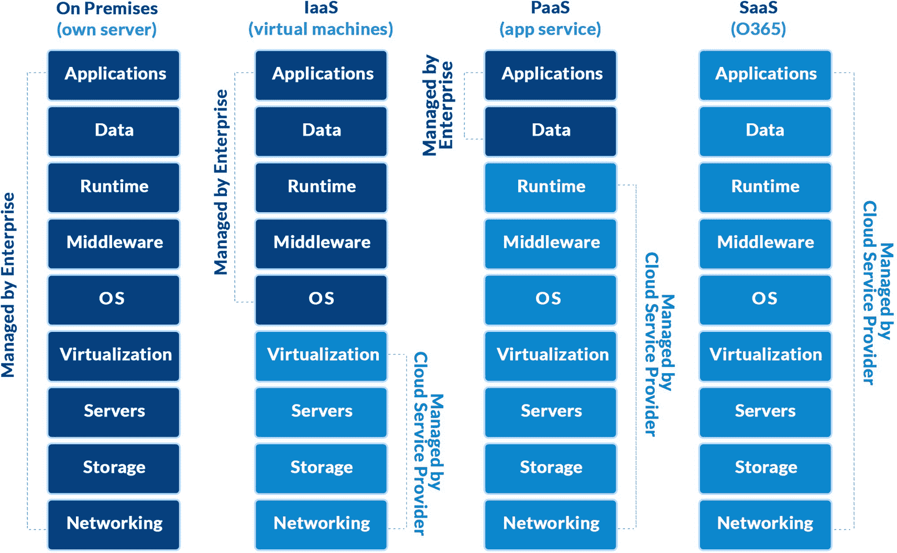

图 4-5

内部部署与云计算类型

不再需要为计算您的环境容量而进行大量规划，因为任何额外的容量都可以根据需要在云环境中轻松增加。

云计算带来的技术变革从根本上改变了 IT 基础设施的设计、实现和使用方式。几十年来为 IT 基础设施建立的流程和系统现在需要改变，因为云带来的技术颠覆改变了游戏规则。

云计算带来了环境、配置、集成和最佳实践的标准化。与过去每个人都必须找出自己的最佳实践、控制和标准不同，云提供商提供了可以开箱即用的最佳实践、使用案例和标准化架构。网络上最具挑战性的方面——设置硬件、虚拟化软件、外围安全和安全设备——现在在云环境中只需点击一个按钮即可实现。即使您在设计中遗漏了一些东西，您也可以像过去一样快速地将变化融入到环境中。云计算带来的另一个根本变化是基础设施变得可编程，这意味着应用开发团队可以通过代码使用基础设施元素，并通过他们的 CI/CD 工具旋转环境，减少对基础设施运维团队的依赖。然而，这意味着很快每个应用团队都将拥有自己的云环境，由他们选择的提供商使用他们想要使用的技术，并且在基础架构和云环境上没有跨组织的标准化。

由于您可以在云环境中随心所欲地消费，因此存在这样的场景:应用团队可以在没有预算和治理控制的情况下加速环境运行或使用基础架构并增加云计算账单。从云计算的角度来看，安全性、合规性、治理和 FinOps 规程是必需的，以确保应用和基础架构团队以受控和安全的方式利用云，而不是以应用团队可以为所欲为的免费模式。

因此，基础架构团队的角色需要改变，以应对云基础架构带来的技术中断。

## 微服务架构

新的数字和云应用正在使用微服务架构开发，并在 Kubernetes 等容器管理平台上运行。Kubernetes 已经成为最流行的容器编排开源平台。容器编排平台自动化了容器的生命周期，从部署到报废。容器平台上的应用部署是通过配置文件进行的，并且可以使用部署工具实现自动化。

Kubernetes 基础设施是建立在一个由一组机器组成的集群之上的；这些可以是物理机或虚拟机，称为*节点*。工作负载/应用部署在集群上。主节点控制一组工作节点，并提供管理平面功能。这包括 API 服务器和管理节点的其他组件。

在 Kubernetes 架构中， *pod* 是一个或多个容器的逻辑集合，这些容器也可以分布在多个节点上。pod 打包应用容器、存储、网络和运行容器所需的其他配置。单元可以水平扩展，这意味着作为单元一部分的应用组件也可以水平扩展。这使得微服务应用更具可扩展性。见图 [4-6](#Fig6) 。

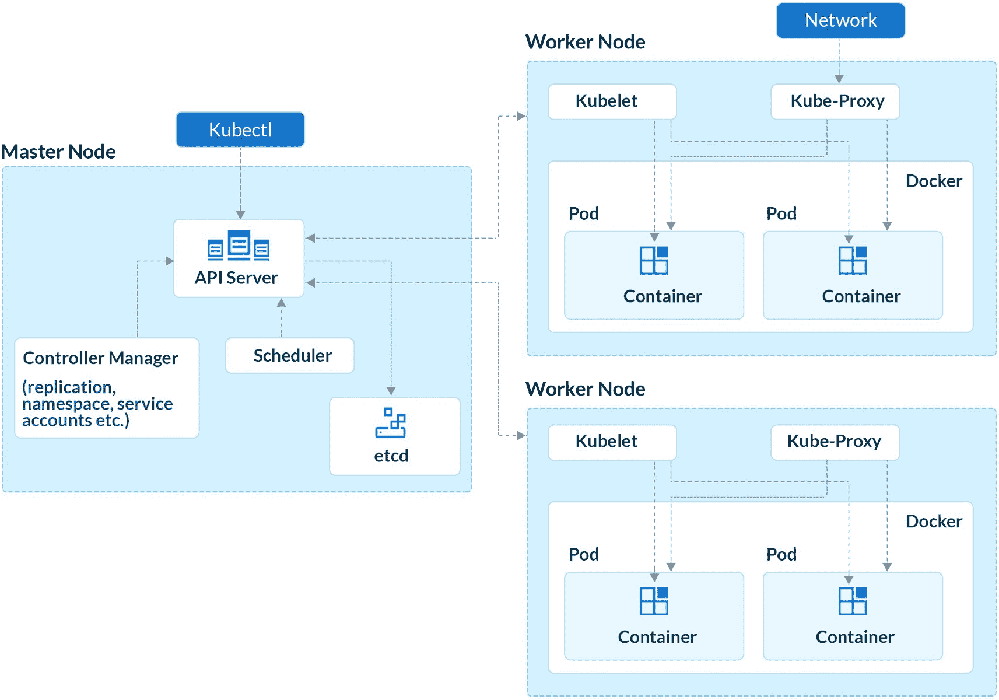

图 4-6

立方采样架构

微服务架构和基于容器的基础设施的出现为敏捷运维和 DevOps 带来了新的挑战。在前云和容器时代，基础设施开发和应用开发相互依赖。DevOps 作为一门学科出现，在应用开发和运维团队之间架起了一座桥梁。尽管 DevOps 从人员和流程的角度解决了这个问题，但技术方面仍然是一个挑战。部署到生产中的应用可能会遇到问题，因为生产部署的配置不同于开发或测试部署，或者基础架构配置中的一些小变化会导致应用可用性或性能问题。另一个挑战是，基础架构和操作系统需要不时地修补和更新。例如，对于 Microsoft Windows，需要一个月的补丁周期。当修补服务器和基础设施时，可能会导致应用出现问题，需要开发和运维团队之间进行广泛的协作和测试。这导致了部署模式的发现，主要通过自动化来支持。

## 部署模式和自动化

传统上，当应用准备好进行部署时，它被扔给应用操作和基础结构团队，以便在生产系统中进行部署。设定了专门的时间表，并且确定的团队加入了实现。随着组织迁移到云并采用基于微服务的架构，开发人员可以访问云原生工具，这使他们能够超越开发进行思考。现代工具允许开发人员使用几个描述性模板(大多数以 YAML 格式运行)来设计他们的应用部署。此外，他们还可以访问用于设置虚拟机、负载平衡器、扩展组等核心基础架构元素的模板。因此，早期只关注持续集成(CI)的开发人员使用像 Jenkins 等工具。扩展了他们的 CI 管道来执行持续交付，这包括将工件从一个环境移动到另一个环境(比如从开发环境中挑选二进制文件并将它们部署到 QA 环境中)。后来，随着 CI 和 CD 流程的成熟，这些开发人员能够自动部署应用，直到投入生产。这个过程叫做*连续交货* (CD)。在某些情况下，新的生产环境也通过自动化管道建立起来。见图 [4-7](#Fig7) 。

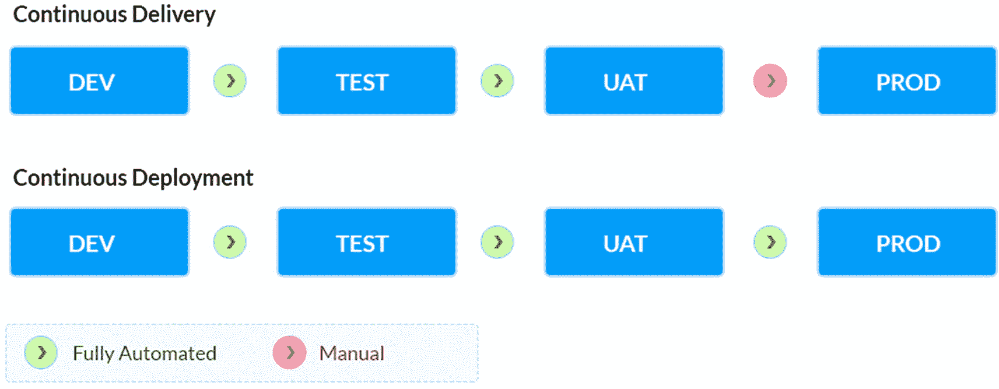

图 4-7

持续交付与持续部署

随着自动化程度越来越高，组织要求零停机或最少停机。这是通过使用 Jenkins X、Spinnaker 等工具构建的各种部署模式实现的。让我们看看一些常用的模式。

### 蓝绿色部署

这种部署策略有两个生产实例，名为蓝色的*和绿色的*彼此隔离。蓝色生产实例接收流量。每当要发布新的应用时，首先要在绿色生产实例上部署新版本并进行测试。如果这个实例通过了测试标准，那么这个绿色实例才会被提升为接收流量，并成为蓝色实例；然后较早的一个被重命名为绿色。见图 [4-8](#Fig8) 。**

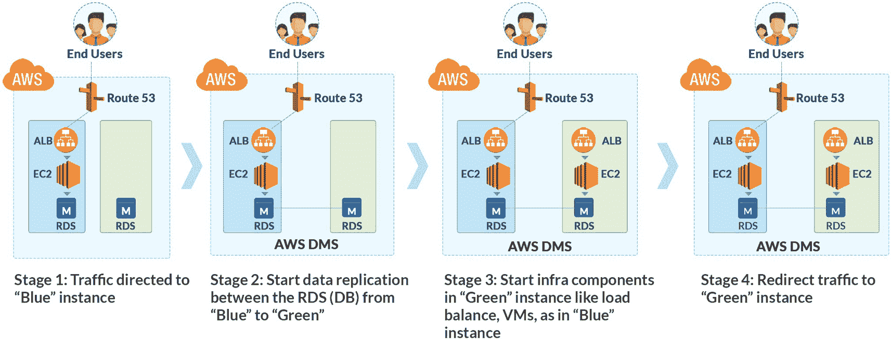

图 4-8

蓝绿部署策略

### 滚动更新

滚动更新部署策略也称为*渐变*部署策略。关键思想是通过替换旧版本推出新的应用实例。这种方法在推出新版本的同时，处理与长期运行的事务相关的问题。以分阶段的方式用较新的实例替换较旧的实例。见图 [4-9](#Fig9) 。

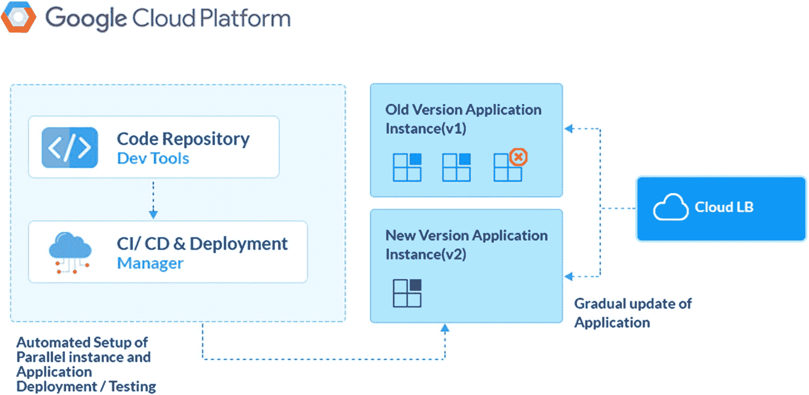

图 4-9

滚动部署策略

### 金丝雀部署

金丝雀部署策略，也称为增量部署，类似于蓝绿色部署，只是新应用版本的流量是缓慢定向的，而不是突然切换。当团队执行 A/B 测试时，这种方法非常好。参见图 [4-10](#Fig10) 。

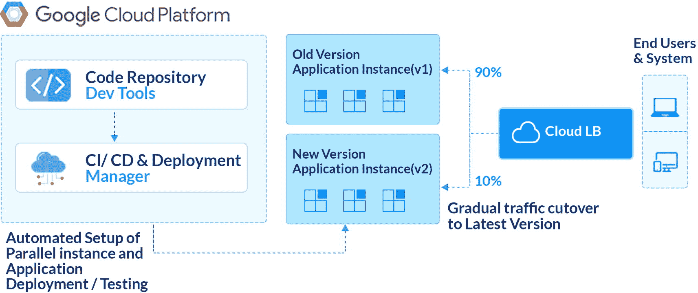

图 4-10

金丝雀部署策略

所有这些部署模式都可以通过自动化工具和可重用模板轻松实现。这些都通过自动化测试框架和测试工具得到了很好的测试。让我们通过交付渠道来了解测试应用和基础设施方面的进步。见图 [4-11](#Fig11) 。

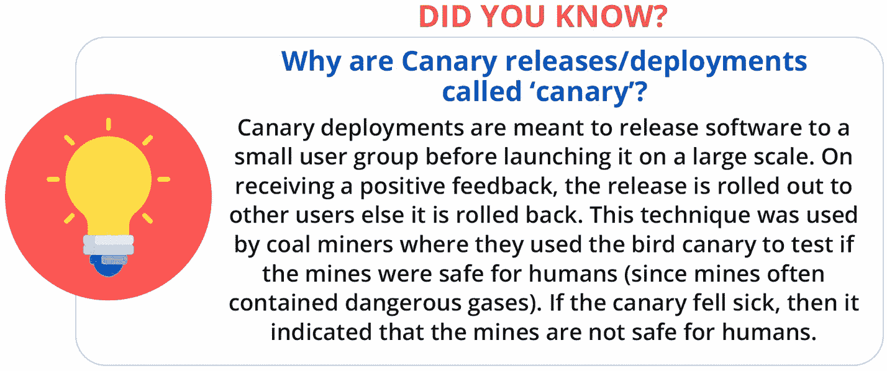

图 4-11

你知道吗？

## 左移测试

像传统的开发一样，测试通常在开发之后开始。当开发人员执行某种形式的单元测试时，QA 或测试人员执行功能和性能测试，但是使用有限的测试场景。随着对微服务需求的不断增长、支持数十种平台的需求以及快速部署应用的需求，测试必须现代化。测试必须不断实践，并在开发周期中被推到左边。产品团队的目标是主动预防错误，而不是被动地发现错误。参见图 [4-12](#Fig12) 。

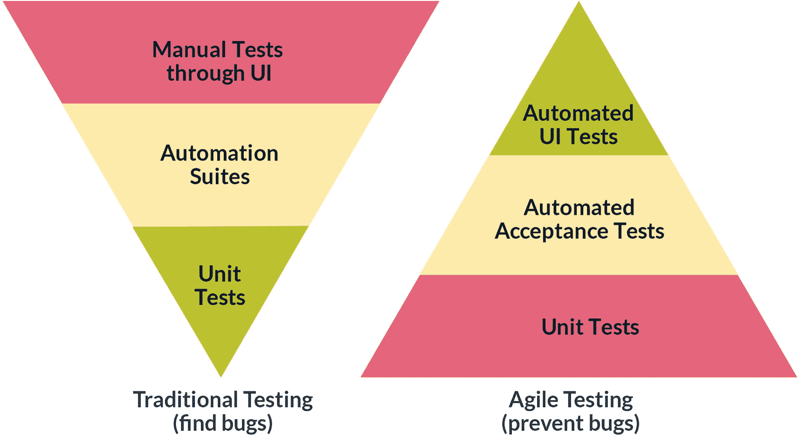

图 4-12

传统与现代测试方法

为了满足这种需求，人们发明了新的工具，更加关注交付高质量的代码。产品团队更加关注技术债务、代码和测试覆盖率。这为敏捷测试铺平了道路，并引入了各种形式的测试。测试现在不局限于 QA/测试员。相反，业务分析师、开发人员和产品团队中的每个人都有责任确保产品的高质量，没有漏洞或安全漏洞。让我们看看在产品的测试生命周期中被实践的关键测试形式。参见图 [4-13](#Fig13) 。

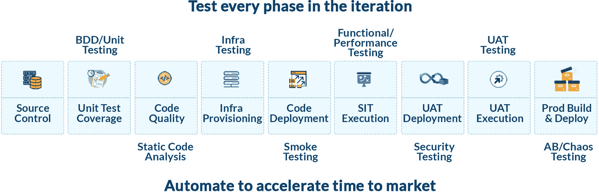

图 4-13

不同类型的测试

BDD 测试与单元测试:这是一种被称为*行为驱动开发测试*的测试策略。它是测试驱动开发(TDD)的扩展，侧重于创建或开发满足既定目标的特性。这种类型的测试通常与单元测试集成在一起。测试是以小黄瓜格式(given，when，then 格式)编写的，并且与用户故事相关联，在早期阶段编写。像 Cucumber 这样的工具支持 BDD，并使业务分析师能够编写有效的 BDD/验收测试，这些测试是可读的，并且可以很容易地根据预期的行为进行测试。见图 [4-14](#Fig14) 。

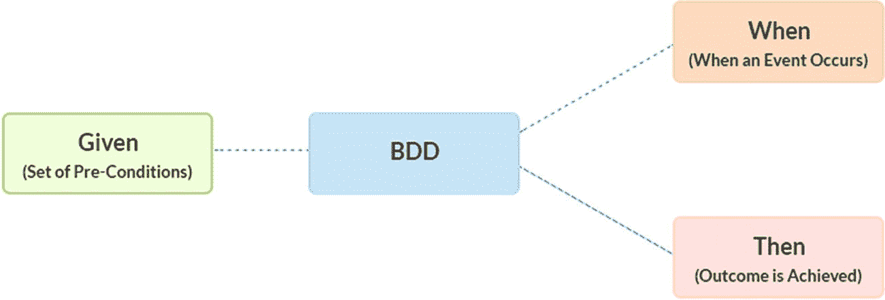

图 4-14

BDD 测试

单元测试，有时被称为*白盒测试*，是开发人员测试他们编码的每个功能的地方。一旦定义了 BDD 测试，就很容易构建单元测试。开发人员利用许多框架，如 JUnit、Nunit、PyUnit 等。，构造单元测试用例，识别需要重构的代码。

### 静态代码分析

执行这种类型的测试是为了分析根据一组预定义的规则或标准编写的代码的质量。常用的工具有 HCL AppScan，SonarQube，Coverity 等。，使开发人员能够将静态代码分析与应用构建相集成。这些工具生成反映代码复杂性、代码覆盖率、重复百分比、过于复杂的表达式和技术债务的仪表板。参见图 [4-15](#Fig15) 。

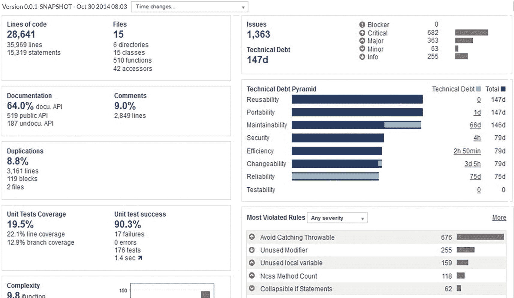

图 4-15

SonarQube 静态代码分析，仪表板视图

### 基础设施测试

基础设施测试验证应用是否能与预期的硬件和网络一起工作。目的是每当新软件准备好部署时，测试不同环境之间的基础设施。这有助于降低工作负载迁移和生产移动过程中的风险。当要执行与基础设施相关的活动(如打补丁、添加新设备等)时，也要执行此类测试。有各种各样的方法可以让产品团队执行基础设施测试，比如客户端-服务器基础设施测试、网络级测试、云测试等等。参见图 [4-16](#Fig16) 。

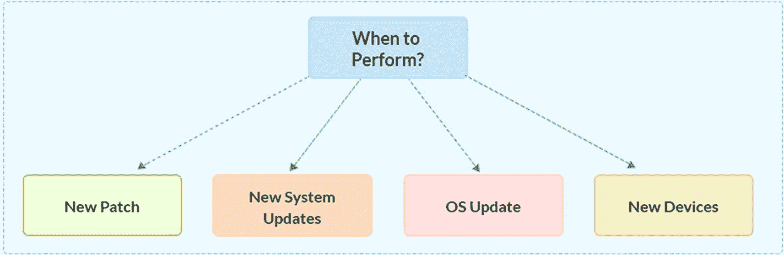

图 4-16

基础设施测试示例

### 烟雾测试

冒烟测试通常用在集成、系统和验收测试中，在这些测试中，主要产品功能被随机测试，但没有深入测试。目的是测试部署的软件是否正在运行。因此，它也被称为*信心测试*或*构建验证测试*。当应用发布到 QA/测试环境中时，QA 测试人员会执行这个测试，这个过程可以是手动的，也可以是自动的。如果这些冒烟测试通过，那么 QA 测试人员可以继续进行功能和弹性测试，如果失败，通知开发团队构建失败。见图 [4-17](#Fig17) 。

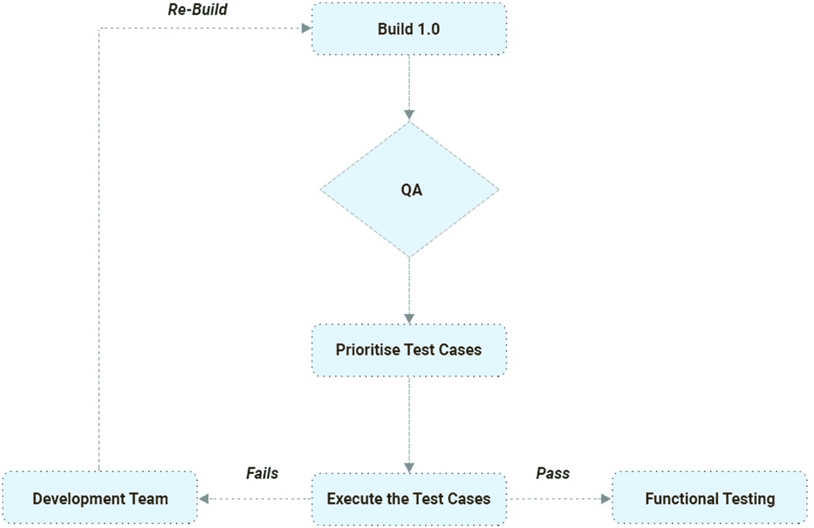

图 4-17

烟雾测试工作流程

### 功能和性能测试

这种形式的测试已经实践了很长时间，QA 测试人员根据应用的功能和性能来测试应用。这被称为*黑盒测试*。这是一种测试，QA 部门对应用是如何开发的毫无头绪。测试人员有一个测试场景和测试用例的列表，这些测试场景和测试用例可以手动或者使用自动化工具来执行，结果被指定为通过或者失败。商业工具，如 HCL 的 OneTest(功能、性能、服务虚拟化和 API 测试的集成套件)、惠普 UFT(统一功能测试)、惠普 LoadRunner，或开源工具如 Selenium、JMeter 等。，是常用的。见图 [4-18](#Fig18) 。

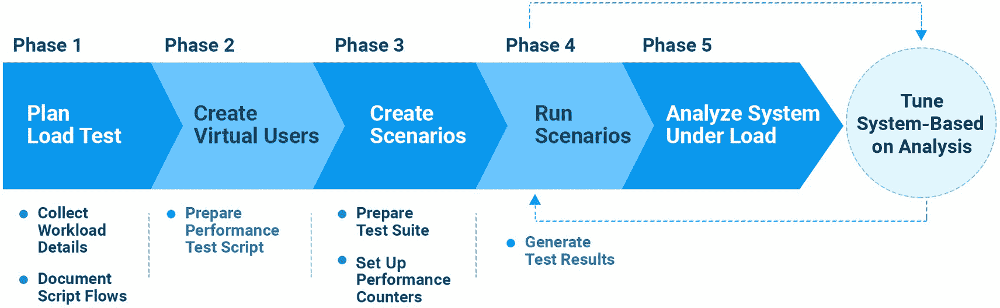

图 4-18

开发性能测试套件

### 安全测试

该测试类别揭示了系统中的漏洞，并确定系统的数据和资源是否受到保护，以防可能的破坏。它侧重于发现系统中所有可能导致信息丢失的漏洞和弱点。它还确保系统免受可能导致数据丢失的威胁或风险。随着数字化程度的提高，组织已经看到了安全威胁的增加，因此正在投资各种软件解决方案，这些解决方案可以主动扫描此类威胁，并及时向团队提供这些漏洞。有不同形式的安全测试，由不同的专家在不同的级别执行，以确保发布的产品经过良好的测试，并且当它上线时，它还会继续监控系统。Nessus、HCL AppScan、Qualys、Veracode 等工具。，是这一领域的一些常用工具。事实上，这种类型的测试是作为代码管道引入基础设施的，其中安全扫描是自动进行的，以避免手动检查。例如，映像强化流程需要合规性检查，在该流程中，组织强化包含组织合规性规则集的虚拟机映像。这样做是因为组织不允许使用直接来自互联网的 VM 镜像，以避免任何安全问题；这可以使用现有的安全工具轻松实现自动化。如果一切顺利，并且管道得到了安全团队的批准，图像将被移动到一个共享的图库，组织中的每个人都可以访问该图库。参见图 [4-19](#Fig19) 。

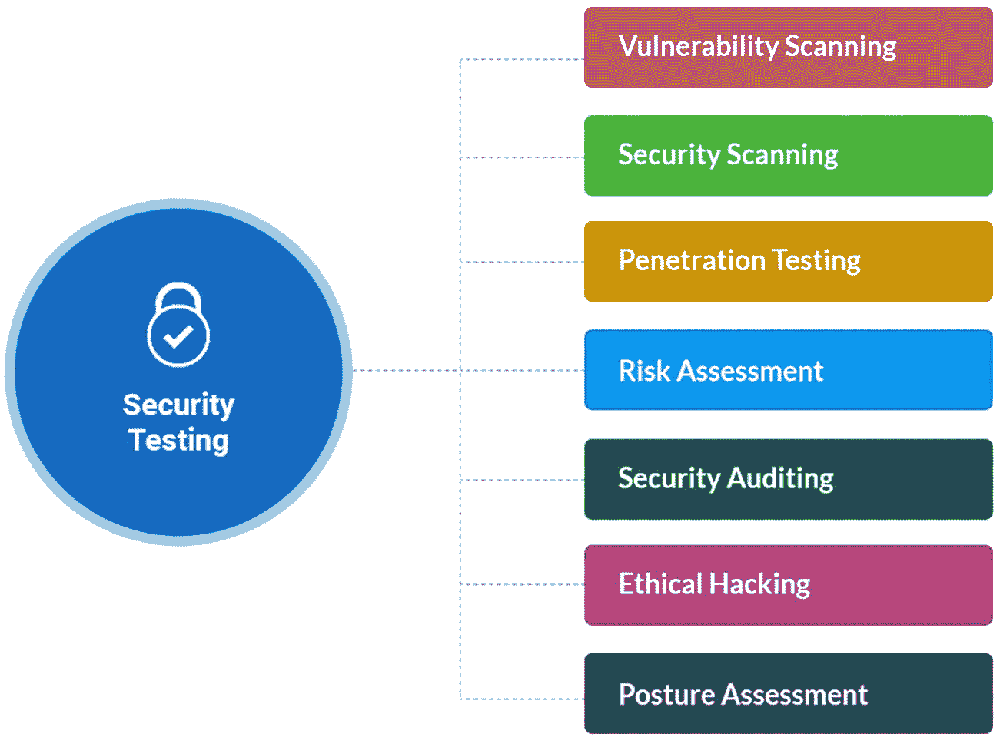

图 4-19

安全测试类型

### 用户接受度测试

用户验收测试(UAT)是由最终用户执行的另一种测试形式。这是在生产中实际启动之前完成的。实际用户可以访问新的设置，根据他们的实际情况来验证应用的功能。最终用户可以在 UAT 环境中对新的应用版本进行测试。UAT 测试人员有他们自己的一套在这个环境中执行的测试用例，并且结果被记录下来。如果用户验收测试通过，那么最终用户或客户将为生产中的实际部署提供签收；否则，会通知产品团队采取临时措施。参见图 [4-20](#Fig20) 。

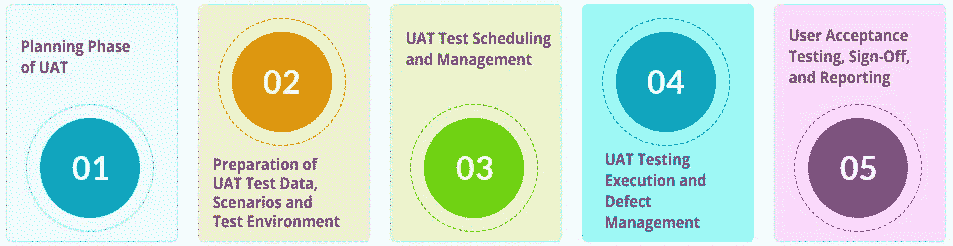

图 4-20

UAT 测试阶段

### 混沌测试

2011 年，网飞通过其名为混沌猴的测试工具，将一种新的测试形式概念化。该测试的目的是测试基础设施的弹性。这有助于团队检查他们现有的基础设施是否能够在出现任何故障时进行扩展和恢复。这一概念依赖于主动识别问题，从而避免停机。这种测试类型也被称为*混沌工程*，有许多工具可以让团队在系统中引入混沌并监控行为。这样的分析有助于团队构建更好的系统。见图 [4-21](#Fig21) 。

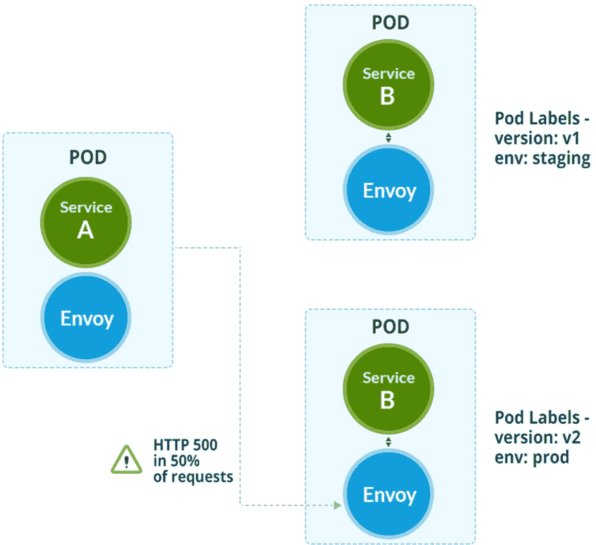

图 4-21

混沌工程/测试

### 空调测试

也被称为*桶测试*或*分割运行测试*，A/B 测试是对应用的两个变体进行的随机实验。术语 *A* 指对照或原始变体，术语 *B* 指新变体。指示积极业务影响的版本将成为真正的赢家。这使得产品团队能够优化他们的 web 应用或网站，并提高投资回报率。因此，使用统计数据，团队分析其网站的性能，并根据访问者的行为确定优化网站的方法。作为一个简单的例子，如果 50%的访问者访问了变体，并且这一个百分比比另一个变体获得了更多的销售，那么变体 A 就是赢家。参见图 [4-22](#Fig22) 。

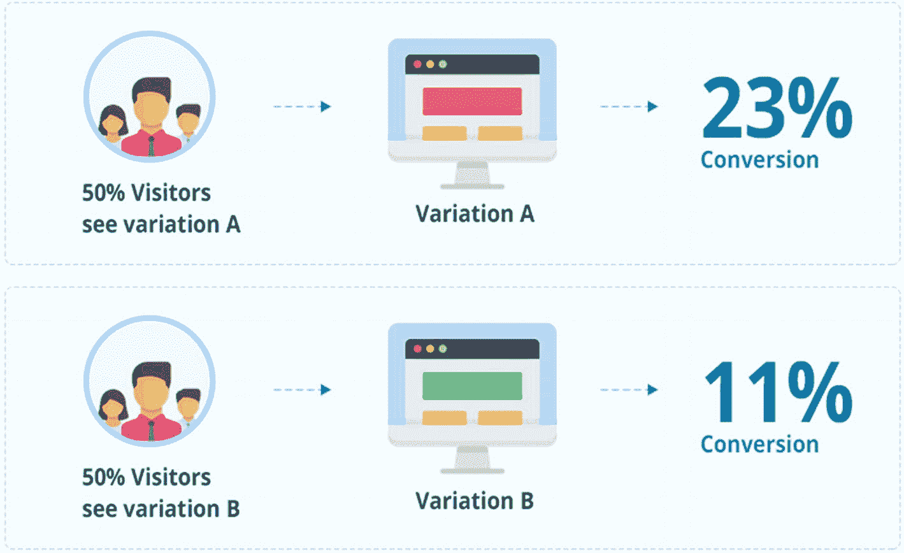

图 4-22

A/B 测试

理想情况下，产品团队应该从产品一开始就在所有级别上练习测试。有一些工具可以自动化这些测试类别，从而加速敏捷开发。即使在基础设施即代码中，团队开发脚本，利用编码指南，检查技术债务，并自动化他们遇到的任何事情，以实现更快的交付时间。

## 影响运维的架构变化

导致敏捷运维需求的另一个方面是公共架构的变化。为了处理配置变化，基础设施和平台世界已经转向幂等模型。简单来说，就是一个无论执行多少次都产生相同结果的操作。在这个模型中，像 Puppet 和 Chef 这样的工具产生在脚本中创建的配置，这些脚本应用于服务器和端点。如果在未通过配置管理工具授权或启动的单个服务器级别或端点对配置进行了任何更改，工具代理将简单地将配置恢复到基于服务器可能在架构中执行的角色分配给该服务器的期望状态。因此，web 服务器角色有一个期望的状态配置，除非通过配置管理工具为该角色修改期望的状态配置，否则它不会改变。这极大地减少了由开发和生产系统之间的错误配置或配置冲突引起的事件。这也带来了标准化，因此运维团队将知道对特定服务器的配置有什么期望。对配置的更改变得更加简单和自动化，在这种模式下，由于更改而导致的事件大幅减少。但是，仍然需要维护所需的状态配置，并根据修补、安全性和合规性需求更新服务器。

随着容器化和微服务的出现，幂等性的概念已经让位于不可变基础设施的概念。不可变的基础设施仅仅意味着不改变的基础设施，因此您不需要更新或升级容器，而是在有更新时关闭它们并启动其他容器。借助流程编排和自动化以及 DevOps 实践，您可以使用 canary 部署或 blue-green 部署进行发布，这种模式变得易于使用，并且没有管理配置的开销。容器可以在几秒钟内上下旋转，而虚拟机需要几分钟才能启动。容器是轻量级的，并且不承担整个操作系统的开销，因此能够实现不可变基础设施的思想。

虚拟机更像是宠物。容器更像牛。我们爱我们的宠物，给它们起名字，维护它们，我们和我们的宠物有长期的关系。这是虚拟机和幂等基础设施的同义词，需要维护、保持最新，并且实例保持长期有效。虽然容器更像牛，但它们是短暂的。随着容器化以及敏捷性、高可用性和可伸缩性等概念的出现，应用开发和部署模型正从“宠物”思维模式迅速转向“牛”思维模式。容器映像只是被新的更新映像所替换，而不是更新旧的映像。

对敏捷运维有影响的另一个重要方面是，基于容器的应用和架构很容易跨云环境移植，因为它们与底层基础架构组件没有关联。目前部署在 AWS 上的一个应用可以很容易地移植到 Google Cloud 或 Azure，而不需要修改。因此，应用和基础设施之间存在的配置依赖关系在这些模型中不再存在。Kubernetes 对基础设施的出色抽象意味着基础设施和开发团队可以专注于他们自己的专业领域。

因此，基础架构团队可以专注于数据中心基础架构、网络基础架构、存储基础架构、云基础架构、集群基础架构、容量管理、监控、灾难恢复和安全性等方面。应用团队可以专注于开发应用、构建用于部署和配置的容器映像等。

在新模式中，以前存在的依赖关系和流程突然消失了，应用团队必须与不同的团队协作来完成工作，并等待基础架构和正确的配置。基础设施只是为通过 YAML 脚本编排和控制的幕后应用团队而存在的。

因此，在新的模型中，应用团队和基础结构团队的角色和职责发生了变化。有人必须使用清单文件(通常是 YAML 脚本)部署应用，并管理新的工具和技术，如 Kubernetes、Terraform 等。有各种方法可以组织团队来完成这个最终目标。

成熟的组织正在向代码形式的基础设施转移，其中云和容器环境的配置被表示为脚本，整个云环境可以用软件代码来创建和销毁。基础设施领域的变化是巨大的。从使用基于 GUI 的屏幕到编写配置和自动化脚本，基础架构管理员的角色在新模型中已经完全转变。

## 摘要

虽然传统运维取得了成功，但云、微服务、CI/CD、左移测试和基础设施即代码的出现迫使组织转向敏捷运维。基础设施运维不能各自为政；它必须与新技术合作并随之改变。在开发领域运行良好的敏捷框架也正在基础设施领域得到实现。使用 ITSM 的团队正在向敏捷 ITSM 框架发展。向新模型的过渡是组织需要考虑、计划和执行的重要步骤，以便在新的运维结构中没有团队掉队。在我们了解如何开始并转向敏捷运维之前，我们应该先看看不同的敏捷框架和方法。