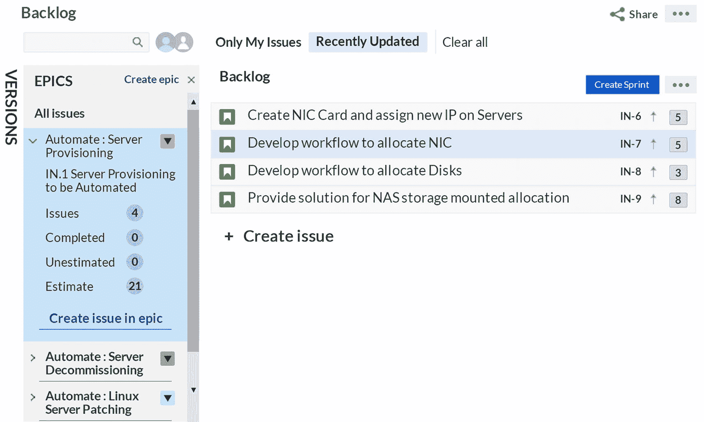
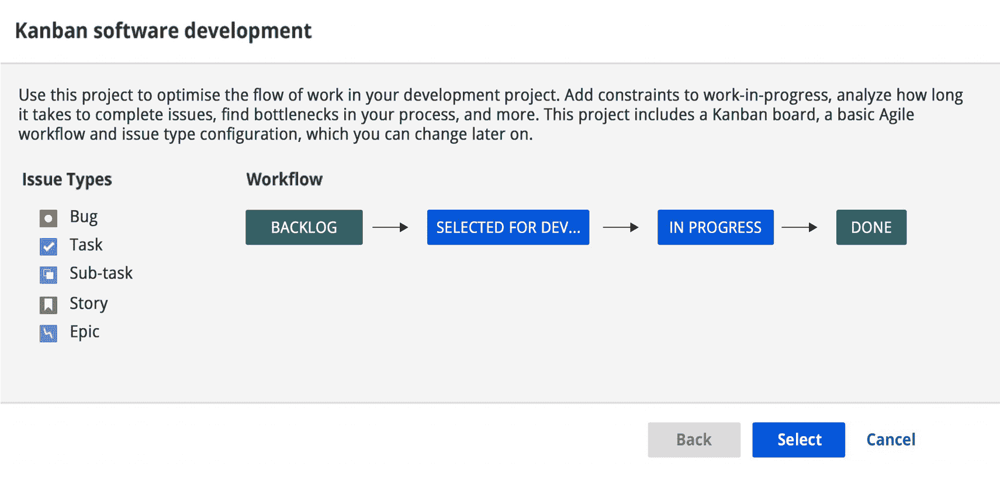
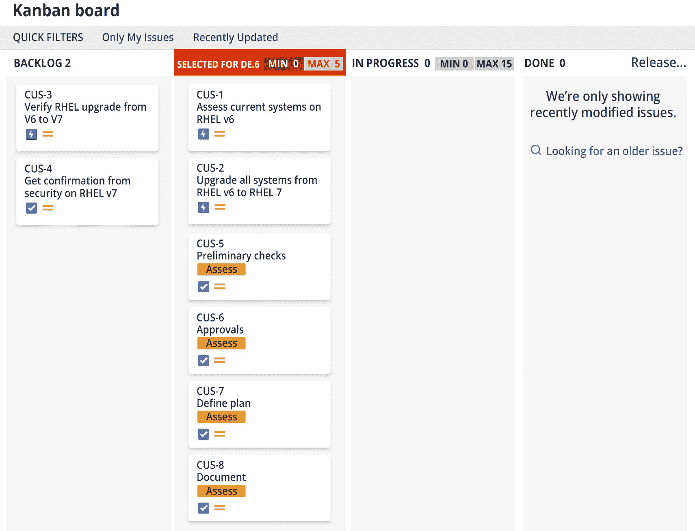

# 五、敏捷方法简介

在这一章中，我们将详细讨论广泛使用的敏捷方法，包括最佳实践、角色、工件、度量和仪式。本章将涉及的主题如下:

*   混乱

*   看板法

*   Scrumban

*   Scrum、看板和 scrumban 的比较

## 混乱

在传统的基础架构工作模式中，基础架构团队负责运维任务，这些任务都是手动的。这些任务是重复的，每次都遵循相同的解决步骤。环境建设或退役活动被认为是作为模板形式的需求而来的项目。需要与利益相关方举行多次会议，以最终确定要求。构建具备所有必需配置的服务器需要数周时间，因为需要个人的不同技能来完成任务，而且因为人们属于不同的团队，每个团队都有自己的一套优先事项，所以没有太多的协调。此外，当需要大量返工时，需求会不断变化。所有计划的活动都被认为是项目。随着客户期望的改变，需要更快的交付。

在新的工作模式中，基础设施运维团队不仅是系统和环境的管理者，还负责为开发团队引入自动化和简化流程。需求被称为*史诗*，它被进一步分解为*用户故事*和*任务*。有计划的、精简的会议和固定的交付模式。团队沟通多，联系紧密。此外，整个团队朝着一个共同的目标努力。

Scrum 是一种非常适合团队的方法，这些团队致力于“改变业务”(CTB)活动，比如基础设施作为代码。十多年来，基础设施即代码(IaC)的概念已经被大多数组织所接受，它帮助团队完成了以下工作:

*   标准化供应和退役流程

*   跟踪和控制环境构建

*   用开发管道扩展基础设施管道

*   利用安全标准

*   缩短上市时间

### 在 IT 运维中采用 Scrum

Scrum 过程的实现类似于它在开发项目中的实现方式。负责自动化的基础设施团队需要从各个角度规划其实现。一个定义良好的策略，包含了人员、过程、工具和自动化，将确保团队快速学习和扩展。见表 [5-1](#Tab1) 。

表 5-1

Scrum 的支柱

  
| 

远景

 | 

输入

 |
| --- | --- |
| **人** | 指导团队敏捷实践的需求及其使用。识别并计划团队中的新角色(Scrum 团队由产品负责人、Scrum 主管和团队组成)。 |
| **流程** | 定义工作流，以实现配置和退役流程的自动化。确定其他可以自动化的基础设施流程。 |
| **工具和自动化** | 确定团队引用故事、状态、增量和反馈时使用的工具。 |

### Scrum 入门

Scrum 方法是一个通用的框架，对于产品开发团队和运维项目来说，它可以很容易地实现，这些项目将基础设施部署为代码，或者通过 runbooks 自动化标准的操作过程。该框架已经定义了角色、仪式和责任，它们培育了团队成员之间迭代开发、信任和透明的文化。有时，基础设施团队会指定一个小团队作为 DevOps 团队，其核心目标是加强自动化，并将基础设施设置为代码，以小批量重复交付功能。团队与业务和重要的利益相关者密切合作，他们共享待办事项列表中的需求，这些需求被分配了优先级，并遵循常规的敏捷产品生命周期。见图 [5-1](#Fig1) 。

图 5-1

Scrum 模型

该框架以冲刺的方式运行，并持续交付价值。

*   *产品计划*:这是产品待办事项创建阶段。产品 backlog 是涉众共享的需求队列。在这一阶段，客户和利益相关者与产品所有者互动并分享需求。在敏捷世界中，这些是被称为*主题*或*史诗*的高层次需求。产品负责人理解这些要求，并陈述这些需求的优先级和重要性。

*   *产品待办事项整理*:冲刺计划会议是团队挑选高优先级需求、提供评估并开始冲刺的地方。产品负责人和 Scrum 团队一起评审需求，包括 Scrum master。此外，他们将高层次的需求或史诗进一步细化成更小的单元，称为*故事*。

*   Sprint backlog:Sprint backlog 是另一个需求队列，是产品 backlog 的子集。在 sprint planning 会议的最后，故事从产品 backlog 转移到 sprint backlog。团队被分配故事，并每天开会讨论进展。

*   *任务执行*:故事是必须被实现的最小单元的需求，每个故事都有一个或多个任务来陈述要完成的活动或工作。团队定期更新他们的故事。

*   *每日例会*:这是一个被称为*站立会议*的每日例会。Scrum 大师推动冲刺周期，拥抱变化，解决任何团队问题。团队每天都开会分享他们的工作状态，讨论任何风险或障碍。

*   *冲刺回顾*:这被称为冲刺演示或回顾。在 sprint 周期的末尾，向产品负责人展示工作，并且收集和跟踪所有涉众的反馈。sprint 评审会议的结果是所产生的 MVP 的“通过”或“不通过”的决定。这些 MVP 可以是操作手册、脚本、sop 等。

*   *Sprint 回顾*:这是 Sprint 周期的最后一次会议，团队再次开会研究周期流程、已完成和批准的故事、未完成的故事，或者相关涉众共享的反馈。所有学到的经验教训都可以作为下一个冲刺周期的输入。

让我们进一步详述 Scrum 模型中重要的角色、工件、会议和实践。

### Scrum 角色

要在基础设施 IT 运维领域实现 Scrum 方法，需要以下角色。

*产品负责人*:

*   创建、跟踪和管理产品 backlog 的人，包括驱动基础设施设置、基础设施迁移、云实现、云迁移、基础设施作为项目代码类型所需的工作项目

*   有权为所有客户和用户做出决策

*   保护团队免受外部影响

*   向团队展示和解释产品积压

*利益相关方*:

*   与产品负责人合作

*   通过产品负责人向团队提供意见

*   提供一个业务视图，帮助产品所有者对待办事项进行优先级排序

*Scrum 大师*:

*   负责最大化团队生产力

*   建立并促进各种迭代会议

*   保护团队免受外部影响

*   消除障碍

Scrum 团队:

*   包括开发人员和测试人员

*   负责评估和承诺工作

*   自我组织和跨职能

*   拥有运行 sprint 的完全自主权和权限

*   与产品负责人合作

一个典型的 Scrum 团队应该不超过 8 到 10 人。确定合适的团队规模以确保问责制和简单的 sprint 跟踪非常重要。

### 工作项目

一个*工作项*可以被视为一个可交付成果。不像在传统的开发中，需求被一次分析、设计、架构、开发、测试和部署，并遵循工作分解结构(WBS)，在 Scrum 世界中，工作项目被迭代地交付，并遵循图 [5-2](#Fig2) 所示的层次结构。因此，史诗是一个必须交付的大需求。这被分解为功能，然后进一步分解为称为*用户故事*的实际需求，这些需求与任务相关联。虽然史诗和功能可以分布在多个 sprint 中，但是故事和任务都与特定的 sprint 相关联。

图 5-2

样本需求细分

### 存货

所有的史诗都保存在一个 backlog 中。这些史诗和用户故事由产品所有者优先排序。有三个积压:*产品积压*、*发布积压*、*冲刺积压*。一个优先化的 epic 从产品待办事项列表中提取出来，并放入发布待办事项列表中，而发布待办事项列表又会包含特性和用户故事。sprint backlog 是最底层，是当前 sprint 的一个 backlog。

史诗和用户故事留在待办事项列表中，直到它们被优先化，并被转移到产品所有者和团队同意的发布和冲刺待办事项列表中。一旦我们将它们放入发布计划中，我们就开始估计交付时间表。故事点被分配给用户故事，这是完成故事所需工作量的度量。有很多方法可以估算故事点，比如计划扑克、t 恤尺寸等等。我们将在第 [8](08.html) 章中详细介绍这些内容。

### Scrum 冲刺

Scrum 项目的第一个开始阶段是发现阶段。在这个阶段，项目需求得到讨论，用户故事被并行编写，以获得对它们的初步确认。在发现阶段之后，冲刺开始了。

当我们谈到 sprint 时，它是一个 3-4-3 周的固定迭代，在 sprint 结束时有一个 sprint 目标要实现。你也可以把它们理解为一个迭代。在开发团队中，每个 sprint 都可以交付应用功能，如在 sprint 1 中，目标可能是推出基本的云平台功能，而在 sprint 2 中，目标可能是添加新功能，如云上的安全性和合规性。因此，随着后续的 sprints，该平台不断发展，提供了更多的特性和功能。产品所有者和与客户保持联系的利益相关者会回答哪个功能优先的问题。与开发团队将基础设施作为代码进行 sprint 交付相比，团队将在迭代/sprint 中交付基础设施设置，就像在 sprint 1 中，目标可能是在特定的云上自动提供具有最低规格的测试环境。对于 sprint 2，目标可能会扩展到在多个云上使用定制规范自动供应测试环境，等等。因此，我们的想法是交付经过良好测试和部署的工作特性。由于基础设施项目不同于应用项目，Scrum 团队的规模和 sprint 的持续时间可能与应用开发团队在 Scrum 中的组织方式不同。由于缺乏经验数据，对于组织来说，明智的做法是采纳这些建议，并根据正在实现的项目类型对它们进行调整，以适应它们的需求。一般来说，作为项目代码类型的基础设施将或多或少地与软件开发项目冲刺周期和团队规模保持一致；然而，更复杂的基础设施项目可能需要调整团队规模、技能、外部专业知识和冲刺周期。

### 短跑仪式

每次冲刺都有四个仪式。

*   第一个仪式是*冲刺* *策划会议*。这是最终确定 sprint 范围的会议。它根据团队在可用带宽的基础上可以完成的总故事点，定义了哪些故事将被选取。在会议中定义的工件是 backlog，它列出了 sprint 的用户故事。产品负责人必须与 Scrum 主管和团队一起出席。

*   第二个仪式是*每日站立会议*。这是一个每天 15 分钟的会议，整个团队参与并回答三个强有力的问题:他们昨天完成了什么？他们今天计划做什么？他们有屏蔽器吗？这有助于在团队中引入透明度，并给予所有权感和实现 sprint 目标的动力。产品负责人不需要每天都参加，但是可以在需要的时候加入。Scrum 主管和团队参与会议。

*   第三个仪式是*冲刺演示*或*冲刺回顾*。团队向产品负责人展示 sprint 产品或增量。如果团队不能更早地获得反馈，这是获得反馈的时候。

*   第四场也是最后一场仪式是*冲刺* *回顾*。这是团队反思哪些进展顺利，哪些进展不顺利，哪些可以做得更好，以及行动项目的时候。这有助于团队在接下来的冲刺中提高。

### 信息辐射器

我们在其他 SDLC 模型中跟踪和控制的方式，在敏捷中也是如此。*信息辐射器*用于跟踪发布和冲刺的状态。让我们来看看一些有用的信息辐射源:

图 5-3

Scrum 板样本模板

*   Scrum 板直观地显示与当前 sprint 周期相关的用户故事和任务的进度。它们也用于有效的沟通和协作，以及待办事项和冲刺计划。见图 [5-3](#Fig3) 。

图 5-4

燃尽图示例

*   *燃尽图*用于显示每天完成的工作与计划的工作。它传达了还有多少故事点需要完成。团队在燃尽图中跟踪故事点，以查看计划的故事是否会如期完成。它有助于调整或计划任何需要采取的行动，以满足冲刺目标。见图 [5-4](#Fig4) 。

图 5-6

Sprint 性能示例

图 5-5

燃尽图示例

*   *消耗图表*从另一个角度跟踪它，包括相对于目标已经完成了多少点。参见图 [5-5](#Fig5) 和图 [5-6](#Fig6) 。

图 5-7

Scrum 板示例

*   *仪表板*将项目的所有相关信息描述为摘要。仪表板是根据需要创建的，并提供聚合信息和深入查看功能。它们显示项目的当前进度信息。见图 [5-7](#Fig7) 。

图 5-8

速度图示例

*   一张*速度图*描绘了完成冲刺的速度。这有助于团队的容量规划。见图 [5-8](#Fig8) 。

现在，让我们从基础架构和云操作的一个简单示例开始，即创建一个基础架构作为代码项目，用于配置和停用虚拟机。

从创建史诗和用户故事开始，它们需要被添加到 JIRA 的产品清单中。见图 [5-9](#Fig9) 见图 [5-10](#Fig10) 。

图 5-10

产品积压示例

图 5-9

史诗般的例子

我们现在有了产品待定项，所以下一步是在冲刺计划会议期间定义冲刺待定项。见图 [5-11](#Fig11)

图 5-11

Sprint backlog 示例

Sprint 1 开始了，并且计划了每天的站立会议。随着 sprint 的进行，项目将从 TO DO 进展到 IN PROGRESS，再到 TESTING to DONE，这可以很容易地从为项目设置的仪表板上看到，如图 [5-12](#Fig12) 所示。

图 5-12

活动 sprint 快照

使用可以在 JIRA 创建的仪表板，可以很容易地跟踪 Sprint 的执行。您可以根据项目需要在仪表板中添加多个小工具。参见图 [5-13](#Fig13) 。

图 5-13

JIRA 仪表板示例

除了仪表板，信息辐射器燃尽图用于跟踪冲刺。

### Scrum 中的最佳实践

以下是一些最佳实践:

*   拥有一个单一的优先化的产品 backlog，团队可以从中提取史诗和用户故事。

*   创建单独的产品和冲刺积压。

*   在团队之间使用通用的协作和交流工具。应使用支持视频会议的工具在全球团队之间建立面对面的联系。

*   支持每日站立会议和频繁协作。

*   像 Scrum 板和 burndown 图表这样的信息辐射器应该被用于更好的 sprint 跟踪和控制。

*   应在每个阶段启用客户反馈循环，以实现早期反馈。

*   连续测试应嵌入到早期缺陷检测过程中，以确保产品质量。

*   运维工作的自动化和流程编排能够更快、更高质量、更频繁地迭代交付给客户。

*   实现度量和成熟度评估，以确定流程和交付的持续改进。

### Scrum 概述

敏捷 Scrum 流程可以在基础设施和云操作领域进行调整和使用，团队将基础设施设计为代码，并以冲刺的方式运行可交付成果。这种运维模式使运维团队能够在短时间内快速工作，并根据优先级进行交付。无论是需要升级其全球网络的网络团队，还是需要在所有地区分阶段执行补丁的数据库团队，Scrum 原则都可以帮助这样的团队从老式方法转换到现代方法，以快速交付。开源领域中有各种各样的工具，作为商业产品，可以用来实现 Scrum 和实践仪式，比如站立、回顾、演示等。

## 看板法

单词 *Kanban* 是一个日语单词，意思是标志板。这一概念在 20 世纪 40 年代的丰田生产公司等制造企业中得到实践，但其在软件行业的实际实现始于 21 世纪初。利用这种方法的主要原因是可视化工作项的能力，这些工作项可能是问题或变更请求等形式的。与 Scrum 相比，看板是日常运维活动的理想选择，包括事件解决、问题检测、服务请求完成等。从一开始，看板就被许多组织采用，并且随着新的实践和变化而发展，比如 Scrum ban(Scrum 和看板的混合)。

在我们开始为运维团队实际实现看板之前，让我们看看这个框架的一些关键方面。

图 5-14

看板模型

*   客户的想法被整合到团队不断搅动的队列或待办事项中。

*   该框架由三个关键角色组成，它们共同处理问题、事件、变更请求和缺陷。请求经理与客户沟通，并对待办事项进行优先级排序。

*   流程经理的工作就像一个 Scrum master，他有更大的责任去消除障碍，支持团队顺利执行和按时交付。

*   该团队是一个高度交叉技能的团队，从积压工作中提取工作并继续进行。

*   进入系统的每个工作项目都要经过不同的阶段，这些阶段在看板上被描述为泳道。

*   使用看板的主要目标是拥有由团队驱动的实时项目可见性。

*   板上的不同阶段有定义的限制，这反过来让团队看到工作负载和所需的容量。

*   看板框架适用于团队中有交叉技能专家的运维团队。

*   该框架还通过一些经常访问的度量标准来衡量团队的成功，如周期时间、等待时间、吞吐量等。参见图 [5-14](#Fig14) 。

让我们深入了解这个框架的细节。

### 看板角色

看板角色如下:

*   流程经理(在一些团队中也被称为*服务交付经理*【SDM】)是一个专注于提高工作流效率的角色。流程经理确保工作继续流动，如果遇到障碍，他们会努力消除障碍。这个角色听起来可能类似于 Scrum master，但不仅仅如此。事实上，该角色不仅要跟踪工作项目，还要为团队成员提供帮助，进行策略检查，并确保按时按质完成目标。这个角色已经存在于传统的 IT 运维环境中，所以要将这个角色升级到敏捷环境中，所需要的就是正确的指导，以最佳实践来实现看板。总而言之，流程经理的角色应该针对以下方面:
    *   跟踪系统中的工作流程

    *   消除障碍或风险

    *   促进变革并及时交付

    *   持续改进和支持团队

*   请求经理(在一些团队中也被称为*服务请求经理*【SRM】)是一个类似于 Scrum 方法中产品所有者角色的角色。这个角色管理团队内部的工作流程，并推动不同团队和利益相关者之间的讨论。该角色的主要期望是改善客户互动。
    *   对流程中的工作项目进行排序

    *   自有保单

    *   确保治理

    *   跟踪风险

*   组
    *   交叉技能成员

    *   从工作流程中提取工作

    *   每队限 15 名成员

在基础架构领域，SRM 和 SDM 的角色已经存在，但它们遵循一个严格的流程。通过一点看板指导，这些角色将变得灵活，并将采用新的工作方式。事实上，理想的情况是团队中的每个人都应该成为 SDM，因为目标是观察流入的工作，拾起工作，并确保它被快速解决。这是团队变得自我驱动和自我组织而不需要治理和流程管理的最终状态。

### 看板仪式

类似于 Scrum 方法，看板团队也实践一些仪式，帮助他们理解计划，查看他们的进度，减轻风险，并根据需要对故事进行优先级排序。见表 [5-2](#Tab2) 。

表 5-2

看板仪式

   
| 

仪式

 | 

频率

 | 

目的

 |
| --- | --- | --- |
| **迭代规划** | 每月(2 至 3 小时) | 审查产能、吞吐量、交付周期 |
| **故事优先级** | 每周(1 至 2 小时) | 根据客户需求，重新检查待办事项并确定优先级 |
| **每日站立** | 每日(15 分钟) | 团队就当天的风险和计划进行沟通 |

除了这些仪式之外，以代码形式构建基础设施的团队还有一个向涉众展示他们的 MVP 的仪式。如果项目涉众批准了演示，那么目录项将被转移到生产环境中。

### 看板板

看板团队通过看板可视化其工作。这些委员会帮助团队查看他们流程中流动的工作，并决定适当的行动。这些板就像带有定义的列的表格，其中每一列代表一种状态，如待办事项、进行中、部署等。棋盘上代表的每个州被称为*泳道*，它也可能有明确的限制。例如，在任何给定时间，处于部署状态的问题不能超过四个。这就是所谓的**。这些看板是一个极好的媒介，不仅可以显示项目状态，还可以限制并确保团队在特定时间框架内交付任务/问题数量的能力。图 [5-15](#Fig15) 是一个代表管理操作系统的典型基础设施运维团队的示例。每个泳道都有一个名字，并显示其下的问题。虽然这些板可以手动绘制，但像 JIRA 这样的工具可以帮助团队更好地可视化这些板。由于团队可以查看董事会，他们被鼓励将工作从一个状态转移到另一个状态。参见图 [5-15](#Fig15) 。**

 **

图 5-15

看板样本

因此，看板方法基于三个关键原则:可视化工作、限制工作和与自我维持的团队一起迭代工作以改进。

### 看板指标

请参考表 [5-3](#Tab3) 和图 [5-16](#Fig16) 中常用的看板指标。

图 5-16

看板中的提前期与周期时间

表 5-3

看板指标

  
| 

公制的

 | 

描述

 |
| --- | --- |
| **周期时间** | 客户提交请求直到问题得到解决的时间 |
| **交付时间** | 从基础架构 IT 团队开始处理该问题到问题解决所花费的实际时间 |
| **吞吐量** | 单位时间内完成的工作项目数 |

### 看板入门

有各种工具可以让团队实践看板。亚特兰蒂斯 JIRA 就是这样一个常用的工具，它为实现看板方法提供了模板。该工具可以作为内部解决方案安装和使用，也可以通过云产品使用。

该工具有用户友好的模板来练习看板。在 JIRA 创建的每个项目都有以下规格:

*   工作流程

*   名字

*   唯一密钥/标识符

每次在 JIRA 创建一个新项目时，它都会提示输入项目模板、要实现的工作流以及项目名称，该项目名称包含一个用于标识票据的关键字。参见图 [5-17](#Fig17) 。

图 5-17

在 JIRA 创建看板项目

每个项目模板都与定义票据旅程的工作流相关联。作为初学者，团队可以利用现有的工作流，如图 [5-18](#Fig18) 所示，或者创建一个定制的工作流来满足他们的项目需求。

图 5-18

JIRA 的看板工作流

显示的工作流程描述了如何将票证放入待办事项列表中，然后由团队成员将其转移到不同的状态。工作流中提到的状态被选择为开发、进行中和完成。这些状态是可定制的，可以针对不同的问题类型进行设置，比如本例中的 Bug、task、子 Task、Story 和 Epic。

一旦选择了工作流，下一步就是为项目指定一个名称和标识符。例如，如果项目名称是 Custom-Kanban-Project，那么工具会自动生成一个三个字母缩写的标识符。该标识符是为每个问题类型标记的内容。例如，现在在这个项目中编写的故事将会在故事编号后面附加一个关键字。如果使用 OPS 这样的值进行修改，那么故事编号将生成为 OPS-1、OPS-2 等。参见图 [5-19](#Fig19) 。

图 5-19

在 JIRA 命名看板项目

看板项目的创建经过深思熟虑是很重要的。如果需要定制状态、问题类型、标识符等。，那么这应该在项目的看板实践设置期间完成。

一旦建立了项目，下一个重要的事情就是建立 WIP 限制。WIP 限制被定义为团队在任何给定时间点处理最小和最大数量任务的能力。这有助于团队避免在一个故事或一个问题的生命周期中的所有阶段过载。根据你当前的团队规模、技能和工作时间，定义每个泳道的最大限制。让我们研究一下如何计算在制品限额的过程。

**定义在制品限制的步骤**

让我们假设我们已经在看板上创建了四条泳道，分别命名为开发、评审、测试和部署。我们将为这四个阶段中的每一个阶段设置 WIP，这意味着找到在每个阶段可以管理的问题或票据的最大数量。在我们开始计算 WIP 的流程之前，首先让我们将每个阶段分为两个部分，分别描述增值(VA)活动和非增值(NVA)活动。

VA 活动表示实际完成的工作，NVA 活动表示工作执行过程中发生的等待或延迟时间。例如，让我们将开发阶段划分为一个名为“准备开发”的 NVA 和一个名为“开发中”的虚拟设备活动“准备开发”状态表示在实际开发开始之前要完成的一系列先决条件，而“开发中”状态指的是实际的开发状态。因此，生命周期中的每个阶段都有 VAs 和 nva，这种划分将帮助我们估计正确的 WIP。如表 [5-4](#Tab4) 所示划分其他阶段。

表 5-4

看板阶段的活动分类

        
| 

发展

 | 

回顾

 | 

测试

 | 

部署

 |
| --- | --- | --- | --- |
| 准备开发 | **开发中** | 准备接受审查 | **复习阶段** | 准备测试 | **在测试中** | 准备部署 | **部署阶段** |
| **VA 活动** |
| NVA 活动 |

有了这个更新的看板，我们现在将继续估算所有 VA 状态的 WIP。计算看板在制品的公式如下:

 
| **在制品=任务总数*时间%** |
| *先决条件 1 是任务总数=团队规模/效率= >是指可以留在板上的最大票数。这个公式需要团队规模(在我们的例子中，我们认为是五个)和效率因子(需要计算，描述为先决条件 1)。* |
| *先决条件 2 是时间% =[VA/VAs 总和] * 100 = >指花费在 VAs 上的时间百分比。为了计算这个值，我们需要找出所有状态的 VA 值(如先决条件 2 所述)。* |

**先决条件 1:总任务(计算步骤)**

**步骤 1.1** 计算总效率系数。

有了 VAs 和 nva，我们将计算一名工程师可以同时处理的任务数量。为了计算该值，我们需要首先找出所有四个阶段的虚拟装配和 NVA 活动所花费的时间，然后估计效率值，该值使用以下公式计算:

**效率= VA 时间/ (VA 时间+ NVA 时间)**

效率值由 VA 和 NVA 时间值组成。让我们将这个公式进一步分解，并对我们的示例板进行同样的计算。

*找出 VA 和 NVA 值*:与团队讨论在所有八条泳道上花费的平均努力。例如，团队确认“准备开发”泳道中的门票需要一天，但一旦进入“开发中”阶段，则需要三天。记录所有其他阶段的工作；表 [5-5](#Tab5) 显示了所有阶段的估算工作量。

表 5-5

看板阶段的虚拟装配和 NVA 活动工作

        
| 

发展

 | 

回顾

 | 

测试

 | 

部署

 |
| --- | --- | --- | --- |
| 准备开发 | **开发中** | 准备接受审查 | **复习阶段** | 准备测试 | **在测试中** | 准备部署 | **部署阶段** |
| 1 天 | **3 天** | 0.5 天 | **0.5 天** | 0.5 天 | **1 天** | 0.5 天 | **0.5 天** |
| **VA 活动** |
| NVA 活动 |

将所有增值服务和增值服务的总工作量总结如下:

*   所有阶段的虚拟装配活动花费的时间= 3 + 0.5 + 1 + 0.5 = 5 天

*   所有阶段的 NVA 活动花费的时间= 1 + 0.5 + 0.5 + 1 = 3 天

现在，我们将找出效率值，如下所示:

*   **效率**= VA/(VA+NVA)=>5/(5+3)=>0.62

*   **效率%** = .62 * 100 = > 62%

该值表示工程师在电路板上可以同时完成的任务数量。效率为 100%的板表示没有等待时间，工程师一次只关注一个问题(理想情况)。

**步骤 1.2** 计算总任务。

现在，我们知道了团队规模值，也找到了效率值。我们现在将计算总任务价值(WIP 公式的第一部分)。计算方法如下:

*   **总任务=团队规模/效率**

*   **总任务** = 5 / .62 = ~8 任务。

这意味着我们的看板在任何给定的时间都可以有大约八个任务，这些任务可以分布在不同的泳道或阶段。

**先决条件 2 -** **时间%(计算)**

**步骤 2.1** 估计所有虚拟增值的时间百分比。

要计算每个阶段所有虚拟设备活动的时间百分比，我们需要使用以下公式:

**时间% =[VA/VAs 总和] * 100**

我们将对表 [5-6](#Tab6) 中所示的所有增值业务估算该值。

表 5-6

看板阶段中虚拟装配活动的时间百分比计算

        
| 

发展

 | 

回顾

 | 

测试

 | 

部署

 |
| --- | --- | --- | --- |
| 准备开发 | **开发中** | 准备接受审查 | **复习阶段** | 准备测试 | **在测试中** | 准备部署 | **部署阶段** |
| 1 天 | **3 天** | 0.5 天 | **0.5 天** | 0.5 天 | **1 天** | 0.5 天 | **0.5 天** |
|   | **时间%****= 3 / 5****=60%** |   | **时间%****=0.5/5****=10%** |   | **时间%****=1 / 5****=20%** |   | **时间%****=0.5 / 5****=10%** |
| **VA 活动** |
| NVA 活动 |

基于我们的假设,“开发中”状态的 VA 值为三天。我们将它从总的 VA 值中分离出来，VA 值是 5，结果是 60%。这表明在生命周期的这一状态下，需要或将要花费总时间的 60%。类似地，我们也这样做，您将看到审查阶段的值为 10 %,测试中状态的值为 20 %,最后部署阶段的值为 10%。将所有这些值相加，总和应该是 100%。

**计算在制品**

最后，我们根据以下公式中的导出值(来自前提条件步骤 1 和 2)计算每个 VA 列的 WIP 限制:

**在制品=任务总数*时间%**

参见表 [5-7](#Tab7) 。

表 5-7

看板阶段 VA 活动的 WIP 计算

        
| 

发展

 | 

回顾

 | 

测试

 | 

部署

 |
| --- | --- | --- | --- |
| 准备开发 | **开发中** | 准备接受审查 | **复习阶段** | 准备测试 | **在测试中** | 准备部署 | **部署阶段** |
| 1 天 | **3 天** | 0.5 天 | **0.5 天** | 0.5 天 | **1 天** | 0.5 天 | **0.5 天** |
|   | **时间%****= 3 / 5****=60%****总任务数****=8**WIP**= .6 * 8****~4 个任务/票** |   | **时间%****=0.5/5****=10%****总任务数****=8**WIP**= .1 * 8****1 任务/工单** |   | **时间%****=1 / 5****=20%****总任务数****=8**WIP**= .2 * 8****~2 个任务/票** |   | **时间%****=0.5 / 5****=10%****总任务数****=8**WIP**= .1 * 8****1 任务/工单** |
| **VA 活动** |
| NVA 活动 |

如果将所有 WIP 值相加，结果是 8，这证实了我们的计算(按照先决条件步骤 1 中定义的流程)。此外，看一看棋盘，生命周期中的哪些状态需要更多关注就变得很清楚了。让我们总结一下五名工程师组成的团队在看板模式下工作的例子:

*   看板板上的每一个问题或一个标签都将经历四个关键阶段:开发、审查、测试和部署。

*   每个阶段都会有一些空闲时间，工程师会在实际工作开始前等待或准备。

*   因此，每个阶段将有两个组成部分:VA 和 NVA。与团队讨论并记录在每个虚拟价值评估和虚拟价值评估上花费的精力。

*   我们计算四个阶段中每个阶段的所有虚拟装配的在制品限制，这些限制取决于找到的时间百分比和任务总数的值(在制品=任务总数*时间%)。

*   任务总数的计算方法是:任务总数=团队规模/效率。

*   效率计算为 VA / (VA + NVA)。

*   时间百分比的计算方法为[视觉效果/视觉效果总和] * 100。

*   对于我们的例子，开发中的最大限制是四个任务或标签，而评审可以有一个标签，测试可以有最多两个标签，而部署可以只有一个标签。但是，一个由五名工程师组成的团队最多只能处理八张罚单。

作为初学者，从基本的价值观入手，做假设是可以的；随着你的成熟，这些价值观汇聚成最适合你的工作和团队规模的效率水平。参见图 [5-20](#Fig20)

图 5-20

你知道吗？

像 JIRA 这样的工具允许销售线索为所有泳道设置 WIP 限制。见图 [5-21](#Fig21)

图 5-21

在 JIRA 配置 WIP 限制

让我们再举一个例子，看看 WIP 限制是如何在 JIRA 这样的工具中反映出来的，以及如果有更多的任务分配给 VA 列并且它们超过了 WIP 限制会发生什么。为开发选择的工作流状态队列中的工作项不会超过五个。对于“进行中”状态也是如此；设置的最大限制是 15。现在，如果发行数量超过定义的最大限制，该泳道将以红色突出显示。例如，假设我们有一项任务，要将 RHEL 系统升级到更高版本。为了执行这个项目活动，我们将创建几个进一步划分为任务的史诗。无论何时创建问题，它们都被放在 backlog 中。团队成员或领导根据他们的带宽和这些问题的紧急程度在泳道之间移动这些问题。图 [5-22](#Fig22) 是所述示例的快速说明。

图 5-22

查看 JIRA 的 WIP 限制

“开发精选”泳道最多有五期，当你从 backlog 中拖出一期时，它会变成红色。这提醒用户不能放置更多的工作项目。这是审查团队能力的一个很好的方法，它带来了透明度，并有助于跟踪和区分工作的优先级。见图 [5-23](#Fig23)

图 5-23

在 JIRA 查看具有 WIP 限制的看板板

通过定义这些 WIP 限制，团队可以专注于需要注意的事情，并防止任务在任何阶段累积。它也让团队知道他们的能力。这种工作模式也凸显了效率低下和瓶颈。这些值应该经常被重新访问，以查看它们是否需要更新。

开始时，运维团队可能在各个领域(如窗口、数据库、备份)都有单独的积压工作，慢慢地，随着团队的成熟和习惯这些实践，积压工作和团队可以合并在一起(一个共同的积压)，从而形成跨职能团队。随着团队规模的扩大，他们也应该自己进行回顾，并更新他们的工作方式，以防事情没有按计划运行。

虽然门票涌入积压，并获得成员，这也是很好的创建水平车道，以区分简单事件和加急事件。这可以通过配置电路板在工具中进行设置。例如，您需要设置两条通道:一条处理简单事件，另一条需要立即处理(优先级最高的票据)。点击配置板选项查看泳道，如图 [5-24](#Fig24) 所示。

图 5-24

在 jira 中配置看板

查看可配置工作流和相关状态的页面后，选择更新泳道的选项，并提及泳道和区分泳道的标准。见图 [5-25](#Fig25)

图 5-25

定义 JIRA 的水平泳道

默认情况下，JIRA 看板项目提供了快速通道；您可以自定义或重命名它，或根据需要创建更多的泳道。在前面的示例中，我们提到了快速通道将有优先级值为“最高”的事件，其余的票据将在另一个通道中。创建票证时，该工具将根据其优先级，隔离票证显示，以便团队即时查看状态。见图 [5-26](#Fig26)

图 5-26

看板状态

Note

当团队熟悉了工作流、通道和票证类型的基本概念，并且能够实践“拉动”工作而不是将工作推给他们的文化时，他们就可以成功地采用看板。看板是团队工作量的动态可视化，帮助团队以有效的方式计划和工作。

### 看板的最佳实践

**尽早识别工作流程状态**

对于刚刚开始使用看板的基础设施 IT 运维团队来说，他们可以从三种工作流状态开始:待办事项、工作进行中和完成。如果他们计划构建和部署新的基础设施组件，或者说，进行修补活动，那么他们可以将生命周期阶段定义为排队、设计、编码、测试和完成。有些团队还具有附加的工作流状态，这些工作流状态提到了批准状态或等待时间。建议团队仔细考虑工作流状态，然后实现。见图 [5-27](#Fig27)

图 5-27

看板工作流状态

**确定 WIP 限制**

看板的概念是关于扩大团队的可见性和分析产能时间。找到所有工作流状态的 WIP 限制将有利于团队，并有助于在需要时计划增加产能。有两种方法可以定义 WIP 限制。见表 [5-8](#Tab8) 和表 [5-9](#Tab9) 。

表 5-9

方法 2:为整个工作流而不是每个工作流状态定义 WIP 限制

     
|   | 

WIP 限制=6

 |   |
| --- | --- | --- |
| **未启动** | **设计** | **编码** | **测试** | **完成** |

表 5-8

方法 1:为每个工作流状态定义 WIP

     
|   | 

WIP 限制=2

设计师人数=2

 | 

WIP 限制=3

程序员人数= 3

 | 

WIP 限制=1

测试人员数量=1

 |   |
| --- | --- | --- | --- | --- |
| **未启动** | **设计** | **编码** | **测试** | **完成** |

**其他最佳实践**

*   WIP 工作限制需要被配置以适应项目的当前需求，并且这应该被监控和更新。

*   提前期和周期时间受项目开始时所做承诺的影响。因此，跟踪这些指标并采取必要的措施来改进它们是很重要的。

*   每天监控瓶颈并积极应对。当注意到引人注目的问题时，鼓励团队成员大胆发言。

*   建立一个与团队共享并与产品团队协调的发布计划。例如，发布补丁可以与应用部署合并。

### 看板总结

看板模型非常适合基础设施运维团队，他们刚刚开始使用敏捷，并希望转换到新的运维模型。看板不是以传统的方式运行操作，而是为团队提供了更广泛的可见性和责任，其中工作是由他们拉动而不是推动的。这种工作模式建立了信任和透明的文化。此外，该模型通过定义 IT 运维关键阶段的在制品限制，使基础架构运维团队能够主动分析容量。像 Atlassian JIRA 这样的工具为团队开始使用提供了内置模板。通过正确的指导和向敏捷工具的过渡，基础设施运维团队将随着时间的推移提高他们的生产力。

## Scrumban

Scrum 和看板是为不同的团队类别设计的两种广泛实践的敏捷方法。如果开发团队宣扬 Scrum，那么看板就是基础设施运维团队的理想选择。这两种方法对团队都有好处。但是随着时间的推移和对 DevOps 需求的出现，IT 组织开始寻找一种混合方法，这种方法可以结合两种方法的优点。这成为一个突出的问题，因为开发团队开始与基础设施运维团队密切合作，一些团队开始组建 DevOps 团队。这导致了一种叫做 scrumban 的新的混合敏捷方法的设计，它是由 Corey Ladas(精益看板实践者)创造的。这种方法提供了 Scrum 的可预测性和看板的灵活性。它非常适合开发人员和维护团队或大型项目。参见图 [5-28](#Fig28) 。

图 5-28

Scrum +看板

Scrumban 是一种混合方法，以连续的方式交付，并随时接受变更。它像看板方法一样灵活，但也包含了 Scrum 的最佳实践。这种方法引入了一个叫做*桶计划*的新概念，其中团队计划活动并将它们放入桶中。

*   *一年目标*:长期愿景目标

*   *六个月时段*:已批准的计划

*   *三个月时段*:准备执行的计划

*   *当前时段*:行动中的实际计划，正在执行任务的团队

这种方法适合于不希望只关注当前工作负载和性能，但也希望有明确目标的团队。例如，一个实践 Scrumban 的基础设施团队可以有长期目标，比如在一年内采用 AIOps，在六个月/三个月内进行工具投资和实现，在当前阶段进行实际的操作任务和基础设施管道工作。这种方法带来了透明性，因为团队可以与路线图保持一致。对于优先级变化非常频繁的团队来说，这是一种理想的敏捷方法。让我们更深入地研究这个方法，理解它的关键结构。参见图 [5-29](#Fig29) 。

图 5-29

存货

### Scrumban 角色

实现 scrumban 时没有定义角色。无论存在什么角色，都可以考虑和升级以满足期望。团队中的每个成员都对这些故事负责，这也是在制品限制有所帮助的地方。像 Scrum master、产品所有者、专家和 Scrum 团队这样的现有角色都可以继续在这种模式下运作。唯一的先决条件是团队应该能够有效地使用这种方法。

### Scrumban 仪式

练习 scrumban 时推荐的基本仪式是每日站立。每天进行站立会议，以跟踪进度，并就当前阶段确定的任何风险进行集体讨论。团队参考 scrumban 板来跟踪 WIP 限制，并且他们的 backlog 通过去除坚持产品 backlog 中存在的刚性约束而被及时驱动。只有当团队觉得有必要时，才计划召开额外的会议，如计划会议或回顾会议。

### Scrumban 入门

很明显，scrumban 关注目标、工作可见性和过程改进，当然，它成功的关键基础是“团队”还观察到一些组织以最适合他们团队的方式定制 scrumban。像 Atlassian JIRA 这样的敏捷管理工具为 Scrum 和看板提供了模板，但是在工具中没有为 scrumban 明确定义任何东西。团队利用看板或 Scrum 作为基础模板，然后定制模板来解决 scrumban 的工作方法。一些新的工具最近变得可用，如 Method Grid。com ，ClickUp，看板工具，Favro 等。，它提供了 scrumban 模板以及 Scrum 和看板模板。大部分都是基于云的应用。因此，如果团队有 JIRA 的许可证，那么他们可以利用它们来练习 scrumban 否则，他们可以选择可用的新工具。

需要记住的一件重要事情是，在 scrumban 上支持团队的关键需求是“董事会”这个 Scrumban 板将成为团队查看任务、标记任务、监控整体项目状态以及查看未来的可见性工具。见图 [5-30](#Fig30)

图 5-30

样本 Scrumban 板，基于团队的视图

假设你已经选择好了工具，下面是练习 Scrumban 的推荐步骤。

**设计** **一个 Scrumban 板**

白板是 Scrumban 中最重要的方面，它反映了团队的进步。这就像显示故事和任务在状态之间流动的看板(喜欢做，进行中，完成)。一些团队定义了类似于 Scrum 方法中定义的转换状态的状态或阶段(如待办事项、设计、开发、验证、部署)。

此板应显示当前的存储桶项目，这些项目可进一步划分为反映一般操作任务和新基础架构请求的部分。

图 [5-31](#Fig31) 中的董事会示例显示了两个团队的活动，一个团队像往常一样执行常规业务活动，另一个团队解决业务需求变更的自动化问题，如设置新的基础设施或淘汰陈旧的环境。第三部分强调了需要讨论和计划的特殊查询和请求。

图 5-31

scrumban 板的另一个例子，current bucket

**定义在制品限制**

在制品限制遵循看板中实践的相同模式。这些应该在板上定义，并且应该根据团队的表现定期重新检查。这些限制使得团队能够基于他们的可用容量来实现“拉”机制。对于图 [5-32](#Fig32) 中的电路板，为每种状态定义了限制。

图 5-32

scrumban 板上的 WIP 限制

**安排会议**

像每天的讨论一样，计划每天与团队的会面。这种交流方式应该是有重点的，每天都有明确的议程。团队通过分享他们的工作量和需要注意的风险进行互动。除了这些日常会议之外，团队还可以召开 sprint 会议来讨论新的需求并对它们进行优先级排序。这不需要每两周一次。规划活动将在需要时触发，这也可以显示在板上。例如，在图 [5-33](#Fig33) 的板中，如果第一个状态的 WIP 限制超过 4，则表明需要召开计划会议。

图 5-33

有限制的 Scrumban 板

### Scrumban 的最佳实践

以下是 scrumban 的最佳实践:

图 5-34

你知道吗？

*   定义和确定在制品限额，以限制积压。这将有助于团队保持专注，避免错过任何截止日期。

*   董事会应该易于理解并保持相关性。避免有多个泳道或过渡状态。

*   避免一心多用，专注于完成正在进行的工作，而不是开始一项新的工作。识别任何计划外的任务和风险，并传达它们以满足截止日期。见图 [5-34](#Fig34) 。

### Scrumban 总结

热衷于采用 Scrumban 的团队应该根据以下关键因素来评估需求:

*   他们在团队中尝试了 Scrum，但是由于故事的频繁变化，并不成功。

*   优先事项不断变化，难以按计划交付。

*   团队需要跟踪增强以及一般的产品操作支持。

*   非常需要让团队对他们的交付负责，并培养敏捷的思维方式。

*   该团队正在寻找一种灵活的工作负载运维模式。重点是拉工作不推工作。

因此，这种方法对于那些在敏捷中挣扎，但是不能遵循原则并且需要一定程度的灵活性的项目来说是很好的。随着团队的发展,“拉动”工作的文化也是一个重要的实践。通过不断的实践，这样的团队变得自给自足，因为他们学会了管理和优先化工作的艺术。

## 摘要

让我们看看 Scrum、看板和 scrumban 之间的主要区别。参见表 [5-10](#Tab10) 。

表 5-10

敏捷方法的比较

    
| 

描述

 | 

混乱

 | 

看板法

 | 

Scrumban

 |
| --- | --- | --- | --- |
| **定义** | 一种 IT 项目的敏捷方法，专注于在频繁的时间间隔内交付成果 | 一种用于 IT 项目的敏捷方法，通过限制正在进行的工作来关注可视化工作 | 利用 Scrum 和看板的最佳实践的敏捷方法 |
| **核心目标** | 跨职能团队频繁交付(基于 sprint)规定性 | SRE 团队频繁变化流程改进 | 以小间隔交付工作，并限制工作进度建立专业团队 |
| **关键角色** | Scrum master 产品所有者团队 | 没有预定义的角色，但是项目经理将连接团队成员。 | Scrum 团队+其他需要的角色，如果需要的话 |
| **基本构造** | Scrum 团队短跑板积压 | 看板团队看板板 | scrum ban/看板板 |
| **关键仪式** | 冲刺规划每日站立冲刺评审回顾 | WIP 审核 | 每日混战 |
| **关键指标** | 燃尽图速度图 | 交付时间周期时间 | 交付时间周期时间 |
| 速度 | 固定长度短跑 | 连续流 | 频繁释放的连续流 |

了解了基础架构和 DevOps 团队可用的各种敏捷方法之后，现在让我们了解如何在基础架构和云运维中利用这些方法。**