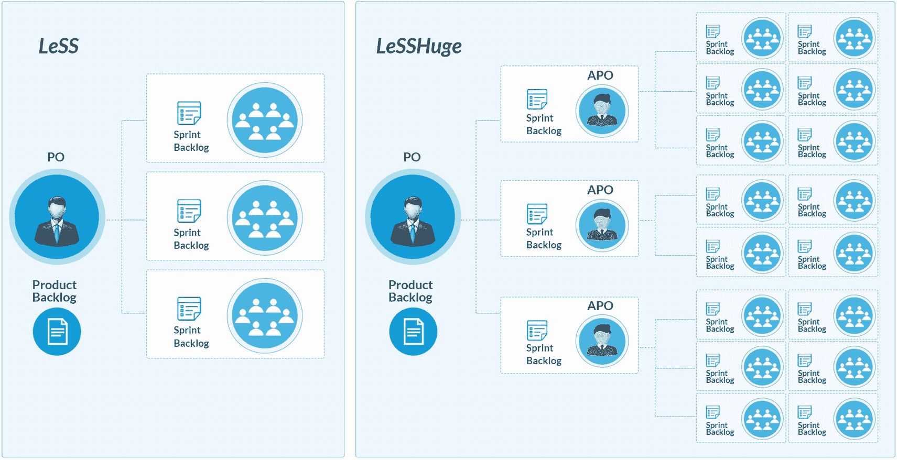
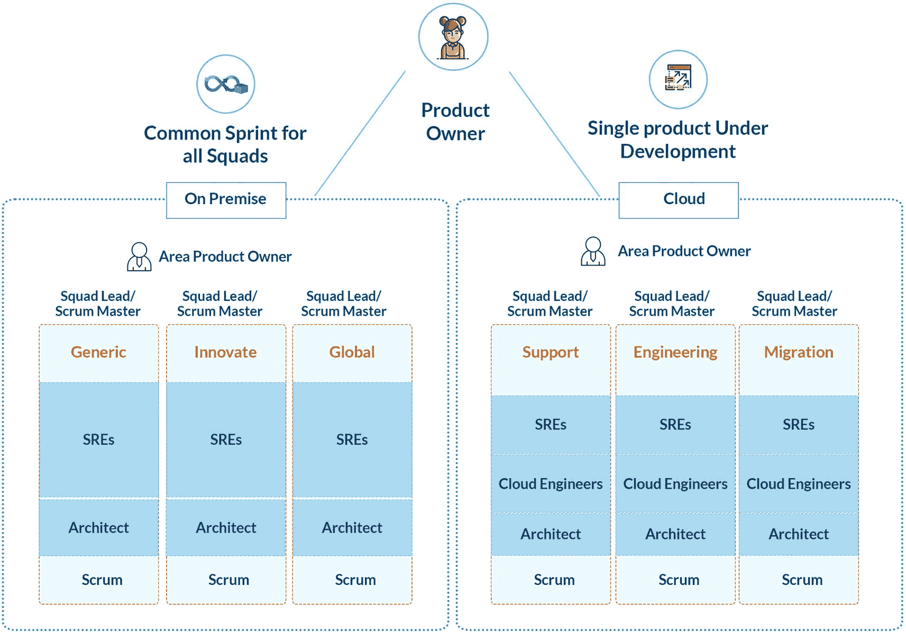
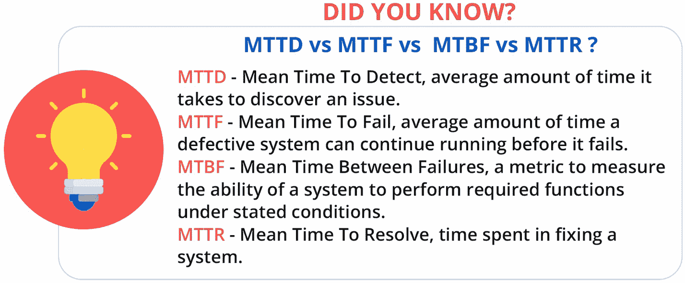
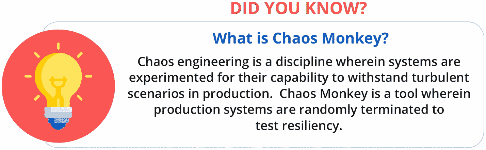

# 6.敏捷框架简介

在这一章中，我们将讨论不同的交付模型，这些模型定义了敏捷的工作方式，也在系统中引入了新的角色。本章将涉及的主题如下:

*   敏捷 ITSM

*   IT4IT

*   倾斜它

*   扩展敏捷框架(安全)

*   Spotify

*   大规模 Scrum(较少)

*   关系

*   规范的敏捷交付(DAD)

*   现场可靠性工程

## 敏捷 ITSM

随着 ITSM 的发展，出现了补充快速数字化和新需求的需要。组织确定了需要注意的差距，如分散的 ITSM 工具、有限的标准化等。，又看了看候补地 ITSM。虽然传统的 ITSM 被许多组织所接受，但是对敏捷性的需求却在不断增长。组织寻求指导，以敏捷的方式有效地运行他们的服务交付阶段。这催生了*敏捷 ITSM* ，它借鉴了一些敏捷的重要原则，构建了一套强调精简、优化和集成的方法论。采用敏捷原则的组织发现很容易与各种 ITIL 阶段联系起来，并使用这种新的敏捷 ITSM 工作方式。

*   **敏捷 ITSM =敏捷软件开发+ ITSM**

如果敏捷谈论“工作软件”，那么 ITIL 强调“关注价值”因此，组织发现整合敏捷和 ITIL 原则很容易。如图 [6-1](#Fig1) 所示，像 Scrum 这样的敏捷方法在 ITIL 被捆绑到不同的阶段。当产品愿景与服务策略阶段相映射时，实际的 Scrum 过程从服务设计阶段开始，在这个阶段，用户故事需求被记录并在 backlog 中进行优先级排序。服务转换阶段是有时间限制的时间表中的冲刺阶段。最后一个阶段是服务操作，通过批准的变更请求(RFC)来部署产品。

图 6-1

ITIL 和敏捷原则

这种方法最初唯一的问题是敏捷关注迭代，而 ITIL 以连续的方式执行。采用敏捷 ITSM 的组织也找到了一条出路。他们激励团队以 DevOps 的心态工作，这种心态总是以稳定性和敏捷性为目标。基础架构运营团队参与服务设计阶段，并提供保修要求所需的所有必要信息。如果 ITSM 围绕着严格的发布和变更管理来控制变更，那么敏捷 ITSM 是通过决定所需的变更控制的数量和频率来解决的。这种变更控制通常由产品所有者领导，以管理产品和 sprint 积压工作。事实上，是产品所有者批准 CAB 请求，因为产品所有者管理 sprint backlog。

敏捷 ITSM 方法是成功的，因为它结合了 ITIL 和敏捷世界的最佳实践，由 DevOps 思维驱动。两种方法中的相关角色也趋于一致。例如，Scrum 方法中的产品负责人和 ITIL 的服务负责人的角色被合并，因为这两个角色的期望是成为客户的声音。

## IT4IT

IT4IT 是一个参考体系结构，说明了管理 IT 的操作模型。它是一个强大的现代工具，可以帮助组织管理他们的数字化之旅。该标准正在被各种规模的组织所接受和实施，其重点是推动互操作性、改进现有功能和使应用程序合理化。该标准还意味着解决一些问题，例如与代码管理、打包、部署和配置管理相关的缓慢的手动活动。(IT4IT 框架及其价值流来自 [`https://www.opengroup.org/it4it`](https://www.opengroup.org/it4it) ，IT4IT 是开放集团的商标。)该框架由四个价值流组成，这四个价值流反复运作以交付价值和度量改进，如图 [6-2](#Fig2) 所示。

图 6-2

IT4IT 价值流(参考:[https://www . open group . org/IT4IT](https://www.opengroup.org/it4it))

图 6-3

IT4IT 概述

*   *战略到投资组合(S2)* :将不同的功能相互连接，这些功能涉及管理为实现企业战略而交付的服务组合。这种价值流使 IT 能够为企业战略和规划做出贡献。它还提供了关于 It 组合活动的整体视图，以了解 IT 保护伞下所有团队之间的关系。它还包括驱动关键活动的关键功能和辅助组件。

*   *部署要求(R2D)* :控制服务的质量、进度和成本，而不考虑交付模式。这一价值流背后的理念是通过最佳实践加速采购和服务交付。通过对范围、服务蓝图、策略和问题陈述的清晰定义，成功的 R2D 是可能的。像 S2P 一样，R2D 也有各种处理和部署数据对象的功能组件。

*   *请求履行(R2F)* :强调对需要 IT 服务支持的客户的价值实现时间、可重复性和一致性。它关注于部署标准变更的相关性，而不是交付正常的或定制的变更。它帮助组织转向服务代理模型。它主要关注功能组件之间的记录集成系统。

*   *检测并纠正(D2C)* :提高效率，降低成本和风险，推动持续改进。这是通过自动化、自助服务、更快的上市时间、减少 MTTR、定义清晰的所有权和改进的管理来实现的。D2C 的一个主要目标是通过有效、快速地监控和自动化关键服务、关联和管理事件或事件来有效地管理 IT。见图 [6-3](#Fig3) 。

每个流程都提供了一个关键绩效指标(KPI)列表，这些指标有助于定义组织在采用该流程方面的成功，如表 [6-1](#Tab1) 所示。

表 6-1

价值流及其关键绩效指标

  
| 

价值流

 | 

关键关键时刻

 |
| --- | --- |
| **S2P** | 资本支出与运营支出软件许可证消耗的百分比安全评估的频率平均成本/服务或应用 |
| **R2D** | 实际执行测试与计划执行测试的百分比自动化测试的百分比计划成本与实际成本返工减少的百分比 |
| **R2F** | 已完成的服务请求数量SLA 范围内的 WIP 百分比SLA 范围内已完成工作的百分比请求履行的事件数量 |
| **D2C** | OLA 对 SLA减少停机发现和解决的问题数量投入关键业务服务的时间百分比 |

各种组织使用 SAFe 在企业范围内采用 IT4IT，这有助于他们提高发布速度。IT4IT 描述了推动安全/敏捷和开发运维有效实施所需的最佳工具架构和相关集成。该框架还为 IT 转型计划、工具互操作性和服务管理提供了开源模板，涵盖了 IT 中的所有内容。见图 [6-4](#Fig4) 和表 [6-2](#Tab2) 。

表 6-2

它的工作方式

   
| 

过程区域

 | 

传统方式

 | 

现代方式

 |
| --- | --- | --- |
| **S2P** | 瀑布 | 敏捷 |
| **R2D** | 流程繁重 | 最佳化的 |
| **R2F** | 指南 | 自动化的 |
| **D2C** | 筒仓 | 连接的 |

图 6-4

IT4IT 参考架构(参考: [`https://www.opengroup.org/it4it`](https://www.opengroup.org/it4it) )

IT4IT 是一个类似 ITIL 的参考框架；ITIL 侧重于管理 IT，而 IT4IT 侧重于 IT 服务管理(见图 [6-5](#Fig5) )。在基础设施 IT 运营领域，这两种方法都得到了大规模的应用，而且企业已经通过使用这些流程和最佳实践获得了标准化的好处。

图 6-5

IT4IT 对 ITIL

## 倾斜它

精益是一个原则、实践和技术的集成系统，基于授权一线和推动不懈追求完美的客户价值创造。精益 IT 框架扩展了精益服务的原则。它承诺识别并消除浪费，从而改善客户服务。对 IT 服务的需求显著增长，这带来了服务产品的多样性。专业知识和环境设置的成本也增加了。随着复杂性和需求的增加，有必要考虑改善流程和消除浪费。见图 [6-6](#Fig6) 。

图 6-6

精益 IT 概述

什么是*不是*精益呢？

*   这不仅仅是流程的重新设计。

*   它不仅仅局限于工具和技术。

*   它不是一次性的改进计划。

*   这不是新口味的六适马。

但是这里面什么是浪费呢？可能会有各种类型的浪费，可以记作停机时间的缩写。

*   *缺陷*:由于测试不充分，在生产中发现问题。缺陷是软件中存在的缺陷、错误或差错。生产中泄漏的缺陷代价高昂，需要返工。

*   *超过生产*:在当前时代，客户优先考虑需求，并期望它们在更短的周期内频繁交付。发布价值较低的需求或者与高优先级需求相比优先级较低的需求并不是客户所要求的。这就是优先积压被用于需求的地方。

*   *等待*:这与流程中的步骤之间的空闲时间以及一个任务的不同团队过渡之间的工作流有关。

*   *非增值处理*:工作流程中任何不增值的流程或步骤都是浪费。在当前的敏捷时代，不需要过多的文档。

*   *输送*:过渡或转移给团队内或团队外的其他人，存在知识流失。从一个人到另一个人共享的需求有时会因为理解的不同而改变。这导致了误解的需求。

*   *盘点*:有句话叫“停止开始，开始完成。”这与提货时的任务相关，应在提货新任务之前完成，因为客户要求交付价值。库存的一些例子是未利用的资源，比如大量不需要且未被使用的存储库或分支。

*   *Motion* :这指的是一系列手动的、平凡的重复性活动，这些活动会占用大量时间，而这些时间本可以用来思考和创建新服务或改进现有服务。

*   *员工知识*:员工的技能与工作不一致。需要调整正确的实践，以便员工的知识被用在正确的地方。

既然我们已经了解了浪费的类别，让我们来了解一下精益 IT 的五个核心原则。

图 6-7

精益 IT 核心原则

*   *价值*:价值需要从客户的角度来定义。重点是提供的服务。

*   *绘制价值流*:价值流绘制了所有增值或非增值的步骤、努力、投入和产出。

*   *流程*:服务和信息通过流程从一端流向另一端。应该以一种平稳交付服务的方式来定义流程。

*   *拉动*:在客户提出要求和要求时，开展工作并交付客户需求。

*   *追求完美*:这是通过所有任务彻底消除浪费，为客户提供价值。通过持续改进和持续反馈，这是可能的。见图 [6-7](#Fig7) 。

精益 IT 的核心原则在下一节的安全敏捷方法中有所体现。当团队在敏捷模式下工作时，他们的目标是灵活性、适应性和提高客户满意度。为了加快交付速度，分析工作流程并确定哪些区域耗费时间并阻碍交付进度是非常重要的。因此，敏捷和精益都有助于团队可视化工作，持续学习和协作，并在每次迭代中度量项目进度。精益还提供了一个名为*价值流处理*的重要原则，有助于识别浪费，提高流程效率。这是通过价值流评估流程完成的，该流程用于评估企业价值流的优势和劣势。

价值流评估流程的步骤如下:

1.  选择产品/服务/流程。

2.  让利益相关者参与进来。

3.  了解客户的声音。

4.  绘制当前状态价值流图。

5.  识别浪费。

6.  绘制未来状态价值流图。

7.  确定收益。

8.  制定实施计划。

9.  实现未来状态的 VSM。

10.  分析并微调未来状态的 VSM。

有趣的是，价值流图也被用作评估组织在 DevOps 上的成熟度的方法。有各种各样的模板可以帮助团队记录当前的状态，这些状态集中在交付工作的质量、返工完成的百分比、交付工作软件的交付周期等等。参见图 [6-8](#Fig8) 。

图 6-8

成功产品开发的要素

成功产品开发的关键因素取决于团队如何采用和实践精益、敏捷和 DevOps。这三个部分相互补充，确定了新的工作方式。核心基础是客户需求，或需要在优化的成本模型内交付的价值。

精益专注于以优化的方式构建正确的东西，而敏捷专注于构建正确的东西。从传统方式到现代方式的转变是一个越来越大的期望，不能再搁置了。流程繁重的手动活动将得到优化和自动化。孤立的团队需要不断地联系和协作。精益 IT 是一种将 IT 与业务相结合的方法。这是一个面向目标的框架，侧重于团队授权。当用敏捷和开发运维来补充时，它会为组织创造奇迹。参见图 [6-9](#Fig9) 。

图 6-9

精益和敏捷

## 扩展敏捷框架(安全)

[Scaled Agile Framework](https://www.scaledagileframework.com/)(SAFe)是寻求拥抱业务敏捷性并在后数字经济中蓬勃发展的组织的领先框架。SAFe 是由 Dean Leffingwell 等人在 2011 年推出的。艾尔。认识到大规模解决方案提供商面临的上市时间和质量方面的挑战，作者们试图为最复杂的业务和技术组织带来一致性、协作性和透明度。该框架是一系列的流程和工具，源自多年来对跨企业模式的观察，植根于精益-敏捷思维、核心价值观和十个不变的精益-敏捷原则；这些是

*   [#1 从经济角度看](https://www.scaledagileframework.com/take-an-economic-view/)

*   [#2 应用系统思维](https://www.scaledagileframework.com/apply-systems-thinking/)

*   [#3 假设可变性；保留选项](https://www.scaledagileframework.com/assume-variability-preserve-options/)

*   [#4 利用快速集成学习周期进行增量构建](https://www.scaledagileframework.com/build-incrementally-with-fast-integrated-learning-cycles/)

*   [#5 基于工作系统客观评估的里程碑](https://www.scaledagileframework.com/base-milestones-on-objective-evaluation-of-working-systems/)

*   [#6 可视化和限制在制品，减少批量，管理队列长度](https://www.scaledagileframework.com/visualize-and-limit-wip-reduce-batch-sizes-and-manage-queue-lengths/)

*   [#7 应用 cadence，与跨域规划同步](https://www.scaledagileframework.com/apply-cadence-synchronize-with-cross-domain-planning/)

*   [#8 释放知识型员工的内在动力](https://www.scaledagileframework.com/unlock-the-intrinsic-motivation-of-knowledge-workers/)

*   [#9 分散决策](https://www.scaledagileframework.com/decentralize-decision-making/)

*   [#10 围绕值](https://www.scaledagileframework.com/organize-around-value/)组织

外管局是高度可配置的，以解决每个组织的意图和目的。它提供了不同的配置(基本、大型解决方案、组合和完整)，任何组织都可以轻松采用。所有这些配置中一个共同的关键元素是敏捷发布系列(ART)的概念。艺术向组织传递价值流；它由 5-12 个敏捷团队(不同部门的大约 50-125 名跨职能专家)组成，这些团队在称为项目增量(PIs)的迭代中一起工作。为 PI 规划的所有功能都通过列车交付。如果一个特性不是计划 PI 的一部分，那么在下一个增量开始之前，它不会开始。此外，一幅艺术地图与冲刺周期。因为 ART 中的团队应该是一致的，所以他们需要遵循相同的开始和结束日期进行冲刺。每种艺术都有一个被称为发布培训工程师的角色(RTEs——功能类似于 Scrum Master)；谁促进发布周期。

图 6-10

保险箱里的艺术品

## Spotify

Spotify 是世界上最受欢迎的音频流媒体服务之一。Spotify 模式完全是该公司提高团队敏捷性的方法。该车型于 2012 年首次推出。该模型关注人员、文化和扩展敏捷的自主方法。这是一个例子，说明了在一个产品开发组织中，如何通过改变文化来组织多个团队，以及我们如何合作和建立网络。

该模型与其他模型不同，因为它侧重于围绕工作进行组织，并根据业务对组织进行重组，以提高敏捷性，而不是遵循一套特定的实践，如每日站立、计划会议等。

Spotify 模型中的团队决定采用哪种框架，可以是看板、Scrum、scrumban 等等。团队的构建方式与传统的敏捷框架非常不同。让我们了解一下这个框架中使用的基本术语。见图 [6-11](#Fig11) 。

图 6-11

Spotify 框架

*   **小队:**小队是由六到十名成员组成的跨职能团队。团队有一个使命，由敏捷教练和产品负责人支持。

*   有时，某些人需要跨团队工作，所以他们组成了一个部落。与小队不同，部落由大量的人组成。每个部落都有一个部落首领，他在小队之间进行协调，并促进协作。

*   章节:章节是使团队能够完成工作的标准和最佳实践。通常，一个分会有一个领导者，他通常是一个高级技术领导者或者架构师。分会是在一个部落内形成的。

*   公会是一个论坛，人们出于对某个特定话题的兴趣而加入其中。这是自愿的，不像分会那样跨越部落。一个公会没有特定的领导者，但是任何人都可以自愿协调一个公会的活动，并把所有人聚集在一起。

*   三人组:三人组是团队领导、产品领导和设计领导的组合。Trio 是每个部落的一部分，确保部落在产品的三个核心领域保持一致。

*   联盟:三人组有时会为了一个更大的共同目标而一起工作，而这个组织需要多个部落一起工作。

我们假设企业 Alpha 需要转型为 Spotify 模式。如图 [6-12](#Fig12) 所示，组织将有不同的产品团队，每个团队将有团队和部门纵向或横向运行。

图 6-12

小队-章节敏捷模型

根据需求，每个产品团队可以有多个小团队，一旦他们完成了一个产品特性，他们就可以重新分组来计划另一个产品特性。每个班都是一个专门的团队，知道什么是发展和相应的计划。另一方面，章节关注的是如何交付东西。例如，这些可以被认为是像 Scrum masters 一样的实践社区。这些 Scrum 大师与产品团队合作来指导和实现敏捷实践，当团队自给自足时，他们返回社区并与另一个产品团队合作。这些团队和部门可以采用他们自己最适合的敏捷方法。每个产品团队可以有多个小组，他们一起工作，确保利用可用的 DevOps 工具从端到端交付产品。除了这些团队和部门，当然还有其他重要的职能，如 PMO、安全和平台运营，它们为整个组织的每个人提供横向支持。

这样的模式在最初似乎很难实现，但分阶段的计划有助于企业在规定的时间内顺利实现这一目标。值得注意的是，新的结构需要新的角色、新的工具和培训需求，这应该是过渡到这种新模式之前的先决条件。目标是确保敏捷性是每个团队的核心原则，并且可以通过正确的流程挖掘、目标设置、新角色定义和引入新技术来实现，从而节省时间和精力。

该框架还引入了一些新的角色定义，如表 [6-3](#Tab3) 所示。

表 6-3

Spotify 中的角色

  
| 

新角色

 | 

投资组合级别

 |
| --- | --- |
| **班长** | 协调工作并建立协作团队指导团队并提供改进反馈拥抱问责文化与分会领导合作 |
| **章节导语** | 履行直线经理的职责为不同团队提供专业支持跟踪并提供高质量的服务 |
| **SRE** | 交叉技能工程师，章节的一部分专注于 IaC、DevOps、云等新兴技术。 |

Spotify 模式是一个经过充分测试的基础设施运营团队框架，可以快速扩展并重新定义其运营组织结构。要将我们的示例公司 Alpha 转变为 Spotify 工作组织，首先需要解决以下事项:

*   蔻驰所有团队成员的敏捷概念。具有“推动”文化的现有运营团队需要在“拉动工作”和承担责任方面得到指导。

*   鼓励他们提出问题，拥抱即将到来的变化。团队需要被鼓励走上新的敏捷之路，这将使他们受益。

*   确定新生态系统中需要的工具。当团队学习敏捷方法时，他们也需要学习新的工具来使他们有效。他们应接受培训，了解如何创建和引用仪表板、查看团队进度、了解“工作进展”的基础知识，以及他们的贡献将如何导致项目的成功。

*   形成一个新的组织结构，包括小队、分会、行会和部落。这个结构也应该在团队中传播，以便他们理解每个团队的目的。

*   选择将由团队实践的敏捷方法。方法论应该考虑团队在理解 Scrum、看板、scrumban 等方法时的成熟度。，及其实现。只有当团队定期实践敏捷时，敏捷的采用才能成功。

*   确定要引入的新角色，并将它们与现有角色对应起来；否则，计划雇用。随着现有运营团队接受培训，应该通知团队新的结构将带来新的角色和职责。他们应该有机会自愿承担这些新角色。

*   定义新的运营组织结构，该结构映射了新的角色，以团队成员为标签。与组织变革管理协作，传播这一新的变革。计划并运行研讨会，让团队了解新的变化，这将避免团队内部的混乱。或者，试运行并扩展该结构。新的运营结构可以以交错的方式展开，而不是一蹴而就。这个决定应该由高管基于他们对生态系统的深入理解来做出。

让我们假设阿尔法正在为这个新的旅程做准备；先决条件已经考虑到了，现在我们需要为新模型起草一个大纲。

*   新角色=产品负责人、团队领导、部门领导、SREs、云工程师和架构师。您可以确定可以扩展到这些新角色的现有角色；例如，塔领导可以被培养成小队领导。

*   横向团队=分会，公会。这些服务组贯穿于所有的小队，成员在不同的小队之间不断流动。运行治理、法规遵从性等的现有团队。，可以扩展到这些新角色。

*   垂直团队=部落，小队。这些团队可以被想象成产品团队，他们拥有分散在不同地区的比萨饼大小的团队，为不同的功能而工作。

对于阿尔法，我们将计划两个部落。第一个部落将满足对内部基础设施的请求，第二个部落将满足云请求。我们称之为本地部落和云转型。

我们来了解一下组织结构，如图 [6-13](#Fig13) 所示。

图 6-13

InfraOps 的 Spotify 模型

*   本地部落将支持本地环境，云转型部落将支持云环境。

*   团队成员将被分成小组，每个小组将有 sre，他们是 Unix、Wintel、消息传递、备份、VMware、网络、自动化等方面的交叉技能专家。

*   每个部落有三个小队。一个部落中的小队以一组确定的工作负荷为目标。

*   一个通用小组将致力于自动化用例。

*   创新小组将致力于新集成和试点。

*   全球小队将处理所有地区的行动任务。

*   这些小组将由导师或领导带领，他们将在这种新的组织结构和工作方式上赋予团队权力。领导还将决定他们将实践的敏捷方法。

*   每个小组都有自己的产品负责人，他们将与敏捷团队一起工作。

*   DC 通用/云通用团队将跟随 Scrum 解决自动化线程上的开发故事和任务。

*   DC 创新/云创新团队将遵循 scrumban 方法来解决试点推广和持续研发的开发和运营的故事和任务。

*   DC 全球/云全球团队将遵循看板方法，其中将跟踪和解决运营用户案例和任务。

也将有两个章节和行会作为横向服务。

*   由定义模式、术语、管理规则等的架构师组成的标准。

*   作为跨所有团队的实践社区的最佳实践，共享运行高效管道或操作所需的有效方法和工具。

*   每个章节将由服务负责人或章节负责人进行协调和管理。

*   标准和最佳实践两个章节都有来自特定部落的所有小队的成员。在我们的示例中，来自本地团队的所有团队的一些成员将成为标准和最佳实践章节的一部分。同样，这也适用于其他部落。

*   在我们的例子中，一个行会专门为敏捷教练服务。这个公会将会有来自两个部落的成员。

这些只是例子；可以有更多的部门，如风险和法规遵从性、发布和自动化、服务台等。，依次会有自己的小队、分会和公会。

Spotify 模式的成功可以通过以下方式实现:拥有正确的文化心态，给予团队自主权，选择最适合团队的框架，采用对他们有利的工具，鼓励团队参与公会，建立信任，激励和欣赏员工，以及从错误中学习。

## 较少的

LeSS 于 2005 年由 Bas Vodde 和 Craig Larman 推出。LeSS 框架通过伸缩将一个团队 Scrum 扩展到多个团队。(参考文献摘自 [`https://less.works/less/framework`](https://less.works/less/framework) )。)LeSS 在大型团队环境中应用 Scrum 原则、过程和元素，在这种环境中，多个团队致力于单一产品。所有的 Scrum 团队遵循相同的 sprint，使用相同的产品 backlog，并且有相同的产品所有者。

LeSS 中的客户需求被分为需求领域。每个产品待定项都是一个需求领域的一部分。特定领域的要求被组合在一起。这形成了一个区域产品待办事项列表，它是产品待办事项列表的子集。与产品待办事项列表相比，产品待办事项列表中的项目更小，因为这些项目被分解为在一个 sprint 中完成。来自区域产品待办事项列表的产品待办事项列表项目由多个团队在该待办事项列表中进行挑选。与其他扩展框架相比，这是一种不同的方法。

还有其他更少的框架，比如 Basic LeSS，它有两到八个团队，以及 LeSS Huge，它有八个以上的团队。见图 [6-14](#Fig14)

图 6-14

较少概述

LeSS 已经有了一些指导和实验，这些指导和实验是由那些基于在多个组织中实施扩展敏捷而引入 LeSS 的人进行的。

除了产品负责人、Scrum master 和开发团队的 Scrum 角色，LeSS 还有一个额外的管理者角色。

LeSS 中的管理者为团队提供试验的自主权，并协助团队消除障碍和持续改进。

区域产品负责人(APO)在较小规模框架中的关键角色是协助和协调产品负责人(PO ),并弥合业务和技术团队之间的任何差距。APO 的角色和责任就像一个 PO。对需求及其在产品待办事项中的优先级的最终决策由 PO 而不是 APO 做出，即使他们一起工作。APO 也有助于 PO 避免过载。APO 专注于以客户为中心的产品特性，并与产品负责人合作开发这些特性。区域产品 backlog 由 APO 管理，该产品 backlog 又由一个区域内的多个团队使用。此外，APO 领导着该地区的所有团队。见图 [6-15](#Fig15)

图 6-15

产品负责人和区域产品负责人(参考: [`https://less.works/less/less-huge/area-product-owner`](https://less.works/less/less-huge/area-product-owner) )

除了常规的 Scrum 仪式之外，还有一个额外的产品待办事项清单细化会议，该会议关注于产品待办事项清单的细化，考虑优先级、估计、更大故事的分解、风险的识别以及依赖性。

**一个例子**

让我们考虑一下我们早期的企业 Alpha，它需要从传统的方法过渡到一个较小的框架。该企业同时拥有内部和云环境，我们需要创建一个由团队组成的新结构，这些团队将通过 IaC 进行自动化工作。推广 LeSS 框架需要以下角色和团队结构:

图 6-16

较少结构

*   新角色=将管理由区域产品负责人领导的小组的产品负责人。每个小组将由一个组长或一个 Scrum master 领导，每个小组将有架构师和交叉技能的工程师，称为 SREs，管理这两种类型的环境。

*   垂直结构=群体。这些团队进一步由具有明确目的的小队组成。此外，每个团队可以选择最适合他们工作文化的敏捷方法。见图 [6-16](#Fig16)

为了实施得更少，我们需要组成两组小队。内部团队将被称为通用团队、创新团队和全球团队，每个团队都有一个 Scrum master、SREs 和一个基础架构架构师。新的基础架构团队将拥有具备 Unix、Windows、VMware、AppOps、DBA 和网络技能的交叉技能人才。类似地，云小组将有另外三个团队，他们共同支持与云相关的任务，例如支持现有团队、将内部应用迁移到云，以及进行扩展和集成。内部和云团队将有自己的区域产品负责人(APO)。该 APO 将与团队紧密合作，共享产品需求。将只有一个产品负责人(PO)来管理这项服务。这里的 PO 负责所有的基础设施支持和自动化活动，无论是在本地还是在云上。因此，在本例中，有两个小组继续支持业务照常工作活动，同时开发将应用程序迁移到云的自动化管道。单个产品积压将由该产品所有者管理和优先化。所有团队都将遵循相同的 sprints，并朝着一个共同的业务目标努力，这就是最大化基础设施自动化。因此，LeSS 专注于通过多个团队在相同的 sprints 之后一起工作于相同的产品，但是在不同的组中工作，来构建端到端的产品。

## 关系

Nexus 框架是由 Ken Schwaber 于 2015 年推出的，他是 Scrum framework 的联合创始人，可在 [Scrum 上使用。org](http://scrum.org) ( [`https://www.scrum.org/resources/scaling-scrum`](https://www.scrum.org/resources/scaling-scrum) )。Nexus 基于 Scrum 框架，使用迭代和增量的产品交付方法。这对于多个团队在同一产品上工作并集成为一个更大的团队的组织来说非常有用。

它适用于三到九个团队，其中每个团队又是一个八到十人的小团队，所有人一起工作在同一产品上。所有团队都朝着一个共同的目标努力。见图 [6-17](#Fig17)

图 6-17

Nexus 框架(参考: [`https://www.scrum.org/resources/scaling-scrum`](https://www.scrum.org/resources/scaling-scrum) )

它不同于 Scrum，因为它没有每个团队的产品负责人；相反，所有团队都有一个产品负责人。有一个由产品所有者管理的常见产品 backlog，Scrum 团队从中提取工作。除了 Scrum 的常规角色，如 Scrum master、产品负责人和开发人员，Nexus 还有一个新的责任角色，即 Nexus 集成团队。

Nexus 集成团队确保每个 sprint 都是来自所有团队的集成产品，并且已经准备好交付。Scrum 团队集成代码，但是对于集成了 sprint 的产品，焦点和责任在于集成团队。集成团队有一个产品负责人，Scrum master，以及必要的集成团队成员，他们将在需要时解决技术问题。集成团队还负责训练和指导 Scrum 团队去遵循和学习实践和工具，以实现和开发高质量的产品。因此，这种模式的关键区别在于，不是通过艺术进行整合，而是有一个独立的团队负责整合。

事件类似于 Scrum 中的事件；它们包括 Nexus 计划会议、Nexus 每日 Scrum、Nexus sprint 回顾、Nexus sprint 回顾和跨团队细化。

跨团队细化是为了帮助确定团队之间的依赖关系，并计划哪些 Scrum 团队将交付产品待办事项中的哪些项目。

**一个例子**

在传统模型中，当要集成多个代码库时，代码集成是一个很大的挑战。在集成过程中，许多隐藏的缺陷被识别出来。从事代码集成并解决代码合并问题的集成团队在这种情况下很有帮助。参见图 [6-18](#Fig18) 。

图 6-18

连结结构

让我们把想象中的传统公司 Alpha 转换成 Nexus 框架。以下是将引入系统的新元素:

*   新角色=产品负责人、团队领导/Scrum master、sre、架构师和云工程师。

*   垂直结构=小队。可能有许多团队一起工作来交付一个企业主题或史诗，例如，交付一个自助服务目录。

团队将被转化为六个小队或团队，有一个 Scrum master、SREs、云工程师和架构师。将有三个 DC 团队，分别名为通用、创新和全球。这些 DC 团队将拥有具备 UNIX、VMware、网络、Windows、DBA 和 AppOps 技能的交叉技能人员。云团队将在云上管理和交付组件和服务。另外两个团队将负责自动化和法规遵从性，自动化、开发运维、云、即时消息和法规遵从性管理技能与基础架构分开。所有的团队将有一个共同的产品所有者，因为有一个产品需要管理和开发。单个产品待办事项将由产品负责人管理并区分优先级。与其他扩展的敏捷团队结构不同，Nexus 有一个额外的集成团队，成员来自 DC、云、自动化和合规团队。他们致力于来自所有团队的集成 sprint 可交付物的集成问题。所有的团队都将遵循同样的冲刺，朝着共同的商业目标努力。

因此，对于完全实现 Scrum 并且有一个产品要开发的团队来说，Nexus 模型是最好的选择。

## 规范的敏捷交付(DAD)

DAD 框架是 IBM 在斯科特·安布勒和马克·莱恩斯的指导下于 2009 年推出的。当采用精益和敏捷原则时，它也类似于 SAFe。它是一个过程驱动的框架，关注人与人之间以及组织内部的交互。参见图 [6-19](#Fig19) 。

图 6-19

规范的敏捷交付框架

其交付周期包括三个不同的阶段:

*   *Inception* :在初始阶段，组建团队，形成项目远景并与组织远景保持一致，确定范围，形成架构和技术策略以及测试策略，决定最初的计划和发布，获得资金，并确定风险。

*   *构建*:这都是关于开发一个可消费的解决方案，创建一个架构，提高质量，解决涉众的需求，并且更接近发布和交付价值。

*   *产品化*:这是团队确保解决方案为部署做好准备并执行部署的阶段。

有主要和次要的团队角色。主要角色是团队领导、产品所有者、架构所有者、团队成员和利益相关者，而次要角色是测试人员、技术专家等。，它与团队和环境进行交互，以开发可行的解决方案。仪式也类似于 Scrum 框架。

爸爸有两个缩放角度。

*   *大规模的战术敏捷性*:这解决了团队因素的伸缩性，例如规模、地理位置、项目的复杂性等。，通过流程和标准的应用。

*   *规模战略敏捷性*:这通过敏捷和精益战略解决了组织不同领域的规模问题。

因此，组织可以根据适用性决定需要哪种 DAD 扩展方法。

表 [6-4](#Tab4) 强调了到目前为止提到的一些框架的一些关键差异。

表 6-4

一些敏捷框架的快速差异

    
| 

描述

 | 

较少的

 | 

Spotify

 | 

关系

 |
| --- | --- | --- | --- |
| **定义** | 一个敏捷的 Scrum 框架，用于将 Scrum 扩展到多个团队。它提供了两种变体:较少的，最多八个成员的团队，和较少的，一个产品中最多几千人的团队。 | 一种强调文化和网络重要性的以人为本的、自主的敏捷方法。 | 一个敏捷的 Scrum 框架，其中多个团队在一个产品组合上工作，并创建一个集成的增量。 |
| **核心目标** | 1.精益思维 2。系统思维。全产品焦点 4。以客户为中心 5。持续改进 | 1.自我管理。专注于组织工作的灵活性 3。关注文化 | 1.经验主义和自我管理2.围绕价值组织3.确保透明度4.关注持续集成和持续改进 |
| **关键角色** | 1.产品所有者 2。敏捷教练3.组4.区域产品所有者 | 1.小队(6-7 人)2。部落(40-150 人)3。章节(同一部落的专家)4。行会(利益共同体)5。三人组(部落领导、产品领导、设计领导)6。总建筑师 | 1.产品负责人(一个对一个)2.敏捷教练3.组4.Nexus 集成团队 |
| **基本构造** | 1.一个团队 Scrum2。所有团队一个 DoD。一次冲刺 | 1.部落工程模型2.行会和分会 | 1.所有团队一次冲刺2.团队(三到九个 Scrum 团队)3.Nexus 集成团队，用于集成每个团队的增量4.所有团队一个产品负责人 |
| **关键仪式** | 1.冲刺规划(第一和第二部分)2。每日 Scrum3。冲刺回顾 4。产品积压优化(PBR)5。整体回顾 | 1.团队采用 Scrum 或看板，并遵循惯例。回顾展 | 1.Nexus sprint 规划 2。Nexus sprint 评论 3。Nexus sprint 回顾 4。精炼 5。Nexus daily Scrum |
| **关键指标** | 1.燃尽图 2。速度图 | 1.提前期 2。周期时间 3。速度图 | 1.Nexus 冲刺目标(所有工作和冲刺目标的总和)2.Nexus 集成增量(已完成的所有集成工作的当前总和) |
| 速度 | 固定长度短跑 | 周末 | 2 到 4 周 |

## 现场可靠性工程

SRE 是一种应用第一、可靠性第一的 IT 运营方法，是一套最佳实践，包括关注可用性和错误的指标。SRE 概念起源于 21 世纪初的谷歌，为谷歌复杂的全球基础设施提供支持。这个术语是由谷歌工程副总裁特雷诺·斯洛斯创造的。

顾名思义，SRE 的主要重点是系统可靠性。SRE 团队还专注于开发健康监控、部署自动化和其他类似任务，以增强整个系统的可靠性。

**SRE 指导原则**

现在，让我们来看看描述实施 DevOps 原则所需流程的七个关键 SRE 原则。

表 6-5

服务水平的比较

   
| 

服务水平指示器(SLI)

 | 

服务水平目标(SLO)

 | 

服务水平协议

 |
| --- | --- | --- |
| 包括如下关键指标的实际绩效:响应时间，包括等待时间每秒请求的错误率每秒请求的请求速率利用率百分比 | 为团队定义必须满足 SLA 的目标。一些目标如下:定义 sli 的下限和上限定义一个目标，其中 SLI 需要小于该目标 | 与客户共享的面向外部的协议，列出团队同意的承诺 |

*   不实施改进请求的风险。分析变更请求未实现时的连锁反应；这将产生重大影响，可能导致客户不满意。

*   客户对可靠性的接受水平。查看使用模式，收集反馈，并定义 SLO 和 SLI(在下一个原则中描述)值，以获得团队信心。

*   实施可能提高可靠性的变更的成本。研究改进服务所需的相关成本，这将对业务产生积极影响。

*   估计与风险相关的成本，并与团队分享，以便他们了解影响并做出明智的决策。

*   *定义* *服务水平目标(SLO)*:每个组织都与他们的客户签署一份法律协议，该协议由一组服务水平协议(SLA)组成。这些 SLA 是对客户的承诺，确保服务可供他们使用。例如，服务器将在 99.9%的时间内可用。为了确保不违反这些 SLA，公司将这些 SLA 映射到内部目标，称之为 SLO，并进一步转化为服务水平指标(sli)。SLO 帮助团队管理风险和预算任何错误，而 SLI 通知团队在服务给客户带来痛苦之前采取行动。见表 [6-5](#Tab5) 。

*   接受风险:我们都承认服务不可能 100%可靠。团队不断努力提高和维护可靠性分数，因为它会影响客户满意度。当然，提高可靠性需要投资。当接受了风险，我们就知道什么时候这些投资是不必要的，什么时候是真正需要的。在可靠性上过度花费可能会降低开发速度，组织不会喜欢这样。拥抱风险的原则也有一个文化成分(DevOps 采用的关键)，其中团队在承担风险以加速开发时应该感到安全。这可以通过确定团队可以参考的以下因素来实现:

团队基于客户的痛点建立有效的 SLO 和 sli 是很重要的，并且随着服务的成熟，他们应该修改(与持续反馈的 DevOps 原则一致)这些价值。

*   *最小化 toil* : Toil 是指一个团队经常做的冗余工作的量。在 SRE，消除辛劳是另一个有助于加速发展和运营的重要原则。通过自动化和优化技术，这是可能的。团队可以通过观察耗时且重复的任务列表来消除辛劳。通过使用指导方针和模板创建有效的自动化，可以极大地减少工作量，从而允许团队关注其他需要关注的领域。消除辛劳应该在 sprints 中完成(与持续改进的 DevOps 原则一致)，以便团队能够监控收益。

*   *监控*:系统产生了大量有意义的数据，并不是所有的数据都需要团队的关注。有一些监控工具可以用来跟踪、提取这些数据，并将其整合到有用的指标中，帮助团队做出决策或采取措施来解决问题。对于 SRE，跟踪以下指标(与 DevOps 持续改进原则一致)很重要，这些指标反过来也是衡量 sli 所需要的。
    *   *差错率*:请求服务失败

    *   *延迟*:响应时间

    *   *业务量*:业务负载量

    *   *饱和度*:资源将持续多长时间

*   自动化:当利用自动化工具时，开发速度可以提高(这有助于与持续集成、持续测试和持续部署的 DevOps 原则保持一致)。团队需要关注产品生命周期中需要自动化和优化的过程。这需要在新工具上投资，并引入诸如左移测试、自动化部署模式等实践。自动化有助于团队减少辛劳，提高团队速度。应该鼓励 sre 跨不同领域确定和实施自动化解决方案，帮助他们缩短周转时间。例如，行动手册或操作手册是列出和描述诊断和补救程序的文档，以便团队中的每个人都知道当出现某种情况时需要做什么。这导致跨各种资源和团队解决问题的平均时间更短，行动标准化。根据基础架构和应用程序环境及版本的变化来维护和更新行动手册是非常重要的。现代数字组织现在已经转向可执行的行动手册，这些行动手册被配置为 runbook automation 或 Operations Orchestrator、Ansible、Puppet 和 Chef 等配置管理工具中的行动手册。DRYiCE iAutomate 等新一代人工智能驱动的智能自动化工具提供了利用 NLP 和人工智能技术进一步增强 runbook 自动化功能的功能，以便在环境中快速部署正确的 run book，并在持续的基础上帮助自动维护 run book。

*   *发布工程*:随着产品和服务的频繁发布，管理发布成为一项单调乏味的任务。无论发布的数量有多少，sre 都需要确保通过利用自动化工具的优化流程工作流来一致地部署发布(符合 DevOps 的持续部署原则)。为了更快的部署，在不同的发布类型之间达成一致并实践指导方针是很重要的。当团队使用相同的标准、政策和协议来发布他们的服务时，这是可能的。随着发布数量的增加，sre 应该监控发布统计数据，并分析发布策略，以防需要更改。例如，canary 版本使部署更加安全和快速。随着 canary 的发布，新的特性被介绍给一小部分用户。这就产生了关于应用程序性能和用户体验的反馈，一旦发布成功，新特性就会发布给所有用户。这种方法降低了发布的风险，因为所有用户不会同时受到影响。Canary 版本通过在实际用户(用户总数的子集)使用应用程序时快速暴露问题，减少了检测(MTTD)问题的平均时间。

*   简单性:可靠性通常与简单性相辅相成。任何易于部署、监控、修复和改进的服务都是可靠的候选服务。简单的系统易于管理和更新。SREs 可以对系统建模，以分析复杂的领域，并找到简化它的方法。应该鼓励团队协作(与 DevOps 协作原则保持一致)并设计简单的系统，还应该意识到复杂的系统需要巨大的投资，例如删除不需要的节点和连接。

除了这七个原则之外，还有其他一些原则对 SREs 的实践也很重要。

*   *将操作* *视为软件问题*:这一点与 DevOps 中的“不再有孤岛”原则非常一致，devo PS 旨在将基础设施和应用程序结合在一起。当 SRE 首次推出时，没有多少组织会拥有软件定义的基础架构和代码形式的基础架构；然而，今天这个原则可以被采用，因为技术已经发展到支持基础设施的变化，就像软件的变化一样。

*   *发现* *错误预算*:这是 SRE 运营中的另一个重要原则，这一点与 DevOps 中的“度量”原则非常一致，devo PS 的目标是捕捉要改进的度量。SRE 的目标是提供完全在误差预算内的服务；这是 SREs 确定服务的体系结构和运营方面的指导性指标。SREs 平衡了快速交付特性的灵活性，而不影响可用性。错误预算用于检查发布和速度，这意味着如果没有错误预算，SRE 团队将停止可能进一步影响可用性的发布。sre 需要与产品管理团队讨论错误预算，并定义服务的可用性目标。他们还需要讨论额外的成本，例如增加更多的容错能力(如果需要的话)或减少频率或测试次数。

有趣的是，系统的可接受风险决定了 SLO，而 SLO 反过来又决定了误差预算。例如，如果一项服务导致了太多的停机时间，那么应该降低风险以保持在 SLO 范围内。根据产品特性、可用性和用途，应该定义正确的 SLO。例如，99.9%的 SLO 表示系统应该在 99.9%的时间内可用。因此，在一个月内，只允许 0.1%的停机时间，如果我们按分钟计算，结果如下:

= [0.001] * [30 天] * [24 小时] * [60 分钟]

=一个月允许的停机时间为 43.2 分钟。

因此，如果系统停机超过 43.2 分钟，这将违反承诺。因此，了解产品供应和服务可用性级别非常重要，这将有助于计算误差预算。让我们通过一个定义了可用性和 SLO 的例子来进一步探索，我们需要找到误差预算。

1.  系统可用性= 90%

2.  SLO = 80%

3.  所以，误差预算=可用性-SLO；当用来自(a)和(b)的值计算时，即 90%-80%；结果为 10%。因此，误差预算值为 10%。

4.  当转换成月时，结果是一个月有 72 个小时。

这意味着，即使产品在一个月内停机三天，也不会违反 SLA。

图 6-20

你知道吗？

*   *降低失败的成本*:这方面对应了 DevOps 中的两个指导原则“渐变”和“失败是正常的”。SRE 团队专注于在开发周期的早期解决问题，以便故障不会影响生产系统。SRE 团队使用各种流程和实践来实现这一最终目标。SREs 在设计和架构阶段的参与有助于主动规划高可用性，并在出现故障时快速恢复，从而降低故障成本。

*   *早回滚，勤回滚*:当发现或怀疑有错误时，团队做的第一件事就是回滚到之前的版本，然后继续探索问题。因此，第一步是恢复系统，然后集中精力探索问题并进行问题管理。这使得系统和服务的可用性更高，解决问题的平均时间更短。见图 [6-20](#Fig20) 。

最近，SRE 和开发工作已经成为组织中极其重要和受欢迎的技能。每个人都有自己对这个团队的角色或职责的定义，并且有各种团队结构，这些团队是在这些结构中构建的。DevOps 工程师或 SRE 没有统一的定义，而且在技能和职责方面也有重叠。让我们试着抓住这两个角色，包括这两个角色之间的区别和重叠。

**SRE 和 DevOps 结构**

在 SRE 团队中，每个团队成员都应该精通所有领域，并在技能方面变得多才多艺。在 DevOps 中，它是关于具有不同技能的不同团队成员走到一起，在文化、流程、最佳实践、工具和技术的帮助下，交付集成的开发和运营体验。

团队结构因公司而异，通常由以下专家组成:

*   *产品负责人*:这个人是业务和产品之间的接口，管理产品路线图和产品策略。

*   *基础架构架构师*:此人负责云和非云基础架构，包括网络、存储、计算和其他元素。

*   *软件开发人员*:这个人创建代码和测试用例，可能没有单独的测试团队，开发人员可能兼任编写自动化测试的测试人员。

*   *QA 工程师*:负责产品的整体质量，确保第三方测试等 QA 流程。，均已处理。

*   *发布经理*:此人负责发布管理功能，包括发布计划和时间安排。

*   *管理员(系统和应用)*:此人负责监控、管理和修补活动，以及自动化基础架构的供应和取消供应以及这些系统的可用性。

从前面的角色可以看出，在战略是走 SRE 道路的组织中，系统管理员角色变成了 SME 角色。此外，当 SRE 是 DevOps 团队的一部分时，可能会有一些活动是由其他团队而不是 SRE 团队完成的，尤其是发布部署。

**devo PS 和 SRE 领域的工具和技术**

 **由于 SRE 和 DevOps 之间存在重叠，并且由于团队和个人围绕团队构建的方式因组织而异，以下技能对这两个团队都是至关重要的。唯一的区别是，SRE 模型中的资源可能会在其中一些模型中交叉使用，而在 DevOps 模型中，文化、最佳实践和指导原则将允许 DevOps 团队无缝处理交付端到端服务所需的全部技术。见图 [6-21](#Fig21)

图 6-21

SREs 的演变

*   *容器和微服务* : Docker 和 Kubernetes 服务可以作为 SaaS 产品从 AWS、GCP 和 Azure 等云提供商那里获得。

*   *监控工具【Prometheus、Zabbix 等工具。是交付持续运营所需的重要服务元素。各种组织可能正在使用来自 COTS 供应商的工具，如 CA Broadcom、IBM、Microfocus、BMC、Solarwinds 和 Zenoss。*

*   *CI/CD/测试工具:【Jenkins、Git、Gitlab、One Test Suite、Selenium、AppScan、Whitesource、SonarQube、微软 TFS、Azure DevOps 和其他云原生 DevOps 工具链以及 Ansible、Puppet 和 Chef 等部署和配置管理工具都属于这一类。*

*   *基础设施即代码(IaC)* :云形成模板、部署管理器模板和 ARM 模板等原生云技术以及第三方工具，如 [Terraform](https://www.terraform.io/) 、 [Puppet](https://puppet.com/) 、 [Chef](https://www.chef.io/products/chef-infra) 和 [Ansible](https://www.ansible.com/) 是自动化的支柱。除此之外，人工智能驱动的 COTS 工具，如 DRYiCE iAutomate 和 DRYiCE MyCloud，正在赢得客户的青睐。

*   弹性测试:这是 SRE 团队手中的一个重要工具。这些工具提供了对生产系统的端到端测试，通过关闭组件并测试服务或应用程序是否能承受这些组件的故障来测试它们的弹性。混沌货币最初由网飞创造，是一种广泛使用的工具。

图 6-22

你知道吗？

### 开发和运营工作之间的平衡

当您转移到 DevOps 操作模式并整合团队或让开发人员负责所有类型的操作时，另一个挑战就出现了。开发人员现在将被计划外的工作、客户升级、可用性、基础设施的停机时间和常规维护工作弄得不知所措。这可能会导致开发团队的不满，团队也可能会从开发特性的核心工作中分心。因此，SRE 在这里起着重要的作用。他们专注于弹性方面，还致力于监控和确保从基础架构到应用程序的整个 IT 环境正常运行。

在此模型中，由于可用性 SLA 定义明确，并且定义了错误预算，因此 SRE 对可用性和弹性的关注确保了通过指标系统地确定优先级。这里要注意的另一点是，错误预算或违反可用性目标将自动优先考虑系统稳定性，而不是特性发布，团队的重点将是确保可能妨碍可用性和影响度量的发布是与开发团队一起计划和协调的。

基于敏捷的 Scrum backlog 被 SRE 团队用于自动化和工程活动，例如问题管理和变更管理。此外，与可用性和优先级相关的基于 ITIL 的 SLA 使用优先级和严重性(以及响应和解决时间)作为衡量标准，用于确定 IT 环境中发生的事件的优先级。这在两者之间建立了一个平衡，确保了灵活性和速度，同时保持正常运行，并确保服务可供最终用户使用。下面的方法定义了优先级:

*   从分类队列中取出东西。

*   如果没有分类项目，处理 sprint backlog 中的下一个项目。

起初，团队可能会在 SLA 驱动的工作流和基于敏捷的 sprint 工作之间产生冲突。在初始阶段，您可能会发现这样的问题:“如果有大量的支持工作怎么办；我们怎么会有时间来完成 sprint 交付？”一旦您能够克服最初的挑战，您将很快发现工作将在更长的时间框架内达到平衡，团队将能够完成 sprint 任务以及处理工作流。随着团队对技术环境和新流程的熟悉，工作流程变得更加可预测。由于 SRE 冲刺将包括自动化活动，您将慢慢开始看到这种集中方法的好处，可用性和性能问题将越来越少。在事件管理和服务请求管理中，问题管理功能通常处于次要位置。在 SRE 模式中，以服务请求管理为中心的交付得到了应有的重视，并消除了重复工作和重复事件。

由于基于流程的工作是不可预测的，而且有些时候可能没有任何事件或服务请求，因此 SRE 团队能够利用这段时间来运行自动化和服务改进的冲刺。

当混合流和基于 sprint 的工作时，要考虑的另一个重要方面是，如果从事 sprint 工作的工程师被中断了，那么他通常会浪费时间从中断的地方重新开始工作，因此有必要根据资源和流队列的可用性，采用一些智能路由来平衡 sprint 工作和工作流，以减少从事 sprint 交付的工程师将面临的中断次数。资源的轮换来承载更多的冲刺工作，而不是流动，是实现这个目标的一种技术。最终，这种模式中的整体资源利用率将比两个不同的团队进行 sprint 和基于流的工作高得多，并且对持续服务改进的关注将导致更快的成熟度和高可用性，同时减少事故。

在此模型中，您将实现以下目标:

*   工作流的 SLA 以及平均响应和解决时间等其他指标都有所改善。

*   随着团队能够更好地预测工作量和计划，Sprint 速度会提高。

*   开发人员和管理团队的满意度得分有所提高。

*   客户满意度得分提高。

*   有更高水平的团队激励和协作。

## 摘要

本章涵盖的所有框架都有独特的使用和采用模式。任何打算采用这些框架之一的组织首先需要确定最适合他们需求的框架。这取决于多种因素，例如团队结构、分布、组成、技术前景、发布周期、敏捷能力和理解。这种深入的分析有助于组织做出正确的选择，然后为其在企业范围内的采用制定路线图。这个旅程需要有里程碑和度量标准来衡量采用和成功。企业还应该为他们的团队计划培训和指导，以便他们可以避免阻力。团队应了解新的工程技术，如代码基础设施、弹性测试、监控和可观察性，以及开发人员主导的 CI/CD 工具，以便他们感受到自己在系统中的重要性，并为转型做出贡献。一旦确定了框架，团队就开始了新的旅程，他们需要确定他们将如何运作。新的工作方式需要方法定义和过程改进。为了在敏捷基础设施运营中工作，我们需要新的团队结构、角色和职责、流程变更、新的工作方式以及工具和技术。我们将在接下来的几章中深入探讨这些方法及其用法。**