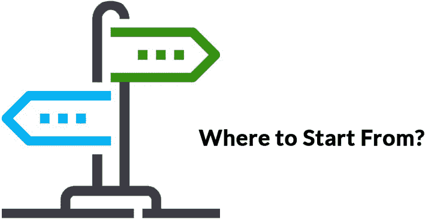
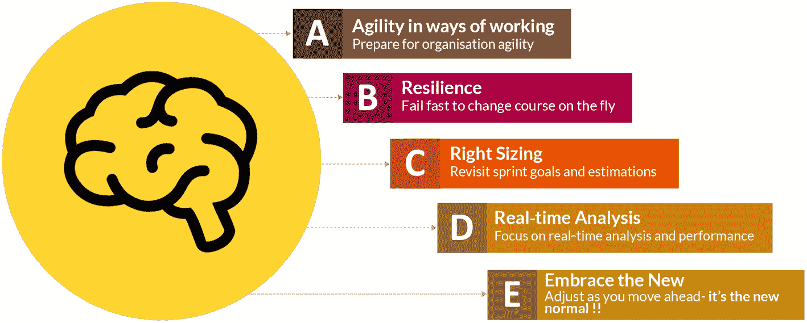
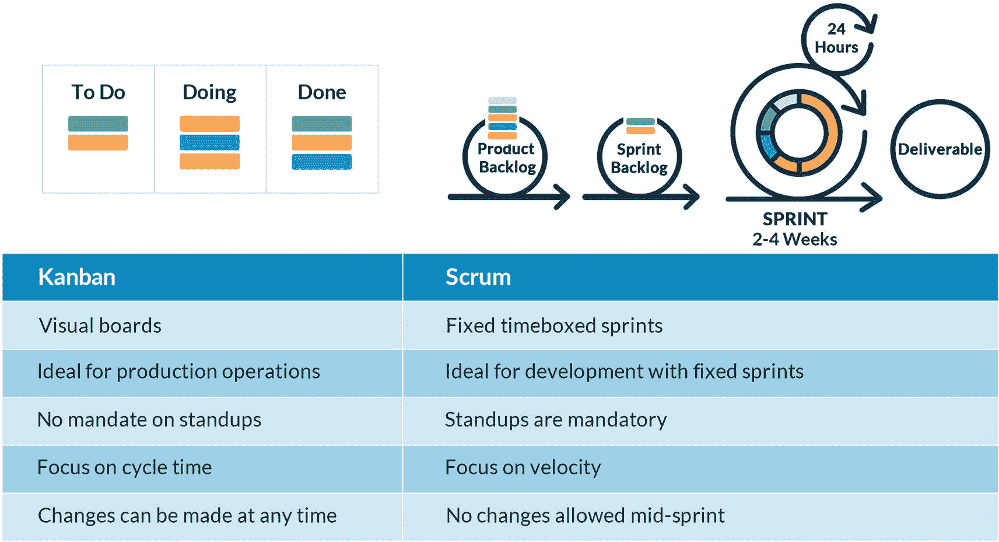
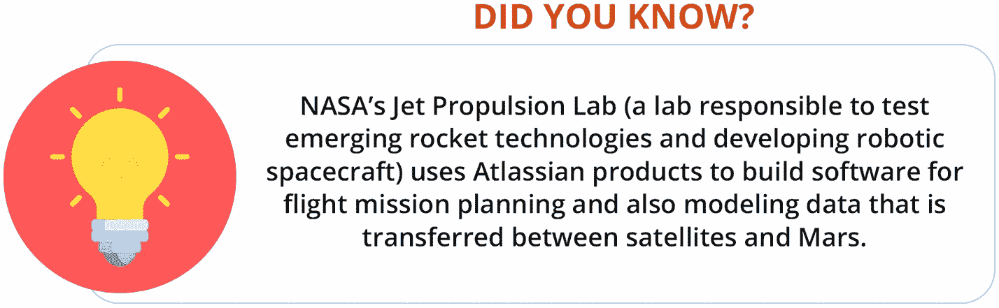
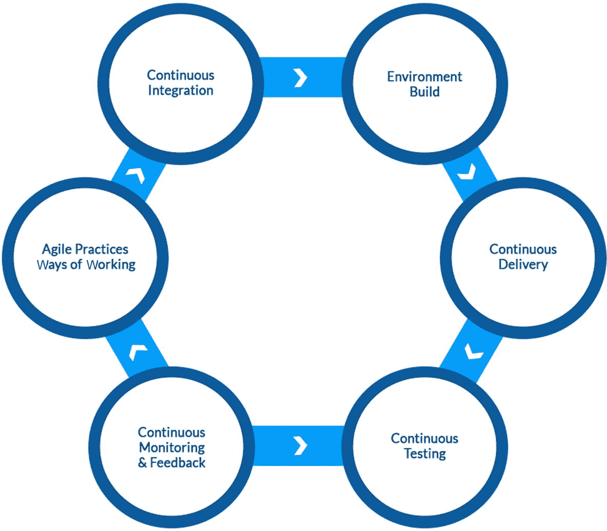
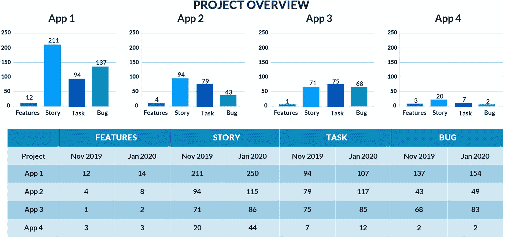
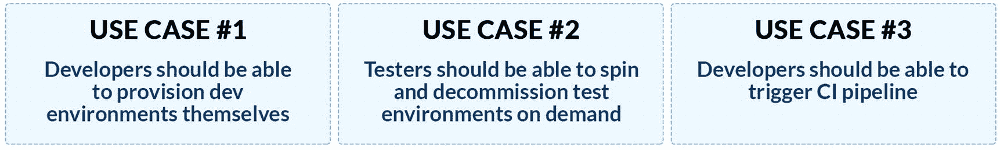
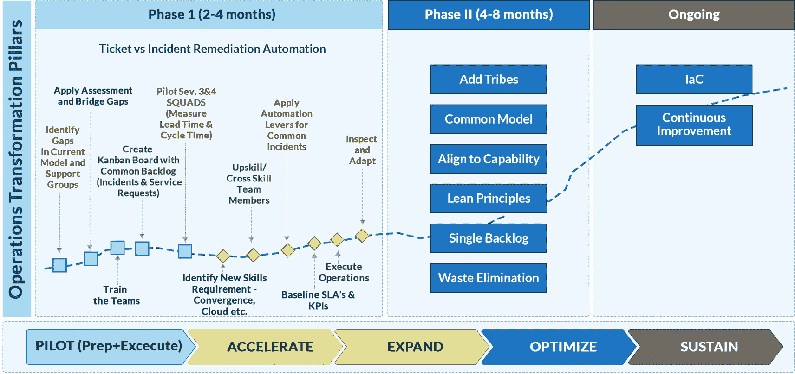
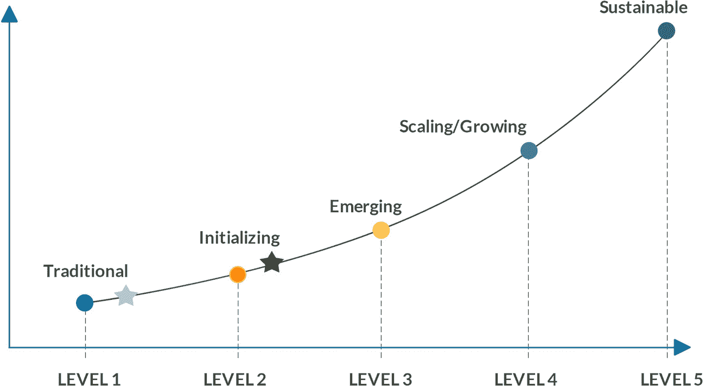

# 7.将敏捷用于基础设施运营

在本章中，我们将详细介绍在企业基础设施运营中采用敏捷的一步一步的方法。本章将涉及的主题如下:

*   起点

*   总结转型计划

我们讨论了 IT 世界如何在基础设施运营领域从传统运营结构向新的敏捷结构发展和转变。我们还研究了企业正在采用的各种敏捷框架和方法，这些企业正在将其基础设施运营团队升级到新的角色和职责。虽然敏捷是前进的方向，但其目的是提供一种新的操作方式，使团队能够在迭代中快速交付。但是，一个关键的问题是，“你从哪里开始？”对于运行复杂大型基础架构和云运营的组织来说，这是一个问题，他们希望快速转向敏捷的基础架构运营，以满足客户不断增长的需求。此类企业迁移到新模式的其他原因是提升成熟度曲线，获得更高可用性和弹性的好处，同时还能节省成本。实施敏捷的基础设施运营提供了所有前述的好处，同时也使团队更具协作性、凝聚力、生产力和积极性。

## 起点

对于，重要的是通过验证当前方法和流程的有效性，找到我们在流程、功能、工具和资源的成熟度方面所处的位置。这就是自我评估的用处。在评估之后，是时候根据当前的差距和所学写一份计划，并以小步骤开始过渡，以团队级别的进步开始新的工作方法。见图 [7-1](#Fig1) 。

图 7-1

AgileOps 的起点

但在这一切之前，需要有需求、承诺和组织上的认同(见图 [7-2](#Fig2) ):

图 7-2

定义新的工作方式

*   敏捷性很重要，组织中的每个部门都应该为此做好准备。

*   我们需要确保系统的弹性，并做好失败和快速恢复的准备。

*   还需要重新审视团队规模和正在发挥作用的技术。

*   关注实时性能分析，并同意持续监控。

*   鼓励团队接受新的变化，采用敏捷的工作方式。

实施 AgileOps 需要更高的技能、更好的协作技术以及对正确的工具和技术的投资，这样团队才能准备好接受和实践文化转变。

让我们来看看能够让组织采用敏捷文化和实践的一些构件。

### 采用正确的敏捷框架和方法

基于组织的团队结构、角色定义、职责、使用的技术平台等。，组织应该选择正确的敏捷框架，如第 [6](06.html) 章所述。确定正确的框架非常重要，它是新旅程的基石。这个框架可以让团队以不同的敏捷方法运行。虽然有各种各样的敏捷方法可用，但是当涉及到软件开发和基础设施操作时，Scrum 和看板都是常用的方法。这些方法提供了项目级别和团队级别的可见性，并且它们培养了“拉动工作”而不是“推动工作”的文化见图 [7-3](#Fig3) 。

图 7-3

敏捷模型

简单回顾一下，Scrum 是一种适合需要在固定的周期间隔内交付工作的团队的方法，而看板适合需要立即解决问题的运营团队。因此，在我们开始敏捷之旅之前，根据团队的可交付成果为团队确定正确的方法是很重要的。如果团队要以固定的时间间隔交付工作，称为 *sprints* ，这可能是作为代码的应用服务或基础设施，那么 Scrum 是正确的方法。这两种方法都应该彻底评估。团队也可以采用这两种方法；例如，80%的团队专注于操作任务并采用看板，而另外 20%的团队专注于每两周交付一次的新工作。这里 Scrum 是理想的选择。Scrum 和看板的结合被称为 *scrumban* ，它利用了两种方法的优点。

很重要的一点是，团队也要被教导如何正确地使用这些方法。仅仅采用与其同名的方法是没有帮助的。它必须被完整地实践。这不是将现有的会议重新命名为站立会议和 Scrum 会议，而是使用成熟的组织变革管理技术和实践来改变组织的文化。期望文化在短时间内改变是不现实的；因此，我们需要以循序渐进的方式规划这种变化。团队需要“拉”工作，而不是“推”需要鼓励他们对工作项目负责，并确保他们在没有任何阻碍的情况下交付。这就是学习和培养敏捷方法的文化变得重要的地方。我们需要明白，第一步是忘掉文化、流程和工作方式，然后继续学习新的文化和工作方式；因为它涉及的不是技术而是人，所以这是一个缓慢的过程。我们需要定义一个循序渐进的旅程，让人们实施新的工作方式并达到更高的成熟度。

对于在 ServiceNow 或 BMC Remedy 或 Atlassian 吉拉等工具中提交票证的 IT 运营团队。，然后将它们发送给团队领导，团队领导再将票证分配给各自的专家进行解决，看板是一种理想的方法。与推动票证的传统操作相比，在看板中，票证由团队专家拾取。这种文化转变需要团队内部的交叉技能，这样知识就不会局限于一组专家。事实上，团队可以获得这些知识。一些组织称这些交叉技能的专家为现场可靠性工程师，并将他们的团队改名为 T2 小队。然而，仅仅将一个团队或一组功能重命名为不同的名称并不能使运营变得敏捷；敏捷方法和实践的成熟需要一步一步的过程。

那么，采用和实施敏捷需要什么呢？

### 识别敏捷方法

假设框架已经选定，敏捷方法需要入围。我们在第 [5](05.html) 章详细介绍了敏捷方法。团队应该根据他们当前的成熟度、团队组成、外包和内包环境以及其他参数，评估适合他们组织需求的正确方法。常用的方法有 Scrum、看板和混合版本的 scrumban。基于当前的工作方式和期望，应该为团队选择正确的方法。组织可以在一个团队中试验一种方法，评估其效率，然后再扩展。一旦地面上的团队习惯了敏捷的工作方式，那么这可以很容易地在企业层面上扩展。大型复杂的组织可能会在不同的部门、地理位置或组织的不同部分混合使用敏捷方法。应努力在某种程度的中央指导下建立协同作用和共同的最佳做法，以便将差异降至最低，并基于特定部门的真正需求，而不是出于个人偏好。我们需要从小处着手，然后扩大规模；路上可能会有挑战。当这种情况发生时，回到绘图板使用来自 DevOps 和 lean 的敏捷宣言、原则和文化指导，你将能够解决这些挑战。

### 确定实施工具

与方法和框架类似，可以利用多种工具来帮助团队实践敏捷仪式、跟踪工作、获得工作可见性等。表 [7-1](#Tab1) 描述了主要特征。见图 [7-4](#Fig4) 。

图 7-4

你知道吗？

表 7-1

敏捷项目管理工具

   
| 

小贩

 | 

工具

 | 

主要特征

 |
| --- | --- | --- |
| 亚特兰蒂斯人 | 敏捷轴 | 为敏捷项目的采用提供模板与其他 Atlassian 工具集成，如用于版本控制的 BitBucket、用于持续集成和部署的 Bamboo、用于协作的 HipChat、用于文档的 Confluence 等。提供出色的报告和仪表板功能可作为内部解决方案和 SaaS 解决方案提供 |
| Collabnet | 版本 | 专为敏捷和精益实施而设计提供 openAgile API 与其他工具集成企业应用生命周期管理工具 |
| 平面视图 | 莱安基特 | 实施看板强调精益原则通过有效的工作流程直观地传达受阻的工作并识别流程瓶颈提供与其他企业级工具的集成，如 ITSM、PPM 等。 |

### 确定扩展集成的需求

虽然有独立的敏捷管理工具，但重要的是，该工具要与产品开发中使用的其他工具集成。例如，在大多数组织中，开发团队使用吉拉，而他们的运营团队使用 ServiceNow。为了弥合这两个团队之间的差距，我们需要构思如何缝合流程差距，并鼓励团队关注集成的仪表板和工作负载。如果这两个工具集成在一起，就有可能实现双向跟踪。两个团队都有可见性，并且共享共同的流程。另一个用例是将故事与代码文件链接起来。如果源代码存储在像 Git 或 BitBucket 这样的工具中，那么这肯定需要工具之间的集成。最终，产品团队获得了他们工作项目的端到端可见性。见图 [7-5](#Fig5) 。

图 7-5

工具之间的端到端集成

### 使用敏捷方法升级团队

团队在采用敏捷方法或工具时需要接受指导。由经验丰富的敏捷教练来监督和指导团队，帮助他们有效和高效地使用工具，这一点很重要。敏捷和开发运维方面的认证专家将成为团队的优秀教练或导师。这些专家还帮助阐明路线图，测量成熟度，并持续监控敏捷的采用。由于几乎没有关于使用敏捷进行云操作以及与 DevOps 和站点可靠性工程集成的指导，因此可能存在技能差距，但这本书可以作为最佳实践指南，帮助您实施您的计划。

### 重新定义团队角色和职责

新的方法和框架可能会遇到来自员工的阻力，这可以在组织变革管理技术和实践的帮助下得到缓解，并且认识到通往敏捷的旅程是一个团队努力的事实。应该在团队中引入新的角色来提高积极性。团队成员应该有机会说出他们的兴趣，并转移到新的角色。新的职责将鼓励团队成员并创造兴奋感。作为基础设施运营领域的一个例子，服务请求经理可以转变为产品负责人，并接受在运营中使用敏捷的最佳实践培训。对于新的角色，应该采用自我管理和透明的概念，因为这些是敏捷的核心原则。

### 培育“拉动式工作”文化

加强敏捷实践的另一个方面是团队成员拉动工作而不是等待别人给他们工作的艺术。这是传统模型和敏捷工作方式的关键区别。长期以来，团队层级是按照自顶向下的方法创建的。在敏捷世界中，层级应该被最小化，任何公司结构都应该激励团队接受变化。目标应该是慢慢地发展成自我维持的团队。

### 基线化初始周期时间和相关指标

如果敏捷是一段旅程，那么我们需要跟踪这段旅程的进展。当与 DevOps 和站点可靠性实践相结合时，这就变成了持续改进之旅。为了跟踪这种进展，需要定期进行自我评估。这可以在团队、产品或企业级别完成。在团队层面，我们需要度量标准，这是我们应该基线化度量标准并经常重新审视它们的地方，以查看团队是否从采用中受益，以及是否需要改变过程。这些度量可以包括简单的度量，比如工作项目的数量或者实现一个故事所花费的时间。如果工作项目的数量在一段时间内没有增加，那么这可能表明团队不能承担负载或者需要纠正什么。遵循精益原则对流程进行详细分析将有助于确定根本原因并采取纠正措施。

图 [7-6](#Fig6) 解释了一个评估以 Scrum 模式运行的团队的进度的简单方法。这个团队管理四个应用程序，每个应用程序都有特性、故事和缺陷。故事还有其相关的任务和复杂性。首先，团队可以每两个月获取一组团队成员的度量。这些数据有助于分析交付的特性和故事点的数量是否在增加，这意味着团队能够吸收更多的工作，因为他们正在获得经验。平均而言，如果在团队规模不变的情况下，所交付的特性和故事点的数量在增加，但是 bug 的数量在减少，那么这表明团队能够交付更多质量更高的产品。这也被称为团队*吞吐量/速度*，应该对其进行监控以持续改进。如果吞吐量/速度没有提高，那么 Scrum master 应该分析原因，并与产品负责人协商计划适当的步骤。可能有各种各样的原因影响团队的生产量/速度，比如有限的能力或依赖性、工作的复杂性等。

图 7-6

样本指标跟踪

### 确定自助服务的候选人

当团队为新的规范做好准备时，为团队设定目标和愿景声明也很重要。使命陈述定义了组织的工作、目标以及实现目标的方法。愿景陈述描述了组织期望的未来。对于运营团队而言，愿景和使命陈述可能包括可用性、弹性、敏捷性、安全性、运营成本、客户满意度、业务增长等要素。使命是需要完成的事情；因此，更广泛的任务需要被转化为细粒度的用例，这些用例形成了敏捷操作团队的待办事项。参见图 [7-7](#Fig7) 。

图 7-7

示例使用案例

### 为可见性创建团队仪表板

当教练加入团队时，他们需要为团队建立一组初始的报告和仪表板，以供团队参考和设置基线。这些仪表板应该反映实时的项目统计数据，并帮助团队拉动工作。基线化的指标应该在这些仪表板上可见。仪表板也可以分层，以满足不同的利益相关者。例如，像 Confluence 这样的工具可以用来创建和显示项目和团队级别的仪表板。这些仪表板也可以作为各种仪式的快速参考点。

### 试行和推广该方法

大爆炸式实施有时可能没有帮助，因为它会在组织中造成混乱。因此，从小处着手，然后扩大规模是好的。然而，团队需要理解敏捷的需求。计划管理办公室和组织变更管理团队在跟踪转换计划和扩展其领域中起着至关重要的作用。在这种情况下，组织可以确定一个应该首先进行试点的团队，然后根据所学的知识，将实践扩展到其他团队。试点项目始终充当其他团队的学习平台。选择试点团队也是确定转型成功的关键一步。避免选择在关键环境或应用程序上工作的团队。选择一个有时间升级并采用新的工作规范的中低级团队。从这个试点项目中学到的东西应该被记录下来，并在组织中展示，其他团队可以看到成功，并开始迈向敏捷之旅。

### 持续测量指标和重新规划

最初的一段时间对团队来说会有障碍，但是为了确保团队在正确的轨道上运行，教练应该重新审视什么是开始的，以及团队是如何发展的。这将有助于他们根据需要改变行动方针，并找出缺失的差距，从这些差距中学习。来自其他团队和管理层的反馈也是观察绩效的关键。随着变化被重新审视，范围不应该仅仅是工具和自动化；它还应该关注可以精简的领域，换句话说，团队需要提高技能的领域。

## 总结转型计划

前面提到的步骤可以分三个阶段进行，如图 [7-8](#Fig8) 所示。

图 7-8

分阶段转型计划

### 阶段 1:试点和加速

这个初始阶段是一个基础支柱，充当构建模块。它通常持续两到四个月，但这可能会因多种因素而延长。为了确保成功管理和实施这一阶段，确定正确的试运行团队并向该团队传授所有必需的技能和实践非常重要。见表 [7-2](#Tab2) 。

表 7-2

里程碑

  
| 

里程碑

 | 

描述

 |
| --- | --- |
| **确定差距** | 对当前的支持模式和运营领域的工作方式进行基准测试。分析团队如何协作，利用了什么过程和工具，以及什么阻碍了更快的交付。跨人员、流程和工具的已确定的差距被合并，这些作为重要的输入来起草通过敏捷性驱动的持续改进的路线图。 |
| **申请评估** | 创建解决差距的路线图。确定一个应该用新的敏捷模型进行试点的团队。这些新团队将被称为*小队*。重要的是，路线图的重点是弥合已评估的差距。 |
| **训练队(班)** | 向确定的运营团队提供敏捷方法和最佳实践的培训。例如，如果看板已经被确定为操作的目标模型，那么指导并使团队能够学习新的术语以及如何应用新的方法。应该鼓励新的团队去拉票并为之努力，而不是领导把票推给他们。在初始阶段有一个可以指导团队并提出最佳实践的教练是很好的。 |
| **创建看板** | 像亚特兰蒂斯吉拉，VersionOne 等工具。，帮助团队使用敏捷方法工作。这些工具具有内置模板，可以根据需要轻松定制。一旦确定并安装了工具，就建立一个新的看板项目，并向团队提供对项目的访问。 |
| **飞行员严重性 3 和 4 票** | 一旦该小组准备好以敏捷模式运行，就启动针对严重程度为 3 和 4 的事件或服务请求的新模式。随着票证进入积压，团队将能够查看积压，并根据其带宽提取票证/事件。教练或负责人可以推动团队的票证流程，并观察需要关注的领域，如成员在将票证从一个州移动到另一个州时遇到问题，或者成员在提取票证和理解新流程时遇到问题。 |
| **识别新技能** | 随着新的团队学习在新的工作模式中工作，领导开始了解团队的速度，并确定团队需要随机应变的领域。可能会有这样的情况，组织向云迁移时也需要提升技能以支持新平台；因此，除了敏捷方法，团队还应该接受新技术的培训，如云和基础设施代码。 |
| **跨技能** | 随着小队技能的提高，他们也需要交叉技能。例如，团队成员应该了解如何建立基础设施以及如何创建和跟踪相关组件的完整流程。另一个例子是，可能存在多技能资源，特别是在云计算领域，其中每个资源都可以在云操作、云架构、云部署、网络和平台方面具有交叉技能。 |
| **应用自动化** | 提高基础设施运营敏捷性的一个最佳实践是尽可能实现自动化。采用基础设施作为代码是一个良好的开端，它标准化了基础设施部署的流程，并避免了设置和基础构建过程中的任何手动错误。利用现成的工具来加速自动化过程。 |
| **基线 SLA 和 KPI** | 要衡量成功，重要的是要注意所选择的道路。为了跟踪敏捷的采用，有必要对 SLA 和度量标准进行识别和基线化。应该定期访问这些值，以确保新方法的实施有所改进。例如，首先，确定解决一个票据所需的交付周期，然后经常跟踪该交付周期，看是否有所改善。如果早些时候是八小时，那么它是否正在减少。显然，会有一些警告，如门票的复杂性和类型。但是定期测量度量有助于团队回顾他们在自动化和敏捷性道路上的进展。 |
| **在新模式下执行 ops** | 一旦试点模式成熟，然后将这种新的工作模式扩展到其他票证类别。团队可能会继续用旧的方法并行操作一段时间，直到他们切换到新的模型。这种工作模式被称为双模态 IT 操作——传统和新的工作模式共存一段时间。 |
| **检查并调整** | 持续的反馈是这一旅程的重要组成部分。随着团队习惯了新的方法、度量标准和工作方式，分析并获得他们的反馈是很重要的，这些反馈是关于什么是最好的，什么是不好的，什么是需要纠正的，什么是应该添加的。对于其他团队来说，这是一个很好的案例研究，可以参考、学习和相应地扩展。 |

### 阶段 2:扩展和优化

一旦试点项目在一个团队中取得成功，就应该推广到其他运营团队。事实上，试点团队为其他人理解敏捷运营的优点和缺点提供了一个极好的媒介。顾名思义，这个阶段的重点是将新的工作方式扩展到其他团队，并检查可以优化的领域。优化可以通过采用正确的工具和自动化来完成。这个阶段通常持续 4 到 8 个月，但可能会根据团队的实力和能力而变化。补充并完善了表 [7-3](#Tab3) 中的关键实践。

表 7-3

关键实践

  
| 

焦点区域

 | 

描述

 |
| --- | --- |
| **添加部落** | 在第一阶段，我们定义小队；这些是自组织的团队。当相似的小队一起工作时，他们组成一个部落。所以，一个部落是一个小队的集合。随着该方法扩展到其他团队，定义一个具有角色和职责的新团队结构是很重要的。 |
| **定义通用模型** | 协作团队的努力导致敏捷的成功。当团队扩展敏捷方法并定义新的团队结构(小队、部落、分会等)时。)，它们共享一个通用的模型以供参考是必不可少的。这有助于团队合作，培养学习文化。运营模型应该是一个简化的版本，易于团队采用和扩展。 |
| **根据能力调整团队** | 介绍其他地区的部落，并使他们具备快速反应的能力。来自能力的持续反馈将使部落能够根据需要随机应变。 |
| **采用精益原则** | 随着越来越多的团队采用敏捷并实现自动化，有必要接受精益原则。精益的五个原则(定义价值、映射到价值流、创造流动、建立拉动和追求完美)专注于创造价值。HCL Accelerate 等工具可用于价值流管理。 |
| **采用单一积压** | 最初，当小队加入时，每个小队都有自己的待办事项。但是，随着部落的形成和团队的交叉技能，领导和教练应该致力于有一个共同的积压。例如，一个部落有一个共同的 backlog。 |
| **消除浪费** | 随着精益原则的实施，必须消除浪费。这就是自动化发挥重要作用的地方。销售线索应监控自动化会给他们带来好处的领域。跟踪浪费是推动敏捷采用成功的另一个因素。 |

### 第三阶段:维持

最后一个阶段是一个持续的阶段——一个持续学习和改进的阶段。这个阶段是关于高效的成熟的交叉技能团队。虽然该团队现在在基础架构和云操作方面已经成熟，但该团队应该扩展他们的视野，寻找自动化机会来提高速度和灵活性。他们慢慢需要确定更多的班队，创造新的角色和职责。

以下关键因素通过持续改进推动这一阶段走向成熟:

*   *自助服务*:团队可以使用基础设施作为代码模板来扩展和缩减环境。这就像测试人员被授权在他们的管道中构建和退役测试环境，而不依赖于操作团队来启用环境。这减少了测试和部署新功能的等待时间。

*   *零接触部署*:CI/CD 管道的端到端自动化使这些成为可能。应该鼓励团队在生产中实践管道部署，而不是手工部署。自动化部署不仅避免了错误的操作，还加快了交付时间，缩短了反馈循环。这使得团队可以专注于创新领域，例如加强安全性和增加测试、合规性和护栏的覆盖面。

*   *标准化和优化*:随着越来越多的机会被识别并通过自动化实现，团队变得更加高效，过程变得更加优化，标准化团队强调交付可靠且有弹性的系统。

*   *持续评估*:还记得我们说过在开始之前对团队状态进行基准测试吗？我们有了初始指标，现在我们应该重新评估。团队需要收集关于其表现如何以及如何改进的反馈。在这种情况下，评估是有帮助的；它使团队能够重新审视他们的团队结构、流程工作流、方法、度量和技能水平。这有助于他们识别和自动化新的机会，以提高效率并根据需要更新行动方案。企业应该采用一个评估计划，这个评估计划应该是基线化的，并且应该定期重新评估，比如说每六个月一次。随后，对该评估的每次迭代进行评分，然后与之前的评级或分数进行比较。

图 [7-9](#Fig9) 显示了一个包含五个阶段的示例评估，每个阶段都有一组已定义的实践。例如，一个团队在第 1 级对自己进行评估和基线化(因为这是完全传统的)。但是六个月后，他们向第二级发展，并在此后慢慢保持发展。第 2 级的初始化阶段表明团队中的每个人都知道敏捷概念，理解它的重要性，并且已经开始利用敏捷方法，比如使用 Scrum 板、仪式等等。这样的评估应该定期进行，以获取当前的成熟度级别，并帮助团队计划变更。

图 7-9

连续评估样本输出

*   举办研讨会，就敏捷的目的和采用自动化来提高团队绩效进行指导。

*   重温组织路线图和里程碑。

*   规划新的能力计划。

*   确定需要现代化的应用程序。

*   投资新工具和自动化。

*   在整个生命周期中标准化工具平台。

*   定义端到端集成和管道策略。

*   确定自动化和优化流程。

*   向更大的群体提供支持和交流。

*   跟踪和改进团队的生产能力/周期时间和其他指标。

表 [7-4](#Tab4) 描述了成熟度评估等级。

表 7-4

成熟度评估级别

   
| 

水平

 | 

名字

 | 

主要特征

 |
| --- | --- | --- |
| one | 传统的 | 瀑布方法孤立和被动的团队没有/有限集成的多种工具 |
| Two | 正在初始化 | 理解敏捷和相关概念确定整合的标准工具团队开始实践敏捷仪式 |
| three | 新兴的 | 开始管道开发团队绩效的基线指标基础设施运营自动化 |
| four | 扩展/增长 | 定义服务目录确定自动化的使用案例自动化交付渠道协作和积极的团队通过开发管道将基础设施扩展为代码 |
| five | 可持续的 | 自助式目录发布自我补救持续评估和改进走向 AIOps |

## 摘要

敏捷基础架构运营之旅是一个有计划、循序渐进的过程，旨在推动团队实现敏捷性、自动化和弹性。一个成功的计划应该在团队中植入动机，并随着团队的成长而扩大规模。因此，最好先试验几个团队，然后将它扩展到运营领域的其他团队。当然，失败是计划需要改变的标志。驱动敏捷计划的可能有多个阶段，但是这应该基于组织章程和期望来设计。组织应致力于实现以下一组目标:

*   基于迭代的短期工作负载

*   标准化和最优化

*   自助服务

*   自动化

*   持续监控和收集成长反馈

假设基础设施运营团队已经采用了看板，并且新的运营模式正在成熟度曲线上前进，我们需要分析并迈向转型之旅的下一步。现在是时候了，我们需要将基础设施作为代码引入，并实现基础设施管道与应用程序管道的设计和集成。这一步可以按顺序完成，也可以根据小组带宽并行完成。现在，我们将深入研究代码基础设施的概念，并理解使用敏捷-Scrum 方法所需的关键构件。