# 8.将基础设施作为代码转向敏捷

在这一章中，我们将讨论如何从基础设施代码开始。本章将涉及的主题如下:

*   使用 Scrum 作为代码开始使用基础设施

*   评估故事

*   定义验收标准

*   基础架构构建示例

*   工具管道

*   基础设施作为代码示例

*   将基础设施作为代码(IaC)与开发管道集成

*   扩展 IaC 示例

*   使用 Scrum 采用 IaC 时的关键敏捷实践

在过去十年中，基础设施作为代码的诞生是 IT 行业的变革趋势之一。这一趋势背后的思考过程是，如果应用程序可以自动部署，那么基础架构为什么不能呢？为什么必须手动构建和配置服务器？随着越来越多的组织转向云，他们期望加快交付速度，而基础设施作为代码在这一采用过程中起着至关重要的作用。

> *基础设施即代码(IaC)是通过机器可读的定义文件来管理和配置计算机的过程，而不是物理硬件配置或交互式配置工具。*
> 
> —定义来自维基百科

传统的运营模式必须改变，这催生了许多配置工具，帮助组织将基础设施作为代码来采用。这也为 IT 运营团队升级到诸如 Chef、Puppet、Ansible、Terraform 等新技术铺平了道路。此外，许多云提供商提供原生基础设施作为代码工具(如 AWS CFN、谷歌 SDK、Azure ARM 模板等)。).还有一些企业云生命周期管理工具，如 DRYiCE MyCloud，可以加快基础设施代码化的进程。这有助于团队快速适应，并通过代码走向基础设施自动化。

它还帮助 It 运营变得敏捷，并提供灵活可靠的服务。通过代码建立新的基础设施不仅创建了部署应用程序的基础设施，还创建了支持和强制组件，如网络、防火墙、存储等。创建了一个中央存储库，它对由脚本、模板和策略组成的所有代码进行版本化。这些脚本可以直接触发，也可以通过 Jenkins、TeamCity 等编排工具调用。和是使用 Git、GitHub 等工具进行版本控制的。事实上，在一些组织中，开发团队共享这些存储库来编写构建新基础设施的代码。这是一个将开发和运营团队聚集在一起的极好的媒介。见图 [8-1](#Fig1) 。

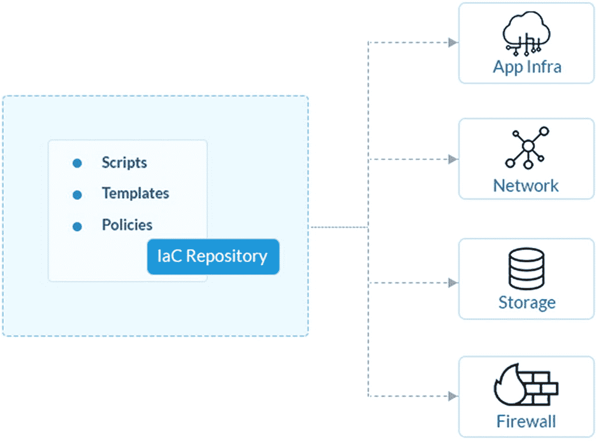

图 8-1

使用 IaC 控制和管理基础设施

在云世界中实现这一点的另一种更快速的方法是使用云生命周期管理工具，该工具与基于 ITIL 的现有流程集相集成，并通过易于使用的界面和与多个云提供商和模板的现成集成，以代码形式提供基础架构功能。像 DRYiCE MyCloud 这样的工具可以帮助组织以最少的设置时间实现代码形式的基础设施，并缩短上市时间。MyCloud 平台支持 VMware、SCVMM、AWS、Azure 和 GCP 环境，并与 IT 服务管理、服务目录、监控和管理工具以及 CI/CD 工具相集成，以提供开发和运营团队之间的集成。

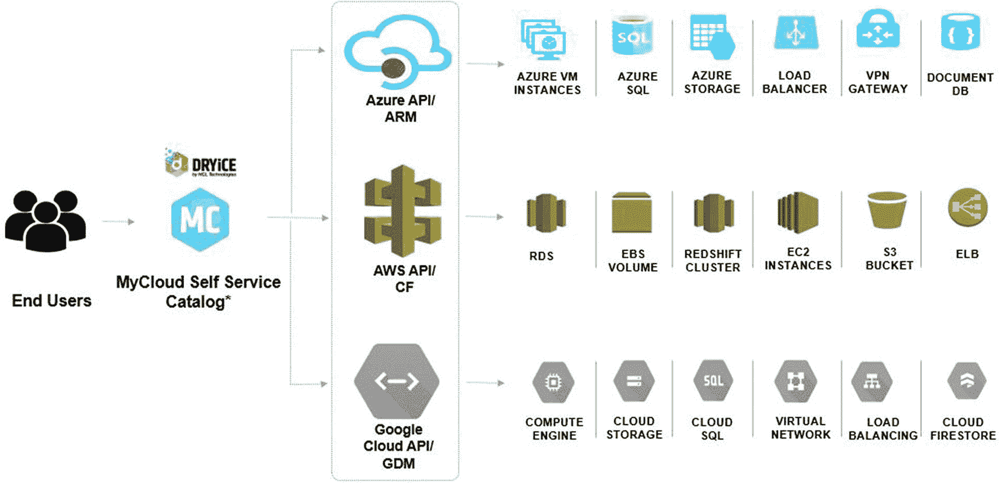

图 8-2

HCL 干冰 MyCloud，CLM 工具

通过代码管理和控制基础设施的组织可以通过自动化节省大量的工作，还可以避免人为错误。直接通过代码操作基础设施还允许团队跟踪谁做了更改，这些更改是何时做的，以及修改了哪些组件。随着基础设施的成熟，团队还会实施策略来确保基础设施中没有手动更改。如果正在执行手动更改，该工具会恢复这些更改，并向管理员发出有关此更改的警报。

表 8-1

IaC 的优势

 
| 

基础设施作为代码的优势

 |
| --- |
| 快速上市—即时部署服务器 |
| 促进协作—弥合团队之间的差距 |
| 标准化操作方法—最大限度地降低风险 |
| 可追溯性——审计和跟踪每个组件 |
| 优化成本—降低运营支出 |

## 使用 Scrum 作为代码开始使用基础设施

通向基础设施即代码的旅程从建立一个新团队开始。该团队通常被称为自动化或 DevOps 或 IaC 团队。这个团队的角色是使用基础设施作为代码工具，并与开发团队合作构建新的自动化用例。对于致力于构建组件的团队来说，Scrum 是一种理想的敏捷方法。这个开发运维/自动化团队定义了待定项中的故事，这些故事由团队在与利益相关者讨论后进行讨论和优先排序。他们构建基础设施管道，作为目录服务提供，并具有与开发管道集成的灵活性。基础设施组件以模块化的方式交付。该团队首先创建史诗，并对其进行审核、优先排序和预算，然后这些史诗被分解为 sprints 中运行的功能/故事。团队实践 Scrum 仪式，并且经常在冲刺阶段交付最小可行产品(MVP)。这个 MVP 在 sprint 结束时演示。MVP 或增强中的任何问题都被放回 backlog 中。参见图 [8-3](#Fig3) 。

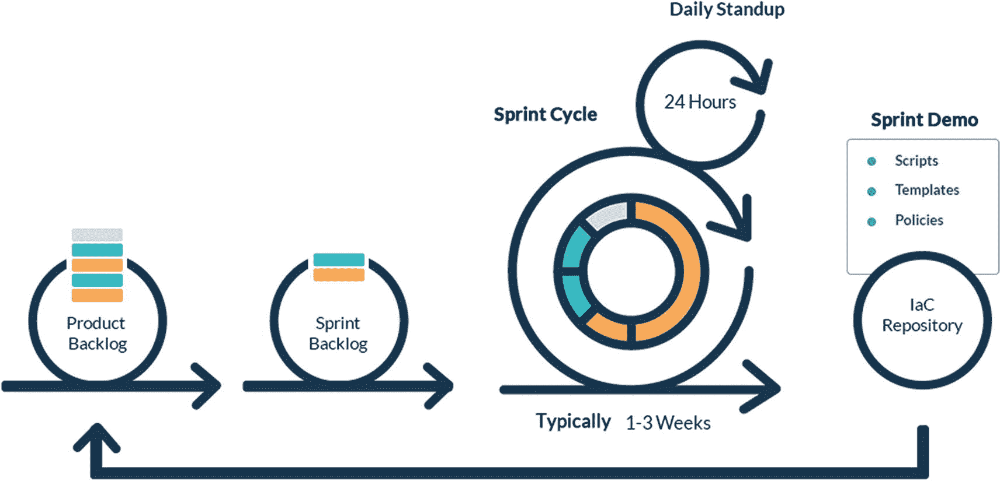

图 8-3

通过 Scrum 规划 IaC

要开始这个旅程，第一步是提高团队对新方法的技能，并让团队成员适应采用 Scrum。与敏捷过程一致的新角色定义被创建，如 Scrum master、产品负责人、AgileOps Scrum team 等。产品负责人负责定义需求，是业务、客户、应用程序开发团队和 AgileOps Scrum 团队之间的接口。这个团队的最终目标是以敏捷的方式标准化和自动化基础设施。当团队准备好在 Scrum 模式下工作时，一个平台也被确定，其中史诗和故事将被创建、更新和跟踪。重要的是，团队要学会操作这个工具，并能够将产品之旅可视化。

让我们快速浏览一下这个结构中的关键术语；参见表 [8-2](#Tab2) 。

表 8-2

Scrum 术语

  
| 

Scrum 术语

 | 

描述

 |
| --- | --- |
| **产品积压** | 这包括构建基础设施组件的史诗和故事。这些项目是与关键的涉众讨论的，然后记录在这个待办事项中。 |
| **冲刺积压** | 在每个 sprint 开始之前，高优先级的用户故事被识别出来，并转移到 sprint backlog 中。这个 backlog 中的故事是团队将要实现的。 |
| **每日站立** | 随着 sprint 的进展，团队每天开会 15 到 20 分钟，讨论他们的工作量和需要注意的风险。 |
| **冲刺周期** | 每次冲刺都有持续时间；有些团队两周跑一次冲刺，有些团队三周跑一次冲刺。但是一旦这个期限被决定，团队不应该被允许改变它。由于几乎没有关于基础设施运营冲刺的经验数据，您需要根据项目和团队规模以及技能来调整冲刺持续时间。 |
| **冲刺演示** | 在冲刺的最后，开发的产品或脚本由关键的涉众运行。任何缺陷或问题都会被记录下来并放回 backlog 中。 |

开始使用 Scrum 的一个好习惯是从 sprint 0 开始，这是团队的试金石。团队还可以重新审视 sprint 的持续时间，以及他们在 sprint 中可以交付的故事数量。例如，团队决定用七个成员进行为期两周的冲刺周期。他们确定了几个故事，并且在 sprint 结束时意识到两个星期的 sprint 周期是不够的。他们要么需要减少 sprint 中的故事数量，要么将 sprint 周期增加到三周。sprint 0 完成后，后续的 sprint 都要坚持这些原则。定义需求类型(史诗、特性、故事)之间的可追溯性是很重要的。团队需要就他们需要的不同需求类型达成一致。虽然有些人有四种类型，但也有一些人坚持只有三个层次，如史诗、故事和任务，这足以满足他们的旅程。像 Azure DevOps、JIRA 等工具。，提供这种能力来陈述这些不同的需求类型，并创建定制类型。在项目组合模型中，主题是在项目组合级别上创建的，然后被进一步分解为史诗、特性、故事和任务，它们分布在项目和团队级别上。参见图 [8-4](#Fig4) 。

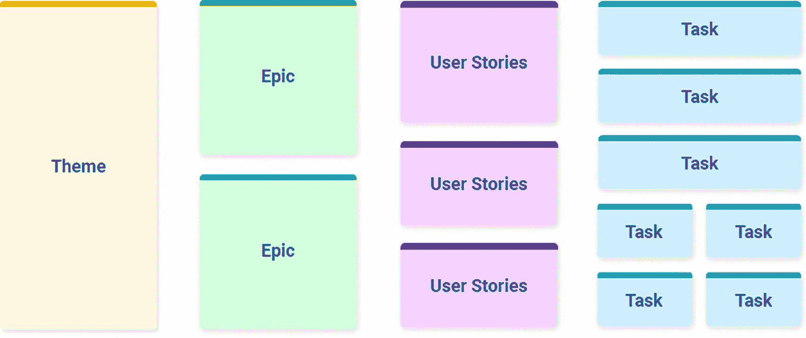

图 8-4

敏捷组件

sprint 交付的另一个成功因素是做出正确的评估。团队共同评估将要交付的故事，但是利用正确的技术会产生关键的不同。这些评估是在 sprint 规划会议期间完成的。每个团队成员都分享他们对评估的看法，并做出集体决策。在 sprint 规划会议的最后，团队需要确保所有的故事都经过评审并准备好实施，每个故事都经过评估并与 epic 或父实体相联系。Scrum master 通过在初始阶段指导团队敏捷最佳实践来促进团队。Scrum 主管和团队检查团队中的每个人是否都有故事要处理，并且没有成员被落下。还强调确保有足够的容量来完成故事，并且它们不会溢出到下一个 sprint。

## 评估故事

有各种方法可以用来评估故事。一些常用的技术有 t 恤尺码(XS 代表特小号，S 代表小号，M 代表中号，L 代表大号，XL 代表特大号)，数字尺码(从 1 到 10)，斐波那契数列(1，2，3，5，8，...)，等等。为了运行这些技术，有一些过程可以帮助团队获得最接近的估计值。像规划扑克这样的方法可以帮助团队以协作的方式选择正确的工作量大小(见图 [8-5](#Fig5) )。这种方法是基于团队的共同共识。在 sprint 规划会议期间，每个团队成员阅读一个共同的故事，并使用编号卡片分享他们的评估。然后，他们分享自己得出特定数字的原因。Scrum master 记录下该故事(所有成员)的最高和最低估计数字，并重复这个过程，直到团队就该故事的数字达成一致。

图 8-5

策划扑克，故事估算法

另一种常用的方法，主要由开发团队使用，是功能点分析(FPA)方法，其中功能根据其复杂性用功能点来标记，并且它也包括测试工作。例如，一个应用程序有四个需要编码或测试的关键功能，如用户界面、业务逻辑、数据库连接和测试。这些功能中的每一个都有基于其复杂性定义的点(如低、中、高和复杂)。参见图 [8-6](#Fig6) 。

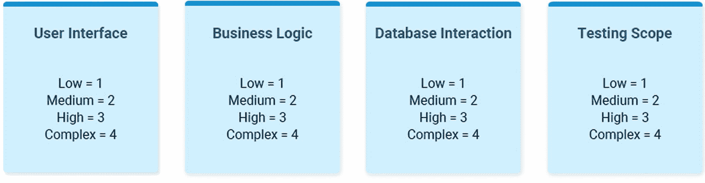

图 8-6

样本功能点分析

对于基础设施驱动的故事，t 恤尺寸是易于采用和实践的推荐技术。每件 t 恤的尺寸都描述了复杂程度。例如，一个小型的故事意味着它可以快速开发并且简单。另一方面，M 或 L 表示故事比 S 大小的更复杂，需要更多的开发时间。这些大小与表 [8-3](#Tab3) 中所示的斐波纳契数列相关联。

表 8-3

t 恤尺寸和等效故事点

   
| 

大小

 | 

描述

 | 

故事点

 |
| --- | --- | --- |
| **X 小** | 可在很短的时间内交付，非常简单。 | one |
| **小** | 可在短时间内交付，简单。 | three |
| **中等** | 在一个版本的范围内可交付，并且不太复杂。 | five |
| **大** | 在一个版本的范围内可能是可交付的，并且是复杂的。 | eight |
| **X-大** | 很大，但大体理解。需要在几个版本中进一步细分，非常复杂。 | Thirteen |
| **XXL** | 非常大且不确定的区域。需要进一步分解成不同版本的可管理的东西，而且非常复杂。 | Twenty-one |

我们有 XL 和 XXL 的 t 恤尺寸，但应该避免使用，因为一次冲刺的尺寸是两到三周，很难在一次冲刺中完成这些故事。因此，XL 和 XXL 用户情景应该被分解成多个 S、M 或 L 用户情景。

让我们假设这个示例用户故事:

> *作为一名管理员，我应该能够监控服务器的 CPU 利用率并生成警报，以便我能够主动纠正问题。*

为了评估这个故事，应该考虑以下几点:

*   了解范围，需要什么。

*   阐明最终产品，它是一个脚本或剧本。

*   为这个故事创建需要执行的任务。这可能是访问某些工具、服务器等。，用于监控其 CPU 利用率。

*   提供估计值。如果工具集成到位，那么只需要开发和测试脚本。然后，根据脚本需要满足多少操作系统，规模可以是 S 或 M。

Note

记住，每个故事都应该是独立的、简单的、可测试的。最初，团队可能会回避评估过程，但是通过正确的培训和指导，团队将会学习方法并认识到好处。毕竟，这是有效的容量规划所需要的。

## 定义验收标准

敏捷故事的另一个重要方面是定义验收标准。这意味着如果一个用户故事被推进或者被认为是完整的，那么它必须被彻底测试。这可以通过定义验收标准来实现。这可能发生在史诗层面，也可能发生在故事层面。在像 JIRA 这样的工具中，您可以定义一些字段来提示用户/业务分析师提及这个验收标准列表。如果所有列出的标准的结果都是真的，那么这意味着故事可以向前发展。测试应该包括功能和非功能领域。黄金法则是每个故事都应该与至少一个验收标准相联系。每个标准都以“给定-何时-然后”的格式编写，其中提到了场景和预期结果。在构建用户故事时，用它们来构建验收标准是一个很好的实践。

表 [8-4](#Tab4) 显示了一个示例用户故事。

表 8-4

示例用户故事

  
| 

故事

 | 

验收准则

 |
| --- | --- |
| **作为一名:**系统管理员**我想:**通过一个 REST API 模块**将工具 1 和工具 2 集成在一起，这样:**预警通知就可见并得到有效管理。 | **最佳情况:****给定:**工具 1 与工具 2 集成。**何时:**使用 REST API。**然后:**通知对系统管理员可见。**最坏情况:****给定:**工具 1 和工具 2 的集成未激活。**何时:**REST API 被停用/不起作用。**然后:**向系统管理员更新解体信息。**无功能情况:****给定:**工具 1 和工具 2 是一体的。**何时:**使用 REST API。**然后:**通知要每一分钟推送一次。 |

## 基础架构构建示例

让我们看一个史诗般的例子，它陈述了使用基础设施作为代码来配置基本基础设施(如 RHEL Linux)的需求。这部史诗是一个被分解成故事的大需求，每个故事都是经过深思熟虑和估算的。

有各种方法可以写出有效的故事；图 [8-7](#Fig7) 显示了最常见的一种。

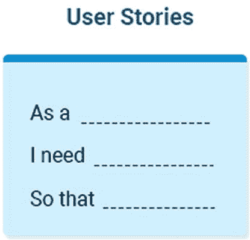

图 8-7

用户故事格式

这个想法是陈述为了特定的目的需要运行活动的用户角色。团队理解这一点很重要，当敏捷声明“在全面的文档之上工作软件”时，必须有一些最低限度的文档来支持实现。清晰地解释需求有助于跟踪未来的变化。这是 InfraOps 团队需要指导的领域。他们可能会发现这样的文档可能会很耗时。教练可以帮助训练这些团队，并使他们能够以正确的方式实施技术。例如，已经创建了一个 epic(高级需求)，称为“基本基础架构供应”在这部史诗之下，团队创建了相关的用户故事。每个故事都是一个独立的功能，团队将根据它来构建自动化。团队还花时间评估每个故事，并确保它得到良好的测试并按时部署。

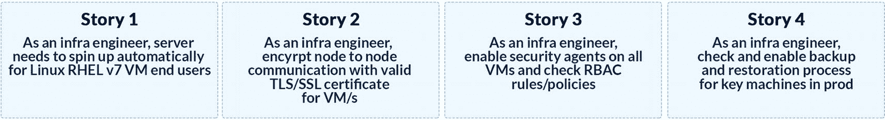

图 8-8

IaC 史诗和相关故事的例子

随着团队的发展和习惯 Scrum 方法，他们也学会了有效地评估故事，变得更加熟练。有一个敏捷实践者或教练会加速敏捷方法和实践的采用。这位教练与敏捷领导者和团队一起工作，指导他们如何写有效的故事，执行评估，通过仪表板跟踪团队进展，并使团队能够识别改进和自动化的机会。

## 工具管道

变化的另一个重要因素是，构建基础架构组件(无论是虚拟机、防火墙还是安装安全代理)的生命周期应该像在应用程序世界中一样实践 CI/CD。这意味着像应用程序管道一样，应该构建基础设施管道。因此，每次编写或修改新代码时，基础设施管道都会被触发，并贯穿自动化构建过程、单元测试、代码覆盖和安全漏洞检查。在自动化工具的帮助下，CI/CD 自动化是可能的，这些工具与 Jenkins 这样的指挥者相链接，从端到端运行整个管道。因此，当团队在方法上获得技能提升时，他们也需要在构建基础设施管道所需的工具上获得技能提升。

表 [8-5](#Tab5) 中的工具通常用于整个产品生命周期。这里提到的产品是作为特定领域的代码脚本的基础设施的集合。许多组织都有一个定义良好的原型工具包，它在组织中是标准化的。当然，遗留基础设施也会有参考工具。开始时决定正确的工具是成功实施的关键一步。有些工具对团队来说可能是新的，因此他们应该掌握新的工具和技术，以便在 sprint 执行期间，他们不会面临问题。随着越来越多的故事被交付，团队向前迈进，将他们的管道与服务目录集成。

表 8-5

管道阶段和常用工具

  
| 

面积

 | 

常用工具

 |
| --- | --- |
| **策划** | 吉拉/斯诺 |
| **版本控制** | Git/GitHub |
| **开发** | ide/SDK |
| **建造** | Ant/Maven |
| **工厂** | -肯尼迪 |
| **测试** | sonar cube/Selenium/Wireshark |
| **编排** | 詹金斯 |
| **基础设施建设** | Terraform、dryice mycloud |
| **展开** | Terraform/Ansible，HCL 发布 |
| **监视器** | solarwinds/Nagios/zabix |
| **安全** | HCL 应用扫描 |
| **仪表板** | grafana/API |
| **文档** | SharePoint/融合 |

## 基础设施作为代码示例

让我们看一个场景，一名工程师需要调试一个新的虚拟机。他们访问 ServiceNow 等 ITSM 工具，并查找允许他们提交虚拟机调配申请的目录项目。一旦请求获得批准，相关的基础设施管道就会自动触发并设置虚拟机，而无需任何手动干预。以前这样的请求需要两到三周的时间，但是现在只需要一个小时。许多组织已经意识到了这些优势，并致力于首先实现不需要手动输入的基础架构需求的标准化和自动化。图 [8-4](#Fig4) 中的工作流显示了用户如何通过 ITSM 工具启用和停用虚拟机。一旦他们的请求得到批准者的批准，该请求将被定向到像 Jenkins 这样的流程编排工具，从而触发相应的作业。该作业进一步从存储库中调用脚本来执行。完成后的状态会在 ITSM 工具中更新，从而通知提交票据的用户。工作流程中的任何问题都会立即通知支持团队。在 ITSM 确定并实施了类似的使用案例，以促进自助服务文化。

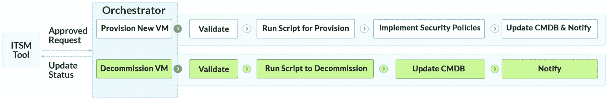

图 8-9

IaC 自助服务

有多种工具，如 Jenkins、TravisCI 等。，它支持这样的编排，并充当 ITSM 和其他工具之间的集成桥梁。这些工具通过调用完成动作的相应作业来触发自动化。这个动作可以由一个或多个工具来执行。例如，假设我们有一个构建 Amazon 机器映像(AMI)的用例。这是可能的，首先在 AWS 上运行一个新的虚拟机，安装所需的软件，然后构建一个半生不熟的 AMI，然后成为一个可重用的模板。

我们将设计利用云原生工具来自动化一系列作业的管道，如表 [8-6](#Tab6) 中所述。

表 8-6

使用云原生工具创建管道

  
| 

工具名称

 | 

目的

 |
| --- | --- |
| **AWS 代码提交** | 另一个 AWS 服务托管安全的基于 Git 的存储库。 |
| 詹金斯 | 用于设计和实现管道(构建 CI 和 CD)的开源工具。 |
| **自动气象站云的形成** | AWS 服务，帮助设计易于管理且可重复的模板。它有助于将基础设施实现为代码。 |

图 [8-10](#Fig10) 描述了这些接口之间的集成点。IaC 脚本在 AWS CodeCommit 中进行版本控制，Jenkins 被配置为每当 AWS CodeCommit 中有新的更改更新时触发编排。

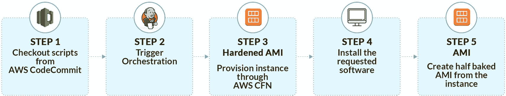

图 8-10

AWS 上的 IaC 示例

下面是这个简单的 IaC 管道的详细信息:

1.  Jenkins 将从 CodeCommit 中检查出在存储库中看到的任何新变化的脚本。存储库是保存源代码的容器，源代码可以包含脚本、配置工件等。，以及 IAM 权限来控制对 Git 存储库的访问。

2.  Jenkins 被配置为在 Git 存储库中的新变更上触发管道。类似于它调用脚本的方式，Jenkins 可以很容易地配置为调用其他工具。

3.  AWS CFN 脚本使用强化 AMI 执行和提供 AWS 实例。在 CFN 脚本的地方，可能会有其他脚本，如 Ansible 剧本或 Terraform 脚本或 DRYiCE MyCloud 模板，它们将启动实例。

4.  一旦实例被委托，脚本将根据需要进一步安装所请求的软件，如软件、配置文件或平台和数据库。

5.  脚本将最终生成一个 AMI(已配置)，然后实例被解除，这是为 AMI 的创建而准备的。

类似的用例被设计成与多个基础设施相关联的代码管道。每个管道都帮助团队加快交付时间，并减少应用程序开发和测试团队的等待时间。随着管道的实现，团队的下一步是将基础设施管道与应用程序管道集成。这个想法是培养 DevOps 的文化，其中两个团队都理解产品和底层基础设施需求。IaC 存储库也对开发团队开放，以便在基础设施上实现更多的用例。使用这种方法，开发团队可以使用基础设施提供的 API 作为代码工具，并调用这些 API 作为他们开发管道的一部分，以按需启动基础设施。

## 整合 IaC 与开发管道

随着 IaC 在组织中的成熟，下一步是与其他团队集成和扩展 IaC 管道。整合应用程序和基础设施管道的一个很好的例子是蓝绿色部署的需求(见图 [8-11](#Fig11) )。这是实现 CD 原则的最佳实践，当整个端到端生命周期通过管道自动化时，这是可能的。在类似生产的环境中，每个新的部署都要实施蓝绿色部署。因此，建立了一个新的环境，并在其上部署了新的应用程序版本。一旦通过验证，现有的基础设施将被移除，流量将被路由到这个新的基础设施。

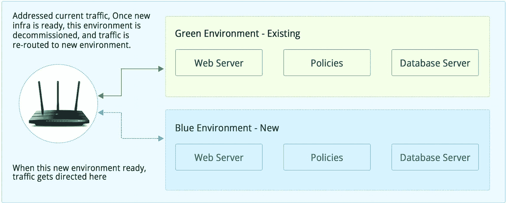

图 8-11

蓝绿色部署

随着新环境取代旧环境，这有助于避免在同一环境中部署工件时通常会出现的任何配置问题或兼容性问题。所有这些都是在集成在管道中的自动化工具的帮助下实现的。当开发人员签入代码时，CI 管道验证代码的完整性并执行单元测试。所有这些工作都在开发人员分支上进行管理，开发人员分支或者从功能分支或者从主分支进行详细描述。一旦代码被集成和测试，它就被转移到开发环境中，在那里执行进一步的测试，并检查代码质量。CI 成功后，我们转向 CD，进一步支持二进制文件从一个环境到另一个环境的迁移。在将二进制文件移动到必须按需构建的环境中时，会调用 IaC 管道。一旦 IaC 管道启动了所需的基础设施，它就会在这个新的基础设施上部署应用程序代码，并通知利益相关者。不成功的部署被回滚，并通知各个团队进行适当的更改以重新运行管道。参见图 [8-12](#Fig12) 。

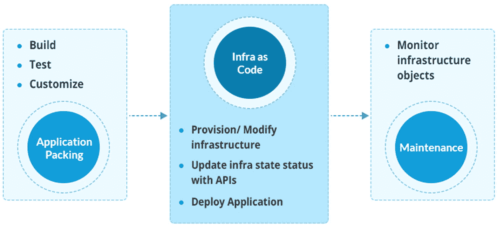

图 8-12

连接应用和基础设施工作流

另一方面，成功的部署使监控代理能够持续监控应用程序和基础设施。这个循环重复了“n”次，每次执行时，团队都会了解差距并随机应变。

## 扩展 IaC 示例

一旦 IaC 管道准备就绪，它们就可以扩展到其他团队，比如开发团队。首先，让我们看一个基本的应用程序管道，它集成并测试任何新的代码片段，这些代码片段被检入源代码存储库。稍后，我们将深入探讨如何利用应用程序管道来扩展 IaC 管道，该应用程序管道利用以下工具集:

*   *AWS 代码提交*:源代码版本控制

*   詹金斯:协调管道

*   *ASOC/索纳库*:静态代码分析

*   JUnit/NUnit:Java 和。NET 源代码

*   *Maven* :构建应用源代码

*   *JFrog Artifactory* :二进制库

应用程序管道旨在持续集成新代码，从而实践持续集成的原则。如下所述，为每个步骤创建和评估故事:

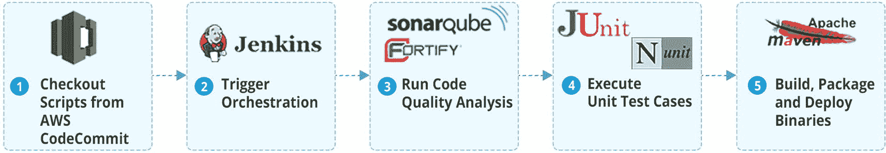

图 8-13

AWS CI 管道示例

1.  最新的源代码从 AWS CodeCommit 存储库中签出。

2.  Jenkins 触发管道并协调 CI 工作流。

3.  SonarQube 分析源代码的代码复杂度、代码覆盖率等。这是质量检查的第一步，也称为*静态应用安全测试* (SAST)。这是一个鼓励左移测试的关键实践。它有助于在生命周期的早期分析代码缺陷。像 HCL ASoC，Fortify，Parasoft JTest 等工具。，是该领域中使用的其他众所周知的工具。

4.  Junit 和 Nunit 测试框架在检出的代码上运行单元测试用例，以扫描覆盖率和功能检查。这是走向主动测试的又一步。

5.  Apache Maven 构建生成二进制文件的源代码。这些二进制文件被推送到 JFrog Artifactory 之类的工具中，当 CD 管道被触发时，这些工具就会被拉出来。参见图 [8-13](#Fig13) 。

前面的应用程序管道的结果是包含最新二进制文件的工件。然后将这些二进制文件部署到测试环境中，以运行功能和性能测试。测试环境不得不被封锁进行测试的日子已经一去不复返了。如今，这些环境是使用 IaC 管道按需提供的。IaC 管道提供和配置新的基础设施，从 JFrog Artifactory 获取最新的二进制文件，并部署代码。这个环境现在通过 Selenium、Fortify 等工具调用功能/性能测试脚本。随着管道的创建和集成，它们也可以与用于基于目录的服务请求的 ITSM 工具集成。

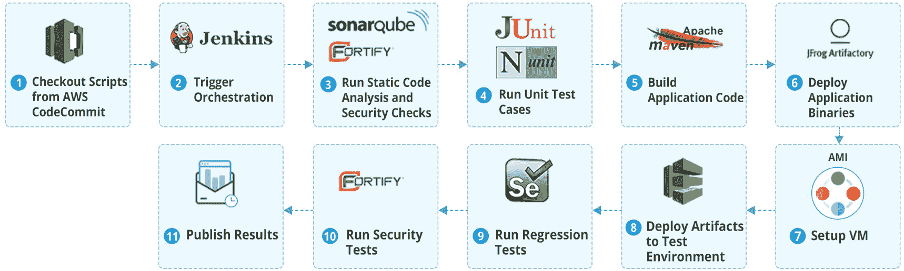

图 8-14

集成基础设施和应用程序管道

图 [8-13](#Fig13) 描述了 Jenkins 如何首先触发应用程序管道并部署二进制文件。这就完成了 CI 方面。一旦二进制文件准备好进行部署，就可以调配和配置基础架构组件。在本例中，调配的是 AWS AMI。一旦环境准备好了，工件就被部署了，这就启动了 CD 方面。在这个新的测试实例上，使用 Selenium 等工具对应用程序进行回归和功能测试。一旦测试完成，结果就会公布。在这一步之后，可以停止使用为测试而配置的环境。这个简单的场景有不同的步骤，每个步骤都通过一个由 Jenkins 触发的脚本来管理。实现这样的场景需要一个定义良好的计划，该计划确定应该自动化并添加到管道中的关键用例。如前所述，这些管道也可以通过 ITSM 工具触发。

## 使用 Scrum 采用 IaC 时的关键敏捷实践

以下是主要实践:

*   定义高水平的史诗。前面的例子可以说是一部史诗。这是一个大的需求，将有多个故事。

*   创建与史诗相关联的故事，并有一个负责人按照规定的时间表处理这些故事。

*   构建管道时的问题或风险应在与团队的日常会议中提出。

*   在规划冲刺时，与团队一起定义清晰的期望和可交付成果。

*   不要试图在一次冲刺中完成一个完整的管道；相反，跨 sprints 定义它，并作为 MVP 持续交付它。

*   每个故事都需要有明确的描述和接受标准。

*   在冲刺开始之前，团队的能力应该是可见的。

*   鼓励团队成员领导日常通话，并对他们的故事负责。

*   故事可以有任务，并避免子任务，因为它们在一段时间后变得难以管理。

*   在每个 sprint 计划会议中练习故事评估。

## 摘要

基础架构作为管理基础架构的代码方式正在取代传统的基础架构供应、停用、修补和升级流程。一旦基础设施团队接受了敏捷概念和工具的培训，他们就可以开始创建一个按优先顺序排列和执行的故事积压。有几十种工具可供团队采用，以代码形式实现基础设施，如 Terraform、Azure Resource Manager (ARM)、Puppet、Chef、HCL MyCloud 和其他云原生工具。新模型将工程方面引入基础设施运营，并利用了敏捷的开发方式。IaC 管道以与开发管道相同的方式运行，其中它集成了多种工具，如版本控制、静态代码分析、安全性分析、单元测试、构建和部署、测试等。为了快速采用基础设施作为代码并转向敏捷开发，组织需要关注以下关键领域:

*   具有 IaC 采用愿景的清晰路线图

*   识别源代码控制、测试、部署、扩展等工具。

*   提升团队对 IaC 概念和工具的理解

*   确定要实现和集成的用例

*   企业何时以及如何提供自助服务的时间表