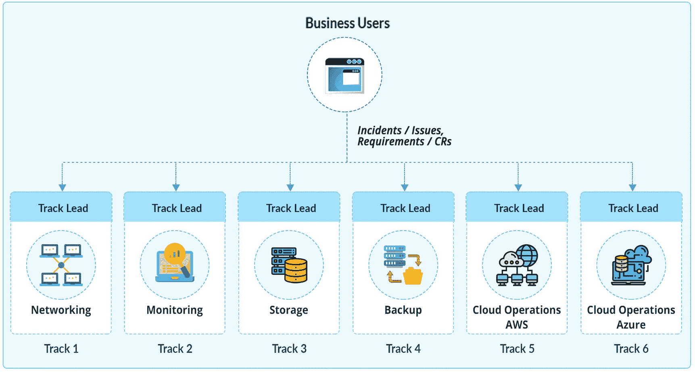
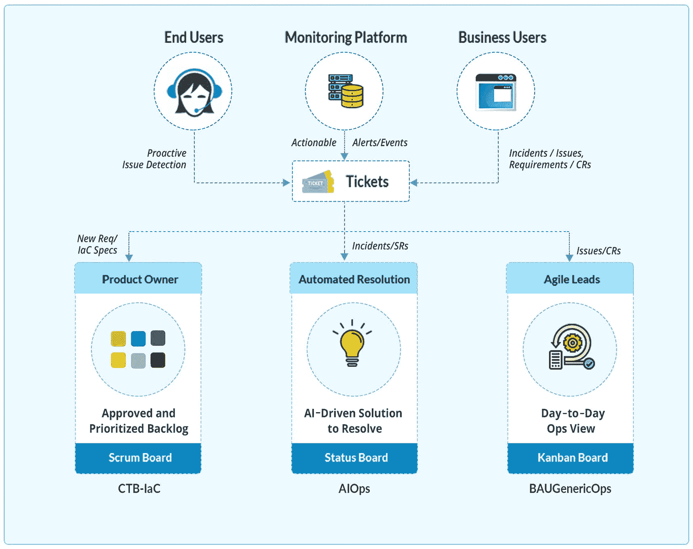

# 9.成功之路

本章介绍了一个关于 AgileOps 的案例研究。本章将涉及的主题如下:

*   实现 AgileOps 的案例研究

*   我们企业 Alpha 的新运营模式

*   结果

在前一章中，我们研究了不同的敏捷方法、框架和实现方法，以计划和执行基础设施运营领域的敏捷之旅。没有一种完美的方法适用于所有组织。选择哪种方法的决定是棘手的，有时也令人困惑。每个框架都受到敏捷原则的支持，没有必须遵循的严格要求。渴望过渡到敏捷工作方式的 IT 组织非常了解他们的组织，因此可以决定哪种方法/框架对他们最有利。已经有许多跨多个行业的组织在最初的迭代中使用一种方法取得了成功，而其他行业使用“原样”方法无法取得成功，但仍然通过定制方法来满足他们的需求而取得了成功。当应用团队采用敏捷文化时，转变基础设施运营团队是一个挑战。大型企业以人员和自动化为关键基础支柱，规划两到三年的转型路线图。当团队接受新技能和仪式的培训时，他们也发现了自动化的新机会，新的团队和角色形成了。

## 实现 AgileOps 的案例研究

我们已经深入研究了流程和最佳实践，并看到了如何在基础设施即代码场景中使用这些流程和最佳实践的实际示例。现在，我们将通过一个详细的案例研究，根据我们到目前为止所学的知识，了解如何创建团队结构。我们假想的公司 Alpha 分布在全球各地，执行董事会决定赞助他们的基础设施运营团队的转型。当前的基础架构运营团队有多个团队负责管理内部硬件、网络、监控、存储和备份，最近开始支持 AWS 和 Azure 上的云运营。见图 [9-1](#Fig1) 。

图 9-1

基础设施 IT 运营的传统模式

Alpha 还决定不进行“大爆炸”,将首先与监控团队一起开始向敏捷转移。当前的监控团队管理并支持多种工具来监控数千台服务器和应用。这些工具中嵌入了预定义的阈值，可以通过电子邮件主动提醒基础设施工程师。该工程师手动检查警报，解决潜在问题，并更新知识库(KEDB)。首先转变这个团队的主要期望是使处理警报的方式现代化。此外，应用正在向云迁移。Alpha 为两年内采用人工智能驱动的运营制定了一个清晰的路线图。正在为这一新的组织变革以及投资新工具和提高团队新技术技能规划和批准资金。

为了实现、跟踪和执行这一新的转型路线图，组建了一个名为 AIOps 的集中式专门团队。这个团队的成员是顾问和从业者，他们写出细节并定义要推出的新结构。他们根据以下关键因素评估当前的监控团队:

*   Scrum/看板的敏捷能力

*   新技术专业知识

*   当前运营工作量

*   当前项目工作量

*   以周期时间等指标衡量团队绩效

*   过去实现的自动化场景

当先决条件被评估和基线化时，团队决定重组团队，如表 [9-1](#Tab1) 所示。

表 9-1

传统 it 运营和敏捷 it 运营的比较

   
| 

团队名称

 | 

敏捷方法

 | 

评论

 |
| --- | --- | --- |
| **BAU-通用运营部** | 看板法 | 将传统的监控运营支持转变为敏捷方式。团队成员“拉动”工作，承担更多责任。 |
| **CTB-基础设施运营** | 混乱 | BAU 成立了一个新团队，为自动化的优先用例创建 IaC 管道。 |
| **AIOps 团队** | 混乱 | 另一个新的团队，通过再培训和雇佣的结合，在 AIOps 上工作。这个团队负责在环境中部署 AIOps 的冲刺。 |

该团队还将创建一个工作流，定义监控警报如何在转换后做出响应。每个监控警报都将通过 ITSM 工具进行跟踪。这些警报将由 AIOps 或最终用户或业务用户创建。此外，还为 AIOps 设定了清晰的愿景，这将改变新生态系统中的警报响应方式。AIOps 只有在与智能操作手册自动化工具集成时能够自动解决监控问题时才会有所帮助。Alpha 的管理层已经评估了具有事件关联功能的工具，并为其实现提供了资金，该实现将分阶段推出。

请注意，有许多可用的工具，如 Moogsoft、Splunk、Zenoss，以及自动补救工具，如 DRYiCE iAutomate，它们使组织能够加快事件解决流程，并且也是 SREs 的合适工具。参见图 [9-2](#Fig2) 。

图 9-2

基础设施 IT 运营的新工作模式

## 阿尔法的新运营模式

这是新的运营模式:

*   CTB-IaC 团队:这是自动化团队。与基础设施设置相关的新要求将通过 IaC 管道进行管理。这个团队将在 Scrum 模式下工作，并将基于优先化和批准的需求交付管道。该团队将构建可重用的模板，这些模板通过 ITSM 工具进行版本控制和编排。他们还将关注各种重要的基础设施组件，如网络、防火墙、RBAC 实现等。，同时建造管道。

*   *AIOps 团队*:这个团队将配置新的解决方案，以监控和自动解决常见问题。他们将识别用例并将数据输入到解决方案中。AIOps 系统将利用分析和机器学习功能做出正确的决策；例如，它将自动解决问题并更新 ITSM 工具。所有确定的用例将在 BAU-通用电气公司团队的帮助下在系统中进行讨论和配置。由 AIOps 解决方案管理的每个用例都旨在减少票证数量并确保提高系统可用性。这个团队将以 Scrum 模式开始项目，交付核心特性和功能，然后在项目进入运营阶段时转向看板，同时继续运行 sprints 进行增强和更新。

*   *BAU-通用电气公司*:这是一个传统的基础设施运营团队，将通过实践看板来解决中断和其他日常运营活动，从而转变为一个敏捷运营团队。AIOps 解决方案无法解决的警报或票证将由该团队提取，以便快速解决。该小组将继续跟踪问题和解决方案，并更新他们的知识数据库(KEDB)。他们还将与其他两个团队合作，尽可能自动化 AIOps 解决方案中的用例。

## 结果

最终目标是优化和自动化监控领域的一切可能的事情。初始阶段将有三个团队，但是随着 AIOps 的成熟，另一个 BAU-GenericOps 团队将变得精简。Alpha 将通过实现这样的模型获得多种好处。

*   *协作*:高度联系的工程团队，他们具有交叉技能，并与具有共同愿景的产品团队密切合作，向最终客户交付和支持质量体系。

*   *弹性*:设计、构建和部署经过良好测试且符合规范的系统的能力。

*   *自助服务*:授权产品团队根据其交付渠道的需要扩展系统。

*   *左移安全*:在系统的每个阶段嵌入安全策略的能力。

*   *持续改进*:随着每次迭代学习和扩展的能力。通过 AIOps 尽可能自动化，为敏捷和 SRE 团队提供所需的工具和技术，以实现他们快速减少工作量和增加可用性的目标。

## 摘要

每个组织都有独特的需求、工作方式、当前结构和业务目标。本章介绍了使用敏捷基础设施运营组织基础设施团队的各种方式。这可以作为设计组织结构和流程的指导。转型需要根据组织的需求和限制分阶段进行规划。团队应该准备好测试和失败，然后改进。每个模型都强调敏捷和 DevOps 实践，如 CI/CD、基础设施即代码、站点可靠性工程、Scrum、看板等。归根结底，重要的是转型应该创造和培育信任和可见性的文化。新的工具和技术确实增强了团队的能力，但是如果它们没有被有效地使用，那么敏捷的愿景将会消失。