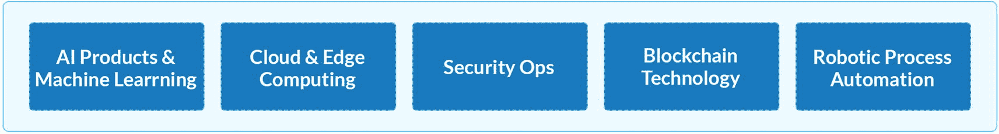

# 10.经验和前进的道路

在本章中，我们将讨论企业的下一步是什么。本章将涉及的主题如下:

*   我们的学习

*   需要关注的新兴趋势

*   后续步骤

*   结论

随着云、基于微服务的架构、站点可靠性工程等领域的发展，组织正在重新思考他们应该如何运营。他们已经认识到灵活性、弹性和自动化是当前的需求。虽然许多人已经开始向这种新的规范过渡，但仍有一些团队需要在为时已晚之前迅速转换到新的工作方式。所以，这一章涵盖了我们所学到的东西以及如何前进。

## 我们的学习

以下是我们了解到的情况:

*   成立一个小团队来自动化基础设施；这是一个采用基础设施作为代码原则和工具的团队。该团队可以驻留在基础架构层级中，也可以位于应用程序和运营团队之间。一些组织称这些团队为 DevOps 团队。

*   创建一个可供开发人员使用的可重用工件和模板的中央存储库。通过这种方式，您可以授权应用程序团队自己建立环境。如果你想加快运营速度，投资云生命周期管理和 AIOps 工具，如 Moogsoft、Zenoss、DRYiCE iAutomate 和 DRYiCE MyCloud。

*   确定可以自动化的用例并对其进行优先级排序，例如寻找将基础设施管道与应用程序管道相集成的方法。

*   为你今天的进展设定基线，并定期跟踪进展。这成为其他团队参考和采用的好案例。

*   如果你走在数字化的道路上，那么就计划采用 AIOps。自动化是驱动敏捷性的关键杠杆。

*   在整个管道中嵌入安全原则，以避免漏洞，并确保按照定义的合规性规则交付工作。

*   如果需要的话，重新审视团队结构并定义新的角色来提高团队士气。还向团队成员介绍新技术培训。

## 需要关注的新兴趋势

技术可以加快能力的部署，但最终是人需要使用这些技术来发挥他们的潜力并实现好处。因此，人员和文化变革是敏捷基础设施运营走向成熟的关键。新的角色正在被引入，以鼓励团队采用这种新的文化变化，其中团队朝着共同的愿景工作，利用共同的工具和平台，并升级到新的技术，如云、基础设施即代码、AIOps，当然还有敏捷等方法。标准化基础设施设置、合理化工具、发现自动化机会以及消除浪费都是运行 AgileOps 团队的关键驱动因素。面对所有这些新趋势，如果团队没有为这些变化做好准备，路线图将会变慢。因此，团队掌握新的技术和流程以及投资是非常重要的。

图 10-1

一些关键的 IT 趋势

仅仅实现一个敏捷工具是不够的。理解需求和实践概念很重要。此外，成功在于团队协作，以及随着团队在通往敏捷性的道路上扩大规模而不断改进。在敏捷教练或实践者的指导下，从传统到敏捷的过渡获得成功，他们创建具有里程碑的路线图，指导团队远离耗时的过程，采用新的现代平台，测量和跟踪指标，并指导团队新的方法和实践。教练与团队合作定义分阶段滚动的新战略，并持续监控进度，以便根据需要重新调整计划。然而，由于将敏捷应用于基础设施运营是一个新兴的领域，本书旨在从现实世界的实施中提供指导，可以用来快速跟踪敏捷基础设施运营之旅。新的指南和数据将在伙伴网站 [`http://agileinfraops.com`](http://agileinfraops.com) 上不断提供和更新，以便读者能够在持续的基础上进一步增强他们在该主题上的知识。我们很乐意倾听读者的意见、反馈以及在`feedback@agileinfraops.com`为云、基础设施和应用运营部署敏捷的成功案例。

组织还在考虑如何为承载传统应用程序的传统基础架构带来灵活性。新的客户需求为重新审视应用程序的开发方式以及与其他组件或应用程序的交互方式铺平了道路。一些组织计划对遗留应用程序进行现代化改造，并使用云原生技术和容器技术将它们迁移到云中。容器化帮助许多组织随时随地部署应用程序，而不会面临配置、连接、兼容性等问题。支持这项技术需要智能工具，使应用程序团队能够构建和部署应用程序。像 Docker，Kubernetes 等工具。，正在被团队试用和采用，以更好地管理资源和应用程序。

团队可以通过在迭代中实现正确的技术和实践敏捷来获得最大的利益。当前的时代是一个忘却和学习新技能并不断进化的时代。只有当团队配备了正确的生态系统，专注于消除团队之间的障碍时，他们才能朝着这个目标前进。无论是 Scrum 还是看板，直到团队理解了方法论的重要性，他们才能进步。如果一个组织开始使用 IaC，那么 Scrum 是一个理想的选择。另一方面，如果要改造传统运营，那么看板是一个理想的选择。在教练的帮助下，可以很容易地做出这个决定，教练可以评估团队结构和当前的工作模式，并提出相关建议。这些建议被划分了优先级，并与具有明确时间表的里程碑对应起来。

我们也接受了这样一个事实，即基础设施运营再也不能在各自为政的僵化流程中工作了。他们必须与开发团队、QA 团队和安全团队合作，以确保产品交付得到很好的整合，并且他们可以快速接触到最终客户。这是通过寻找在这些团队之间架起桥梁的用例来实现的。教育团队使用提供灵活性和端到端可见性的现代平台，确保从长远来看，这些团队在本质上变得有凝聚力。云、无服务器计算、边缘计算、软件定义的基础设施和 AIOps 等现代技术都在鼓励组织转向敏捷工作模式，以更快地交付成果。因此，需要将基础设施向现代化和数字化方向发展，因为应用程序也在升级或现代化。开发和运营世界都需要连接和协作来交付高效的结果。当他们停止抵制变化并更快地部署这些变化时，这是可能的。敏捷的思维方式在这个方向上起到了助推器的作用。指导团队了解敏捷的好处，并帮助他们变得敏捷，这是持续发展的关键。是的，激励和资金是开启这一旅程的关键。需要一个精心规划的企业战略，以敏捷性为基础，解决安全性、合规性、法规、风险和弹性问题。

## 后续步骤

敏捷自 2001 年以来一直在发展，今天它已经成为每个需要生存的 it 组织的必备。有人称之为项目管理方法，也有人称之为工作方式。其余的人认为这只是一个“导致精益的过程变化”在任何情况下，术语*敏捷组织*是一种趋势，它意味着应用程序、运营和其他相关团队以敏捷模式工作的组织。这些机构设计、开发和运营产品的速度提高了五倍。各种敏捷方法也被修改，适用于不同场景的混合版本可供使用。协作、保持相关性、快速克服意想不到的变化，以及从“做敏捷”到“成为敏捷”都是组织不能忽视的进化之旅。随着这一旅程的推进，基于价值的决策将变得非常重要。公司需要向客户传递价值，而不是只关注数量。他们需要贴近客户，以获得他们的反馈，并不断即兴创作。

谈到基础设施运营团队，他们可以提供的价值是他们运营和设置环境的方式、通信模式，以及最重要的“敏捷”这将通过提供所需的优化流程来实现。团队之间必须有信任和透明度，每个人都有一个真实的窗格，一套标准的工具和自动化工具，以及一个定义良好的框架来重用和即兴创作。自我管理的团队将会出现，并继续推动成功因素。随着公司重塑自我，团队将变得更容易管理。事实上，当权力和责任被分配时，一些人称之为扁平结构。

与安全部门的协作将不再各自为政；还将引入在开发和运营管道的每个阶段自动进行安全检查的方法和工具。例如，IaC 团队将继续在他们的管道中引入安全检查，以检查各个方面，如符合性分数、漏洞问题、策略符合性等。，并且只有在成功的情况下才继续。将监控技术债务以捕捉改进。重复性动作将继续自动化，从而导致精益和人工智能主导的运营。

## 结论

如果您还没有开始您的敏捷之旅，那么现在还不算太晚。您应该确定您的需求，选择正确的敏捷框架，并不断发展。结合敏捷、DevOps、SRE、精益和 DevOps 的精华，将帮助你培养协作，提高生产力，并朝着“敏捷”的方向发展

最重要的是，你需要一个清晰的计划，让你朝着成功前进。对敏捷的需求不再是可选的；这是一种新的运营方式，现在是时候让您的团队采用这种方式，为自我管理的团队建立一个生态系统，这个生态系统是负责任的、交叉技能的，并准备好迎接新的挑战！