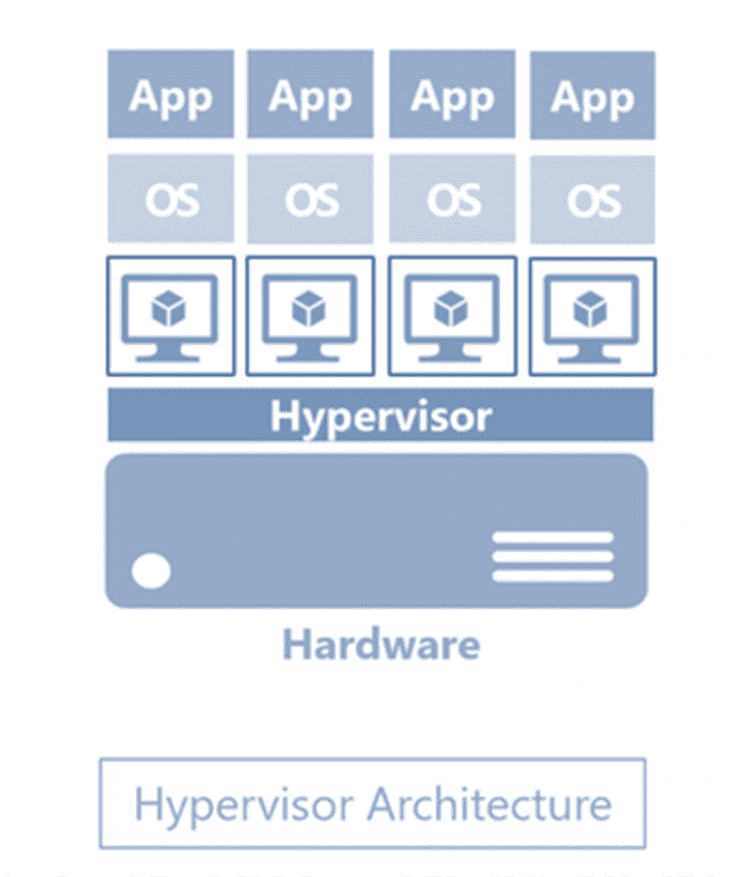
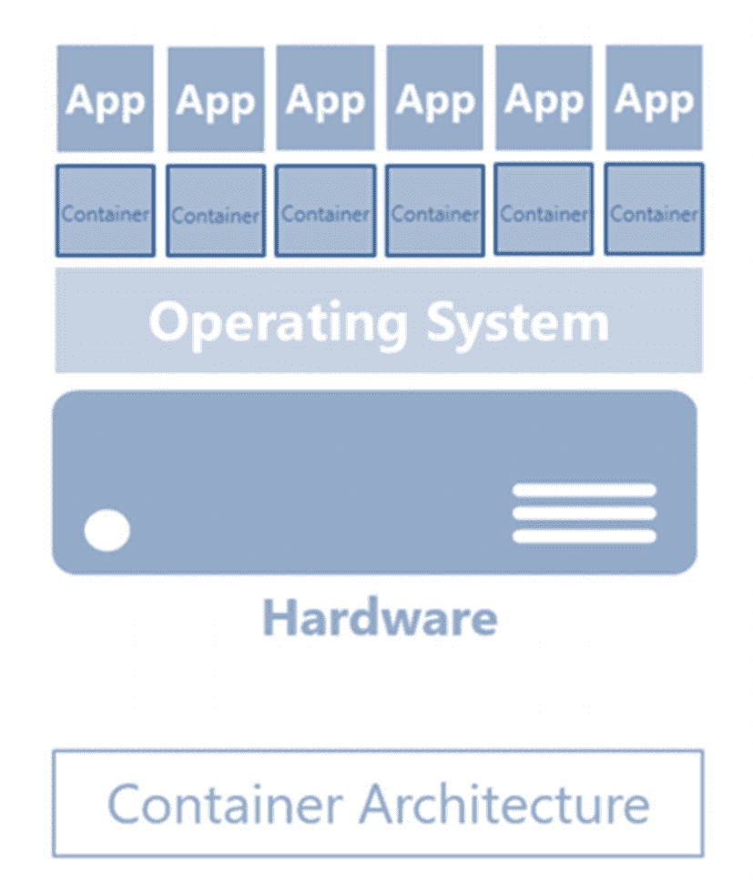

# 一、容器介绍

> *那些记不起过去的人注定要重蹈覆辙。*
> 
> —乔治·桑塔亚纳

容器技术正在改变我们开发、部署和运行软件的方式。虽然这看起来像是一种突然冒出来的技术，现在正在接管 it 组织，但事实并非如此。

在这一章中，我们将回顾一下容器技术的历史以及它是如何发展的。你可能会想:“我讨厌高中的历史。”我完全可以理解。我读高中大学历史，唯一目的就是为了回答试题。我讨厌记名字和日期。那么，为什么还要纠结于容器技术的历史呢？

历史给了我们后知之明，这是你第一次经历某事时所没有的。当别人已经做了你正在努力完成的事情时，你可以从他们学到的经验中受益，从他们的错误中受益，你可以避免他们的错误，也可能从那些看起来不知道从哪里冒出来的模式中受益。这些历史课充满了洞察力，可以帮助你更好地理解技术或世界。这些年来，我学会了欣赏历史，以及它如何塑造了我们当前的现实——更好的是，我如何改变我的现在，以便我可以塑造未来。

我们还将关注 Docker，Inc .这家公司，它是当今应用最广泛、最受认可的容器技术开发的幕后推手。

如果不将其与虚拟化技术进行比较，围绕容器技术的对话将是不完整的。我们将花一点时间来看看两者之间的相似之处和不同之处。

最后，我们将看看微软是如何为 Windows 和 SQL Server 采用容器技术的。

## 30 年前的最新技术

当我得知容器技术可以追溯到 1979 年时，我很惊讶。正是 Unix V7 允许进程在操作系统级别隔离运行——隔离和保护一个进程不受另一个进程影响的能力。这个想法的产生是因为需要同时在许多用户之间共享非常昂贵的计算资源。回想一下大型机只能完成一项需要几天甚至几周才能完成的特定任务的时代。

然而，像其他没有被广泛采用的技术创新一样，进程隔离技术变得停滞不前。直到 2000 年，类 Unix 操作系统 FreeBSD 引入了 Jails——一种将计算机系统划分为几个独立的迷你系统的机制，每个系统都有自己的文件、进程和安全性。您可以将此视为我们今天所知的虚拟化技术的早期阶段。

实现进程隔离技术的几个变体随后发展起来，包括 2001 年的 Linux VServer(允许操作系统级虚拟化的 Linux 内核补丁)、2004 年的 Solaris Containers(前 Sun Microsystems 的操作系统级虚拟化实现)和 2005 年的 Open Virtuozzo。2006 年，Google 为 Linux 内核添加了自己的东西，并将其命名为 Process Containers，后来又将其重命名为 Control Groups ( *cgroups* )，以避免与 Linux containers 上下文中的 container 一词混淆。

2008 年成为容器技术发展的关键时刻，Linux 容器(LXC)项目诞生了，将 Google 工程师在 cgroups 中完成的工作合并到 Linux 内核中。它允许使用单个 Linux 内核在一台主机上运行多个独立的 Linux 系统，而不需要额外的补丁。

LXC 成为了现代集装箱技术的基础。2011 年，VMWare 与 EMC 和 General Electric 启动了一项名为 Cloud Foundry Warden 的开源计划，用于管理跨多个主机的容器集合。2013 年，谷歌创建了另一个名为 lmctfy(代表让我为你包含它)的开源版本，并与 Docker，Inc .合作开发了容器运行时环境 *libcontainer* 。

容器技术似乎是席卷 IT 世界的最新技术。事实是这不是新的。它只是远远领先于它的时代。现在时机已到，你不能忽视它。

## docker——公司和容器运行时

Docker 之于容器运行时引擎，就像 VMWare 之于虚拟化或 Red Hat 之于 Linux 一样——它已经成为 it 界的一个巨大品牌。Docker 运行时引擎是由 Docker，Inc .公司开发的，该公司最初并不是一家开发公司。事实上，他们最初是一家平台即服务公司，允许开发人员构建和运行应用，而无需担心底层基础设施。不幸的是，该公司正在努力创收和支付账单。好的一面是，他们学会了如何充分利用他们所处的环境。

当 Docker，Inc .遇到财务困难时，工程师们决定在 2013 年开源其平台即服务产品背后的底层技术——Docker，即容器运行时引擎。他们没想到它会起飞。当它发生时，公司改变了他们的业务，专注于 Docker。他们甚至把公司成立时的原名 dotCloud 改成了 Docker，Inc .这样，现代容器技术就诞生了。Docker 的早期版本利用 LXC 作为容器运行时引擎。更高版本使用 libcontainer。

有趣的是，看看 Docker 是如何从一家苦苦挣扎的企业转型为如今被认为是盈利的软件公司的。作为 IT 专业人员，我们需要向他们学习。当需要出现时，我们需要学会如何改变。学习新兴技术，而不是满足于旧技术，只要它们符合业务目标。我们需要学习如何将我们的角色从纯粹的技术角色转变为更多的领导角色。由于技术在不断发展，我们需要与它一起发展，在必要时改变角色。

这是 IT 行业成功的关键。

## 集装箱的情况

我们 IT 专业人士喜欢研究技术，因为它们很酷也很有趣。很容易陷入为了技术而技术的陷阱。但是要认识到，每一项成功的技术都是为了解决业务问题。作为一名成功的 IT 专业人员，我们需要专注于技术解决方案要解决的业务问题。

那么容器技术解决了什么业务问题呢？从一个计算环境转移到另一个计算环境时，可靠地运行软件。每当数据库从一个平台迁移或升级到另一个平台时，SQL Server 管理员都要处理这个问题，包括从一台物理机迁移到另一台物理机、从物理机迁移到虚拟机、从旧版本迁移到新版本，或者从本地迁移到云。更常见的情况是，开发人员从他们的开发环境中编写 T-SQL 代码，并在阶段环境甚至生产环境中提升代码。即使有适当的变更管理过程，这仍然是一个问题，因为不能保证不同的计算环境是相同的。作为一名顾问，配置漂移是我不得不处理的许多高可用性和灾难恢复系统故障的原因。

容器技术解决了这个问题。它通过打包应用及其所有依赖项(如二进制文件、内核库、配置文件、系统工具等)并创建一个完整的运行时环境来实现这一点。创建一个容器映像，并与应用及其所有依赖项打包在一起。然后，该映像在运行时被部署为一个容器。

## 容器与虚拟化

乍一看，考虑到它们的性质和功能，容器看起来很像虚拟化。不要迷惑。请看图 [1-1](#Fig1) 中的 hypervisor 架构图。

图 1-1

虚拟机管理程序架构

在虚拟化世界中，您在硬件之上运行虚拟机管理程序 VMWare、Hyper-V、Xen 等等。然后，在安装和运行应用之前，创建一个具有自己的操作系统的虚拟机。每个虚拟机都被配置为使用硬件的一部分 CPU、内存、网络和存储资源。多年来，虚拟化解决了 IT 组织面临的一个主要业务问题:过度配置物理硬件。过去，我们只是猜测并过度配置物理机的规格，让它在几乎不使用四分之一硬件资源的情况下运行。虚拟化允许我们在一台物理机上创建多个虚拟机，以最大限度地利用每一点可用的硬件资源。它还支持进程和应用隔离——它们在虚拟机的边界内运行。这让财务人员非常高兴。但不是我们。

我们花费大量时间管理操作系统——修补、保护、监控、更新、审计、许可，甚至为它们分配资源。这就像管理操作系统已经成为一个独立的业务部门。我们不从事管理操作系统的业务，但我们的日常任务看起来确实如此。如果您只有一个运行不同应用的操作系统，但运行在一个隔离的进程中，这样它们就不会相互干扰，就像一个应用通过虚拟机与另一个应用隔离一样，这不是很好吗？我们不需要淘汰操作系统，我们只需要更少的操作系统。

这就是集装箱的用武之地。

图 1-2

容器架构

在图 [1-2](#Fig2) 中，你只有一个操作系统。这些容器与其他容器共享相同的操作系统内核，每个容器在用户空间中作为独立的进程运行。容器抽象操作系统内核，而不是像虚拟化那样抽象硬件。想象一下这对你的资源的影响。客户虚拟机上运行的不是操作系统的多个副本，而是只有一个副本，因此减少了存储空间需求。您还减少了管理操作系统所需的管理开销。如果您曾经不得不在周末和节假日工作，仅仅是为了在您所有的服务器上安装关键的安全补丁，您就会知道这是一件多么重要的事情。另外，考虑到容器的资源需求，与虚拟机相比，您可以在单个主机上运行更多的容器。

## Linux 上的 Microsoft、容器和 SQL Server

在我担任 Oracle DBA 的短暂时间里，我自己做出了转向的决定。当时，Oracle 是关系数据库的代名词。我的同龄人正在转向 Oracle 和 Java。但是我决定走相反的路——我转向微软的 SQL Server 和. NET。我这样做是因为我看到了微软是如何做软件的，更关注用户而不仅仅是技术。他们创建了用户界面、可访问的文档、教程、博客帖子、在线社区等等。铁杆极客们取笑它。但是顾客喜欢它。所以，我转向了。

那是 2015 年。在一年一度的微软 MVP 峰会上，我听来自数据库系统组的微软高管谈论他们正在进行的一个项目。他们称之为赫尔辛基计划。任务是将 SQL Server 引入 Linux。微软有客户询问他们是否能在 Linux 上使用 SQL Server。高管们谈到下一代开发人员并不真正关心底层操作系统，他们只是想要一个数据平台。微软仍然专注于客户。

当 SQL Server 2017 发布时，它同时适用于 Windows 和 Linux。这不再是一个愚人节玩笑(我希望他们没有在 4 月 1 日发布它)。这是真的。SQL Server 2017 是第一个运行在 Windows、Linux 和 Docker 容器上的版本。我立即在 CentOS Linux 虚拟机上下载并安装了 SQL Server，几分钟后，我就可以在 Windows 8 机器上使用 SQL Server Management Studio 远程连接到它。

Tip

鲍勃·沃德的新书《Linux 上的 Pro SQL Server》提供了一个背景故事，讲述了微软是如何将这个看似不可能的任务变成现实的。

也是在这段时间，微软将 Docker 引擎纳入了 Windows Server 2016 操作系统——Windows Server Containers。他们与 Docker，Inc .合作创建了一个容器运行时引擎，该引擎是 Windows Server 操作系统中的本地引擎。由于 Docker 是开源的，它允许微软对其进行修改，并使其在 Windows 上工作。

开源，微软，Linux 上的 SQL Server，容器。我确信 2001 年的史蒂夫·鲍尔默没有预见到这一点。

## 摘要

随着容器技术正在接管 IT 领域，管理员需要做好准备来更新他们的 SQL Server 数据库，并将它们部署在更新的平台上，如 Linux，特别是 Docker 容器。这是本书的目标。

在下一章中，我们将研究如何在 SQL Server 管理员熟悉的平台 Windows Server 操作系统中利用容器技术。