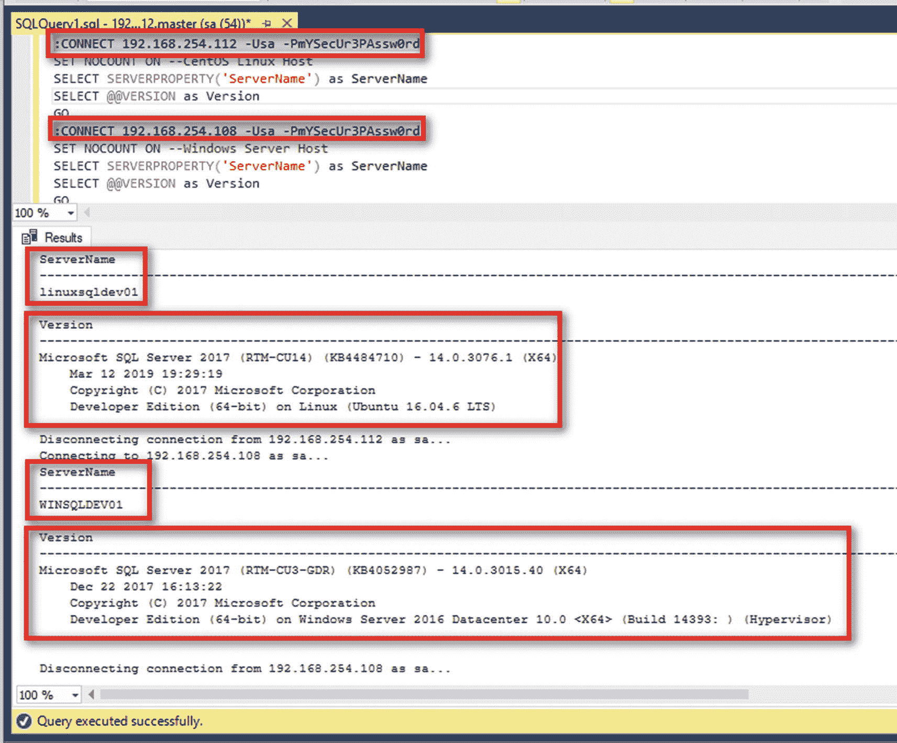

# 四、Docker 生态系统

> *相互依赖和自给自足一样，是也应该是人类的理想。*
> 
> —圣雄甘地

我一直对飞机很着迷。当我还是个孩子的时候，我想成为一名飞行员，环游世界。也许是去一个新地方旅行的兴奋，或者是搞清楚一个复杂系统如何工作的挑战。或者两者都有。

当我在 2008 年的感恩节等待登机时，我不禁想知道整个飞行旅行经历有多复杂。如果你以前坐过商业航班，你知道我在说什么。当你在柜台办理登机手续时，航空公司的代理人会给你一张登机牌，并在你的行李上贴上标签，这样行李就会到达你的最终目的地。您的登机牌上有航班的详细信息——登机口信息、您的座位分配、登机和起飞时间、乘客详细信息等等。飞机上会有一个登机门，供乘客上飞机。当您准备登机时，登机口服务员会根据您的登机牌检查您的身份。当飞机即将离开登机口时，飞行员将检查他们的飞行数据计划，并验证它是否符合空中交通管制员的指示。如果一切按计划进行，航班将离开登机口，前往目的地(在我们等待延误的航班时，一名地勤人员好心分享了这一信息)。

每一个复杂的系统都是由不同的部分协同工作组成的。如果你只是一个产品或服务的消费者(比如飞机)，不知道它如何工作的复杂细节也没关系。你只需要知道如何正确使用它。但是，如果你要负责提供产品或服务的一部分，你应该让你自己和使用它的人明白它是如何工作的，特别是你的那部分。

本章的目标是让你熟悉 Docker 这个复杂的系统。为了实现这个目标，我将向您介绍构成整个生态系统的不同组件，同时介绍开始使用 Docker 所需的最常用命令。所以，准备好接受一种更敲击键盘的学习方式吧。

Note

本章中介绍的示例命令将在 Windows PowerShell 命令 Shell 或 Linux 安全 shell(CentOS 或 Ubuntu)中显示，但不包括 *sudo* 命令(请参考“摆脱 sudo？”第三章。这是为了说明 *docker* 命令的互操作性。但这并不意味着我允许您忽略在 Windows Server 和 Linux server 操作系统上运行命令的安全性实践。记住，在 Linux 上，只有 *docker* 命令会在没有 *sudo* 的情况下运行。所有其他需要提升特权的命令仍然需要 *sudo* 。

## 你好世界:Docker 版

我相信你在学习计算机编程语言的时候，也有过“你好，世界”的经历。25 年前，当我在大学二年级第一次学习计算机编程时，我被介绍到了“hello world”。我希望我可以说这是我进入计算机编程之旅的开始(我通过课程的唯一原因是因为我最好的朋友写了我的最终项目)。但它确实让我看清了“hello world”是什么，它的用途是什么——测试接线员是否知道如何使用它。难怪每种编程语言都以显示“hello world”作为标准输出开始。

Docker 也不例外。虽然它不是真正的编程语言，但他们接受了“hello world”的概念，并提出了自己的语言。但是在我看来，他们创造“你好世界”版本的方式是惊人的聪明。他们的版本不仅仅是在你的屏幕上显示一个简单的“hello world”消息，而是让你了解 Docker 是如何工作的。在您的 Linux 系统上，运行以下命令来理解我的意思:

```
docker run hello-world

```

图 [4-1](#Fig1) 显示的是 Docker 版本的“hello world”。太棒了，不是吗？


图 4-1

你好世界:Docker 版

不幸的是，在 Windows Server 2016 上，相同的命令–`docker run hello-world`–不再适用于 Docker。这与命令无关，它与容器映像的版本有关，我们将在后面的部分中介绍。即使你按照 Docker 的文档在 Windows 服务器上安装 Docker Enterprise，运行相同的命令仍然会返回如图 [4-2](#Fig2) 所示的消息。


图 4-2

在 Windows 服务器上运行 Hello World: Docker edition

这是因为微软推出了半年一次的渠道(SAC)服务模式。用于构建微软版本的 Docker 的 *hello-world* 容器映像的映像对于 Windows Server 2016 已经被弃用(参考 [`https://github.com/docker/for-win/issues/3775`](https://github.com/docker/for-win/issues/3775) )。不要让我开始谈论这种服务模式给企业带来了多大的困惑。

要获得与在 Linux 上运行的容器映像相同的输出，请改为运行以下命令。请注意标签的使用，这是一个专门定义使用什么映像来运行容器的标签。标签的用法将在后面的章节中详细介绍。

```
docker run hello-world:nanoserver-sac2016

```

图 [4-3](#Fig3) 显示了 Docker 版本的《hello world》在 Windows Server 2016 上的输出。如果 Windows 服务器映像比 Linux 映像下载时间长得多，不要感到惊讶。


图 4-3

Windows Server 上的工作 Hello World: Docker 版本

除了您在前面章节中运行的`docker version`和`docker info`命令的输出之外，如果您得到这个结果，您可以保证 Docker 在您的系统上正常工作。你已经通过了简单的理智检查。但这不是本章的目的。让我们看一下 Docker 的“hello world”的输出，以了解 Docker 是如何工作的，并确定组成这个复杂系统的不同组件。

## Docker 如何运行集装箱

您运行的`docker run hello-world`命令是如何运行 Docker 容器的一个非常简单的例子。Docker 版本的“hello world”解释了 Docker 实际上是怎么做的。图 4-4 展示了运行 Docker 容器的过程。


图 4-4

Docker 如何运行集装箱

以下是 Docker 运行容器的过程的解释。 *hello-world* 容器用于示例目的，但是不管是什么容器，过程都是相同的。

1.  您从 Docker CLI 客户端运行`docker run hello-world`命令。

2.  Docker CLI 客户端对 Docker 守护进程进行 API 调用。在这种情况下，它通过 *run* 子命令运行一个新的容器，该容器基于作为模板的 *hello-world* 容器映像(输出中的#1)。

3.  当 Docker 守护进程收到运行容器的请求时，它做的第一件事是检查它的本地文件系统中是否已经有了一个本地的 *hello-world* 容器映像副本。因为这是一个全新的安装，所以没有映像的本地副本可用。

4.  因为它没有 *hello-world* 容器映像的本地副本，所以 Docker 守护程序从 Docker Hub(容器映像的公共存储库)中搜索并提取映像(输出中的#2)。

5.  下载完成后，Docker 守护进程基于 *hello-world* 映像(输出中的#3)创建并运行一个新容器。

6.  在 *hello-world* 容器完成它需要执行的任务后，容器退出或进入*停止*状态(输出中的#4)。

现在你知道为什么我认为这个“hello world”的例子很棒了。Docker 在他们的“hello world”版本中打包了如此多的信息，如果你问了正确的问题，真的可以给你很多关于 Docker 如何工作以及它的生态系统是由什么组成的细节。

## Docker 生态系统

在上一节中，我使用了几个名称、术语和关键字来描述 Docker 如何运行一个简单的容器。但是我还没有定义这些术语，所以我将在下面的部分中这样做。

### CLI 坞站

让我们先从图 [4-4](#Fig4) 的输出中的#1 可以推断出什么:Docker CLI 是什么？Docker CLI(命令行界面)是您与 Docker 守护进程的交互点。Docker 命令通过 Docker CLI 客户端执行，并发送给 Docker 守护进程。你可以把这个当做 SQL Server 查询分析器(但愿微软把这个轻量级工具带回来)或者 SQL Server Management Studio。默认情况下，它与 Docker 守护程序一起安装在机器上。从 docker 主机的角度来看，前面章节中运行的所有 *docker* 命令都是在本地执行的。在 Windows 服务器上，您通过远程桌面登录，打开 Windows PowerShell，并在本地运行 *docker* 命令。在 Linux 机器上，您启动了一个 SSH 会话来远程连接，但是一旦登录，您就在本地运行了 *docker* 命令。这是我们将在整本书中使用的方法。但是，没有人阻止您配置 Docker CLI 客户端以连接到远程 Docker 主机，类似于在 Windows 客户端工作站上安装 SQL Server Management Studio 并连接到远程 SQL Server 实例。

## docker daemon(坞站守护程序)

Docker 守护进程(或 Windows 中的服务)是一个客户端-服务器应用，是负责创建和运行 Docker 对象的运行时引擎。它是你与 Docker 互动的中心，也是开始了解 Docker 生态系统中所有活动部分的最佳地方。您可以将它想象成 SQL Server 关系数据库引擎。Docker 守护进程通过 REST API 与 Docker CLI 客户端进行交互。因为在默认安装中，Docker CLI 客户机与 Docker 守护进程安装在同一台机器上，所以 Docker 引擎通常被称为具有这三个主要组件——Docker 守护进程、REST API 和 Docker CLI 客户机。

## Docker 命令

*docker* 命令是通过 docker CLI 客户端与 Docker 守护进程交互时使用的基本命令。要执行 Docker 管理任务，可以使用带有相应参数的子命令或管理命令。探索所有不同子命令或管理命令的一个好方法是运行`docker`或`docker help`命令。图 [4-5](#Fig5) 显示了所有可用的选项和命令。docker 命令的完整列表可在 Docker 文档 [`https://docs.docker.com/engine/reference/commandline/docker/`](https://docs.docker.com/engine/reference/commandline/docker/) 中找到。


图 4-5

显示所有可用的 Docker 选项和命令

您已经使用了其中的一些命令，如*、docker run* 、`docker version`和`docker info`。

不要超越你自己。我们将在整本书中使用其中的几个选项和命令来执行 Docker 管理任务。

## Docker 映像和容器

我第一次看到术语 *Docker image* 时感到困惑，因为它通常与术语 *Docker containers* 一起出现。我会为你省去这种混乱可能引起的麻烦。

Docker 映像是一个静态的、*只读的*模板，用于创建应用容器。它是运行应用所需的各种组件的非运行表示。然而，Docker 容器是映像的运行时实例。当您运行`docker run hello-world`命令时， *hello-world* 是 Docker 映像的名称。您可以将 Docker 映像视为蓝图，就像汽车的技术图纸一样。您根据您希望汽车(Docker 容器)的外观和功能创建蓝图(Docker 映像)。蓝图完成后，您可以根据蓝图创建任意多的汽车实例。你可以自由地改变汽车的外观——颜色、配件、内饰等等——而不需要修改蓝图。如果你决定对汽车进行重大修改，你必须从头开始，重写蓝图。

这只是对什么是 Docker 容器和 Docker 映像的高层次概述，足以让您开始理解 Docker 生态系统的组件。*第* [*5*](05.html) 章深入探讨了它们是什么以及它们是如何存储在文件系统中的。

## 坞站集线器

Docker Hub 是一个容器注册中心。它是 Docker，Inc .基于云的公共存储库，用于创建、测试、存储和分发 Docker 映像。你可以把它想象成苹果应用商店或者 Docker 图片的 Google Play 商店。Docker Hub 提供多种服务和功能:

*   存储库:你可以在这里存储你的 Docker 图片，无论是私人使用还是公共使用。

*   *团队和组织*:这是一种管理存储在存储库中的 Docker 映像的权限和访问的方式。您可以创建团队并将用户分配给他们，以及创建由团队和不同存储库组成的组织。

*   *官方映像*:这些是托管在 Docker Hub 上的 Docker 存储库，用于提供基本操作系统映像、流行编程语言和平台的下载和使用映像，以及如何使用它们的最佳实践参考。这些映像存储在顶级存储库中(更多信息在“Docker 映像命名约定”一节中)，可以放心地假设它们来自可靠和值得信赖的来源。

*   *发布者映像* : Docker Hub 托管来自微软、甲骨文、红帽、IBM 等软件供应商的 Docker 映像。这些映像由相应的供应商维护和支持。我们将在后面的章节中使用的 Linux 上的 SQL Server 和 Windows 上的 SQL Server 容器就是发布者映像的例子。

*   *Builds* :这允许您从 GitHub、GitLab 和 Bitbucket 等 Git 存储库中自动构建和上传 Docker 映像。

*   *Webhooks* :这允许你通过自动化与其他服务集成，比如当你成功上传一个 Docker 镜像到 Docker Hub 时触发一个自动化服务器。

Docker Hub 可通过 [`https://hub.docker.com/`](https://hub.docker.com/) 访问，是 Docker 引擎用来搜索、推送或拉取 Docker 映像的默认容器注册表。如果您想搜索想要使用的特定 Docker 映像，这是您的第一站。图 [4-6](#Fig6) 显示了 Docker Hub 上 SQL Server 的搜索结果。


图 4-6

Docker Hub 上 SQL Server 的搜索结果

除了 Docker Hub 之外，还有其他可用的公共容器注册中心。更受欢迎的来自主要的云提供商，如亚马逊弹性容器注册中心(ECR)、微软容器注册中心(MCR)和谷歌容器注册中心(GCR)。您可以告诉 Docker 覆盖默认配置，并使用不同的公共容器注册中心。后面的部分将给出一个例子。如果您不想使用公共容器注册中心，您可以在本地部署自己的私有容器注册中心。

与容器注册相关的一个术语是*拉*。Pull 只是下载的一个花哨的词。当 Docker 守护进程获取 *hello-world* 镜像时，这仅仅意味着它从 Docker Hub 下载了该镜像，并将其保存到自己的本地文件系统中。与“拉动”一词相对应的是“推动”。再说一遍，这只是上传的一个花哨词。

由于 Docker Hub 是一个公共存储库，您可以提取可用的 Docker 映像，而无需创建 Docker ID。然而，如果您决定将自己的定制 Docker 映像推送到 Docker Hub，您需要注册一个 Docker ID(如果您超出了免费级别，请提供您的信用卡信息)。

## 探索 Docker Hub

我确实提到过，如果你想搜索你打算使用的特定 Docker 图片，Docker Hub 是你的第一站。但是当你运行 Docker 版本的“hello world”时，在输出中没有任何地方你看到一个网络浏览器打开，在 Docker Hub 上搜索 *hello-world* 映像，并发起一个拉取。另外，你在 Linux 上没有图形用户界面。你如何探索 Docker Hub 上有哪些图片？使用 *docker search* 命令，并向其传递适当的搜索词和参数。例如，如果您想要在 Docker Hub 中搜索所有包含名称“microsoft”的映像，您可以运行以下命令，如图 [4-7](#Fig7) 所示:


图 4-7

名称包含 microsoft 的 Docker 映像的搜索结果

```
docker search microsoft

```

该命令的结果根据“明星”或受欢迎程度进行排序。从排名来看，Linux 上的 SQL Server 映像似乎比 Windows 映像上的 ASP.NET 核心更受欢迎。NET Core 比 Linux 上的 SQL Server 早一年发布。

我希望 *docker search* 命令像 docker Hub 网站一样功能丰富，我可以通过出版商的名称进行搜索，无论它是 Docker 认证的映像，还是 Windows 或 Linux 容器。但是这不应该阻止你利用你的 PowerShell 或 Linux 脚本超能力来操纵和进一步过滤你从 *docker 搜索*中得到的结果。假设您只想列出所有特定于 SQL Server 的映像。由于 *docker search* 命令的结果是一个文本流，您可以使用*Select-String*PowerShell cmdlet 来查找特定的字符串值。在您的 Windows Server 主机上运行下面的 *docker search* 命令，使用 PowerShell 管道字符和 *Select-String* cmdlet 来过滤任何带有“sql”的结果。图 [4-8](#Fig8) 显示了名称中包含“microsoft”的所有 Docker 映像，过滤后仅显示包含“sql”的映像。作为 SQL Server DBA，这些是我们更感兴趣的。


图 4-8

在 Windows 上，搜索名称包含 microsoft 和 sql 的 Docker 映像的结果

```
docker search microsoft | Select-String sql

```

你可以使用 *grep* 命令在 Linux 上做同样的事情，如图 [4-9](#Fig9) 所示。


图 4-9

在 Linux 上，搜索名称包含 microsoft 和 sql 的 Docker 映像的结果

```
docker search microsoft | grep sql

```

Tip

这就是你需要小心你正在工作的环境——Windows 或 Linux——的地方。请记住，容器虚拟化了底层操作系统。与 Docker Hub 上只提供基于 Linux 的映像的其他关系数据库管理系统不同，SQL Server 在 Windows 和 Linux 上都可用。您不希望犯这样的错误:在 Windows 服务器主机上拉动并运行 Linux 上的 SQL Server 映像，反之亦然。没用的。

## Docker 映像命名约定

您可能渴望在容器上使用 SQL Server，但是请耐心听我说一会儿。我们很快就会到达那里。让我们首先看看容器命名约定，因为它有助于您在搜索、提取、构建甚至推送 Docker 映像时取得成功。

与使用 SQL Server 类似，安装过程中为您提供了默认的 Docker 配置设置。例如，默认的容器注册中心是 Docker Hub。当您运行 *docker run* 命令来运行 docker 版本的“hello world”时，您不必提供注册表名称。它只是使用了 Docker Hub。您可以选择使用其他公共容器注册中心。但是要做到这一点，您需要理解使用 Docker 映像时使用的命名约定。

使用标准命名约定引用 Docker 映像。这是为消费映像的用户提供可预测性。标准命名约定类似于 GitHub 存储库名称，使用以下格式:

**注册表[:端口]/报告/映像[:标签]**

映像名称由斜杠分隔的名称组成，可以选择以注册表主机名作为前缀。注册表主机名必须符合标准 DNS 规则。如果没有提供注册表主机名，则默认为 Docker Hub。Docker Hub 的全限定主机名是 [`https://index.docker.io`](https://index.docker.io) 或者简称为 *docker.io* 。当您运行 *docker info* 时，您可以在 *Registry:* 字段中看到这一点，如图 [4-10](#Fig10) 所示。


图 4-10

Docker Hub 的完全合格的 DNS 主机名

您可以在您的 *docker* 命令中使用除 Docker Hub 之外的任何可用的公共容器注册中心及其相应的注册中心主机名。下面是一些你可以从中选择的列表。使用情况将取决于如何访问公共容器注册表。

*   微软容器注册中心(MCR):mcr.microsoft.com

*   *亚马逊弹性容器注册中心(ECR)* : dkr。<地区> .amazonaws.com

*   *谷歌容器注册中心(GCR)* : gcr.io

注册表主机名后面是存储库(或简称为 repo)名称。repo 结构根据映像在容器注册表中的存储方式而有所不同。这么多软件厂商用 Docker Hub 作为公共容器注册中心，一级回购名称就是软件公司的名称。例如，*docker.io/microsoft*是微软在 Docker Hub 上的官方回购。

映像名称紧跟在 repo 之后，它标识 Docker 映像的内容。查看图 [4-7](#Fig7) 中 docker 搜索命令的结果，您可以看到以下内容:

*   *mssql-server-linux* 是 linux 上包含 SQL Server 的映像。

*   windowsservercore 是官方的 Windows Server Core 基本映像。

*   *MSSQL-Server-windows-Express*是包含 Windows 上的 SQL Server Express Edition 的映像。

但是考虑到 SQL Server 现在拥有的众多版本、版本和操作系统组合——甚至不包括 SQL Server 2016 之前的版本——仅仅依靠映像名称是不够的。如果需要在 Windows Server 2016 上运行带有累积更新 5 的 SQL Server 2017 的 Docker 映像怎么办？

这就是*标签*的用武之地。标签进一步标识 Docker 映像的内容，尽可能提供额外的细节。如果您在运行容器或从 repo 中提取映像时没有提供标签，Docker 会认为您想要的映像具有最新的*标签，并且该映像存在。参考您在 Linux 上运行的 *docker run* 命令:*

```
docker run hello-world

```

这与运行命令`docker run hello-world:latest`是一样的，因为您没有提供带有映像名称的标签，而您在 Windows 上运行的 *docker run* 命令在映像名称上有一个标签。

```
docker run hello-world:nanoserver-sac2016

```

这是因为带有*最新*标签的 *hello-world* Windows 容器映像不再存在——因此，出现了图 [4-2](#Fig2) 中的错误消息。

正如您所看到的，标签使用户更容易进一步识别 Docker 映像。当您开始创建自己的自定义映像时，这变得更加重要。您希望为用户提供尽可能多的信息，以确定他们需要的正确映像。请参考图 [4-11](#Fig11) 获取可用于 Linux 上的 SQL Server 映像的标签列表，可在 [`https://hub.docker.com/_/microsoft-mssql-server`](https://hub.docker.com/_/microsoft-mssql-server) 获得。


图 4-11

Linux 映像上 SQL Server 的可用标记

Tip

您需要指定标签的另一个原因是，您永远不会知道您实际上从公共容器注册中心获得了什么样的最新映像。如果您查看图 [4-11](#Fig11) 中的 SQL Server on Linux 映像标签，带有*最新*标签的映像显示 LastUpdatedTime 为 09/21/2018 01:01:16。然而，在带有 *2017-latest-ubuntu* 标签的映像中，LastUpdatedTime 显示为 07/09/2019 19:15:57。那么，哪一个才是最新的呢？你可以拉运行*最新*和 *2017-latest-ubuntu* 图片来了解一下。在撰写本文时，带有*最新*标记的映像正在运行带有 CU13 的 SQL Server 2017，而带有 *2017-latest-ubuntu* 标记的映像正在运行带有安全更新(KB4505225)的带有 CU15 的 SQL Server 2017。您不希望提取和部署与您希望用于测试和生产的内容不兼容的 SQL Server 映像。使用标签确保你得到你真正需要的东西。

现在您已经理解了 Docker 映像的命名约定，让我们检查一下您在本章前面运行的 *docker* 命令。您在 Windows 上运行的 *docker run* 命令可以写成

```
docker run docker.io/library/hello-world:nanoserver-sac2016

```

在 Linux 上，

```
docker run docker.io/library/hello-world:latest

```

以*库*作为回购名称。

为了更好地说明这一点，让我们假设您想要在您的 Linux Docker 主机上获取一个 SQL Server on Linux 映像。为此，请运行以下命令。拖动映像不会创建和运行容器。它只是将它存储在本地容器注册表的文件系统中。您可以选择提取您需要的所有映像，并将其存储在本地文件系统中。这具有快速运行容器的优势，因为 Docker 守护进程不再需要等待映像完全下载。

```
docker pull microsoft/mssql-server-linux

```

这可以写成

```
docker pull docker.io/microsoft/mssql-server-linux:latest

```

您也可以参考 Microsoft Container Registry (MCR)来下载映像:

```
docker pull mcr.microsoft.com/mssql/server:latest

```

假设这是微软的专用公共注册表，并且他们有几个产品可以作为 Docker 映像使用，那么 repo 名称现在表示产品名称(在本例中为 *mssql* )，而不是软件供应商的名称。

Note

因为 Docker Hub 是公共容器注册中心的先驱，所以几乎所有的软件供应商都在他们的门户上发布了他们的映像和文档。它已经成为 Docker 映像的公共容器注册中心——Docker Hub 托管元数据和映像。随着软件供应商开始创建 Docker 源代码的分支并创建自己的版本，他们也创建了自己的公共容器注册中心。为了避免任何突破性的变化，同时仍然提供无缝的用户体验，大多数软件供应商利用联合模式来保持 Docker Hub 上的内容是最新的。这就是微软对 MCR 所做的。MCR 托管所有微软映像，并将元数据整合到 Docker Hub。每当微软在 Windows 或 Linux 上添加或更新 SQL Server 映像时，他们都会将元数据整合到 Docker Hub。当您从 Docker Hub 获取 SQL Server 映像时，您会被重定向到 MCR 以获取映像文件。不幸的是，MCR 没有像 Docker Hub 那样的门户式体验。所以，你还是需要 Docker Hub 来搜索微软图片。你可以在这篇博文中读到更多关于 MCR 的创建: [`https://azure.microsoft.com/en-ca/blog/microsoft-syndicates-container-catalog/`](https://azure.microsoft.com/en-ca/blog/microsoft-syndicates-container-catalog/)

这些概念说够了。了解了 Docker 生态系统中不同组件的工作方式后，现在是时候看看它们的实际操作了——SQL Server DBA 风格。

## 在 Windows 容器上运行 SQL Server

运行 Docker 容器有两种方式:

*   首先使用 *docker pull* 命令提取映像，然后使用 *docker run* 命令运行映像。

*   使用 *docker 运行*命令。如果映像不存在于本地文件系统中，docker 守护进程将在运行之前首先隐式地提取映像。

运行以下命令，在 Windows Docker 主机上使用*最新的*标记映像，在 Windows 上拉取并运行*SQL Server 2017 Developer Edition。去吃点小吃，因为拉动和运行的过程需要一些时间。*

```
docker run -e "ACCEPT_EULA=Y" -e "SA_PASSWORD=mYSecUr3PAssw0rd" -p 1433:1433 --name sqldevwincon01 -d -h winsqldev01 microsoft/mssql-server-windows-developer

```

现在，这个 *docker run* 命令比我们在本章开始时的“hello world”映像多一点。这才是真正有趣的开始。

以下参数与 *docker run* 命令一起使用。这些参数与您将用于 Linux 服务器主机的参数相同:

*   *-e* :设置需要的环境变量；这些是特定于 SQL Server 的。*接受 _EULA* 和*SA _ 密码*参数不言自明。我相信您每次安装 SQL Server 时都会阅读 EULA。

*   *-p* :使用以下格式向主机发布容器的 TCP 端口(或一系列端口)*IP:host port:container port*。这允许您从远程客户端连接到容器中的 SQL Server 实例，将主机上的端口 1433 映射到容器上的端口 1433。

*   *- name* :帮助识别容器的唯一自定义名称，而不是系统生成的名称。这有助于您在执行其他任务时轻松识别容器。

*   *-d* :以分离模式(后台进程)运行容器，打印容器 ID。这意味着在运行 *docker run* 命令后，容器仍然在后台运行。由于 SQL Server 是作为服务运行的，因此请使用此参数。如果没有这个参数，容器将运行，完成它的任务，然后退出。

*   *-h* :要分配给容器的服务器主机名。给 *-h* 和 *- name* 参数分配相同的值，使得识别集装箱变得容易。

图 [4-12](#Fig12) 显示了在您的 Windows 服务器主机上运行 *docker run* 命令的结果。


图 4-13

在 Linux 容器上拉取和运行 SQL Server


图 4-12

在 Windows 容器上提取和运行 SQL Server

稍后您将会看到为什么要花一些时间来提取映像。

## 在 Linux 容器上运行 SQL Server

运行以下命令，在您的 Linux Docker 主机上拉取并运行一个*SQL Server 2017 Developer Edition with CU14 on Ubuntu Linux*映像。我们还将把 MCR 用于公共容器注册，因为 Docker Hub 上只有带有*最新*标签的映像可用。不要担心，您可以在 Ubuntu 或 CentOS Linux Docker 主机上运行它。而且，您不必像在 Windows 映像上使用 SQL Server 那样等待很长时间。图 [4-13](#Fig13) 显示了在 Linux Docker 主机上运行 docker run 命令的结果。

```
docker run -e "ACCEPT_EULA=Y" -e "SA_PASSWORD=mYSecUr3PAssw0rd" -p 1433:1433 --name sqldevlinuxcon01 -d -h linuxsqldev01 mcr.microsoft.com/mssql/server:2017-CU14-ubuntu

```

Note

在第*章* [*3*](03.html) 中，我谈到了将用户添加到 *docker* 组的安全含义。这是因为 Docker 守护进程作为根用户运行。这意味着您在 Docker 主机上运行的任何容器都拥有根特权，不仅在容器内部，而且在主机上。任何可以恶意访问容器的人都可以毫无问题地利用 Docker 主机。我说过这很可怕。不幸的是，作为非根用户运行 Docker 守护进程(也称为*无根*模式)仍然是一个实验性的特性。您不希望在生产环境中使用实验性的特性。微软不得不面对这个限制，在 Linux 容器上部署 SQL Server 是使用根*完成的。SQL Server 2019 改变了这一点，允许以非 root 用户的身份在 Linux 容器上运行 SQL Server。我将在第*章* [*10*](10.html) 中讲述如何以根用户*或者非根用户的身份在 Linux 容器上构建和运行 SQL Server。**

## 开始探索容器和映像

因此，您在容器映像上运行了 SQL Server。您没有看到任何错误消息。或者你有。如果您想开始浏览您提取的映像，运行`docker images`命令。这将让您了解为什么 Windows 上的 SQL Server 映像比 Linux 上的 SQL Server 映像需要更长的时间，这也是为什么 Docker 版本的“hello world”在 Windows 上比在 Linux 上运行时间更长的原因。图 [4-14](#Fig14) 可能会让你震惊——它显示了`docker images`命令在我的 Windows 服务器主机和 Linux 服务器主机上的结果。


图 4-14

Windows 上的 SQL Server 与 Linux 上的 SQL Server 映像的比较

运行容器时没有看到任何错误消息并不意味着一切正常。要找到所有正在运行的容器的状态，运行`docker ps`命令。图 [4-15](#Fig15) 显示了我的 Windows 服务器和 Linux 服务器主机上当前运行的容器。


图 4-15

Docker 容器当前正在运行

*状态*列告诉您您的容器当前是否正在运行。如果您刚刚运行的容器没有出现在这个列表中，并且您没有收到任何错误消息，这可能意味着它运行了一段时间，然后被终止。一个已经被终止的容器可能意味着它应该做的工作已经完成(就像 *hello-world* 容器)或者容器内部发生了致命错误，迫使它停止。了解容器是做什么的很重要，这样你就知道可以从它那里得到什么。

运行`docker ps -a`命令会显示所有容器——无论是运行中的还是终止的。图 [4-16](#Fig16) 显示了我运行的所有容器的列表，包括已经终止的 *hello-world* 容器——那些具有*STATUS*Exited(0)值的容器。


图 4-16

显示所有 Docker 容器——包括当前运行的和终止的

在使用容器时，您将会经常运行这两个命令。但是我们仅仅触及了表面。*章* [*6*](06.html) 将涵盖使用这些命令执行基本容器管理的变化。

## 需要考虑的事项

仅仅通过运行所提供的命令就能在 Windows 和 Linux 容器上拉动和运行 SQL Server，这种感觉难道不好吗？当然有关系。但是不要太兴奋。在像 Docker 这样的新环境中工作会带来新的挑战，你需要意识到这一点。

第一个是许可。我不想假装是许可专家，但是我已经处理 SQL Server 许可多年，我知道如何谈论它。您可能想知道在您提取的映像上可以使用 Linux 上的哪个版本的 SQL Server。名称和标签都没有提到任何与 Windows 容器上的 SQL Server 不同的东西。映像默认为免费的开发者版本。出于任何测试或学习的目的，我坚持使用免费版本——开发人员版和快速版。你不会错的。您可以通过在您的 *docker run* 命令中包含 *MSSQL_PID* 环境变量来选择其他版本，前提是您拥有它们的有效许可证。关于在生产环境中的容器上部署 SQL Server，请务必咨询您的 Microsoft 许可专家。他们对此有最终决定权。

第二个是 *SA_PASSWORD* 环境变量。 *sysadmin* 密码应满足 [`https://docs.microsoft.com/en-us/sql/relational-databases/security/password-policy`](https://docs.microsoft.com/en-us/sql/relational-databases/security/password-policy) 中描述的 SQL Server 密码复杂性要求。由于这是安装过程中的一个必需参数，因此如果该策略失败，将会导致安装失败和容器停止。

当我第一次运行前面的命令在 Linux 容器上运行 SQL Server 时，我发现了这个问题。在运行了 *docker run* 命令并期望它能够工作之后，我想不出为什么我不能远程连接到 SQL Server 实例(我将在下一节更详细地介绍这一点)。我以为是因为防火墙端口没有打开。所以，我做了通常的 PING 和 TELNET 测试。一无所获。我可以连接到端口 1433 一段时间，但几分钟后，该端口不再响应。我检查容器是否还在运行，我注意到它在几分钟后终止并退出。这让我很好奇到底发生了什么。在阅读日志之后，我看到了如图 [4-17](#Fig17) 所示的 SQL Server 错误消息。


图 4-17

容器日志中的 SQL Server 错误日志

我花了几个小时试图弄清楚为什么容器会在运行后立即终止，却发现我的 *sysadmin* 密码不符合密码策略。

同样，使用对您的 shell 环境可能有意义的特殊字符(如 PowerShell 或 SSH)可能会导致问题，尤其是在使用单引号而不是双引号时，如下例所示:

```
docker run -e 'SA_PASSWORD=$Qlu=j&Q7a0N' ...

```

几年前，我编写了一个简单的 PowerShell 脚本，可以生成复杂的密码。有时候，脚本会生成一个以特殊字符开头的密码，这个字符对我使用的 shell 环境有一定的意义。这是我用来在 Linux 容器上创建 SQL Server 的一个密码。请注意，它以$字符开头。

```
$Qlu=j&Q7a0N

```

因为$字符在 PowerShell 和 Linux 中都有特殊的含义(该$字符代表一个变量表达式)，所以当它作为一个值在 *SA_PASSWORD* 环境变量中传递时，被解释为一个变量表达式。它也不符合 SQL Server 的密码策略要求。

最后是使用参数 *- name* 给容器命名。这不仅是给你的容器正确命名的一个好习惯，它也避免了试图弄清楚什么是容器 *cranky_haslett* 以及它的用途。我在我的 Linux 主机上运行了几次 *hello-world* 容器，以显示系统自动生成的不同名称。如果不是因为映像名，我根本无法弄清楚 *relaxed_sammet* 容器是什么。参考图 [4-18](#Fig18) 获得真正有趣的系统生成名称列表。


图 4-18

系统生成的 Docker 容器名称

如果你好奇 Docker 是如何生成这些名字的，可以参考 [`https://github.com/moby/moby/blob/master/pkg/namesgenerator/names-generator.go`](https://github.com/moby/moby/blob/master/pkg/namesgenerator/names-generator.go) 的源代码。没有理由不享受工作的乐趣。

## 远程连接到 SQL Server 实例

我不喜欢在生产服务器上安装任何不必要的东西，包括客户端工具。事实上，自从 SQL Server 数据库引擎得到支持的那一天起，我就试图说服我的客户在 Windows Server Core 上安装它(我很少成功，但至少我尝试过)。我的目标是最小化服务器的表面积，防止人们直接登录到它们。这减少了攻击面，最大限度地减少了人为错误和管理开销。我数不清有多少次有人因为认为自己登录到了测试服务器而意外重启了生产服务器，或者有人使用专用终端服务会话运行简单的查询并阻止其他管理员登录。

我所做的是在客户端工作站上安装管理服务器所需的所有客户端工具——远程服务器管理工具(RSAT)、TELNET 客户端、SFTP 客户端、SQL Server Management Studio 等等。使用客户端工作站远程连接和管理服务器。此外，这也是您部署企业应用的方式，客户端远程连接到服务。

在单服务器部署中，连接到容器的最简单方法是利用 Docker 主机的 IP 地址或 DNS 名称(如果有 DNS 服务器的话)。您在 *docker run* 中使用的 *-p* 参数允许您使用 docker 主机的 IP 地址远程访问容器，并将 Docker 主机上的指定端口映射到容器上的指定端口。在示例 *docker run* 命令中，我们将主机上的端口 1433 映射到容器上的端口 1433。

要找出主机的 IP 地址，您可以运行

*   `ipconfig`在 Windows 上

*   在 CentOS 或 Ubuntu 上

在尝试连接到容器内部的 SQL Server 实例之前，请执行基本的网络测试，如 PING 和 TELNET。我总是从这两个开始，以确保连接问题与 SQL Server 无关。我不想浪费大量时间对 SQL Server 进行故障排除，却发现某个端口被防火墙规则阻止了。如果我没有从 PING 测试中得到响应，我并不总是认为服务关闭了。可能是网络管理员禁用了 ICMP 响应，作为他们安全策略的一部分。对 SQL Server 端口号的 TELNET 测试将告诉我 SQL Server 是否在侦听。如果我没有收到“无法打开到主机的连接”的错误消息，那是我唯一一次使用客户端应用进行测试。

启动 SQL Server Management Studio，并使用 IP 地址和您指定的 *sysadmin* 凭据连接到 SQL Server Docker 容器。图 [4-19](#Fig19) 显示了显示实例名和 SQL Server 版本的简单查询的结果。我在运行查询时使用 SQLCMD 模式，因此在连接到远程 SQL Server 实例时，我不必经常提供实例名称和凭据。



图 4-19

使用 SSMS 远程连接到容器上的 SQL Server

回想一下使用 *-h* 参数来反映服务器主机名——服务器主机名是默认 SQL Server 实例的实例名。此外，可用的 SQL Server on Linux container 运行在 Ubuntu Linux 16.04.6 LTS 上，即使您运行 CentOS Linux 7 作为 Docker 主机。

一旦进入 SQL Server Management Studio，用户体验是一样的。您不必使用命令行或学习所有新的 SQL Server 命令行工具。您可以在熟悉的环境中舒适地执行所有管理任务。

## 容器的生命周期

运行 *hello-world* 容器可以让您对其生命周期有一点了解——从创建到执行再到终止。请记住，只有当容器中的主进程仍在运行时，容器才会存在——这就是为什么 *hello-world* 容器在打印完屏幕上的全部文本后就退出了。

一个容器会经历这些不同的状态，每种状态都可以在运行`docker ps -a`时的*状态*列中看到:

*   *Created* :这是当你使用 *docker create* 命令创建一个容器，但是没有运行它，可能是为了以后运行它做准备。

*   *运行*:这是容器启动并运行，完成其工作的时候。

*   *Exited* :这是一个容器经历了一个运行状态并完成了它的工作。因为其中的主进程不再运行，所以容器退出。

*   *暂停*:这是当您使用 *docker pause* 命令选择暂停一个正在运行的容器时，暂停容器中所有正在运行的进程。

*   *重启*:已配置重启策略的容器状态。您可以将其视为服务器重启，这是我们不希望 SQL Server 容器发生的情况。

*   *Dead* :这是 Docker 守护进程试图停止容器但失败的时候。

将运行 *docker run* 命令看作是运行 *docker create* 命令和 *docker start* 命令的组合。假设您想对 *hello-world* 容器使用 *docker create* 和 *docker start* 命令:

```
docker create hello-world

```

像 *docker run* 命令一样，这将返回容器 ID 值。您将它作为参数传递给 *docker start* 命令，包括 *-a* 参数，以将容器的输出连接到您的终端控制台。我通常只在我的 *docker* 命令中传递容器 ID 的前 12 个字符。图 [4-20](#Fig20) 显示运行*对接创建*和*对接启动*作为运行*对接运行*的替代。


图 4-20

运行 docker 创建和 docker 启动命令

```
docker start -a 3df6324e4c12

```

我很少单独使用这两个命令，只是依靠 *docker run* 命令来创建和运行容器。

容器状态类似于虚拟机(VM)经历的不同状态，您可以随时启动、停止或暂停它们。与虚拟机非常相似，当您停止容器时，容器内运行的进程变得不可用。容器以及与之相关的数据一直保留在 Docker 主机的文件系统中，直到您显式地删除它。移除容器不会移除映像。回想一下，容器是映像的运行时实例。您可以从参考映像中创建、启动、停止和移除任意数量的容器，这不会影响映像。您可以从 Docker 主机中删除映像。当您决定再次运行映像时，这样做将触发 Docker 守护进程从已配置的容器注册表中提取映像。我们将在第*章* [*5*](05.html) 中更详细地讨论映像和容器的内部。

## 摘要

理解组成 Docker 生态系统的不同组件有助于您了解运行容器的内容。这为您在生产环境中开始部署容器做好了准备。

我们已经了解了 Docker CLI 客户机的角色以及如何使用它来运行 Docker 命令。我们已经探讨了 Docker 守护进程如何成为您与 Docker 交互的中心。我们还了解了映像和容器之间的区别，以及 Docker 守护进程如何与 Docker Hub 交互来拉取(以及在您开始创建自己的自定义映像时推取)映像。理解映像命名约定可以帮助您处理公开可用的映像和您将要创建的映像。

在 container 上运行 SQL Server 并远程连接到它没什么大不了的，尤其是当微软已经提供了可用的映像时。一旦连接到容器内的 SQL Server 实例，实际上没有任何区别。您可以使用多年来熟悉的工具和命令来使用 SQL Server。

我在本章中介绍了几个 *docker* 命令，让你开始使用容器。你肯定需要把这些放在你的腰带下面，因为你会经常用到它们:

*   *docker 版本*:显示 docker 版本信息；用于验证您的安装

*   *docker 信息*:显示系统范围的信息；也用于验证安装和检查配置

*   *docker run* :在一个新的容器中运行一个命令，或者从 SQL Server 的角度来看，运行一个包含 SQL Server 实例的容器

*   *docker 搜索*:在 Docker Hub 中搜索可用的容器映像

*   *docker pull* :从容器注册表中提取一个或一组映像

*   *docker 镜像*:显示 docker 主机本地文件系统中存储的所有镜像

*   *docker ps* :列出可用的容器

为下一章做好准备，因为我们将从文件系统的角度更详细地看映像和容器。