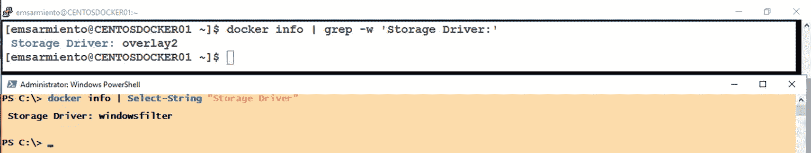
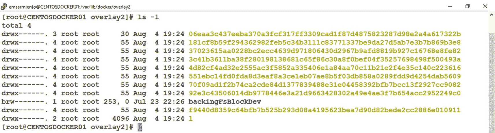

# 五、Docker 映像和容器

> “美:调整所有部分的比例，使一个人不能增加或减少或改变而不损害整体的和谐。”
> 
> —莱昂·巴蒂斯塔·阿尔伯蒂

至少可以说，在发展中国家出生和长大有它自己的挑战，有趣的挑战。我们家属于中下阶层，只有一个人挣钱。所以，像小吃和电影这样的东西被认为是奢侈品。想象一下我 8 岁的时候第一次进麦当劳店是什么感觉。

1984 年夏天的一个下午，我们的“蒂塔”带我和我哥哥去了一家麦当劳店。我第一次吃快乐套餐并不意外——普通的汉堡配薯条和饮料，还有乐高积木套装。对于一个 8 岁的孩子来说，这是一场带有玩具套装的盛宴(事实是，在那个时候，这份食物也是巨大的)。我从姑妈的脸上看出，如果我们要求更多，她会非常乐意帮忙。我不需要任何说服。菜单上展示了一张诱人的巧克力奶昔图片，这是炎炎夏日的完美饮品。

当服务员在准备我的奶昔时，我不禁注意到旁边有一个很大的汽水自动售货机。每一个准备饮料的服务员都会把一个空杯子放在一个自动售货机下面，按下一个可爱的小按钮，饮料就出来了。我幼小的大脑立刻被问题淹没了。饮料是从哪里来的？它怎么知道哪里能找到水、可口可乐或根汁汽水？那台小机器怎么能装下所有的饮料？有没有一个人在机器后面，他唯一的工作就是给汽水贩卖机加满水？真的会下芝士汉堡吗？

当你在一家销售一打或更多饮料的全球快餐连锁店工作时，了解像汽水贩卖机这样的机器是如何工作的会有所帮助。你想知道饮料供应商是谁，如何将正确的饮料罐连接到汽水分配器，以及在机器停止分配饮料的情况下该怎么办。我 8 岁的问题是有效的，因为他们与苏打水机，因为他们正在与 Docker 映像和容器。

本章将从存储的角度介绍使用 Docker 映像和容器的内部原理。我们将探索映像是由什么组成的，它们是如何描述的，以及它们是如何存储在文件系统中的。你越了解 Docker 如何处理映像，你就越有能力设计你自己的定制映像。

Note

除非另有说明，本章中的大多数例子都与 Linux 有关。这将使您有机会在学习 Docker 映像和容器的同时，提高使用 Linux 文件系统的技能。

## 快速回顾(然后一些…)

在前一章中，我给了你一个映像和容器之间的区别的高层次概述。我要重复一遍，因为重复是掌握的关键。但是由于这更多的是对映像和容器的深入报道，我们将更详细地探索这些概念。所以，开始了。

Docker 映像是一个静态的、*只读的*模板，用于创建应用容器。它是运行应用所需的各种组件的非运行表示。映像由文件系统层中的一组结构化文件组成，文件系统层包含应用文件、依赖于操作系统的文件(如应用需要的库)以及描述它是什么的元数据。每个文件系统层与其前一层只有一组差异，很像一系列 SQL Server 事务日志备份，它们组成一个日志序列链，完整数据库备份是基本映像。回想一下在上一章中运行 *docker pull* 命令的时候。图 [5-1](#Fig1) 展示了这个分层的文件系统，它对应于 Linux 映像上 SQL Server 的 *docker pull* 命令的输出。不要认为系统生成的 64 个字符的十六进制字符串没有意义。每个 *Pull complete* 消息代表组成整个映像的文件系统层。


图 5-1

带有映像层的 Linux 映像上的 SQL Server

然而，Docker 容器是映像的运行时实例。您创建和运行的每个 Docker 容器都将基于只读映像模板。您可以将 Docker 映像视为蓝图，就像汽车的技术图纸一样。根据您希望汽车(Docker 容器)的外观和功能，创建蓝图(Docker 映像)。一旦蓝图最终确定，您可以从蓝图中创建任意多的汽车实例。你可以自由地改变汽车的外观——颜色、配件、内饰等等——而不需要修改蓝图。如果你决定对汽车进行重大修改，你必须从头开始，重写蓝图。

如果 Docker 映像是一个只读模板，那么如何运行需要对文件系统进行更改的容器呢？写入只读介质就像试图将数据写入一次性写入 CD-ROM。第二次就不行了(而且当今世界谁还用光盘？).当然，如果我们需要对只读模板中的文件进行修改，那么在幕后会有一些神奇的事情发生。此外，在报告和分析之外，只读数据库有多大用处？即使对 SQL Server 实例进行简单的配置更改，也需要对*主*数据库数据文件进行更改。

秘密在于容器实际上是一个位于只读层之上的薄的读写文件系统层。图 [5-2](#Fig2) 展示了 Docker 容器如何作为一个位于只读层之上的读写文件系统层。 *docker run* 命令返回代表精简读写层的容器 ID。


图 5-2

Linux 容器上的 SQL Server 作为读写文件系统层

这种读写文件系统层类似于 Microsoft Hyper-V 中的差异磁盘和 VMWare 中的链接克隆。您可以从同一个映像创建任意多个容器，在映像和容器之间创建一对多的关系。您对容器所做的任何更改只发生在读写文件系统层，不会影响基本的只读层。这个薄薄的读写层也解释了为什么容器比物理或虚拟机启动更快。与虚拟机不同，您不是用容器来启动整个系统。您只是简单地启动它们，跳过启动操作系统所需的所有过程。由于 Docker 主机的基本操作系统已经启动，容器所要做的就是创建读写文件系统层，并加载所有必要的文件来启动其中的应用。

既然我们已经确定了 Docker 容器实际上是一个运行在只读文件系统层之上的瘦的读写文件系统，那么让我们开始深入一点。

## 幕后拉图

在前一章中,“Docker 如何运行容器”一节向您介绍了 Docker 生态系统中的不同组件如何协同工作来运行容器。第 4 步是 Docker 守护进程与 Docker Hub 联系，搜索并提取一个映像，为运行它做准备。但是你有没有想过 Docker Hub 如何知道你的 Docker 主机运行在什么平台上，如何给它正确的映像？我指的是运行`docker info`命令时获得的平台信息，如图 [5-3](#Fig3) 所示。


图 5-3

来自 docker info 命令的 Docker 主机的平台信息

回想一下，在微软放弃他们版本的 *hello-world* 镜像之前，我可以在 Windows Server 和 Linux Docker 主机上运行相同的`docker run hello-world`命令，并且会得到相同的输出。只要有可用的映像，Docker Hub 就会根据平台信息为您的 Docker 主机提供正确的映像。

在前一章的步骤#4 和步骤#5 之间是处理*清单*的中间步骤。不要混淆什么是货单。这只是 JSON 文件的一个花哨术语，它描述了映像是什么:组成映像的文件系统层、它们的大小以及摘要。图 [5-4](#Fig4) 介绍了这些中间步骤。


图 5-4

Docker Hub 根据清单发送正确的映像

让我们探索一下第 4 步和第 5 步之间的中间步骤:

1.  如果 Docker 守护进程没有 *hello-world* 容器映像的本地副本，它将在 Docker Hub 中搜索该映像(步骤#4)。Docker 守护进程还向 Docker Hub 发送平台信息——主要是 OS 和 CPU 架构——并查询清单。

2.  如果“fat”清单存在，Docker Hub 搜索与 Docker 守护程序的平台信息(来自步骤#4a)匹配的部分，并将查询重定向到相应的映像清单(步骤#4b)。

3.  解析映像清单，读取构建映像所需的相应文件系统层。这些文件系统层然后被发送到 Docker 守护进程(步骤#4c)。

4.  下载完成后，Docker 守护进程基于 *hello-world* 映像创建并运行一个新容器(步骤#5)。

fat 清单的使用允许像 Docker Hub 这样的映像库向 Docker 主机提供正确的映像。您不希望 Linux Docker 主机从映像存储库中提取基于 Windows 的映像，对吗？那是行不通的。

### 脂肪清单？

步骤 4a 介绍了所谓的“肥胖”清单。我真的不知道为什么它被称为“胖”清单，但官方术语是*清单列表*。将清单列表视为“清单中的清单”拥有“胖”清单背后的想法是为多架构支持提供无缝的用户体验，这是 Java 曾经吹嘘的“一次编写，随处部署”原则背后的真正本质。有了“胖”清单，我就不需要担心如何找到适合我当前平台的正确的映像名称和标签组合。例如，我可以跨不同的操作系统和不同的 CPU 架构运行`docker run hello-world`命令。

让我们使用 *docker manifest* 命令来检查 *hello-world* 映像的“胖”清单。由于这是一个实验性命令，您需要使用 *export* 命令来启用 DOCKER_CLI_EXPERIMENTAL 环境变量。运行以下命令来检查 *hello-world* 映像的清单列表。图 [5-5](#Fig5) 显示了 *hello-world* 映像支持的不同架构的片段以及定义它的字段。


图 5-5

hello-world 映像的脂肪清单

```
export DOCKER_CLI_EXPERIMENTAL=enabled
docker manifest inspect hello-world

```

*hello-world* 映像的“fat”清单告诉我们，我们可以在几种操作系统和 CPU 架构组合上运行容器 x86 和 amd64 上的 Linux、Windows 10 Build 10.0.17134.885 和 ARM 上的 Linux 等等。想象一下在 Raspberry Pi 设备上运行 Docker 容器。

Note

我希望容器上的 SQL Server 也是如此。遗憾的是，微软文档特别提到了 Windows Server 和 Linux 上的 SQL Server 2017 及更高版本的“仅 x64 兼容”处理器类型。SQL Server 在 DEC Alpha 等非 x64 平台上运行的日子已经一去不复返了。然而，Azure SQL Database Edge 看起来对基于 ARM 的 Linux 设备很有前景。查看 [`https://azure.microsoft.com/en-us/services/sql-database-edge/`](https://azure.microsoft.com/en-us/services/sql-database-edge/) 了解更多详情。还在发展初期。

以下字段给出了“胖”清单:

*   *mediaType* :这个会有值 application/vnd . docker . distribution . manifest . list . v2+JSON。

*   *schemaVersion* :这个值为 2。

“fat”清单是可选的——您可以创建一个没有它的 Docker 映像。如果它不存在，则跳过步骤#4a，Docker 守护程序的查询被直接发送到映像清单(步骤#4b)。这方面的一个例子是 Linux 上的 SQL Server 映像。因为它是专门为 amd64 平台上的 Linux 创建的， *mediaType* 字段将只显示一个映像清单。请参考下面的*媒体类型*值，以将其与“胖”清单区分开来:

*   *【媒体类型】:【application/vnd . docker . distribution . manifest . v2+JSON】*

运行以下命令来检查 Linux 上的 SQL Server 的映像清单。图 [5-6](#Fig6) 显示了 Linux 上的 SQL Server 映像清单的一个片段。


图 5-6

Linux 映像上 SQL Server 的清单

```
export DOCKER_CLI_EXPERIMENTAL=enabled
docker manifest inspect mcr.microsoft.com/mssql/server:2017-CU14-ubuntu

```

我并没有说我喜欢使用 JSON 数据。但事实是，JSON 是一种非常受欢迎的数据交换格式，甚至 SQL Server 从 SQL Server 2016 开始就支持它。好在还有其他选择。您可以使用一个工具来查询 Docker 映像是否有一个“胖”清单，而不必处理所有这些 JSON 数据，这个工具就是 *mquery* 实用程序。它还告诉你，如果一个“胖”清单存在，还有什么其他平台支持。有关 *mquery* 实用程序的更多信息，请查看 [`https://github.com/estesp/mquery`](https://github.com/estesp/mquery) 。

运行以下命令，使用 *mquery* 实用程序检查 Linux 上的 SQL Server 映像。请记住，这也将提取包含该工具的相应映像。图 [5-7](#Fig7) 显示了该命令的输出，确认了 Linux 上的 SQL Server 镜像没有“胖”清单(清单列表:否)，只支持 amd64 平台上的 Linux。


图 5-7

针对 Linux 映像上的 SQL Server 运行 mquery 工具

```
docker run mplatform/mquery mcr.microsoft.com/mssql/server:2017-CU14-ubuntu

```

如果你针对官方的 Linux Ubuntu 镜像运行该工具，你会看到它支持的不同平台，如图 [5-8](#Fig8) 所示。现在大多数 Docker 官方镜像都支持多种架构。


图 5-8

针对官方 Ubuntu 映像运行 mquery 工具

### 映像清单

如果一个“胖”清单存在，在它里面是包含它支持的不同平台的映像清单列表的*清单*字段，就像一个指向映像清单的指针。如果它不存在，当您运行 *docker manifest inspect* 命令时，您得到的是*映像清单*。映像清单提供了构建映像所需的不同文件系统层的详细信息，以及一个告诉 Docker 守护程序如何将所有这些层组合在一起以运行容器的配置。把不同的文件系统层想象成乐高积木，把映像想象成建筑说明手册(这就是我第一次开心乐园餐的难忘之处)。普通的乐高积木不知道它们是如何相互关联的。只有建造说明手册有连接它们的细节，所以你可以建造一个星球大战千年隼。你甚至可以从可用的片段(文件系统层)中创建自己的乐高结构(Docker 镜像)，只要你还创建了自己的构建说明手册(镜像清单)——即使该手册只是在你的脑海中。从存储库中提取 Docker 映像的过程包括检索映像清单和文件系统层。

运行下面的 *docker inspect* 命令，探索 *hello-world* 映像的底层细节。请注意，您正在检查映像，而不是容器。您可以使用 *docker inspect* 命令来检查映像和容器。但是我们现在只对映像感兴趣。

```
docker inspect hello-world

```

如果您将输出向下滚动到*层*部分，它会告诉您这个映像有多少个文件系统层。图 [5-9](#Fig9) 显示了只有一个文件系统层的 *hello-world* 映像。


图 5-9

带有一个文件系统层的 hello-world 映像

Tip

不要混淆*码头工人货单检查*和*码头工人检查*命令。它们可能有相同的*检查*子命令，但功能不同。如果你想浏览一个清单——一个“胖”清单或映像清单——使用 *docker 清单检查*命令。如果你想探索 Docker 对象的底层细节，如映像或容器，使用 *docker inspect* 命令。糟糕的是，它们都在 JSON 数组中返回结果。无法逃脱 JSON 的无处不在。

调出`docker run hello-world`命令的输出，如图 [5-10](#Fig10) 所示。这与从 Docker Hub 获取的文件系统层数一致。


图 5-10

运行 hello-world 容器，提取一个文件系统层

同样，您可以运行以下命令来浏览 Linux 上的 SQL Server 映像:

```
docker inspect mcr.microsoft.com/mssql/server:2017-CU14-ubuntu

```

图 [5-11](#Fig11) 显示了具有九个文件系统层的*层*部分，也与图 [5-1](#Fig1) 中显示的文件系统层数一致。


图 5-11

Linux 上 SQL Server 映像的文件系统层

查看 [`https://docs.docker.com/registry/spec/manifest-v2-2/`](https://docs.docker.com/registry/spec/manifest-v2-2/) 了解更多关于货单的信息。虽然映像清单是唯一与我们在容器上使用 SQL Server 相关的清单，但是知道您可以在多个平台上运行 Docker 容器会让您知道什么是可能的。谁知道呢，微软未来可能会决定在 x64 以外的其他平台上运行 SQL Server。

### 内容摘要

在互联网的世界里，你下载任何东西而不验证它的完整性和真实性是不明智的。作为变更请求的一部分，您不会知道内容是否被恶意篡改或修改。这就是内容寻址存储概念的由来。内容寻址存储用于存储信息，因此可以根据内容而不是位置来检索信息。它使用从内容中生成的加密哈希函数的摘要。其工作原理是基于文件的内容生成散列函数——或者在 Docker 的情况下，基于文件系统层。生成的散列被称为*内容摘要*。因为内容摘要是文件系统层内容的散列，所以改变层中的内容需要改变内容摘要。

因此，当您运行 *docker pull* 或 *docker run* 命令时，内容摘要会作为返回代码的一部分包含在内。Docker Hub 发送与映像清单中定义的内容摘要相同的文件系统层。下载完成后，Docker 守护程序会重新运行散列，并验证文件系统层的内容摘要是否与映像清单中定义的内容摘要相同。这保证了组成映像的文件系统层的完整性和真实性，而不管它们存储在哪里——是在 Docker Hub 上还是在您自己的容器注册表上。

### 分发哈希

我希望我可以说，映像清单中的摘要值与您从 *docker inspect* 命令输出的*层*部分获得的值相同。这将使我们很容易通过查看映像清单和*层*部分来识别哪个摘要对应于哪个层。不幸的是，事情远比这复杂。只需查看 Linux 上 SQL Server 映像的映像清单中的散列，并将其与*层*部分进行比较，如图 [5-12](#Fig12) 所示。


图 5-12

比较 Linux 映像层上 SQL Server 的摘要值

这是因为当您通过网络处理文件时，会实现一种文件压缩形式来提高网络带宽和存储空间要求。在互联网上处理其他文件类型也是一样。但是压缩文件会改变它的内容，因此也会改变它的内容摘要。当然，当您推送和/或拉入文件系统层时，这将是一个问题，因为内容摘要不再匹配，哈希验证将失败。

为了解决这个问题，生成了一个*分布散列*。压缩文件系统层后会生成分布哈希。用于构建映像的每个文件系统层都将被压缩，并生成分布哈希。每个文件系统层的分布散列是写入映像清单的内容。一旦在映像清单中写入了分布散列，现在就可以将映像推送到 Docker Hub 或其他容器注册中心。

当您对映像运行 *docker inspect* 命令时，您在*层*部分看到的哈希是文件系统层的未压缩哈希(内容摘要)。同时，映像清单的*摘要*字段中的哈希值是压缩文件系统层的哈希值——分布哈希值。考虑到内容摘要和分发哈希如何与清单、Docker 映像和文件系统层一起工作的细节，图 [5-13](#Fig13) 更好地展示了图 [5-6](#Fig6) 中所示的 Linux 上的 SQL Server 映像清单。此外，运行以下命令来显示 Linux 上的 SQL Server 映像的详细信息:


图 5-13

Linux 上的 SQL Server 映像的内容摘要和分发哈希

```
docker images mcr.microsoft.com/mssql/server:2017-CU14-ubuntu

```

## 您的 Docker 主机的本地文件系统

一旦构建映像所需的文件系统层被下载到您的 Docker 主机的本地文件系统中，Docker 守护进程就会施展魔法将各个部分组装起来，这样您就可以运行容器了。在那句话中，只有零件的组装是真实的。但是，当你思考隐藏在背后的事情时，这看起来就像是魔法。让我们来看看是哪些不同的因素让这种神奇的事情发生。

### 联合文件系统

使用 Docker 容器以及它们如何使用文件系统需要理解 *union filesystems* 。联合文件系统允许您采用不同的文件系统层，并创建它们内容的联合，最顶层覆盖下面各层中的任何类似文件。我可以用最简单的方式来描述这一点，而不会让你被技术细节淹没，就像在透明胶带上写一些东西——比如 ABC。我可以在现有的透明胶带上贴上另一层透明胶带，上面写着完全不同的文字——比如 DEF。我将在最上面的图层上再贴一层不同的文字——比如 GHI。当我从顶部看透明胶带层时，我会看到一个写有 ABCDEFGHI 的单层，假设你没有直接在它下面的透明胶带层上写字。从 Docker 的角度来看，所有这些透明胶带层构成了一幅映像。不管有多少层，只有一个映像。

实现联合文件系统的方式是通过存储驱动程序。在 Linux 中，最常见的是 OverlayFS 和 AUFS(以前被称为 AnotherUnionFS，直到它被重命名为高级多层统一文件系统)。AUFS 是 Docker 早期版本的默认存储驱动程序。较新的安装利用了 OverlayFS 的改进版本 *overlay2* 。

### 文件、目录名和符号链接

由于从 Docker Hub 获取的每个文件系统层都存储在 Docker 主机的本地文件系统中，因此了解它们的存储位置是有意义的，这样您就可以在以后检查它们以执行管理任务，如清理驱动器、管理映像、移动文件等。您还需要知道这些文件是什么以及它们是如何被引用的。

文件系统层在本地磁盘中的位置取决于您使用的存储驱动程序。在 Linux 主机上运行以下命令，查找安装的存储驱动程序:

```
docker info | grep -w 'Storage Driver:'

```

在 Windows Server 主机上运行以下命令，查找安装的存储驱动程序:

```
docker info | Select-String "Storage Driver"

```

图 [5-14](#Fig14) 分别显示了 Linux 和 Windows 服务器主机的存储驱动程序。



图 5-14

显示 Docker 存储驱动程序

在 Linux 主机上，如果您使用 aufs，您可以在 */var/lib/docker/aufs* 目录中找到文件系统层；如果您使用 overlay2，您可以在 */var/lib/docker/overlay2* 目录中找到文件系统层。在 Windows 服务器主机上，它在*C:\ program data \ docker \ Windows filter*上。请记住， *C:\ProgramData* 是一个隐藏文件夹，因此您可能无法通过 Windows 资源管理器看到它，除非您将它配置为显示隐藏项目。

让我们探索一下 Linux 主机上的 */var/lib/docker/overlay2* 目录的内容。你将需要 *sudo* 权限来探索 */var/lib/docker* 目录和其中的一切。记住在你的命令前加上前缀 *sudo* 。为了简化命令，下面的例子以 *root* 运行。我还清理了我的 Linux 主机，使它只包含 Linux 上的 SQL Server 映像。

参见图 [5-15](#Fig15) 。我们将继续使用`ls -l`命令来列出 Linux 中的文件和目录。在*覆盖 2* 目录中有九个目录，它们的名称是 64 个字符的十六进制字符串。它们中的每一个都代表了 Linux 映像上的 SQL Server 的文件系统层。我还希望有一种简单的方法将目录名与提取图层时得到的图层散列关联起来。不幸的是，目录名既不是未压缩层的内容摘要，也不是它们的分布散列。它们基于随机生成的“缓存 id ”, Docker 守护程序跟踪层的内容在磁盘上的位置。让我们把这个概念暂时搁置在这里，稍后再来讨论它。



图 5-15

显示/var/lib/docker/overlay2 目录

还有另一个名为 *l* (小写 L)的目录。该目录包含作为*符号链接*的缩短层标识符。在 Linux 中，符号链接是一个文本文件，其内容是以绝对或相对路径形式指向另一个文件或目录的路径，并且影响路径名解析。把它当成 Windows 中的一个快捷方式。最大的区别是，Linux 中的符号链接可以充当目录或文件的替代品，而 Windows 中的快捷方式只是一个引用目标文件或文件夹的常规文件。图 [5-16](#Fig16) 显示*/var/lib/docker/overlay 2/l*目录的内容。


图 5-16

在/var/lib/docker/overlay2/l 目录中

26 个字符的符号链接指向->后的路径。比如符号链接 2YO42XXOU7E2ATZNCX7GOOKUBI 指向*92 E3 c 43506014 db 9778446 E3 a 21d 9663428302 a 49 E4 AE 3 f 7 b 654 ACC 2952249 c 0/diff*目录。目前为止，一切顺利。

但是记住，这些不是散列。这些是缓存 id 值，Docker 守护程序使用它们来跟踪层的内容在磁盘上的位置。为了找出哪个目录映射到这个缓存 id，我们需要在名为 *cache-id* 的文件中搜索这个缓存 id 值。该文件包含包含文件系统层的目录名。而且是在*/var/lib/docker/image/overlay 2/layerdb/sha 256*的一个目录里面。运行下面的 *grep* 命令，在*/var/lib/docker/image/overlay 2/layerdb/sha 256*目录中搜索包含您正在寻找的缓存 id 值的文件。对于符号链接 2YO42XXOU7E2ATZNCX7GOOKUBI，我只使用目录名的前 12 个字符。

```
grep -Ril "92e3c4350601"

```

以下参数与 *grep* 命令一起使用:

*   *R* :递归；我希望 *grep* 搜索目录和子目录中的文件内容。

*   *i* :忽略大小写。

*   *l* :显示文件名，不显示结果。

图 [5-17](#Fig17) 显示了 *grep* 命令的输出。注意，64 个字符的十六进制字符串目录名现在是文件系统层的内容摘要。您还会得到名为*的 cache-id* 的文件。


图 5-17

包含符号链接的目录名的 cache-id 文件

运行下面的 *cat* 命令来显示这个 *cache-id* 文件的内容。请注意文件的路径。我从*/var/lib/docker/image/overlay 2/layerdb/sha 256*目录中运行这个命令。图 [5-18](#Fig18) 显示了代表目录名的缓存 id 值。


图 5-18

对应于目录名的 cache-id 值

```
cat 98fc4d5421178c7be7d5718d2d44abba8053dc5c712e51658fe5b872675b4f7a/cache-id

```

在浏览这些目录和文件时，一定要使用您在 Linux 主机中获得的值。但是，在我们结束进入被翻译成缓存 id、目录名等等的散列的兔子洞之前，我将在这里停下来。现在，知道文件系统层存储在磁盘上的什么位置以及 Docker 守护进程如何跟踪它们的位置就足够了。如果你真的想深入了解 Docker 的本地存储架构，请查看 [`https://programmer.group/docker-learning-image-s-local-storage-architecture.html`](https://programmer.group/docker-learning-image-s-local-storage-architecture.html) 。

还有几个文件需要注意:

*   */var/lib/docker/image/overlay 2/repositories . JSON*:将所有拉取的映像信息存储在本地磁盘。

*   */var/lib/docker/image/overlay 2/imagedb/content/sha 256/<十六进制值>* :这个目录里面的文件名就是你拉出来的图片的图片 id；它们是你运行一些 Docker 命令的基础，比如 *docker inspect* 和 *docker history* 。

*   */var/lib/docker/image/overlay 2/distribution/diffid-by-digest/sha 256/<十六进制值>* :此目录内的文件名是您提取的文件系统层的内容摘要和分发哈希(基于 *docker 清单检查*命令)之间的映射。

还有更多这样的文件和目录，其中大部分都没有文档记录。我会把它们留给你自己去探索和解决。但是不要乱动它们，除非你确切知道它们是干什么用的。

Note

如果您决定删除并重新获取 Docker 主机中的所有文件系统层和映像，目录的名称可能会改变。不变的是文件系统层的散列。哈希是映像不可变的原因。

另外，Windows 没有一个 *l* 文件夹。*C:\ program data \ docker \ windows filter*中的文件夹是缓存 id 值本身，不是符号链接。另外，关于文件系统结构的其他一切都是一样的——除了它们在 *C:\ProgramData\docker\*

## 缝合图层:组合映像

一旦文件系统层存储在磁盘上，并且定义了标识符，Docker 守护进程就开始将它们拼凑在一起，形成一个完整的映像。清单告诉 Docker 守护进程构建映像和运行容器需要哪些文件系统层。这也是存储驱动程序与 Docker 守护进程一起构建不同文件系统层的统一视图的地方。我将描述如何使用 *overlay2* 存储驱动程序来实现这一点，因为这是 Linux 上的默认存储驱动程序。

您已经看到了文件系统层如何作为目录存储在*/var/lib/docker/overlay 2/*目录中，并使用它们对应的缓存 id 进行命名。回想一下图 [5-1](#Fig1) 中的映像，它显示了构成 Linux 上的 SQL Server 映像的不同文件系统层。映像中的最低层包含以下内容:

*   一个名为*的文件链接*。这包含缓存 id 值和包含图层内容的目录之间的符号链接。

*   一个名为 *diff* 的目录。这包含层的内容。

除了*链接*文件和*差异*目录之外，映像中的下一层和后续层还包含以下内容:

*   一个名为*的文件下级*。该文件包含指向其下一层(父层)的符号链接。

*   名为*的目录合并了*。包含自身及其下一层的统一内容的视图。这个目录是在一个新目录下创建的，该目录代表读写层(容器)，而不是只读文件系统层。

*   一个名为*的目录工作*。overlay2 内部使用的目录。

### 联合文件系统如何工作

为了更好地理解 Docker 如何利用存储驱动程序来构建映像，让我们使用 *mount* 命令来创建目录层，并将它们“挂载”为联合文件系统层。首先，创建目录——lower、diff、merged、work。请确保您使用您的用户帐户登录，这样您就不会弄乱任何 Docker 相关的文件和文件夹。运行以下命令，使用 *mkdir* 命令创建目录:

```
mkdir lower diff merged work

```

接下来，让我们在*下级*目录中创建一个文件。该目录将作为最低/基础层。运行以下命令，用提供的文本创建一个名为 *fileInLower.txt* 的文件:

```
echo "LOWER: This file is in the LOWER directory" > lower/fileInLower.txt

```

现在，运行下面的 *mount* 命令来统一我们创建的目录:

```
sudo mount -t overlay -o lowerdir=lower,upperdir=diff,workdir=work none merged

```

我们使用*覆盖*文件系统类型和*合并*目录作为统一视图的位置。因为我们没有挂载任何设备，只是挂载了一个目录，所以我们使用 *none* 作为占位符。要进行验证，运行以下命令来显示您刚刚创建的挂载，如图 [5-19](#Fig19) 所示:


图 5-19

新创建的装载的属性

```
mount | grep overlay

```

现在，您在*下级*目录和*合并的*目录中有了一个文件，它显示了所有目录的统一视图。是时候测试一下 union 文件系统了。在*合并后的*目录下新建一个文件。

```
echo "MERGED: This file is in the MERGED directory" > merged/fileInMerged.txt

```

当你浏览*合并*目录的内容时，会看到你在*下级*目录下创建的文件和你刚刚在*合并*目录下创建的文件，如图 [5-20](#Fig20) 所示。


图 5-20

运行中的联合文件系统

这只是统一文件系统如何工作以及 Docker 如何利用它为容器创建读写文件系统层的一个方面。还有其他方面，比如使用只读文件系统层和使用多个文件系统层。关于 OverlayFS 如何工作以及 Docker 如何利用它来构建基于文件系统层的映像的一个很好的资源可以在这里找到: [`http://blog.programster.org/overlayfs`](http://blog.programster.org/overlayfs) 。

### 遍历各层

让我们找到映像中的最低层和它上面的后续层。所有的层都有更低的目录——除了最低层(如果是最低层，为什么会这样，咄)。让我们使用这些信息在*/var/lib/docker/overlay 2/*中搜索没有*下级*目录的目录。您可以手动搜索每个目录，找到没有*下级*目录的目录(或者只有*链接*文件和 *diff* 目录的目录)，就像您使用 Windows 资源管理器一样。但是那很费时间。相反，运行以下命令来完成此操作:

```
find -maxdepth 1 -type d '!' -exec test -e "{}/lower" ';' -print

```

*find* 命令用于搜索*/var/lib/docker/overlay 2/*目录，并使用以下参数:

*   *maxdepth* :起点以下要遍历的级数。值为 1 意味着我们只想查找下一级目录。

*   *类型*:找到具体的类型。值为 *d* 意味着我们想要查找目录。

*   *！*:NOT 运算符。我们想评估运算符后的条件，并检查它是否相反。在这个例子中，我们寻找不包含*下级*目录的文件夹。

*   *exec*:*find*命令的参数，对匹配搜索表达式的文件或文件夹执行动作。

*   *测试*:用于对条件表达式求值。 *-e* 参数评估*下*目录是否存在。{}表示正在处理的文件或目录的当前名称。

*   *打印*:用于打印当前文件或目录名称的*查找*命令的参数。

图 [5-21](#Fig21) 显示了运行该命令的结果。既然我们知道 *l* 目录包含符号链接，那么可以肯定地说另一个目录是最低层。您可以通过使用 *cat* 命令列出内容来进行验证。注意，那里只有 *diff* 目录和*链接*文件。另外，如果您查看*链接*文件的内容，它会显示缓存 id 值，这是一个指向目录的符号链接。


图 5-21

显示最低层

找到最低层后，我们可以开始搜索其他目录来找到后续层。同样，您可以手动搜索或自动搜索。但是，您如何知道最低层之后的下一层文件系统是哪一层呢？根据定义，最低层之后的下一个文件系统层的*较低的*文件只包含一个到其下一层(最低/基础层)的符号链接。下一个会有两个，以此类推。如果您查看 Linux 映像上 SQL Server 最顶层的*下层*文件，您会看到八个符号链接条目。图 [5-22](#Fig22) 为最顶层的*下*档。好吧，我作弊，手动搜索文件。但是你不需要。


图 5-22

最顶层的较低文件

如果您观察文件的内容，会发现符号链接之前存在字符“l/”,它指的是指向目录的符号链接的相对路径。我们可以用它来计算每个*下面的*文件中“l/”字符的数量，以确定文件系统层的堆叠顺序。为此，请运行以下命令。虽然有点粗糙，但确实有用。这个概念类似于寻找最低层，除了这个层在*下面的*文件中搜索“l/”字符并显示每一行。图 [5-23](#Fig23) 显示命令的输出。


图 5-23

用“l/”字符显示每个目录中的下级文件行

```
find -type f -name "lower" -print0 | xargs -0 grep -o 'l/'

```

使用目录名为图 [5-1](#Fig1) 中的 Linux 上的 SQL Server 映像重建文件系统层，看起来如图 [5-24](#Fig24) 所示。


图 5-24

带有使用目录名的映像层的 Linux 上的 SQL Server 映像

## 容器层

我们花了很多时间深入研究映像的只读文件系统层，因为这将帮助您理解作为容器的读写文件系统层。回想一下，容器只是位于只读层之上的一个薄薄的读写层。在 Docker 守护进程根据目录的内容为映像构建只读文件系统层之后，它会为容器创建瘦读写层。这个读写层在 */var/lib/docker/overlay2* 目录中创建，具有与只读层相同的文件结构和链接引用。

修改容器中的数据发生在这个读写层。这是通过*写时拷贝* (CoW)策略实现的。回到 union 文件系统是如何工作的。读写层的 *diff* 目录有容器的内容。如果对存在于任何只读文件系统层上的文件执行更改，联合文件系统将执行一个 *copy_up* 操作，将文件从包含该文件的文件系统层的 *diff* 目录复制到容器的 *diff* 目录。一旦复制了文件，就可以执行更改。对文件的后续修改将被写入读写层的 *diff* 目录。但是与 SQL Server 不同，Docker 在修改记录时会将数据页(或范围，取决于受影响的数据页的数量)复制到数据库快照，而 Docker 会复制整个文件。这使得处理像关系数据库这样的大型写密集型进程效率低下。写入大量数据的容器将需要读写层上更多的磁盘空间。处理关系数据库等写密集型应用的存储需求将在第*章* [*7*](07.html) 中介绍。

Note

我仅使用 SQL Server 中的数据库快照作为一个示例，来展示写时复制策略如何与容器类似地工作。然而，写过程是相反的。使用 SQL Server 数据库快照，原始数据被写入快照中且不被修改，为您提供了数据库的时间点视图。对于容器，原始文件被写入读写层，并且是被修改的文件。

删除容器中的数据涉及到在读写层的 *diff* 目录下创建一个*空白*文件。union 文件系统中的*涂改液*文件是一种特殊文件，其扩展名为 *.wh.* ，类似于您在办公用品店看到的涂改液胶带。这就像把一个文件涂成白色，这样从容器的角度来看，它看起来就消失了。你看不到它，但它就在那里，就在白色油漆下面。

与停止正在运行的虚拟机非常相似，停止容器不会删除读写层。Docker 在读写层写的所有东西都留在本地磁盘。只有在删除容器时，读写层的目录才会从磁盘中删除。想象一下，在容器中的 SQL Server 实例中创建用户数据库。数据和日志文件是在读写层创建的。如果删除该容器，SQL Server 数据和日志文件也会被删除。我们需要能够以容器之外的方式处理 SQL Server 数据库。我们将在第*章* [*第 7 章*](07.html) 中更详细地介绍这一点。

## 摘要

本章从存储的角度讲述了 Docker 映像和容器如何在幕后工作。我们已经了解了文件系统层如何使用内容摘要和分布散列存储在磁盘上，Docker 守护进程如何引用它们来使用 union 文件系统创建映像，以及容器如何只是位于只读层之上的一个瘦的读写文件系统层。在下一章中，我们将研究在容器上使用 SQL Server 时最常见的管理任务。