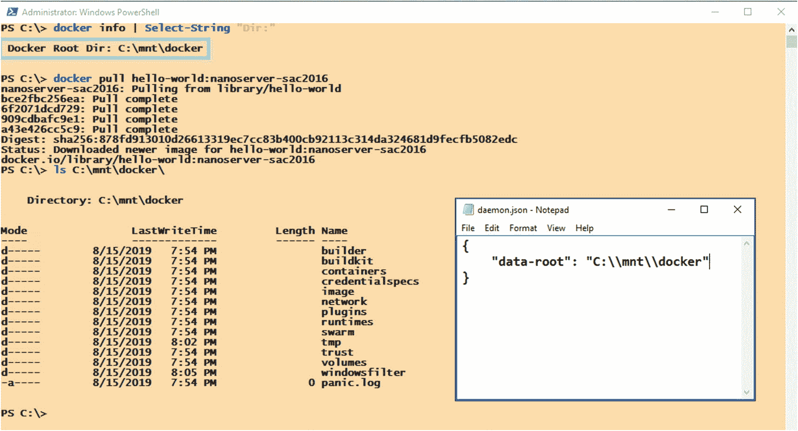
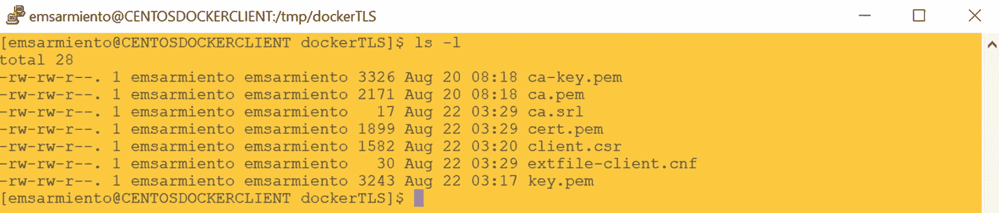
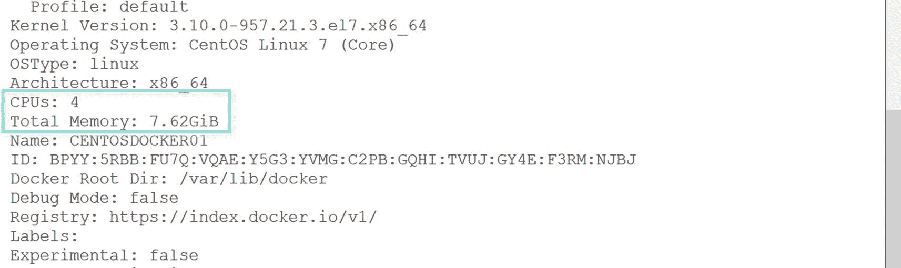

# 6.管理容器

> *永远不要害怕面对真正棘手的问题。当你解决了它，收益将会更大。*
> 
> —卡尔·格斯塔克

作为一名音乐家，使用数字音频工作站(DAW)创造了大量创作音乐的机会。当我学习弹钢琴的时候，我所知道的是我可以在键盘上弹奏的 88 个不同的键。随着我与不同乐队合作的深入，总是要求一个有模拟立式钢琴的场地对我来说变得不切实际。此外，我不可能在演出时随身携带一架 300 磅重的钢琴。就在那时，我决定投资一款轻便的数字合成器。

当我正在为我们的一场演出做准备时，我注意到下一个乐队的键盘手安装了他的 MacBook Pro，并将其插入数字合成器。仅仅是 MacBook Pro 与乐器一起工作就让我感到好奇。我以前从未见过这个。我很确定他不会在表演的时候写 Python 脚本。所以，我问了那个人他的设置。他解释了他的 MacBook Pro 上的软件是如何创建他在播放时使用的不同声音的。他让我听一架钢琴的声音，用一把漂亮的小提琴和琴弦层叠在一起，唤起一种宁静的感觉，仿佛在湖边度过了一个安静的下午。琶音的电子音乐可以唤起一种乐观的感觉，让你动起来。这是一个完全不同的音乐世界。我决定尝试一下，在我的 MacBook Pro 上玩了一把 Ableton Live 软件。我被迷住了。我在制作自己的声音样本、音轨、循环——任何可以拓展我音乐创造力的东西。我的设置现在包括 MacBook Pro 和我的数字合成器。

但是使用任何新工具都会带来一系列挑战。我现在不得不担心管理我的 DAW 创建的大型音频文件，移动它们以避免填满我的主硬盘。我还必须保留一份在不同场地和不同设备上比赛时需要的配置设置列表。我创建的音频文件越多，我就越需要正确地命名它们，这样我就知道它们是什么以及我如何使用它们。我最不想做的事情就是在演出过程中摸索着寻找我需要的音频文件。

我确实说过，使用任何新工具和技术都会带来一系列挑战。与 Docker 或任何你可能接触到的技术合作也是如此。本章将介绍作为 Docker 管理员您将执行的最常见任务，例如在容器上创建、启动和停止 SQL Server。在前面的章节中，您已经了解了我们将要使用的一些 *docker* 命令。所以，在这一点上你应该对它们很熟悉。我们还将研究对 Docker 守护进程进行默认配置之外的配置更改。我不会讨论任何 SQL Server 管理任务，因为我假设您已经熟悉了。您毕竟是 SQL Server DBA，不是吗？

## 配置 Docker 守护程序

与默认的 SQL Server 安装一样，从默认 Docker 安装中获得的配置设置也可以正常工作。但是您可以更改一些配置设置，以增强作为 SQL Server 管理员使用 Docker 的整体体验。

有两种方法可以配置 Docker 守护程序。第一种是在启动 Docker 守护进程时使用标志，就像在 SQL Server 中使用启动参数一样。第二种方法是使用 *daemon.json* 配置文件。

为了说明这两个选项的用法，假设您想要测试新的 Docker 守护进程特性。除非您使用的是 Docker 守护进程的 Edge Channel(包含新功能但未经全面测试的版本),否则所有实验功能都将关闭。您肯定不希望在生产环境中部署不稳定的版本。

### 与码头工人一起工作

要在启动 Docker 守护进程时启用标志，请运行 *dockerd* 命令并传递相应的标志。使用前面的示例启用实验功能，运行以下命令。就像 Windows 服务一样，Docker 守护程序在运行以下命令之前应该处于停止状态:

```
sudo dockerd –experimental

```

注意使用*Docker*命令启动 Docker 守护进程时 *sudo* 的使用——在 Linux 上需要 *root* 权限。并且，类似于使用命令行启动 SQL Server，在使用 *dockerd* 启动守护进程之后，您需要打开另一个终端会话来与 Docker 交互。否则，您可能会在退出当前终端会话时终止该进程。

你可以在 Windows 上做同样的事情，但是不需要 sudo。

在 [`https://docs.docker.com/engine/reference/commandline/dockerd/`](https://docs.docker.com/engine/reference/commandline/dockerd/) 中提供了使用*docker*时可用标志和选项的完整列表。Windows 上是 [`https://docs.microsoft.com/en-us/virtualization/windowscontainers/manage-docker/configure-docker-daemon#configure-docker-on-the-docker-service`](https://docs.microsoft.com/en-us/virtualization/windowscontainers/manage-docker/configure-docker-daemon%2523configure-docker-on-the-docker-service) 。

### 使用 daemon.json

*daemon.json* 文件包含 Docker 守护进程的配置设置。默认情况下， *daemon.json* 文件不存在。您必须手动创建它，以便在 Docker 守护进程上设置自定义配置。

在 Linux 上，文件应该存储在 */etc/docker* 目录中。在 Windows 上，应该在*C:\ program data \ docker \ config*文件夹下。

Tip

如果 *daemon.json* 文件已经存在，请确保在对其进行修改之前制作一份该文件的副本。在修改之前备份配置文件总是一个好主意。毕竟，如果配置更改没有产生预期的效果，拥有一个可以用来回滚更改的备份要比试图记住更改前几分钟所做的事情要快得多。

您可以使用您喜欢的文本编辑器来创建 *daemon.json* 文件，并简单地将其复制到 Docker 主机上的适当目录中。在 Linux 上，需要有 *root* 权限才能将文件复制到 */etc/docker* 目录下。

使用前面在 Docker 守护进程上启用实验特性的相同示例，向其中添加以下内容:

```
{
    "experimental": true
}

```

创建并更新文件后，重启 Docker 守护进程。为此，请在 Linux 上运行以下命令:

```
sudo systemctl restart docker

```

在 Windows 上，这就像你如何重新启动任何 Windows 服务。

Tip

使用 Linux 文件系统时不要不知所措。当您刚刚开始时，您不必总是在命令行上。创建、复制或修改文件等任务可以使用基于 Windows 的应用来完成。为此，我使用了一个名为 WinSCP 的工具。我将使用文本编辑器在我的 Windows 机器上创建该文件，并使用 WinSCP 将其复制到 Linux 机器上。在处理大多数配置设置时，您确实需要 Linux 上的 root 权限。参见*附录 A* 安装和配置 WinSCP 以连接到 Linux 机器。

如果您不需要在 Docker 守护进程上启用实验特性，请确保恢复这些更改。可以添加到 *daemon.json* 文件的配置选项的完整列表可以在 [`https://docs.docker.com/engine/reference/commandline/dockerd/#daemon-configuration-file`](https://docs.docker.com/engine/reference/commandline/dockerd//%2523daemon-configuration-file) 找到。Windows 上是 [`https://docs.microsoft.com/en-us/virtualization/windowscontainers/manage-docker/configure-docker-daemon#configure-docker-with-a-configuration-file`](https://docs.microsoft.com/en-us/virtualization/windowscontainers/manage-docker/configure-docker-daemon%2523configure-docker-with-a-configuration-file) 。

这只是一个非常简单的例子，说明如何使用*Docker*命令或 *daemon.json* 文件对 Docker 守护进程进行配置更改。真正的价值来自于知道如何使用这两种方式来配置 Docker 守护进程。

Note

您可能想知道，“我应该使用哪一个来对我的 Docker 守护进程进行配置更改？”要回答这个问题，回想一下在 SQL Server 中如何使用启动参数 vs. *sp_configure* 。如果要在故障排除练习中进行一次性更改，可以在 SQL Server 中使用启动参数。-m 参数用于单用户模式，-T 用于指定跟踪标志，或者-f 用于以最小配置启动。如果您想要进行永久性的配置更改，如启用备份压缩、设置恢复间隔等，您可以使用 *sp_configure* (尽管您可能会认为有些配置设置只能通过启动参数获得，而有些只能通过 *sp_configure* )。类似地，使用 *dockerd* 进行一次性更改，使用 *daemon.json* 进行永久更改。

### 更改默认图像和容器目录

我在使用 Docker 时看到的最常见的问题之一是处理磁盘空间的挑战。这不正是我们作为 SQL Server 数据库管理员要处理的事情吗？由于数据库文件不断增长或备份文件占用了太多空间，您用完了磁盘空间。这通常是由于疏忽或缺乏计划造成的。但是对于像 Docker 这样通常首先在开发和测试环境中采用的新兴技术，直到平台成为关键任务时才考虑规划(还记得您是如何被迫将那些 Microsoft Access 数据库升级到 SQL Server 的吗？).当你开始时，磁盘空间不足对你来说不是什么大问题。最终会的。

回想一下*章*[T3】5T5】默认 Docker 根目录在 Linux 上的 */var/lib/docker/overlay2* 目录和 Windows 上的*C:\ program data \ Docker \ Windows filter*文件夹。您从 Docker Hub 中提取的 Docker 图像以及容器文件将存储在这些目录中。您可以通过修改 Linux 上的 *daemon.json* 文件并向其中添加以下内容来更改这些默认位置:](05.html)

```
{
    "data-root": "/mnt/docker",
    "storage-driver": "overlay2"
}

```

*/mnt/docker* 目录将成为所有图像和容器的新位置。在配置新的 Docker 根目录之前，请确保该目录已经存在。

下面是在 Linux 上更改默认 Docker 根目录的步骤:

1.  停止坞站守护程序:

    ```
    sudo systemctl stop docker

    ```

2.  修改 *daemon.json* 文件以包含前面的设置。

3.  启动停靠守护进程:

```
sudo systemctl start docker

```

同样的步骤也适用于 Windows。只需将 */mnt/docker* 目录更改为有效的 Windows 目录，如 *C:\\mnt\\docker* (注意使用了两个反斜杠而不是一个反斜杠，因为在 Go 语言中对反斜杠字符的解释不同)并删除行*" storage-driver ":" overlay 2 "*。当然，还可以使用服务管理控制台或命令行来停止和启动 Docker 服务。

您可以通过运行`docker info`命令以及提取新的映像并查看 */mnt/docker/overlay2* 目录的内容来验证这些更改是否已经生效。图 [6-1](#Fig1) 显示了 CentOS Linux 主机上新的 Docker 根目录。


图 6-1

CentOS Linux 主机上的新 Docker 根目录

图 [6-2](#Fig2) 显示了 Windows 服务器主机上新的 Docker 根目录以及 *daemon.json* 文件的内容。



图 6-2

Windows 服务器主机上的新 Docker 根目录

更改默认的 Docker 根目录会创建一个新的目录结构，但不会删除以前的目录结构。这也意味着 Docker 不知道包含所有提取的图像和创建的容器的先前目录——它们仍然在那里。如果您想要重用所有图像层以避免再次提取它们并回收磁盘空间，请在重新启动 docker 守护程序之前将整个 */var/lib/docker* 目录移动到新目录。否则，您将复制图像层，并使用更多的磁盘空间。Docker 不会告诉你在你配置了一个新的根目录后一个映像是否已经存在——它不再知道旧的根目录。

在 Linux 上使用下面的命令将整个 */var/lib/docker* 目录移动到新目录中(在 Windows 上，这只是简单的复制和粘贴)。确保在运行该命令之前首先创建目标目录。

```
mv /var/lib/docker/* /mnt/docker/

```

在步骤#2 和#3 之间添加该命令。如果这是一个全新的安装，没有拉映像，您可以跳过这一步。

## 停止和重新启动 Docker 守护程序

我可能跳过前面，已经提到停止和重新启动 Docker 守护进程而不显示它。实际上，我已经在“在 CentOS Linux 上安装 Docker”一节的第 3 章[中介绍了如何启动 Docker 守护进程学习这个命令对其他事情也很方便，比如停止和重启其他守护进程。另外，无论何时对 Docker 进行配置更改，都需要重新启动它。](03.html)

运行以下命令停止 Docker 守护程序:

```
sudo systemctl stop docker

```

运行以下命令启动 Docker 守护程序:

```
sudo systemctl start docker

```

运行以下命令重新启动 Docker 守护程序:

```
sudo systemctl restart docker

```

看，这很简单。

## 在 CentOS Linux 上为远程访问配置 Docker 守护程序

到目前为止，我们一直使用 SSH 客户端远程连接到 Linux 主机上的 Docker 守护进程。虽然您可能认为这是“远程访问”，但 Docker CLI 客户机和 Docker 守护程序仍在同一台主机上这一事实意味着两者在本地进行交互。真正的远程访问是让 Docker CLI 客户机与远程 Docker 守护进程进行交互，从不同的机器上调用 Docker API。例如，在 Windows 机器上使用 Docker CLI 客户机，并连接到 Linux 主机上的 Docker 守护进程。默认情况下，Docker 守护进程绑定到 Unix 套接字，而不是 TCP/IP 端口。为了远程访问 Docker 守护进程，您需要将其配置为监听 IP 地址和特定的端口号。

下面是在 Linux 上配置对 Docker 守护进程的远程访问所涉及的过程的高级概述:

1.  使用 *systemd* 单元文件配置对 Docker 守护进程的远程访问。

2.  通过配置相互 TLS 加密来保护 Docker 守护进程套接字。

3.  更新 *daemon.json* 以包含相互 TLS 加密的设置。

4.  启用防火墙端口以允许流量进入 Docker 守护程序。

### 使用 *systemd* 单元文件配置对 Docker 守护进程的远程访问

我们将使用 *systemd* 来配置对 Docker 守护进程的远程访问，而不是使用*Docker*或 *daemon.json* 文件。Docker 文档提到在 *daemon.json* 文件中设置 *hosts* 数组，以允许远程访问 Docker 守护进程。不幸的是，我已经根据文档测试了尽可能多的可能的变体，但没有任何结果。因此，我尝试了文档中提到的其他方法。这就是使用 systemd 的地方。

*systemd* 提供了一个在 Linux 上控制程序和进程的标准进程。它是一个初始化系统和服务管理器，包括按需启动守护程序、引导时的并行处理和使用 Linux 控制组的进程跟踪等功能。初始化系统是一个守护进程，它在计算机启动时启动，并一直运行到计算机关闭。在 *systemd* 中，*单元*指的是系统知道如何控制的任何资源。这些资源是使用称为单元文件的配置文件定义的。您可以使用单元文件来定义如何在系统上管理这些资源。除了使用*Docker*标志和 daemon.json，Docker 守护进程还可以使用 *systemd* 单元文件进行配置。

Note

我没有把使用 *systemd* 作为配置 Docker 守护进程的一种方式，因为这需要理解 Linux 的内部机制。因为 Docker 守护进程就像运行在 Linux 上的任何其他守护进程一样，所以您使用 *systemd* 配置 Docker 的方式与您配置其他守护进程的方式没有什么不同。但是要非常小心。仅选择一种方式来配置 Docker 守护程序。使用 *systemd* 、 *dockerd* 标志或 *daemon.json* 配置 Docker 会导致冲突，从而阻止 Docker 守护进程启动。

对于此任务，我们将使用 *systemd* 对默认 Docker 配置进行更改:

1.  运行以下命令，使用 Linux 上的默认文本编辑器为 Docker 守护程序创建一个覆盖文件。覆盖文件是一种改变守护进程行为的方式，而无需修改其对应的 *systemd* 单元文件。*系统控制编辑*命令确保超驰设置被正确加载。

    ```
    sudo systemctl edit docker.service

    ```

2.  Add the following content in the file and save it:

    ```
    [Service]
    ExecStart=
    ExecStart=/usr/bin/dockerd -H fd:// -H tcp://172.28.106.158:2376

    ```

    将提供的 IP 地址替换为 CentOS Linux Docker 主机的 IP 地址。此外，Docker 守护程序监听的默认端口号是 2375(未加密)和 2376(加密)。端口 2376 将用于 Docker CLI 客户端和 Docker 守护程序之间的安全通信。

    H 标志将 Docker 守护进程绑定到一个监听套接字，可以是 Unix 套接字，也可以是 TCP/IP 端口。您可以指定多个-H 标志来绑定到多个套接字/端口，如提供的示例所示。

    不要被两次指定的 *ExecStart* 参数搞糊涂了。在设置新的覆盖值之前，需要清除一些参数。 *ExecStart* 参数就是其中之一。

3.  运行以下命令来重新加载 *systemd* 单元文件:

    ```
    sudo systemctl daemon-reload

    ```

4.  最后，重新启动 Docker 守护进程:

    ```
    sudo systemctl restart docker

    ```

完成后，Docker 守护进程现在被配置为监听 TCP/IP 端口，并且可以被远程访问。您可以检查 Docker 守护进程的状态进行验证，如图 [6-3](#Fig3) 所示。


图 6-3

在 CentOS Linux Docker 主机上配置的 TCP 端口上进行远程访问

此外，您可以使用下面的 *netstat* 命令来验证 Docker 守护进程确实在监听端口 2376(如果您的 Linux 主机上没有安装 *netstat* 命令，请运行`yum -y install net-tools`命令来安装必要的包):

```
sudo netstat -lntp | grep dockerd

```

你肯定需要知道如何使用*VI*——Linux 上默认的文本编辑器——来做这件事。否则，在 Windows 上使用您喜欢的文本编辑器创建名为 *override.conf* 的覆盖文件。然后可以使用 WinSCP 将 *override.conf* 文件复制到*/etc/systemd/system/docker . service . d/*目录。如果没有使用 *systemctl edit* 命令，需要手动创建 *docker.service.d* 目录。

Tip

在本章的前面，我提到了使用带有标志的*Docker*或 *daemon.json* 文件对 Docker 守护进程进行配置更改。我希望永远都是这样。但是我使用开源软件的经验告诉我要面对一些挑战。其中之一是做事方式的不一致。为远程访问配置 Docker 守护进程就是一个例子。使用开源软件时，不一致是意料之中的。我只是设定正确的期望，以防你感到沮丧。

### 通过配置相互 TLS 加密来保护 Docker 守护程序套接字

既然 Docker 守护进程已经在您的网络上可用，那么您就有责任保护它免受不安全连接的影响。好的一面是 Docker 守护进程只允许来自经可信证书颁发机构(CA)签名的证书认证的客户端的连接。同样，Docker CLI 客户端仅使用可信 CA 签署的证书连接到 Docker 守护程序。如果您过去已经使用证书配置了 SQL Server 数据库镜像，则过程非常相似。对于本例，我们将创建自己的证书，而不是使用来自可信公共 CA 的证书。这不是您在生产环境中会做的事情，但它确实能完成工作。

此过程将引导您为 Docker 守护程序配置相互 TLS 加密。在 CentOS Linux Docker 主机上

1.  创建一个临时目录来存储 CA 私钥和公钥。稍后将引用该目录来指向证书的位置。

    ```
    mkdir /tmp/dockerTLS
    cd /tmp/dockerTLS

    ```

2.  运行下面的 *openssl* 命令来创建 CA 私钥。出现提示时，提供私钥的密码。

    ```
    openssl genrsa -aes256 -out ca-key.pem 4096

    ```

3.  Run the following *openssl* command to create the CA public key. When prompted, provide details to identify the public key. Figure [6-4](#Fig4) provides an example of this. For the *Common Name* field, be sure to provide the hostname that you use to connect to your Docker daemon and can be resolved in the network. In this example, the fully qualified domain name (FQDN) of my CentOS Linux Docker host is *CENTOSDOCKER01.TESTDOMAIN.COM*.

    ```
    openssl req -new -x509 -days 365 -key ca-key.pem -sha256 -out ca.pem

    ```

    

    图 6-4

    CA 公钥的详细信息

4.  运行下面的 *openssl* 命令来创建服务器密钥:

    ```
    openssl genrsa -out server-key.pem 4096

    ```

5.  运行下面的 *openssl* 命令来创建证书签名请求。确保*通用名称*值与您在第 3 步中提供的 Docker 守护进程的主机名相匹配。

    ```
    openssl req -subj "/CN=CENTOSDOCKER01.TESTDOMAIN.COM" -sha256 -new -key server-key.pem -out server.csr

    ```

6.  运行以下命令创建扩展配置文件。由于 TLS 连接可以通过 IP 地址和 FQDN 建立，因此在创建证书时需要指定 IP 地址。扩展配置文件将包含 Linux Docker 主机的 FQDN、其 IP 地址和回送 IP 地址，因此您仍然可以通过 TCP 端口本地连接到 Docker 守护进程。

    ```
    echo subjectAltName = DNS:CENTOSDOCKER01.TESTDOMAIN.COM,IP:172.28.106.158,IP:127.0.0.1 >> extfile.cnf

    ```

7.  运行以下命令以追加扩展配置文件并添加扩展用法属性，以便 Docker 守护程序的密钥只能用于服务器身份验证:

    ```
    echo extendedKeyUsage = serverAuth >> extfile.cnf

    ```

8.  运行下面的 *openssl* 命令，用 CA 签署公钥，并把扩展配置文件传递给它:

    ```
    openssl x509 -req -days 365 -sha256 -in server.csr -CA ca.pem -CAkey ca-key.pem -CAcreateserial -out server-cert.pem -extfile extfile.cnf

    ```

在 */tmp/dockerTLS* 目录下应该有如下文件，如图 [6-5](#Fig5) 所示。


图 6-5

完成所有步骤后创建的文件

现在，我们已经准备好使用 Docker CLI 客户机了。对于本例，Docker CLI 客户端也运行在名为 *CENTOSDOCKERCLIENT* 的 CentOS Linux 机器上。

在 CentOS Docker 客户端机器上

1.  创建一个临时目录来存储 CA 私钥和公钥。稍后将引用该目录来指向证书的位置。

    ```
    mkdir /tmp/dockerTLS
    cd /tmp/dockerTLS

    ```

2.  运行下面的 *openssl* 命令来创建客户端密钥:

    ```
    openssl genrsa -out key.pem 4096

    ```

3.  运行下面的 *openssl* 命令来创建证书签名请求:

    ```
    openssl req -subj '/CN=client' -new -key key.pem -out client.csr

    ```

4.  运行以下命令创建扩展配置文件，使客户端密钥适合客户端身份验证:

    ```
    echo extendedKeyUsage = clientAuth > extfile-client.cnf

    ```

5.  Copy the *ca.pem* and *ca-key.pem* files that you generated on the Docker daemon’s host machine to the */tmp/dockerTLS* directory on the client machine. You can use WinSCP or the *scp* command on Linux to do so. You should have the following files in the */tmp/dockerTLS* directory as shown in Figure [6-6](#Fig6). Don’t proceed to the next step unless you have all the files available.

    

    图 6-6

    完成所有步骤后创建的文件

6.  运行下面的 *openssl* 命令来生成签名证书，传递公钥、私钥和扩展配置文件。出现提示时，提供 CA 私钥的密码。

    ```
    openssl x509 -req -days 365 -sha256 -in client.csr -CA ca.pem -CAkey ca-key.pem -CAcreateserial -out cert.pem -extfile extfile-client.cnf

    ```

现在，我们已经拥有了在 Docker CLI 客户机和远程 Docker 守护进程之间建立相互 TLS 加密所需的所有文件。但是我们还没完。

### 更新 daemon.json 以包含相互 TLS 加密的设置

我们必须告诉 Docker 守护进程强制加密和认证的远程连接。以下配置选项将被添加到 *daemon.json* 文件中:

*   *tlsverify* :值 *true* 强制加密和认证远程连接。

*   *tlscacert*:Docker 守护进程将只信任这个 CA 签署的证书。

*   *TLS cert*:TLS 证书文件的路径。

*   *TLS key*:TLS 密钥文件的路径。

将以下内容添加到 *daemon.json* 文件中并保存。记下您在 Docker 主机上生成的文件的路径。

```
"tlscacert": "/tmp/dockerTLS/ca.pem",
"tlscert": "/tmp/dockerTLS/server-cert.pem",
"tlskey": "/tmp/dockerTLS/server-key.pem",
"tlsverify": true

```

更新 *daemon.json* 文件后，重启 Docker 守护进程:

```
sudo systemctl restart docker

```

### 启用防火墙端口以允许流量进入 Docker 守护程序

当您使用 Docker CLI 客户机本地连接到 Docker 守护进程时，您不需要担心防火墙。这是因为您已经通过 SSH(在端口 22 上)登录到机器上，并在本地运行命令。启用对 Docker 守护进程的远程访问意味着您需要打开 Linux 防火墙上的端口 2376。

运行以下命令，使防火墙允许端口 2376 上的远程连接。默认情况下，FirewallD 是 CentOS Linux 上可用的防火墙解决方案。

```
sudo firewall-cmd --zone=public --add-port=2376/tcp --permanent

```

运行以下命令以重新加载添加的新防火墙规则:

```
sudo firewall-cmd --reload

```

启用防火墙端口后，使用 TELNET 测试端口 2376 的连通性。

### 测试远程客户端连接

当然，最终的测试是您何时可以从连接到远程 Docker 主机的 Docker CLI 客户机运行命令。运行以下命令连接到远程 Docker 主机。确保您在 */tmp/dockerTLS* 目录中，这样您就不必提供公钥、签名证书和客户端密钥的绝对路径。

```
docker --tlsverify --tlscacert=ca.pem --tlscert=cert.pem --tlskey=key.pem -H=172.28.106.158:2376 info

```

H 参数指向远程 Docker 主机的 IP 地址。或者，您可以使用主机名或 FQDN，前提是它可以在网络上解析。图 [6-7](#Fig7) 显示了运行在 *CENTOSDOCKERCLIENT* 上的 Docker CLI 客户端连接到运行在 *CENTOSDOCKER01* 上的远程 Docker 主机。


图 6-7

Docker CLI 客户端连接到远程 Docker 主机

通过使用 *export* 命令在当前会话中设置环境变量，还可以避免在运行 *docker* 命令时重复提供与远程连接相关的参数。在运行任何 *docker* 命令之前，运行以下命令。图 [6-8](#Fig8) 显示了设置环境变量和运行 *docker* 命令到远程 docker 主机。


图 6-8

设置环境变量以将 Docker CLI 客户端连接到远程 Docker 主机

```
export DOCKER_TLS_VERIFY=1
export DOCKER_HOST=tcp://172.28.106.158:2376
export DOCKER_CERT_PATH=/tmp/dockerTLS/

```

### 清除

为 TLS 相互身份验证配置客户端和服务器后，您不再需要证书签名请求。您可以分别删除客户机和服务器上的 *client.csr* 和 *server.csr* 文件。您可以对扩展配置文件-**ext file-client . CNF**和 **extfile.cnf** 进行同样的操作。

此外，为了防止您的密钥被意外覆盖，请删除它们的写权限。在客户端计算机上运行以下命令，使密钥仅可由您的用户帐户读取:

```
chmod -v 0400 ca-key.pem key.pem

```

同样，在服务器上运行以下命令:

```
chmod -v 0400 ca-key.pem server-key.pem

```

您需要对证书进行同样的操作，以防止它们被意外覆盖。在客户端计算机上运行以下命令，使证书仅对您的用户帐户可读:

```
chmod -v 0400 ca.pem cert.pem

```

同样，在服务器上运行以下命令:

```
chmod -v 0400 ca.pem server-cert.pem

```

配置在 Windows 上运行的 Docker CLI 客户端的过程是相同的。但是由于 OpenSSL 不是 Windows 自带的，所以必须手动安装。参考*附录 A* 在 Windows 工作站上安装和配置 OpenSSL。

一旦进入 OpenSSL 命令提示符，您就可以运行与用于 Linux 相同的命令，但是没有 *openssl* 命令。比如命令`openssl genrsa -out key.pem 4096`就应该写成`genrsa -out key.pem 4096`。图 [6-9](#Fig9) 显示了一台运行 Docker CLI 客户端的 Windows 10 机器连接到一台 Linux Docker 主机。但是，请注意-H 参数。该格式类似于 DOCKER_HOST 环境变量中定义的格式。此外，不使用 *export* 关键字，而是使用 *set* 关键字来定义环境变量。


图 6-9

Windows 10 主机上的 Docker CLI 客户端连接到远程 Linux Docker 主机

## 配置 Docker CLI Bash 完成

他们说最懒的 IT 专业人员是那些成为系统管理员的前开发人员。根据我的经验，这可能有点道理。我从 Visual Basic 换成了 C#。因为 Visual Studio 在 2005 年就有了智能感知。当 Monad(PowerShell 的原名)问世时，我立即转换了所有基于 VBScript 的管理脚本，以利用 PowerShell 命令 Shell 中的 tab 自动完成功能。我总是在想办法让我的生活更轻松。

这让我开始配置 Docker CLI bash 完成。Bash 补全允许您在编写 *docker* 命令时使用 tab 自动补全。虽然这最初是为开发人员设计的，但是没有什么可以阻止您使用它来简化 Docker 的管理。在使用 Docker 完成脚本之前，您需要在您的 Linux 发行版上启用 bash 自动完成功能。

在 Ubuntu 上，运行以下命令刷新包数据库并安装 bash 自动完成包:

```
sudo apt update
sudo apt install bash-completion

```

在 CentOS 上，运行以下命令:

```
sudo yum -y install bash-completion

```

启用 bash 自动完成功能后，通过运行以下命令将 Docker 完成脚本放在 */etc/bash_completion.d/* 目录中。确保每次更新 Docker 时都运行这个命令:

```
sudo curl https://raw.githubusercontent.com/docker/docker-ce/master/components/cli/contrib/completion/bash/docker -o /etc/bash_completion.d/docker.sh

```

注销当前会话，然后重新登录。你可以试着键入 *docker images m* 后跟标签。它节省了您在 Linux 上键入 SQL Server 镜像名称【mcr.microsoft.com/mssql/server:2017-CU14-ubuntu*的时间。您还可以使用它来显示特定命令的可用参数。例如，尝试运行*docker run-*，然后运行 TAB。它将显示 *docker run* 命令的所有可用参数。*

 *## 启动和停止容器

在第*章* [*第 4 章*](04.html) 中，你已经有了运行容器的经验。使用 *docker run* 命令是启动容器的最快方式。如果本地磁盘中不存在映像，它会提取映像并启动它。传递给 *docker run* 命令的不同参数决定了容器如何运行。我们已经在第*章* [*4*](04.html) 中介绍了在容器上运行 SQL Server 时会用到的最常见的参数，所以只需参考这些参数。

一个好的做法是使用 *docker pull* 命令在 Docker 主机上提取所有需要的图像，这样就不需要花费时间来运行或启动容器。一旦拉动，您可以使用 *docker create* 命令预先创建容器。以下命令在 Linux 容器上创建一个 SQL Server，而不运行它。这几乎与我们在*章节* [*4*](04.html) 中使用的命令相同，但是没有 *-d* 参数(分离模式)。

```
docker create -e "ACCEPT_EULA=Y" -e "SA_PASSWORD=mYSecUr3PAssw0rd" -p 1433:1433 --name sqldevlinuxcon01 -h linuxsqldev01 mcr.microsoft.com/mssql/server:2017-CU14-ubuntu

```

仅仅通过运行`docker ps`命令，您不会看到一个已创建的容器。您需要在`docker ps`命令中使用*-一个*参数来显示所有的容器，不管它们的状态如何。如果想更具体一点，可以使用 docker ps 命令的 *-f* 参数，按具体条件过滤。以下命令显示所有创建的容器:

```
docker ps -a -f status=created

```

然后可以使用下面的 *docker start* 命令，只传递容器名或 ID:

```
docker start sqldevlinuxcon01

```

停止容器就像运行 *docker* stop 命令并传递容器名或 ID:

```
docker stop sqldevlinuxcon01

```

您可能想运行一个 *docker kill* 命令来终止一个正在运行的容器。不要。这是我们正在谈论的容器上的 SQL Server 实例，而不是任何随机的应用。回想一下，为了提交或回滚所有事务，将所有脏页写入磁盘，然后在事务日志中写入一个条目，必须正确关闭 SQL Server。运行 *docker kill* 命令将阻止 SQL Server 执行干净关闭，并可能导致数据丢失，甚至更糟的是数据损坏。一个 *docker stop* 命令将优雅地发送一个 SIGTERM 信号(请求终止)给运行在容器内部的进程，在本例中是 SQL Server。这是在 Linux 环境中关闭 SQL Server 的正确方法。

此外，请记住，停止容器并不会将其从 Docker 主机中删除。这就是为什么不能创建另一个同名容器的原因。如果您想要创建另一个与您之前使用的容器同名的容器，您需要首先删除它。

Tip

您开始看到在 *docker run* 命令中使用 *- name* 参数的好处。我们在 *docker start* 和 *docker stop* 命令中使用了容器的名称——sqldevlinuxcon 01——而不是容器 ID。这使得使用容器而不是依赖系统生成的 id 变得容易。当创建 SQL Server 容器时，总是在 *docker run* 命令中使用 *- name* 参数。

您可以使用的一个技巧是使用-q 参数显示所有容器及其相应的容器 ID，如以下命令所示:

```
docker ps -a -q

```

然后，您可以将它传递给 *docker start* 或 *docker stop* 命令，分别启动或停止所有容器，如下所示:

```
docker start $(docker ps -a -q)

```

## 删除容器和图像

如果您想清理 Docker 主机，删除旧的和不需要的容器，那么 *docker rm* 命令就是您所需要的。但是，您将无法删除正在运行的容器。必须先停止容器，然后才能删除它，如以下命令所示:

```
docker stop sqldevlinuxcon01
docker rm sqldevlinuxcon01

```

互联网上有很多例子(甚至 Docker 文档)演示了在 *docker rm* 命令中使用 *-f* 参数来同时停止和删除一个容器。避免这种诱惑。在 *docker rm* 命令中使用 *-f* 参数就像运行 *docker kill* 命令一样，会导致 SQL Server 突然终止。

处理图像是另一回事。请记住，容器只是一个读写文件系统层，位于映像的只读文件系统层之上，这意味着您可以删除所有基于映像的容器，而不会影响映像。但是，当您删除一个映像时，您将无法再创建新的容器，除非通过再次从存储库中提取映像，使其在 Docker 主机上可用。同样，当图像被正在运行的容器使用时，您也不能删除它。在删除图像之前，您必须停止并删除所有使用它的容器。以下命令显示了如何使用 *docker rmi* 命令删除图像，按照事件的顺序–从停止和删除容器到删除图像:

```
docker stop sqldevlinuxcon01
docker rm sqldevlinuxcon01
docker rmi mcr.microsoft.com/mssql/server:2017-CU14-ubuntu

```

## 与运行中的容器交互

我在第*章* [*4*](04.html) 中提到过，我并不热衷于登录服务器并与它们直接交互。我宁愿远程连接到它们，除非我真的需要进行故障排除——容器也是一样。但是如果我真的需要，我会使用 *docker exec* 命令。这允许我在一个正在运行的容器中运行一个命令。假设我想在 Linux 容器上的现有 SQL Server 中运行一个 bash shell，这样我就可以检查文件系统结构。使用 *-i* (交互式)和 *-t* (伪终端)参数运行下面的 *docker exec* 命令，传递想要运行的命令(bash)。图 [6-10](#Fig10) 显示了终端如何从以自己身份登录的 *CENTOSDOCKER01* (我的 Linux Docker 主机的名称)变为以 root 身份登录的*Linux SQL dev 01*(Linux 容器上的 SQL Server 的名称)。我现在可以从操作系统的角度交互式地使用容器了。


图 6-10

在运行的容器上运行 bash

```
docker exec -it sqldevlinuxcon01 bash

```

同样，您可以运行以下命令在 Windows 容器上的 SQL Server 内部运行 PowerShell 命令 Shell:

```
docker exec -it sqldevwincon01 powershell

```

在过去，终止 bash 或 PowerShell 外壳也会终止容器。不再是了。但是，按 Ctrl+PQ 退出交互 shell 仍然是一个很好的做法。

## 在主机和容器之间共享文件

可能在某些情况下，您的 Docker 主机上有一些文件，您希望与容器共享。例如，您可能希望在容器内的 SQL Server 实例上还原 SQL Server 数据库的备份。您可以将备份文件复制到 Docker 主机上的一个目录中，并使其对您的容器可用。这就是 *docker run* 命令的 *-v* 或 *- volume* 参数的用武之地。首先，在您的 Linux Docker 主机中创建一个 */tmp/dbData* 目录。然后，将数据库备份复制到该目录中。使用下面的命令，将 Linux Docker 主机上的 */tmp/dbData* 目录挂载到容器内的 */var/opt/mssql* 目录。这与我们一直使用的 *docker run* 命令相同，只是这个命令有一个 *-v* 参数。

```
docker run -e "ACCEPT_EULA=Y" -e "SA_PASSWORD=mYSecUr3PAssw0rd" -p 1433:1433 --name sqldevlinuxcon01 -d -h linuxsqldev01 -v /tmp/dbData:/var/opt/mssql mcr.microsoft.com/mssql/server:2017-CU14-ubuntu

```

您可以将容器中的 */var/opt/mssql* 目录想象成 Linux Docker 主机中的 */tmp/dbData* 目录，就像网络共享文件夹一样。存储在容器内的 */var/opt/mssql* 目录中的任何数据都将被持久化到 Linux Docker 主机中的 */tmp/dbData* 目录中，这意味着您可以删除 SQL Server 容器并保留您的数据库文件。您不仅在 Linux Docker 主机和您的容器之间共享数据和文件，还持久化了在您的容器内部创建的数据。更多细节将在*章节* [*7*](07.html) 中出现。

一旦容器中装载了 */tmp/dbData* 目录，SQL Server 实例就可以访问其中的备份文件。然后，您可以在容器内的 SQL Server 实例上还原备份。当然，由于容器内部的 */var/opt/mssql* 目录指向 Linux Docker 主机中的 */tmp/dbData* 目录，所以你创建的每一个数据库也会被存储在 */tmp/dbData* 目录中。您可以通过还原数据库备份，然后删除容器来测试这一点。图 [6-11](#Fig11) 显示了删除 SQL Server 容器后，Linux Docker 主机中 */tmp/dbData* 目录的内容。


图 6-11

在 Linux Docker 主机和容器之间共享数据

在 Windows 上运行以下命令创建一个容器，并将 Windows Docker 主机上的 *C:\dbData* 文件夹映射到容器内的 *C:\dbData* 文件夹。该文件夹不必存在于容器中，它将在运行容器的过程中创建。请注意，使用正斜杠(/)而不是反斜杠(\)来定义路径。在过去，由于 Go 语言解释字符的方式，在定义路径时只有正斜杠字符起作用。现在，你可以两者都用。我使用正斜杠只是为了与 Windows 和 Linux 路径保持一致。

```
docker run -e "ACCEPT_EULA=Y" -e "SA_PASSWORD=mYSecUr3PAssw0rd" –p 1433:1433 --name sqldevwincon01 -d -h winsqldev01 –v  C:/dbData:C:/dbData microsoft/mssql-server-windows-developer

```

在主机和容器之间共享文件的另一种方法是使用 *docker cp* 命令。使用同一个示例，如果您想要从您的 Linux Docker 主机的 *sqldevlinuxcon01* 容器中复制*/tmp/db data/north wind backup . bak*文件，请运行以下命令。您可以使用容器 ID 或容器名称，但我更喜欢使用容器名称，这样我就能确切地知道我在处理什么。

```
docker cp /tmp/dbData/NorthwindBackup.bak sqldevlinuxcon01:/var/opt/mssql/data

```

在 Windows 上，只需将路径替换为正确的 Windows 目录路径，考虑正斜杠而不是反斜杠。

```
docker cp C:/dbData/NorthwindBackup.bak sqldevwincon01:C:/

```

您也可以执行相反的操作，使用以下命令将一个文件——在本例中为 *testDB.bak* 文件——从容器复制到 Linux Docker 主机:

```
docker cp sqldevlinuxcon01:/var/opt/mssql/data/testDB.bak /tmp/dbData/

```

显然，在 Docker 主机和容器之间共享文件的方式不止一种。

## 配置容器资源

默认情况下，容器没有资源约束。它可以使用主机内核调度程序允许的给定资源。就 SQL Server 而言，这不是一件好事。我们知道 SQL Server 会用尽系统中所有可用的内存资源。同样，它将占用所有可用的 CPU 核心。考虑这将如何影响您的许可(如果这是一个测试环境，并且您只运行企业评估版、开发版或速成版，这没什么大不了的)。但是，如果您已经许可了 Docker 主机上的所有 CPU 核心，就不需要担心 SQL Server 许可了。

配置容器消耗的 CPU 和内存资源的方式类似于将资源分配给虚拟机的方式。使用 *docker run* 命令，添加*-CPU*参数来分配您的容器可以使用的 CPU 资源数量，添加 *- memory* 参数来设置最大内存量(您可能会认为这可以通过 SQL Server 内部的 *sp_configure* 来完成，但是如果在容器级别完成会好得多，因为您不能在同一个 Linux 主机上运行多个 SQL Server 实例)。在我的测试环境中，我的 Linux Docker 主机被配置为具有 4 个 CPU 内核和 8GB 内存，如图 [6-12](#Fig12) 所示。



图 6-12

Docker 主机的已配置硬件资源

使用提供的格式运行下面的 *docker stats* 命令，显示在运行多个查询时，我的 Linux 容器上的 SQL Server 的 CPU 和内存使用情况，如图 [6-13](#Fig13) 所示。显然，它占用了 Docker 主机上可用的大部分 CPU 和内存资源(用完了所有 7.62GB 内存)。


图 6-13

集装箱资源利用

```
docker stats sqldevlinuxcon01 --format "table {{.Name}}\t{{.CPUPerc}}\t{{.MemUsage}}"

```

运行以下命令在 Linux 容器上创建并运行 SQL Server，分别使用*-CPU*和 *-内存*参数仅分配 2 个 CPU 和 4GB 内存:

```
docker run -e "ACCEPT_EULA=Y" -e "    SA_PASSWORD=mYSecUr3PAssw0rd" -p 1433:1433 --name sqldevlinuxcon01 -d -h linuxsqldev01 --cpus="2" --memory=4g mcr.microsoft.com/mssql/server:2017-CU14-ubuntu

```

在限制了容器可以使用的 CPU 和内存资源量之后，在 SQL Server 实例上重新运行我的查询，使用 *docker stats* 命令显示新的资源利用率，如图 [6-14](#Fig14) 所示。当然，测试结果取决于许多不同的因素——硬件配置、SQL Server 实例配置、数据库模式、索引、查询等等。这只是为了演示如何配置容器资源利用率。


图 6-14

配置容器 CPU 和内存资源利用率后

在 [`https://docs.docker.com/config/containers/resource_constraints/`](https://docs.docker.com/config/containers/resource_constraints/) 可以找到配置容器资源利用率的其他方法。

## 浏览容器日志

在第*章* [*4*](04.html) 中，我谈到了 SQL Server 密码复杂性策略失败如何阻止容器启动。如果它运行在 Windows 或 Linux 主机上，我可以很容易地使用文本编辑器打开 SQL Server 错误日志，检查可能的原因。但是因为 SQL Server 错误日志在容器内部，所以我无法访问它，除非启动容器或者在 Linux Docker 主机上安装了 */var/opt/mssql* 目录。这就像试图访问停止的虚拟机内部的 SQL Server 错误日志一样。好在 Docker 通过 *docker logs* 命令公开这些日志。

以下命令将在 Linux 容器上创建一个新的 SQL Server。观察 *SA_PASSWORD* 参数值如何不符合 SQL Server 密码复杂性策略。

```
docker run -e "ACCEPT_EULA=Y" -e "SA_PASSWORD=password12" -p 1433:1433 --name sqldevlinuxcon01 -d -h linuxsqldev01 mcr.microsoft.com/mssql/server:2017-CU14-ubuntu

```

如果您使用`docker ps -a`命令检查所有容器的状态，您将看到容器立即退出，如图 [6-15](#Fig15) 所示。


图 6-15

Linux 容器上的 SQL Server 启动后立即终止

正如我在第*章* [*4*](04.html) 中提到的，我浪费了大量的时间试图找出是什么导致了容器停止。直到我查看日志，我才发现真正的问题是什么。使用*docker logs<container name>T7】命令查看容器内部生成的 SQL Server 错误日志，如图 [6-16](#Fig16) 所示。在发现真正的问题与 *SA_PASSWORD* 参数值有关之后，我做了必要的修改并重新运行了该命令。*


图 6-16

运行 docker 日志以浏览 SQL Server 错误日志

Note

与 Linux 不同，在 Windows 上，SQL Server 密码复杂性策略失败不会终止容器，也不会在 SQL Server 错误日志中创建条目。容器将继续运行，但它不允许您使用您提供的 *sa* 凭证登录。您将需要 DBA 技能来使用 *docker exec* 命令交互式登录到容器，并以单用户模式启动 SQL Server 实例，这样您就可以更改 *sa* 密码。

您还可以使用带有 *-f* 参数的 *docker logs* 命令来实时查看 SQL Server 错误日志。我发现在排除 SQL Server 相关问题时，这是一种比运行 *sp_readerrorlog* 好得多的方法，因为我可以确切地看到正在发生的事情。这就像在 SQL Server 错误日志中有一个实时跟踪一样。图 [6-17](#Fig17) 显示了同时使用 *sp_readerrorlog* 和 *docker logs* 命令。


图 6-17

sp_readerrorlog 与 docker logs 命令来浏览 SQL Server 错误日志

## 查看 Docker 守护程序的状态

了解 Docker 守护进程的状态也是确保它平稳运行的关键。如果您需要执行一些故障排除，它还可以引导您找出问题。在第*章* [*3*](03.html) 中在 Linux 主机上安装 Docker 守护进程之后，我们做的事情之一就是使用下面的命令检查它的状态。 *-l* 参数显示完整的消息，不会用省略号截断它们。图 [6-18](#Fig18) 显示了 Linux 主机上 Docker 守护进程的状态。


图 6-18

显示 Linux 中 Docker 守护进程的状态

```
sudo systemctl status docker -l

```

因为 Docker 就像任何其他 Linux 守护进程一样，它也将其日志发送到 *systemd* 日志。您可以将 *systemd* journal 视为 Windows 事件日志。您可以通过运行以下命令从 *systemd* 日志中访问所有系统事件:

```
sudo journalctl

```

但是考虑到它包含了所有的系统事件和日志，这可能有点让人不知所措。我们只想要 Docker 守护进程的系统日志。要显示来自 *systemd* 日志的 Docker 守护进程日志，请运行以下 *journalctl* 命令。如果您想为每个条目显示更详细的信息，也可以传递 *-o verbose* 参数。

```
sudo journalctl -u docker

```

这些存储在 Ubuntu 上的 */var/log/syslog* 文件或 CentOS 上的 */var/log/messages* 文件中。您可以使用以下命令检索 Docker 相关事件。根据您的 Linux 发行版，只需替换适当的文件名。图 [6-19](#Fig19) 显示了在 CentOS Docker 主机上运行该命令时 Docker 相关的事件。


图 6-19

显示 Linux 中 Docker 守护进程的状态

```
sudo cat /var/log/messages | grep docker

```

在 Windows 主机上，由于事件被写入 Windows 事件日志，您可以过滤应用日志，以便只显示来自 *docker* 的事件源。或者，您可以使用以下 PowerShell 命令:

```
Get-EventLog -LogName Application -Source Docker

```

## 摘要

就管理 Docker 和容器而言，我们已经在这一章中涉及了很多内容。但这还不是全部。从 SQL Server DBA 的角度来看，这足以让您开始管理容器和 Docker 主机。随着您使用 Docker 的工作越来越多，您将会越来越多地接触 Linux 操作系统。我相信从第*章* [*3*](03.html) 开始，你已经了解了很多关于 Linux 的知识。我们只是触及了表面。我可以保证，在你读完这本书的时候，你将会使用 Linux 文件系统，配置守护进程，管理系统资源，以及更多的东西。当您使用运行在 Docker 容器中的 SQL Server 做更多的工作时，您别无选择，只能真正精通 Linux。

在“在主机和容器之间共享文件”一节中，我介绍了如何使用卷来使 Docker 主机上的目录在容器内部可用。下一章将更详细地介绍这一点，以及如何在有状态应用(特别是 SQL Server)的容器中管理和持久化数据。此外，如果不能在关系数据库中持久存储数据，那么关系数据库又有什么用呢？我们将确保容器中的 SQL Server 数据库不会发生这种情况。*