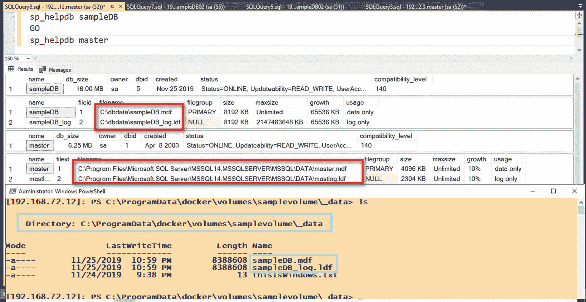

# 7.持久数据

> *最模糊的墨迹比最强烈的记忆更有力量。*
> 
> —中国谚语

在我的书桌上安顿下来后，我立刻向主日学校的老师要了几张纸和蜡笔。我并不喜欢写作，这只是我作为一个生病的孩子能做的为数不多的事情之一。据我的医生说，我不能粗暴地打球，我不能做运动，我甚至不能大笑(别人是这么告诉我的)。所以，就是看书、弹钢琴、写作——或者涂鸦，因为我甚至看不懂自己的笔迹。

我的主日学校老师递给我一块神奇的石板，据她说，这是一种可重复使用的绘图设备。我 4 岁的大脑试图理解它是什么，以及它是如何工作的。此外，那时我只知道铅笔，有时蜡笔和纸。有人告诉我，我可以在上面画画，拿起薄薄的纸擦掉我的画，一遍又一遍，想画多少次就画多少次。它配有手写笔，但我的指甲很好，可以用来乱涂乱画。于是，我开始涂鸦画画。我在上面写了我的名字。我甚至试着画出其中一个孩子的脸，尽可能的详细。有趣的是，当我给他看我的艺术素描时，我们俩都笑了。

当他举起魔法石板上的那张薄薄的纸时，我们的笑声被打断了。我花了几个小时仔细画的画，在我还没来得及说“本”的时候就全没了(如果你正在读这篇文章，对不起，本。总得有人被扔到公共汽车底下，而我恰好是讲这个故事的人)。我崩溃了。怎么会发生这种事？我大哭起来，直到我的主日学校老师走近我们，问发生了什么事。当我试图解释我的画所做的消失动作时，她提醒我这就是神奇石板的工作原理。你在上面写字，然后拿起那张薄薄的纸擦掉所有的东西。它是这样设计的。我花了足足半个小时才最终定下心来，要了纸和蜡笔。我回到我知道有效的地方，发誓再也不碰那块神奇的石板。至少我是这么认为的。

在您过多地参与在容器上部署 SQL Server 数据库之前，我想确保您弄清楚一件事:Docker 容器最初是专门为无状态而设计的。这意味着它们没有数据持久性，并且当它们被移动到另一个服务器(如果您决定部署一个具有多个主机的 Docker Swarm 集群)或者容器被破坏时，它们不能维护数据。作为 SQL Server 数据库专业人员，这是一个大禁忌。我们希望保护它，备份它，并确保它在我们需要时就在那里。这个 Docker 东西怎么会适合 SQL Server 或任何类型的数据存储平台呢？

如果是这样的话，我可以跳过这一章。但我没有。本章介绍了如何使用有状态的应用程序，比如容器中的关系数据库。我将向您介绍 Docker 卷，如何使用它们，以及使用卷来存储 SQL Server 数据库文件。完成配置后，您将会看到 Docker 容器如何用于有状态应用程序，尤其是 SQL Server。

## 有状态与无状态应用程序

我在前面提到过，Docker 最初是被设计成无状态的。无状态应用程序是那些不保存在一个会话中生成的客户端数据以供下一个会话使用的应用程序。想象一下每隔一周从你最喜欢的理发师那里理一次发。无国籍意味着你每次来都要告诉你的理发师你想要什么发型。你的理发师没有记录你喜欢的发型，也没有你在商店里最喜欢的椅子，也没有给你用洗发水做他们标志性的头皮按摩；你明白了。

相比之下，有状态应用程序会保存每次会话中生成的客户端数据，并在下次客户端发出请求时使用这些数据。这是你的理发师在准备你最喜欢的椅子和洗发水，洗发水将用于他们标志性的头皮按摩，并且在你走进商店的那一刻就已经准备好做你喜欢的发型了。所有这些关于你和你的偏好的信息都储存并持续在你的理发师的大脑中。然而，你可能会争辩说，大脑是一个临时存储器，因为如果你的理发师决定去度假，你就必须告诉接替你的理发师你的所有偏好。存储这些信息的一个更好的方法是写在一张纸上，让所有理发师都可以访问——或者如果商店足够复杂，一个有后端数据库的客户关系管理(CRM)系统。

我假装对发型和理发店了如指掌，但我真的不知道。我已经 10 年没见过理发师了。不要评判我。

## 容器是短暂且不可变的

电影《黑客帝国重装上阵》中我最喜欢的一个场景是关于尼奥和先知的对话。虽然他们讨论中传达的哲学思想更让我着迷，但他们对话中这个特殊的问题引起了我的注意。对话是这样的:

*   尼奥:为什么一个程序会被删除？

*   圣谕师:也许它坏了。也许会有一个更好的程序来取代它——这种事情经常发生。

我不确定这段对话是否启发了容器的两个原则:短暂和不可变。但这确实是解释它们如何应用于容器的好方法。

短暂意味着容器是短暂的——暂时的。不可变意味着容器是不变的；状态和内容在创建后不能修改。就像先知向 Neo 解释为什么一个程序会被删除一样，一个应用程序可能会出现故障或升级以提供额外的功能。先知是对的，这的确经常发生。但是，我们过去处理运行在服务器上的软件以解决这两种可能结果的方式与 Neo 非常不同。当一个应用出现故障或需要升级时，我们不会删除它。我们将它移动到不同的服务器，或者不同的虚拟机(VM)。我们维护、修补、更新、迁移等等。运行该应用的服务器具有更长的生命周期，并且不断更新——但很少被删除。我们将它们带到软件的下一个版本，带来了所有可能影响应用程序稳定性和性能的包袱和垃圾。难怪升级或迁移项目会花费如此多的时间和资源。

另一方面，容器的生命周期非常短。想要在容器上运行新版本的应用程序吗？很简单。不要更新容器。只需删除和部署一个新的应用程序的新版本。听起来太简单了？您必须等到本章的后面部分才能看到这一点。

## 云提供商如何实施基础设施即服务

您是否曾经想过，像亚马逊网络服务(AWS)、微软 Azure 或谷歌云平台这样的云服务提供商如何能够在最短的停机时间内轻松扩展虚拟机？他们会告诉你选择一个更大的虚拟机并重启机器。就这样。起初，我对这种“以最小的停机时间扩展”的方法持怀疑态度，因为它违背了我所知道的关于升级和扩展服务器的一切。作为一名数据中心工程师，我花了几年时间来做这件事，而且它肯定不需要几分钟——尤其是对于具有大型数据库的 SQL Server。所以，我在微软 Azure 和 AWS 上都试过。图 [7-1](#Fig1) 展示了云服务提供商如何从概念上为虚拟机提供这种纵向扩展方法。


图 7-1

如何在云中以最短的停机时间纵向扩展虚拟机

我很震惊。它确实能像发表的那样工作。但我还是不能百分百信服。我利用我所知道的关于扩展运行 SQL Server 数据库的服务器的一切，开始做思想实验(你知道，我们做这些实验是为了假装我们比一般的 DBA 更聪明)。以下是事实。

SQL Server 数据库只是文件(MDF、NDF 和 LDF 文件),数据库引擎通过访问这些文件来读写数据。这些文件存储在一个存储子系统上，该子系统连接到一个具有计算资源(CPU 和内存)的服务器。如果我需要纵向扩展一台服务器以增加计算能力，同时最大限度地减少停机时间，我通常会准备另一台安装了相同版本操作系统和 SQL Server 的服务器。然后，我将开始使用数据库镜像或日志传送在机器之间复制数据库。如果我有可用的存储资源，我将复制存储子系统，同时保持目标计算机上的 SQL Server 数据库引擎停止，而不只是复制数据库。一旦我准备好切换到纵向扩展的机器，我只需停止源机器，完成复制过程，并在目标机器上启动 SQL Server 数据库引擎。停止源计算机上的 SQL Server 数据库引擎可以彻底关闭所有数据库，然后终止服务。这包括提交或回滚事务，将所有脏页写入磁盘，然后将一个条目写入事务日志。在目标计算机上启动 SQL Server 数据库引擎允许它运行恢复—读取事务日志，并在使数据库联机之前提交或回滚事务。这就是 SQL Server 一开始的工作方式。所以，这没什么新鲜的。

Tip

“了解 SQL Server 中的日志记录和恢复”一文包含了有关 SQL Server 内部日志记录和恢复的更多信息。这是基本信息，这些概念适用于除 SQL Server 之外的所有商业关系数据库管理系统。在 [`https://docs.microsoft.com/en-us/previous-versions/technet-magazine/dd392031(v=msdn.10)`](https://docs.microsoft.com/en-us/previous-versions/technet-magazine/dd392031%2528v%253Dmsdn.10%2529) 查看文章。

还记得我说过的思想实验吗？如果我们不使用两个独立的存储子系统——一个用于源机器，另一个用于目标机器——来存储数据库文件，而是简单地将它与服务器分离，会怎么样？如果我们不是将它直接连接到服务器，而是简单地拥有一个指向存储的指针，会怎么样？服务器可以访问远程存储，SQL Server 数据库引擎可以访问文件。通过将计算与存储分离，您可以在最短的停机时间内执行纵向扩展过程，因为您只需将新计算重定向到旧存储即可。这不是已经在 SQL Server 2012 中提供了吗——将数据库文件存储在 SMB 文件共享中？SQL Server 2014 怎么样——在 Azure Blob 存储中存储数据库文件？

Note

当被问及跟上和掌握新技术的秘诀是什么时，我的典型回答是“不要忘记旧的”看到这些新技术特性是旧技术的改进还是旧技术的结合是很有趣的。以 SQL Server 始终在线可用性组为例。它是数据库镜像和 Windows Server 故障转移群集的组合，这两者自 SQL Server 2005(更早的故障转移群集)以来就已存在。可读的二级副本呢？这是行版本控制的实时实现，也是自 SQL Server 2005 以来一直可用的功能。SQL Server 2008 中引入的 filestream 功能？它是内存 OLTP 的支柱。我可以不断列举 SQL Server 每个新版本中引入的不同功能，并且可以在旧功能中找到它们的根源。要么是微软已经看到了未来，并正在引导市场向他们的方向发展，要么是他们真的很擅长最大限度地利用现有的技术投资。我认为这是一个绝妙的策略。我想我的主日学校老师甚至在先知和尼欧对话之前就知道一些技术。她一直告诉我圣经中的这句非常著名的诗句:“历史只是在重演。以前都做过。太阳底下没有什么是真正新的。”

啊，原来他们是这么做的。图 [7-2](#Fig2) 展示了云服务提供商如何从概念上通过将计算与存储分离来实现虚拟机的纵向扩展。


图 7-2

将计算与存储分离，可以在最短的停机时间内纵向扩展虚拟机

仔细想想，自 21 世纪初推出存储区域网络(SAN)以来，我们已经使用这种方法几十年了。服务器(计算)运行应用程序，数据存储在应用程序之外——存储。做这个思维实验让我想起了我们在 2006 年为一个大型 SQL Server 2000 故障转移集群实例(FCI)做的一个迁移项目。由于 SQL Server FCI 将计算从存储中分离出来，我们设法相当快速地替换了一个有问题的故障转移群集节点，方法是将它连接到现有的 SAN，并通过适当的验证将其加入群集。这也让我想起了我在 2010 年做的另一个数据中心迁移项目。按照前面描述的工作流顺序，再加上跨地理位置复制存储子系统，使我能够在不到一个小时的时间内将 400 多台 SQL Server 物理机从洛杉矶的一个数据中心移动到拉斯维加斯的另一个数据中心。

由于虚拟机只是存储在磁盘上的文件系统格式，用元数据来表示计算资源(CPU、内存、网络),因此纵向扩展要容易得多。只需将存储从旧虚拟机重定向到新虚拟机。云服务提供商可以通过幕后的自动化工作流流程来实现这一点，包括分别在源和目标虚拟机上正确停止和启动 SQL Server 服务的步骤，只要底层硬件拥有适当的计算资源来支持新虚拟机。

## Docker 卷

容器短暂和不可变的概念以及计算与存储的分离使得 Docker 可以运行像关系数据库这样的有状态应用程序。尽管最初被设计为运行无状态应用程序，但是在容器之外存储数据允许您利用它们短暂和不可变的特性，同时在您决定删除程序时能够存储数据。我是说，集装箱。

回想一下在第*章* [*5*](05.html) 中，容器由存储在 Docker 主机的本地存储器上的文件系统层组成。文件系统层构成了容器，并与其生命周期相关联。文件系统层(包括存储在其中的数据)在创建容器时创建，在删除容器时删除。很简单，不是吗？为了将计算与存储分离，我们需要一个存在于容器之外的对象。输入 Docker 卷。

Docker 卷是表示容器外部的文件系统的对象。它是容器联合文件系统之外的一个目录，与 Docker 主机文件系统上的文件一起作为普通目录存在。Docker 卷是保存容器生成和使用的数据的首选方式。我喜欢把 Docker volumes 想象成一个网络共享文件夹——它看起来像是操作系统(容器)内部的一个文件夹，但却在它的外部。容器之外的卷允许您在不影响容器大小的情况下向其中添加尽可能多的数据，这对于 SQL Server 数据库来说是完美的。因为它是一个存在于容器外部的对象，所以使用它自己的`docker volume`子命令来管理它。例如，如果要创建 Docker 卷，可以运行以下命令。请确保提供一个有意义的名称。否则，Docker 将为该名称分配一个 64 个字符的 GUID 值。你看完*章* [*5*](05.html) 肯定不想再看到那些 64 个字符的 GUID 值名称了。

```
docker volume create samplevolume

```

默认情况下，创建 Docker 卷会在主机上创建一个目录，该目录在 Linux 中位于 */var/lib/docker/volumes* 中，在 Windows 中位于*C:\ program data \ Docker \ volumes*中。

创建 Docker 卷后，您可以在此处使用`docker volume inspect`命令检查元数据:

```
docker volume inspect samplevolume

```

图 [7-3](#Fig3) 显示了在 Windows 主机和 Linux 主机上创建的 Docker 卷的元数据。请注意以下几点:


图 7-3

创建和检查 Docker 卷元数据

*   *驱动*:显示存储卷驱动的名称。默认情况下，Docker 将使用内置的本地驱动程序创建卷。这意味着卷将只对创建它们的主机上的容器可用。

*   *Mountpoint* :显示 Docker 主机本地文件系统中目录的完整路径。将卷附加到容器时，容器中生成的任何数据都将存储在此处。

因为 Docker 卷只是文件系统层中的目录，所以我可以直接从主机添加和修改这些目录中的文件，而不必运行容器。

Tip

在 Linux 上工作时，始终要记住权限。在 Windows 中，我只需成为本地管理员组的成员就可以访问*C:\ program data \ docker \ volumes*目录，而在 Linux 中却不是这样。*根用户*拥有 */var/lib/docker/volumes* (以及 */var/lib/docker* 目录中的所有内容)。为了直接访问目录并进行任何更改，您需要拥有 *root* 权限。你可以切换到*根*或者给命令加上前缀 *sudo* 。

图 [7-4](#Fig4) 显示了一个简单的文件，我将其复制到 Linux 主机和 Windows 主机上的 Docker 卷中。请记住，我目前没有任何运行的容器。


图 7-4

对 Docker 卷进行更改

您可以使用`docker volume ls`命令列出所有可用的 Docker 卷。最后，您可以使用`docker volume rm`命令删除特定的 Docker 卷，如下所示:

```
docker volume rm samplevolume

```

我不会删除我在这里创建的卷。在下一节中，我将把它与一个容器一起使用，并把它作为一个卷安装。

您可以通过运行如图 [7-5](#Fig5) 所示的`docker volume`命令来显示管理 Docker 卷的可用子命令列表。


图 7-5

列出管理 Docker 卷的所有命令

## 将卷附加到容器

让我们使用上一节中创建的 Docker 卷，并将它们附加到一个容器中。对于 Linux 容器，我将使用 CentOS 7 映像并将 *samplevolume* 卷附加到它。使用 *docker run* 命令的 *- mount* 参数，如下所示。我正在传递一个 *-it* 参数(对于交互式会话为 *i* ，对于伪 TTY 或终端会话为 *t* ，这样我可以检查其中的文件系统。 *docker run* 命令的 *- mount* 参数使用了易于理解的 *key=value* 对。在提供的示例中， *source* 是 Docker 卷的名称， *target* 是容器内的目录。

```
docker run --mount source=samplevolume,target=/tmp/dockervolume -it centos:7

```

您将看到 *thisIsLinux.txt* 文件，它是在创建容器之前复制到卷中的。图 [7-6](#Fig6) 显示了从容器内部看到的文件。


图 7-6

将卷附加到 Linux 容器并显示其内容

对于 Windows 容器，我将使用 Windows Server 2016 Nano 服务器映像，并将 *samplevolume* 卷附加到它。但是我将使用 *-v* (或 *- volume* )参数，而不是使用 *docker run* 命令的 *- mount* 参数。这是支持的在 Windows Server 容器中附加卷的方式。参考 [`https://docs.microsoft.com/en-us/virtualization/windowscontainers/manage-containers/persistent-storage`](https://docs.microsoft.com/en-us/virtualization/windowscontainers/manage-containers/persistent-storage) 如何处理 Windows Server 容器中的持久存储。

```
docker run -v samplevolume:c:\dockervolume -it microsoft/nanoserver:sac2016 powershell

```

你会看到 *thisIsWindows.txt* 文件，这个文件在容器创建之前就被复制到卷中了，如图 [7-7](#Fig7) 所示。


图 7-7

将卷附加到 Windows 容器并显示其内容

### To -v 或 to - mount

除了支持 Windows 服务器容器和 Linux 容器之外，您可能想知道 *docker run* 命令的 *-v* 和 *- mount* 参数之间有什么区别。首先出现的是 *-v* 参数，因此您将在文档和在线资源中看到它的更多用法。 *- mount* 参数仅在 Docker 版本 17.06 中引入。最初， *-v* 参数用于独立容器， *- mount* 参数用于 Docker Swarm 中的服务。现在，您可以将 *- mount* 参数用于两者。另外， *- mount* 参数语法更容易理解，因为它明确使用了 *key=value* 对。只需看看在 Linux 容器上附加一个卷的示例命令`docker run`。

这两个参数将在 Docker 主机上创建目录，以防它不存在。但是它们不会告诉您试图附加到容器的卷是否已经存在。这对于任何其他类型的应用程序都没问题，但对于 SQL Server 肯定不行。想象一个 Linux 容器上的 SQL Server 使用一个卷来存储系统和用户数据库。如果您启动一个新容器并附加另一个 SQL Server 容器已经在使用的现有卷，您将得到一个如图 [7-8](#Fig8) 所示的*错误 17113* 以及一条*访问被拒绝*错误消息。这是因为现有容器中的 *sqlservr* 进程已经对用于运行 SQL Server 实例的系统数据库文件进行了独占锁定。


图 7-8

将卷附加到已被现有 SQL Server 容器使用的新 SQL Server 容器

对于新的部署，建议使用 *- mount* 参数，除非您在 Windows 容器或任何 Windows 服务器容器上部署 SQL Server。有关更多信息，请参考关于在 [`https://docs.docker.com/storage/volumes/`](https://docs.docker.com/storage/volumes/) 使用卷的 Docker 文档。

### 在容器之间共享体积？

当我在研究如何在容器之间共享数据时，Docker 卷的话题出现了很多。这并不奇怪，因为即使是 Docker 也推荐这样做。当您阅读关于使用卷的文档时，这是被列为优点的项目之一:*卷可以更安全地在多个容器之间共享。*

等等什么？Docker 容器运行时引擎的创建者 Docker 告诉您使用卷，以便您可以在多个容器之间共享它们？你一定是在开玩笑！其他人也在说同样的话。

为了理解我在上一节中提到的“以最小的停机时间进行扩展”的方法，我已经做了一些思想实验，我决定再次收集我对 SQL Server 的了解，并过滤关于 Docker 卷的陈述，看看它是否有意义。所以现在开始。SQL Server 数据库引擎启动对数据库文件的排他锁以供访问。这样做是因为能够使用数据库的一部分是打开属于它的所有文件并执行恢复。如果 SQL Server 数据库引擎对所有数据库文件都有独占锁，那么其他进程(如另一个 SQL Server 数据库引擎)就无法获得对同一组数据库文件的独占访问权。Microsoft 建议将 SQL Server 数据库文件排除在防病毒扫描范围之外是有原因的:确保文件在 SQL Server 进程必须使用它们时不会被锁定。不要让我开始使用第三方工具，这些工具在执行备份时绕过 SQL Server APIs 来停顿数据库文件。你以为可以保护你的工具，其实是造成灾难的工具。

鉴于 SQL Server 进程需要数据库文件上的排他锁，让多个 SQL Server 容器访问同一个卷是没有意义的。我再说一遍:让多个 SQL Server 容器访问同一个卷是没有意义的。还记得图 [7-8](#Fig8) 中的错误信息吗？我希望我说得很清楚了。

为 Docker 辩护，因为容器最初是为无状态应用程序设计的，让多个容器访问同一个卷的做法完全有道理。假设您的所有应用程序都有一个日志模块。日志模块可以在容器中实现，并将日志文件写入可以在多个日志容器之间共享的卷中。由于大多数日志记录应用程序主要是写密集型的，只有很少的读访问权限(直到一个审计员醒来后决定要求一份详细的审计报告)，因此将日志文件存储在一个卷中有一个好处，即所有日志都是“真实的单一来源”。此外，您不必执行任何提取-转换-加载(ETL)或提取-加载-转换(ELT)过程，因为所有数据都存储在一个位置，即卷中。

值得重复的是:让多个 SQL Server 容器访问同一个卷是没有意义的。

## 通过容器上的 SQL Server 利用卷

在第*章* [*6*](06.html) 中，我在“在主机和容器之间共享文件”一节中强调了卷的使用现在，您已经了解了 Docker 卷及其工作原理，很明显这就是我们使用 SQL Server 在容器中持久存储数据的方式。

在 Linux 主机上运行以下命令，将创建的卷 *samplevolume* 附加到 Linux 容器上的 SQL Server:

```
docker run -e "ACCEPT_EULA=Y" -e "SA_PASSWORD=mYSecUr3PAssw0rd" -p 1433:1433 --name sqldevlinuxcon01 -d -h linuxsqldev01 --mount source=samplevolume,target=/var/opt/mssql mcr.microsoft.com/mssql/server:2017-CU14-ubuntu

```

*/var/opt/mssql* 目录是 Linux 中默认的 SQL Server 目录。该目录包含以下结构:

*   *数据*:包含系统数据库文件、用户数据库文件和事务日志文件的目录

*   *log* :包含 SQL Server 错误日志文件、默认跟踪文件和默认扩展事件会话的目录

*   *secrets* :包含为 SQL Server 实例生成的服务器主密钥的目录

在 Linux 容器上创建 SQL Server 的过程中， */var/opt/mssql* 目录的内容作为安装过程的一部分被复制到容器中。因为我们告诉 Docker 将容器内的 */var/opt/mssql* 目录挂载到 *samplevolume* 卷，所以该目录的内容在 Docker 主机的本地文件系统中创建—*/var/lib/Docker/volumes/sample volume/_ data*。就像图 [7-6](#Fig6) 中一样，您将看到 *thisIsLinux.txt* 文件，它是在创建容器之前复制到卷中的。图 [7-9](#Fig9) 显示了 Docker 主机文件系统内部的文件以及 */var/opt/mssql* 目录的内容。


图 7-9

装载到 Linux 容器上的 SQL Server 的卷的内容

容器启动并运行后，我可以在 SQL Server 中创建一个示例用户数据库，数据库文件将在 *samplevolume* 卷中创建。图 [7-10](#Fig10) 显示了从容器文件系统内部和 Docker 主机文件系统看到的数据库文件。是的，我确实创建了一个名为 *sampleDB* 的样本数据库。


图 7-10

在卷中创建 SQL Server 数据库文件

请记住，因为 Linux 中的默认 SQL Server 目录是我们装载到卷中的目录，所以系统和用户数据库将在同一位置创建。但是没有什么可以阻止您为系统数据库保留默认的数据库文件位置，而只是为用户数据库使用一个卷。在 Linux 主机上运行以下命令，将创建的卷 *samplevolume* 附加到 Linux 容器上的 SQL Server，使用容器内的 */tmp/dbdata* 目录作为用户数据库文件位置。确保停止并删除 Linux 容器上现有的 SQL Server，以便可以重用容器名称和端口号。

```
docker run -e "ACCEPT_EULA=Y" -e "SA_PASSWORD=mYSecUr3PAssw0rd" -p 1433:1433 --name sqldevlinuxcon01 -d -h linuxsqldev01 --mount source=samplevolume,target=/tmp/dbdata mcr.microsoft.com/mssql/server:2017-CU14-ubuntu

```

在我的例子中，我还清理了 *samplevolume* 卷中与 SQL Server 相关的内容，只保留了 *thisIsLinux.txt* 文件。删除容器不会删除卷的内容。请记住，卷存在于容器之外。我还使用下面的`CREATE DATABASE`命令来创建示例数据库。注意*目标*目录的使用—*/tmp/db data*。

```
CREATE DATABASE [sampleDB]
ON PRIMARY
(NAME = N'sampleDB', FILENAME = N'/tmp/dbdata/sampleDB.mdf')
 LOG ON
(NAME = N'sampleDB_log', FILENAME = N'/tmp/dbdata/sampleDB_log.ldf')

```

图 [7-11](#Fig11) 显示了默认 SQL Server 目录中的系统数据库和 *samplevolume* 卷中的示例用户数据库。


图 7-11

在卷中创建 SQL Server 用户数据库

事实上，Windows 上的 SQL Server 容器就是这样配置的。与 Linux 容器上的 SQL Server 将整个 */var/opt/mssql* 目录复制到容器中不同，Windows 容器上公开可用的 SQL Server 仍然利用默认的 SQL Server 目录—*C:\ Program Files \ Microsoft SQL Server \ MSSQL { nn }。MSSQL\* 。将卷装载到 Windows 容器上的 SQL Server 只会在容器文件系统内创建目标目录，不会更改默认的数据库文件位置，因为已经安装了 SQL Server 实例。

在 Windows Server 主机上运行以下命令，使用容器内的 *C:/dbdata* 目录将创建的卷 *samplevolume* 附加到 Windows 容器上的 SQL Server。同样，请确保停止并删除 Windows 容器上的现有 SQL Server，以便可以重用容器名称和端口号。

```
docker run -e "ACCEPT_EULA=Y" -e "SA_PASSWORD=mYSecUr3PAssw0rd" -p 1433:1433 --name sqldevwincon01 -d -h winsqldev01 -v samplevolume:C:/dbdata microsoft/mssql-server-windows-developer

```

图 [7-12](#Fig12) 显示了默认 SQL Server 目录中系统数据库的 Windows 容器等价物，以及 *samplevolume* 卷中的示例用户数据库。



图 7-12

在卷中创建 SQL Server 用户数据库–Windows 容器

Note

您可以在容器上运行的 SQL Server 上修改默认的 SQL Server 数据库文件位置，无论是在 Windows 还是 Linux 上。您可以通过创建自定义 SQL Server 映像而不是使用 Microsoft 公开提供的映像来实现这一点。第 9 章和第 10 章[分别介绍了如何为 Windows 和 Linux 创建定制的 SQL Server 映像。](10.html)

我见过客户这样部署 SQL Server 数据库——系统数据库与用户数据库存储在不同的位置。我还见过在同一位置部署 SQL Server 数据库(包括系统数据库和用户数据库)的客户。没有对错之分，也没有一个是最佳实践而另一个不是。但是将系统和用户数据库放在同一个位置有一个好处。在下一节中，您将看到一个非常好的例子。

删除容器不会删除卷。因为卷存在于容器之外，所以您不必担心有人不小心删除了容器并清除了其中的所有数据库——您不必担心，因为这种情况从未发生过。

尽管卷是存在于容器之外的对象，但是当现有容器正在使用卷时，您将无法删除它。祝你好运。Docker 知道卷何时附加到容器，并且不允许您删除它，即使您使用了`docker volume rm`命令的 *-f* 参数。图 [7-13](#Fig13) 显示了我尝试删除我的 Windows 和 Linux 容器上的 SQL Server 正在使用的 *samplevolume* 卷。错误消息还显示使用它的容器的容器 ID 值。


图 7-13

阻止删除附加到正在运行的容器的卷的 Docker

请确保跟踪 SQL Server 容器正在使用哪些卷。您不希望最终将另一个 SQL Server 容器正在使用的现有卷附加到新卷。即使在当今持续集成、持续交付和开发运维的世界中，没有什么可以替代适当的过程和文档。

## 智能 SQL Server 就地升级

我们过去更新或升级 SQL Server 的方式是下载累积更新(是的，微软从 SQL Server 2017 开始不再发布 service packs)并安装在 SQL Server 实例上。安装过程将停止 SQL Server 服务，应用二进制文件，然后启动 SQL Server 服务。这适用于 Windows 和 Linux 上的 SQL Server。

这个过程是有风险的，可能会影响您的服务级别协议(SLA)。首先，SQL Server 实例需要的停机时间取决于整个更新过程运行的时间长度。我曾经见过这样的情况，安装 SQL Server service pack 需要一个小时甚至更长时间。这对于 SLA 非常严格的系统来说是不可接受的。此外，如果更新的安装没有按计划进行，回滚过程可能会从烦人到绝对痛苦。还记得因为服务包安装失败而不得不恢复所有数据库备份的时候吗？

在上一节中，我暗示了将系统和用户数据库保存在同一个位置的一个非常大的好处:快速更新 SQL Server 实例。还记得我们如何将计算与存储分离吗？与其安装 SQL Server 更新，不如将计算机切换到新版本的 SQL Server？让我给你看看。

在 Linux 主机上运行以下命令，将创建的卷 *samplevolume02* 附加到 Linux 容器上的 SQL Server。我们将把 Linux 上 SQL Server 的默认目录–*/var/opt/MSSQL–*附加到这个卷上。同样，一定要停止并删除 Linux 容器上现有的 SQL Server，以便可以重用容器名和端口号。

```
docker run -e "ACCEPT_EULA=Y" -e "SA_PASSWORD=mYSecUr3PAssw0rd" -p 1433:1433 --name sqldevlinuxcon01 -d -h linuxsqldev01 --mount source=samplevolume02,target=/var/opt/mssql mcr.microsoft.com/mssql/server:2017-CU14-ubuntu

```

创建一个示例数据库，以便验证系统和用户数据库是否已创建并存储在 *samplevolume02* 卷中。图 [7-14](#Fig14) 显示了我使用的图像的 SQL Server 版本——带 CU14 的 SQL Server 2017(14 . 0 . 3076 . 1)——以及示例数据库的数据库版本号(869)。


图 7-14

图像的 SQL Server 版本和数据库版本号

为了准备更新，我将从 Microsoft Container 注册表中提取公开发布的 SQL Server 2017 with CU17 映像。这样，我就不必将提取映像所需的时间作为维护窗口的一部分。我的有效停机时间将只包括在容器之间切换和更新 SQL Server。

```
docker pull mcr.microsoft.com/mssql/server:2017-CU17-ubuntu

```

我将使用此映像创建一个运行 SQL Server 2017 和 CU17 的新容器。此时，我的 SQL Server 2017 数据库仍在运行，没有经历任何停机。这里概述的流程是我将如何升级我的 SQL Server 2017:

1.  停止 Linux 容器上的现有 SQL Server:

1.  基于带有 CU17 映像的 SQL Server 2017，在 Linux 容器上创建一个新的 SQL Server，新名称为 *sqldevlinuxcon02* 。将 *samplevolume02* 卷装到这个新容器上。我正在重用相同的端口号和主机名。

    ```
    docker run -e "ACCEPT_EULA=Y" -e "SA_PASSWORD=mYSecUr3PAssw0rd" -p 1433:1433 --name sqldevlinuxcon02 -d -h linuxsqldev01 --mount source=samplevolume02,target=/var/opt/mssql mcr.microsoft.com/mssql/server:2017-CU17-ubuntu

    ```

```
docker stop sqldevlinuxcon01

```

就这样，您的 SQL Server 2017 with CU14 实例和所有数据库都已更新到 SQL Server 2017 with CU17。图 [7-15](#Fig15) 显示了带有更新过程跟踪的 SQL Server 错误日志。


图 7-15

更新容器时出现 SQL Server 错误日志

重新运行图 [7-14](#Fig14) 中使用的相同查询现在会产生不同的 SQL Server 版本号——14 . 0 . 3238 . 1——但具有相同的数据库版本号，如图 [7-16](#Fig16) 所示。


图 7-16

更新了 Linux 容器上的 SQL Server

Note

如果您决定将 Linux 容器上的 SQL Server 2017 升级到 SQL Server 2019，您需要从使用非 root 用户的 SQL Server 2017 容器开始。Microsoft 对 Linux 容器上 SQL Server 的部署方式进行了修改，以最大限度地降低安全风险。大多数 Docker 容器中的进程作为一个根用户运行。容器中的 *root* 用户也是 Linux 主机上的同一个 *root* 用户。这基本上意味着如果容器受到危害，Linux 主机也会受到危害。还记得在 Windows 计算机上拥有本地管理员权限的 SQL Server 服务帐户吗？还是拥有活动目录域管理权限的用户？

在 Linux 容器上升级现有的 SQL Server 2017 并不像运行新的 SQL Server 2019 容器并将现有卷装载到其中那样简单。因为 Linux 容器上的 SQL Server 2017 默认以 *root* 身份运行，所以 *root* 用户拥有卷中的所有 SQL Server 文件夹和文件。为了启动 SQL Server，必须将文件夹和文件的所有权重新分配给非 root 用户。其他信息请参考 [`https://docs.microsoft.com/en-us/sql/linux/sql-server-linux-configure-docker?view=sql-server-2017#buildnonrootcontainer`](https://docs.microsoft.com/en-us/sql/linux/sql-server-linux-configure-docker%253Fview%253Dsql-server-2017%2523buildnonrootcontainer) 构建和运行非根 SQL Server 2017 容器的过程。

我没有删除 SQL Server 2017 with CU14 容器，所以我可以将其用作回滚计划。容器仍然存在，并且处于*停止*状态。这就是我用新名称创建一个新容器的原因—*sqldevlinuxcon 02*—Docker 无法创建一个与现有容器同名的新容器，除非您删除旧容器并创建一个与我在前面的练习中所做的同名的新容器。如果更新过程失败，我可以恢复到 SQL Server 2017 with CU14 容器，就像我切换到 SQL Server 2017 with CU17 容器一样快。

但是不要搞错了。仍然没有什么可以替代传统的备份。虽然使用容器执行 SQL Server 更新非常简单快捷，但事实是，当您停止现有容器并创建新容器时，数据库文件并没有被锁定。这可能会导致 Docker 主机上的其他进程在更新进程之间获取 SQL Server 数据库文件的排他锁。在执行更新之前，使用本机 SQL Server 备份或 Linux VDI 客户端上任何受支持的 SQL Server 来备份数据库。

## 摘要

在本章中，我指出了在容器上使用 SQL Server 时需要注意的一些事情。虽然容器最初是为无状态应用程序设计的，并且是短暂和不可变的，但使用 Docker 卷将存储与计算分离允许容器运行像 SQL Server 这样的有状态应用程序。提供的示例演示了如何使用 Docker 卷来存储 SQL Server 数据库，并利用它们来执行操作任务，如在最短的停机时间内更新数据库引擎。

在下一章中，我将介绍在 Linux 上使用 SQL Server，为在 Linux 映像上创建自己的 SQL Server 做准备。作为一名 SQL Server DBA，我假设您已经对 SQL Server 在 Windows 上的工作方式有了基本的了解，所以我将只指出它在 Linux 上工作方式的主要区别。

我将用先知留给尼欧的最后一句话来结束这一章:“在那个确切的时间出现在那里，你将有一个机会。”适当的时候，你的准备会为你让路。