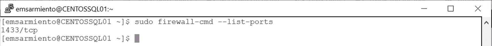

# 八、在 Linux 上使用 SQL Server

> *政策多，原则少，政策会变，原则永远不会变。*
> 
> —约翰·C·麦斯威尔博士

当租车公司的工作人员把钥匙递给我时，她简单地解释了为什么他们只有手动挡的车。她以为我不会开手动档汽车，只是因为我有北美的驾照。我不得不讲述我 15 岁时，我哥哥如何用一辆 1986 年的铃木武士吉普车教我开车的故事。当我告诉她吉普车的事时，她的脸立刻亮了起来——这是她小时候她家开的车。我想简单地提到吉普车就能勾起她和家人美好的童年回忆。

她完成了文书工作，并告诉我去停车场取租来的车的方向。当我走近汽车时，我注意到一些奇怪的事情。"为什么人们走在街道的另一边？"，我问自己。或者，在飞机上呆了近 12 个小时后，我仍在努力熟悉这座城市。“那只是时差，”我告诉自己。但当我打开车门时，情况变得更奇怪了——这是一辆右座驾驶汽车。那时我才意识到这一点也不奇怪。我在英国，这里的人在路的另一边开车。这是他们的常态。

在路的另一边开车，我真的没有任何问题。在新加坡生活的三年半时间教会了我如何应对乘坐公交车、在街上行走，甚至是坐在汽车的副驾驶座上——在马路的另一边。“没什么大不了的，”我想，“能有多难？”。我知道如何驾驶手动档汽车，我也知道如何应付在马路的另一边。我错了。从那个停车场开出来，让我觉得自己又成了一个学车的人。当我要接近减速带时，熄火，缓慢转弯，甚至在我启动汽车时向前行驶的挫折。你知道那种知道该做什么的感觉——因为你一生都在做这件事——但却做不到？我花了大约 2 天时间，终于找到了我的节奏，正常驾驶。我开始喜欢上它了。但是，后来，我不得不还车。

如果您的整个职业生涯都在使用 SQL Server，我可以理解您不愿意考虑在 Linux 上运行它。您的整个职业生涯都建立在使用 Windows 的基础上，包括您的工作计算机和您管理的服务器。你知道捷径，你写了脚本，你能很舒服地解决问题(这是你在家庭节日聚会时成为计算机技术支持人员的原因)。我猜您正在考虑加入成千上万退休后只知道如何管理 Windows 服务器的 IT 专业人员的行列。我不怪你。大型企业在 Windows 服务器上运行任务关键型 SQL Server 数据库。这已经占用了你太多的时间。为什么要迁移到 Linux？

事实是，在微软于 2017 年宣布支持 SQL Server 数据库后，企业已经开始将其迁移到 Linux。鉴于 Docker 最初是 Linux 操作系统的开发者，在 Docker 容器上运行 SQL Server 是下一个合乎逻辑的步骤。所以，虽然你仍然不愿意看企鹅图标，但你的职业生涯将取决于它。

本章介绍如何在 Linux 上使用 SQL Server。我们将看看架构和设置体验。我们将比较在 Windows 和 Linux 上运行 SQL Server。我们将编写简单的 Linux bash 脚本。本章的目的是让您很好地理解如何在 Linux 上创建一个可以作为容器部署的定制 SQL Server 映像。我可以向你保证，这不会像在伦敦繁忙的街道上驾驶手动档汽车那样令人紧张和沮丧。

## Linux 架构上的 SQL Server

在第 [1](01.html) 章中，我讲述了我是如何在一年一度的微软 MVP 峰会的一次高管圆桌会议上发现赫尔辛基项目的。在发布之后，我立即开始询问 SQL Server 工程团队如何成功完成将 SQL Server 移植到 Linux 这一几乎不可能的任务。我对 Oracle 有限的了解使我认为微软工程师必须重写整个代码库来支持在 Linux 上运行 SQL Server。此外，Oracle 为 Windows 和 Linux 提供了不同的代码基础。在如此短的时间内，工程团队是如何在 Linux 上发布 SQL Server 的？

### 吊桥项目

我喜欢历史。我希望我还在上学的时候就知道了。但是历史给了我们一个机会去学习和利用他人已经完成的工作。因此，我向 SQL Server 团队的一名工程师询问了这一切是如何开始的。喝了几瓶我们喜欢的饮料，他谈到了 Project Drawbridge，这是微软内部的一个研究项目，探索应用沙箱的概念。虽然该项目于 2011 年运行，但应用沙箱的概念并不新鲜。还记得在 1979 年 Unix V7 是如何允许进程独立运行的吗？这个概念就这么老了。其背后的思想是限制(或隔离)特定代码可以执行的环境。该项目旨在用沙箱保护基于 Windows 的应用。它解决了虚拟机管理程序解决的同类问题，但与成熟的虚拟机相比，开销和磁盘占用空间要低得多。这么想吧。你可以在互联网上下载一个应用，安装在你的电脑上，而不会接管你的操作系统。在移动设备上运行应用背后的概念是一样的。无论设备和操作系统版本如何，您都可以获得相同的用户体验。

Project Drawbridge 结合了两项核心技术——库操作系统和 picoprocess。库操作系统是应用运行所需的来自操作系统的应用编程接口(API)和动态链接库(dll)的集合。但是，不是加载操作系统的整个副本，而是只在相同的地址空间中加载和运行包含应用需要的功能的操作系统的重构版本(用户模式与内核模式)。事实是，虽然 Windows 操作系统提供了大量的特性和功能，但应用不一定需要所有这些特性和功能。想想迷你窗户。picoprocess 是一个基于进程的隔离容器，具有最小的内核 API 表面。你可以把这两项核心技术想象成大型公寓楼内的公寓单元。公寓单元(picoprocess)拥有租户(应用)在该空间居住所需的电力、水和通风(库操作系统)等设施。但是公寓单元不能独立存在。它必须存在于公寓楼的环境中(计算机硬件加操作系统)。房客可以来去自如，不会打扰大楼里的其他房客。对于房客来说，在公寓单元内来来去去要快得多，而不是等待整个公寓大楼建成。

公用设施接通了公寓大楼的总电源。但是为了让公用设施到达公寓大楼，你需要一个中央配电系统。用于电力的配电系统、用于配水的泵和水箱以及集中式 HVAC 系统。这使得公寓大楼的业主在需要时可以换一家不同的公用事业公司。换一家不同的公用事业公司对租户的影响很小，甚至没有影响，除了可能改变他们的公用事业账单。在 Project Drawbridge 的上下文中，这是平台抽象层(PAL)。

Note

我过度简化了这些概念，以避免深入其实现的技术细节。我的目标不是探究操作系统如何工作的细节，而是提供足够的信息来解释在给定的资源和时间限制下，Linux 上的 SQL Server 是如何成为可能的。关于不同部分如何协同工作的高级架构的两个重要资源是视频 *Drawbridge:一种新形式的应用沙箱虚拟化*，在第 9 频道的 [`https://channel9.msdn.com/Shows/Going+Deep/Drawbridge-An-Experimental-Library-Operating-System`](https://channel9.msdn.com/Shows/Going%252BDeep/Drawbridge-An-Experimental-Library-Operating-System) 和已发布的研究论文*自上而下重新思考库操作系统*在 [`www.microsoft.com/en-us/research/wp-content/uploads/2016/02/asplos2011-drawbridge.pdf`](http://www.microsoft.com/en-us/research/wp-content/uploads/2016/02/asplos2011-drawbridge.pdf) 。

当你开始思考时，吊桥项目听起来很像容器。

### SQLOS 和 SQLPAL

如果您已经是 SQL Server DBA 一段时间了，您可能还记得 SQL Server 2000 和 SQL Server 2005 之间架构的重大变化。像其他应用一样，SQL Server 2000 和早期版本利用 Windows 进行硬件资源管理，如线程调度、内存管理和 I/O 处理。还记得著名的 UMS.DLL(SQL 用户模式调度 DLL)文件吗？这限制了 SQL Server 更好地处理硬件资源以实现可伸缩性的能力，尤其是考虑到 21 世纪初硬件功能的进步。为了利用硬件改进来提高性能和可伸缩性，SQL Server 工程团队决定消除对 Windows 硬件资源管理的依赖。输入 SQLOS。

SQLOS 是 SQL Server 将硬件资源管理引入其用户模式进程的尝试。就像 SQL Server 自己的 PAL 进入 Windows 一样。SQLOS 提供操作系统服务，例如非抢占式调度、内存管理、异常处理等。您可以在 [`https://blogs.msdn.microsoft.com/slavao/2005/07/20/platform-layer-for-sql-server/`](https://blogs.msdn.microsoft.com/slavao/2005/07/20/platform-layer-for-sql-server/) 阅读更多关于 SQL Server 2005 中 SQLOS 的介绍及其背后的基本原理。但是尽管 SQLOS 为 Windows 提供了抽象，它仍然不是一个真正的操作系统抽象层。为了让 SQL Server 能够在 Windows 之外的不同操作系统上运行，必须重写 sqlo，使其成为真正的伙伴，不受操作系统的影响。

幸运的是，致力于 Drawbridge 项目的团队已经有了一个移植到 Linux 上的粗略原型。将 Drawbridge 项目和 SQLOS 中已经存在的组件合并起来的想法，加上 Linux 的粗略原型，使得在 Linux 上移植 SQL Server 成为现实，尽管存在限制和约束。谢天谢地，他们不必重写过去 25 年来编写的所有 SQL Server 源代码。这项工作的成果是 SQLOS 的一个改进版本，将 Drawbridge 项目的库操作系统与 SQLOS 结合在一起。他们称之为 SQL 平台抽象层(SQLPAL)。这使得 SQL Server 团队能够利用为 Windows 编写的大量可执行 SQL Server 代码在 Linux 上运行。他们还创建了一个主机扩展层，一个直接与操作系统交互的抽象层。为了使 Windows 和 Linux 的一切都一样，该团队为 Windows 和 Linux 开发了一个主机扩展层。我想这样做是为了便于维护 SQL Server 的源代码，而不用考虑底层的操作系统。考虑到使 Linux 上的 SQL Server 成为可能的所有细节，图 [8-1](#Fig1) 显示了我对该架构的一个非常高级的图表的解释。你会在文档中看到类似的图表，但是我尽力用视觉来说明复杂性，这样我能更好地理解它们。


图 8-1

使 Linux 上的 SQL Server 成为现实的高级架构

我敢肯定 Slava Oks 和他的团队在 2005 年开发 SQLOS 的时候根本没有想过将 SQL Server 移植到 Linux 上。它就这么神奇地发生了。

Tip

鲍勃·沃德所著的《Linux 上的 Pro SQL Server*系列教程*的第 [1](01.html) 章对此有更详细的介绍。

## Windows 和 Linux 上的 SQL Server 之间的区别

阅读了上一节“Linux 架构上的 SQL Server”之后，很明显，运行在 Windows 和 Linux 上的 SQL Server 没有任何区别——它们是相同的数据库引擎。SQL Server 工程团队竭尽全力在两个平台上使用相同的代码库。然而，由于 Windows 平台的开发历史悠久，SQL Server 在 Windows 上支持的功能肯定会比在 Linux 上多。例如，当 SQL Server 2017 问世时，事务复制和合并复制还不可用。SQL Server 2019 已经支持事务复制，但合并复制仍然不受支持。随着更高版本的发布，这两个平台的特性肯定是相同的。只是时间问题。有关 SQL Server 2017 在 Linux 上支持的功能的完整列表，请参考位于 [`https://docs.microsoft.com/sql/linux/sql-server-linux-editions-and-components-2017`](https://docs.microsoft.com/sql/linux/sql-server-linux-editions-and-components-2017) 的文档；有关 SQL Server 2019 在 Linux 上支持的功能的完整列表，请参考位于 [`https://docs.microsoft.com/en-us/sql/linux/sql-server-linux-editions-and-components-2019`](https://docs.microsoft.com/en-us/sql/linux/sql-server-linux-editions-and-components-2019) 的文档。

从我的经验来看，你将看到的最大的不同是你的个人经历。当您的整个职业生涯都在使用 SQL Server，并且将工作时间花费在与操作系统交互的丰富的图形用户界面(如 Microsoft 管理控制台)上时，在命令行上工作就像运行 Docker 命令一样真的会感觉非常尴尬。你会听到自己说，“这个任务在 Windows 上要容易得多。”或者当你因为忘记请求 *root* 权限而无法运行命令时，你会嘀咕几个“# & %@$#%！”当你敲击键盘上的按键时。另一方面，如果您也一直在管理运行在 Linux 上的其他数据库平台，并编写了 shell 脚本来自动化枯燥的任务，那么在 Linux 上运行 SQL Server 将像是天赐的礼物，想知道为什么微软几年前没有这样做。你的个人经历、偏好甚至偏见都会凸显这些差异。但是，一旦您进入 SQL Server Management Studio，您将无法分辨其中的区别。

## 在 Linux 上安装 SQL Server

大多数 SQL Server DBAs 会说 Windows 上的 SQL Server 和 Linux 上的 SQL Server 的最大区别是:设置体验。在 Linux 上，没有*setup.exe*，没有 SQL Server 安装中心，也没有*新的 SQL Server 独立安装或向现有安装添加功能*链接。你如何点击、输入、拖动、选择和…？但是，如果您已经部署了数百甚至数千个 SQL Server 实例，我敢肯定您会讨厌向导驱动的安装体验。您可能有一个批处理文件，它调用 setup.exe 的 T4 并传递安装 SQL Server 所需的所有参数。也许您有一个存储在中央存储库中的 *ConfigurationFile.ini* 文件，您可以在运行*setup.exe*时访问它。我使用 SQL Server 安装中心的唯一时间是当我必须创建新的(或验证现有的) *ConfigurationFile.ini* 文件或演示如何使用它来安装 SQL Server 时。

本节分为两部分——在 Linux 上手动安装 SQL Server 和使用脚本执行无人值守安装。目标是让您了解安装过程是如何工作的，为在 Linux Docker 映像上创建一个定制的 SQL Server 做准备。但是，没有什么可以阻止您使用下面列出的步骤在物理机或虚拟机上自动部署 Linux 上的 SQL Server。

### 手动安装

在第 3 章中，我带你在两个不同的 Linux 发行版上安装 Docker——CentOS 和 Ubuntu。同样，我将带您完成在 CentOS 和 Ubuntu 上安装 SQL Server 的过程，这样您就可以在 Linux Docker 上创建一个定制的 SQL Server 映像，它可以运行在任一发行版上。回想一下，微软公开发布的 Linux 上的 SQL Server 映像是使用 Ubuntu 创建的。您可能希望在运行于 Red Hat Enterprise Linux/RHEL(或我在本书中使用的 CentOS)或 SUSE Linux Enterprise Server 的 Linux Docker 映像上创建一个定制的 SQL Server，这样您就可以在特定的 Linux 发行版上实现标准化。您可以在受支持的 Linux 发行版上自由安装 SQL Server。在 [`https://docs.microsoft.com/en-us/sql/linux/sql-server-linux-setup?view=sql-server-ver15#supportedplatforms`](https://docs.microsoft.com/en-us/sql/linux/sql-server-linux-setup%253Fview%253Dsql-server-ver15%2523supportedplatforms) 可以获得这些受支持的 Linux 发行版的列表。

让我们从在 CentOS 上安装 SQL Server 开始。类似于在 Linux 上安装 Docker，您需要告诉您的 Linux 系统从哪里下载 Microsoft SQL Server Red Hat(因为 CentOS 基于 RHEL)存储库配置文件。请确保指定要下载的 SQL Server 版本。运行以下命令下载适用于 SQL Server 2017 的 Microsoft SQL Server Red Hat 存储库配置文件:

```
sudo curl -o /etc/yum.repos.d/mssql-server.repo https://packages.microsoft.com/config/rhel/7/mssql-server-2017.repo

```

运行以下命令下载适用于 SQL Server 2019 的 Microsoft SQL Server Red Hat 存储库配置文件。注意细微的差别。我给你一个提示——它是 SQL Server 版本。

```
sudo curl -o /etc/yum.repos.d/mssql-server.repo https://packages.microsoft.com/config/rhel/7/mssql-server-2019.repo

```

下载存储库配置文件后，运行以下命令安装 SQL Server。这将下载适用于 RHEL 的 SQL Server 安装包(别担心，它们与 CentOS 兼容)。一旦下载完成，它将自动运行安装。

```
sudo yum install -y mssql-server

```

包安装完成后，运行带有以下*设置*参数的*/opt/MSSQL/bin/MSSQL-conf*脚本，使用默认配置配置 SQL Server。按照提示选择您的 SQL Server 版本，并设置 *sa* 密码。

```
sudo /opt/mssql/bin/mssql-conf setup

```

小心选择版本。如果您打算将它用于开发和测试目的，Developer Edition 是免费的，并且拥有 Enterprise Edition 的所有功能。选择开发人员版意味着您打算在生产中部署企业版。不要犯这样的错误:在开发环境中部署 Developer Edition，最终由于许可成本而在生产环境中部署 Standard Edition。虽然 Windows 上的 SQL Server 2019 标准版几乎与企业版上的可用功能不相上下，但 Linux 上的 SQL Server 就不一样了。

就这样。就这么简单。在 RHEL 或 CentOS 上安装 SQL Server 只需要运行三个命令。如果你考虑让 SQL Server 守护进程在系统启动时启动，实际上是四个，你也必须在 Ubuntu 系统上这样做。下面的命令是如何做到这一点的:

```
sudo systemctl enable mssql-server

```

另一方面，在 Ubuntu 上安装 SQL Server 包括额外的步骤，并使用 *apt-get* 命令，而不是 *yum* 命令。我们将从在本地 Ubuntu Linux 系统上导入公共 GPG 密钥开始。运行下面的 *curl* 命令下载并导入公共 GPG 密钥:

```
curl https://packages.microsoft.com/keys/microsoft.asc | sudo apt-key add -

```

接下来，您需要将 Microsoft SQL Server Ubuntu 存储库添加到您的 Ubuntu Linux 系统中。以下命令特定于 SQL Server 2017:

```
sudo add-apt-repository "deb [arch=amd64] https://packages.microsoft.com/ubuntu/16.04/mssql-server-2017 xenial main"

```

以下命令特定于 SQL Server 2019:

```
sudo add-apt-repository "deb [arch=amd64] https://packages.microsoft.com/ubuntu/16.04/mssql-server-2019 xenial main"

```

Note

调用第 [3 章](03.html)中描述的 */etc/apt/sources.list* 文件。这个文件包含了 APT 软件库的列表，也就是你想要在你的 Ubuntu Linux 系统上安装的软件包的位置。前面的命令只是在文件中为 Microsoft SQL Server Ubuntu 包添加了一个条目。但是你可能想知道我是从哪里得到这个值的。使用 *add-apt-repository* 命令添加到 */etc/apt/sources.list* 文件的值来自 [`https://packages.microsoft.com/config/ubuntu/16.04/mssql-server-2017.list`](https://packages.microsoft.com/config/ubuntu/16.04/mssql-server-2017.list) 文件。您可以下载您想要安装的 Ubuntu 软件包上的 SQL Server 版本的特定列表文件。

将 Microsoft SQL Server Ubuntu 存储库添加到 */etc/apt/sources.list* 文件后，您可以运行以下命令来安装 SQL Server。因为您已经通过添加 Microsoft SQL Server Ubuntu 软件包 repo 对您的 Ubuntu 系统进行了修改，所以您需要在安装 SQL Server 之前运行`apt-get update`命令:

```
sudo apt-get update
sudo apt-get install -y mssql-server

```

包安装完成后，运行带有以下*设置*参数的 *mssql-conf* 脚本，使用默认配置配置 SQL Server。按照提示选择您的 SQL Server 版本，并设置 *sa* 密码。

```
sudo /opt/mssql/bin/mssql-conf setup

```

如果您观察安装过程，就会发现它包括运行一些命令和传递参数值。如果您可以将所有步骤组合在一个脚本中，您就可以自动化安装过程，而不必键入对提示的响应。这就是无人值守安装背后的理念。

### 无人值守安装

在 Linux 上执行 SQL Server 的无人值守安装需要了解在 Linux 中运行脚本。我将在后面的小节中讨论如何在 Linux 上运行脚本的细节。本节将描述执行无人值守安装的脚本内容。

回想一下您是如何在 CentOS 和 Ubuntu 系统上手动安装 SQL Server 的。您运行几个由参数组成的命令。如果您查看在 CentOS 和 Ubuntu 上安装 SQL Server 的命令-*sudo yum/apt-get install-y MSSQL-Server*-您会看到一个 *-y* 参数。这是一个所有软件包管理器都使用的参数，它假设在安装过程中任何问题的答案都是*是*。这也允许用户在没有用户交互的情况下执行安装。在执行无人值守安装之前，我通常会进行几次手动安装，以查看软件包到底要求我做什么，这需要一个*是/否*响应。我当然不想看到这样的提示:“你最近杀过人吗？”还有不小心打字*是*。我可能不是律师，但在我的电脑或智能手机上安装软件时，我会尽力阅读细则。

类似地，在安装过程中运行*/opt/MSSQL/bin/MSSQL-conf*脚本时，您可以传递不同的参数。这些参数也称为*环境变量*，在 SQL Server 2017 的 [`https://docs.microsoft.com/en-us/sql/linux/sql-server-linux-configure-environment-variables?view=sql-server-linux-2017`](https://docs.microsoft.com/en-us/sql/linux/sql-server-linux-configure-environment-variables%253Fview%253Dsql-server-linux-2017) 中有描述(SQL Server 2019 的列表类似)。调用*章节* [*4*](04.html) 中传递给 *docker run* 命令的环境变量。它们是相同的环境变量，可用于在安装过程中配置 Linux 上的 SQL Server，从而不需要用户交互。如果您注意到了手动安装过程，那么有三个提示需要用户输入:

*   *MSSQL_PID* :类似于在 Windows 上安装 SQL Server 时的 PID 参数——产品 ID 或 SQL Server 版本。如果没有指定，它将默认为开发人员版。

*   接受 _EULA :我相信你现在已经知道了。

*   *MSSQL _ SA _ PASSWORD*:*SA*登录的复杂密码。

给定这三个环境变量，您可以使用它们相应的值运行*/opt/MSSQL/bin/MSSQL-conf*脚本，如下所示:

```
sudo MSSQL_PID=Enterprise ACCEPT_EULA=Y MSSQL_SA_PASSWORD="mYSecUr3PAssw0rd" /opt/mssql/bin/mssql-conf setup

```

Note

我在微软文档、博客文章和 GitHub 上的示例代码中看到过使用 *-n* 参数运行*/opt/MSSQL/bin/MSSQL-conf*脚本作为设置过程的一部分的例子。一个例子可以在 [`https://docs.microsoft.com/en-ca/sql/linux/sample-unattended-install-redhat?view=sql-server-ver15#sample-script`](https://docs.microsoft.com/en-ca/sql/linux/sample-unattended-install-redhat%253Fview%253Dsql-server-ver15%2523sample-script) 上找到。参考行*回显运行 mssql-conf 设置...*显示了带有环境变量的`/opt/mssql/bin/mssql-conf -n setup`代码。安装期间， *-n* (也称为 *- noprompt* )参数不会提示用户，而是使用环境变量或默认设置。我好奇的想知道在行为上是否有任何不同，所以我测试了在有和没有 *-n* 参数的情况下运行该命令。事实证明，这两者之间真的没有区别。因此，为了节省几次击键和几个字节的字符，我选择在无人值守安装中不使用 *-n* 参数。

将 CentOS Linux 系统上的所有命令结合起来

*   下载适用于 SQL Server 2017 的 Microsoft SQL Server Red Hat 存储库配置文件

*   下载并安装适用于 RHEL 的 SQL Server 安装包

*   使用*设置*参数和环境变量运行*/opt/MSSQL/bin/MSSQL-conf*脚本

*   使 SQL Server 守护程序能够在系统启动时启动

您的脚本将包括如下所示的命令:

```
sudo curl -o /etc/yum.repos.d/mssql-server.repo https://packages.microsoft.com/config/rhel/7/mssql-server-2017.repo
sudo yum install -y mssql-server
sudo MSSQL_PID=Developer ACCEPT_EULA=Y MSSQL_SA_PASSWORD="mYSecUr3PAssw0rd" /opt/mssql/bin/mssql-conf setup
sudo systemctl enable mssql-server

```

浏览在 Ubuntu Linux 系统上执行 SQL Server 手动安装的步骤，执行无人值守安装的相应脚本将包括如下所示的命令:

```
curl https://packages.microsoft.com/keys/microsoft.asc | sudo apt-key add -
sudo add-apt-repository "deb [arch=amd64] https://packages.microsoft.com/ubuntu/16.04/mssql-server-2017 xenial main"
sudo apt-get update
sudo apt-get install -y mssql-server
sudo MSSQL_PID=Developer ACCEPT_EULA=Y MSSQL_SA_PASSWORD="mYSecUr3PAssw0rd" /opt/mssql/bin/mssql-conf setup
sudo systemctl enable mssql-server

```

甚至运行这些命令并提供运行它们的密码作为 *sudo* 给你某种形式的无人值守安装。但是我们还没完。您必须等到本章的后面才有一个完全自动化的脚本，该脚本将在 Linux 上执行 SQL Server 的无人值守安装。

## 配置防火墙

根据您的 Linux 系统配置，您可能需要配置 Linux 防火墙以允许远程连接到 SQL Server。Linux 系统使用 *iptables* ，这是一种基于规则的防火墙，预装在大多数 Linux 发行版中。它使用网络地址转换(NAT)和包过滤的概念来控制对系统的网络访问。但是鉴于 Linux 的开源特性，许多人试图构建实用程序和工具来使管理它变得容易得多——因此有了这些实用程序。例如，RHEL 和 CentOS 7 及更高版本的默认系统防火墙是*防火墙*。 *FirewallD* 通过 API 公开 *iptables* ，允许管理员和开发人员使用名为 *firewall-cmd* 的命令行工具轻松配置防火墙设置。你可以从 [`https://firewalld.org/`](https://firewalld.org/) 了解更多关于*防火墙*的信息。另一方面，Ubuntu 使用一个名为 *UFW* (简单防火墙的缩写)的命令行工具，直接与 *iptables* 交互。您可以从 [`https://help.ubuntu.com/community/UFW`](https://help.ubuntu.com/community/UFW) 了解更多关于 *UFW* 的信息。有趣的是，如果你愿意，你可以在 Ubuntu 系统上安装 *FirewallD* 。这使得跨这两个 Linux 发行版的系统防火墙的标准化管理变得更加容易。但是这有什么意思呢？关于 *iptables* 、 *firewalld* 、 *firewall-cmd* 和 *ufw* 如何工作，我就不赘述了。我将提供足够的信息，允许您使用适用于您的特定发行版的工具来配置到 Linux 上的 SQL Server 的远程连接。

先说 CentOS。首先，运行以下命令检查*防火墙*是否正在运行。图 [8-2](#Fig2) 显示了 CentOS Linux 系统上正在运行的*防火墙*守护进程的状态。


图 8-2

在 CentOS Linux 系统上运行的 FirewallD

```
sudo systemctl status firewalld

```

接下来，使用相应的参数运行下面的 *firewall-cmd* 命令，从防火墙打开 TCP 端口 1433:

```
sudo firewall-cmd --zone=public --add-port=1433/tcp --permanent

```

防火墙的一个关键特征是区域的概念。其他所有功能都绑定到一个区域，这描述了连接、接口或源地址绑定的信任级别。 *Public* ，用于此命令的区域，表示您不信任网络上的其他计算机，只允许 TCP 端口 1433 的传入流量。 *- permanent* 参数表示您想要永久应用该防火墙规则。但是，仅仅因为您配置了它，并不意味着它会自动应用，也不会在系统重新启动时保留。防火墙的另一个概念是运行时配置和永久配置的分离。运行时配置是防火墙当前用来管理规则的配置，当防火墙规则重新加载或系统重新启动时，运行时配置可能会丢失。永久配置存储在 *iptables* 中，并在系统启动或防火墙规则重新加载时加载。这意味着您可以对防火墙规则进行临时更改，并将其加载到运行时配置中。如果您删除了 *- permanent* 参数，您将能够临时远程连接到 Linux 上的 SQL Server 实例。但是一旦系统重启或者防火墙规则重新加载，连接就会因为防火墙规则丢失而被阻断。此外，因为命令使用了 *- permanent* 参数，所以防火墙规则只作为永久配置存在，而不是运行时配置，并且不会立即生效。要应用防火墙规则，请运行以下命令将其作为新的运行时配置重新加载:

```
sudo firewall-cmd --reload

```

在端口 1433 上对 CentOS Linux 系统进行一个简单的 TELNET 测试，就可以验证是否应用了防火墙规则。您还可以运行以下命令来显示防火墙中已打开端口的运行时配置。图 [8-3](#Fig3) 显示打开的 TCP 端口 1433。



图 8-3

列出系统防火墙中打开的端口

```
sudo firewall-cmd --list-ports

```

我不是说过我们会为 Ubuntu 系统使用不同的工具吗？运行以下命令检查 *UFW* 的状态。图 [8-4](#Fig4) 显示了 Ubuntu Linux 系统上 *UFW* 守护进程的状态。但与*防火墙*不同的是， *UFW* 默认是禁用的。注意*状态:无效*信息。


图 8-4

默认情况下，Ubuntu Linux 系统上的 UFW 是禁用的

```
sudo systemctl status ufw
sudo ufw status

```

运行以下命令来启用 *UFW* 。出现提示时，键入 *y* 表示*是*。这将启用 *UFW* 并配置为在系统启动时启动。

```
sudo ufw enable

```

Note

关于 Ubuntu 上的 *UFW* 防火墙有一点需要注意。前面的章节允许你通过 SSH 客户端连接到你的 Ubuntu Linux 系统。这是因为默认情况下防火墙是禁用的，系统对任何远程连接都是开放的，包括端口 22 上的 SSH。这与 CentOS Linux 不同，CentOS Linux 启用了防火墙，阻止除了通过 SSH 的远程连接之外的所有访问。在 Ubuntu Linux 系统上启用了 *UFW* 之后，除非你为它定义了防火墙规则，否则其他连接都不被允许。这也意味着您现有的 SSH 会话只有在您仍然处于连接状态时才有效。一旦断开，你就被锁在外面了。不要在没有启用防火墙上的端口 22 的情况下关闭现有的 SSH 连接。通过运行以下命令允许 SSH 连接:`sudo ufw allow 22/tcp`。要进行验证，请运行另一个 SSH 会话，并确认您可以连接。

在启用了 *UFW* 并允许 SSH 连接之后，您现在可以通过运行以下命令从防火墙打开 TCP 端口 1433。图 [8-5](#Fig5) 显示了打开的端口号 SSH 为 22，SQL Server 为 1433。


图 8-5

UFW 显示所有开放的港口

```
sudo ufw allow 1433/tcp

```

正如我在第*章* [*4*](04.html) 中提到的，最终的测试是当您可以通过 SQL Server Management Studio 远程连接到 Linux 上的 SQL Server 实例时。

## 关于 Linux 防火墙和 Docker 的说明

当向您介绍在 Docker 上运行 SQL Server 并远程连接到它时，我很想在第*章* [*4*](04.html) 中介绍一点 Linux 防火墙。此外，您需要能够远程连接到服务器，以便访问其资源。但是如果您仔细观察，就会发现在前面的章节中没有任何内容涉及创建防火墙规则和开放端口号以访问容器内的 SQL Server 实例。所以，我代表你问一个很明显的问题。如果在 CentOS Linux 系统上默认启用了 *FirewallD* ，它不应该阻塞除 SSH 之外的所有连接吗？如果我在 Ubuntu Linux 系统上启用了 *UFW* ，难道它不应该阻止除了我明确允许的连接之外的所有连接吗？然而，你不会太在意 Ubuntu 上的 *UFW* ，因为它默认是禁用的。

答案在于 Docker 在幕后施展的魔法。还记得我说过的关于大多数 Linux 发行版上都有的基于规则的防火墙 iptables T1 吗？每次创建 docker 容器并使用 *docker run* 命令中的 *-p* 参数配置端口映射时，Docker 都会直接在 *iptables* 中创建一个防火墙规则，作为实现的一部分。Docker 在 RHEL/CentOS 上不使用 *FirewallD* ，在 Ubuntu 上也不使用 *UFW* ，所以当你使用这些工具时，你不会看到任何关于区域、端口号或服务的信息。图 [8-6](#Fig6) 显示了我的 CentOS Docker 主机中打开的端口和服务列表。注意 *firewall-cmd* 在可用服务列表中只显示 *ssh* 和 *dhcpv6-client* (用于从 DHCP 服务器获取 IP 地址)。然而查询 *iptables* 显示了从任何来源(0.0.0.0/0 IP 地址范围)到 IP 地址 172.18.0.2 的 TCP 端口 1433 的映射(这是分配给我的 CentOS Docker 主机上的 *docker0* 网络接口的 IP 地址，我将在*章节* [*11*](11.html) 中更详细地介绍)。当您查询 *iptables* 时，您会在 Ubuntu Docker 主机上看到相同的规则。


图 8-6

在 CentOS Docker 主机上的 FirewallD 和 iptables 中显示端口 1433 打开的端口和允许的服务

你可以在 [`https://docs.docker.com/network/iptables/`](https://docs.docker.com/network/iptables/) 阅读更多关于 Docker 的防火墙规则实现魔术。他们明确强调不要修改 Docker 在您的 *iptables* 中创建的防火墙规则。如果您的安全策略阻止从任何来源访问 Docker 容器中的 SQL Server 实例，请与您的网络工程师讨论如何正确控制网络流量。

## 在 Linux 上配置 SQL Server

虽然大多数现成的安装设置都很好，但您可能希望标准化您的 SQL Server 部署，以符合您的内部最佳实践，或者只是为了证明您比一般的 SQL Server DBA 更聪明。我们已经使用 Windows 上的 SQL Server 安装中心完成了这项工作，创建了一个 *ConfigurationFile.ini* 文件，并使用它来部署具有所需配置设置的多个 SQL Server 实例。我们还使用 SQL Server 配置管理器对每个实例进行手动配置。我们如何在 Linux 上用 SQL Server 实现这一点呢？

*/opt/MSSQL/bin/MSSQL-conf*脚本可用于为 Linux 上安装的 SQL Server 设置不同的配置设置。但是除了将它作为安装过程的一部分之外，我还没有真正描述过如何使用这个脚本。让我们以 Linux 的方式更详细地研究这个脚本。我在*章节* [*3*](03.html) 中简单提到了使用 Linux *man* (手动的简称)页面。虽然由于互联网上的可用资源，我现在很少使用 *man* 页面来获取文档，但是有时我在网上找不到任何关于特定命令的信息。这个剧本就是其中之一。运行以下命令显示如何使用该脚本:

```
man mssql-conf

```

图 [8-7](#Fig7) 显示了使用脚本时的不同选项。


图 8-7

mssql-conf 手册页

使用*列表*参数显示所有不同的可配置设置，如图 [8-8](#Fig8) 所示:


图 8-8

Linux 上 SQL Server 的可配置设置列表

```
sudo /opt/mssql/bin/mssql-conf list

```

这些是 SQL Server 实例上的可配置设置，不能通过 T-SQL 完成。让我们使用这些来展示如何更改一些最常见的 SQL Server 实例配置设置。下面显示的都需要重新启动 SQL Server 守护进程，所以我将跳过这一步，只在完成所有配置更改后展示如何完成。

### 启用 SQL Server 代理

默认情况下，SQL Server 代理在安装后被禁用。事实上，在 SQL Server 2017 累积更新 4 之前，您必须使用不同的软件包单独安装 SQL Server 代理。我猜来自社区和微软 MVPs 的反馈(或抱怨)已经导致 SQL Server 产品团队将 SQL Server 代理包含在 *mssql-server* 包中。想象一下必须分别更新 SQL Server 数据库引擎和 SQL Server 代理。即使有适当的变更管理过程，任何人都可能忘记更新 SQL Server 代理，因为这不是我们数据库管理员更新 SQL Server 要做的事情。因此，两者的补丁级别可能会有所不同。我认为将 SQL Server 代理作为安装 SQL Server 的一部分是一个好主意。

运行以下命令以启用 SQL Server 代理:

```
sudo /opt/mssql/bin/mssql-conf set sqlagent.enabled true

```

### 配置默认数据库数据和日志目录

数据库数据和日志文件的默认目录是 */var/opt/mssql/data* 。您可能希望提供一个包含固态驱动器的专用存储阵列，并将其作为目录挂载到您的 Linux 系统上。但是在您可以将一个目录配置为默认的数据库数据和日志目录之前，必须首先创建它，并将所有权更改为 *mssql* 用户和 *mssql* 组。运行以下命令创建一个名为 */tmp/dbdata* 的新目录:

```
sudo mkdir /tmp/dbdata

```

接下来，运行以下命令将目录的所有权更改为用户 *mssql* :

```
sudo chown mssql /tmp/dbdata

```

您还需要通过运行以下命令，将目录的组所有权更改为 *mssql* 组:

```
sudo chgrp mssql /tmp/dbdata

```

创建目录并分配所有权后，现在可以使用以下命令将默认数据库数据和日志目录设置到新位置:

```
sudo /opt/mssql/bin/mssql-conf set filelocation.defaultdatadir /tmp/dbdata
sudo /opt/mssql/bin/mssql-conf set filelocation.defaultlogdir /tmp/dbdata

```

### 配置默认数据库备份目录

默认数据库备份目录也与默认数据库数据和日志目录相同—*/var/opt/MSSQL/data*。出于灾难恢复的目的，我喜欢将数据库和备份分开保存。与配置默认数据库数据和日志目录类似，您必须首先创建目录，并将所有权更改为 *mssql* 用户和 *mssql* 组。让我们使用 */tmp/dbbackup* 目录作为默认的数据库备份目录。运行以下命令执行必要的配置更改:

```
sudo mkdir /tmp/dbbackup
sudo chown mssql /tmp/dbbackup
sudo chgrp mssql /tmp/dbbackup
sudo /opt/mssql/bin/mssql-conf set filelocation.defaultbackupdir /tmp/dbbackup

```

Note

如果您想知道什么是 *mssql* 用户和 *mssql* 组，它们是分配给 SQL Server 非二进制文件的非交互式登录和组。请将其视为 Windows 上的 SQL Server 服务帐户。非交互式登录将 SQL Server 作为后台进程运行。但是与 Windows 中通常的 SQL Server 服务帐户不同，除非您将其配置为*作为服务登录*，否则您可以使用该帐户及其凭证登录 Windows 机器，非交互式登录将无法从 shell 登录并运行命令。此外，您不能将其更改为任何其他用户帐户。我希望在未来的版本中会有所改变。

### 启用跟踪标志

在部署新的 SQL Server 实例时，我启用的跟踪标志之一是跟踪标志 *3226* 。这将取消 SQL Server 错误日志和系统事件日志中的每个成功的备份条目。我过去常常过滤来自监控服务器的成功备份消息，以避免每次备份作业完成时都收到警报。这个跟踪标志是救命稻草。运行以下命令在 SQL Server 实例上启用跟踪标志 *3226* :

```
sudo /opt/mssql/bin/mssql-conf traceflag 3226 on

```

由于所有这些设置都需要重新启动 SQL Server 守护程序，因此一次完成所有操作并在配置结束时重新启动 SQL Server 是有意义的。运行以下命令重新启动 SQL Server:

```
sudo systemctl restart mssql-server

```

### 查看所有实例级配置设置

我希望有一个简单的命令来显示所有的实例级配置设置，而不是以编程方式查询 SQL Server 管理对象(SMO)。如果您想查看刚刚完成的所有配置设置，该怎么办？好吧，你得为此手动读取*/var/opt/MSSQL/MSSQL . conf*文件。SQL Server 在此文件中存储您所做的配置更改，并在启动时读取该文件以加载默认设置以外的配置设置。我认为这比以编程方式查询 SMO 要好。运行以下命令查看 SQL Server 实例的所有配置设置。图 [8-9](#Fig9) 显示了本节设置的实例级配置设置。


图 8-9

查看 Linux 上 SQL Server 的配置设置

```
sudo cat /var/opt/mssql/mssql.conf

```

*/var/opt/MSSQL/MSSQL . conf*文件就像任何其他文本文件一样，您可以使用自己喜欢的文本编辑器进行修改。该文件的格式可在 [`https://docs.microsoft.com/en-us/sql/linux/sql-server-linux-configure-mssql-conf?view=sql-server-ver15#mssql-conf-format`](https://docs.microsoft.com/en-us/sql/linux/sql-server-linux-configure-mssql-conf%253Fview%253Dsql-server-ver15%2523mssql-conf-format) 中找到。如果您决定手动修改配置文件，则需要重新启动 SQL Server 守护程序以使更改生效。

我不太喜欢手动修改文件格式，因为解析器在处理不必要的字符时可能会非常严格。此外，我们是人，我们肯定会犯错误。我已经完成了修改 YAML、JSON 和 XML 文件的大部分工作，像在文件中引入不必要的字符这样的简单错误可能会花费大量时间来解决问题。“胖手指”这个词出现在我们这行是有原因的。我总是使用受支持的工具，如*/opt/MSSQL/bin/MSSQL-conf*脚本来修改文件。图 [8-10](#Fig10) 显示了在*/var/opt/MSSQL/MSSQL . conf*文件中增加一个额外字符的副作用。重新启动 SQL Server 守护程序并没有告诉我加载配置文件中存储的设置有错误。此外，如果读取配置文件时出现错误，解析器会忽略它并加载默认值。我不得不运行命令`sudo /opt/mssql/bin/mssql-conf validate`来发现配置中有一个错误。你能猜出是什么错误吗？


图 8-10

手动修改/var/opt/mssql/mssql.conf 文件可能会导致错误

## 使用文件系统

Linux 是一个基于文件的操作系统。这个概念来自 Windows 操作系统，有点难以理解。在 Windows 上，我们使用注册表、系统服务、网络适配器等硬件设备的表示等。在 Linux(或 Unix)上，一切都是一个文件。您的硬盘由设备文件表示。配置设置存储在文件中。甚至包含文件的目录也是一种特殊类型的文件，您可以使用文本编辑器阅读。回想一下你从第 3 章开始所做的一切——它们都引用了一个文件:repo 文件、包文件、容器使用的文件系统层、容器清单文件、符号链接文件、 *daemon.json* 文件，等等。如果你想让一个应用有不同的行为，你需要做的就是修改它相应的配置文件(假设你确切地知道你在做什么)。

## Linux 文件系统中的重要目录

要使用基于文件的操作系统，您需要了解文件系统的一些基础知识。这将帮助您正确地导航目录和文件并与之交互，以执行诸如移动文件、修改配置文件等任务。下面是 Linux 文件系统中重要目录的列表:

*   */* :根目录。Linux 中的所有东西都位于这个目录下。就像 Windows 上的 *C:\* 目录。

*   */bin* :该目录包含系统管理员和非特权用户使用的基本用户二进制文件(程序)。像 *cat* 、 *ls* 、 *rm* 等命令和 *bash* 等 shells 都在这个目录下。

*   */boot* :显然，这个目录包含了引导 Linux 系统所需的一切，除了引导时不需要的配置文件。

*   */dev* :该目录包含特殊或设备文件。我确实提到过，Linux 中的硬盘被表示为一个设备文件，它存储在这个目录中。

*   */etc* :这个目录包含系统配置文件，被认为是您的 Linux 系统的命令中心。Linux 系统的行为和操作存储在这个目录下的配置文件中。所以，小心处理这个目录中的文件，因为它会使你的系统不稳定，甚至无法启动。

*   */home* :该目录包含所有用户的 *home* 目录，类似于 Windows 上的 *C:\Users* 目录。当您登录到您的 Linux 系统时，会在/ *home* 目录下创建一个目录，其中包含您的用户名，并且您拥有完全的、无限制的访问权限。您的*主目录*也包含您的个人配置文件。

*   */lib* :该目录包含系统所需的有用库文件(应用或系统为正确执行而使用的文件)。

*   */media* :该目录包含可移动介质(如光盘)的子目录。我肯定你已经很多年没在服务器上用过这个了。

*   */opt* :该目录包含不属于默认安装的附加包。

*   */root* :这是 *root* 用户的专用 *home* 目录。注意，它不在 */home* 目录中。

*   */sbin* :类似于 */bin* 目录，但包含通常用于系统管理的基本二进制文件，通常需要 *root* 权限。

*   */srv* :该目录包含 Web、FTP 等服务的数据。与 SQL Server 无关。

*   */tmp* :该目录包含临时文件，一般在系统重启时删除。

*   */usr* :该目录包含用户使用的应用和文件。

*   */var* :这个目录包含可变数据，比如系统日志文件、假脱机文件以及在 Linux 系统正常运行期间可能发生变化的任何东西。

当您查看在 SQL Server 安装过程中创建的不同目录时，您将开始了解它们的位置背后的用途。常见的有

*   */opt/mssql/bin* :包含 SQL Server 二进制文件、 *mssql-conf* 脚本以及其他用于处理 SQL Server 转储文件的脚本的目录。

*   */var/opt/mssql* :包含 SQL Server 数据和日志文件、机密以及 *mssql.conf* 配置文件的目录。 */opt* 中的包的变量数据必须安装在 */var/opt/ <子目录>* 中。因为 MDF、LDF、错误日志文件、扩展事件等都是可变数据，在 SQL Server 数据库引擎运行时会随时间而变化。

## 文件权限

Linux 中的文件权限在管理和应用配置中扮演着重要的角色。您已经看到了将特权提升到 *root* 如何允许您执行某些管理任务，甚至打开或修改文件。但是如果您不知道它的意思，阅读`ls -l`命令的输出可能会让人不知所措。让我们首先分析一下 */var/opt/mssql/* 和 */opt/mssql/bin* 目录下`ls -l`命令的输出，如图 [8-11](#Fig11) 所示。注意使用 *sudo* 来列出 */var/opt/mssql* 目录的内容。


图 8-11

ls -l 命令的输出

所有其他属性——*所有者*、*组*、*文件大小*、*最后修改时间*和*文件名*——都很容易理解。真正困扰我的是*模式*属性。就像某种只有说克林贡语的人才能理解的代码。让我们进一步分解*模式*属性，看看它如何影响文件和目录，如图 [8-12](#Fig12) 所示。


图 8-12

文件和目录的模式属性

*模式中的第一个字符*代表类型。一个*连字符* ( *-* )表示它是一个包含数据的普通文件，就像 *mssql.conf* 配置文件一样。“d”表示一个目录，如*数据*、*日志*和*机密*目录。请记住，Linux 中的一切都是文件，甚至是目录。特殊文件(如目录)由非连字符(如字母)标识。回想一下*章节* [*5*](05.html) 中提到的符号链接文件，用一个“l”字符表示。

*模式*属性中接下来的三个字符代表用户的权限。让我们看一下可以分配给文件或目录的不同权限:

*   *r* :读取。对于文件，此权限允许用户读取内容。对于目录，此权限允许用户查看文件的名称。

*   *w* :写。对于文件，此权限允许用户修改和删除文件。对于目录，*写*权限允许用户删除目录，修改其内容(创建、删除和重命名其中的文件)，以及修改用户可以读取的文件内容。

*   *x* :执行。对于文件，此权限允许用户执行文件(用户还必须具有读取权限)，并且应该为可执行程序和脚本设置此权限。对于目录，此权限允许用户访问目录中的文件(包括其元数据)。

参见图[8-12](#Fig12),*MSSQL*用户对*机密*目录有*读*、*写*、*执行*权限，但对 *mssql.conf* 文件只有*读*和*写*权限( *mssql.conf* 文件是一个普通的文本文件，包含

*模式*属性中接下来的三个字符代表文件的组所有者的权限。参见图[8-12](#Fig12),*MSSQL*组(及其成员)对 *secrets* 目录拥有 *read* 和 *execute* 权限，对 *mssql.conf* 文件拥有 *read* 和 *write* 权限。

*模式*属性中的最后三个字符代表所有其他用户的权限，或者俗称为世界其他地方。参见图 [8-12](#Fig12) ，所有其他用户对*机密*目录有*读取*和*执行*权限，但对 *mssql.conf* 文件只有*读取*权限。

## 为文件和目录分配权限

使用权限意味着我们还需要知道用来分配适当权限的两个最常用的命令。*chown*(change owner 的缩写)是在更改文件或目录的所有权时使用的命令。*chmod*(change mode 的缩写)是用于为所有者、组和其他人更改文件或目录的读、写和执行权限的命令。用 *chmod* 分配权限的方式有两种——第一种是通过使用字母数字字符(也称为符号模式)，如 *r* 、 *w* 和 *x* ，而第二种是通过使用八进制模式(你以为你已经逃过了将十进制转换为八进制的计算机科学基础课程)。

请参考更改默认数据库备份目录。创建目录后，您需要将其所有权更改为 *mssql* 用户。因为您是首先创建目录的人，所以您的用户帐户(以及您所属的组)拥有它的所有权。您希望 *mssql* 用户拥有读写新备份目录的权限，这样您的数据库备份就不会失败。因此，该命令如下所示:

```
sudo chown mssql /tmp/dbbackup

```

这里是另一个有用的命令。 *chgrp* (更改组的缩写)命令更改文件或目录的组所有权。以下命令将新备份目录的组所有权更改为 *mssql* 组:

```
sudo chgrp mssql /tmp/dbbackup

```

如果只更改文件或目录的所有权，而不更改组的所有权，可能会出现权限不一致的情况，尤其是在用户帐户与组的权限不同的情况下。可以为用户帐户分配更细粒度的权限，但这样做需要更多的工作。Windows 中存在安全组是有原因的。最好创建一个安全组，为其分配权限，然后在组中添加或删除用户。在 *mssql* 组的情况下，只有 *mssql* 用户在其中，为了一致性，只将目录分配给用户和组是有意义的。

让我们回到为文件和目录分配权限上来。如果您想要创建一个名为 *automateSQLinstall.sh* 的 shell 脚本来自动化和配置 SQL Server 在 Linux 上的安装，您需要使用( *+* )操作符为该文件分配*执行* ( *x* )权限。注意，使用( *-* )操作符将撤销权限。以下命令显示了一种简单的方法:

```
chmod +x automateSQLinstall.sh

```

这样做意味着授予您的用户帐户、您所属的组以及所有其他人 *execute* 权限。图 [8-13](#Fig13) 显示了给文件分配*执行*权限后的有效权限。


图 8-13

分配执行权限前后的有效权限

让我们解释一下文件的有效权限。( *-* )符号告诉我这是一个普通文件。在运行`chmod +x automateSQLinstall.sh`命令之前，名为 *emsarmiento* 的用户和组对文件只有*读*和*写*的权限。这样做是因为用户拥有该文件，这是创建该文件的副作用。但是如果您注意到，用户没有对文件的*执行*权限。不像在 Windows 中，脚本带有某些文件扩展名，如*。vbs* 或*。exe* 被自动标记为执行，Linux 上的文件扩展名没有任何意义。您必须告诉 Linux，为了让特定用户运行该文件，需要执行该文件。运行 *chmod* 命令后，名为 *emsarmiento* 的用户和组现在拥有对文件的*读*、*写*和*执行*权限。此外，Linux 会在适用的地方自动分配隐式权限。虽然我只授予了*执行*权限，但是*其他*组被授予了*读取*权限。这是因为用户需要能够读取文件或目录，然后才能写入或执行它。

授予*对文件的执行*权限的更明确的方式如下所示，其中*u =用户*、*g =组*、*o =其他*:

```
chmod u+x,g+x,o+x automateSQLinstall.sh

```

或者这个:

```
chmod u=rwx,g=rwx,o=rx automateSQLinstall.sh

```

显然，有几种方法可以实现这个目标。这还不包括八进制模式。所以，我们继续。

在八进制模式下，数字代表权限，如下所示:

*   4 =读取

*   2 =写入

*   1 =执行

这些值的范围从 0 到 7。将这些数字转换成它们相应的权限

*   0 = ---

*   1 = - x

*   2 = -w-

*   3 = -wx

*   4 = r-

*   5 = r-x

*   6 = rw-

*   7 = rwx

从 0 到 7 的每个数字可以分配给*用户*、*组*和*其他*列。如果您想给文件分配*执行*权限，下面的命令使用八进制模式来完成:

```
chmod 775 automateSQLinstall.sh

```

Note

本章不打算深入研究 Linux 文件系统和使用权限。这个题目本身就需要整整一章。本节的目标是提供在本章和其他章节中如何以及为什么使用命令的参考。但是正如您所看到的，这个主题是使用 Linux 的核心。请记住，Linux 中的一切都是文件，需要为某些系统进程和应用分配适当的权限才能运行。除非您确切地知道自己在做什么，否则您不希望在 */var/opt* 目录中摆弄权限。我强烈建议从一篇文章中探索一些可用的 Linux 书籍，深入研究 Linux 文件系统和管理权限。

## 编写一个简单的 Linux Bash 脚本

我在前面几节中所做的只是提供了一个创建脚本的框架，以便在 Linux 上自动安装 SQL Server。事实上，本章的标题应该是*准备在 Linux 上自动安装 SQL Server*。但是每当我不得不处理来自客户的执行特定任务的自动化脚本时，我会得到一些人的茫然的目光，他们不知道脚本是如何编写的，也不知道它在做不同的任务。通常情况下，脚本是用网上找到的代码片段拼凑而成的。不要误解我的意思，缝合在互联网上找到的代码片段没有任何问题，只要你知道它做什么，测试它，并正确地记录它。虽然我是自动化的忠实信徒和倡导者，但我高度强调过程的重要性。当我担任数据中心工程师时，我几乎没有花时间在电脑上。我要么在我的桌子上用笔和纸，要么在白板上绘制定义流程的工作流。这是因为良好的自动化是基于可靠的流程。因此，当我们进行季度灾难恢复练习时，我们所要做的就是运行自动化脚本并监控结果。如果某个特定的过程需要改进，我们可以从头开始，进行修改以满足我们的恢复目标和服务级别协议。我们流程驱动的自动化是一个非常小但高效的团队管理数百台服务器的关键。

现在我们已经有了在 Linux 上安装和配置 SQL Server 的框架，是时候编写自动化脚本了。但在此之前，我们需要知道如何编写脚本以及如何执行它。

bash 脚本是一个包含一系列命令的纯文本文件。它被称为 bash 脚本，因为命令是使用 Bash(或**B**ourne**A**gain**Sh**ell)解释的。Bash 是大多数 Linux 发行版的默认 shell。事实上，您可以通过在 Linux 命令提示符下运行命令`echo $0`来进行检查。bash 脚本本身就是一种成熟的编程语言。这意味着您可以定义编程结构，如变量、函数和 shell 命令的条件执行。任何可以从命令行运行的命令都可以在 bash 脚本中使用。通常，bash 脚本有一个*。sh* 文件扩展名，以表明这是一个 shell 脚本。但是正如我在上一节提到的，Linux 并不真正关心文件扩展名。但是我们人类有。拥有某种形式的身份证明可以在不打开文件的情况下立即告诉我们文件的用途。

在你的电脑上创建一个简单的文本文件。无论您是在 Linux 还是 Windows 计算机上创建它，都没有关系。如果您可以在 Windows 上创建文件，然后将它复制到 Linux 机器上，那么现在已经足够了。一旦您掌握了在 Linux 上使用 *vi* 或 *nano* 等实用程序创建和修改文件的窍门，您就可以在 Linux shell 终端中编写脚本了。我在 Linux 上使用 *vi* ，因为它是默认安装的。

文件的第一行告诉解释器这是一个可执行文件。它被称为 *shebang* (或 hashbang)，它只是 Bash 解释器的绝对路径。文件的第一行应该包含以下命令:

```
#!/bin/bash

```

从现在开始，您可以在脚本中编写任何想要运行的命令。回想一下我们在前面几节中概述的在 Linux 上安装和配置 SQL Server 的任务序列。在 CentOS Linux 系统上

*   下载用于 SQL Server 2017 的 Microsoft SQL Server Red Hat 存储库配置文件。

*   下载并安装适用于 RHEL 的 SQL Server 安装包。

*   使用*设置*参数和环境变量运行*/opt/MSSQL/bin/MSSQL-conf*脚本。

*   允许 SQL Server 守护程序在系统启动时启动。

*   将 Linux 防火墙配置为允许流量流向端口 1433。

*   启用 SQL Server 代理。

*   更改默认数据和日志文件目录。

*   更改默认备份目录。

*   启用跟踪标志 3226。

*   重新启动 SQL Server 以使配置更改生效。

注意任务的顺序。命令应该满足依赖关系的要求。例如，除非首先安装 SQL Server，否则我无法配置它。如果软件包没有被下载，我将不能安装它。除非系统上已经有了回购文件，否则我无法正确下载软件包。你明白了。

将我们用来完成列表中每个任务的所有命令组合起来，您的脚本应该如下所示:

```
#!/bin/bash

sudo curl -o /etc/yum.repos.d/mssql-server.repo https://packages.microsoft.com/config/rhel/7/mssql-server-2017.repo
sudo yum install -y mssql-server
sudo MSSQL_PID=Developer ACCEPT_EULA=Y MSSQL_SA_PASSWORD="mYSecUr3PAssw0rd" /opt/mssql/bin/mssql-conf setup
sudo systemctl enable mssql-server

sudo firewall-cmd --zone=public --add-port=1433/tcp --permanent
sudo firewall-cmd --reload

sudo /opt/mssql/bin/mssql-conf set sqlagent.enabled true

sudo mkdir /tmp/dbdata
sudo chown mssql /tmp/dbdata
sudo chgrp mssql /tmp/dbdata
sudo /opt/mssql/bin/mssql-conf set filelocation.defaultdatadir /tmp/dbdata
sudo /opt/mssql/bin/mssql-conf set filelocation.defaultlogdir /tmp/dbdata

sudo mkdir /tmp/dbbackup
sudo chown mssql /tmp/dbbackup
sudo chgrp mssql /tmp/dbbackup
sudo /opt/mssql/bin/mssql-conf set filelocation.defaultbackupdir /tmp/dbbackup

sudo /opt/mssql/bin/mssql-conf traceflag 3226 on

sudo systemctl restart mssql-server

```

我通常在我的脚本上写评论，让其他人知道它在做什么。为了简洁起见，我在这里省略了它们。Ubuntu 上相应的脚本如下所示:

```
#!/bin/bash

curl https://packages.microsoft.com/keys/microsoft.asc | sudo apt-key add -
sudo add-apt-repository "deb [arch=amd64] https://packages.microsoft.com/ubuntu/16.04/mssql-server-2017 xenial main"
sudo apt-get update
sudo apt-get install -y mssql-server
sudo MSSQL_PID=Developer ACCEPT_EULA=Y MSSQL_SA_PASSWORD="mYSecUr3PAssw0rd" /opt/mssql/bin/mssql-conf setup
sudo systemctl enable mssql-server

sudo ufw --force enable
sudo ufw allow 22/tcp
sudo ufw allow 1433/tcp

sudo /opt/mssql/bin/mssql-conf set sqlagent.enabled true

sudo mkdir /tmp/dbdata
sudo chown mssql /tmp/dbdata
sudo chgrp mssql /tmp/dbdata
sudo /opt/mssql/bin/mssql-conf set filelocation.defaultdatadir /tmp/dbdata
sudo /opt/mssql/bin/mssql-conf set filelocation.defaultlogdir /tmp/dbdata

sudo mkdir /tmp/dbbackup
sudo chown mssql /tmp/dbbackup
sudo chgrp mssql /tmp/dbbackup
sudo /opt/mssql/bin/mssql-conf set filelocation.defaultbackupdir /tmp/dbbackup

sudo /opt/mssql/bin/mssql-conf traceflag 3226 on

sudo systemctl restart mssql-server

```

将脚本另存为 *automateSQLinstall.sh* 。如果你在你的 Windows 机器上创建了这个脚本，只需要把它复制到你的 Linux *home* 目录下。一旦它位于您的*主目录*中，您就可以使用下面的命令对该文件分配*执行*权限:

```
chmod +x automateSQLinstall.sh

```

### 运行脚本

因为脚本中的一些命令需要 *root* 权限，所以您必须使用 *root* 权限来运行它。要么在运行脚本之前切换到*根目录*，要么使用 *sudo* 运行脚本。我更喜欢用 *sudo* 运行它，这样我就不会在作为 *root* 运行时错误地做一些愚蠢的事情。

运行以下命令来执行脚本。请注意，脚本文件名以“.”为前缀。/"字符:

```
sudo ./automateSQLinstall.sh

```

其他人在脚本文件名前加前缀 *bash* ，如下所示:

```
sudo bash automateSQLinstall.sh

```

我更喜欢第一个命令，因为它类似于在 Windows 上运行 PowerShell 脚本。

使用根用户权限运行的另一种方法是将脚本的所有权改为根用户权限，以防止密码提示。运行以下命令，将脚本所有权更改为 *root* ，并授予*对文件的执行*权限:

```
sudo chown root:root automateSQLinstall.sh
sudo chmod 775 automateSQLinstall.sh

```

现在，运行脚本并观察奇迹的发生。图 [8-14](#Fig14) 显示了脚本执行后的所有配置设置。


图 8-14

脚本执行后验证配置更改

### 向脚本传递参数

虽然脚本按预期工作，但我不喜欢在文件中硬编码密码的想法。任何能够获得脚本文件的人都可以读取 *sa* 登录的密码，SQL Server 实例可能会受到威胁。如果我们将 *sa* 登录密码作为命令行参数传递给脚本会怎么样？

像任何其他命令行脚本一样，bash 脚本也接受命令行参数作为参数。使用 *$* 可以通过位置号访问所有命令行参数。看一下下面的示例命令:

```
sudo ./automateSQLinstall.sh mYSecUr3PAssw0rd enterprise

```

这里我调用了 *automateSQLinstall.sh* 文件，并传递给它两个命令行参数——*my secur 3 pass w0 rd*和 *enterprise* 。您可能已经猜到第一个参数是 sa 登录密码，第二个是 SQL Server 版本。在脚本内部，可以使用它们的位置号来访问这些参数值。通过 *$1* 可以访问*my escur 3 pass w0 rd*参数值，通过 *$2* 可以访问*企业*参数值。我可以使用下面的代码片段在脚本中将这些参数值声明为变量:

```
#VARIABLES
MSSQL_SA_PASSWORD=$1
MSSQL_PID=$2

```

然后，我可以使用命令行参数值运行带有相应环境变量的*/opt/MSSQL/bin/MSSQL-conf*脚本，如下所示:

```
sudo MSSQL_PID=$MSSQL_PID ACCEPT_EULA=Y MSSQL_SA_PASSWORD=$MSSQL_SA_PASSWORD /opt/mssql/bin/mssql-conf setup

```

### 在 Bash 脚本中添加条件逻辑

既然我们正在使脚本动态化并传递命令行参数值，我们需要验证用户输入。回想一下，安装 SQL Server 时， *sa* 登录密码是一个必需的参数。我们将添加条件逻辑来评估用户是否为 *sa* 登录密码提供了值。执行此操作的代码片段如下所示:

```
#Check if the sa password string is null or has zero length
if [ -z $MSSQL_SA_PASSWORD ]
then
  echo Environment variable MSSQL_SA_PASSWORD must be set for unattended install
  exit 1
fi

```

简单的*如果...然后*条件评估 *$MSSQL_SA_PASSWORD* 参数值是否为空或长度为零。退出代码 1 将脚本执行设置为失败，导致它终止。验证 *sa* 登录密码还有更多的内容，比如复杂性要求，包括最小密码长度、包含大写字母、小写字母、非字母数字字符和基本的 10 位数字。这只是一个简单的例子，用来验证用户是否为 *sa* 登录密码提供了值。

版本呢？因为我们最初为版本提供了一个环境变量，所以我们需要为它提供一个值。这意味着我们还需要评估用户是否在命令行参数中提供了值。完成这项工作的代码片段如下所示。这里，如果用户没有提供任何内容，我们将设置一个默认值——在本例中，是 Developer Edition:

```
#Check if the edition parameter is null or has zero length
if [ -z $MSSQL_PID ]
then
  MSSQL_PID=Developer
fi

```

下面显示了 RHEL/CentOS Linux 系统脚本的更新版本，以及参数值和条件逻辑评估:

```
#!/bin/bash

# VARIABLES
MSSQL_SA_PASSWORD=$1
MSSQL_PID=$2

if [ -z $MSSQL_SA_PASSWORD ]
then
  echo Environment variable MSSQL_SA_PASSWORD must be set for unattended install
  exit 1
fi

if [ -z $MSSQL_PID ]
then
  MSSQL_PID=Developer
fi

sudo curl -o /etc/yum.repos.d/mssql-server.repo https://packages.microsoft.com/config/rhel/7/mssql-server-2017.repo
sudo yum install -y mssql-server
sudo MSSQL_PID=$MSSQL_PID ACCEPT_EULA=Y MSSQL_SA_PASSWORD=$MSSQL_SA_PASSWORD /opt/mssql/bin/mssql-conf setup
sudo systemctl enable mssql-server

sudo firewall-cmd --zone=public --add-port=1433/tcp --permanent
sudo firewall-cmd --reload

sudo /opt/mssql/bin/mssql-conf set sqlagent.enabled true

sudo mkdir /tmp/dbdata
sudo chown mssql /tmp/dbdata
sudo chgrp mssql /tmp/dbdata
sudo /opt/mssql/bin/mssql-conf set filelocation.defaultdatadir /tmp/dbdata
sudo /opt/mssql/bin/mssql-conf set filelocation.defaultlogdir /tmp/dbdata

sudo mkdir /tmp/dbbackup
sudo chown mssql /tmp/dbbackup
sudo chgrp mssql /tmp/dbbackup
sudo /opt/mssql/bin/mssql-conf set filelocation.defaultbackupdir /tmp/dbbackup

sudo /opt/mssql/bin/mssql-conf traceflag 3226 on

sudo systemctl restart mssql-server

```

这是 Ubuntu 中相应的脚本:

```
#!/bin/bash

#VARIABLES
MSSQL_SA_PASSWORD=$1
MSSQL_PID=$2

if [ -z $MSSQL_SA_PASSWORD ]
then
  echo Environment variable MSSQL_SA_PASSWORD must be set for unattended install
  exit 1
fi

if [ -z $MSSQL_PID ]
then
  MSSQL_PID=Developer
fi

curl https://packages.microsoft.com/keys/microsoft.asc | sudo apt-key add -
sudo add-apt-repository "deb [arch=amd64] https://packages.microsoft.com/ubuntu/16.04/mssql-server-2017 xenial main"
sudo apt-get update
sudo apt-get install -y mssql-server
sudo MSSQL_PID=$MSSQL_PID ACCEPT_EULA=Y MSSQL_SA_PASSWORD=$MSSQL_SA_PASSWORD /opt/mssql/bin/mssql-conf setup
sudo systemctl enable mssql-server

sudo ufw --force enable
sudo ufw allow 22/tcp
sudo ufw allow 1433/tcp

sudo /opt/mssql/bin/mssql-conf set sqlagent.enabled true

sudo mkdir /tmp/dbdata
sudo chown mssql /tmp/dbdata
sudo chgrp mssql /tmp/dbdata
sudo /opt/mssql/bin/mssql-conf set filelocation.defaultdatadir /tmp/dbdata
sudo /opt/mssql/bin/mssql-conf set filelocation.defaultlogdir /tmp/dbdata

sudo mkdir /tmp/dbbackup
sudo chown mssql /tmp/dbbackup
sudo chgrp mssql /tmp/dbbackup
sudo /opt/mssql/bin/mssql-conf set filelocation.defaultbackupdir /tmp/dbbackup

sudo /opt/mssql/bin/mssql-conf traceflag 3226 on

sudo systemctl restart mssql-server

```

现在，您可以使用位置命令行参数运行该脚本，如下所示:

```
sudo ./automateSQLinstall.sh mYSecUr3PAssw0rd enterprise

```

再次，坐下来，放松，看奇迹发生。

## 摘要

我写这一章的初衷是让您开始使用 Linux 上的 SQL Server。作为一名只使用过 Windows 操作系统的 SQL Server DBA，我理解您在使用不熟悉的系统时的犹豫。现在，您已经了解了 Linux 上的 SQL Server 是如何工作的，如何安装和配置它，如何使用 Linux 文件系统和权限，以及如何编写一个简单的 bash 脚本，您不能再称自己为 Linux 新手了。给自己一点鼓励，因为你勇敢地面对恐惧，征服了强大的企鹅。但是我们将在下一章稍微改变一下思路，切换回在 Windows 上构建定制的 SQL Server Docker 映像。