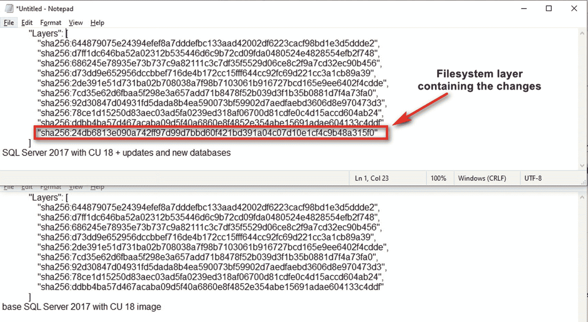
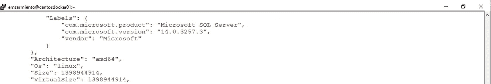
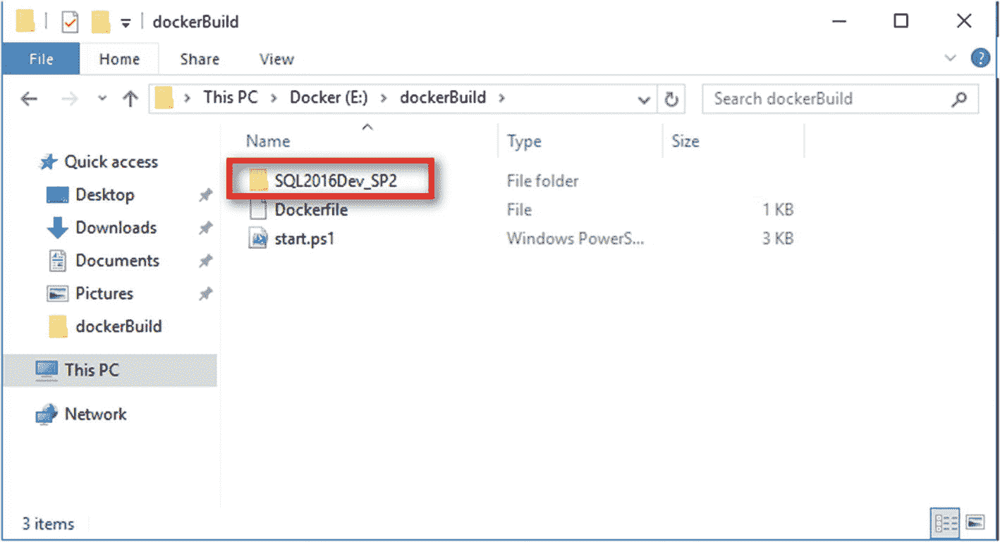
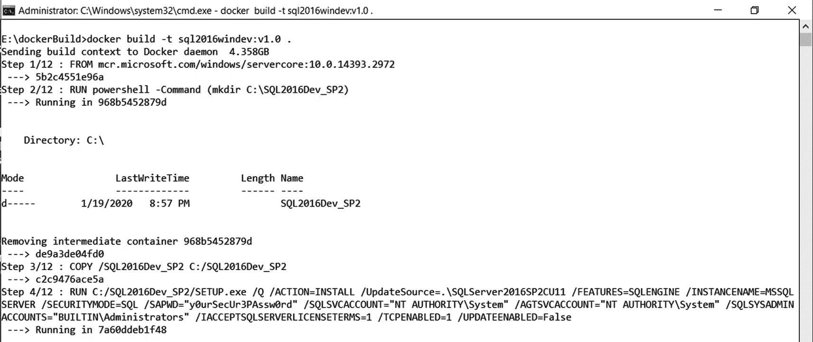
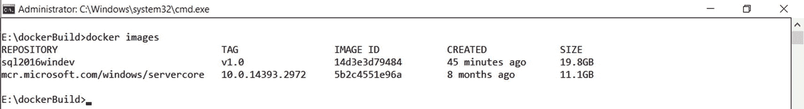
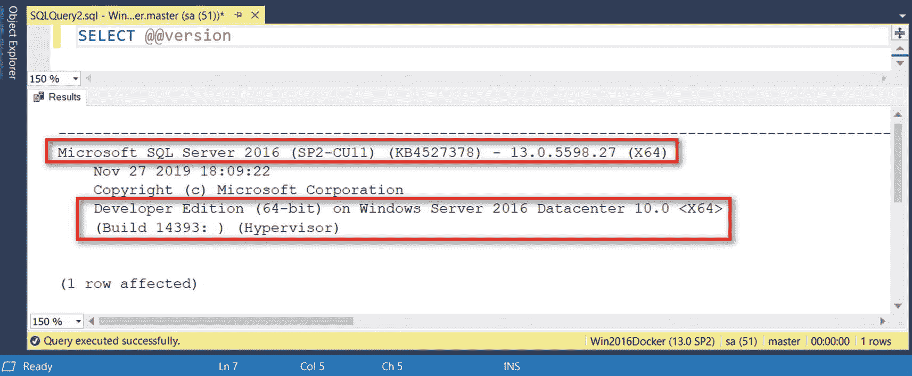
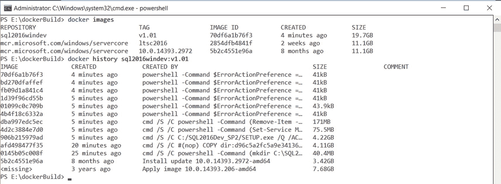
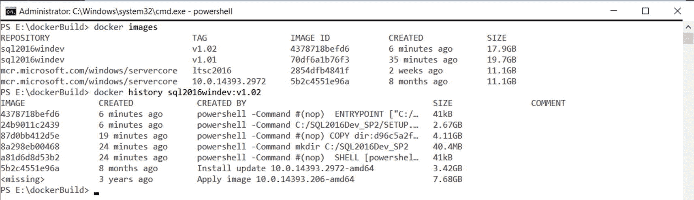

# 9.在 Windows 容器映像上创建自定义 SQL Server

> *仅仅因为某件事是传统的就没有理由去做，当然。*
> 
> —莱蒙尼奇，*空白本*

在私立学校意味着要遵循一定的着装规范——印有学校标志的白领衬衫、海军蓝礼服裤和黑色皮鞋。无论晴雨，都必须穿校服。想象一下，当季风大雨倾盆而下，你背着一个 15 磅重的背包，里面装着你所有的书和笔记本，穿过校园。你的成衣皮鞋再好也没用，它们穿不了一整个学期。九年级的男孩喜欢在课间玩耍和乱跑，这也于事无补。每当我抱怨我的破皮鞋时，我妈妈就狠狠地骂了我一顿。

那是直到我哥的朋友告诉我们定制皮鞋的事情。一位来自鞋都菲律宾的老人决定自己创业，用回收的飞机轮胎做鞋底，制作定制皮鞋。我不知道他是如何想出用回收的飞机轮胎做鞋子的主意的，也不知道他是从哪里得到这些轮胎的(我很确定他不是为了得到它们而闯入机场并划破飞机轮胎)。但是我们不会错过这个机会。我们拜访了这位老人，进行了测量，并被告知要等两周，因为这就是制作这双鞋的时间——漫长的两周。当你还是个青少年时，那感觉像是永恒。但是我们必须等待。如果你想知道的话，我们确实付了鞋子的钱。它们几乎是我们以前买的现成皮鞋的两倍。

我穿上鞋，一拿到鞋就开始跑。我想看看他们是否达到了我的期望。我印象深刻。我每天都穿着它们。它们没有我以前的皮鞋舒服，但确实符合我的需要。它们持续了几个学年以上，以至于我三年前去我妈家的时候还能看到它们。我已经穿不下它们了，但是它们看起来仍然很棒，仍然可以穿。它只是证明了你可以找到具体满足你需求的东西——要么找到能为你提供的人，要么自己做。

我们在前面章节中使用的容器都是来自 Docker Hub 或 Microsoft Container Registry (MCR)等注册中心的公开可用的映像。有些情况下，您可能需要遵循您的公司标准、满足法规遵从性要求或只是标准化您的部署的定制映像。在 Windows 端，一个例子可以是在 Windows Server 2016 容器上构建带有 Service Pack 2 的 SQL Server 2016。只有 Windows 容器上的 SQL Server 2017 可从微软公开获得。在 Linux 方面，也许你想在你的容器操作系统上标准化 Red Hat Enterprise(或 CentOS) Linux，而不是 Ubuntu。

本章介绍如何在 Windows 映像上创建自定义 SQL Server，您可以将这些映像部署为容器。我们将研究如何使用 *Dockerfile* ，这是一个文本文档，包含用户可以在命令行上运行的所有命令，以创建自定义 Docker 图像。创建定制 Docker 映像后，我们将部署一个容器并连接到它，以验证它是否满足我们所有的定制需求。

## 创建自定义 Docker 图像

有两种方法可以创建自定义 Docker 图像。第一个是更新一个正在运行的容器，并使用 *docker commit* 命令创建一个包含更改的新映像。这里的想法是，您希望对一个基础图像进行修改，并将其用作新的自定义图像的参考。

让我们在 Linux Docker 映像上使用公开可用的 SQL Server。不要困惑。本章仍然侧重于 Windows。我只是用 Linux Docker 镜像作为例子来简化事情。在本章的后面你会明白为什么。您可以在这些容器中添加数据库，并根据需要进行修改。完成后，您可以运行下面的 *docker commit* 命令来基于更改后的容器创建一个新映像，其中 *sqldevlinuxcon01* 作为运行容器的名称，而*SQL server 2017-cu18-Ubuntu-16.04-with-DBS:v 2.0*作为新映像的名称。作为一个最佳实践，我给图像添加了一个标签，这样我可以很容易地识别它是什么。

```
docker commit sqldevlinuxcon01 sqlserver2017-cu18-ubuntu-16.04-with-dbs:v2.0

```

回顾*章节*[T3】5T5】。运行此命令将创建一个新的文件系统层，其中包含您所做的更改。如果您对这个新映像运行 *docker inspect* 命令，并将其与来自 MCR 的映像进行比较，您将看到新的文件系统层，如图](05.html) [9-1](#Fig1) 所示。其他一切看起来都一样。



图 9-1

添加到包含更改的映像的新文件系统层

您可以使用这个新图像来创建具有附加更改的容器。看看下面的 *docker run* 命令，它使用了新创建的映像:

```
docker run -e "ACCEPT_EULA=Y" -e "SA_PASSWORD=mYSecUr3PAssw0rd" -p 1413:1433 --name sqldevlinuxcon03 -d -h linuxsqldev01 sqlserver2017-cu18-ubuntu-16.04-with-dbs:v2.0

```

只有一个问题:提交操作将不包括容器内装载的卷中包含的任何数据。如果 *sqldevlinuxcon01* 容器被装载在 Docker 卷上，并且您的用户数据库被创建并存储在该卷中，则这些都不会被包括在内。这是我不使用 *docker commit* 命令创建自定义 docker 映像的主要原因之一。

## 探索*docker 文件*

第二种也是推荐的创建定制 Docker 图像的方法是使用*Docker 文件*。一个 *Dockerfile* 只是一个文本文件，它包含了用户可以在命令行上运行的所有命令，以构建一个定制的 Docker 映像。这就像使用 *ConfigurationFile.ini* 文件来部署使用相同配置的 SQL Server。我喜欢把 *Dockerfile* 看作是你制作食谱(你的 Docker 图像)所需的配料列表，其他人可以用它来烘焙蛋糕(你的容器)。你可以从不同的来源获得你的原料，并用它们来制作一份食谱。你可以把你的食谱给任何有耐心和创造力烤蛋糕的人(嘿，我需要说点开发者的好话)。

与编写脚本类似， *Dockerfile* 由几个命令、指令或参数组成，这些命令、指令或参数按顺序列出，用于在您选择的基本 Docker 映像上执行操作，以创建自定义映像。因为它包含了映像是如何构建的细节，所以对于那些想了解映像是如何构建的人来说，它是一份很好的文档。刚开始的时候，我花了很多时间阅读 [`https://github.com/microsoft/mssql-docker`](https://github.com/microsoft/mssql-docker) 上不同 SQL Server 映像的 *Dockerfile* 参考。这让我想到了如何使用我喜欢的操作系统平台和 SQL Server 版本来构建我自己的定制 SQL Server 映像。另外，我在旅行时晚上睡不好，所以我想阅读技术文档会有所帮助。它没有。

你可以在 GitHub 这样的版本控制系统上存储一个 *Dockerfile* ，这样你就可以跟踪团队中不同成员所做的变更。因为我们正在构建一个具有所需操作系统和配置的 SQL Server 环境，所以您可以将一个 *Dockerfile* 视为实现代码为的*基础设施的一种方式。*

### 文件

我说过 *Dockerfile* 只是一个文本文件。您可以使用您喜欢的文本编辑器来创建和编写 *Dockerfile* 。我通常在我的 Windows 工作站上用 Notepad++开始写它。完成后，我将它复制到 Windows Docker 主机、Linux Docker 主机或任何安装了 Docker CLI 客户端的机器上。

我发现 *Dockerfile* 真正令人讨厌的是文件名本身。它必须专门命名为 *Dockerfile* ，用大写字母“D”书写，中间没有空格，没有文件扩展名。如果您使用的文本编辑器以“.”格式保存文件。txt "文件扩展名，请务必删除它。我数不清有多少次不得不排除我的 *Dockerfile* 的问题，却发现我的文件有一个文件扩展名。这也是我喜欢用 Notepad++的原因。

Tip

如果你想标准化你的文件命名约定，你可以使用不同的文件名和不同的文件扩展名。例如，您可以将 *Dockerfile* 用作生产级文件，而将 *dockerFile.dev* 用于开发。这里的想法是你有一个适当的文档管理策略，即使是对于代码文件。毕竟，代码文件可以被认为是文档。您不仅仅想要跟踪和管理代码变更。您还希望对它们进行适当的分类，以便团队中没有人会意外地部署仍在开发中的代码。不管你是自动化代码审查还是实现持续集成。最大限度减少人为错误的适当流程有助于改进 DevOps 实践。在本章的后面，你会看到一个如何使用不同的文件名来构建自定义 Docker 镜像的例子。

*Dockerfile* 的格式如下:

```
#Comment
INSTRUCTION arguments

```

指令不区分大小写，我觉得这很有趣，因为 Docker 最初是为 Linux 构建的。然而，惯例是将*指令*大写，以便于与参数区分开来。让我们看看您可以在*docker 文件*中包含的不同指令。我将在这里定义指令，尽管并非所有指令都将用于在 Windows 映像上创建自定义 SQL Server。其中一些将用于 Linux 上的 SQL Server。

### FROM 指令

一个 *Dockerfile* 必须以来自指令的*开始，尽管你可以争辩说它可以以一个注释开始。 *FROM* 指令指定您想要开始的基本 Docker 图像(双关语)。它可以是基本操作系统的映像，也可以是您想要构建的现有映像。当您构建自定义黄金映像时，来自*的*指令引用基本操作系统映像。下面是来自*指令的*告诉 *Dockerfile* 使用 Windows Server 2016 Core OS Build 14393.2972。在 [`https://hub.docker.com/_/microsoft-windows-servercore`](https://hub.docker.com/_/microsoft-windows-servercore) 上提供了可用的 Windows 服务器核心映像列表。*

```
FROM mcr.microsoft.com/windows/servercore:10.0.14393.2972

```

类似于运行 *docker run* 命令，如果在构建期间, *FROM* 指令中的映像在 docker 主机上不存在，那么在创建定制映像之前，它将从公共存储库中取出。

### 标签说明

*LABEL* 指令是一个键值对，它向图像添加元数据。可以把它看作是关于定制映像的附加注释——它使用什么样的基础映像，在其上运行什么应用，它是什么版本，等等。以下是如何编写多行*标签*指令的示例:

```
LABEL name="SQL Server 2016 with SP2 on Windows Server 2016"
LABEL version="1.00.00"
LABEL environment="dev/test"
LABEL maintainer="theawesomedbateam@testdomain.com"

```

当您对正在查看的图像运行 *docker inspect* 命令时，该信息显示在*标签*部分输出中，如图 [9-2](#Fig2) 所示。



图 9-2

具有多个标签指令的 Linux 上的 SQL Server 映像元数据

就像任何类型的文档一样，您需要定义标准。你不希望你的一些 *Dockerfile* 文件使用*标签*指令，而其余的使用注释。我推荐使用*标签*指令作为标准，以防有人使用你的自定义图像而无法访问*docker 文件*。

### 运行指令

显然， *RUN* 指令会执行命令。这将是你最常用的指令之一。您可以使用两种形式的*运行*指令:

*   *SHELL* 形式:命令运行在操作系统默认的命令 SHELL 中 Linux 上的 */bin/sh -c* 或 Windows 上的 *cmd /S /C* 。

*   *EXEC* 形式:命令直接调用可执行文件，不需要调用命令 shell。使用 EXEC 形式可以防止对传递到命令 shell 的字符串进行可能的破坏性更改，这种情况在命令行中执行字符串操作时很常见。

*RUN* 指令并不是唯一有两种形式的指令。在本章的后面几节中，你会看到其他指令也有 SHELL 和 EXEC 两种形式。

下面是一个在 SHELL 形式下使用 *RUN* 指令的例子。该命令将使用 PowerShell 命令外壳(而不是默认的 cmd.exe*外壳)并将 *MSSQLSERVER* 服务的启动类型设置为自动。如果你想知道，Windows 容器仍然使用服务，不像 Linux 容器，你只是运行一个进程。*

```
RUN powershell -Command (Set-Service MSSQLSERVER -StartupType Automatic)

```

EXEC 形式的等效 *RUN* 指令如下所示:

```
RUN ["powershell", "-Command", "Set-Service MSSQLSERVER -StartupType Automatic"]

```

SHELL 和 EXEC 形式的区别在于执行 *RUN* 指令的方式。在 shell 形式中，该命令在默认 SHELL 的上下文中运行。在 EXEC 形式中，命令是显式运行的。使用前面的*运行*指令示例，SHELL 表单将在 Docker 映像中运行以下命令:

```
cmd /S /C powershell -Command (Set-Service MSSQLSERVER -StartupType Automatic)

```

相比之下，在 EXEC 形式中，该命令显式执行。当然，我们假设命令的路径是在系统环境变量中定义的。

```
powershell -Command (Set-Service MSSQLSERVER -StartupType Automatic)

```

您可以使用 *RUN* 指令执行不同的命令，只要您可以使用基本映像层运行它——下载文件、创建目录、配置设置等等。您拥有基础映像的能力和 shell 环境的功能来做您想做的任何事情。

*RUN* 指令将在当前映像之上的新读写文件系统层中执行任何命令。这是基于现有映像创建的新的临时容器。一旦命令完成，结果将被提交到映像，就像用 *docker commit* 命令所做的那样。这将作为一个新的文件系统层出现，如图 [9-1](#Fig1) 所示。这个新图像成为*docker 文件*中下一个指令的起点。然后临时容器将被移除。还记得来自*章* [*5*](05.html) 的乐高积木类比吗？

### 复制指令

*COPY* 指令从源文件复制新的文件或目录，并将它们添加到容器的文件系统中所提供的路径。与*运行*指令一样，它也有两种形式:

*   *复制<来源>T4】目的地>T1】*

*   *复制[" <来源>，"<目的地>]*

第二种形式用于包含空格的路径，如*C:/Program Files/Microsoft SQL Server*，多适用于 Windows 而非 Linux。文件和目录必须在相对于 *Dockerfile* 的路径中，并且 *< destination >* 路径需要使用正斜杠引用(甚至在 Windows 上考虑 Linux 也是有好处的)。下面是一条 *COPY* 指令，用于将存储 *Dockerfile* 的机器上的 SQL Server 2016 dev Edition with Service Pack 2 安装介质复制到 C:/SQL2016Dev_SP2 目录:

```
COPY /SQL2016Dev_SP2 C:/SQL2016Dev_SP2

```

Note

当我刚开始时，我发现令人困惑的一件事是在 Docker for Windows 文档中使用正斜杠，无论是来自 Docker 还是微软。比如你需要把*C:\ Windows \ System32 \ cmd . exe*写成*C:/Windows/System32/cmd . exe*。我们一直在 Windows 中使用反斜杠(\)作为路径分隔符。但是因为 Docker 最初是为 Linux 创建的，所以它遵循 Linux 惯例，比如使用正斜杠(/)作为路径分隔符。如果要在 Docker 中使用反斜杠，需要适当的进行转义。这是因为反斜杠字符在 Linux 中被用作转义字符。如果你想坚持你在 Windows 中的做法，你需要“摆脱转义符”前面的例子需要写成*C:\ \ Windows \ \ System32 \ \ cmd . exe*。或者用正斜杠代替。

*<源>* 路径必须在构建的上下文中。如果您将 *Dockerfile* 存储在安装了 Docker CLI 客户端的 Windows 机器上的 *E:/dockerBuild* 目录中，那么 *SQL2016Dev_SP2* 目录应该在该目录中。如果 *<源>* 是一个目录，就像示例中的目录一样，那么只有内容——包括文件系统元数据——会被复制，而不是目录。图 9-3 显示了 Windows Docker 主机上构建上下文的文件系统结构。我将在本章后面解释 *start.ps1* PowerShell 脚本的用途。



图 9-3

Windows Docker 主机上构建上下文的文件系统结构

在 Linux 上，可以将 *chown* 命令和 *COPY* 指令一起传递，格式为 *COPY [ - chown= <用户> : <组><src>...<dest>T5】。这很有用，因为默认的*复制*指令将总是分配 UID 和 GID 值 0 -用户和组等于*根*。遵循最小特权的原则，我们不想给所有东西分配根*和*。然而，*根*拥有容器内文件和目录的所有权是可以的，只要容器不是作为*根*运行。在第*章* [*10*](10.html) 中提供了一个构建在 Linux 上运行 SQL Server 的自定义 Docker 映像的示例，该映像作为*非根用户*运行。*

### 加法指令

*添加*指令类似于*复制*指令，但是具有除了从文件系统复制和复制到文件系统之外的附加功能。您可以使用 *ADD* 指令从带有 URL 的远程位置进行复制。假设您想要将 *start.ps1* PowerShell 脚本从 [`https://github.com/microsoft/mssql-docker/blob/master/windows/mssql-server-windows-developer/start.ps1`](https://github.com/microsoft/mssql-docker/blob/master/windows/mssql-server-windows-developer/start.ps1) 复制到 Windows 映像上的自定义 SQL Server 的 C:/。您可以使用下面的*添加*指令:

```
ADD https://github.com/microsoft/mssql-docker/blob/master/windows/mssql-server-windows-developer/start.ps1 /

```

你可能已经知道 *start.ps1* PowerShell 脚本是干什么的了。如果您查看 [`https://github.com/microsoft/mssql-docker/blob/master/windows/mssql-server-windows-developer/dockerfile`](https://github.com/microsoft/mssql-docker/blob/master/windows/mssql-server-windows-developer/dockerfile) 上提供的用于在 Windows 映像上创建定制 SQL Server 的 *Dockerfile* ，那么 *start.ps1* PowerShell 脚本是在最后一条指令中调用的——即 *CMD* 指令。

我更喜欢让文件在本地可用，而不是从 URL 复制。我想确保我正在使用的文件(无论是脚本还是安装文件)没有任何潜在的文件损坏错误。我希望能够在将它们包含在任何自动化过程中之前，首先在我的本地文件系统中手动测试它们。事实上，当我在过去构建部署不同版本的 SQL Server 的自动化过程时，所有的安装介质都已经下载到网络文件共享并进行手动测试。它让您免去了因某个 CAB 文件损坏而导致安装失败的麻烦。我相信您过去在安装 SQL Server 时也遇到过这种情况。

### 外壳指令

*shell* 指令允许用于命令 SHELL 形式的默认 SHELL 被覆盖。在 Windows 容器上使用这个指令更常见，因为 Windows 既有 cmd.exe 的*外壳又有 powershell.exe 的*外壳。Windows 默认外壳是*cmd.exe*。作为一个 PowerShell 爱好者，我更喜欢在 Windows 上使用 *SHELL* 指令，这样我就可以充分利用内置的 cmdlets 来简化命令执行。 *SHELL* 指令以 *SHELL [“可执行”、“参数”]* 的形式编写。翻译在*运行*指令中使用的例子，以使用*外壳*指令:**

```
SHELL ["powershell", "-Command", "Set-Service MSSQLSERVER -StartupType Automatic"]

```

如果您想在*docker 文件*中运行一系列 PowerShell 命令，这就简单多了。假设您想在安装完成后从容器中删除 *SQL2016Dev_SP2* 目录。您可以使用 *SHELL* 指令来定义默认 SHELL，并使用 *RUN* 指令来执行 PowerShell 命令:

```
#Set PowerShell as the command shell
SHELL ["powershell", "-Command"]

#Run Set-Service PowerShell cmdlet to configure MSSQLSERVER
RUN Set-Service MSSQLSERVER -StartupType Automatic

#Run Remove-Item PowerShell cmdlet to delete directory
RUN Remove-Item -Path C:/SQL2016Dev_SP2 -Recurse -Force

```

显然，在构建映像时利用 PowerShell，使用 *SHELL* 指令比使用 *RUN* 指令更有效。虽然您可能开始认为 *SHELL* 指令只是专门为 Windows 容器编写的，但是您也可以在 Linux 上使用它来改变不同的 SHELL。但是，当缺省 shell 可以完成您需要的大部分事情时，您为什么要在 Linux 容器中这样做呢？

### 命令指令

使用 *docker run* 命令运行容器时， *CMD* 指令允许您设置默认命令和默认参数。如果在运行容器时没有提供命令，则执行这条指令。但是，如果您选择使用特定命令运行容器，它将被覆盖。与 *RUN* 和 *SHELL* 指令不同，在一个 *Dockerfile* 中可以有多个这样的指令，只有最后一个 *CMD* 指令会被评估。拥有多个 *CMD* 指令是没有意义的。另外，您希望 *CMD* 指令执行运行但不退出的程序。如果您执行一个在完成后退出的命令，容器也将终止。你不希望 *CMD* 指令在像`NET START MSSQLSERVER`这样的窗口中运行服务，因为一旦命令完成，它就会退出，终止容器。对于在容器内将 SQL Server 作为服务运行来说，就这么多了。

*CMD* 指令有三种形式，而不是两种:

*   *CMD ["executable "，" param1 "，" param2"]* (EXEC 形式，这是首选形式)

*   *CMD ["param1 "，" param2"]* (作为入口点的默认参数)

*   *CMD 命令 param1 param2* ( *外壳*形式)

以下是 *CMD* 指令，以 *EXEC* 的形式，如果你想运行一个名为 *start.ps1* 的 PowerShell 脚本作为你 *Dockerfile* 中的最后一条指令。这假设您在运行映像之前已经在映像中复制了 PowerShell 脚本。

```
CMD ["powershell", "-Command", "C:/start.ps1"]

```

在 *SHELL* 表单中运行 *CMD* 指令使其行为类似于 *SHELL* 表单中的 *RUN* 指令，使用默认的操作系统命令 SHELL。如果您想运行自己的命令，您需要将命令表示为 JSON 数组，传递可执行文件的完整路径，并用双引号括起来——除非您使用 *WORKDIR* 指令。以下是使用 CMD 指令运行名为*sampleConsole.exe*的. NET 控制台应用的示例:

```
CMD ["C:/sampleConsole.exe", "--run"]

```

正如我提到的，在运行容器时，您可以覆盖在 *CMD* 指令中定义的默认命令。例如，使用 *docker run* 命令运行 Windows Server 2016 核心 Docker 映像将在创建后立即终止容器。我找不到创建这个图像的引用 *Dockerfile* 来查看 *CMD* 指令。但它确实在创建后终止。如果我想让容器保持运行，我可以向容器传递一个不存在的命令来覆盖在 *CMD* 指令中写的任何内容。以下是将`ping localhost -t`命令传递给 *docker run* 命令的示例:

```
docker run mcr.microsoft.com/windows/servercore:ltsc2016 ping localhost -t

```

## 入口点指令

如果有*运行*、 *SHELL* 和 *CMD* 指令还不够，这里还要添加一条指令:入口点*指令。 *ENTRYPOINT* 指令用于将正在运行的容器视为可执行文件。当您希望容器作为特定可执行文件的便携包装，而不希望用户在运行时覆盖该可执行文件时，通常会使用这种方法。如果您希望您的容器每次都运行相同的可执行文件，这非常有用。这意味着您不能用 *docker run* 命令覆盖该命令。然而，添加到 *docker run* 命令末尾的任何内容都会附加到 *ENTRYPOINT* 指令中定义的命令。我曾经认为 SQL Server 容器没有使用 *ENTRYPOINT* 指令，直到我意识到，如果您想限制容器运行 SQL Server 之外的任何东西，并可能在启动时传递参数，您可以使用这个指令。此外，没有什么可以阻止你在 Windows 中重写运行 *start.ps1* PowerShell 脚本的 *CMD* 指令，而只是运行`ipconfig`命令。或者 Linux 中的 SQL Server 进程，然后运行 *bash* 。当然，这样做也意味着不再有 SQL Server，直到您重启容器并且不覆盖 *CMD* 指令。*

就像 *RUN* 指令一样， *ENTRYPOINT* 指令有两种形式，EXEC(首选)形式和 SHELL 形式。以下是在 EXEC 窗体中使用 ENTRYPOINT 指令在 Windows 中运行 SQL Server 可执行文件的示例。只需用您正在运行的 SQL Server 版本号替换 *{nn}* :

```
ENTRYPOINT ["C:/Program Files/Microsoft SQL Server/MSSQL{nn}.MSSQLSERVER/MSSQL/Binn/sqlservr.exe"]

```

## CMD 对 RUN 对 SHELL 对 ENTRYPOINT

当创建您的 *Dockerfile* 时，在这些不同的指令之间进行选择可能会令人困惑。只要记住以下几点:

*   在一个 *Dockerfile* 中只有一个有效的 *CMD* 指令——只有最后一个会被评估。如果你想让你的容器覆盖在 *CMD* 指令中定义的命令，使用这个。

*   使用 *RUN* 指令运行命令来构建您的自定义 Docker 映像。

*   如果您想要更改默认的命令 SHELL 并将其用于大多数命令，请使用 *SHELL* 指令。

*   使用 *ENTRYPOINT* 指令来防止用户覆盖您希望容器运行的可执行文件。

*   您可以将*入口点*指令与 *CMD* 指令组合在一个*docker 文件*中。这样做时， *CMD* 指令中的字符串将被附加到 *ENTRYPOINT* 指令中。 *CMD* 指令需要是 *Dockerfile* 中的最后一条指令。

*   您可以使用*入口点*或 *CMD* 指令运行流程或脚本。如果您正在运行一个脚本，只需确保它运行一个不存在的进程或命令。

这样做的好处是构建自定义 SQL Server 映像不需要这么多配置设置。您只需要一个基本映像和 SQL Server 安装文件，然后在安装后配置 SQL Server 实例，就万事俱备了。当我们开始编写 *Dockerfile* 时，您将看到这些指令是如何一起使用的。

## 工作目录指令

*WORKDIR* 指令为其他指令设置工作目录，如 *RUN* 、 *CMD* 、 *ENTRYPOINT* 、 *COPY* 、 *ADD* 。如果*工作目录*在构建过程中不存在于目标映像中，它将被创建。当你想从自定义路径运行可执行文件或脚本时，这非常有用——定义*工作目录*,然后运行与之相关的可执行文件。你可以把它想象成在构建过程中在容器内部执行一个 *cd* 命令。如果您的可执行文件的路径很长，比如 Windows 上 SQL Server 的默认安装目录，并且您不想在整个 *Dockerfile* 中重复它，这也很有用。然而，使用 *ENV* 指令更适合于定义路径，因为将路径定义为环境变量是很常见的。以下是在构建过程中使用 *WORKDIR* 指令将工作目录设置为 *C:/* 的示例:

```
WORKDIR /

```

同样，在 Windows 中这样做时，考虑 Linux 是值得的，这样可以最小化对转义字符的转义。明白吗？

## ENV 指令

*ENV* 指令是一个键值对，它设置了一个在构建时和容器运行时都可用的持久环境变量。还记得你在 *docker run* 命令中使用的那些 *-e* 参数吗？

*ENV* 指令有两种形式:

*   *ENV <键> <值>*

*   *ENV <键> = <值>*

我更喜欢使用第二种形式——*ENV<key>=<value>*——因为它更加明确。它还允许在一行中设置多个键值对。下面是为 SQL Server EULA 设置一个键-值对并分配 *sa* 登录密码的示例。我选择用多行来显示它们，以区分两者:

```
ENV SA_PASSWORD="y0urSecUr3PAssw0rd"
ENV ACCEPT_EULA="Y"

```

但是它们可以组合成一行，如下所示:

```
ENV SA_PASSWORD="y0urSecUr3PAssw0rd" ACCEPT_EULA="Y"

```

## 使用转义字符

我不知道你怎么想，但是我不喜欢把长命令分成多行。我的大脑只看一行命令，不管它有多长，就像我直接在命令行中写它们一样。回想一下我在第*章* [*第 8 章*](08.html) 中用来创建在 Linux 上自动安装 SQL Server 的脚本的命令。每一个命令都被写成一行——尤其是调用*/opt/MSSQL/bin/MSSQL-conf*的那一行。

然而，有些人不喜欢在一行中写很长的命令。他们把它们分成更小的块，这样它们就可以在屏幕的一页上阅读。这就像他们的终端窗口或命令行外壳不会将文本换行到下一行。我不怪他们。长时间盯着电脑屏幕会导致所谓的数码眼疲劳(我的非正式研究也告诉我，它会影响理智)。这就是转义字符可以发挥作用的地方。

在 Linux 和 PowerShell 中都可以使用转义符。在 Linux 中使用反斜杠来避免下一个字符被 shell 解释。这是用来写一个多行的长命令行。以下是使用反斜杠编写命令以在 Linux 上配置 SQL Server 并传递所需参数的示例:

```
sudo MSSQL_PID=$MSSQL_PID ACCEPT_EULA=Y \
     MSSQL_SA_PASSWORD=$MSSQL_SA_PASSWORD \
     /opt/mssql/bin/mssql-conf setup

```

如果你想在 *Dockerfile* 而不是 *docker run* 命令中传递所需的参数，你可以用 *RUN* 指令做同样的事情。我更喜欢用 *docker run* 命令来传递它们。

```
RUN sudo MSSQL_PID=$MSSQL_PID ACCEPT_EULA=Y \
    MSSQL_SA_PASSWORD=$MSSQL_SA_PASSWORD \
    /opt/mssql/bin/mssql-conf setup

```

PowerShell 使用反勾(`)运算符在多行中编写很长的命令。假设您想要重写在 *SHELL* 指令部分中使用的 PowerShell 命令示例，以便在设置 StartupType 属性之前首先检查 MSSQLSERVER 服务是否存在；您可以使用下面的示例*运行*指令来完成:

```
RUN Get-Service | Where {$_.Name -eq "MSSQLSERVER"} | `
    Set-Service -StartupType Automatic

```

此外，您可以在*docker 文件*中定义一个转义字符。这非常有帮助，尤其是在目录路径分隔符是反斜杠字符的 Windows 中——与在*docker 文件*中使用的默认转义字符相同。这就是为什么你用双反斜线而不是单反斜线来写*C:\ \ Windows \ \ System32 \ \ cmd . exe*的原因。您可以通过将默认转义字符定义为*解析器指令*来更改 *Dockerfile* 中的默认转义字符。以下指令将 *Dockerfile* 中的默认转义字符从反斜杠改为反斜杠。这使得它与 PowerShell 保持一致。

```
# escape=`

```

解析器指令是可选的。但是如果你决定使用它们，它们必须被写在 *Dockerfile* 之上，甚至在 *FROM* 指令之前。

既然我们已经有了编写一个 *Dockerfile* 来在 Windows 映像上构建一个定制的 SQL Server 所需要的东西，那么是时候把所有的部分放在一起了。

## 用一个 *Dockerfile* 把这些碎片放在一起

我确实在第*章* [*第 8 章*](08.html) 中提到过，我是流程的忠实粉丝。因此，我概述了以下在 Windows Server 2016 核心映像上创建自定义 SQL Server 2016 Developer Edition 的过程。这些步骤是根据 [`https://github.com/microsoft/mssql-docker/blob/master/windows/mssql-server-windows-developer/dockerfile`](https://github.com/microsoft/mssql-docker/blob/master/windows/mssql-server-windows-developer/dockerfile) 中的 *Dockerfile* 设计的，用于捕获在 Windows 映像上创建自定义 SQL Server 所需的步骤。对该过程有一个高层次的概述允许您优化和改进这些步骤，并且可能用您自己的命令和脚本来替换它们。

1.  从微软容器注册表中公开的 Windows Server 2016 Core 10 . 0 . 14393 . 2972 基础映像开始。

2.  在映像中创建一个临时目录来存储 SQL Server 2016 Developer Edition 安装文件。

3.  将 SQL Server 2016 Developer Edition 安装文件从您的计算机复制到映像。

4.  通过命令行安装 SQL Server 2016。

5.  将 SQL Server 服务启动类型设置为自动。

6.  从映像中删除临时 SQL Server 2016 Developer Edition 安装介质文件夹。

7.  将命令 shell 切换到 PowerShell，准备运行脚本 *start.ps1* 。

8.  将 PowerShell 脚本 *start.ps1* 复制到根目录下的映像–C:/

9.  设置 PowerShell 脚本执行的当前工作目录。

10.  容器启动时运行 PowerShell 脚本 *start.ps1* 。

在本章中，我提到过几次 PowerShell 脚本 *start.ps1* 。该脚本做了几件事:

*   检查三个参数——*sa*登录密码、接受 EULA 以及 Azure Blob 存储位置(如果您有想要附加到 SQL Server 实例的数据库文件)

*   如果用于存储 *sa* 登录密码，则利用 Docker secret

*   进入无限循环，以便在运行容器时脚本不会终止

我只需要第一个要点减去从 Azure Blob 存储附加数据库。但是我使用这个脚本来演示如何利用*docker 文件*中的不同指令来构建您的自定义映像。可以从 [`https://github.com/Microsoft/mssql-docker/blob/master/windows/mssql-server-windows/start.ps1`](https://github.com/Microsoft/mssql-docker/blob/master/windows/mssql-server-windows/start.ps1) 下载剧本。

为了准备安装，我从 [`http://go.microsoft.com/fwlink/?LinkID=799009`](http://go.microsoft.com/fwlink/%253FLinkID%253D799009) 下载了带有 Service Pack 2 的 SQL Server 2016 开发者版安装介质。由您决定是下载 ISO 文件还是 CAB 文件。只要确保将安装文件正确解压到名为 *SQL2016Dev_SP2* 的目录中。如果您想要添加最新的累积更新，请在安装之前将其整合到安装介质中，并在从命令行安装 SQL Server 时使用 */UpdateSource* 参数。参考下面步骤 4 中的*运行*指令。遵循图 [9-3](#Fig3) 所示的文件系统结构。

以下是用于在 Windows Server 2016 核心映像上构建自定义 SQL Server 2016 开发者版 Service Pack 2 累积更新 11 的 *Dockerfile* 。我将使用项目编号作为步骤，并在注释中标识它们:

```
#Step 1
FROM mcr.microsoft.com/windows/servercore:10.0.14393.2972

#Step 2
RUN powershell -Command (mkdir C:\SQL2016Dev_SP2)

#Step 3
COPY /SQL2016Dev_SP2 C:/SQL2016Dev_SP2

#Step 4
RUN C:/SQL2016Dev_SP2/SETUP.exe /Q /ACTION=INSTALL /UPDATEENABLED=True /UPDATESOURCE=./SQLServer2016SP2CU11 /FEATURES=SQLENGINE /INSTANCENAME=MSSQLSERVER /SECURITYMODE=SQL /SAPWD="y0urSecUr3PAssw0rd" /SQLSVCACCOUNT="NT AUTHORITY\System" /AGTSVCACCOUNT="NT AUTHORITY\System" /SQLSYSADMINACCOUNTS="BUILTIN\Administrators" /IACCEPTSQLSERVERLICENSETERMS=1 /TCPENABLED=1

#Step 5
RUN powershell -Command (Set-Service MSSQLSERVER -StartupType Automatic)

#Step 6
RUN powershell -Command (Remove-Item -Path C:/SQL2016Dev_SP2 -Recurse -Force)

#Step 7
SHELL ["powershell", "-Command", "$ErrorActionPreference = 'Stop'; $ProgressPreference = 'SilentlyContinue';"]

#Step 8
COPY /start.ps1 /

#Step 9
WORKDIR /

ENV SA_PASSWORD "y0urSecUr3PAssw0rd"

ENV ACCEPT_EULA "Y"

#Step 10
CMD ./start -sa_password $env:SA_PASSWORD -ACCEPT_EULA $env:ACCEPT_EULA -Verbose

```

仅仅通过查看*docker 文件*中的指令，您已经可以看到一些潜在的优化改进。我们留着以后再说。是时候在 Windows 容器上构建我们的自定义 SQL Server 了。

## 在 Windows 映像上构建自定义 SQL Server

将 *Dockerfile* 连同 *SQL2016Dev_SP2* 目录和 *start.ps1* PowerShell 脚本一起保存在*T26】drive>:\ docker build*目录下。您将在该目录的上下文中运行下面的 *docker build* 命令。我们将把这个新映像称为 sql2016windev ，并将其标记为 *v1.0* 。圆点*(。)*末端的 *docker build* 命令指定了路径。在这种情况下， *docker build* 命令将查看当前路径，并评估相对于当前路径的 *Dockerfile* 中的所有指令。如果没有明确指定，它还会告诉 *docker build* 命令在该路径中查找名为 *Dockerfile* 的文件。

```
docker build -t sql2016windev:v1.0 .

```

图 [9-4](#Fig4) 显示了 *docker build* 命令的前几行输出。



图 9-4

docker build 命令的输出

请注意以下事项:

*   消息“发送构建上下文到 Docker daemon 4.358GB”的字面意思和它所说的完全一样。Docker CLI 客户端正在将 *<驱动器> :\dockerBuild* 目录的全部内容发送到 Docker 守护进程。我创建 *<驱动器> :\dockerBuild* 目录并将其用作构建自定义映像的路径的原因是，我只想将该目录的内容复制到 Docker 守护进程。如果您在根目录下运行 *docker build* 命令-*<drive>:\–*它会将其所有内容复制到 docker 守护进程。你不希望你的个人 MP3 文件，你的简历，或者你的照片收藏出现在别人的容器里，是吗？

*   第 1/12 步。我们在 *Dockerfile* 中不是只有 10 个步骤吗？为什么 *docker build* 命令确定了 12？这是因为每条指令都会创建一个步骤，包括步骤 10 之前的两条 *ENV* 指令。而且我们连一个*标签*指令都没加。

*   在步骤 2/12 中，消息“->在 968b5452879d 中运行”告诉您，这是 *RUN* 指令为运行该步骤中的命令而创建的临时容器。

*   在步骤 2/12 中，消息“->移除中间容器 968b5452879d”告诉您在此步骤中创建的临时容器已被删除，并且已提交更改以创建新的映像。这个新的文件系统层被命名为“de9a3de04fd0”。

*   使用命令行安装 SQL Server 传递给*SETUP.EXE*命令的参数来自 [`https://docs.microsoft.com/en-us/sql/database-engine/install-windows/install-sql-server-from-the-command-prompt?view=sql-server-ver15`](https://docs.microsoft.com/en-us/sql/database-engine/install-windows/install-sql-server-from-the-command-prompt%253Fview%253Dsql-server-ver15) 。

*   每个指令，包括 ENV 指令，都创建一个文件系统层。

*   你感到困倦。你的眼睛越来越沉了。现在，振作起来。

构建完成后，您现在可以使用自定义映像来创建和运行新的容器。运行`docker images`命令查看新构建的映像。图 [9-5](#Fig5) 显示了我的 Docker 主机中可用图像的列表，包括新建的图像。Windows 容器的大小是我尽量避免使用它们的主要原因。



图 9-5

列出新构建的自定义 Docker 图像

运行以下命令开始使用此自定义映像。图 [9-6](#Fig6) 显示了在 Windows Server 2016 核心操作系统版本 14393.2972 上运行的 Windows container Build-SQL Server 2016(带 Service Pack 2 累积更新 11)上验证自定义 SQL Server。



图 9-6

正在验证 Windows Docker 映像上的自定义 SQL Server

```
docker run -e 'ACCEPT_EULA=Y' -e 'SA_PASSWORD=y0urSecUr3PAssw0rd' -p 1433:1433 --name sql-windevcon01 -d -h windevsql01 sql2016windev:v1.0

```

还记得我说过您可以为*docker 文件*使用不同的文件名吗？假设您想将其命名为 *dockerFile.dev* 以表明这是开发人员将使用的，而 *Dockerfile* 将严格用于生产(嗯，从开发人员的角度来看是生产)。您可以使用 *docker build* 命令的 *-f* 参数来指定您想要使用的文件的名称。以下示例命令使用 *dockerFile.dev* 文件来构建自定义图像。圆点(。)字符仍然告诉 *docker build* 命令使用当前路径。

```
docker build -t sql2016windev:v1.01 -f dockerFile.dev .

```

您还可以向 *docker build* 命令传递一个绝对路径或 URL。以下示例命令使用微软提供的来自 GitHub 的 *Dockerfile* 在 Linux 映像上构建一个定制的 SQL Server，以非 root 用户身份运行。我不能使用微软为 Windows 提供的 *Dockerfile* 在 Windows 映像上构建定制的 SQL Server，因为它没有更新——来自的*指令仍然指向过时的 Windows Server 核心映像。*

```
docker build -t sql2017linuxnonroot:v1.0  https://raw.githubusercontent.com/microsoft/mssql-docker/master/linux/preview/examples/mssql-server-linux-non-root/Dockerfile

```

请记住， *Dockerfile* 中的指令将在当前构建路径的上下文中执行。确保在*复制*或*添加*指令中定义的所有依赖项如脚本、安装文件等都可用。

一旦您构建了自己的自定义图像，现在您可以将其用作创建其他自定义图像的基础图像。例如，您可以参考您的 *Dockerfile* 的 *FROM* 指令中新建的镜像，如下所示:

```
FROM sql2016windev:v1.01

```

Note:

如果您在 Microsoft 提供的 Windows Docker 映像上构建 SQL Server 来创建您的自定义映像，请记住它们在生产环境中不受支持。这在 [`https://hub.docker.com/r/microsoft/mssql-server-windows-developer/`](https://hub.docker.com/r/microsoft/mssql-server-windows-developer/) 的“预期用途”一节中有所强调。这是我更喜欢创建自定义 Docker 映像的另一个原因，在这种情况下，是在 Windows Server 2016 上运行的 SQL Server 2016 映像。只要确保您运行的是 Windows Server 和 SQL Server 的受支持版本，就可以在生产中推广它。Windows Server 2008 和 Windows Server 2008 R2 不再享有延长支持。不用麻烦了。

## 优化 Dockerfile 文件

有几种方法可以优化映像构建过程和生成的 Docker 映像。我最关心的问题之一是文件系统层的大小。正是 11.1GB 大小的基本 Windows Server 2016 核心映像让我避免使用 Windows 容器。而这仅仅是操作系统本身。公开的 Linux 上的 SQL Server 映像是 1.4GB，更不用说 Windows 上的 SQL Server 安装文件的大小了。图 [9-7](#Fig7) 显示了 Windows 映像上定制 SQL Server 的 *docker history* 命令的结果。



图 9-7

列出 Windows Docker 映像上定制 SQL Server 的不同文件系统层

作为构建过程和容器运行时的一部分，这些文件大小会影响拉和推文件系统层的速度。在我的测试环境中，仅仅用定制的 *Dockerfile* 运行 *docker build* 命令就平均花费了 25 分钟。虽然您不会每小时都运行 *docker build* 命令，但是您仍然需要担心图像大小和磁盘空间需求。

优化 Dockerfile 的两种常见方法是减少指令数量和减小文件系统层的大小。但是，在我们考虑减少指令数量之前，让我们看看是否可以确定一些可以合并到其他指令中的现有命令。看一看第 5 步:

```
#Step 5
RUN powershell -Command (Set-Service MSSQLSERVER -StartupType Automatic)

```

它简单地调用 PowerShell 命令 Shell 并将 *MSSQLSERVER* 服务的启动类型设置为*自动*。我们可以将这条指令汇总起来，并在步骤 4 中将其作为 */SQLSVCSTARTUPTYPE* 参数，看起来像这样，重点是最后一个参数:

```
#Step 4
RUN C:/SQL2016Dev_SP2/SETUP.exe /Q /ACTION=INSTALL /UPDATEENABLED=True /UPDATESOURCE=./SQLServer2016SP2CU11 /FEATURES=SQLENGINE /INSTANCENAME=MSSQLSERVER /SECURITYMODE=SQL /SAPWD="y0urSecUr3PAssw0rd" /SQLSVCACCOUNT="NT AUTHORITY\System" /AGTSVCACCOUNT="NT AUTHORITY\System" /SQLSYSADMINACCOUNTS="BUILTIN\Administrators" /IACCEPTSQLSERVERLICENSETERMS=1 /TCPENABLED=1 /SQLSVCSTARTUPTYPE="Automatic"

```

Tip

我喜欢使用一个 *ConfigurationFile.ini* 文件来替换 SQL Server setup 命令行参数并缩短步骤 4。如果您选择这样做，请确保将 *ConfigurationFile.ini* 文件复制到 *SQL2016Dev_SP2* 目录中，并作为命令行参数的一部分调用它。并在自动化之前进行验证。

图 [9-7](#Fig7) 中删除步骤 5 节省的空间为 75.5MB，与图像的整体大小相比微不足道。但这是一个开始。评估现有的说明，看看是否可以将它们整合到其他说明中。一旦你用尽了每一个可能的指令，你就可以把它们合并成其他的指令，是时候合并相关的指令了。

看看第 4 步和第 6 步。两者都使用*运行*指令。而且既然 Step 2 也是 PowerShell 命令，为什么不用 PowerShell 作为默认的命令 Shell 呢？我们可以在步骤 1 之后引入一个新的 *SHELL* 指令，如下所示:

```
SHELL ["powershell", "-Command"]

```

因为我们可以将步骤 4 作为 PowerShell 命令调用，所以我们可以使用分号(；)字符，把它变成一条单独的*运行*指令。我还将 setup.exe 的*的参数值中使用的双引号替换为单引号，以避免字符串误解。我不希望双引号被解释为 PowerShell 中的特殊字符。*

```
#Step 4 and 6 combined in a single line
RUN C:/SQL2016Dev_SP2/SETUP.exe /Q /ACTION=INSTALL /UPDATEENABLED=True /UPDATESOURCE=./SQLServer2016SP2CU11 /FEATURES=SQLENGINE /INSTANCENAME=MSSQLSERVER /SECURITYMODE=SQL /SAPWD='y0urSecUr3PAssw0rd' /SQLSVCACCOUNT='NT AUTHORITY\System' /AGTSVCACCOUNT='NT AUTHORITY\System' /SQLSYSADMINACCOUNTS='BUILTIN\Administrators' /IACCEPTSQLSERVERLICENSETERMS=1 /TCPENABLED=1 /SQLSVCSTARTUPTYPE='Automatic' ; Remove-Item -Path C:/SQL2016Dev_SP2 -Recurse -Force

```

了解不同的 Windows 命令和 PowerShell cmdlets 将有助于了解您可以组合哪些*运行*指令。参考 [`https://docs.microsoft.com/en-us/windows-server/administration/windows-commands/windows-commands`](https://docs.microsoft.com/en-us/windows-server/administration/windows-commands/windows-commands) 的窗口命令列表。您还可以运行`Get-Command` PowerShell cmdlet 来检索 Windows 安装中可用的所有本机 PowerShell cmdlet。

还有什么？我们可以删除步骤 7、8 和 9 以及两条 *ENV* 指令。我真的不喜欢 *start.ps1* PowerShell 脚本，因为我已经分别在*setup.exe*、 */SAPWD* 和*/iaceptsqlserverlicensertems*中提供了所需的参数——*SA _ PASSWORD*和 *ACCEPT_EULA* 。另外，我在 Azure Blob 存储上没有任何需要附加的示例数据库。我可以使用 *ENTRYPOINT* 指令调用 SQL Server 可执行文件来代替步骤 10。以下是经过修改、删减的 *Dockerfile* 的外观:

```
#Step 1
FROM mcr.microsoft.com/windows/servercore:10.0.14393.2972

#Step 1A – switch the default command shell to PowerShell
SHELL ["powershell", "-Command"]

#Step 2
RUN mkdir C:/SQL2016Dev_SP2

#Step 3
COPY /SQL2016Dev_SP2 C:/SQL2016Dev_SP2

#Step 4 and 6 combined in a single line
RUN C:/SQL2016Dev_SP2/SETUP.exe /Q /ACTION=INSTALL /UPDATEENABLED=True /UPDATESOURCE=./SQLServer2016SP2CU11 /FEATURES=SQLENGINE /INSTANCENAME=MSSQLSERVER /SECURITYMODE=SQL /SAPWD='y0urSecUr3PAssw0rd' /SQLSVCACCOUNT='NT AUTHORITY\System' /AGTSVCACCOUNT='NT AUTHORITY\System' /SQLSYSADMINACCOUNTS='BUILTIN\Administrators' /IACCEPTSQLSERVERLICENSETERMS=1 /TCPENABLED=1 /SQLSVCSTARTUPTYPE='Automatic' ; Remove-Item -Path C:/SQL2016Dev_SP2 -Recurse -Force

#New Step 10
ENTRYPOINT ["C:/Program Files/Microsoft SQL Server/MSSQL13.MSSQLSERVER/MSSQL/Binn/sqlservr.exe"]

```

图 [9-8](#Fig8) 显示了 *docker history* 命令对更新后的定制 SQL Server on Windows 映像的结果，包括第一个映像和使用修改后的 *Dockerfile* 的新映像之间的映像大小差异。我们已经将图像的大小从 19.7GB 减少到 17.9GB，并将 12 条指令减少到 6 条指令。还不错。



图 9-8

在对 Dockerfile 进行更改后，列出映像大小和不同的文件系统层

正如我所说，我们真的无法对 Windows Server 2016 核心基础映像的大小做太多调整。事情就是这样。您可以使用 LTSC2016 图像来移除另一个图像层，但您仍然在处理 11.1GB 大小的图像。

我已经给出了几种方法来减少优化 *Dockerfile* 和结果图像的指令数量。试着把它作为一个练习，并想出其他方法来总结或组合说明。

Tip

如果在运行 *docker build* 命令时出现任何问题，您将会得到一个停止的容器。该容器表示构建失败的步骤。如果要保持环境中没有不需要的容器，请确保在修复问题并重新运行生成之前移除这些停止的容器。使用`docker ps -a`命令显示失败步骤中使用的容器，并使用 *docker rm* 命令将其移除。您还可以对特定的 Docker 对象使用 *prune* 子命令。例如，您可以运行`docker image prune`命令来删除没有被任何容器标记或引用的所有图像(也称为悬挂图像)。您也可以运行`docker container prune`命令来删除停止的容器。参见 [`https://docs.docker.com/config/pruning/`](https://docs.docker.com/config/pruning/) 修剪未使用的 Docker 对象。

## 摘要

本章提供了使用*Docker 文件*构建定制 Docker 映像的基础。只要您知道基本的操作系统和您想要运行的应用，您就可以使用本章作为构建任何自定义 Docker 映像的参考。虽然提供的示例是为了在 Windows 映像上构建定制的 SQL Server，但是使用相同的指令也是一样的 *Dockerfile* 。您可以将运行 Windows Server Core 的自定义 ASP.NET 核心应用或运行 Linux 的. NET 核心应用容器化。关于 *Dockerfile* 的更多信息可以在 [`https://docs.docker.com/engine/reference/builder/`](https://docs.docker.com/engine/reference/builder/) 上找到。在下一章，我们将探索在 Linux 上创建一个定制的 SQL Server 映像。虽然这些步骤类似于如何在 Windows 映像上构建定制的 SQL Server，但是在第*章* [*8*](08.html) 中提供的在 Linux 上安装和配置 SQL Server 的概念将被用作一种模式。我们将增加一些趣味，包括运行包含额外定制的脚本，如创建用户数据库或从备份恢复。