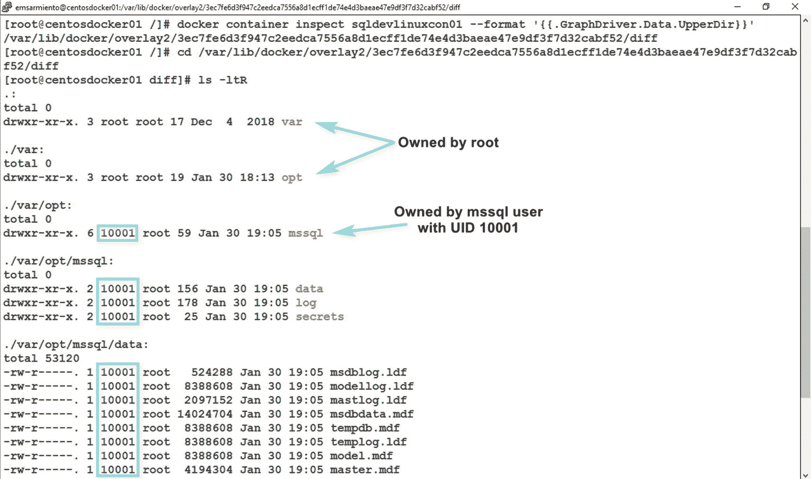
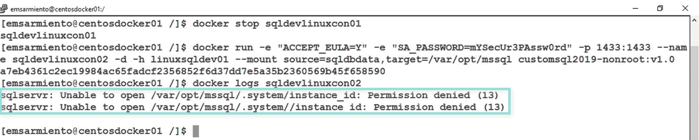
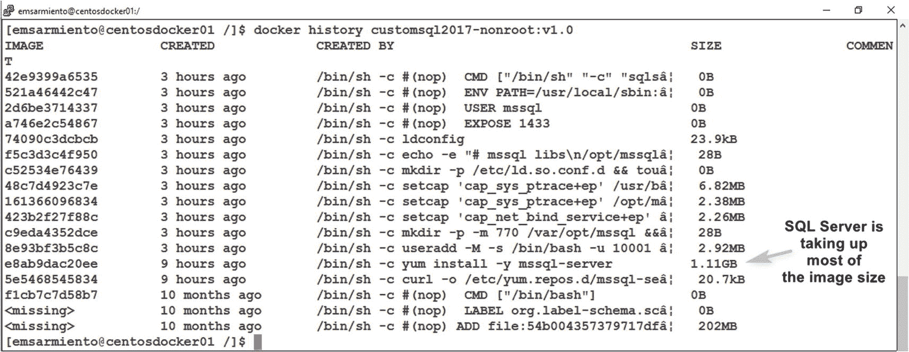

# 十、在 Linux 容器映像上创建自定义 SQL Server

> *学习新技术的秘密——或者任何事情——是永远不要忘记你已经知道的。*
> 
> —埃德温·萨米恩托

在上一章中，您已经学习了如何在一个 *Dockerfile* 中组合不同的指令来创建一个 Windows 容器上的定制 SQL Server。我们将使用前一章中介绍的内容来创建一个基于 Linux Docker 映像的定制 SQL Server。但是因为 Linux 和 Windows 有点不同，我将引入额外的 *Dockerfile* 指令。我还将介绍更多关于进一步定制 Linux 上的 SQL Server 映像的细节，以便为在开发或生产环境中部署做准备。所以，让我们开始吧。

## 附加 *Dockerfile* 指令

如果您分析在前一章中创建的 *Dockerfile* ，所使用的说明是基于我们对在 Windows 环境中安装和配置 SQL Server 的理解。在*章节* [*8*](08.html) 中，我们看了在 Linux 上自动安装 SQL Server。我们将把用于在 Linux 上自动安装和配置 SQL Server 的 bash 脚本翻译成一个*docker 文件*。但在此之前，我们先来看看需要考虑的一些附加说明。

### 暴露指令

*EXPOSE* 指令告诉 Docker 守护进程，您基于映像运行的容器将在运行时监听指定的网络端口。默认值是 TCP，但是您可以选择定义是否希望容器使用 UDP 端口。*曝光*指令的格式如下所示。我很确定你知道为什么使用指定的端口号。

```
EXPOSE 1433

```

我曾经认为 *EXPOSE* 指令是为了发布容器在运行时将要监听的端口。毕竟，这不正是“暴露”一词在计算机网络环境中的含义吗？但事实并非如此。 *EXPOSE* 指令仅仅是一个“提示”,告诉映像的用户在创建和运行容器时哪个端口是有用的。Docker 守护进程本身不会对该指令做任何事情。事实上，如果您正在 Linux 映像上构建一个定制的 SQL Server，您可以简单地忽略 *EXPOSE* 指令——就像我们在 Windows 映像上对 SQL Server 所做的那样——只要您映像的用户知道这是 SQL Server 的默认配置，并且它在端口 1433 上侦听。

我相信你知道我要说什么。这就像得到一部没有用户手册的智能手机(尽管你可能会争辩说没有人真正阅读用户手册)。如果你知道如何使用智能手机，你就不需要手册。但是如果你没有呢？这就是用户手册的用处。 *EXPOSE* 指令充当关于 Docker 映像的附加元数据。如图 [10-1](#Fig1) 所示，在您正在查看的映像上运行 *docker inspect* 命令时，您可以检查*配置*部分下的*曝光端口*值。


图 10-1

Linux 映像上公开可用的 SQL Server 的 ExposedPorts 值

发布容器内的应用将要监听的端口的是 *docker run* 命令的 *-p* 参数。查看如下所示的 *docker run* 命令，重点是 *-p* 参数:

```
docker run -e "ACCEPT_EULA=Y" -e "SA_PASSWORD=mYSecUr3PAssw0rd" --name sqldevlinuxcon01 -p 1433:1433 -d -h linuxsqldev01 mcr.microsoft.com/mssql/server:2017-CU14-ubuntu

```

这就是为什么我们使用 *-p* 参数来公开容器内部的 SQL Server 端口号，以便我们可以通过端口映射经由 Docker 主机的端口号来访问它。但是如果我们没有使用过 SQL Server，也不知道 SQL Server 是什么，我们就不知道它监听哪个默认端口号——因此，使用了 *EXPOSE* 指令。

*EXPOSE* 指令的另一个用途是，如果您决定将 SQL Server 配置为使用非默认端口，比如端口 5000。 *EXPOSE* 指令可以告诉用户在运行容器时发布哪个端口。但是让*在你的*docker 文件*中公开*指令的真正价值在于，它允许容器彼此对话，而不必使用 *docker run* 命令的 *-p* 参数来发布它们的端口号。我将在第*章* [*11*](11.html) 中更详细地介绍 Docker 网络。

### 音量指令

*VOLUME* 指令在容器内创建一个具有指定名称的挂载点，并将其标记为保存外部挂载的卷。*卷*指令的格式如下所示:

```
VOLUME /var/opt/mssql/data

```

当您第一次从映像运行容器时，挂载点是动态生成的，因为不能保证卷在您打算运行容器的 Docker 主机上可用。由于 Docker 容器的可移植性，在运行时创建的 Docker 卷将在主机上的 */var/lib/docker/volumes* 目录中有一个类似 GUID 的名称——您不能指定一个有意义的名称。这些 Docker 卷被称为*匿名*卷，因为 Docker 决定在哪里存储文件和目录。并且随着时间的推移很难访问该卷。匿名卷现在并不常用，因为我们已经有了命名卷。查看*章节* [*7*](07.html) 中的“Docker 卷”一节，了解如何配置卷以用于容器上的 SQL Server。图 [10-2](#Fig2) 显示了当您从具有*卷*指令的映像运行容器时创建的 Docker 卷的名称。


图 10-2

使用 volume 指令创建的 Docker 卷的名称示例

### 用户说明

回到 SQL Server 2017， *USER* 指令实际上没有意义，因为 Linux 映像上公开可用的 SQL Server 被配置为以 *root* 身份运行。鉴于 *root* 可以做任何事情，以 *root* 身份运行容器意味着任何可以恶意访问容器的人都可以进一步利用主机。出于安全原因，我们不希望这样。因此，我们希望以拥有有限特权的用户身份运行容器。

*USER* 指令设置运行容器时使用的用户名(或 UID)和可选的用户组(或 GID)。但是为了这样做，定制映像需要有限制执行 *CMD* 或 *ENTRYPOINT* 指令的指令。*用户*指令的格式如下所示:

```
USER mssql

```

我们将在本章后面更详细地探讨这一点。现在，让我们开始在 Linux 映像上构建一个定制的 SQL Server。

## 在 Linux 映像上构建定制的 SQL Server

我们将把我们的 *Dockerfile* 保存在 Linux Docker 主机的 */tmp/dockerBuild* 目录中。但是在我们创建 *Dockerfile* 之前，让我们首先定义在 CentOS Linux 映像中安装和配置 SQL Server 2017 实例的步骤:

1.  从公开发布的 CentOS Linux 7.6.1810 开始。请记住，CentOS 不是受支持的 Linux 发行版。我只是将此作为构建开发环境的一个例子。如果您想在生产环境中的 Linux 容器上部署 SQL Server，那么您的基本 Linux 映像应该是受支持的发行版之一——Red Hat Enterprise Linux、SUSE 或 Ubuntu。

2.  创建一个包含 SQL Server 2017 安装包位置的 *repo* 文件。

3.  安装 SQL Server 2017 包。

4.  在 Linux 上配置 SQL Server 2017。

5.  设置运行 SQL Server 进程的工作目录。

6.  运行 SQL Server 进程。

在我们创建 *Dockerfile* 的过程中，步骤 4 将包含额外的细节。重要的是，我们对在 Linux 上创建我们的定制 SQL Server 映像需要做的事情有了一个高层次的概述。让我们将前面概述的六个步骤翻译成一个*docker 文件*。我将使用项目编号作为步骤，并在注释中标识它们。为了简洁起见，我还排除了*标签*指令，但是请确保在您创建的每个*docker 文件*中都包含它们:

```
#Step 1
FROM centos:7.6.1810

#Step 2
RUN curl -o /etc/yum.repos.d/mssql-server.repo https://packages.microsoft.com/config/rhel/7/mssql-server-2017.repo

#Step 3
RUN yum install -y mssql-server

#Step 4
#Create the /var/opt/mssql/data directory to store the databases
RUN mkdir -p /var/opt/mssql/data

#Recursively change permissions of directories and files inside
# /var/opt/mssql and /etc/pwd from user to group
RUN chmod -R g=u /var/opt/mssql /etc/passwd

#Tell user what port this container will use
EXPOSE 1433

#Step 5
ENV PATH=${PATH}:/opt/mssql/bin

#Step 6
CMD sqlservr

```

使用 Ubuntu Linux 16.04 基础映像的相应 *Dockerfile* 如下所示。它会给你一些提示，告诉你为什么我更喜欢 RHEL/CentOS 而不是 Ubuntu。参见*章节* [章节 *3*](03.html) 在 Ubuntu 中安装所需依赖项的步骤和*章节* [*8*](08.html) 在 Ubuntu 上安装 SQL Server 的步骤。我将它们包括在步骤 1a 和 1b 中:

```
#Step 1
FROM ubuntu:16.04

#Step 1a–install Ubuntu packages needed for installing SQL Server
RUN apt-get update && apt-get install -y curl apt-utils apt-transport-https software-properties-common

#Step 1b-download and install public GPG keys for SQL Server
RUN curl https://packages.microsoft.com/keys/microsoft.asc | apt-key add -

#Step 2
RUN add-apt-repository "deb [arch=amd64] https://packages.microsoft.com/ubuntu/16.04/mssql-server-2017 xenial main"
RUN apt-get update

#Step 3
RUN apt-get install -y mssql-server

#Step 4
RUN mkdir -p /var/opt/mssql/data
RUN chmod -R g=u /var/opt/mssql /etc/passwd

EXPOSE 1433

#Step 5
ENV PATH=${PATH}:/opt/mssql/bin

#Step 6
CMD sqlservr

```

如果要安装 SQL Server 2019，请用适当的 *repo* 文件替换步骤 2。使用以下 docker build 命令构建自定义映像:

```
docker build -t customsql2017centoslinux:v1.0 .

```

我不是说过我更喜欢在 Linux 映像上使用 SQL Server 吗？这是因为它们构建时间更短，占用的存储空间也更少。图 [10-3](#Fig3) 显示了这个定制的 Linux 上的 SQL Server 映像的大小——与前一章中创建的 17.9GB 的 Windows 上的 SQL Server 映像相比，增加了 1.3+GB。再看看 CentOS Linux 7.6.1810 和 Ubuntu Linux 16.04 基础映像的大小。


图 10-3

Linux 上自定义 SQL Server 映像的大小

很简单，你不觉得吗？我们可以在此基础上添加我们在第 [8](08.html) 章中所做的配置设置，如启用 SQL Server 代理、设置跟踪标志等，作为步骤 4 中的附加说明。我们不需要更改数据库和备份文件的默认位置，因为我们可以运行一个容器并将 */var/opt/mssql* 目录挂载到 Docker 卷。此外，配置防火墙是不必要的，当你运行容器时，Docker 会神奇地更新 *iptables* 。我们唯一需要担心的是在启动过程中设置跟踪标志——并且只有在需要的时候。我们可以用 *ENTRYPOINT* 指令代替 *CMD* 指令来代替第 6 步，并将 SQL Server 启动参数作为 *docker run* 命令的一部分进行传递。

让我们来看看几种通过改变 *Dockerfile* 来调整我们在 Linux 上的定制 SQL Server 映像的方法。我将只介绍对这些步骤的具体更改，这样您就可以根据自己的需要来调整这些更改。

### 安装特定的 SQL Server 版本

如果你注意到了，我们一直在安装我们想要的 SQL Server 的最新版本，包括最新的更新(在撰写本文时，SQL Server 2017 的 CU19 和 SQL Server 2019 的 CU1)。虽然强烈建议您始终保持 SQL Server 安装的更新，但您可能需要一个特定的版本，因为这是您已经用应用测试过的版本。假设您想要安装 SQL Server 2017 CU14，因为您想要构建的标准化映像需要此特定版本。您肯定不希望在 Linux 上创建包含任何高于 CU14 的自定义 SQL Server 映像。您可以修改步骤 3 来安装一个特定的包，该包引用您要安装的 SQL Server 版本。可以从 [`https://packages.microsoft.com/rhel/7/mssql-server-2017/`](https://packages.microsoft.com/rhel/7/mssql-server-2017/) (针对 RHEL 和 CentOS 7)或者 [`https://packages.microsoft.com/ubuntu/16.04/mssql-server-2017/pool/main/m/mssql-server/`](https://packages.microsoft.com/ubuntu/16.04/mssql-server-2017/pool/main/m/mssql-server/) (针对 Ubuntu 16.04)查看具体的 SQL Server 2017 包。或者，您可以运行以下命令来列出所有可用的软件包:

```
yum --showduplicates list mssql-server #for RHEL/CentOS
apt -a list mssql-server #for Ubuntu

```

该命令的结果将取决于您在步骤 2 中定义的 *repo* 文件。图 [10-4](#Fig4) 显示了 RHEL 上 SQL Server 2017 可用的所有包。


图 10-4

针对 RHEL 上的 SQL Server 2017 的不同包

您可以使用以下命令安装 SQL Server 2017 CU14:

```
sudo yum install -y mssql-server-14.0.3076.1-2 #for RHEL/CentOS
sudo apt-get install -y mssql-server=14.0.3076.1-2 #for Ubuntu

```

您现在所要做的就是用下面的命令替换*docker 文件*中的步骤 3，替换您正在使用的 Linux 发行版的适当的包管理命令:

```
#Step 3
RUN yum install -y mssql-server-14.0.3076.1-2 #for RHEL/CentOS
RUN apt-get install -y mssql-server=14.0.3076.1-2 #for Ubuntu

```

### 创建以非根用户身份运行的自定义映像

我参加了微软 MVP 安东尼·诺森蒂诺在 2019 年 PASS 峰会上关于 Kubernetes 架构的演讲，因为这是我 100%确定我能在这么大的会议上赶上他的唯一方式。如今，大多数交流都是虚拟的——通过电子邮件、即时通讯、社交媒体、电话或电话会议。但是没有什么比面对面更好了。叫我老派吧，但是面对面的交流是我们建立良好关系的方式。只要有机会，我就会尽最大努力与家人、朋友和熟人面对面交流。

当他结束问答演示时，观众中有人走近他，为他的演示失败道歉。她说，她一直在四处走动，参加与 Docker 相关的会议，重点讨论 Linux，并与演讲者讨论他们的演示失败的原因。她恰好是 SQL Server 团队的开发人员，负责更新 Linux Docker 镜像上的 SQL Server 2019。而且由于 SQL Server 2019 是在 PASS Summit 的那一周正式发布的，所以他们也发布了所有更新的 Linux Docker 映像上的 SQL Server 2019，以及他们引入的更改:运行非*根*容器。

正如我在前面的章节中已经反复提到的，以*根目录*运行容器会带来安全风险。遵循最小特权原则，我们可以在 Linux 映像上创建一个定制的 SQL Server，以非 *root* 身份运行。Linux 上公开可用的 SQL Server 2017 映像都是在假设容器将作为*根*运行的情况下创建的。随着 SQL Server 2019 的发布，微软也发布了一个 *Dockerfile* ，其中包含对现有公共映像的修改，以便他们可以作为非 *root* 用户运行容器。看一下 *Dockerfile* 这里: [`https://github.com/microsoft/mssql-docker/blob/master/linux/preview/examples/mssql-server-linux-non-root/Dockerfile`](https://github.com/microsoft/mssql-docker/blob/master/linux/preview/examples/mssql-server-linux-non-root/Dockerfile) 。我们将探究附加指令以及它们的作用。参考*文档*中的行号。

**第 10 行** : *运行 useradd-M-s/bin/bash-u 10001-g 0 MSSQL*

这条指令运行 *useradd* 命令，将一个名为 *mssql* 的新用户添加到现有的 Linux 映像上的 SQL Server 2017 中。 *-M* 参数将跳过为新用户创建主目录。 *-s* 参数指定使用 */bin/bash* 作为用户的登录 shell。 *-u* 参数指定用户的 UID 值 10001，而-g 参数指定 GID 值 0。请记住，这个用户是在容器中创建的，而不是在主机中创建的。

Tip

在我对 SQL Server 2019(以及 Ubuntu 上的 SQL Server 2017)的测试中，这条指令可能会导致映像构建过程失败——但对 RHEL/CentOS 上的 SQL Server 2017 却不会，我觉得这很奇怪。SQL Server on Linux 安装过程的一部分是创建名为 *mssql* 的用户和组。 *UID* 和*用户名*的值必须是唯一的。由于 *mssql* 用户已经存在，尽管具有不同的 UID，该命令失败。添加已经存在的用户将引发错误，并导致映像构建过程失败。相应地测试。在创建 Linux 上的自定义 SQL Server 2019(或 Ubuntu 上的 SQL Server 2017)映像时，可以排除此行。然而，这样做意味着接受安装过程中创建的具有不同 UID 值(999)的 *mssql* 用户。这个 UID 值可能已经存在于您的 Linux Docker 主机上，并且可能会导致混淆到底是谁在运行容器。参见图 [10-10](#Fig10) 。另一种选择是将其命名为其他名称，但使用 10001 UID 值。

**第 11 行** : *运行 mkdir-p-m 770/var/opt/MSSQL&T5】chgrp-R 0/var/opt/MSSQL*

这条指令运行 *mkdir* 命令来创建一个名为 */var/opt/mssql* 的新目录，使用 *-m* 参数分配 770 个权限——所有者为 RWX，组为 RWX，其他人没有权限。 *& &* 字符只是添加了 *chgrp* 命令，而不是创建一个新的 *RUN* 指令。这看起来很像第 4 步，但是权限更细。另外，附加命令而不是创建另一条指令是一个优化技巧，我们可以在我们的 *Dockerfile* 中实现。

Note

如果您按照 *Dockerfile* 中的命令顺序，那么是 *root* 用户隐式地创建了 */var/opt/mssql* 目录。这意味着运行 *chgrp* 命令只是从*根*分配相同的组权限。如果我们指派 *mssql* 用户来运行 *sqlservr* 进程，这是行不通的。我们要么让 *mssql* 用户创建 */var/opt/mssql* 目录，要么使用命令`chown -R mssql:0 /var/opt/mssql`明确地将所有权更改为 *mssql* 用户。来自微软的可用的 *Dockerfile* 可以工作，但是该映像是从 Linux 上的现有 SQL Server 映像构建的(注意来自指令的*不是基本操作系统映像)。我不确定他们用来构建基本映像的脚本是否已经包含了让 *mssql* 用户成为 SQL Server 目录的所有者。*

我重写了指令，以显式地分配 */var/opt/mssql* 目录的 *mssql* 用户所有权，如下所示。我还对它进行了优化，将多个命令组合在一条 RUN 指令中，而不是多行:

```
RUN mkdir -p -m 770 /var/opt/mssql && chown -R mssql:0 /var/opt/mssql && chgrp -R 0 /var/opt/mssql

```

**第 15 行** : *运行 setcap ' cap _ net _ bind _ service+EP '/opt/MSSQL/bin/SQL servr*

该指令运行 *setcap* 命令来设置文件的 Linux 功能，在本例中是 *sqlservr* 可执行文件。功能 *cap_net_bind_service* 将 *sqlservr* 可执行文件绑定到一个低编号的端口号(1024 以下的任何数字)，而不是作为 *root* 运行。 *+ep* 意味着我们正在分配 *+* 操作符*显式*和*允许的*能力。

Note

Linux 功能是一个安全概念。它们为进程提供了可用的*根*特权的子集。您不希望授予一个进程完全的*根*特权(例如 docker 容器进程)，否则您将冒利用该进程并接管整个机器的风险。一个进程可能需要特殊的特权来执行它的功能，但是简单地授予它 *root* 访问权限有点过分。因此，您授予 Linux 进程完成其工作所需的适当能力。第 15 行中的示例授予 *sqlservr* 进程 *cap_net_bind_service* 功能，以将其绑定到一个低编号的端口号。这比授予它 *root* 权限要安全得多。

**第 19 行** : *运行 setcap ' cap _ sys _ ptrace+EP '/opt/MSSQL/bin/pal dumper*

类似于第 15 行，这条指令运行 *setcap* 命令来将 *cap_sys_ptrace* 功能设置到 *paldumper* 文件。从它的名字就可以猜出这个文件是什么——它是一个 SQL Server 实用程序，用于生成核心转储，主要用于故障排除。这必须明确定义，因为我们将不再以 *root* 身份运行容器，但是我们需要 *root* 权限来执行故障排除。

**第 20 行** : *运行 setcap ' cap _ sys _ ptrace+EP '/usr/bin/gdb*

这类似于第 19 行，但是用于 *gdb* 文件，GNU debugger 的缩写，它是 Linux 最常见的调试工具。

**第 25 行** : *运行 mkdir-p/etc/LD . so . conf . d&T5】touch/etc/LD . so . conf . d/MSSQL . conf*

这条指令使用 SQL Server 将使用的 *touch* 命令—*MSSQL . conf*创建一个 *ldconfig* 文件。 *ldconfig* 命令用于为共享库创建必要的链接和缓存。共享库是程序启动时加载的库。这些共享库的位置存储在环境变量 *LD_LIBRARY_PATH* 中。接下来的几个说明进一步解释了为什么需要这样做。

**第 26 行** : *运行 echo-e " # MSSQL libs \ n/opt/MSSQL/lib ">/T5】/etc/LD . so . conf . d/MSSQL . conf*

在第 25 行的基础上，包含*# MSSQL libs \ n/opt/MSSQL/lib*的新行被添加到*/etc/LD . so . conf . d/MSSQL . conf*文件中。读取 *mssql.conf* 文件来搜索所使用的共享库的位置，在本例中是 *libs* 和*/opt/MSSQL/lib*(*\ n*用于引入一个新行)。这是因为早期指令中使用的 *setcap* 命令删除了 *LD_LIBRARY_PATH* 和其他控制动态链接的环境变量。这是出于安全考虑。由于您将使用非*根*用户运行容器，所有不安全的环境变量都将被删除，使得在故障排除期间运行 *paldumper* 和 *gdb* 变得无用。

**第 27 行** : *运行 ldconfig*

这条指令运行 *ldconfig* 命令来应用在第 25 和 26 行创建的配置设置。

**第 29 行** : *用户 mssql*

该指令在运行容器时将 *mssql* 设置为用户。

下面的 *Dockerfile* 集成了这些行，以创建一个在 CentOS Linux 上的定制 SQL Server 映像，该映像作为非 *root* 运行。我添加了步骤和行号作为注释，以标识添加的指令:

```
#Step 1
FROM centos:7.6.1810

#Step 2
RUN curl -o /etc/yum.repos.d/mssql-server.repo https://packages.microsoft.com/config/rhel/7/mssql-server-2017.repo

#Step 3
RUN yum install -y mssql-server

#Line 10–change to a different user like mssql2 if you are
#installing SQL Server 2019 or SQL Server 2017 on Ubuntu
RUN useradd -M -s /bin/bash -u 10001 -g 0 mssql

#Modified Line 11
RUN mkdir -p -m 770 /var/opt/mssql && chown -R mssql:0 /var/opt/mssql && chgrp -R 0 /var/opt/mssql

#Lines 15, 19, and 20
RUN setcap 'cap_net_bind_service+ep' /opt/mssql/bin/sqlservr
RUN setcap 'cap_sys_ptrace+ep' /opt/mssql/bin/paldumper
RUN setcap 'cap_sys_ptrace+ep' /usr/bin/gdb

#Lines 25, 26, and 27
RUN mkdir -p /etc/ld.so.conf.d && touch /etc/ld.so.conf.d/mssql.conf
RUN echo -e "# mssql libs\n/opt/mssql/lib" >> /etc/ld.so.conf.d/mssql.conf
RUN ldconfig

#Tell user what port this container will use
EXPOSE 1433

#Line 29
USER mssql

#Step 5
ENV PATH=${PATH}:/opt/mssql/bin

#Step 6
CMD sqlservr

```

保存*docker 文件*并构建映像。一旦完成，您就可以使用这个定制的 Linux 上的 SQL Server 映像作为非*根*来运行容器。

### 以非根用户身份运行容器

默认情况下，使用 *docker run* 命令运行容器将作为*根*运行。但是现在您构建的定制映像不再作为*根*运行，从定制映像运行容器意味着虽然*根*仍然拥有容器的读写文件系统层(Docker 守护进程作为*根*运行，它创建读写文件系统层)，但它不再作为*根*运行。运行下面的 *docker 容器检查*命令来检查容器的读写文件系统层。我使用了 *- format* 参数来保持 *docker container inspect* 命令的结果干净，并且只显示 *UpperDir* 目录——包含读写文件系统层的目录。用容器的名称替换 *sqldevlinuxcon01* 。参考*章节* [*5*](05.html) 快速查看文件系统层及其位置。

```
docker container inspect sqldevlinuxcon01 --format '{{.GraphDriver.Data.UpperDir}}'

```

Tip

对于只显示来自 *docker 容器检查*或任何返回 JSON 输出的 *docker* 命令的 JSON 输出的信息来说， *- format* 参数非常方便。事实上，所有的 *docker* 命令都返回一个 JSON 输出，这就是为什么很多命令都有一个 *- format* 参数。只是最常见的命令已经应用了一个模板。由于 Docker 是使用 Go 编程语言编写的，所以您可以通过应用 Golang 包模板来自己格式化 JSON 输出。从 [`https://golang.org/pkg/text/template/`](https://golang.org/pkg/text/template/) 查看 Golang 包模板。

您可以将它作为参数传递给 *ls* 命令，以查看目录的所有者，如下所示。确保在命令前面加上 *sudo* ，因为*根*拥有 */var/lib/docker* 目录。图 [10-5](#Fig5) 显示了目录的所有者——它仍然是*根*。


图 10-5

root 仍然拥有容器的文件系统层

```
sudo ls -ld "$(docker container inspect sqldevlinuxcon01 --format '{{.GraphDriver.Data.UpperDir}}')"

```

但是如果您使用下面的命令查看从 Linux Docker 主机运行 *sqlservr* 的进程，您将会看到它不再作为 *root* 运行。图 [10-6](#Fig6) 显示了 *UID 10001* 作为运行 *sqlservr* 进程的用户 ID。这是我们在使用 *Dockerfile* 中的 *Line 10* 创建 *mssql* 用户时分配的用户 ID。


图 10-6

UID 10001 在 Linux Docker 主机中运行 sqlservr 进程

```
ps aux | grep sqlservr

```

您可以通过运行下面的 *docker exec* 命令传递前面的命令来确认容器也作为 *mssql* 用户运行:

```
docker exec -it sqldevlinuxcon01 ps aux | grep sqlservr

```

你也可以运行下面的 *docker 容器检查*命令:

```
docker container inspect sqldevlinuxcon01 --format '{{.Config.User}} {{.Name}}'

```

图 [10-7](#Fig7) 显示了在容器内部运行 *sqlservr* 进程的 *mssql* 用户。


图 10-7

mssql 用户在容器中运行 sqlservr 进程

如图 [10-8](#Fig8) 所示，检查容器的读写文件系统层以确认文件和目录的所有权。



图 10-8

UID 为 10001 的 mssql 用户拥有这些目录

图 [10-6](#Fig6) 和 [10-8](#Fig8) 中只显示用户 ID 值的原因是因为我们没有在 Linux Docker 主机上创建具有相应用户 ID 值的 *mssql* 用户。我强烈建议在 Linux Docker 主机上创建具有相同 UID 值的 *mssql* 用户，这样您就可以轻松地将它映射到在容器内部运行的用户。使用以下命令在 Linux Docker 主机上创建用户:

```
sudo useradd -M -s /bin/bash -u 10001 -g 0 mssql

```

重新运行用于显示图 [10-6](#Fig6) 的命令将不再显示 UID 值，而是显示用户友好的名称。

您必须非常小心的一件事是为您在容器中创建的用户帐户分配 UID 值。微软决定对 mssql 用户使用 UID 10001 是有原因的——这个值足够大，可以防止 Linux Docker 主机上任何可能的冲突。请记住，容器与 Docker 主机共享同一个内核。Linux 内核负责管理 UID 和 GID 空间，它们用于确定是否应该授予所请求的特权。当我们在 *Dockerfile* 的*行 10* 中创建了 *mssql* 用户时，会对照 Linux 内核检查 UID，看它是否已经存在。如果有，它将只使用现有的 UID。如果没有，它将在一个隔离的 UID 空间中创建，该空间只存在于容器的上下文中。当创建容器时，Docker 守护进程通过 *root* 用户在 Linux Docker 主机中创建读写文件系统层。当我们授予 *mssql* 用户对 */var/opt/mssql* 目录的所有权时，Docker 主机的 Linux 内核检查一个进程是否有权限对目录中的文件进行修改。UID 值用于检查，而不是用户名。这就是为什么图 [10-8](#Fig8) 显示的是 UID 值而不是用户名。但是，如果 Docker 主机中的现有 Linux 用户与您在容器中使用的用户具有相同的 UID 值，那么 Linux Docker 主机中的用户将胜出。图 [10-9](#Fig9) 展示了这一点。在我的 Linux Docker 主机中，Linux 用户 *emsarmiento* 的 UID 值为 1000。我忽略了 *Dockerfile* 中的*行 10* ，并为 *mssql* 用户分配了 UID 值 1000——与用户*emsarmiento–*相同，而不是 10001。


图 10-9

UID 为 1000 的 emsarmiento 用户拥有目录，而不是 mssql

您可以通过检查容器内部和 Linux Docker 主机上运行的 SQL Server 进程来确认这一点。图 [10-10](#Fig10) 显示了容器中使用的与 Linux Docker 主机上相同的 UID。你可能会认为他们是不同的用户，因为名字不同。事实是它们是相同的 UID。


图 10-10

在 Linux Docker 主机上已经存在的容器上使用 UID 的效果

Tip

在构建自定义 Docker 映像时，正确记录您创建的所有用户。这不仅有助于将容器作为非*根*运行，也有助于安全性和审计。在大型企业中，有一个单独的团队管理 Docker 基础设施，通知他们运行容器的非*根*用户可以帮助他们回答审计人员提出的与安全相关的问题。

## 非根用户和 Docker 卷

在第*章* [*7*](07.html) 中，我们了解了在 Docker 卷中存储 SQL Server 数据库以持久化数据。但是那时，*根用户*拥有 Docker 卷中创建的目录。图 [10-11](#Fig11) 显示了作为利用 Docker 卷的*根*运行的 Linux 上的 SQL Server 2017 映像的目录结构和所有权。


图 10-11

当容器作为根用户运行时，Docker 卷上的文件系统所有权

按照第*章* [*7*](07.html) 中概述的步骤，对一个以*根*身份运行的容器执行智能更新或升级，而另一个不是，您将最终得到一个*权限被拒绝(13)* 错误，如图 [10-12](#Fig12) 所示。毕竟不太聪明，是吧？



图 10-12

当非根容器作为根运行时，Docker 卷上出现文件系统所有权错误

这是因为非*根*容器内的 *sqlservr* 进程正试图访问*根*用户拥有的 Docker 卷内的数据库文件。这就像使用特定的 Active Directory 域帐户在 Windows 上运行 SQL Server，然后将该服务帐户更改为另一个对系统和用户数据库没有读写权限的帐户，SQL Server 将不会启动。

Tip

如果您以前这样做过，并且没有遇到此问题，为什么要授予 SQL Server 服务帐户管理员权限？您应该限制 SQL Server 服务帐户的权限，而不是给它无限制的访问权限。我厌倦了看到 SQL Server 服务帐户作为 Active Directory 域管理员运行。不要成为那些数据库管理员中的一员。请遵循本 Microsoft 文档中的指导原则为 Windows 上的 SQL Server 配置服务帐户: [`https://docs.microsoft.com/en-us/sql/database-engine/configure-windows/configure-windows-service-accounts-and-permissions?view=sql-server-ver15#Serv_Perm`](https://docs.microsoft.com/en-sus/sql/database-engine/configure-windows/configure-windows-service-accounts-and-permissions%253Fview%253Dsql-server-ver15%2523Serv_Perm) 。

现在你知道为什么 SQL Server 团队的开发人员跑来跑去，向 PASS Summit 上关于 Linux 容器上的 SQL Server 的演讲人道歉了。她知道这是一个定时炸弹。她是对的。每个演示如何在 Linux 容器上执行 SQL Server 就地升级的演讲者都失败了。

对以根用户*身份运行的容器和另一个非根用户*执行就地更新或升级的方法是，首先授予非*根用户*对 Docker 卷中目录的权限。以下是执行容器的智能就地更新或升级的步骤的修改版本。这里假设您知道自定义映像中定义的非*根*。

1.  停下容器。

2.  将 Docker 卷中的 SQL Server 目录和文件的所有权分配给非 *root* 用户。

在继续更新或升级容器之前，需要将非*根用户*设置为 Docker 卷中文件的新所有者。假设您没有对映射到 Docker 卷的目录进行更改的 *root* 特权，那么您可以创建一个临时容器来完成这个任务。下面的 *docker run* 命令使用 Alpine Linux 映像运行一个容器；连接 Docker 卷并运行一个 *chown* 命令，将目录和文件所有权更改为 UID 值为 10001 的 *mssql* 用户。我使用 Alpine Linux 映像，因为它非常轻量级。此外，我只需要它来运行 *chown* 命令。我使用了一个 UID 值而不是用户名，以防它还没有在 Linux Docker 主机上创建。 *sqldbdata* 是 Docker 卷的名称。

```
#Run a temporary Alpine Linux container, mount the Docker volume,
#and run the chown command
docker run --name temp -d --mount source=sqldbdata,target=/data alpine chown -R 10001:0 /data

#Remove the temporary container
docker rm temp -f

```

Tip

您还可以直接在 Linux Docker 主机中更改目录和文件的所有权。唯一的挑战是拥有根用户特权来修改映射到文件系统中 Docker 卷的目录。默认情况下，Docker 卷创建在 */var/lib/docker/volumes* 目录中。您可以对*/var/lib/docker/volumes/sqldbdata/_ data*目录运行相同的 *chown* 命令。要做到这一点，您需要 root 权限。

1.  基于以非*根*用户身份运行的 Linux 上的定制 SQL Server 映像，在 Linux 容器上创建一个新的 SQL Server，并使用新名称–*sqldevlinuxcon 02*。将相同的卷–*sqldbdata*附加到这个新容器，并重用相同的端口号和主机名。

```
docker run -e "ACCEPT_EULA=Y" -e "SA_PASSWORD=mYSecUr3PAssw0rd" -p 1433:1433 --name sqldevlinuxcon02 -d -h linuxsqldev01 --mount source=sqldbdata,target=/var/opt/mssql customsql2019-nonroot:v1.0

```

请记住，一旦从 SQL Server 2017 升级到 SQL Server 2019，就没有回头路了。这不同于使用相同版本但不同 CU 更新容器，如果事情没有按计划进行，您可以回滚到上一个版本。事实上，没有什么可以替代行之有效的备份。

## 优化 Dockerfile 文件

让我们在第*章* [*9*](09.html) 中关于优化 *Dockerfile* 的内容基础上再接再厉。然而，当你查看映像尺寸时，真的没有太多需要优化的地方。图 [10-13](#Fig13) 显示了当您运行 *docker history* 命令时，作为非 *root* 用户运行的 Linux 上的自定义 SQL Server 2017 映像层。



图 10-13

为 Linux Docker 映像上的定制 SQL Server 列出不同的文件系统层

最大的层是具有安装 SQL Server 的指令的层。除非您想像我们在 Windows 上的自定义 SQL Server 映像上那样删除安装文件，否则我们无法对该层做任何事情。方法是在安装 SQL Server 后，使用以下指令清除 *yum 缓存*:

```
RUN yum cache all

```

但是，您可以像下面的命令一样将它附加到第 3 行，而不是添加另一个指令，这样它就不会创建额外的映像层:

```
#Step 3
RUN yum install -y mssql-server && yum cache all

```

Tip

在 Linux 中，你可以在一行中运行多个命令，就像 *#Step 3* 中的例子。您甚至可以在一行中组合多个不同的命令。你只需要用一个链接操作符把它们分开。这就是所谓的“命令链”，也就是在一行中将多个命令连接在一起。在上例中，使用了 AND 运算符(& &)。您还可以使用其他命令链操作符，如分号操作符(；)，但是我们将保持简单，坚持使用 *Dockerfiles* 中的 and 操作符。

不会有很大的空间节省，大概 80MB 左右。Linux 上的 SQL Server 包没有 Windows 上的 SQL Server 安装文件大。

您可能想做的另一件事是将第 25、26 和 27 行合并成一条 *RUN* 指令。但是因为这些只是增加了 *sqlservr* 、 *paldumper* 和 *gdb* 的功能，所以当你将它们组合在一条 *RUN* 指令中时，你并没有真正节省空间。你只是减少了映像层的数量。

您可以删除步骤 5 中的 *ENV* 指令，并将其包含在步骤 6 中的 *CMD* 指令中，如下所示:

```
CMD ["/opt/mssql/bin/sqlservr"]

```

但这只是一个表面上的优化——减少映像层数，但不减少映像大小。我将让您创建一个在 Linux 上运行的定制 SQL Server 映像，并尽可能地优化它。

## 在 Dockerfile 文件中运行脚本

到目前为止，我们构建的 Linux 上的定制 SQL Server 映像是为在生产环境中部署而设计的。请注意，我没有包括 SQL Server 命令行实用程序的安装。正如我在第*章* [*4*](04.html) 中提到的，我不喜欢在生产服务器上安装任何不必要的东西，包括客户端工具。对于开发环境，我只安装我真正需要的东西，比如 SQL Server 命令行实用程序。

### 安装 SQL Server 命令行实用工具

要在 Linux 上安装 SQL Server 命令行实用程序，需要下载一个不同的 *repo* 文件。您可以在*docker 文件*的步骤 2 中包含以下命令:

```
#For RHEL/CentOS
curl -o /etc/yum.repos.d/msprod.repo https://packages.microsoft.com/config/rhel/7/prod.repo

#For Ubuntu
add-apt-repository "deb [arch=amd64] https://packages.microsoft.com/ubuntu/16.04/prod xenial main"

```

您的*docker 文件*中更新的步骤 2 看起来类似于下面优化为单个 *RUN* 指令的步骤:

```
#For RHEL/CentOS
RUN curl -o /etc/yum.repos.d/mssql-server.repo https://packages.microsoft.com/config/rhel/7/mssql-server-2017.repo && curl -o /etc/yum.repos.d/msprod.repo https://packages.microsoft.com/config/rhel/7/prod.repo

#For Ubuntu
RUN add-apt-repository "deb [arch=amd64] https://packages.microsoft.com/ubuntu/16.04/mssql-server-2017 xenial main" && add-apt-repository "deb [arch=amd64] https://packages.microsoft.com/ubuntu/16.04/prod xenial main"

```

更新后的步骤 3 现在将包括在 Linux 上安装 SQL Server 命令行工具，如下所示。你需要传递值为 *Y* 的 *ACCEPT_EULA* 参数，在安装过程中自动响应 EULA 提示。当我们刚刚安装 SQL Server 时，我们不需要它，因为我们将它作为 *docker run* 命令的参数传递。

```
#For RHEL/CentOS
RUN ACCEPT_EULA=Y yum install -y mssql-server mssql-tools unixODBC-devel

#For Ubuntu
RUN ACCEPT_EULA=Y apt-get install -y mssql-server mssql-tools unixODBC-devel

```

由于 SQL Server 命令行工具存储在不同的目录中，您需要使用如下所示的附加路径来更新步骤 5:

```
ENV PATH=${PATH}:/opt/mssql/bin:/opt/mssql-tools/bin

```

使用安装在 Linux 上的自定义 SQL Server 映像上的 SQL Server 命令行工具，您可以在为开发环境部署容器的过程中运行不同的 T-SQL 脚本。

### 编写 Bash 脚本来检查备份

下面是在开发环境中部署 SQL Server 的一个常见用例。假设您想要将数据库备份复制到 Docker 卷中，并作为在 Linux 映像上部署定制 SQL Server 的一部分来恢复它们。任何想在映射到 Docker 卷的 Linux 容器上运行 SQL Server 的人都会自动准备好这些用户数据库。让我们从复制 Docker 卷中的数据库备份开始:

1.  创建一个名为 sqldbdata 的 Docker 卷:

    ```
    docker volume create sqldbdata

    ```

2.  复制 Docker 卷中的数据库备份。

有几种方法可以将文件拷贝到 Docker 宗卷中。但是因为我们假设您没有 *root* 权限，所以我们将创建一个临时容器来做这件事。这是因为，默认情况下，容器在*根*的安全上下文中运行，除非您特别配置源映像作为非*根*运行。此外，这还假设所有 SQL Server 数据库备份文件都在当前工作目录中。

1.  将 Docker 卷的所有权更改为非 *root* 用户:

    ```
    #Use the temporary container to run the chown command
    #to change ownership of files in the Docker volume
    docker exec temp chown -R 10001:0 /data

    #Delete the temporary container after use
    docker rm temp -f

    ```

```
#Create a temporary container using the Alpine Linux image
#just so we can copy files into the Docker volume
docker run --name temp -d -v sqldbdata:/data alpine sleep 10000

#Copy files from the current working directory that contains
#the SQL Server database backups into the Docker volume
docker cp . temp:/data

```

您可以创建多个 Docker 卷，每个卷都有一个数据库备份的副本，并告诉用户将特定的卷装载到他们的容器中。这实际上取决于您的部署策略。

因为您现在在 Linux 上的定制 SQL Server 映像中有了 SQL Server 命令行工具，所以您可以使用 *sqlcmd* 运行 T-SQL 脚本，在容器中以 DBA 的身份做您想做的任何事情。您可以编写自己的 T-SQL 脚本来检查数据库备份并恢复它们，并从 *sqlcmd* 调用该脚本。下面是 bash 脚本的一个代码片段，该脚本遍历指定目录中的数据库备份并恢复它们:

```
#Iterate thru all the BAK files in Docker volume
#/var/opt/mssql is mounted on Docker volume=sqldbdata
for files in /var/opt/mssql/∗.bak
do
  /opt/mssql-tools/bin/sqlcmd -S localhost -U sa -P $SA_PASSWORD -d master -Q "RESTORE DATABASE [${files:15:-4}] FROM DISK ='$files'"
done

```

我相信您已经认识到了带有*恢复数据库*命令的 *sqlcmd* 调用。您过去可能在 Windows 上对批处理文件做过类似的事情。出于演示目的，我保持脚本简单，但是您可以疯狂地使用您的 T-SQL 脚本。数据库备份以格式 *databaseName.bak* 命名，并且都是从具有默认配置的 Linux 实例上的 SQL Server 中获取的。这样，当运行 *RESTORE DATABASE* 命令时，我们不需要指定带有 MOVE 选项的*。方括号内的 *${files:15:-4}* 执行字符串操作来提取数据库名称。由于容器中的 */var/opt/mssql* 目录将被映射到 Docker 卷，因此备份文件的完整路径将采用*/var/opt/MSSQL/databasename . bak*的形式。数据库名称开头前有 15 个字符( */var/opt/mssql/* )，后面有 4 个字符(*)。bak* )。$符号指的是名为 *files* 的变量，它包含备份文件的完整路径。对于指定目录中的每个备份文件，脚本将在下面生成并运行相应的 *sqlcmd* 命令。不要取笑我。我仍然使用经典的 Northwind 数据库作为示例。*

```
/opt/mssql-tools/bin/sqlcmd -S localhost -U sa -P $SA_PASSWORD -d master -Q "RESTORE DATABASE [Northwind] FROM DISK ='/var/opt/mssql/Northwind.bak'"

```

在脚本中运行*恢复数据库*命令之前，我还包含了一个*睡眠*命令。还记得从*章* [*7*](07.html) 的原地升级吗？即使是在 Linux 容器上的 SQL Server 的新部署看起来也像是升级，因为它是从 RTM 版本开始的。这需要时间。 *sleep* 命令考虑到了这一点，在升级过程完成(大约 2 分钟)之前不会运行 RESTORE DATABASE 命令。如果你愿意，你可以增加等待时间。这是一种快速而肮脏的方法，但还有其他方法，如读取 SQL Server 错误日志来检查特定文本，如以下代码片段:

```
#Check SQL Server errorlog to see if recovery is complete
while ! grep "Recovery is complete. This is an informational message only. No user action is required" /var/opt/mssql/log/errorlog
do sleep 10; done

```

以下是检查数据库备份并恢复它们的完整 bash 脚本:

```
#!/bin/bash

#Make script wait until the upgrade process completes
sleep 120

#Iterate thru all the BAK files in Docker volume
#directory /var/opt/mssql/data is mounted on Docker volume
for f in /var/opt/mssql/∗.bak

do
  /opt/mssql-tools/bin/sqlcmd -S localhost -U sa -P $SA_PASSWORD -d master -Q "RESTORE DATABASE [${f:15:-4}] FROM DISK ='$f'"
done

```

将脚本命名为 *checkbackups_restore.sh* 。你以后会需要它的。

Note

不像在第*章* [*8*](08.html) 中，我们在 Linux 主机上为 bash 脚本文件分配了 *execute* 权限，在这里您不需要这样做。对 bash 脚本文件分配 *execute* 权限将在定制 Docker 映像中完成。一个额外的指令将被添加到 *Dockerfile* 中，您将在下一节中看到。

您还需要另一个 bash 脚本。你可以称之为“启动”脚本。它所做的是调用 *checkbackups_restore.sh* 脚本，当脚本在后台执行时，调用 *sqlservr* 进程。回想一下， *Dockerfile* 中的最后一条指令应该是不会终止的。否则，容器也将终止。因此，为了运行 *checkbackups_restore.sh* 脚本并启动 *sqlservr* 进程，我们需要从启动脚本中调用它们。下面是启动 bash 脚本的代码。您可以将其保存为 *startup.sh* :

```
#!/bin/bash

#Start the script to restore all database backups
#from Docker volume; run script in the background
/tmp/startup/checkbackups_restore.sh &

# Start SQL Server
/opt/mssql/bin/sqlservr

```

观察启动脚本，您会注意到它是从 */tmp/startup* 目录中被调用的。这意味着启动脚本和 *checkbackups_restore.sh* 脚本都应该在容器内名为 */tmp/startup* 的目录中。这也意味着我们需要创建 */tmp/startup* 目录，并向*check backups _ restore . sh*和 *startup.sh* 脚本授予 *execute* 权限。这让你对新的 *Dockerfile* 的外观有了一个概念。还有，脚本后面的“&”符号告诉它在后台运行。

### 在最后一条指令中运行 Bash 脚本

现在我们有了必要的脚本，我们可以调用启动脚本作为 *Dockerfile* 中的最后一条指令，如下所示:

```
CMD ["/tmp/startup/startup.sh"]

```

以下是更新后的 *Dockerfile* 带注释。请注意，这个新的定制映像构建在另一个定制的 SQL Server 2017 on Linux 映像上，安装了 SQL Server 命令行工具，以非*根*身份运行。

```
#Start from custom SQL Server 2017 on Linux image
#running as non-root with command line tools
#NOTE: Use the correct Docker image name
FROM customsql2017oncentoswithtools-nonroot:v1.0

#Create working directory
RUN mkdir -p /tmp/startup

#Copy bash scripts into working directory
# and assign the mssql user as owner
COPY --chown=mssql:0 . /tmp/startup

#Grant executable permissions to bash scripts
RUN chmod +x /tmp/startup/checkbackups_restore.sh
RUN chmod +x /tmp/startup/startup.sh

#Run startup script startup.sh
CMD ["/tmp/startup/startup.sh"]

```

将 *Dockerfile* 、 *checkbackups_restore.sh* 和 *startup.sh* 文件保存在一个目录中，并使用该目录作为这个新定制映像的构建上下文。您只想在自定义映像中复制这三个文件，仅此而已。图 [10-14](#Fig14) 显示包含这些文件的目录结构。


图 10-14

用于构建自定义映像的目录结构和文件

运行以下命令来构建这个新的自定义映像:

```
docker build -t customsql2017oncentos4dev-nonroot:v1.0 .

```

现在，对于最终的测试，使用下面的 *docker run* 命令运行一个基于这个定制映像的新容器。确保使用正确的映像名称。

```
docker run -e "ACCEPT_EULA=Y" -e "SA_PASSWORD=mYSecUr3PAssw0rd" -p 1433:1433 --name sqldevlinuxcon01 --mount source=sqldbdata,target=/var/opt/mssql -d -h linuxsqldev01 customsql2017oncentos4dev-nonroot:v1.0

```

将 Docker 卷 *sqldbdata* 映射到容器意味着容器现在可以访问备份文件。在启动期间，容器将运行 *startup.sh* 脚本，该脚本将调用 *checkbackups_restore.sh* 脚本来遍历 */var/opt/mssql* 目录中的 BAK 文件。由于我们是从已经安装了 SQL Server 命令行工具并且 *sqlservr* 进程正在运行的*custom SQL 2017 oncentowithtools-nonroot:v 1.0*自定义映像开始的，我们可以调用 *sqlcmd* 并向其传递 *RESTORE DATABASE* 命令来从备份中恢复数据库。

很酷，你不觉得吗？

Caution

我可能稍微简化了这个过程，以展示如何通过作为非*根*运行的容器，使用用户数据库自动部署 SQL Server 实例。很明显，正如我在前几章提到的那样，我对安全性是认真的。当谈到在开发环境中处理恢复数据库备份时，我显然留下了许多细节，尤其是那些来自生产环境的数据库备份。您不仅需要限制对生产和开发环境的访问，还需要实现隐藏敏感数据的方法。我完全理解开发人员需要使用真实数据来执行适当的测试。但这并不意味着我们可以从生产环境中进行备份，而只是在开发环境中进行恢复。包括甚至在进行备份之前对数据进行加扰的过程。或者有一个专用的服务器，其目的是在开发环境中对数据进行编码。你肯定不想因为安全漏洞而成为明天的头条新闻。

## 多阶段构建

我对包含这一部分有了新的想法，因为它更适合开发人员而不是数据库管理员。但是自从我开始做我的*SQL Server DBA Docker 容器指南*研讨会以来，我收到了大量关于多阶段构建以及它们是什么的问题。本节从较高的层面概述了什么是多阶段构建以及如何使用它们。请耐心听我讲完这一章。假装你是一个开发者正在阅读这篇文章。我知道，我对你要求太多了。

多阶段构建背后的想法源于编写、测试和编译应用的开发实践。多阶段构建用于优化构建和减少 Docker 映像的大小，而不会增加复杂性。而你只用一个 *Dockerfile* 就做到了。想象一个开发人员在他或她的工作站上写代码。虽然工作站有开发工具，但在生产环境中只需要编译好的代码。您肯定不希望您的开发工具包含在应用的最终定制映像中。容器化应用的一个主要副作用是产生包含源代码、编译代码，有时甚至是开发工具的巨大映像(虽然，我怀疑，它们是否和 Windows 映像上的 SQL Server 一样大)。看看下面的例子 *Dockerfile* 。我使用来自 [`https://github.com/microsoft/sqllinuxlabs/tree/master/containers/mssql-aspcore-example/mssql-aspcore-example-app/belgrade-product-catalog-demo`](https://github.com/microsoft/sqllinuxlabs/tree/master/containers/mssql-aspcore-example/mssql-aspcore-example-app/belgrade-product-catalog-demo) 的示例代码来创建自定义映像。

```
#Use the .NET Core with SDK on Linux image
FROM mcr.microsoft.com/dotnet/core/sdk:2.2
WORKDIR /app

#Copy csproj and restore as distinct layers
COPY belgrade-product-catalog-demo/∗.csproj ./belgrade-product-catalog-demo/
RUN dotnet restore ./belgrade-product-catalog-demo/

#Copy everything else and build app
COPY belgrade-product-catalog-demo/. ./belgrade-product-catalog-demo/
WORKDIR /app/belgrade-product-catalog-demo
RUN dotnet publish -c Release -o out

```

构建这个定制映像会产生一个很大的映像，甚至比我在 Linux 上安装了 SQL Server 命令行工具的定制 SQL Server 映像还要大。图 [10-15](#Fig15) 显示了自定义 ASP.NET web 应用映像的大小。


图 10-15

使用 SDK 的自定义 ASP.NET web 应用映像的大小

1.81GB 的映像包含。NET SDK，源代码，编译后的代码。我们只需要编译好的代码和部署到生产环境的依赖关系——在*运行*指令中指定的*输出*目录中的所有内容。如果我们只是使用这个自定义映像的输出，而不是包含开发项目附带的所有内容，会怎么样呢？这就是多阶段构建的用武之地。看看下面这个新的 *Dockerfile* 。我在*docker 文件*中加入了步骤号来解释发生了什么:

```
#Step 1: Use the .NET Core with SDK on Linux image
FROM mcr.microsoft.com/dotnet/core/sdk:2.2 AS build

#Step 2
WORKDIR /app

#Step 3: copy csproj and restore as distinct layers
COPY belgrade-product-catalog-demo/∗.csproj ./belgrade-product-catalog-demo/

#Step 4
RUN dotnet restore ./belgrade-product-catalog-demo/

#Step 5 copy everything else and build app
COPY belgrade-product-catalog-demo/. ./belgrade-product-catalog-demo/

#Step 6
WORKDIR /app/belgrade-product-catalog-demo
RUN dotnet publish -c Release -o out

#Step 7:
FROM mcr.microsoft.com/dotnet/core/aspnet:2.2 AS runtime

#Step 8
WORKDIR /app

#Step 9
COPY --from=build /app/belgrade-product-catalog-demo/out ./

#Step 10
EXPOSE 5000

#Step 11
ENTRYPOINT ["dotnet", "belgrade-product-catalog-demo.dll"]

```

您将注意到的一件事是来自指令的两个*的存在。是的，如果你的目标是进行多阶段构建，你可以在一个*docker 文件*中拥有来自*指令的尽可能多的*。来自*指令的每个*被从 0 开始的索引引用。第 1 步可以称为 0，而第 7 步可以称为 1。为了便于参考，使用了别名。步骤 1 被命名为 *build* ，而步骤 7 被命名为 *runtime* 。在整个 *Dockerfile* 中，您可以使用它们的索引或别名来引用这些构建。在步骤 6 中， *RUN* 指令的输出是 *out* 目录，该目录包含包括依赖项在内的已编译代码。因为这是运行 web 应用所需的全部内容，所以我们将使用步骤 6 的输出来构建另一个自定义映像。在第 7 步中，运行 ASP.NET 核心 web 应用所需的基本映像比。带有 SDK 镜像的 NET Core 如图 [10-16](#Fig16) 所示。第 9 步只是将第 6 步生成的 *out* 目录复制到这个新映像中。它使用 *COPY - from* 从一个单独的映像复制，而不是从本地文件系统复制。该映像也可以位于本地文件系统上，或者来自 Docker Hub 或 Microsoft Container Registry 等公共注册中心。现在，第 10 步和第 11 步对你来说可能很熟悉。看看多阶段构建生成的自定义映像:262MB 与 1.81GB。这是映像大小的巨大差异。我们现在只看一张图片。想象一下，必须处理一个考虑了微服务架构的多容器应用。*


图 10-16

仅包含编译代码、依赖项和运行时的自定义 ASP.NET web 应用映像的大小

正如我所说的，这只是对如何使用多阶段构建的高层次概述。如果您想了解更多关于多阶段构建的信息，请参考 [`https://docs.docker.com/develop/develop-images/multistage-build/`](https://docs.docker.com/develop/develop-images/multistage-build/) 。在 SQL Server 世界中，我们只有一个应用，即 SQL Server 数据库引擎。我们不需要仅仅为了部署数据库而构建多容器应用。如果您正在考虑像 SQL Server Always On avail ability Groups 或 SQL Server Replication 这样的多实例架构，那么这些架构需要部署到一个高可用性平台，而不仅仅是一台 Linux Docker 主机。Kubernetes 是部署这种架构的事实上的高可用性和容器编排平台。虽然我想介绍一点 Kubernetes，但这超出了本书的范围。但那将是你在 Docker 容器之后的下一条路。

## 坞站拨号和 YAML 文件

去年，我的 SQL Server DBA Docker 容器指南研讨会的一位与会者问我为什么不在我的例子和演示中使用 YAML 文件和 Docker Compose。像多阶段构建一样，这是另一种用于运行和管理多容器应用的工具。这不是 SQL Server DBAs 必须处理的事情，但是因为我已经介绍了多阶段构建，所以我不妨将它包括进来。

还记得 XML 的时代吗？我记得我不得不处理 SQL Server 认证考试中与 XML 有关的试题。当我参与 SQL Server 2008 的考试写作过程时，我尽了最大的努力来拒绝任何与 XML 相关的内容——因为在当时，关系数据库引擎并不是非关系数据的理想存储方式。然后是 JSON。不管 Jason 是谁，他很幸运被选为这种新的数据交换格式的绰号。几年前，我们的团队中有一个叫 Jason 的人，他为微软 Azure 数据平台认证考试编写问题。每当我们谈论 JSON 的时候，我们都会窃笑。XML 和 JSON 都被用来标准化数据格式，因此 DBA 需要学习如何处理它们。

YAML 代表 YAML 不是标记语言。像 XML 和 JSON 一样，YAML 也被用来标准化数据格式。Docker 和 Kubernetes 分别使用 YAML 来配置容器和 pod。这意味着使用一个 *Dockerfile* 来定制一个映像和一个 YAML 文件来描述组成你的应用的不同容器和服务。但是与使用 *Dockerfile* 不同的是，在 Dockerfile 中，您需要安装 Docker Compose 来处理 Docker 中的 YAML 文件。

### 正在安装复合坞站

Docker Compose 仍然依赖 Docker 引擎来完成任务。因此，您可以将 Docker Compose 直接安装在与您的 Linux Docker 主机相同的机器上，或者安装在可以远程连接的开发机器上。以下说明假设您将 Docker Compose 安装在与 Linux Docker 主机相同的机器上。

运行以下命令下载 Docker Compose 的当前稳定版本。注意，它正在将文件复制到 */usr/local/bin* 目录中，这个目录是为普通用户可能运行的程序准备的:

```
sudo curl -L "https://github.com/docker/compose/releases/download/1.25.3/docker-compose-$(uname -s)-$(uname -m)" -o /usr/local/bin/docker-compose

```

下载 Docker Compose 包后，就像处理 bash 脚本一样，给文件分配*可执行文件*权限:

```
sudo chmod +x /usr/local/bin/docker-compose

```

测试 Docker Compose 是否正确安装的一个简单方法是运行下面的命令。撰写本文时的当前稳定版本是 *1.25.3* 。

```
docker-compose –version

```

现在我们已经安装了 Docker Compose，让我们看看如何利用它和 YAML 文件来部署多容器应用。

### 为多容器应用创建 YAML 文件

我将使用来自 [`https://github.com/microsoft/sqllinuxlabs/tree/master/containers/mssql-aspcore-example`](https://github.com/microsoft/sqllinuxlabs/tree/master/containers/mssql-aspcore-example) 的样本来演示这一点。如果你想知道的话，我在多阶段构建中使用的 ASP.NET 网络应用就来自于此。该应用由一个简单的双层应用组成——一个在 ASP.NET 核心上运行的 web 前端，连接到一个后端 SQL Server 数据库——两个应用，两个容器。下载所有的内容，这样你就可以跟着做了。

我使用在“在 Dockerfile 内部运行脚本”一节中创建的 Linux 上的定制 SQL Server 映像，在容器内部运行 bash 脚本，该容器从 *db-init.sql* 脚本创建用户数据库。以下代码是我们将用于 YAML 文件的代码:

```
version: "3"
services:
    wfe:
        build: ./mssql-aspcore-example-app
        ports:
            - "8080:5000"
        depends_on:
            - db
    db:
        build: ./mssql-aspcore-example-db
        environment:
            SA_PASSWORD: "mYSecUr3PAssw0rd"
            ACCEPT_EULA: "Y"
        ports:
            - "1500:1433"

```

让我们分析一下 YAML 文件，以了解它在做什么:

*   *version* :行描述了合成文件将用于语法验证的版本号。版本 3 适用于 Docker 引擎版本 1.13.0 及更高版本。

*   *服务*:行描述了我们将为这个多容器应用运行的不同服务——T2 wfe 和 T4 db 服务。 *db* 服务的命名方式是映射到 *appsettings.json* 文件中定义的数据库连接字符串。

*   *build* :行类似于运行 *docker build* 命令。你告诉 Docker Compose 在*中寻找一个 *Dockerfile* 。/mssql-aspcore-example-app* 目录来为 *wfe* 服务和*构建镜像。/mssql-aspcore-example-db* 用于 *db* 服务。

*   *ports* : Line 类似于 *docker run* 命令中的 *-p* 参数，向主机发布容器的 TCP 端口。 *wfe* 服务将使用 Linux Docker 主机上的端口 8080，该端口将被映射到容器上的端口 5000。 *db* 服务将使用端口 1500。您还可以选择删除 *db* 服务上的*端口*定义，它将默认为端口 1433。

*   *depends_on* :行将服务设置为当前块定义容器的依赖项。在这种情况下， *wfe* 服务依赖于 *db* 服务。因此，Docker Compose 将在启动 *wfe* 服务之前，首先启动(或运行包含 *db* 服务的容器)。这就像在启动 SQL Server 代理服务之前启动 SQL Server 服务一样。当停止服务时，行为相反。但是，Docker Compose 不会等到容器完全就绪后再启动依赖容器。它只是等待，直到容器运行。回想一下，在 Linux 容器上创建一个新的 SQL Server 就像执行升级一样，因为一切都是从 RTM 版本开始的。您必须考虑容器完全准备好之前的延迟——因此，我在脚本中使用了我在 Linux 上定制的 SQL Server 映像。

*   *环境*:行类似于 *docker run* 命令的 *-e* 参数。这里，我们传递两个环境变量，这两个变量是我们在容器上运行 SQL Server 实例时传递给 *docker run* 命令的。

想象一下，当您处理多容器应用时，这是多么强大。你可以用一个 YAML 文件来描述整个架构。将文件另存为*Docker-Compose . yml*——这是 Docker Compose 引用的默认文件名，就像 *Dockerfile* 一样。但是先不要急。由于格式的原因，处理 YAML 文件可能会很棘手。我有时不得不使用类似于 [`https://codebeautify.org/yaml-validator`](https://codebeautify.org/yaml-validator) 中的 YAML 解析器来确保我得到的任何错误都与格式无关。完成后，运行下面的命令。 *up* 子命令用于构建、(重新)创建、启动和附加容器到服务。图 [10-17](#Fig17) 显示了 *docker -compose* 命令的作用。


图 10-17

Docker 撰写执行的状态

```
docker-compose up

```

Docker Compose 在执行期间执行以下任务:

1.  Docker 将创建一个*桥*网络，供两个容器相互通信。默认情况下，Docker Compose 将为您的应用创建一个单一的 Docker 网络。我们将在*章节* [*11*](11.html) 中更详细地介绍 Docker 网络。

2.  Docker 根据其对应的 *Dockerfile* 构建 *wfe* 和 *db* 映像。因为 *wfe* 依赖于 *db* ，所以将首先构建 *db* 映像。Docker 只会构建尚不存在的映像。如果有，它将简单地使用可用的映像。默认情况下，映像名称的形式为*directory name _ service:latest*。 *wfe* 的镜像名称将是*MSSQL-aspcore-example _ wfe:latest*，而 *db* 的镜像名称将是*MSSQL-aspcore-example _ db:latest*。

3.  构建映像后，Docker 基于这些映像创建并启动相应的容器。它将首先创建并运行 *db* 容器，然后是 *wfe* 容器，如 YAML 文件中所定义的。对于 *wfe* ，容器名称将采用*imageName _ 1*–*MSSQL-aspcore-example _ wfe _ 1*的格式，对于 *db* ，容器名称将采用*MSSQL-aspcore-example _ db _ 1*的格式。

Docker Compose 允许您完成所有这些操作，而不是分别运行 *docker network create* 、 *docker build* 和 *docker run* 命令。这里我们只处理两个容器。想象一下不得不处理更多。它还允许您使用 YAML 文件将基础架构定义为代码。

Note

因为容器是在您当前的终端中交互运行的，所以您不能只按 Ctrl+C 退出——这也会停止容器。您可以打开另一个终端会话来浏览和管理容器。

在这一节中，我仅仅触及了 Docker Compose 的皮毛。参考 [`https://docs.docker.com/compose/`](https://docs.docker.com/compose/) 了解更多关于如何利用多容器应用的信息。但是正如我所说的，作为 SQL Server 数据库管理员，如果您需要做的只是部署一个 SQL Server 数据库，那么您将不会处理多容器应用。至少，当开发人员提到 Docker Compose 时，您已经知道他们在做什么了。

## 摘要

本章是上一章在 Docker 映像上创建定制 SQL Server 的扩展。尽管我已经在第*章* [*9*](09.html) 中讲述了基础知识，但我还是决定讲述更多的主题，这是有原因的。如果你注意到了，这本书的大部分内容都围绕着 Linux 上的 Docker。微软在 Linux 上投入了大量资金，SQL Server 就是最好的证明。这说明了 SQL Server 的未来发展方向，以及它将如何影响您的 DBA 职业生涯。我认为未来大多数 SQL Server 部署都将在 Linux 上进行，无论是在物理机、虚拟机还是容器上。这就是为什么本章结合了您从前面章节学到的关于使用 Linux 和 Docker 的所有知识——从在 Linux 上安装 SQL Server 到编写 bash 脚本。我目标是让你为未来做好准备。

但是我们还没完。下一章涵盖了 Docker 网络的基础知识，并探索了我更详细提到的*桥*网络。