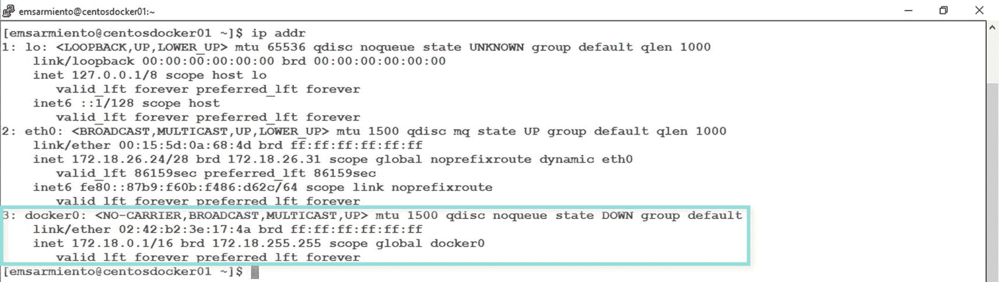
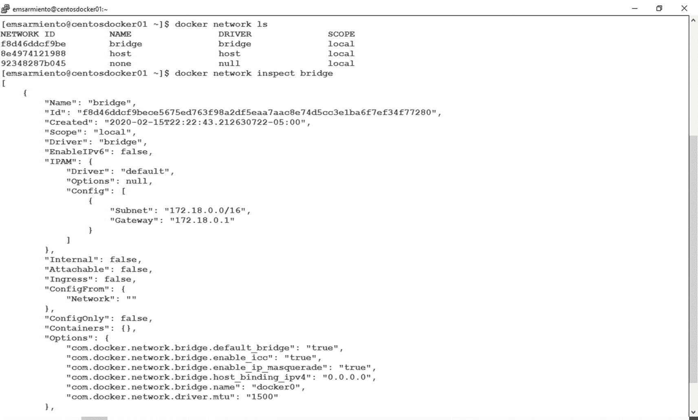
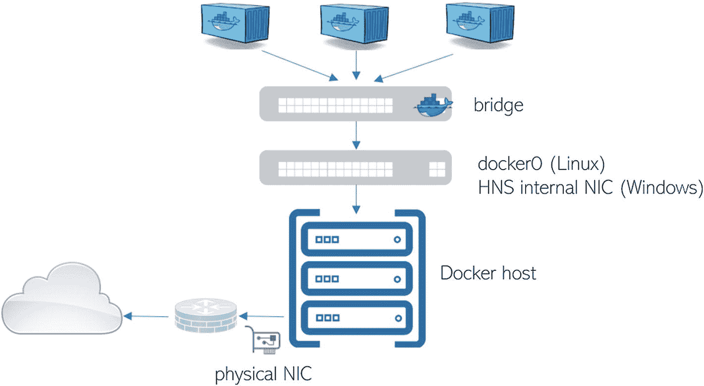
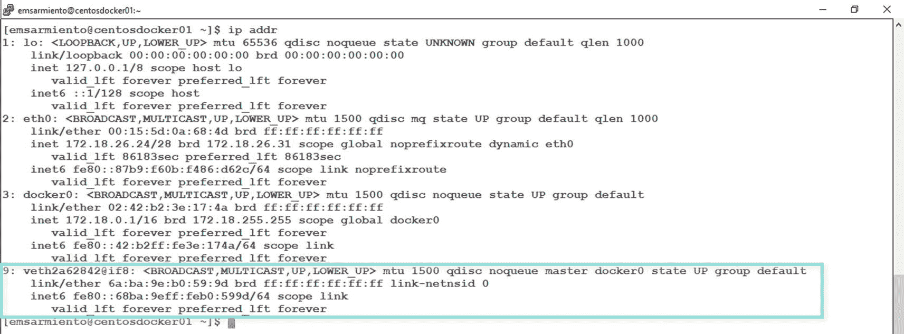
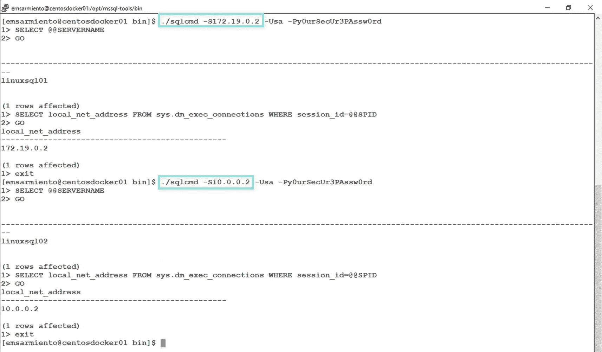
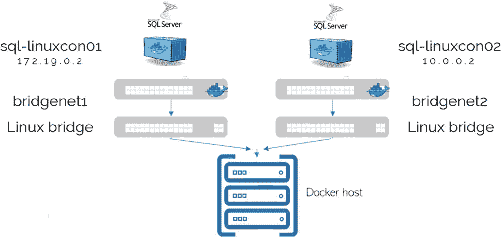
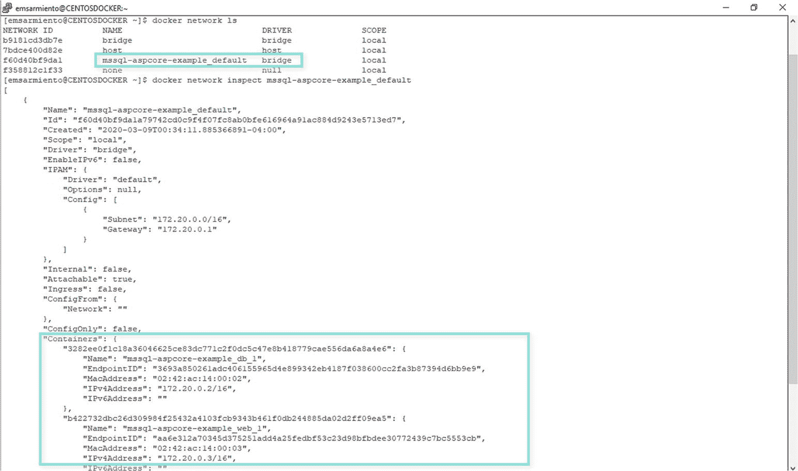
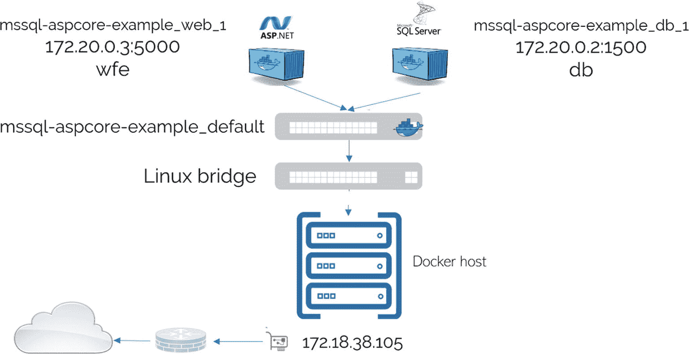

# 十一、SQL Server 数据库管理员 Docker 网络指南

> *任何事情的专家都曾经是初学者。*
> 
> —未知

说到社交活动，我们 IT 专业人士并不擅长。我们宁愿把时间花在修理办公桌和解决技术问题上，也不愿意在交谈中寻找合适的话语来填补沉默。但是社交活动，特别是职业活动，提供了一个个人和职业成长的机会，与志同道合的人联系。

我记得 2007 年在科罗拉多州丹佛市参加了我的第一次 PASS 峰会。这是我在北美的第一场职业赛事，我真的不知道会发生什么。我知道我有一个演示要做，所以我需要知道谁是活动的组织者，以及我的会议所需的后勤工作。除了懂 T-SQL 语言之外，至少我知道如何说英语，以找到自己的路，而不是那种社交上笨拙的亚洲人——直到我在活动中被介绍给几个 SQL Server MVPs。那是我冒险的开始。MVP 让我感觉像家人一样，非常照顾我，并给我介绍了有助于我个人和职业发展的机会。与 SQL Server 专家 Aaron Bertrand 的一场撞球游戏建立了我是好人之一的形象，因为据他说，我让他赢了(并非所有来自菲律宾的人都是游戏高手)。在一次谈话中，我被介绍给了 MSSQLTips.com 的创始人。我的一个朋友把我介绍给了 Dandy Weyn，他是微软的一个项目经理，直到今天，他还为我提供咨询机会。在与 SQL Server 专家 Adam k initic 的一次交谈中，我被介绍到了一家公司，这家公司帮助我在 2008 年搬到了加拿大。

联网确实会带来大量的机会。码头集装箱也是如此。本章向您介绍了容器网络的世界，目的是了解足够的细节来将容器上的 SQL Server 连接到其他服务和应用。由于本书中不涉及多主机部署，因此本文将仅限于单主机部署。在本章结束时，您并不期望替换您的网络工程师，但是您将了解他们所知道的一部分，足以在将您的 SQL Server inside containers 连接到世界其他地方时与他们进行智能对话。此外，即使提供了如此详细的信息，就网络极客而言，我们仍然处于非常高的水平。

## 码头桥

从第*章* [*第 4 章*](04.html) 开始，你就已经在使用 Docker 网络了，只是没有明确表示出来。事实上，您可以从远程机器访问容器中的 SQL Server 数据库，这就证明了它是可行的。*第* [*8*](08.html) 章让您先睹为快，Docker 在 Linux 上操纵 *iptables* ，使用 *docker run* 命令的 *-p* 参数允许流量进出容器的发布端口。*章* [*10*](10.html) 在你使用 Docker Compose 创建多容器 app 的时候，向你介绍了*桥*网。让我们探索一下使所有这些连接成为可能的 Docker 网络的更多组件。

Docker 的默认安装在名为 *docker0* 的主机上创建一个 Linux 桥接网络。我们从书的开头就开始使用这个桥接网络。在 Linux 中，桥接网络用于连接两个或更多的网段，很像网络交换机的工作方式。该桥接网络根据主机的 MAC 地址在与其相连的网络之间转发流量。在 Windows 上，对应的是*NAT*——网络地址转换——网络的缩写。你可以把桥梁网络想象成一个移民官员在连接两个不同国家的桥梁上工作。我将使用美国-加拿大边境作为一个例子来进一步说明，因为我经常开车往返于纽约州和安大略省之间，通过连接两国的桥梁。移民官员有责任允许车辆中的个人通过边境，查看护照上加盖的旅行签证(目的地的 MAC 地址)。如果个人没有适当的旅行签证，他们将不被允许通过。如果你熟悉虚拟化世界中的网络术语，可以把桥接网络想象成一个*虚拟交换机*或虚拟交换机。在 Windows 上， *docker0* 的实现是一个利用 Windows 主机网络服务(HNS)的 Hyper-V 虚拟交换机。

在 *docker0* 桥的顶部是一个网络驱动程序的实现，可以根据 docker 主机的操作系统进行定制，就像设备驱动程序的工作方式一样。这就是 Docker 与主机操作系统通信以实现允许容器连接到网络的联网功能的方式。还记得在*章节* [*8*](08.html) 中，Linux 上的 *iptables* 是如何更新的，以允许流量进出正在运行的容器？这是网络驱动程序通过 docker 命令与 *docker0* 桥对话。Docker 上实现的驱动类型描述了用于使其工作的网络驱动。我们将只关注*桥*网络，因为我们只涉及单主机部署。而且默认 Docker 桥接网络的名字也叫*桥*有多方便？

*桥*网络获得一个私有 IP 地址和一个与之相关的子网。分配给*网桥*网络的子网被选为以下列表中的第一个无冲突子网: *172。[17-31].42.1/16* ， *10。[0-255].42.1/16* ， *192.168。[42-44].1/24* 。您可以通过在 Linux 上运行 *ip addr* 命令或在 Windows 上运行 *ipconfig* 来检查这一点。图 [11-1](#Fig1) 显示了我的 CentOS Linux Docker 主机上的 *docker0* 桥的细节。请记住，这映射到 Docker *桥*网络。



图 11-1

docker0 网桥显示为 CentOS Linux 主机上的网络接口

所有连接到这个*桥*网络的容器将在与之相关的网络中获得一个 IP 地址。在我的 Linux Docker 主机中，每个容器在 *172.18.0.0/16* 网络中都有一个 IP 地址。默认情况下，所有容器都启用了网络，允许它们与其他容器或其他外部服务(包括互联网)建立传出连接。无需在 *docker run* 命令中指定 *-网络*参数，它会自动将容器连接到 *docker0* 桥。因为我们没有真正创建任何其他桥接网络，也没有在我们使用的任何 *docker run* 命令中添加 *- network* 参数，所以*桥接*网络使所有联网成为可能，将连接到它的容器连接到连接到外部网络的主机和服务。另外，请注意*状态下降*值。这意味着没有运行的容器连接到它。如果连接有运行中的容器，则状态将变为*上升*。

正如我提到的，Docker 提供网络驱动作为默认安装的一部分，其中*桥*驱动映射到 *docker0* 桥。您可以使用`docker network ls`命令显示可用的 Docker 网络。要检查名为*桥*的网络，您可以运行`docker network inspect bridge`命令。图 [11-2](#Fig2) 显示了默认 Docker 安装附带的默认网络以及名为*网桥*的网络的详细信息。



图 11-2

可用的默认 Docker 网络和名为 bridge 的网络的详细信息

Note

Docker networking 有自己的子命令-*Docker network*-用于管理 Docker 网络。这允许您创建、检查、列出、删除、连接和断开网络。我们将在本章中使用几个这样的子命令来说明它们的用法。docker 文档中有一个完整的 Docker 网络命令列表: [`https://docs.docker.com/engine/reference/commandline/network/`](https://docs.docker.com/engine/reference/commandline/network/) 。

看看*选项*下的*com . docker . network . bridge . name*值。我肯定你现在能认出这个名字。另外，如果你查看*容器*选项，它目前是空的。只有当容器运行时，它才会被附加到它的容器的名称填充。

## 虚拟网络适配器

默认情况下，每当一个容器启动时，Docker 都会创建一对虚拟网络适配器，其中一端通过*桥*网络连接到主机系统，另一端连接到正在运行的容器。图 [11-3](#Fig3) 显示了运行容器的高级网络图，利用默认的*桥*网络连接到 *docker0* (或 Windows 上的 HNS 内部 NIC)桥。



图 11-3

连接到物理网络的运行容器的网络图

Tip

没有什么可以阻止您创建一个具有多个网络接口的容器，就像您创建物理或虚拟机一样。如果要将容器配置为连接到两个或更多网络的多宿主主机，这很有用。我们将保持简单，只使用一个网络接口。毕竟，读完这一章后，你不会换掉你的网络工程师。

让我们研究一下启动容器后 Docker 主机上的网络接口列表。图 [11-4](#Fig4) 显示了一个名为 *veth2a62842@if8* 的新虚拟网络接口，它连接到我的 Linux Docker 主机中的一个运行容器。显然，这个名字在你的 Docker 主机上会有所不同。在 Docker 主机上创建的虚拟网络接口的数量将取决于当前运行的容器的数量。此外，如果您停止并重新启动同一个容器，该名称也会改变。随着运行中的集装箱连接到*码头 0* 桥，该值现在变为*状态上升*。



图 11-4

与正在运行的容器相关联的 Docker 主机上新创建的虚拟网络接口

查看网络图，连接到*桥*网络的运行容器现在可以连接到与其相连的其他容器，以及 Docker 主机*之外可用的服务和应用。*

## 使用和公开端口:通过容器在 Linux 上运行多个 SQL Server 实例

从本书的前几章开始，我们就一直在使用 *docker run* 命令的 *-p* 参数。在*章节* [*10*](10.html) 中，我们也讲述了*docker file*中 *EXPOSE* 指令的用途。从容器外部或从 Docker 主机本地访问容器内部的应用的方法是使用 *docker run* 命令的 *-p* 参数，该参数将容器的端口号映射到主机的端口号。如果我们不这样做，容器将只能被连接到同一个 Docker 网络的其他容器访问——*桥*网络。想一想。默认情况下，我们在整本书中创建的每个 SQL Server 容器都连接到*桥*网络。在我们创建多容器应用之前，我们只创建了单个容器。如果我们没有为我们使用的每个 *docker run* 命令提供 *-p* 参数，我们的 SQL Server 实例将完全被隔离——毫无用处。容器可能一直在监听端口 1433，但是如果该端口没有在 Docker 主机上发布，我们就没有办法远程访问它。尽管从安全的角度来看，它是最安全的 SQL Server 实例。你只是不能使用它。

端口映射是将容器发布到外部网络上的其他服务和应用的好方法。然而，你会看到很多文章和博客文章告诉你不要做端口映射，因为它是不可伸缩的。一旦主机上的端口已经映射到容器，它将不再对其他容器可用。虽然您有 1024 到 65535 之间的端口号，但是如果您想连接到远程容器，而不是仅仅利用默认值，您必须显式地定义端口号。一个例子是当你在一个容器中运行一个 web 应用时。端口 80 和 443 分别是通过 HTTP 或 HTTPS 连接到 web 应用的默认端口号。如果您在一台 Docker 主机上运行多个 web app 容器，您需要将其他容器映射到不同的非标准端口号。而像我这样的普通人，可能会也可能不会意识到那些不标准的端口号。

SQL Server 也是如此。使用 SQL Server 的人知道他们可以通过端口 1433 访问它。应用连接字符串使用默认端口号，因此很少看到显式定义端口号的连接字符串。但是，使用 SQL Server 的人员知道命名实例以及它们如何利用非标准端口号，这也是事实。事实上，虽然 Microsoft 不支持在 Linux 上运行多个 SQL Server 实例，但解决这一限制的方法是在 Docker 主机上运行多个 SQL Server 容器，将每个容器映射到不同的端口号。以下是在同一台 Linux Docker 主机上运行两个 SQL Server 容器的示例，其中一个使用默认端口 1433，而另一个使用端口 5000。我强调了使用 *-p* 参数来说明这一点。

```
docker run -e 'ACCEPT_EULA=Y' -e 'SA_PASSWORD=y0urSecUr3PAssw0rd' -p 1433:1433 --name sql-linuxcon01 -d -h linuxsql01 mcr.microsoft.com/mssql/server:2017-latest
docker run -e 'ACCEPT_EULA=Y' -e 'SA_PASSWORD=y0urSecUr3PAssw0rd' -p 5000:1433 --name sql-linuxcon02 -d -h linuxsql02 mcr.microsoft.com/mssql/server:2017-latest

```

对于使用 SQL Server 的人来说，这很正常。通过利用命名实例，我们可以在同一台主机上运行任意数量的 SQL Server 实例(从技术上讲，最多支持 50 个)。事实上，这就是许多客户在虚拟化之前降低许可成本的方式。使在单个主机上运行多个 SQL Server 实例成为可能的相同概念是我们如何在 Linux 主机上运行多个 SQL Server 实例——通过容器和端口映射。更好的是，您不再受限于同一主机上最多 50 个 SQL Server 实例。Docker 主机上有多少端口和资源可用，您就可以运行多少端口和资源。

## 在多个容器上使用同一个端口

在同一 Docker 主机上运行的多个容器上利用默认 SQL Server 端口号的另一种方法是为每个容器创建不同的 Docker 网络。由于每个 Docker 网络都有自己的 IP 地址范围和子网，每个容器都可以分配一个唯一的 IP 地址，允许所有容器使用端口 1433。请记住，TCP 或 UDP 端口是 IP 地址和端口号的唯一组合。如果我们为不同的主机分配不同的 IP 地址，我们可以为不同的主机(或者在这种情况下，为不同的容器)重用相同的端口号。以下是使用 *bridge* 驱动程序创建用户定义的 Docker 网络并从该用户定义的网络向容器分配特定 IP 地址的示例:

```
#Step 1: Create a user-defined network named bridgenet1
docker network create -d bridge --subnet 172.19.0.1/24 bridgenet1

#Step 2: Run a container and attach it to bridgenet1
docker run --network bridgenet1 -e 'ACCEPT_EULA=Y' -e 'SA_PASSWORD=y0urSecUr3PAssw0rd' --ip="172.19.0.2" --name sql-linuxcon01 -d -h linuxsql01 mcr.microsoft.com/mssql/server:2017-latest

#Step 3: Create a user-defined network named bridgenet2
docker network create -d bridge --subnet 10.0.0.1/16 bridgenet2

#Step 4: Run a container and attach it to bridgenet2
docker run --network bridgenet2 -e 'ACCEPT_EULA=Y' -e 'SA_PASSWORD=y0urSecUr3PAssw0rd' --ip="10.0.0.2" --name sql-linuxcon02 -d -h linuxsql02 mcr.microsoft.com/mssql/server:2017-latest

```

让我们研究一下示例代码，了解它在做什么。在*步骤 1* 中，我们使用 *-d* 参数创建一个名为 *bridgenet1* 的 Docker 网络，并使用 *bridge* 驱动程序对其进行定义。 *-子网*参数定义了 IP 地址范围和子网掩码–*172 . 19 . 0 . 1/24*。任何连接到此网络的容器都将有一个在此特定范围内的 IP 地址。在*步骤 2* 中，我们在 Linux 容器上创建并运行一个新的 SQL Server。注意使用了 *-网络*和 *- ip* 参数，而不是通常的 *-p* 参数。这里，我们告诉 Docker 将这个容器连接到 *bridgenet1* 网络，并为其分配一个 *172.19.0.2* IP 地址，而不是依靠 *bridge* 网络来分配 IP 地址(Docker 守护程序实际上充当了 DHCP 服务器的角色，为连接到 *bridge* 网络的容器提供 IP 地址)。我们在步骤 3 和 4 中做同样的事情。图 [11-5](#Fig5) 显示了创建用户定义的 Docker 网络并将容器附加到其上后 Docker 主机的 TCP/IP 属性。


图 11-5

创建用户定义的网络并为其附加容器后，Docker 主机的 TCP/IP 设置

请注意以下事项:

*   *码头 0* 桥*状态为 DOWN* 状态，因为没有运行中的集装箱连接到其上。

*   创建了两个名为 *br-a65abe44e690* 和 *br-944424a1e3a4* 的新 Linux 桥。这些分别对应于*桥网 1* 和*桥网 2* 。同样，您的 Docker 主机上的名称会有所不同。

*   以同样的方式，创建了两个名为 *veth41f58c2@if59* 和 *veth478416d@if62* 的新虚拟网络适配器。回想一下，每当启动一个容器时，Docker 都会创建一对虚拟网络适配器，其中一端通过桥接网络连接到主机系统，另一端连接到正在运行的容器。这些虚拟网络适配器分别对应于连接到*桥网 1* 和*桥网 2* 的容器。

您可以通过经由各自的 IP 地址连接到容器上相应的 SQL Server 实例来测试这一点，如图 [11-6](#Fig6) 所示。



图 11-6

使用不同的 IP 地址连接到同一 Docker 主机上的容器上的 SQL Server

Note

请记住，虽然容器可以通过它们的 IP 地址访问，但是您只能从 Docker 主机连接到它们。这是因为只有 Docker 主机知道这些新的 IP 地址。为了远程访问它们，您需要配置一个从网络上的客户机到 Docker 主机的正确路由。请咨询您的网络管理员，了解如何正确配置以远程访问这些容器。

这是互联网服务提供商在互联网早期使用的一种非常古老的伎俩，在互联网早期，web 服务器托管数百个或更多网站，每个网站都有自己的域名和 IP 地址。将多个 IP 地址分配给一台 web 服务器比建立数百台 web 服务器更划算。SQL Server 对命名实例采用了这种技巧，要么在单个数据库服务器上附加多个网络适配器，要么为单个网络适配器分配多个 IP 地址。这使得使用端口 1433 连接到同一主机上的多个 SQL Server 命名实例成为可能—相同的概念，不同的实现。但是，我不推荐这样做，除非你对 TCP/IP 有很好的基础，或者你的系统管理员有这方面的经验。对于这种复杂的实现，排除网络连接故障可能是一件痛苦的事情。

## 集装箱内通信

*码头 0* 桥是码头*桥*网络的一个例子。虽然我们已经介绍了一点什么是*桥*网络以及它们能做什么，但是*桥有点特别。让我们看看是什么使得使用*桥*网络的容器内通信成为可能。*

将容器连接到一个*桥*网络允许它们利用 Docker 主机上的网络功能。就像任何网络交换机一样，连接到桥接网络的容器可以相互通信。然而，它们与连接到其他桥接网络的其他容器完全隔离。图 [11-7](#Fig7) 显示了我们在上一节中创建的用户自定义桥接网络的网络图。



图 11-7

上一节中创建的用户定义的桥接网络的网络图

因为它们在两个隔离的网络上， *sql-linuxcon01* 无法与 *sql-linuxcon02* 通信，反之亦然。根据您的网络管理员如何设计网络，他们实现网络分段的原因有很多，安全隔离是最常见的原因之一，合规性和服务质量(QoS)仅举几例。在不同的用户定义的桥接网络上部署容器也是如此。与您的网络管理员讨论您的网络设计。这是一个很好的机会来了解为什么您的网络是这样设计的。但是，无论网络设计是简单还是复杂，服务和应用都需要相互交流。这就是网络路由和 DNS 等其他网络服务的用武之地。

假设我们使用默认的桥接网络 *docker0* 创建了两个容器。我确实提到过 *docker0* 桥有点特殊，因为虽然连接到它的容器可以相互通信，但它们只能通过 IP 地址而不是主机名相互通信。相反，连接到用户定义的桥接网络的容器可以利用内置的 DNS 服务，允许它们使用 IP 地址、主机名或别名相互通信。回想一下*第* [*第 10*](10.html) 章“Docker 撰写和 YAML 文件”一节中提供的示例。以下 YAML 文件描述了组成多容器应用所需的两个容器的一些网络组件:

```
version: "3"
services:
    wfe:
        build: ./mssql-aspcore-example-app
        ports:
            - "5000:5000"
        depends_on:
            - db
    db:
        build: ./mssql-aspcore-example-db
        environment:
            SA_PASSWORD: "mySecUr3PAssw0rd"
            ACCEPT_EULA: "Y"
            - "1500:1433"

```

有两个服务组成了多容器应用——*wfe*服务和 *db* 服务。如果您研究 ASP.NET 核心应用的 *appsettings.json* 文件，数据库连接字符串指定数据库服务器。为了强调，我突出显示了数据库服务器名称:

```
  "ConnectionStrings": {
    "BelgradeDemo": "Server=db;Database=ProductCatalog;User ID=WebLogin; password=SQLPass1234!"
  }

```

那么，ASP.NET 核心应用如何知道 Linux 容器上的 SQL Server 是它需要连接的数据库服务器呢？当您运行 Docker Compose 来构建多容器应用时，Docker 做的第一件事是创建一个名为*<project name>_ default*的用户定义的桥接网络。由于项目名称为 *mssql-aspcore-example* ，用户自定义的桥接网络命名为*MSSQL-aspcore-example _ default*。图 [11-8](#Fig8) 显示了作为多容器应用的一部分创建的用户定义的桥接网络。它还显示了两个容器——*wfe*的*MSSQL-aspcore example _ wfe _ 1*和*db*的*MSSQL-aspcore-example _ db _ 1*——连接到桥接网络，并带有相应的 IP 地址。目前为止，一切顺利。**



图 11-8

作为多容器应用的一部分创建的用户定义的桥接网络

但是我们仍然没有回答这个问题，*ASP.NET 核心应用如何知道 Linux 容器上的 SQL Server 是它需要连接的数据库服务器？*因为两个容器连接到同一个用户定义的桥接网络， *wfe* 容器能够通过 YAML 文件中定义的服务名访问 *db* 容器。用户定义的桥接网络提供 DNS 名称或别名解析，在这种情况下，为 YAML 文件中定义的服务提供别名。因为容器是使用 Docker Compose 创建的，所以没有提供主机名，这与我们使用 *docker run* 命令并传递 *-h* 参数时不同。Docker 将分配容器 ID 作为容器的主机名。但是，如果为服务定义了别名，并且两个容器都连接到同一个用户定义的桥接网络，那么它们就可以使用 DNS 名称或别名解析相互通信。如果您决定将 YAML 文件中的服务名从 *db* 更改为 *dbserver* ，您还需要修改 *appsettings.json* 文件中的连接字符串值。

## 把这一切放在一起

使用我们在第*章* [*第 10 章*](10.html) 中构建的多容器应用，让我们探索不同的组件如何协同工作以理解 Docker 网络堆栈，合并我们在本书中涵盖的所有内容。图 [11-9](#Fig9) 显示了多容器 app 的网络图。



图 11-9

多容器应用的网络图

因为容器运行在单个对接主机上

*   两个容器都连接到*MSSQL-aspcore-example _ default*用户定义的网桥，并将在子网 *172.20.0.0/16* 中分配一个 IP 地址，如图 [11-8](#Fig8) 所示。IP 地址范围将取决于分配给用户定义的桥接网络的内容。

*   使用 Docker 主机的 IP 地址及其相应的端口，可以远程访问这两个容器。 *wfe* 可以通过*http://172 . 18 . 38 . 105:5000*从任何浏览器访问，而 *db* 可以通过 *172.18.38.105:1500* 使用您最喜欢的 SQL Server 工具——SSMS、Azure Data Studio、sqlcmd、Visual Studio 等等访问。即使不修改默认的 Linux 防火墙规则，这也是可能的，因为 Docker 守护进程会在幕后修改 *iptables* 。回想一下第*章* [*8*](08.html) 中的“关于 Linux 防火墙和 Docker 的说明”一节。

*   *MSSQL-aspcore-example _ default*用户定义的网桥为从外部网络进入容器的流量提供网络地址转换(NAT)。这允许多个容器通过单个 IP 地址(Docker 主机的 IP 地址)访问外部网络，反之亦然。对*http://172 . 18 . 38 . 105:5000*上 *wfe* 的浏览器请求将被重定向到端口*5000*–*http://172 . 20 . 0 . 3:5000*上 *wfe* 的内部 IP。同样，对 *172.18.38.105:1500* 上 *db* 的数据库请求将被重定向到端口*1433*–*172 . 20 . 0 . 2:1433*上 *db* 的内部 IP。

*   因为它们连接到用户定义的桥，所以容器可以使用 IP 地址、主机名或别名相互通信。因此，数据库连接字符串只需引用服务(或别名)名称即可。如果它们连接到默认的 *docker0* 桥，它们只能使用它们的 IP 地址进行通信，这可能导致数据库调用失败。

*   当端口被发布并映射到 Docker 主机时，两个容器都可以被远程访问。您可以通过删除端口映射来限制对 *db* 容器的远程访问。如果这样做，您仍然可以从 *wfe* 容器或 Docker 主机访问 *db* 容器。

*   在你结束网络管理员的工作之前，我们需要就此打住。

由于容器的 IP 地址没有明确定义，您可以通过使用如下所示的 *docker inspect* 命令检索它们的 IP 地址，传递容器名称或 ID 值:

```
docker inspect <container name | ID> | grep IPAddress

```

但是您不会想要为所有正在运行的容器手动这样做。以下命令将显示所有正在运行的容器及其相应的 IP 地址:

```
docker inspect --format='{{.Name}} {{range .NetworkSettings.Networks}}{{.IPAddress}}{{end}}' $(docker ps -q)

```

请记住，这仅涉及单主机网络。要了解更多关于 Docker 可以使用的其他类型的网络驱动程序，请查看 [`https://docs.docker.com/network/`](https://docs.docker.com/network/) 上的 Docker 网络概述。

## 摘要

当我准备这本书的大纲时，这一章甚至还没有写在初稿上。直到我想起处理任何与云相关的网络堆栈是多么具有挑战性。我清楚地记得，我浪费了几个小时对在 AWS 和 Microsoft Azure 上部署 SQL Server 的问题进行故障排除，却发现问题与 SQL Server 无关，而是网络。无论您使用的是公共云还是私有云，了解网络堆栈的基础知识在今天都更加重要，尤其是当您处理所谓的网络即服务提供的所有抽象概念时。因此，我介绍了单主机部署的 Docker 网络基础知识。本章介绍了 Docker 如何利用 Linux bridge 来实现其网络功能，如何通过端口映射将容器暴露给外部网络，以及如何通过容器在一台 Linux 机器上运行多个 SQL Server on Linux 实例，即使 Microsoft 文档明确指出您不能这样做。事实是，TCP/IP 和网络的基本原理保持不变。只有它们的实现发生了变化。因此，下次你在 Docker、VMWare、Microsoft Azure 或 AWS 等云平台上面临网络问题时，请回到基础上来。你会很高兴你学会了基本原则。