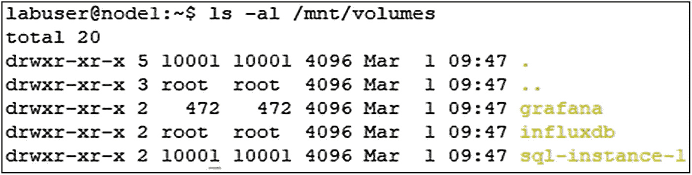

# 1.入门指南

欢迎来到 Kubernetes 上的 *SQL Server！本章介绍了执行本书中的实验所需的实验体系结构和技术要求。第一组实验基于在 Docker 主机上的容器中部署 SQL Server。然后，我们将继续将 SQL Server 和其他应用部署到 Kubernetes 集群中，我们将在本书的后面部分帮助您构建这个集群。*

## 安装 Docker

在第 2 章[中](02.html)，我们将介绍容器以及将 SQL Server 部署为容器。要执行该章中的实验，您需要在计算机上安装 Docker 和`sqlcmd`实用程序。如果您喜欢使用另一个基于命令行的 SQL 客户端，比如`mssql-cli`，那也没问题。然而，为了简单起见，我们在演示中将坚持使用`sqlcmd`。

Docker 可用于 Windows、MacOS 和 Linux 平台，每种平台都有独特的安装方法。虽然您可以在这些平台中的任何一个上安装 Docker，并且第 [2](02.html) 章的演示将会起作用，但是我们将在本课程中建议创建一个虚拟机(VM ),它具有两个 vCPUs、8GB 内存和 150GB 磁盘空间，并安装 Ubuntu 18.04 作为基本操作系统。

以下是 Docker 在不同平台上的安装说明链接。请查看在这些平台上安装 Docker 的安装要求。如果您想复制第 [2](02.html) 章中的演示，您需要首先准备好这个环境:

*   **Docker 桌面 Windows 版:** [`https://docs.docker.com/docker-for-windows/install/`](https://docs.docker.com/docker-for-windows/install/)

*   **MAC 坞站桌面:** [`https://docs.docker.com/docker-for-mac/install/`](https://docs.docker.com/docker-for-mac/install/)

*   **Docker 引擎-社区(Ubuntu):** [`https://docs.docker.com/install/linux/docker-ce/ubuntu/`](https://docs.docker.com/install/linux/docker-ce/ubuntu/)

在继续之前，请确保您可以在您的环境中成功运行容器。在命令行执行清单 [1-1](#PC1) 。

```
docker run hello-world

Listing 1-1Running your first Docker container

```

如果容器运行成功，您将看到清单 [1-2](#PC2) 中所示的输出。

```
Unable to find image 'hello-world:latest' locally
latest: Pulling from library/hello-world
1b930d010525: Pull complete
Digest: sha256:9572f7cdcee8591948c2963463447a53466950b3fc15a247fcad1917ca215a2f
Status: Downloaded newer image for hello-world:latest

Hello from Docker!
This message shows that your installation appears to be working correctly.

To generate this message, Docker took the following steps:
 1\. The Docker client contacted the Docker daemon.
 2\. The Docker daemon pulled the "hello-world" image from the Docker Hub.
    (amd64)
 3\. The Docker daemon created a new container from that image which runs the
    executable that produces the output you are currently reading.
 4\. The Docker daemon streamed that output to the Docker client, which sent it to your terminal.

To try something more ambitious, you can run an Ubuntu container with:
 $ docker run -it ubuntu bash

Share images, automate workflows, and more with a free Docker ID:
 https://hub.docker.com/

For more examples and ideas, visit:
 https://docs.docker.com/get-started/

Listing 1-2Output of your first Docker container

```

除了 Docker，第 [2 章](02.html)演示还需要`sqlcmd`实用程序。您可以从以下位置下载它:

*   **SQL Server 命令行实用工具:** [`https://docs.microsoft.com/en-us/sql/tools/sqlcmd-utility`](https://docs.microsoft.com/en-us/sql/tools/sqlcmd-utility)

## 基于虚拟机的 Kubernetes 集群要求

随着我们进入本书的 Kubernetes 章节，我们将在第 [4](04.html) 章一起构建一个 Kubernetes 集群。为此，我们需要一些计算和存储资源。对于我们的实验室，我们将使用一组五个 Linux 虚拟机。我们实验室中的每台虚拟机都需要两个 vCPUs、2GB 内存和 150GB 磁盘空间，运行 Ubuntu Server 16.04+作为操作系统。我们已经在 Ubuntu 16.04 和 Ubuntu 18.04 上测试了本书中的代码。Kubernetes 在多种操作系统上受支持。查看 [`https://kubernetes.io/docs/ setup/production-environment/tools/kubeadm/install-kubeadm/`](https://kubernetes.io/docs/setup/production-environment/tools/kubeadm/install-kubeadm/) 了解更多详情。

### 在 Azure 中运行虚拟机

如果你没有支持运行这些虚拟机的系统，另一个选择是在 Azure 中设置它们。我们已经为您提供了一个脚本，它将为您设置整个环境。这将需要一个有效的 Azure 订阅以及 *Azure CLI(命令行界面)*。你可以从 [`https://docs.microsoft.com/en-us/cli/azure/`](https://docs.microsoft.com/en-us/cli/azure/) *，*下载 *Azure CLI* ，我们还将在“安装工具”一节中向你展示从命令行安装它的简单方法如果您没有 Azure 订阅，您可以在 [`https://azure.microsoft.com/en-us/free/`](https://azure.microsoft.com/en-us/free/) *注册一个试用帐户。*这将为您提供 200 美元的信用点数，供您在 30 天内使用任何 Azure 服务。

在我们可以通过 Azure CLI 与 Azure 交互之前，我们需要登录，这是通过清单 [1-3](#PC3) 中所示的命令进行的。

```
az login

Listing 1-3Login script to your Azure account using the Azure CLI

```

这将在 Windows 和 Mac 上打开一个 web 浏览器，或者指向 Linux 上的一个 URL 以确认您的凭证。

如果你可以访问多个 Azure 订阅，请使用清单 [1-4](#PC4) 中的命令确保你使用的是正确的。如果系统提示您安装 Azure CLI 的任何扩展，请安装。

```
az account set -s <YourSubscription>

Listing 1-4Set the Azure CLI’s active subscription

```

现在您可以运行清单 [1-5](#PC5) 中的脚本，这将创建一个资源组、一个虚拟网络、允许来自任何 IP 地址的入站 RDP 和 SSH 连接的网络安全规则，以及前面部分描述的虚拟机。这还将生成公共 DNS 条目，这些条目本质上必须是唯一的，因此请根据您的要求修改脚本中的以下变量:

*   用户名

*   PW(要使用的密码)

*   区域(将创建所有资源的 Azure 区域)

*   dnsPrefix(前缀被添加到所有公共 DNS 名称)

*   RG(资源组名)

Note

不建议从任何公共 IP 地址访问您的计算机，因此不要在此实验环境中使用任何敏感数据。 *dnsPrefix* 必须是全球唯一的，所以将其改为包含您姓名首字母和/或随机数的名称。

```
# Modify these variables as needed
$Region="EastUS"
$RG="KubernetesLabs"
$Username="labuser"
$PW="Str@ngPassw0rd"
$dnsPrefix="k8slab"
$VMSize="Standard_B2s"
$Linux_Image="Canonical:UbuntuServer:18.04-LTS:latest"
$Windows_Image="Win2016datacenter"

#Define machines
$machines = ConvertFrom-Csv @'
Hostname,IP,OS
storage,172.16.94.5,Linux
control,172.16.94.10,Linux
node1,172.16.94.11,Linux
node2,172.16.94.12,Linux
node3,172.16.94.13,Linux
workstation,172.16.94.100,Windows
'@

# Create RG
az group create -l $Region -n $RG

# Create VNET and NSG
az network vnet create --name LABVnet --resource-group $RG --address-prefixes 172.16.94.0/24

az network vnet subnet create --name LabSubnet --address-prefixes 172.16.94.0/24 `
    --resource-group $RG --vnet-name LABVnet

az network nsg create --name LABNSG --resource-group $RG

az network nsg rule create --name SSH --nsg-name LABNSG --priority 1000 `
    --resource-group $RG --destination-port-ranges 22 --access "Allow" `
    --protocol TCP --direction Inbound

az network nsg rule create --name RDP --nsg-name LABNSG --priority 1001 `
    --resource-group $RG --destination-port-ranges 3389 --access "Allow" `
    --protocol TCP --direction Inbound

#Create VMs
foreach($vm in $machines) {
$hostname=$vm.Hostname
$DNSName="$dnsPrefix-$hostname"
$image=$Windows_Image
if ($vm.OS -eq "Linux") { $image=$Linux_Image }
az network public-ip create --name PIP-$hostname --resource-group $RG ​--dns-name $DNSName

az network nic create --name NIC-$hostname --resource-group $RG --subnet LabSubnet `
    --vnet-name LABVnet --private-ip-address $vm.IP --public-ip-address PIP-$hostname

az vm create --name $hostname --resource-group $RG --nics NIC-$hostname ​--os-disk-size-gb 150 `
    --os-disk-name Disk-$hostname --image $image --authentication-type password `
    --admin-username $Username --admin-password $PW --size $VMSize
}

Listing 1-5PowerShell script to create a lab environment using Azure VMs

```

除了 Linux 虚拟机之外，该脚本还创建了一个 Windows 虚拟机，它可以用作管理工作站，如本章后面所述。

Note

当您不再需要这些资源时，请确保删除或停止并释放所有这些资源，以避免它们产生任何不必要的成本。

## 虚拟机网络配置

按照表 [1-1](#Tab1) 中的规定配置实验室虚拟机的 IP 地址。您可以在实验室中自由使用不同的 IP 地址，但在构建集群时，您需要在几个实验室中考虑这一点。如果您在上一节中选择了 Azure VM 方法，那么这些机器已经以这种方式设置好了。

表 1-1

虚拟机配置

   
| 

名字

 | 

ip 地址

 | 

功能

 |
| --- | --- | --- |
| 控制 | 172.16.94.10 | 控制平面节点 |
| 节点 1 | 172.16.94.11 | 工作节点 |
| 注 2 | 172.16.94.12 | 工作节点 |
| 注释 3 | 172.16.94.13 | 工作节点 |
| 仓库 | 172.16.94.5 | NFS 存储服务器 |
| 工作站(可选) | 172.16.94.100 | 管理工作站(Windows) |

接下来，里面有一句话，总是 DNS。因此，在我们的实验中，我们将在每个系统的`/etc/hosts`文件中添加主机条目，以确保我们能够通过名称寻址我们实验中的所有系统。在清单 [1-6](#PC6) 中，您会发现我们的`/etc/hosts`文件的内容。您的`hosts`文件可能包含本地主机和其他配置的条目。

```
172.16.94.5    storage
172.16.94.10   control
172.16.94.11   node1
172.16.94.12   node2
172.16.94.13   node3

Listing 1-6Required additional Linux hosts file contents

```

如果您不知道如何在 Linux 系统上手动编辑文件，您可以在每个 Linux 节点上运行清单 [1-7](#PC7) 中的脚本。

```
echo 172.16.94.5 storage > tmphosts
echo 172.16.94.10 control >> tmphosts
echo 172.16.94.11 node1 >> tmphosts
echo 172.16.94.12 node2 >> tmphosts
echo 172.16.94.13 node3 >> tmphosts
sudo -- sh -c "cat tmphosts >> /etc/hosts"

Listing 1-7Script to add entries to the Linux hosts file

```

在 Windows 机器上，您会在*C:\ Windows \ System32 \ drivers \ etc \ hosts 下找到该文件。*

Note

要在 Windows 上编辑 hosts 文件，请确保以管理员身份运行编辑器。

在继续之前，请确保您拥有对所有这些虚拟机的控制台或 SSH 访问权限(通过使用主机名)，并且它们能够通过您的网络相互连接。

## 蓝色忽必烈服务

我们的大部分演示将来自我们基于本地虚拟机的 Kubernetes 集群，但由于 Kubernetes 的云原生特性，本书中的一些实验将需要 Azure Kubernetes 服务(AKS)集群的服务，因此我们可以强调 Kubernetes 的某些功能。这也需要 Azure 订阅。我们将在第 [4](04.html) 章一起构建一个 AKS 集群。

如果你更喜欢使用另一个托管 Kubernetes 产品，如亚马逊 EKS，这也很好。然而，同样为了简单起见，我们将坚持这个例子。

## 安装工具

除了我们将要部署演示应用和 SQL Server 的集群之外，我们还需要一些工具来处理我们部署的应用和数据库。您可以在管理工作站上安装这些工具，并通过网络访问应用和数据库。如果是这样，您需要确保您拥有我们在集群节点上指定的`/etc/hosts`文件条目。出于实验目的，您可以考虑将它们安装在控制平面节点上。对于生产系统，这是不可取的。

我们需要

*   基本工具(curl、grep、wget、SSH 客户端)

*   库布特雷

*   蓝色 CLI

*   红色威龙

*   SQL Server 命令行实用程序，它提供了*sqlcmd*–[`https://docs.microsoft.com/en-us/sql/tools/sqlcmd-utility`](https://docs.microsoft.com/en-us/sql/tools/sqlcmd-utility)

### 使用 Linux 机器作为您的管理工作站

如果您喜欢使用您的一台 Linux 机器作为您的管理工作站，我们需要使用清单 [1-8](#PC8) 中的代码使 Microsoft repository 成为一个可信任的来源，并将 Microsoft repository 添加到软件包安装的已知来源列表中。

```
sudo apt-get update
sudo apt-get install gnupg ca-certificates curl wget software-properties-common apt-transport-https lsb-release -y
curl -sL https://packages.microsoft.com/keys/microsoft.asc |
gpg --dearmor |
sudo tee /etc/apt/trusted.gpg.d/microsoft.asc.gpg > /dev/null
curl https://packages.microsoft.com/keys/microsoft.asc | sudo apt-key add -
sudo add-apt-repository "$(wget -qO- https://packages.microsoft.com/config/ubuntu/18.04/prod.list)"
sudo apt-get update

Listing 1-8apt script for basic prerequisites

```

现在我们已经准备好使用清单 [1-9](#PC9) 中的代码安装 azdata、Azure 命令行接口和 *kubectl* 。

```
sudo apt-get install -y azdata-cli
sudo apt-get install -y azure-cli
sudo apt-get install -y kubectl
sudo apt-get install -y mssql-tools

Listing 1-9apt script for azdata, azure-cli, sqlcmd, and kubectl

```

就这样——你的 Ubuntu 机器已经为即将到来的实验做好了准备。

### 使用 Windows 机器作为您的管理工作站

我们中的许多人都是 Windows 用户，因此更喜欢从 Windows 客户端进行部署。虽然实验中的一些任务必须在 Linux 环境中运行，但许多任务也可以从 Windows 客户端执行。

如果你选择在 Azure 中运行你的虚拟机，建议你也把你的管理工作站放在那里，这样它就可以在同一个虚拟网络上无缝访问 Linux 机器。我们之前为此创建了一个名为 *workstation* 的 Windows 虚拟机。

#### Windows 用户的小帮手:Chocolatey

如果您喜欢使用 Windows 客户端作为管理工作站，我们也建议您使用软件包管理器来自动安装。

我们想提醒你注意巧克力或“巧克力”如果你没有听说过，choco 是一个免费的 Windows 包管理器，它允许我们在 PowerShell 或命令提示符下安装我们的许多先决条件。鉴于 Windows 服务器没有提供易于使用的内置软件包管理器，它只是让生活变得容易得多。你可以在 [`http://chocolatey.org`](http://chocolatey.org) 上找到更多信息，你甚至可以在那里创建一个账户并提供你自己的软件包。

从一个简单的用户角度来看，不需要创建帐户或下载任何安装程序。

要使 choco 在您的系统上可用，请在管理模式下打开一个 PowerShell 窗口，并运行清单 [1-10](#PC10) 中所示的脚本。

```
[Net.ServicePointManager]::SecurityProtocol = [Net.ServicePointManager]::SecurityProtocol -bor [Net.SecurityProtocolType]::Tls12
Set-ExecutionPolicy Bypass -Scope Process -Force; iex ((New-Object System.Net.WebClient).DownloadString('https://chocolatey.org/install.ps1'))

Listing 1-10Install script for Chocolatey in PowerShell

```

一旦相应的命令完成，choco 就安装好了，可以使用了。

#### Windows 上的工具

现在我们已经有了一个工作站，并且在上面安装了 choco，让我们从一些默认情况下 Linux 自带的小助手开始，但是默认情况下这些助手在 Windows 上是缺失的或者是受限的。通过运行清单 [1-11](#PC11) 中的代码，我们将安装 *curl* (用于与网站交互)、 *grep* (用于过滤命令行上的输出)和 *putty* (它还附带了 *pscp* ，这是一个允许我们从 Linux 机器上复制数据的工具，也可以充当我们的 SSH 客户端)。

我们还将安装 Chrome，因为我们将使用的一些仪表板不支持 Internet Explorer(默认情况下 Windows Server 自带的)。

```
choco install curl -y
choco install grep -y
choco install putty -y
choco install googlechrome -y

Listing 1-11Install script for recommended tools

```

接下来是 *kubernetes-cli* 、*SQL 命令行工具、*和 *Azure CLI* ，可以通过清单 [1-12](#PC12) 中的命令安装。

```
choco install kubernetes-cli -y
choco install sqlserver-cmdlineutils -y
choco install azure-cli -y

Listing 1-12Install script for kubectl, sqlcmd, and the Azure CLI

```

Note

这将安装最新版本的 Kubernetes CLI。对于本书中的例子，这很好，也是我们想要的。请注意，在使用旧的 Kubernetes 集群时，这可能会导致潜在的问题。

我们最后的要求是 *azdata* 。虽然它目前不能通过 choco 安装，但微软正在提供一个 permalink，使得它可以很容易地自动安装，如清单 [1-13](#PC13) 所示。

```
curl -o azdata.msi https://aka.ms/azdata-msi
msiexec /i azdata.msi /passive

Listing 1-13Install script for azdata

```

根据您要复制的实验，有些工具可能不需要。鉴于它们都相当轻量级，我们还是建议安装它们。

## 网络文件系统

因为我们希望我们的存储节点充当 NFS 服务器，所以我们也需要安装它。为了便于使用，我们选择了单节点 NFS。生产集群应该使用企业级存储。

在*存储*节点中打开一个 SSH 会话，并将清单 [1-14](#PC14) 的内容保存到一个名为 enable-nfs.sh 的文件中

```
#!/bin/bash
apt install -y nfs-kernel-server
groupadd mssql -g 10001
useradd -u 10001 mssql -g mssql
addgroup --gid 472 grafana
useradd -g 472 -u 472 grafana

mkdir -p /srv/exports/volumes/
chown -R mssql:mssql /srv/exports/volumes/
echo '/srv/exports 172.16.94.0/24(rw,sync,no_subtree_check,no_root_squash)' > exports
chmod 644 exports
mv exports /etc/exports
exportfs -a
systemctl restart nfs-kernel-server

mkdir /srv/exports/volumes/sql-instance-1
chown -R mssql:mssql /srv/exports/volumes/

mkdir /srv/exports/volumes/influxdb
mkdir /srv/exports/volumes/grafana
chown 472:472 /srv/exports/volumes/grafana

mkdir /srv/exports/volumes/webcontent
echo "Hello World!!!" >  /srv/exports/volumes/webcontent/index.html

Listing 1-14enable-nfs.sh

```

该脚本将安装 NFS 服务器，为其内容创建一个目录(以及我们稍后将在第一次 SQL Server 部署中使用的一些目录)，并启动服务。要运行这个脚本，您需要使它可执行，并以 root 用户身份运行它，如清单 [1-15](#PC15) 所示。

```
chmod +x enable-nfs.sh
sudo ./enable-nfs.sh

Listing 1-15Run enable-nfs.sh

```

您的 NFS 服务器现在已经准备就绪，可以访问了。

在其他机器上，使用清单 [1-16](#PC16) 中的命令安装 NFS 实用程序。这需要在每个其他虚拟机上单独执行。

```
sudo apt install -y nfs-common

Listing 1-16Install NFS utilities on NFS clients

```

通过使用清单 [1-17](#PC17) 中的代码挂载 NFS 共享并列出其内容，从任何客户端机器测试连接。

```
sudo mount -t nfs storage:/srv/exports /mnt
ls -al /mnt/volumes

Listing 1-17Verify NFS connection on NFS clients

```

清单 [1-17](#PC17) 的结果应该像我们在图 [1-1](#Fig1) 中看到的那样。



图 1-1

来自节点 1 的 NFS 测试

## 系统交换设置

作为我们的最后一步，让我们确保在控制平面和三个节点上禁用 swap，因为这是 kubelet 的要求。

打开一个单独的 SSH 连接并运行清单 [1-18](#PC18) 中的命令。

```
swapoff -a

Listing 1-18Disable swap

```

同时从 */etc/fstab* 中移除任何交换分区。如果你在 Azure 中使用我们的脚本创建了你的虚拟机，这不是必需的。

## 摘要

在这一章中，我们已经为我们将在整本书中一起执行的实验奠定了基础。我们将从在 Docker 中将 SQL Server 部署为一个容器开始。然后，我们将继续构建我们的 Kubernetes 集群，并在该集群中部署 SQL Server 和演示应用及数据库。除了集群之外，我们还强调了与我们将在集群中部署的应用和数据库进行交互所需的工具。