# 2.集装箱基础知识

容器正在改变应用程序的部署方式。在本章中，我们将从基于容器的应用程序部署的好处开始，并为容器基础知识打下坚实的技术基础，介绍创建和运行容器以及持久化数据等操作。本章将以对容器编排器的需求结束，并介绍 Kubernetes 及其优点。如果您以前从未见过容器，本章的目标是在使用 Kubernetes 进行容器编排之前精通容器基础知识。

## 基于容器的应用程序部署

一个*容器*是操作系统虚拟化的一种形式。多年来，数据库专业人员已经熟悉了机器虚拟化的概念，其中操作系统多路复用我们的物理服务器、CPU、内存和磁盘的硬件资源。在容器中，底层操作系统、其内核和资源被运行在该系统上的应用程序多路复用或共享。每个容器都认为自己是操作系统上唯一运行的进程。反过来，操作系统控制对底层硬件的正常访问。我们稍后将更详细地探讨这个隔离概念。负责与底层操作系统协调这项工作的软件被称为*容器运行时*。

容器是一个运行中的*容器图像。一个*容器映像包含运行我们的应用程序的二进制文件、库和文件系统组件。因此，当容器启动时，它将开始执行其中定义的可执行文件，然后访问操作系统的资源，例如创建附加进程和执行磁盘或网络 I/O 等。图 [2-1](#Fig1) 显示了容器与其应用程序之间的关系。

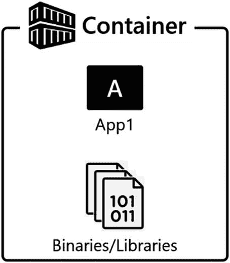

图 2-1

容器化的应用程序

按照惯例，一个容器中只有一个应用程序，因为应用程序是工作单元，也是我们的伸缩单元。当容器启动时，它将开始执行内部定义的应用程序。有些情况下，如果应用程序之间的关系非常紧密，可以将多个应用程序放入容器中，例如，应用服务器和指标数据收集器。

容器提供*隔离*。在容器内运行的进程看不到操作系统上运行的任何其他进程，甚至看不到在其他容器内运行的进程。这个概念是容器的可移植性和可用性以及容器成功的关键。

容器还可以将特定的库绑定到应用程序，帮助您解决应用程序库冲突。您是否遇到过这样的情况:某个应用程序需要安装在专用服务器上，因为它需要特定版本的 DLL 或库，而该版本与支持不同应用程序的另一个版本相冲突？容器可以让你不必这么做。如果一个容器在容器映像中有所需的可用库，那么在加载时，它们会被隔离到正在运行的容器中。额外的容器可以用潜在冲突的库启动，那些基于容器的应用程序将很高兴地在彼此隔离的情况下运行。

与使用容器的隔离提供了升级的可移植性。您可以升级容器中的库，而不会影响系统上容器中运行的其他应用程序。在图 [2-2](#Fig2) 中，您可以看到在共享基础操作系统的物理或虚拟机上运行的多个应用程序容器。这些容器的执行彼此完全隔离。如果他们需要通信，他们必须通过网络进行。

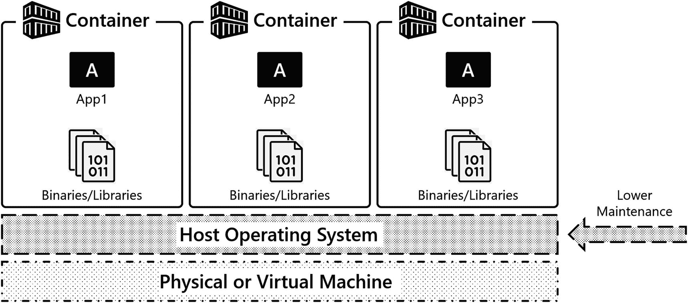

图 2-2

基于容器的应用程序部署

容器是*短暂的*，这种短暂性就是容器的超能力之一。当一个容器启动并运行时，该容器具有实际程序状态方面的状态，以及在其中更改的任何文件数据。容器也可以被删除，当删除时。容器中的任何程序状态和文件数据都将被删除。

容器的短暂性是如何部署和维护基于容器的应用程序这一概念的关键。将配置和状态与容器生命周期本身分离是容器和容器编排的核心基础。在本章后面的环境变量和卷中，以及在本书后面的 Kubernetes 构造中，将介绍容器的配置和状态解耦技术，以帮助我们实现相同的目标。

## 虚拟机有什么难的？

近 20 年来，虚拟机一直是企业 IT 的首选平台。读者们，我们要求你们思考一下，虚拟化硬件在你们的数据中心为你们带来了什么。您的硬件得到了更好的利用…太棒了。但是你的数据中心最便宜的东西是什么？你的硬件。您的数据中心最贵的东西是什么？你！你的时间是最昂贵的资源。当使用虚拟机作为我们的平台时，我们的组织几乎没有增加运营效率，因为虚拟机没有优化组织最昂贵的资源，即人员。

图 [2-3](#Fig3) 是虚拟机在数据中心的传统实施。运营团队构建基础架构，安装客户操作系统，并在这些操作系统上安装所有应用程序，这就是生产环境。运营团队为此付出了巨大的努力，以保持系统和应用程序在该架构中正常运行。

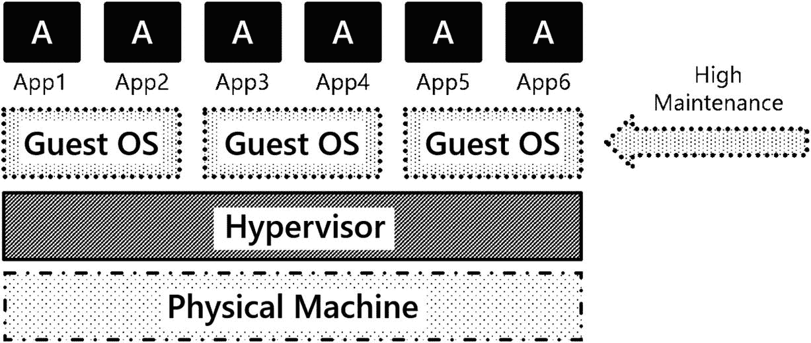

图 2-3

企业数据中心中虚拟机及其应用程序的传统实施

以下是在基于虚拟机的平台上部署应用程序的一些挑战:

*   **操作系统资源开销:**运行虚拟机存在固有的 CPU 和内存开销。这些 CPU 时间和内存可以更好地用于支持应用程序，而不是操作系统。

*   **操作系统补丁:**更新操作系统不会为您的组织增加多少商业价值。这当然是维持适当的安全状态所必需的，但不会推动您的业务向前发展。

*   **故障排除:**年复一年，系统被构建出来，投入生产，然后就被搁置了。如果出现问题，IT 运营部门必须穿上斗篷，修复系统。

*   **操作系统升级:**我们认为 IT 中最难做的事情是升级操作系统，因为如果你升级你的操作系统，你要测试什么？一切！应用程序与操作系统的紧密耦合意味着每次对基础操作系统进行更改，都会给我们的系统带来风险。

*   **部署:**虚拟机及其应用程序的端到端自动化部署在企业 IT 中很少见。此外，这些解决方案通常是定制的单点解决方案，很难维护。

上面提到的运行基于虚拟机的平台的挑战是否推动了您的业务向前发展？使用虚拟机有什么收获吗？我们不这么认为…也许有更好的方法。

## 容器

当使用基于容器的应用程序部署时，容器直接解决了在基于虚拟机的平台上部署应用程序时遇到的一些挑战。让我们看看容器带来了什么:

*   **速度** **:** 与 VMs 相比，集装箱要小很多。例如，在包含任何用户数据库之前，在 Windows 上安装了 SQL Server 的虚拟机至少需要 60+GB。SQL Server 的当前容器映像大小约为 1.5GB。在现代数据中心内移动 1.5GB 的容器映像相对来说并不重要。部署 60gb 以上的虚拟机可能需要一些时间。

*   **修补:**修补应用程序时，修补是一个独立于部署的过程。为此，您可能需要额外的工具。利用容器，只需为应用程序提取一个新的容器映像，并在应用程序的新版本上启动一个新的容器，就可以非常快速地更新应用程序。如果配置和状态正确地从容器中分离出来，我们的应用程序可以在新版本上重新运行，对应用程序用户几乎没有影响。

*   **故障排除:**由于容器的短暂性，基于容器的应用程序的主要故障排除技术是终止并重新部署容器。由于容器映像是我们程序状态的一个已知的好的起点，我们可以简单地重启一个容器并回到一个好的状态。

*   **操作系统升级:**在不同版本的操作系统之间移动时，可以删除容器并在较新版本的操作系统上重新创建。因为应用程序所需的库包含在容器中，所以在操作系统版本之间移动时的风险降低了。

*   **快速一致的部署:**使用基于容器的应用程序部署时，部署是用代码编写的。应用程序的部署和维护效率得到了提高。在速度和一致性方面，不再依赖于人工，因为有代表系统状态的代码，可以在部署过程中重复使用。这些代码被放在源代码控制中，是系统理想状态的配置工件。

在企业 IT 中，部署自动化不再是事后的想法或努力追求的目标；这将是应用程序部署的主要方式——使用源代码控制的代码来定义系统的期望状态。基于容器的部署技术使 IT 组织能够更快、更一致地向企业提供服务，并使 IT 能够更轻松地维护基础架构和应用程序，从而提高组织的运营效率。应用程序部署和维护可以更快、更放心地完成。

Docker 和 Kubernetes 都使 IT 组织能够编写代表系统期望状态的代码。然后可以更新该代码，对应用程序、平台和系统进行所需的更改。可以为初始部署、应用更新和修补基于容器的应用程序编写代码。这些技术还可以用于更高效地进行故障排除，如果需要，还可以构建自我修复应用程序。这些概念中的每一个都将在本书后面更详细地探讨。

### 容器世界

好了，现在您已经熟悉了容器的定义以及它如何适应现代应用程序部署流程，让我们来看看容器世界。有许多新兴的技术和技巧，我们想花一些时间让您熟悉这个领域的名称和参与者。

以下列表显示了容器领域中的一些名称和参与者:

*   **Docker:** 在当今的容器领域，Docker 比什么都重要。它是一个容器运行时和工具集合，使您能够在操作系统上创建和运行容器映像和容器，共享该操作系统的资源。

*   **Docker Inc.:** 这是一家制造工具并推动技术实现容器的公司。Docker Inc .对其容器运行时背后的核心技术进行了开源，并衍生出了几个开源项目，如 *containerd* ( [`https://containerd.io/`](https://containerd.io/) )、*开放容器倡议* ( [`www.opencontainers.org/`](http://www.opencontainers.org/) )等等。

*   **containerd:** 是一个容器运行时，它协调容器的生命周期功能，比如提取容器映像以及创建、启动和停止容器。Docker 和 Kubernetes 等使用 containerd 来协调容器生命周期功能。在 Kubernetes 中，容器运行时是一个可插拔的组件。containerd 是事实上的标准。

*   其他容器运行时:容器的世界并不都是 Linux 上的 Docker。游戏里还有其他一些玩家。这里只是其他可用容器运行时的一个小例子:
    *   **Container Linux/CoreOS(rkt):**一个专门构建的操作系统，强调基于容器的应用部署，使用一个名为 *rkt* (发音为 rocket， [`http://coreos.com/`](http://coreos.com/) *)* 的应用容器运行时。

    *   **Podman:** 在基于 Red Hat 的操作系统上运行 Linux 容器的容器运行时。欲了解更多信息，请访问 [`https://github.com/containers/libpod`](https://github.com/containers/libpod) 。

    *   **Windows Server 2016:** 给你同时运行 Windows 和 Linux 容器的能力。欲了解更多信息，请访问 [`https://docs.microsoft.com/en-us/virtualization/ windowscontainers/`](https://docs.microsoft.com/en-us/virtualization/%2520windowscontainers/) 。

Note

在本章中，我们将使用 Docker 作为单容器部署场景的容器运行时。在后面的章节中，我们将使用 containerd 作为 Kubernetes 集群中的容器运行时。

### 获取和运行容器

让我们来谈谈什么是*容器映像*，容器映像是如何定义的，以及容器映像位于何处。

以下列表强调了容器图像的关键元素:

*   **容器映像:**包含运行我们的应用程序的代码、应用程序二进制文件、库和环境变量。用最基本的术语来说，这些是运行我们的应用程序所需的东西。运行中的容器映像称为容器。

*   **Docker file:** 定义了一个容器图像的元素。它告诉容器运行时在容器启动时启动哪个二进制文件，暴露哪些网络端口，以及关于要构建的容器映像的其他关键信息。

*   **容器注册表:**这是存储图像的地方。Docker Hub 是众多容器注册中心之一，是存储和交换容器图像的主要场所。存储库是在容器注册中心内组织容器映像的方法。

### 容器生命周期

沿着图 [2-4](#Fig4) ，您将看到一个基于容器的应用程序的生命周期。当开发人员准备好了，他们将在他们的普通应用程序开发平台上构建他们的应用程序。然后，他们将为该应用程序编写一个 *Docker 文件*。这个 Docker 文件包含为该应用程序构建容器映像所需的信息。它将包含诸如容器启动时启动哪个二进制文件、应用程序位于哪个网络端口之类的信息，以及许多其他可能的配置属性和构建映像的指令。一旦 Docker 文件准备好了，开发者将告诉 Docker 用*构建*一个图像。这将从 Docker 文件中获取已定义的信息，并在开发人员的工作站上本地创建一个容器映像。然后这个容器映像被*推*(上传)到*容器注册表*中，直到有人准备好使用这个容器映像。当用户想要从该容器映像启动容器时，他们将*将该容器映像下拉*到他们的操作系统，然后该操作系统上的容器运行时将从该容器映像创建(运行)一个正在运行的容器，然后该应用在该操作系统上的容器中启动并运行。

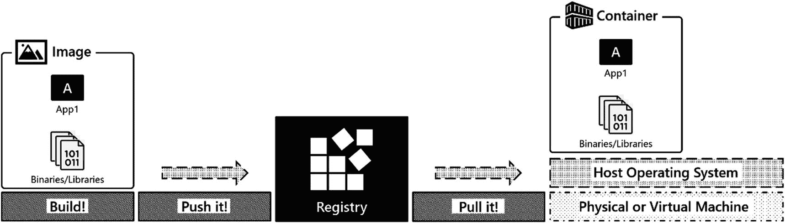

图 2-4

容器生命周期

好了，说够了。让我们看看如何在 Docker 上的容器中部署 SQL Server。在本书中，您将不会构建容器图像。您将使用公共容器注册表中可用的图像。在本章中，您将使用 SQL Server 容器，这些映像可以从微软容器注册表(*mcr.microsoft.com*)中获得。

### 使用容器图像

要拉一个容器，执行`docker pull`命令并指定想要拉的容器图像。在下面的例子中，容器图像来自存储库`mssql/server,`的容器注册表`mcr.microsoft.com`，为了请求一个特定的容器，您指定了*图像标签*，这里是`2019-latest`。清单 [2-1](#PC1) 显示了这个命令。

```
docker pull mcr.microsoft.com/mssql/server:2019-latest

Listing 2-1docker pull command for latest SQL Server 2019 image

```

图 [2-5](#Fig5) 显示了清单 [2-1](#PC1) 中命令的结果输出。

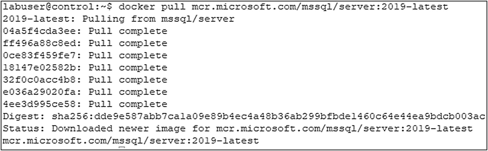

图 2-5

码头拉货的输出

在前面的例子中，带有标签`2019-latest`的容器图像通常被拉出。容器映像存储库的维护者通过指定一个`latest`标签来定义一个指向他们应用程序最新版本的标签。如果您想要获取容器图像的特定版本，您将想要从存储库中获取可用标签的列表。对于 SQL Server，您可以使用清单 [2-2](#PC2) (Bash)和清单 [2-3](#PC3) (Windows)中所示的命令来实现。

```
(Invoke-WebRequest https://mcr.microsoft.com/v2/mssql/server/tags/list).Content

Listing 2-3Command on Windows

```

```
curl -sL https://mcr.microsoft.com/v2/mssql/server/tags/list

Listing 2-2Command on Bash

```

图 [2-6](#Fig6) 显示了这些命令的部分输出。还有更多可用的容器图像，但为了简洁起见，我们省略了一些。

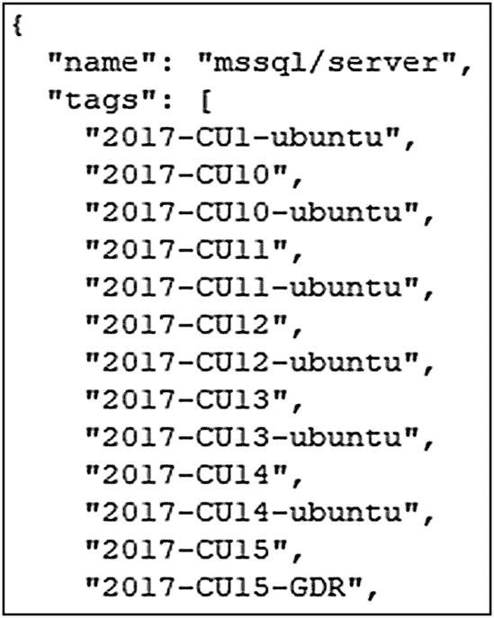

图 2-6

容器图像及其标签的缩写列表

如果你想拉一个特定的容器，你需要指定一个容器图像标签。清单 [2-4](#PC4) 中的命令将提取与标签`2019-CU9-ubuntu-18.04`相关联的容器图像。

```
docker pull mcr.microsoft.com/mssql/server:2019-CU9-ubuntu-18.04

Listing 2-4docker pull command to pull container image associated with specific tag

```

要获得本地系统上可用的图像列表，请执行清单 [2-5](#PC5) 中的`docker image ls`命令。该命令的输出显示了已经被拉至本地系统的图像。下面是一个例子。

```
docker image ls

Listing 2-5docker image ls command

```

对于每个图像，输出(图 [2-7](#Fig7) )显示图像的存储库、标签、图像标识符(`IMAGE ID`)、创建日期和图像大小。

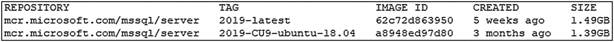

图 2-7

docker 图像 ls 命令的输出

一个常见的误解是,`docker image ls`命令显示的创建日期就是图像被提取的日期。事实并非如此。创建日期实际上是图像创建的日期。

一个容器图像可以有多个标签。在前面的输出中，如果仔细观察容器`IMAGE ID`，您会注意到两个容器图像都有相同的`IMAGE ID`值。标签`2019-latest`和`2019-CU9-ubuntu-18.04`指向同一个容器映像，因为在编写 SQL Server 2019 时最新的映像是 CU9。当一个新的容器映像发布到存储库中时，它将拥有一个新的、唯一的容器映像 ID。存储库管理员将更新`latest`标签，指向存储库中最新的图像。

### 启动容器

要启动一个容器，执行清单 [2-6](#PC6) 中的`docker run`命令，让我们看一下下面的例子。

```
docker run \
    --env 'ACCEPT_EULA=Y' \
    --env 'MSSQL_SA_PASSWORD=S0methingS@Str0ng!' \
    --name 'sql1' \
    --publish 1433:1433 \
    --detach \
    mcr.microsoft.com/mssql/server:2019-CU9-ubuntu-18.04

Listing 2-6docker run command

```

要在容器中运行 SQL Server，需要做一些事情来配置 SQL Server 的初始启动。如前所述，配置和状态的解耦是在容器中运行应用程序的关键。这是去耦配置的一个例子。SQL Server 将配置点作为环境变量公开。您可以在运行时通过为这些环境变量指定值来注入配置。在前面的命令中，您可以看到`--env 'ACCEPT_EULA=Y'.`为环境变量`ACCEPT_EULA`指定了值`'Y'`。启动时，SQL Server 将查找该值并相应地启动。类似地，定义了一个环境变量`'MSSQL_SA_PASSWORD=S0methingS@Str0ng!'`。这将在容器启动时设置`sa`密码，在本例中为`S0methingS@Str0ng!`。虽然不是必需的，但容器名称是用`--name='sql1'`参数指定的，这在命令行使用容器时很有用，并使我们能够通过名称来寻址容器。

Tip

有关可作为环境变量的配置的更多信息，请查看 [`https://docs.microsoft.com/en-us/sql/linux/sql-server-linux-configure-environment-variables`](https://docs.microsoft.com/en-us/sql/linux/sql-server-linux-configure-environment-variables) 。

除了应用程序配置和名称之外，要通过网络访问基于容器的应用程序，必须公开一个端口。参数`--publish 1433:1433`在基本操作系统上将容器内部的一个端口暴露给容器外部的一个端口。让我们打开包装，因为这是我们开始使用容器时经常出错的地方。第一个`1433`是应用程序在基本操作系统上监听的端口。默认情况下，它将侦听主机操作系统的 IP 地址，因此这就是用户和其他应用程序在同一主机上本地或从其他主机远程访问基于容器的应用程序的方式。第二个`1433`是监听集装箱“内部”的端口。稍后在讨论容器内部结构时会有更多的介绍。接下来是`--detach,`，它告诉容器运行时将正在运行的进程从标准输出中分离出来。这使我们能够控制我们的终端，并将 SQL Server 作为后台进程运行。

Note

如果您在启动一个容器时遇到问题，请删除`--detach`参数，这样您就可以在屏幕上看到容器的日志被传输到标准输出。在 SQL Server 容器中，这是`SQL Server Error Log`。我们在创建容器时看到的最常见的原因是`sa`密码不够复杂；查看错误日志时，这将很快浮出水面。`docker logs`在这种情况下也很有帮助。

最后是启动该容器的特定容器映像，在本例中，它是`mcr.microsoft.com/mssql/server:2019-CU9-ubuntu-18.04`。

如果`docker run`命令成功，它将把容器 ID 打印到标准输出。

执行清单 [2-7](#PC7) 中的`docker ps`来列出本地系统上运行的容器。

```
docker ps

Listing 2-7docker ps command

```

图 [2-8](#Fig8) 显示了命令的输出。`sql1`容器启动并运行。它还显示了容器 ID、它是从哪个容器映像启动的、容器启动时启动的命令、容器名称、容器的创建时间以及容器的当前状态，在本例中，它已经运行了 10 分钟。

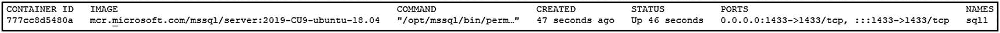

图 2-8

本地系统上运行的容器列表

### 出了问题怎么办？

使用结合了容器名的`docker logs`命令(列表 [2-8](#PC8) )，在本例中为`sql1`，从容器中获取输出。在 SQL Server 中，您将在这里找到的输出来自 SQL Server 错误日志，其中可能包含关于您的容器为何无法启动的有价值的信息。

```
docker logs sql1 | more

Listing 2-8docker logs command

```

### 访问基于容器的应用程序

在本例中，应用程序是 SQL Server，因此让我们使用命令行实用工具 sqlcmd 来访问 SQL Server。清单 [2-9](#PC9) 中的代码显示了获取`@@VERSION`输出的查询。

```
sqlcmd -S localhost,1433 -U sa -Q 'SELECT @@VERSION' -P 'S0methingS@Str0ng!'

Listing 2-9Command line utility sqlcmd to access SQL Server

```

在图 [2-9](#Fig9) 中，可以看到一个运行 SQL Server 2019 CU1 的容器，它与容器启动时指定的容器映像相匹配。

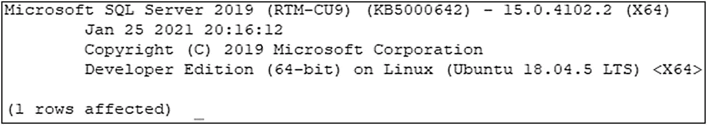

图 2-9

容器启动时指定的容器映像

### 启动 SQL Server 的第二个实例

要启动 SQL Server 2019 CU1 的第二个实例作为容器，再次执行`docker run`。关键的区别在于惟一的容器名，在本例中是`sql2,`，以及惟一的发布端口。在这种情况下，第二个 SQL Server 实例在端口`1434`上可用，如清单 [2-10](#PC10) 所示。要访问此 SQL Server 实例，应用程序将指向该端口。在下面的命令中，我们使用缩写的参数名，而不是像在前面的`docker run`命令中那样使用完整的参数名。

```
docker run \
     --name 'sql2' \
     -e 'ACCEPT_EULA=Y' \
     -e 'MSSQL_SA_PASSWORD=S0methingS@Str0ng!' \
     -p 1434:1433 \
     -d mcr.microsoft.com/mssql/server:2019-CU9-ubuntu-18.04

Listing 2-10docker run command with unique container name

```

`docker ps`将再次产生正在运行的容器列表。

图 [2-10](#Fig10) 中的命令输出显示了两个容器`sql1`和`sql2`的启动和运行。

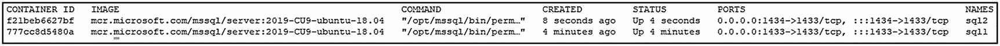

图 2-10

docker ps 命令的输出

现在有两个容器启动并运行，让我们将数据库恢复到其中一个容器中。在书籍下载中，您会发现一个 SQL Server 数据库`TestDB1.bak`和一个恢复脚本`restore_testdb1.sql`。

restore_testdb1.sql 的内容也可以在清单 [2-11](#PC11) 中看到。

```
USE [master]
RESTORE DATABASE [TestDB1]
FROM DISK = N'/var/opt/mssql/data/TestDB1.bak'
WITH REPLACE

Listing 2-11restore_testdb1.sql

```

让我们浏览恢复数据库的过程，查看容器内部的文件布局，然后浏览运行容器的生命周期。

### 将数据库还原到在容器中运行的 SQL Server

清单 [2-12](#PC12) 中的命令将一个现有的数据库备份复制到一个容器中，该容器位于`sql2`容器内的目录`/var/opt/mssql/data`中，清单 [2-13](#PC13) 中的命令随后对复制的备份文件设置适当的权限。

由于 SQL Server 2019 ( [`https://techcommunity.microsoft.com/t5/sql-server/non-root-sql-server-2019-containers/ba-p/859644`](https://techcommunity.microsoft.com/t5/sql-server/non-root-sql-server-2019-containers/ba-p/859644) )中非根 SQL Server 容器的性质，需要调整复制到容器中的文件的权限，以便里面的`sqlservr`进程可以读取复制的文件。在 Linux 系统上，命令`docker cp`将作为用户的`UID`从执行`docker cp`命令的基础操作系统复制文件。容器内的`sqlservr`进程作为用户`mssql`运行。下面的`chown`命令将备份文件的所有权更改为用户`mssql`，以便用户可以读取该文件。

```
docker exec -u root sql2 chown mssql /var/opt/mssql/data/TestDB1.bak

Listing 2-13chown command inside the container

```

```
docker cp TestDB1.bak sql2:/var/opt/mssql/data

Listing 2-12docker cp command

```

将该文件放在正确的位置，执行`restore_testdb1.sql`脚本，其中包含恢复该数据库所需的 T-SQL。注意，我们正在从容器外部运行这个恢复(清单 [2-14](#PC14) ),并在客户端工作站上使用`sqlcmd`，并将它指向正确的服务器名称(`localhost`)和端口`1434`。

```
sqlcmd -S localhost,1434 -U sa -i restore_testdb1.sql -P 'S0methingS@Str0ng!'

Listing 2-14Execute restore script through sqlcmd

```

sqlcmd 将确认成功恢复，如图 [2-11](#Fig11) 所示。

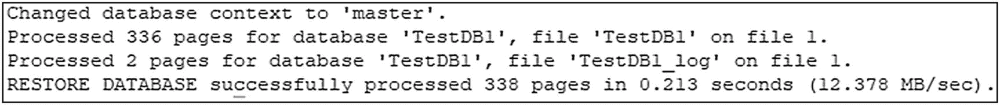

图 2-11

数据库的成功恢复

数据库恢复后，让我们使用清单 [2-15](#PC15) 中的`docker exec`命令来访问容器内部。这将允许我们探索正在运行的容器的内部。参数`-it`为正在执行的进程提供了一个交互式终端，在本例中是`/bin/bash`，一个 bash 提示符。在以下示例中，所显示的提示显示了登录用户的用户名`mssql`，以及与容器的容器 ID 相匹配的容器主机名。

```
docker exec -it sql2 /bin/bash

Listing 2-15docker exec command

```

有了这个在容器内部运行的交互式 bash shell，让我们四处看看。执行清单 [2-16](#PC16) 所示的`ps -aux`命令，列出所有正在运行的进程。

```
ps -aux

Listing 2-16pa -aux command

```

在图 [2-12](#Fig12) 所示的输出中，你会看到容器中只有一小部分进程在运行:两个`sqlservr`进程、一个`bash` shell 和一个`ps`命令。这个例子强调了容器在运行时的隔离性。该容器及其正在运行的进程看不到在基本操作系统上运行的任何其他进程。

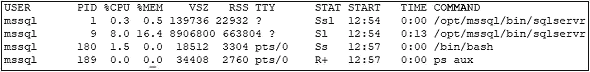

图 2-12

pa -aux 命令的输出

现在，用`ls -la /var/opt/mssql/data`执行目录列表(列表 [2-17](#PC17) )。这是 Linux 上 SQL Server 的默认数据库目录。

```
ls -la /var/opt/mssql/data

Listing 2-17Directory listing

```

如图 [2-13](#Fig13) 所示，您将在该目录中找到系统和用户数据库。您还将找到您在前面的演示中复制的数据库备份文件，即`TestDB1.bak`文件。每个容器都有一个独立的文件系统。所以这个目录中的文件只对这个正在运行的容器可用。如果该容器被删除，这些文件将与该容器一起被删除。我们将很快介绍容器的数据持久性。

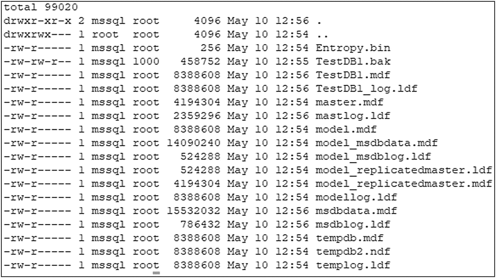

图 2-13

Linux 上 SQL Server 的默认数据库目录

要退出这个容器，使用`exit`命令并返回到我们的基本操作系统的 shell。

### 停止集装箱

运行 SQL Server 等守护进程的容器将继续运行，直到被告知停止。要停止一个正在运行的容器，执行清单 [2-18](#PC18) 中的`docker stop`命令，并指定容器名或容器 ID。在下面的例子中，容器`sql2`被停止。这将向运行在容器内部的进程发送一个`SIGTERM`信号，让它们正常关闭。

```
docker stop sql2

Listing 2-18docker stop command

```

### 在本地系统上查找容器

此时，本地系统上有两个容器。一个容器当前已停止，`sql2`，另一个容器仍在运行，`sql1`。现在执行一个`docker ps`命令。

在输出中(图 [2-14](#Fig14) )，只有一个运行的容器，sql1。

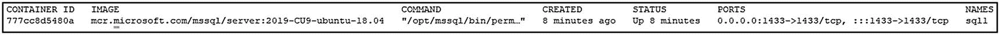

图 2-14

docker ps 命令的输出。正在运行的容器列表

要查看系统中的所有容器，不管它们当前的状态是停止还是运行，执行清单 [2-19](#PC19) 中的`docker ps -a`命令。

```
docker ps -a

Listing 2-19docker ps -a command

```

在图 [2-15](#Fig15) 显示的输出中，列出了两个容器`sql1`和`sql2`。关键信息是`STATUS`栏。`sql1`仍在运行，如状态值`16 minutes ago`所示。对于另一个容器`sql2`，状态为`Exited (0) 33 seconds`；目前已停止。`0`是应用程序的退出代码。非零退出代码表示程序内部发生了错误；零(0)表示正常关机。

Note

如果您发现一个非零的退出代码，那么一定是出错了，您将希望使用`docker logs`来调查该容器的问题。

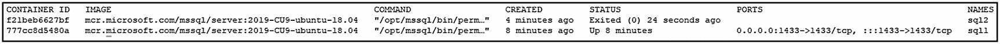

图 2-15

docker ps -a 命令的输出。相应系统上所有容器的列表

### 启动现有容器

因为容器仍然在系统中，所以可以用`docker start`(列表 [2-20](#PC20) )重启，然后指定容器名。这个容器的所有状态和配置仍然存在，所以当容器再次启动时，我们的系统和用户数据库也将存在。

```
docker start sql2

Listing 2-20docker start command

```

然后，我们可以使用 sqlcmd 列出实例中的数据库，如清单 [2-21](#PC21) 所示。

```
sqlcmd -S localhost,1434 -U sa -Q 'SELECT name from sys.databases' -P 'S0methingS@Str0ng!'

Listing 2-21List databases using sqlcmd

```

在图 [2-16](#Fig16) 的输出中，`sql2`再次启动，显示系统上的当前数据库，包括恢复的用户数据库`TestDB1`。

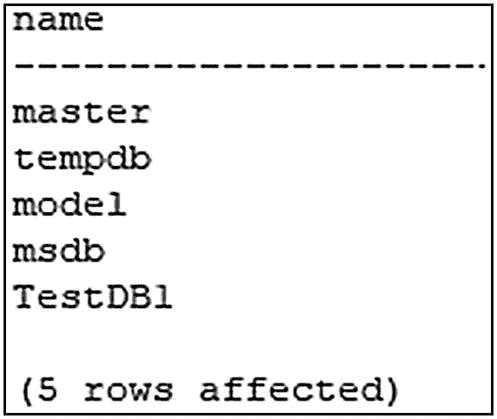

图 2-16

数据库列表

现在，让我们使用清单 [2-22](#PC22) 来清理和停止这些容器。

```
docker stop sql1
docker stop sql2

Listing 2-22docker stop command

```

### 移除容器

当集装箱停止时，`docker rm`(列表 [2-23](#PC23) )将从系统中移除一个集装箱。此时，容器中的数据将被销毁。所以一旦这些容器被移除，恢复的`TestDB1`就消失了。独立于容器生命周期的数据持久性将在下一节讨论。在下面的例子中，`sql1`和`sql2`都被删除了。

```
docker rm sql1
docker rm sql2

Listing 2-23docker rm command

```

前面的示例删除了容器，但没有删除容器图像。容器映像仍然在本地系统上，可以用来从。执行`docker image ls`(列表 [2-24](#PC24) )显示容器图像所在的系统。

```
docker image ls

Listing 2-24docker image ls command

```

在图 [2-17](#Fig17) 中，您可以看到容器图像仍然在本地系统上。


图 2-17

docker 图像 ls 命令的输出。本地系统上的容器图像

## 集装箱内部

现在，我们想花一些时间来看看容器内部，以便您可以理解当在容器内部运行时，操作系统如何实现和提供对进程及其资源的隔离。

容器是一个运行的进程，具有底层操作系统及其资源的独立视图。当从容器映像启动容器时，会指示容器运行时启动容器映像中定义的特定进程。除了其他配置信息之外，还定义了应用程序监听哪个端口。

如前所述，在容器内部执行的进程列表只显示了在容器内部运行的进程；系统上看不到其他进程。即使应用程序正在容器内部的端口`1433`上侦听，为了访问应用程序，必须在基本操作系统上发布一个唯一的端口…操作系统如何在单个系统上为基于容器的应用程序提供这种隔离？这就是 Linux 名称空间的由来。

### 命名空间

Linux 内核名称空间( [`http://man7.org/linux/man-pages/man7/namespaces.7.html`](http://man7.org/linux/man-pages/man7/namespaces.7.html) )是一种内核结构，为运行在 Linux 上的进程提供隔离。Linux 中有六个核心名称空间，五个用于资源隔离，一个用于资源管理。查看下面的名称空间列表，您可以感受一下名称空间提供了什么。它们将程序和程序使用的资源与基本操作系统隔离开来——比如进程、文件、网络等等。

五个资源隔离命名空间为运行在系统上的进程提供了对底层操作系统服务的访问:

*   **PID:** 过程隔离

*   **MNT:** 文件系统和挂载点隔离

*   **网络:**网络设备和堆栈隔离

*   **IPC:** 进程间通信

*   **UTS:** 唯一的主机名和域名

第六个名称空间 cgroups 为运行在基本操作系统上的进程提供资源隔离。这使多个进程能够在操作系统上运行，并使管理员能够控制资源共享:

*   **cgroups:** 控制组支持分配和控制对系统资源的访问，如 CPU、I/O 和内存。

有关 cgroups 如何工作的更多信息，请查看 Linux 手册页的链接: [`http://man7.org/linux/man-pages/man7/cgroups.7.html`](http://man7.org/linux/man-pages/man7/cgroups.7.html) 。

### 联合文件系统

容器图像是只读的。当容器运行时，对容器内文件的任何更改都使用写入时拷贝技术写入可写层。联合文件系统采用容器映像的基础层和可写层，并将两者作为单个统一文件系统呈现给应用程序。这种技术使我们能够从单个图像启动许多容器，并获得重用该容器图像的层作为许多容器的起点的效率。每个容器都有一个唯一的可写层，其生命周期与容器相关联。当一个容器被删除时，这个可写层也被删除。如果您运行的是像 SQL Server 这样的有状态应用程序，这听起来并不太吸引人。下一节将介绍为基于容器的应用程序提供数据持久性的技术。这些年来，Docker 的 Union 文件系统的实现细节已经从 AUFS、UnionFS 和 OverlayFS 发生了变化，但是实现细节不在本次讨论的范围之内。

Note

如果你想深入了解容器图像是如何工作的，我们鼓励你去看看我们的同事埃尔顿·斯通曼(@埃尔顿·斯通曼)的 Pluralsight 课程“在 Docker 中处理数据和有状态应用”( [`https://app.pluralsight.com/library/courses/handling-data-stateful-applications-docker/table-of-contents`](https://app.pluralsight.com/library/courses/handling-data-stateful-applications-docker/table-of-contents) *)* 。

## 容器中的数据持久性

容器是短暂的，这意味着当一个容器被删除时，它就永远消失了。在上一节中，我们介绍了当数据在运行的容器内发生变化时，它会被写入可写层，Union 文件系统负责将这些层连接在一起，以向基于容器的应用程序呈现单个统一文件系统，当容器被删除时，可写层也会被删除。那么容器在整个生命周期中，从创建到删除再到创建，可以保持数据的持久性吗？你可能还会问，为什么我们需要删除一个容器？难道我们不应该让它继续运行吗？是的，您可以让容器保持运行，但是如果您需要更改基本容器映像(可能由于升级或某种修补，您的应用程序有了新的容器映像)，您将需要删除现有的容器，并使用新的容器映像启动一个新的容器。

### Docker 卷

Docker 卷( [`https://docs.docker.com/storage/`](https://docs.docker.com/storage/) )是 Docker 管理的资源，独立于容器的生命周期。Docker 卷从底层操作系统或共享存储中分配存储，并将该存储呈现在容器的文件系统内的特定位置处的容器中。

Tip

请访问 [`https://docs.docker.com/storage/storagedriver/`](https://docs.docker.com/storage/storagedriver/) 查看 Docker 文档，了解有关存储驱动程序的信息。

当卷装载在容器中文件系统内部的某个位置时，当应用程序更改数据时，数据将被写入该文件系统位置，并将被写入该卷。该卷由容器外部的存储进行后端处理。现在，如果删除此容器，容器及其可写层仍会被删除，但卷会保留，因为它具有独立于容器的生命周期。因此，对文件系统其他部分的所有更改，如果没有卷的支持，将不会被持久化。但是写入到由该卷备份的文件位置的文件将被保留。如果创建了一个新容器，并且在该容器中装入了卷，则可以在新容器中访问存储在卷中的数据。图 [2-18](#Fig18) 显示了一个基于容器的应用程序`sql1`，访问一个名为`sqldata1`的卷。

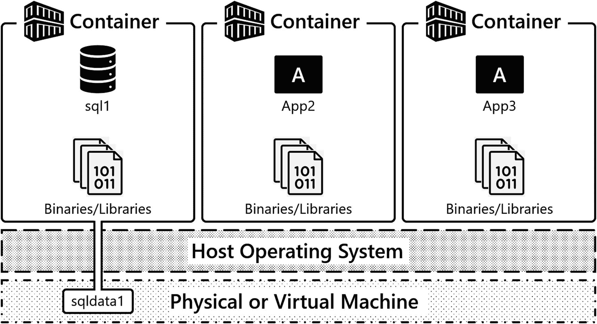

图 2-18

附有卷的容器

让我们看一些为 SQL Server 容器定义 Docker 卷的代码。

### 创建带有卷的容器

清单 [2-25](#PC25) 中的代码显示了一个类似于我们之前例子的容器启动。关键区别在于数据量是用`-v`或`--volume`参数指定的。

```
docker run \
    --name 'sql1' \
    -e 'ACCEPT_EULA=Y' \
    -e 'MSSQL_SA_PASSWORD=S0methingS@Str0ng!' \
    -p 1433:1433 \
    -v sqldata1:/var/opt/mssql \
    -d mcr.microsoft.com/mssql/server:2019-CU9-ubuntu-18.04

Listing 2-25docker run command – data Volume specification

```

让我们解开那行代码… `-v`指定了一个卷的配置。这将创建一个命名卷`sqldata1,`，它将从底层操作系统的文件系统中分配一个卷。确切的位置特定于容器运行时的平台、Windows、Linux 或 MacOS。在冒号之后，您将定义您想要在容器中的什么位置挂载这个卷，因此这个卷被挂载在`/var/opt/mssql,`位置，这是 SQL Server 在 Linux 容器上的 SQL Server 中的默认实例目录。在该目录中，您将找到 SQL Server 所需的数据文件，如 SQL Server 错误日志、跟踪文件、扩展事件文件以及系统和用户数据库。任何写入`/var/opt/mssql`的数据都将被写入卷，卷是独立于容器的资源。

Note

SQL Server 的二进制文件在`/opt/mssql/bin`位于文件系统的另一部分。因此，当容器映像被 SQL Server 的新版本替换时，新的二进制文件将用于启动容器，我们的数据将从`/var/opt/mssql,`中读取，这将在容器实例化之间保持。

因此，让我们来看一下实际操作，并使用 SQL Server 和 Docker 卷进行一系列演示，其中将强调以下要点。首先，启动一个容器，在容器内的`/var/opt/mssql`处装入一个卷，并恢复一个数据库。接下来，删除该容器。然后，创建一个使用相同卷的新容器，最后观察我们的数据是否独立于该容器的生命周期而持续存在。我们开始吧。

在清单 [2-26](#PC26) 中，一个容器用一个容积`sqldata1`来定义。这个卷在`/var/opt/mssql`装载在容器的文件系统中，所以让我们运行这个命令。

现在，容器启动并运行后，将数据库备份复制到容器中，并对备份文件设置适当的权限。然后使用与上一节相同的过程恢复数据库。代码示例(清单 [2-26](#PC26) )强调了这三个步骤。

```
docker cp TestDB1.bak sql1:/var/opt/mssql/data
docker exec -u root sql1 chown mssql /var/opt/mssql/data/TestDB1.bak
sqlcmd -S localhost,1433 -U sa -i restore_testdb1.sql -P 'S0methingS@Str0ng!'

Listing 2-26docker cp command

```

sqlcmd 将再次确认执行。

随着容器的启动和运行以及用户数据库的恢复，查看 SQL Server 容器实例上的当前数据库列表，以确认数据库恢复成功(清单 [2-27](#PC27) )。

```
sqlcmd -S localhost,1433 -U sa -Q 'SELECT name from sys.databases' -P 'S0methingS@Str0ng!'

Listing 2-27List all databases through sqlcmd

```

在图 [2-19](#Fig19) 中，显示了输出。`TestDB1`在此 SQL Server 实例的数据库集中列出。


图 2-19

SQL Server 实例上的数据库列表

该容器在其文件系统中的`/var/opt/mssql`处附加并装载了一个卷。当 SQL Server 第一次启动时，它会将关键实例文件和系统数据库放在此目录中。根据恢复脚本(清单 [2-28](#PC28) )中的代码，在前面的示例中恢复的用户数据库被恢复到子目录`/var/opt/mssql/data`。

```
sqlcmd -S localhost,1433 -U sa -Q 'SELECT name, physical_name from sys.master_files' -P 'S0methingS@Str0ng!' -W

Listing 2-28List all files and their physical names through sqlcmd

```

通过查询`sys.master_files,`，您可以看到(图 [2-20](#Fig20) )我们数据库的所有文件位置都在包含在我们卷内的`/var/opt/mssql/data,`中。

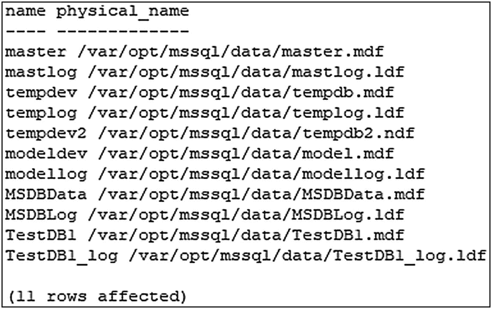

图 2-20

文件及其位置的列表

Note

默认的用户数据库和日志文件位置可配置为环境变量。

查看 [`https://docs.microsoft.com/en-us/sql/linux/sql-server-linux-configure-environment-variables?view=sql-server-ver15`](https://docs.microsoft.com/en-us/sql/linux/sql-server-linux-configure-environment-variables%253Fview%253Dsql-server-ver15) 了解更多详情。这个主题将在第 7 章中进一步讨论。

以下命令将停止容器`sql1`并将其移除(列表 [2-29](#PC29) )。这通常会破坏与该容器相关联的数据…但它现在正在使用一个卷。

```
docker stop sql1
docker rm sql1

Listing 2-29Stop and remove the container sql1

```

清单 [2-30](#PC30) 创建了一个新的容器，并再次定义了一个卷`sqldata1`。这与前一个示例中使用的卷相同，并且是独立于容器的资源，您可以使用命令`docker volume ls`看到这一点。SQL Server 的实例目录及其系统和用户数据库都在该卷中。因此，当 SQL Server 启动时，它将在`/var/opt/mssql/data`中找到主数据库，然后读取实例的配置和状态。文件系统中可用的任何已定义的用户数据库也将联机。

```
docker run \
    --name 'sql2' \
    -e 'ACCEPT_EULA=Y' \
    -e 'MSSQL_SA_PASSWORD=S0methingS@Str0ng!' \
    -p 1433:1433 \
    -v sqldata1:/var/opt/mssql \
    -d mcr.microsoft.com/mssql/server:2019-CU9-ubuntu-18.04

Listing 2-30docker run command – creation of new container

```

容器启动并运行后，使用清单 [2-31](#PC31) 中的命令查询当前的数据库集。

```
sqlcmd -S localhost,1433 -U sa -Q 'SELECT name from sys.databases' -P 'S0methingS@Str0ng!'

Listing 2-31List all databases through sqlcmd

```

并且在输出中可以看到`TestDB1`(图 [2-21](#Fig21) )。现在我们要指出的是，不仅是用户数据库，还有系统数据库和其他与实例相关的文件。因此，对实例所做的任何配置更改也将保持不变，例如，最大服务器内存之类的实例级配置。

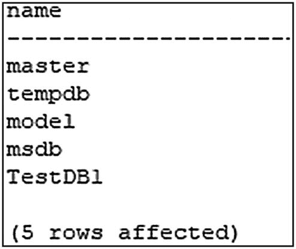

图 2-21

SQL Server 实例上的数据库列表

我们的卷是独立于容器的资源，您可以通过使用输出中所示的`docker volume ls`命令(列出 [3-32](#PC32) )看到这一点。

```
docker volume ls

Listing 2-32docker volume ls command

```

图 [2-22](#Fig22) 将显示我们系统中所有当前定义的卷。


图 2-22

Docker 卷列表

### 深入研究卷

现在使用 Docker 时，我们最喜欢的命令之一是`docker inspect`。清单 [2-33](#PC33) 中显示的这个命令用于获取关于资源的更多详细信息，在下面的例子中，执行`docker inspect`显示了关于我们的卷的更多详细信息。

```
docker volume inspect sqldata1

Listing 2-33docker inspect command

```

让我们浏览一下这些输出，您可以在图 [2-23](#Fig23) 中看到。首先是`CreateAt`，这是卷创建的日期和时间。同样可用的是`Driver,`，也就是`local`。这意味着它正在使用底层操作系统的文件系统。接下来是`Mountpoint`；这是暴露在容器中的基本操作系统的实际路径。因此，如果您浏览到运行容器的底层操作系统上的这个目录，您将在卷内看到容器的文件，在我们这里的示例中，您将在这个位置找到 SQL Server 实例的文件及其数据库。

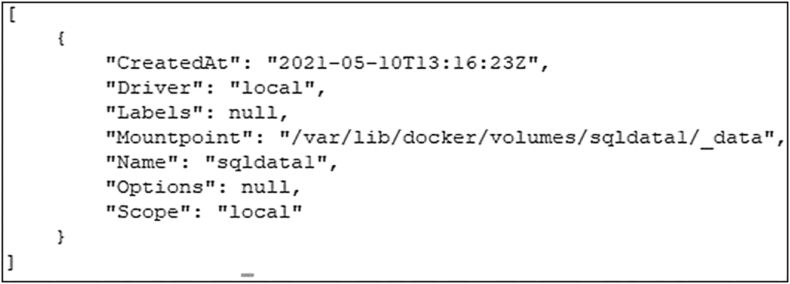

图 2-23

docker inspect 的输出–关于容量的详细信息

Note

如果你使用的是 Mac 或 Windows，这些文件将会被从你的系统中抽象出来。Mac 和 Windows 都使用虚拟化技术，因此您可以在这些平台上运行 Linux 容器。这些文件的实际位置将在为容器运行时提供 Linux 内核服务的虚拟机的“内部”。在运行 Linux 容器的本机 Linux 系统上，您将在由 Mountpoint 定义的实际文件系统位置找到这些文件。

### 停止和移除容器和卷

既然我们已经强调了容器的生命周期以及如何使用卷从外部持久化容器中的数据，那么是时候清理我们的资源了。我们现在将向您展示如何停止容器、删除容器以及删除卷。

执行`docker stop sql1`(清单 [2-34](#PC34) )告诉 SQL Server 进程停止，然后停止容器。

```
docker stop sql1

Listing 2-34docker stop command

```

要删除一个容器，使用`docker rm`(列表 [2-35](#PC35) )和容器名`sql1`。由于其数据存储在一个卷中，如果希望继续使用该数据，可以再次创建一个新的容器。

```
docker rm sql1

Listing 2-35docker rm command

```

但是既然这个演示已经完成，就删除这个卷，用`docker volume rm sqldata1`(列出 [2-36](#PC36) )。删除卷时，数据将被销毁。所以慎用！

```
docker volume rm sqldata1

Listing 2-36docker Volume rm command

```

## 现代应用程序部署

既然我们已经讨论了核心容器基础知识，如如何启动容器、访问这些应用程序以及独立于容器的生命周期保存数据，那么让我们将话题转移到如何在现代应用程序部署场景中使用容器，并介绍对容器编排器的需求。

到目前为止，在本章中，我们已经展示了启动一个容器、在网络上公开该应用程序以及将持久存储附加到容器的配置。但是在生产系统中这是如何大规模实现的呢？您想在每次需要启动容器时登录服务器并输入`docker run`吗？您是否希望跟踪您的应用程序在哪些端口上侦听/发布？不，实现该配置并跟踪哪些资源在哪里以及如何访问这些资源并不是一项简单的任务。这就是容器编排器发挥作用的地方。

让我们从一个如图 [2-24](#Fig24) 所示的示例应用堆栈开始。

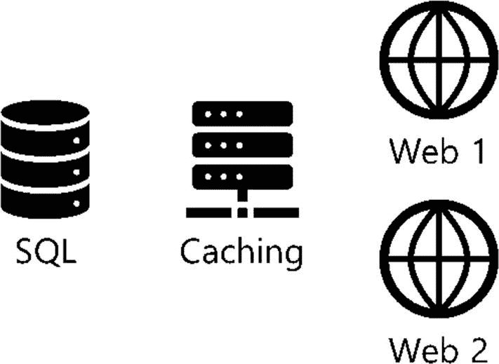

图 2-24

示例应用架构

关于如何使用容器进行部署，有一些基本问题:

1.  这些基于容器的应用程序是如何部署在我们的数据中心的，它们是如何启动的？

2.  这些基于容器的应用程序在我们的数据中心的什么地方运行，在哪些服务器上运行？

3.  这些基于容器的应用程序如何扩展，如果我们想要从 2 台 web 服务器扩展到 20 台来支持工作负载的激增，该怎么办？

4.  我们如何一致地部署这个应用程序堆栈？

5.  我们如何将它部署在另一个环境中进行测试，或者部署在另一个数据中心或云中？

6.  我们或我们的任何应用程序如何访问服务？

7.  哪些 IP 或 DNS 名称与这些应用程序相关联？

容器编排器有助于回答这些问题。

## 对容器编排器的需求

container orchestrator 是帮助管理基于容器的应用程序的部署的软件。容器编排器基于所需状态和控制器的核心概念。Container orchestrators 将确定在数据中心或云中的计算资源集合中的何处运行您的工作负载，启动这些容器，并保持这些容器正常运行并处于定义的状态。

让我们介绍一下容器编排器的一些关键功能:

*   **工作负载放置:**给定数据中心中的一组服务器，选择在哪些服务器上运行容器。

*   **管理状态:**启动容器并保持它们在线。如果某个原因导致基于容器的应用程序停止或变得不可用，容器编排器可以做出反应并重启容器。

*   **部署的速度和一致性:**代码用于定义应用部署。容器编排器将部署该代码中定义的内容。该代码用于快速一致地部署我们的应用程序。

*   **隐藏集群中的复杂性:**container orchestrator 公开了与之交互的编程 API，因此用户可以更少地关注我们应用程序的物理基础设施，而更多地关注应用程序的部署方式。

*   **持久应用程序访问端点:**容器编排器将跟踪哪些服务可用，并提供对基于容器的应用程序所提供的服务的持久访问。

有几种不同的容器编排器可用，在本书中，重点是 Kubernetes ( [`https://kubernetes.io/`](https://kubernetes.io/) )，因为它已经成为开源容器编排器的标准。因此，本书的其余部分将重点介绍如何构建一个 Kubernetes 集群并将 SQL Server 部署到该环境中。

## 更多资源

要深入了解 Docker 卷，请查看 Anthony 的博客系列“在 Docker 容器中持久化 SQL Server 数据”:

*   [T2`www.centinosystems.com/blog/sql/persisting-sql-server-data-in-docker-containers-part-1/`](http://www.centinosystems.com/blog/sql/persisting-sql-server-data-in-docker-containers-part-1/)

*   [T2`www.centinosystems.com/blog/sql/persisting-sql-server-data-in-docker-containers-part-2/`](http://www.centinosystems.com/blog/sql/persisting-sql-server-data-in-docker-containers-part-2/)

*   [T2`www.centinosystems.com/blog/sql/persisting-sql-server-data-in-docker-containers-part-3/`](http://www.centinosystems.com/blog/sql/persisting-sql-server-data-in-docker-containers-part-3/)

查看我们的技术评审和容器专家 Andrew Pruski 的( *@dbafromthecold* )容器博客系列。如果它与容器有关，Andrew 可能已经在博客上写了:

*   [T2`https://dbafromthecold.com/2017/03/15/summary-of-my-container-series/`](https://github.com/nocentino/presentations)

另外，一定要看看我们的好朋友、全能 SQL Server 专家 Bob Ward 提供的资源( *@bobwardms* )。容器中的 SQL Server 是 Linux 上的 SQL Server。如果你想深入了解 Linux 上的 SQL Server 是如何工作的，一定要去看看鲍勃的书*Linux 上的 Pro SQL Server*，安东尼非常乐意成为这本书的技术评论员:

*   **GitHub:**T3`https://github.com/microsoft/bobsql`T4】

*   ***Linux 上的 Pro SQL Server***T5】:[`www.apress.com/gp/book/9781484241271`](https://www.apress.com/gp/book/9781484241271)

*   ***SQL Server 2019 揭晓*** **:** [`www.apress.com/gp/book/9781484254189`](https://www.apress.com/gp/book/9781484254189)

## 摘要

Kubernetes 是一个容器编排器，在这一章中，我们已经奠定了容器如何工作的基础。我们展示了什么是容器以及容器如何提供应用程序隔离。容器用于快速部署应用程序，在我们的示例中，我们在容器中运行 SQL Server。本章的一个关键概念是需要*将配置和状态*从容器的生命周期中分离出来，其核心工具是环境变量，用于注入配置和卷以独立于容器的生命周期保持状态(数据)。这些是核心概念，在您学习如何在 Kubernetes 上部署 SQL Server 时，将在本书的剩余部分重新讨论和利用这些概念。