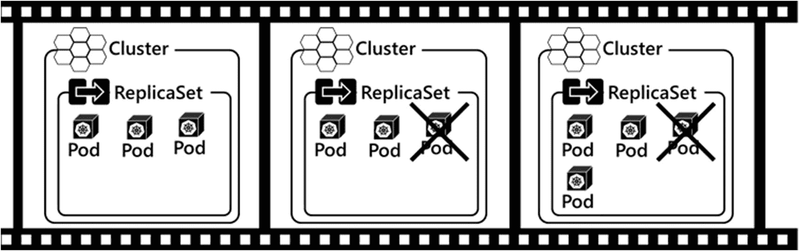
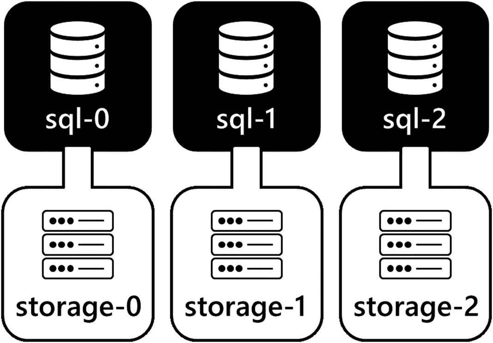
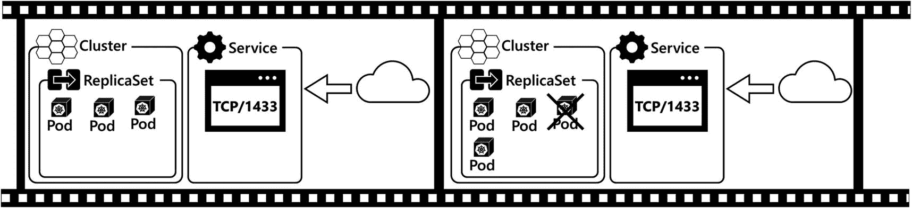
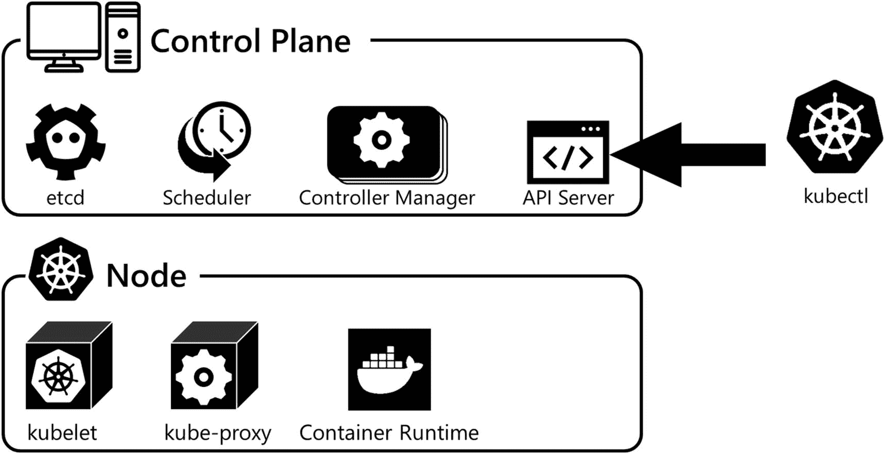
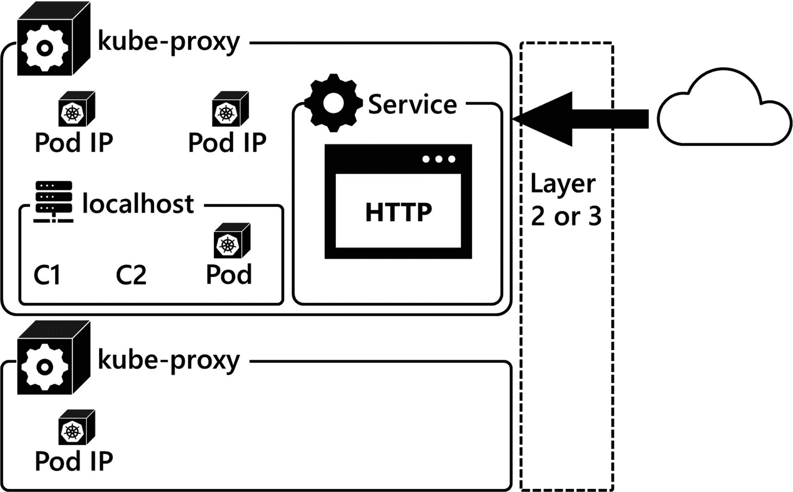

# 3.不可思议的建筑

本章介绍了 Kubernetes，描述了它在现代应用部署中的作用、它提供的好处以及它的体系结构。从它的好处开始，您将了解 Kubernetes 在现代基于容器的应用部署中提供的价值。接下来，您将了解 Kubernetes API 如何使您能够构建和部署下一代应用和系统。在该 API 中，您将学习 Kubernetes 提供的用于定义和部署应用和系统的核心 API 原语。然后，您将学习 Kubernetes 集群及其组件的关键概念，并学习 Kubernetes 网络基础知识。

## Kubernetes 简介

Kubernetes 是一个容器管弦乐队。它负责在数据中心的服务器上启动基于容器的应用。为此，Kubernetes 使用代表数据中心资源的 *API 对象*，使开发人员和系统管理员能够用代码定义系统，并使用该代码进行部署。基于容器的应用作为 *Pods* 部署到 *Kubernetes 集群*中。集群是计算资源(物理或虚拟服务器)的集合，称为*节点*。让我们更详细地了解这些元素，从 Kubernetes 的优势开始，了解它在现代应用部署中提供的价值:

*   **工作负载调度:** Kubernetes 是一个容器编排器，其主要目标是在集群中的节点上启动基于容器的应用，称为 Pods。Kubernetes 的工作是在集群中找到运行 Pod 的最合适的位置。在节点上调度 pod 时，主要关注的是确定节点是否有足够的 CPU 和内存资源来运行分配的工作负载。

*   **管理状态:**当代码被部署到 Kubernetes 中，定义需要运行的工作负载时，Kubernetes 负责启动集群中的 pod 和其他资源，并将集群保持在所需的状态。如果集群的运行状态偏离了预期状态，Kubernetes 将尝试更改集群的运行状态，以使集群的运行状态回到定义的预期状态。例如，如果一个部署定义了多个正在运行的 Pod，如果一个 Pod 出现故障，Kubernetes 将在集群中部署一个新的 Pod，替换出现故障的 Pod，确保部署定义的 Pod 数量正常运行。此外，假设您想要扩展支持应用的单元数量，以增加更多容量。在这种情况下，您需要增加部署中的副本数量，Kubernetes 将在集群中创建额外的单元，以确保实现所需的状态。在接下来的控制器部分会有更多的介绍。

*   **一致的部署:**用代码部署应用支持可重复的过程。定义部署的代码是配置工件，可以放在源代码控制中。您还可以使用这些代码在底层环境中部署相同的系统，比如开发环境，甚至是内部系统和云之间。在 Kubernetes API 的下一节中会有更多的介绍。

*   **速度:** Kubernetes 支持快速、可控的部署，快速启动集群中的单元。此外，在 Kubernetes 中，应用可以快速扩展。扩展支持一个应用的 pod 的数量可以像更改一行代码一样简单，而且只需要几秒钟。这将在章节 [5](05.html) 和 [7](07.html) 中详细演示。

*   基础设施抽象:Kubernetes API 提供了集群中可用资源的抽象或包装。在部署应用时，不太关注基础架构，而是更关注应用如何定义和部署以及如何消耗集群资源。用于部署的代码将描述部署应该是什么样子，而集群将实现这一点。如果应用需要公共 IP 地址或存储等资源，这将成为部署的一部分，群集将调配这些资源供应用使用。

*   **持久服务端点:** Kubernetes 为部署在集群中的应用提供持久的 IP 和 DNS 命名。由于扩展操作或对故障事件的反应，Pods 可以来来去去，Kubernetes 为访问这些应用提供了这种网络抽象。根据所使用的服务类型，服务负载将应用流量平衡到支持应用的 pod。随着 pod 的创建和销毁，无论是基于扩展操作还是响应集群中的故障，Kubernetes 都会自动更新哪些 pod 提供应用服务的信息。

## 不死之 API

Kubernetes API 提供了一个表示数据中心可用资源的编程层。API 使您能够编写代码，在应用部署中使用这些资源。当编写代码来使用 API 时，您使用 *API 对象*，它用于在 Kubernetes 中定义和部署应用工作负载。你写的代码被提交到 *API 服务器*。API 服务器是 Kubernetes 集群中的核心通信枢纽。这是您与 Kubernetes 集群交互的主要方式，也是集群中的 Kubernetes 组件交换信息的唯一方式。定义了新的集群状态后，无论是在初始部署时还是在修改现有部署时，Kubernetes 都开始实现代码中描述的状态。代码的期望状态成为集群中的运行状态。

### API 对象

Kubernetes API 对象表示集群中可用的资源。集群中有针对计算、存储和网络元素等的 API 对象，供您的应用工作负载使用。您将使用这些 API 对象编写代码，来定义部署到 Kubernetes 集群中的应用和系统的期望状态。这些定义的 API 对象将部署的工作负载的期望状态传达给集群，集群负责确保期望状态成为集群的运行状态。

我们现在将引入核心 API 对象来定义 Kubernetes 集群中的工作负载。这些是 Kubernetes 中部署的应用的核心构建块。在接下来的几节中，我们将分别深入探讨这些问题:

*   pod:这些是基于容器的应用。Pod 是集群中的工作单元。Pod 是一种抽象，它包含一个或多个容器以及它需要执行的资源和配置，包括网络、存储、环境变量、配置文件和机密。

*   **控制器:**这些控制器定义并保持集群中的应用工作负载处于期望的状态。一些控制器负责启动吊舱并使这些吊舱保持所需的状态。有几种不同类型的控制器用于确保部署的应用和系统的状态，以及集群的运行状态。我们将在这一节介绍几个控制器，并在本书的其余部分介绍更多。

*   服务:这些服务为访问基于 Pod 的应用提供了一个网络抽象。服务是应用的消费者(如用户和其他应用)访问部署在集群中的基于容器的应用服务的方式。

*   **存储:** Kubernetes 为 pod 提供了访问集群中的存储和配置数据的抽象。像永久卷和永久卷声明(PVC)这样的存储对象用于独立于 pod 的生命周期保存应用数据。

*   **配置数据:**配置数据可以作为 *ConfigMaps* 和 *Secrets、*存储在集群中，它们可以作为文件和环境变量暴露给在 Pods 中运行的应用。

除了所描述的 API 对象之外，还有许多用于处理工作负载的 API 对象，但这些是本书中重点介绍的核心 API 对象类型，用于部署 SQL Server。

### API 服务器

API 服务器是 Kubernetes 集群中的中心通信枢纽。这是 Kubernetes 用户与集群交互以部署工作负载的主要方式。这也是 Kubernetes 在集群内部的组件之间交换信息的主要方式。API 服务器是 HTTPS 上可用的 REST API，将 API 对象公开为 JSON。当集群用户定义工作负载并将信息传递给 API 服务器时，这些信息被序列化并持久存储在集群数据存储中。然后，Kubernetes 会将集群的运行状态转换为集群存储中的 API 对象所定义的期望状态。

Note

集群数据存储是一种可插拔资源。Kubernetes 中占主导地位的集群数据存储是一个名为 etcd ( [`https://etcd.io/`](https://etcd.io/) )的分布式键值存储。

### 核心库 API 基元

现在是时候更仔细地看看上一节中介绍的每个高级 API 对象了。本节介绍 pod、控制器、服务、存储、配置图和机密。您将了解关于每种 API 的更多细节，以及它们如何使您能够在 Kubernetes 中部署应用，以及每种 API 对象允许您部署的工作负载。

#### 分离舱

Pod 也是 Kubernetes 集群中最基本的工作单元。在其核心，一个 Pod 是一个 API 对象，代表一个或多个*容器*，它的*资源*，比如网络、存储，以及控制其执行的*配置*。最常见的是，Pod API 对象定义由容器映像、用于与基于容器的应用通信的网络端口以及存储(如果需要)组成。

Pod 是 Kubernetes 集群中调度的*单元。在 Kubernetes 中，调度决定在集群中的哪个节点上启动 Pod。一旦 Pod 在节点上被调度，使用指定容器映像的容器由容器运行时在该节点上启动，该运行时通常是 Docker 容器运行时。当在节点上调度 Pod 时，Kubernetes 确保运行 Pod 所需的资源(如 CPU 和内存)在选定的节点上可用，并且如果在 Pod 中进行了配置，还可以访问存储。*

Note

Kubernetes 实现了容器运行时接口(CRI)，这意味着容器运行时是一个可插拔的资源，可以使用其他符合 CRI 的容器运行时。事实上的标准是容器。参见第 [2](02.html) 章了解更多详情。

Pod 是缩放的*单位。*在 Kubernetes 中部署应用时，您可以通过在集群中创建一个 Pod 的多个副本来水平扩展应用，这些副本称为*副本*。扩展 Pod 副本使应用能够通过在集群中的节点上启动更多容器并利用额外的集群容量来支持更大的工作负载。此外，在群集中跨多个节点运行一个 Pod 的多个副本可在 Pod 或节点出现故障时提供高可用性。

豆荚是短暂的。如果一个单元被删除，它在节点上的容器将被停止，然后被删除。它将被永久销毁，包括其可写层。Pod 永远不会被重新部署。相反，Kubernetes 从当前的 Pod API 对象定义创建一个新的 Pod。在 Pod 的这两个部署之间没有维护任何状态。对于无状态的工作负载，比如 web 应用，这是可以的。随着新 pod 的创建，它们可以在准备就绪时开始接受工作负载。但是对于像关系数据库系统这样的有状态工作负载，Pod 需要能够独立于 Pod 生命周期来持久化存储在其数据库中的数据的状态。Kubernetes 为我们提供了持久存储的 API 对象和构造，下面将对其进行描述。

#### 控制器

控制器定义、监控并保持集群的工作负载和运行状态在期望的状态。本节重点介绍用于创建和管理窗格的控制器。在 Kubernetes 中，很少通过手动定义和部署 Pod 对象来创建 Pod。两个常见的工作负载 API 对象用于在 Kubernetes 中部署应用。他们是*部署*和*状态设置*。

部署是一个 API 对象，使您能够在 Pod 的配置中定义应用所需的状态，并包括要创建的 Pod 的数量，称为副本。部署控制器创建一个*副本集*。ReplicaSet 负责使用部署对象中的 Pod 规范启动集群中的 Pod。图 [3-1](#Fig1) 的第一帧显示了创建副本集的部署，该副本集启动了集群中的三个 pod。

图 3-1

复制集操作

控制器负责将集群的运行状态保持在期望的状态，所以让我们来看看它是如何工作的。在图 [3-1](#Fig1) 的第二帧中，假设其中一个吊舱由于某种原因发生故障。也许应用崩溃了，或者甚至运行 Pod 的节点不再可用。在第三帧中，ReplicaSet 控制器检测到运行状态偏离了所需状态，并开始创建新的 Pod，确保 ReplicaSet 或应用始终处于三个 Pod 运行的所需状态。

您可能会问，为什么部署控制器创建一个复制集，而不是部署直接创建 pod？部署控制器定义要创建的 Pod 的数量和 Pod 的配置。更新部署配置时，旧副本集中的单元会关闭，而新副本集中的单元会被创建。这支持新容器图像或 Pod 配置的展示。单个部署对象仍然存在，它管理副本集之间的声明性更新和转换。如果您想更深入地了解这个主题，请查看 Pluralsight 课程“管理 Kubernetes 控制器和部署”

部署控制器不保证 pod 的顺序或持久命名。一个部署由一组 pod 组成，每个 pod 都是一个应用的精确副本。但是，如果一个 Pod 被销毁，一个新的 Pod 会在它的位置上创建，那么它的名称就不会持久。数据库系统等应用通常将数据分布在多个计算元素上，然后必须跟踪数据在系统中的位置，以备后续检索。对于需要知道数据在命名计算资源集合中的精确位置的有状态应用来说，使用部署控制器可能会有问题。

为了让 Kubernetes 支持这些类型的有状态应用，StatefulSet 控制器创建了 Pods，每个 Pods 都有一个惟一的、持久的和有序的名称。因此，需要控制跨多个 Pod 的数据放置的应用可以做到这一点，因为 Pod 名称是独立于 Pod 生命周期排序和持久化的。此外，StatefulSets 为应用提供了稳定的存储，确保了正确的存储对象映射到相同的命名 Pod，如果由于任何原因必须再次创建它的话。

图 [3-2](#Fig2) 显示了一个运行状态集的例子。这个示例 StatefulSet 被定义为有三个副本，并创建三个 pod。它创建的每个 Pod 都有一个唯一的有序名称 sql-0、sql-1 和 sql-2。在 StatefulSet 中创建的第一个 Pod 总是从 0 索引开始。在本例中，这是 sql-0。对于每个添加到 StatefulSet 的 Pod，索引增加 1。所以下一个 Pod 是 sql-1，接下来是 sql-2。如果扩展 StatefulSet 以再添加一个 Pod，下一个 Pod 将被命名为 sql-3。如果 StatefulSet 按比例缩小，则首先删除编号最高的 Pod。在本例中，删除了 sql-3。这些有序的创建和扩展操作对于将数据放在指定计算资源上的有状态应用来说是必不可少的，这样有状态应用就可以随时了解数据的位置。

图 3-2

一个示例 stateful set–每个 Pod 都有一个唯一的、有序的、持久的名称。每个 Pod 还具有相关联的持久存储

Kubernetes 中有更多可用的控制器。本书重点介绍部署、复制集和状态集，以及如何使用它们在 Kubernetes 上部署 SQL Server。Kubernetes 中有一些控制器可以帮助处理许多不同类型的应用工作负载。有关不同控制器类型及其功能的更多信息，请查看位于 [`https://kubernetes.io/docs/concepts/workloads/`](https://kubernetes.io/docs/concepts/workloads/) 的 Kubernetes 文档。

#### 服务

正如我们前面介绍的，没有任何 Pod 被重新创建。每次创建单元时，无论是在初始创建期间还是在替换现有单元时，都会在启动时为新单元分配一个新 IP。由于控制器根据配置创建和删除 pod，或对故障做出响应，并影响所需的状态，这给我们留下了一个挑战，即如果 pod 不断变化，应该使用哪个 IP 地址来访问集群中运行的 pod 所提供的应用服务。

Kubernetes 为访问部署在集群中的基于 Pod 的应用提供了一个网络抽象，称为*服务*。服务是一个永久的 IP 地址和一个可选的 DNS 名称，用于访问集群中 pod 上运行的应用。一般来说，集群中部署的每个应用都有一个服务。在服务 IP 上接收的应用流量被负载平衡到底层 Pod IP 地址。当控制器(如 ReplicaSet 控制器)创建和销毁 pod 时，网络信息会自动更新以表示应用的当前状态。让我们来看一个例子。

在图 [3-3](#Fig3) 中，假设一个部署创建了一个 ReplicaSet，ReplicaSet 创建了三个 pod。每个豆荚在网络上都有一个唯一的 IP 地址。为了让用户或应用访问这些窗格中的应用，定义了一个服务。服务公开了在一个持久的 IP 地址和端口(HTTP 的端口 80)上的一组 Pods 中运行的应用。用户或其他应用可以通过连接到服务 IP 地址或 DNS 名称来访问该服务提供的应用。然后，该服务在属于该服务一部分的 pod 之间对流量进行负载平衡。

图 3-3

副本集和服务

在图 [3-3](#Fig3) 的第二帧中，假设 ReplicaSet 中的一个 pod 出现故障。ReplicaSet 控制器检测到这一点，并部署一个新的 Pod，在服务中注册该新 Pod 的 IP 地址，并开始对该新 Pod 进行负载平衡。失败的 Pod 将被删除，其 IP 地址将从服务中删除，流量将不再发送到该 IP。这一切都是自动发生的，无需任何用户交互。

此外，当向上扩展应用并添加更多 Pod 或通过移除一些 Pod 来向下扩展应用时，Pod IPs 被相应地添加到服务或从服务中移除。这确实是一项了不起的技术，当我们看到它的实际应用时，我们感到非常兴奋。这将在第 [5](05.html) 章中详细说明。

Kubernetes 中有三种类型的服务可用，所有这些服务都可以用来访问在 Kubernetes 中运行的应用。服务类型有*集群 IP* 、*节点端口*和*负载均衡器*。让我们更详细地看一下每一项:

*   **ClusterIP:** ClusterIP 服务仅*在集群内*可用。当应用不需要在群集外公开时，使用这种类型的服务。

*   **节点端口:**节点端口服务在固定端口上的集群中每个节点的真实 IP 地址上公开您的应用。使用与服务端口结合的群集节点的真实网络 IP 地址来访问节点端口服务。接收到的流量被路由到支持该服务的适当的 pod。当基于集群的应用需要在集群之外访问或与外部负载平衡器集成时，使用节点端口服务。

*   **负载平衡器:**该服务类型集成了云提供商的负载平衡器服务或内部部署的集群外部负载平衡器，如 F5。当需要在集群外部访问基于集群的应用时，在基于云的场景中使用负载平衡器服务。

这些服务类型将在第 [5](05.html) 章中详细说明。

#### 仓库

作为 SQL Server 专业人员，我们的首要工作是保存数据。Kubernetes 有 API 对象来支持有状态应用的部署，比如 SQL Server。有两个主要的 API 对象可以帮助实现这一点，持久卷和持久卷声明。持久卷是由集群管理员定义的集群中可供 pod 使用的存储。有许多不同类型的存储可作为持久卷，如云提供商、iSCSI、NFS 等提供的虚拟磁盘。但是 pod 不直接访问持久卷对象。Pod 使用 Pod 对象定义中的永久卷声明来访问群集存储。永久卷声明将向群集“请求”存储，然后 PVC 将声明永久卷，并将永久卷映射到 Pod。这个额外的抽象层将 Pod 与持久卷的存储实现细节分离开来。这样做的主要好处是，Pod 定义中不包含存储实现细节，例如特定于基础架构的存储参数。实现细节在持久卷对象中。Kubernetes 中的持久化数据将在第 [6](06.html) 章中详细介绍。

#### 配置映射

在 Kubernetes 中，应用配置数据可以作为 API 对象存储在集群中。ConfigMap 是一个 API 对象，它将键值对存储为群集资源中的数据。存储的数据可以作为环境变量或配置文件暴露给 pod 及其容器，容器中运行的应用可以使用这些文件进行配置。这些通常用于配置 Kubernetes 中部署的更复杂的应用。ConfigMaps 使您能够将配置从部署清单中的代码中分离出来，并将其存储在集群中以供运行时参考。您将在第 [8](08.html) 章中看到正在使用的配置图。

#### 秘密

Secret 是一个 API 对象，用于存储 Kubernetes 集群中部署的应用所使用的敏感信息。秘密通常用于存储密码、API 令牌、公钥和私钥对以及 TLS 证书。您可以编写一个部署清单，并通过名称引用该秘密，存储在该秘密中的信息可以作为环境变量或文件系统中的文件向在 pod 中运行的容器公开。

机密使您能够拥有更安全、更灵活的清单和容器映像，因为您没有将敏感信息与那些资源一起存储。您希望避免在部署清单和容器映像中存储敏感信息。机密允许您将这种类型的潜在敏感信息存储在集群中，并在以后部署时检索这些信息。

## Kubernetes 集群组件

本章的第一部分介绍了 Kubernetes 的概念和用于在 Kubernetes 集群中构建和部署工作负载的核心 API 对象。现在是时候深入了解什么是 Kubernetes 集群了，仔细看看每个主要组件。

### 探索 Kubernetes 集群架构

Kubernetes 集群是称为*节点*的服务器(物理的或虚拟的)的集合，这些节点为在 Pods 中运行基于容器的应用提供了一个平台。集群中有两种类型的节点。*控制平面节点*是集群本身的控制器，是操作背后的大脑。*工作者节点*是用于运行 pod 的计算设备。让我们更仔细地看一看，从控制平面节点开始。图 [3-4](#Fig4) 为我们提供了集群组件的概述。

图 3-4

Kubernetes 集群组件

#### 控制平面节点

控制平面节点操作控制平面服务。控制平面服务实现 Kubernetes 集群的核心功能，例如管理集群本身及其资源，以及控制工作负载。控制平面由四个组件组成，每个组件在集群中都有特定的职责。它们是 *API 服务器*、 *etcd* 、调度器*、*控制器管理器*。控制平面服务和控制平面组件通常部署为 pod，可以在单个控制平面节点上运行，也可以在多个控制平面节点上运行，以实现高可用性。有关构建高可用性集群及其配置的更多信息，请查看 [`https://kubernetes.io/docs/setup/production-environment/tools/kubeadm/high-availability/`](https://kubernetes.io/docs/setup/production-environment/tools/kubeadm/high-availability/) 和 [`https://kubernetes.io/docs/setup/production-environment/tools/kubeadm/ha-topology/`](https://kubernetes.io/docs/setup/production-environment/tools/kubeadm/ha-topology/) *。**

让我们更详细地了解一下每个控制平面功能及其在集群中的职责:

*   **API 服务器:**API 服务器是集群中的主要通信中枢。所有集群组件都通过 API 服务器进行通信，以交换信息和状态。它是一个简单的无状态 REST API，实现并公开了 Kubernetes API，以便用户和其他集群组件进行访问。当创建、修改或删除 API 对象时，这些对象的状态被提交给集群。API 服务器的多个副本可以跨多个控制平面节点部署，并且 API 流量可以进行负载平衡以实现高可用性。

*   **Etcd:** etcd 是一个键值数据存储，用于保存集群的状态。API 服务器本身是无状态的，但是将对象数据序列化并存储在 etcd 中。因为它确实保存数据，所以需要保护数据的恢复和可用性。etcd 的备份应该经常进行，如果需要高可用性，则在高可用性配置中配置多个副本。

*   **控制器管理器:**控制器管理器实现并确保集群及其工作负载的期望状态。它使用控制循环来持续监视运行状况，将其与期望的状态进行比较，并进行必要的更改以使集群返回到期望的状态。为此，控制器管理器监视并更新 API 服务器。在本章的前面，我们介绍了控制器的概念，以及它们如何使您能够告诉 Kubernetes API 期望的状态是什么。控制器管理器实现该状态。就 Pod 和应用工作负载而言，如果部署定义了应用的三个 Pod 副本需要在线，控制器管理器有责任确保这些 Pod 始终在线，并准备好通过在需要时创建新的 Pod 来协调定义的状态和集群的运行状态。

*   **调度器:**调度器决定在集群中的哪个节点上启动 Pod。它监视 API 服务器，寻找任何未计划的 pod。如果调度程序发现任何未计划的 pod，它将确定在集群中运行这些 pod 的最佳位置。调度决策基于集群中的可用资源、为每个 pod 定义的要求以及任何潜在的管理策略约束。如果您想了解更多有关调度的详细信息，请查看 Pluralsight 课程“配置和管理 Kubernetes 存储和调度”

#### 工作节点

工作节点运行用户应用工作负载。一个集群通常由至少一个控制平面节点和一组工作节点组成。每个工作节点为集群中的整体可用资源贡献一定量的 CPU 和内存资源。您将需要足够的 CPU 和内存资源来运行集群中的应用工作负载，确保有足够的容量用于应用，并且在节点故障甚至增长的情况下也是如此。

Note

控制平面节点的主要关注点是确保可用性。查看 [`https://kubernetes.io/docs/setup/production-environment/tools/kubeadm/ha-topology/`](https://kubernetes.io/docs/setup/production-environment/tools/kubeadm/ha-topology/) 了解关于高可用性控制平面拓扑的更多信息。

集群中的所有节点，无论是控制平面还是工作节点，都由三个组件组成，即与 API 服务器通信以进行集群操作的 *kubelet* ，向本地网络公开节点上运行的容器的 *kube-proxy* ，以及在节点上启动和运行容器的*容器运行时*:

*   **kube let:**kube let 是运行在节点上的服务，负责与 API 服务器通信，启动节点上的 pod，并确保该节点上的 pod 处于健康状态。kubelet 监控 API 服务器的 Pod 工作负载状态，告诉容器运行时启动和停止容器。它还向 API 服务器报告节点上运行的 pod 的当前状态，并以活性探测和就绪探测的形式对 pod 执行健康检查。kubelet 向 API 服务器报告节点的当前状态和该节点上可用的资源。

*   **kube-proxy:** kube-proxy 是一个运行在集群中所有节点上的容器，作为网络代理，负责将流量从节点所在的网络路由到运行在该节点上的 pod。

*   **容器运行时:**容器运行时负责拉容器镜像，在节点上运行容器。如今，Docker 是 Kubernetes 集群中最常用的容器运行时。但是容器运行时空间正朝着容器运行时接口标准发展，该标准允许几种不同的容器运行时被用作 Kubernetes 节点中的容器运行时。Kubernetes 支持 Docker、containerd 和 CRI-O 容器运行时。在本书中，使用的容器运行时是 Docker。参见 [`https://kubernetes.io/docs/ setup/production-environment/container-runtimes/`](https://kubernetes.io/docs/%2520setup/production-environment/container-runtimes/) 了解更多关于 Kubernetes 中支持的容器运行时的信息。

### 网络基础

Kubernetes 初级读本的最后一个主题是网络。Kubernetes 网络模型支持在 Kubernetes 中部署工作负载，同时消除网络复杂性。这简化了集群中的应用配置和服务发现，并通过删除特定于基础架构的代码提高了部署代码的可移植性。本节介绍 Kubernetes 网络模型和示例集群通信模式。

管理 Kubernetes 网络的三个规则。这些规则实现了前面描述的简单性。这些规则出自 [`https://kubernetes.io/docs/concepts/cluster-administration/networking/`](https://kubernetes.io/docs/concepts/cluster-administration/networking/) 。

#### Kubernetes 网络模型规则

1.  所有 pod 可以在所有节点上相互通信，无需网络地址转换(NAT)。

2.  一个节点上的所有代理，如系统守护进程和 kubelet，都可以与该节点上的所有 pod 通信。

3.  节点的主机网络中的 pod 可以与所有节点上的所有 pod 通信，而无需 NAT。

上述规则通过确保 Pod 在实际的 Pod IPs 和容器端口上相互通信，而不是根据部署它们的网络基础设施将它们转换为 IP 方案，从而简化了网络和应用配置。

在 Kubernetes 中，Pod 网络是当容器运行时在一个节点上启动它们时，Pod 所连接的网络。部署的每个单元在单元网络上都有一个唯一的 IP 地址。Pod 网络必须遵循前面定义的规则，这导致 pod 使用它们的真实 IP 地址。在实现 Pod 网络时，有许多解决方案可以确保遵守 Kubernetes 网络模型规则。一种常见的解决方案是覆盖网络，它使用隧道协议在独立于底层物理基础设施网络的节点之间交换数据包。这使得覆盖网络能够使用独立于数据中心物理基础设施的第 3 层 IP 方案，从而能够更简单地遵循 Kubernetes 网络模型。

另一种选择是构建一个 Pod 网络，作为裸机方法的一部分，作为数据中心基础架构的一部分。这需要 Kubernetes 集群管理员和负责网络的网络工程团队的协调。

以下是 Kubernetes 集群中使用的常见通信模式，显示了 Pods 相互访问以及访问 Pods 提供的服务。

#### 沟通模式

图 3-5 显示了 Kubernetes 集群中的一些示例通信模式。让我们一起来看看每一个:

图 3-5

不可思议的网络

1.  **吊舱内部**

    Pod 中的多个容器共享同一个容器名称空间。这些容器可以通过本地主机在唯一的端口上相互通信。

2.  **节点内的 Pod 到 Pod**

    当同一节点上的 Pod 需要通过网络进行通信时，它们通过节点上定义的本地软件桥进行通信，并使用 Pod IP。

3.  **另一个节点上的 Pod 到 Pod**

    当不同节点上的 Pod 需要通过网络进行通信时，它们使用 Pod IP 通过本地第 2 层或第 3 层网络进行通信。

4.  **服务**

    当访问集群中的服务时，流量被路由到实现服务的 kube-proxy，然后被路由到提供该应用服务的 Pod。正如本章前面所介绍的，服务将是您与部署在集群中的应用最常见的交互。

## 摘要

本章介绍了 Kubernetes 以及它如何支持现代基于容器的应用的部署。您了解了 Kubernetes API 如何使您能够构建和建模部署到 Kubernetes 集群中的应用。您还学习了部署工作负载的核心 API 原语: *Pods* ，您的基于容器的应用；*控制器*，将集群及其工作负载保持在期望的状态；*服务*，用于访问应用；和*存储*，用于有状态应用。然后，您了解了集群的组件以及它们如何协同工作以确保实现您想要的状态，并且我们快速浏览了 Kubernetes 网络模型。有了这些理论之后，现在是时候进入下一章了，我们将向您展示如何构建一个 Kubernetes 集群并启动和运行一个基本的工作负载。