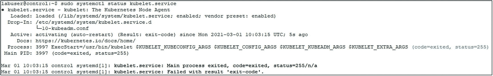

# 4.正在安装 kubernetes

在本章中，我们将介绍如何在本地和云中构建 Kubernetes 集群。我们将首先讨论安装位置的决策过程，是在内部还是在云中，以及在该过程中需要考虑的事项。然后，我们将使用 *kubeadm* 安装方法来完成构建基于虚拟机的本地 Kubernetes 集群的过程。接下来，我们将在 Azure Kubernetes 服务中构建一个集群。这些集群将是本书剩余部分中所有示例的基础。

## [安装注意事项](https://app.pluralsight.com/course-player%253FclipId%253D5f4148df-26ef-4ce3-a052-f7c6a91da597)和方法

与几乎任何现代软件安装一样，您需要决定的第一件事是:您将在本地安装还是安装到云。

### 部署在哪里？

部署到云时，您需要在两个主要部署选项之间进行选择:

*   **基础设施即服务(IaaS):** 在 IaaS 场景中，您在云中部署*虚拟机*，然后在其上安装 Kubernetes。

*   **平台即服务(PaaS):** [Kubernetes 也可作为托管服务](https://app.pluralsight.com/course-player%253FclipId%253D5f4148df-26ef-4ce3-a052-f7c6a91da597%2526startTime%253D44.92)从[所有大型云提供商处获得。](https://app.pluralsight.com/course-player%253FclipId%253D5f4148df-26ef-4ce3-a052-f7c6a91da597%2526startTime%253D47.4)在托管服务产品中，[您不必担心任何底层](https://app.pluralsight.com/course-player%253FclipId%253D5f4148df-26ef-4ce3-a052-f7c6a91da597%2526startTime%253D53.94) [基础设施或冗余；云提供商会为您处理这些问题。](https://app.pluralsight.com/course-player%253FclipId%253D5f4148df-26ef-4ce3-a052-f7c6a91da597%2526startTime%253D56.1)使用 PaaS 要考虑的一件事是，您将失去版本控制的灵活性和 Kubernetes 中可用的其他功能，以及对控制平面节点的访问。

*   在内部部署时，最终决定是安装在虚拟机上，还是直接安装在*裸机*上。虽然内部也有托管服务，但这超出了本书的范围。

选择裸机还是虚拟机作为节点主要取决于您的预期工作负载。如果你谈论的是大量可扩展的微服务，运行在虚拟机上的 Kubernetes 节点可能会给你带来很多额外的灵活性。如果您正在部署一个大型应用程序，中间的虚拟机管理程序将需要不必要的开销。您可能想知道:如果您只运行一个应用程序，那么 Kubernetes 是不是最好的平台呢？和往常一样，答案是视情况而定！虽然这可能不是一个显而易见的用例，但也有像 SQL Server 大数据集群这样的应用，我们将在第 [10](10.html) 章中对此进行更深入的讨论。虽然他们通常需要专用的基础设施，但他们只在 Kubernetes 上部署。

在本书中，我们将主要关注使用自我管理(内部部署或基础设施即服务)机器的环境，使用第 [1](01.html) 章中描述的设置。无论您是将这些机器作为虚拟机安装在云中、内部还是裸机上，都没有关系，因为 Kubernetes 将基础架构抽象化了。

展望未来，看看在哪里安装潜在的生产集群…这个问题应该遵循您组织的总体战略。如果到目前为止您所做的一切仍然是本地的，那么让您的 Kubernetes 集群也住在那里可能非常有意义。另一方面，如果您正在迁移或者已经将主要工作负载迁移到了云上，那么您的 Kubernetes 集群可能会紧随其后。最后，这归结到您的团队的技能和您的用例在 Kubernetes 上运行的需求。

### 进一步的考虑

除了问题 *where* 之外，当然还有其他我们将在本章和本书剩余部分更深入讨论的考虑事项:

*   您需要多少工作节点来支持您的工作负载？

*   这些节点的 CPU 和 RAM 配置如何？

*   如果控制平面出现故障，您是否需要一个高度可用的解决方案？

*   您的备份和恢复策略是什么？

*   您将使用哪种存储？

*   您将如何管理 pod 和节点之间的网络？

虽然我们正处于 Kubernetes 之旅的开始阶段，但这些都是您在考虑推出生产系统之前应该回答的问题。

### [安装方法](https://app.pluralsight.com/course-player%253FclipId%253Dab5f2a68-44ce-4942-b2bf-2ace5886e3f1)

根据您的安装位置，这也将在很大程度上决定您的安装方法。当安装自管理集群时，您可以主要选择 kubeadm，这是一种在 *Linux* 或 Red Hat OpenShift 等企业产品上部署 Kubernetes 的免费方式。安装本身通常是通过命令行工具触发的。

安装基于云的集群时，您的云提供商将负责安装部分，具体细节由您的云提供商决定。他们通常提供自己的基于命令行的方法以及 web 门户来指导部署。

### 附加选项

还有很多其他选择，比如使用 *Docker* Desktop 在笔记本电脑上运行 Kubernetes 集群，或者使用 Raspberry Pi 之类的轻量级硬件作为部署目标。虽然它们可能有有效的用例，特别是在非生产环境中，但我们不会在本书中深入讨论这些。

此外，虽然有使用基于 Windows 的工作节点的选项，但我们将专注于使用 Linux 作为我们的操作系统。

我们也不会讨论部署单节点集群的细节。如果你只有一台可用的 *Ubuntu* 机器，你可以使用清单 [4-1](#PC1) 中的代码，这将启动一个包括*本地存储、*的单节点集群，但是这对于本书中的大多数练习来说是不够的，除了最基本的练习。

```
wget -q -O deploy_kubeadm.sh https://bookmark.ws/ArcDemo_Linux
chmod +x deploy_kubeadm.sh
./deploy_kubeadm.sh

Listing 4-1Install single-node cluster

```

## [安装要求](https://app.pluralsight.com/course-player%253FclipId%253D982d8f0e-d017-4f76-8bd5-c243179677d4)

对于自我管理的 Kubernetes 安装，我们将关注 Linux 上的 kubeadm，更具体地说是 Ubuntu。虽然 CentOS、RHEL 和其他 Linux 发行版也受支持，但我们只需选择一种环境，Ubuntu 似乎是目前最常见的选择。

最低系统要求是系统有两个 CPU，2GB 内存，禁用交换。尽管 Kubernetes 组件的这个最低要求不支持任何有意义的工作负载。请确保您正在使用第 [1](01.html) 章中介绍的环境。在生产环境中，还要确保考虑了可伸缩性和冗余。

[除了那些基础系统需求，](https://app.pluralsight.com/course-player%253FclipId%253D982d8f0e-d017-4f76-8bd5-c243179677d4%2526startTime%253D43.84) [你还需要一个 CRI(容器运行时接口)容器运行时。](https://app.pluralsight.com/course-player%253FclipId%253D982d8f0e-d017-4f76-8bd5-c243179677d4%2526startTime%253D47.32)截至本文撰写之时，Kubernetes 同时支持 Docker 和 *containerd* 。由于 Docker 在 Kubernetes 1.20 中已被弃用，并且在 Kubernetes 1.20 版或更高版本中将删除对它的支持，因此我们将在本书中主要关注 containerd。

### 网络要求

从网络的角度来看，确保所有机器都有唯一的主机名、MAC 地址和 IP 地址。理想情况下，这些 IP 地址应该在同一个子网上，但至少必须相互连接。

如果您在网络中运行防火墙(出于本书实验的目的，我们建议不要运行防火墙，只是为了避免网络出现不必要的复杂情况)，表 [4-1](#Tab1) 列出了控制平面上需要可达的所有 TCP 端口。

表 4-1

控制平面节点上所需的 TCP 端口

  
| 

成分

 | 

TCP 端口

 |
| --- | --- |
| 应用程序接口 | Six thousand four hundred and forty-three |
| 和 cd | 2379–2380 |
| 调度程序 | Ten thousand two hundred and fifty-one |
| 控制器管理器 | Ten thousand two hundred and fifty-two |
| 忽必烈忽必烈忽必烈忽必烈忽必烈忽必烈忽必烈忽必烈忽必烈忽必烈忽必烈忽必烈忽必烈忽必烈忽必烈忽必烈 | Ten thousand two hundred and fifty |

在节点上，需要打开表 [4-2](#Tab2) 中列出的端口。

表 4-2

工作节点上所需的 TCP 端口

  
| 

成分

 | 

TCP 端口

 |
| --- | --- |
| 忽必烈忽必烈忽必烈忽必烈忽必烈忽必烈忽必烈忽必烈忽必烈忽必烈忽必烈忽必烈忽必烈忽必烈忽必烈忽必烈 | Ten thousand two hundred and fifty |
| 节点端口 | 30000–32767 |

Note

此处列出的 TCP 端口是默认端口。如果您更改了这些规则，请相应调整您的防火墙规则。

### [喷射立方结构](https://app.pluralsight.com/course-player%253FclipId%253Db0f4845d-f2a5-4a1a-a790-a39ccf314435)

当然，要安装 Kubernetes，我们需要获得 Kubernetes。Kubernetes 软件是在 GitHub 上维护的，所以如果你去 [`https://GitHub.com/Kubernetes/Kubernetes/`](https://github.com/Kubernetes/Kubernetes/) ，就会找到 Kubernetes 项目。你也可以把你自己的想法和改变贡献给这个项目。这也是一个非常有价值的资源，可以帮助您详细了解事情是如何工作的，因为您可以查看代码并从其他人关于 GitHub 问题的经验中学习。

除了软件本身，这也是您可以找到其他文档的地方。

虽然理论上你可以自己获得代码并编译所有东西，但是我们会让我们的生活变得简单一些，通过一个包管理器来安装 Kubernetes。

## 构建自我管理的集群

有了这个理论，让我们开始工作，使用 kubeadm 构建第一个运行在 Ubuntu 机器上的 Kubernetes 集群。我们将使用第 [1](01.html) 章中描述的环境，包括那里提到的先决条件。

Note

我们所有的脚本都使用第 [1](01.html) 章中描述的主机名/IP 地址。如果您确实使用不同的设置构建了您的实验室，您将需要相应地调整这些脚本。出于可读性的考虑，我们不会指出每个可能需要这样做的实例。

### 准备好虚拟机

首先，我们需要准备好四个虚拟机(control 以及 node-1、node-2 和 node-3 ),并安装 containerd 和 Kubernetes 包。按照下面两段所述，在每台机器上安装和配置它们。不需要在存储机器上安装 containerd。

除非另有说明，否则只需在每台机器上使用 shell 运行命令。此安装不能从我们的管理工作站直接触发。

#### 安装和配置容器

要安装 containerd，我们需要使用清单 [4-2](#PC2) 中的代码加载两个模块( *overlay* 和 *br_netfilter* )。容器运行时使用的覆盖文件以及集群内部的网络都需要它们。

```
sudo modprobe overlay
sudo modprobe br_netfilter

Listing 4-2Install modprobe overlay and br_netfilter

```

使用清单 [4-3](#PC3) 中的代码，我们需要确保它们在重启时也被加载。

```
cat <<EOF | sudo tee /etc/modules-load.d/containerd.conf
overlay
br_netfilter
EOF

Listing 4-3Persist modprobe and br_netfilter

```

containerd 还需要一些系统参数，我们可以使用清单 [4-4](#PC4) 中的命令来设置和保存这些参数。

```
cat <<EOF | sudo tee /etc/sysctl.d/99-kubernetes-cri.conf
net.bridge.bridge-nf-call-iptables  = 1
net.ipv4.ip_forward                 = 1
net.bridge.bridge-nf-call-ip6tables = 1
EOF

Listing 4-4Persist system parameters for containerd

```

接下来，让我们使用清单 [4-5](#PC5) 中的命令在不重启的情况下应用这些设置。

```
sudo sysctl --system

Listing 4-5Apply sysctl changes

```

现在我们的 containerd 的先决条件已经就绪，所以我们可以通过清单 [4-6](#PC6) 所示的 *apt-get* 来安装它。

```
sudo apt-get update
sudo apt-get install -y containerd

Listing 4-6Install containerd

```

containerd 需要一个配置文件，我们可以使用 containerd 本身生成一个带有默认设置的文件(清单 [4-7](#PC7) )。

```
sudo mkdir -p /etc/containerd
sudo containerd config default | sudo tee /etc/containerd/config.toml

Listing 4-7Create containerd config

```

在这个文件中，我们必须将 containerd 的 cgroup 驱动程序设置为 system，因为这是 kubelet 所必需的。

以 root 身份在文本编辑器中打开文件*/etc/container d/config . toml*(如清单 [4-8](#PC8) 所示通过 *vi* )。

```
sudo vi /etc/containerd/config.toml

Listing 4-8Edit containerd config

```

在这个文件中，找到清单 [4-9](#PC9) 中所示的部分。

```
[plugins."io.containerd.grpc.v1.cri".containerd.runtimes.runc]

Listing 4-9Section in containerd config

```

在那下面，添加清单 [4-10](#PC10) 中所示的两行。

```
[plugins."io.containerd.grpc.v1.cri".containerd.runtimes.runc.options]
  SystemdCgroup = true

Listing 4-10Lines to be added to containerd config

```

Note

缩进在这里很重要——可以是制表符或空格！确保你的文件看起来如图 [4-1](#Fig1) 所示！

要退出 vi 并保存文件，请按下 *Esc* ，然后键入 *:x！*。


图 4-1

包含的配置文件中的缩进

基于我们的新设置，我们可以使用`systemctl`重启 containerd，如清单 [4-11](#PC11) 所示。

```
sudo systemctl restart containerd

Listing 4-11Restart containerd

```

containerd 现在已经可以使用了，我们可以继续使用 Kubernetes 包了。

您可以使用清单 [4-12](#PC12) 中的命令来确认服务的状态。

```
sudo systemctl status containerd

Listing 4-12Status of containerd

```

#### 安装和配置 Kubernetes 包

由于我们将从 Google 仓库安装软件包，我们需要首先添加 Google 的 apt 仓库 gpg 密钥(清单 [4-13](#PC13) )。

```
curl -s https://packages.cloud.google.com/apt/doc/apt-key.gpg | sudo apt-key add -

Listing 4-13Add Google gpg key

```

有了这个键，我们还可以添加 Kubernetes apt 存储库(清单 [4-14](#PC14) )。

```
sudo bash -c 'cat <<EOF >/etc/apt/sources.list.d/kubernetes.list
deb https://apt.kubernetes.io/ kubernetes-xenial main
EOF'

Listing 4-14Add Kubernetes apt repository

```

让我们使用清单 [4-15](#PC15) 中的代码来更新 apt 包列表，看看 kubelet 的可用版本。

```
sudo apt-get update
apt-cache policy kubelet | head -n 20

Listing 4-15Update apt package list

```

这显示了可用的版本，正如您在图 [4-2](#Fig2) 中看到的，在撰写本文时，最新的可用版本是 1.20.4。


图 4-2

kubelet 的版本列表

我们现在可以安装清单 [4-16](#PC16) 中所示的 *kubelet* 、kubeadm 和 kubectl。如果你当前的机器也是你在第 [1](01.html) 章中用来安装 kubectl 的机器，你可能会得到一个消息，说它已经安装好了。

```
sudo apt-get install -y kubelet kubeadm kubectl

Listing 4-16Install Kubernetes packages

```

这将安装这些工具的最新版本。如果您希望安装以前的版本，您可以指定，如清单 [4-17](#PC17) 所示。不过，本书中的代码和示例并不是特定于版本的。

```
VERSION=1.20.1-00
sudo apt-get install -y kubelet=$VERSION kubeadm=$VERSION kubectl=$VERSION

Listing 4-17Install specific version of Kubernetes packages

```

为了避免自动更新，我们将这些工具(和容器)标记为 hold(清单 [4-18](#PC18) )。这使我们能够完全控制修补过程，独立于修补基本操作系统来运行它。

```
sudo apt-mark hold kubelet kubeadm kubectl containerd

Listing 4-18Mark Kubernetes packages and containerd as hold

```

让我们检查我们的 kubelet 和容器运行时的状态(清单 [4-19](#PC19) )。

```
sudo systemctl status kubelet.service
sudo systemctl status containerd.service

Listing 4-19Check status of kubelet and containerd

```

如图 [4-3](#Fig3) 所示，kubelet 将进入一个碰撞循环。在创建集群或节点加入现有集群之前，这是正常行为(您可以通过按下 *q* 退出该过程)。



图 4-3

kubelet 和集装箱的状态

还要确保这两项服务都设置为在系统启动时启动。这可以通过清单 [4-20](#PC20) 中的命令进行设置。

```
sudo systemctl enable kubelet.service
sudo systemctl enable containerd.service

Listing 4-20Enable startup on reboot for kubelet and containerd

```

Note

记得重复这个过程，分别在*控制*、*节点 1* 、*节点 2、*和*节点 3* 上安装和配置这些包！

### 创建控制平面

有了我们的容器运行时和 Kubernetes 包，我们可以继续创建我们的控制平面了。

Note

本节中的所有命令都需要在您的*控制虚拟机*上执行。

我们首先生成一个配置文件，如清单 [4-21](#PC21) 所示。

```
kubeadm config print init-defaults | tee ClusterConfiguration.yaml

Listing 4-21Create kubeadm configuration file

```

在默认的集群配置文件中，我们需要更改一些东西。其中一些可以自动完成，如清单 [4-22](#PC22) 所示。这将

*   **将 API 服务器 localAPIEndpoint.advertiseAddress 的 IP 端点设置为我们的控制平面节点的 IP 地址。**

*   **将**node registration . CRI socket 从 Docker 改为 containerd。在 Kubernetes 的未来版本中，这将成为默认设置。

*   **设置**ku delet 的 cgroup 驱动为 system，这个文件中还没有定义，默认为 cgroupfs。

*   **定义**pod network。

```
sed -i 's/  advertiseAddress: 1.2.3.4/  advertiseAddress: 172.16.94.10/' ClusterConfiguration.yaml

sed -i 's/  criSocket: \/var\/run\/dockershim\.sock/  criSocket: \/run\/containerd\/containerd\.sock/' ClusterConfiguration.yaml

cat <<EOF | cat >> ClusterConfiguration.yaml
---
apiVersion: kubelet.config.k8s.io/v1beta1
kind: KubeletConfiguration
cgroupDriver: systemd
EOF

Listing 4-22Modify kubeadm config file

```

我们还需要编辑这个文件中的*kubernetsversion*以匹配您之前安装的版本。首先，使用清单 [4-23](#PC23) 中的命令确认安装的版本。

```
kubeadm version

Listing 4-23Get current kubeadm version

```

正如你在图 [4-4](#Fig4) 中看到的，我们安装了版本 1 . 20 . 4——除非你安装了另一个版本。


图 4-4

已安装 kubeadm 的当前版本

有了这些信息，我们现在可以编辑文件(例如，通过*VI)cluster configuration . YAML*并确保版本匹配，如图 [4-5](#Fig5) 所示。


图 4-5

在 ClusterConfiguration.yaml 中设置 kubelet 的当前版本。

在*联网*部分，添加一行将 *podSubnet* 设置为 *10.244.0.10/16* ，如图 [4-6](#Fig6) 所示，这是法兰绒网络插件所需要的。


图 4-6

ClusterConfiguration.yaml 中的 podSubnet

现在，我们准备使用 kubeadm 初始化我们的集群，如清单 [4-24](#PC24) 所示。

```
sudo kubeadm init \
    --config=ClusterConfiguration.yaml \
    --cri-socket /run/containerd/containerd.sock

Listing 4-24Initialize cluster

```

这将需要几分钟时间，并会不断输出其进度。结果应该类似于您在图 [4-7](#Fig7) 中看到的。


图 4-7

kubeadm init 的输出

为了确保我们也可以在非提升的 shell 上与我们的集群交互，我们需要创建一个配置文件并将其存储在我们的主目录中，如清单 [4-25](#PC25) 所示。

```
mkdir -p $HOME/.kube
sudo cp -i /etc/kubernetes/admin.conf $HOME/.kube/config
sudo chown $(id -u):$(id -g) $HOME/.kube/config

Listing 4-25Create kubectl configuration

```

Note

如果您使用的是管理工作站，您可以将该文件或其内容复制到*。kube/config* 在您的主目录中。这将允许您从该工作站与集群通信。

#### Pod 网络

在加入我们的工作节点之前，我们需要确保我们的 Pod 网络已经建立。有许多不同的解决方案，我们决定保持简单，使用*法兰绒*。虽然它没有像另一个流行的 Pod 网络版本 *Calico* 那样的高级配置设置，但它在本地和云网络上不需要任何额外的配置，例如，这些配置往往会限制 *IPIP* 软件包。

使用清单 [4-26](#PC26) 中的 *wget* 命令下载默认清单。

```
wget https://raw.githubusercontent.com/flannel-io/flannel/master/Documentation/kube-flannel.yml

Listing 4-26Download flannel

```

如果您愿意，可以先看看这个文件，但是没有必要的修改，所以我们将直接使用 kubectl 安装它(清单 [4-27](#PC27) )。我们将在下一章讨论更多关于 kubectl 的内容，所以如果在这一点上感觉有点无法解释，请不要担心。

```
kubectl apply -f kube-flannel.yml

Listing 4-27Install flannel

```

您与法兰绒的 Pod 网络现已建立。

#### 仓库

虽然通常会在此阶段进行配置，但我们将首先部署不带任何附加存储的群集。由于 Kubernetes 将计算和数据分开，这是完全可行的。在下一章中，我们关于与集群交互的第一个练习不需要任何存储。在部署 SQL Server 之前，我们将在第 [6](06.html) 章深入探讨 Kubernetes 中的存储概念——这确实需要存储。

### 向群集中添加节点

我们的控制平面准备好了，但是我们还没有准备好加入我们的节点。为了让节点能够加入集群，我们需要一个令牌。最简单的方法是使用 kubeadm 直接生成一个 *join 命令*，如清单 [4-28](#PC28) 所示。

```
kubeadm token create --print-join-command

Listing 4-28Generate token and join command

```

输出类似于您在图 [4-8](#Fig8) 中看到的内容。


图 4-8

Join 命令(在控制平面节点上生成)

Note

根据您安装的版本，您可能会得到一个警告，说明 Docker 不是您的容器运行时。忽略此警告是安全的。

现在，我们可以接受这个命令并运行它(作为 root 请参见清单 [4-29](#PC29) )中每个我们想要的工作节点，这将启动加入过程。因为 CA 证书是唯一的，所以您的单个 join 命令会有所不同。join 令牌是一个有效期为 24 小时的票证，因此如果您想在以后添加更多节点，您将需要创建一个新令牌。

```
sudo kubeadm join 172.16.94.10:6443 \
         --token pdru87.9yjxcif8n4bb4yp0  \
         --discovery-token-ca-cert-hash sha256:9c86ee0fa239734c75f8c7233bdd628424098bfd451e154d6280fdf499a69c52

Listing 4-29kubeadm join command

```

Note

一定要添加*sudo*——该命令需要以 root 身份运行，*——打印——加入——命令*没有为你添加！

如图 [4-9](#Fig9) 所示，节点将报告它们已经开始加入过程。


图 4-9

Join 命令(在工作节点上执行)

让我们通过在控制平面上运行 kubectl 来列出节点(参见清单 [4-30](#PC30) )。

```
kubectl get nodes

Listing 4-30List nodes in cluster

```

我们将会看到节点正在显示，但是还没有*就绪*(见图 [4-10](#Fig10) )。


图 4-10

集群中的节点

如果几分钟后再次运行该命令，所有节点都将显示为*就绪*。节点将显示为*未就绪*，因为运行 Pod 网络和 kube-proxy 的 Pod 正在部署。如图 [4-11](#Fig11) 所示，在所有节点都显示就绪之前，您不应该继续在该集群上工作。


图 4-11

群集中的所有节点显示就绪

## 使用 Azure Kubernetes 服务在云中构建集群

有了自我管理的集群，我们还可以使用 Azure Kubernetes 服务在 Azure 中安装一个托管的 Kubernetes 集群。

Note

这个练习也可以从您的管理工作站上执行。这也可以通过 Azure 门户来实现。

在本练习中，我们将再次使用 *Azure CLI* 。

除非您仍然从第 [1](01.html) 章中的会话登录，否则让我们首先登录您的 Azure 帐户并设置要使用的订阅，如清单 [4-31](#PC31) 所示。

```
az login
az account set -s <YourSubscription>

Listing 4-31Log in to Azure account

```

接下来，让我们创建一个专用的资源组，如清单 [4-32](#PC32) 所示。根据需要修改名称和位置。

```
az group create --name "Kubernetes-Cloud" --location eastus

Listing 4-32Create resource group

```

我们已经准备好创建我们的集群。我们将使用清单 [4-33](#PC33) 中的代码，它将在我们之前生成的资源组中创建一个名为 AKSCluster 的三节点集群。

```
az aks create \
    --resource-group "Kubernetes-Cloud" \
    --generate-ssh-keys \
    --name AKSCluster \
    --node-count 3

Listing 4-33Create AKS cluster (bash)

```

如果您从 PowerShell 运行这个命令，请确保修改清单 [4-34](#PC34) 中所示的换行符。这适用于本书中的任何多行列表。

```
az aks create `
    --resource-group "Kubernetes-Cloud" `
    --generate-ssh-keys `
    --name AKSCluster `
    --node-count 3

Listing 4-34Create AKS cluster (PowerShell)

```

一旦集群创建完成，CLI 将返回报告，如图 [4-12](#Fig12) 所示。


图 4-12

az aks 创建的输出

关于创建 AKS 集群的更多选项(如机器大小)，请参考 [`https://docs.microsoft.com/en-us/cli/azure/aks?view=azure-cli-latest#az_aks_create`](https://docs.microsoft.com/en-us/cli/azure/aks%253Fview%253Dazure-cli-latest%2523az_aks_create) 的官方文档。

为了能够与我们的集群通信，我们需要添加它的凭证，并将它们合并到我们现有的配置文件中。为此，运行清单 [4-35](#PC35) 中的命令。这将允许我们使用基于证书的用户身份验证远程连接到该系统。

```
az aks get-credentials --resource-group "Kubernetes-Cloud" --name AKSCluster

Listing 4-35Retrieve credentials for AKS cluster

```

现在我们已经配置了两个集群，它们的凭证存储在我们的 kubectl 配置中。我们将在下一章解释如何使用 kubectl 与这些集群通信并在它们之间切换。

Note

虽然工具和语法可能有所不同，但部署其他托管 Kubernetes 集群解决方案(如 GKE 或 EKS)的一般流程是相同的。获得他们的工具，部署集群，并下载集群证书。

## 摘要

在这一章中，我们讨论了一些安装注意事项以及在安装 Kubernetes 之前需要了解的内容。我们还讨论了安装 Kubernetes 的方法，包括在 Linux 上自我管理和通过托管云服务。在下一章，我们将看看如何通过 kubectl 与我们的集群进行交互。