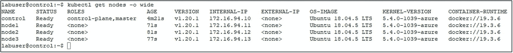
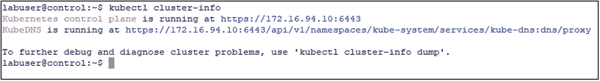
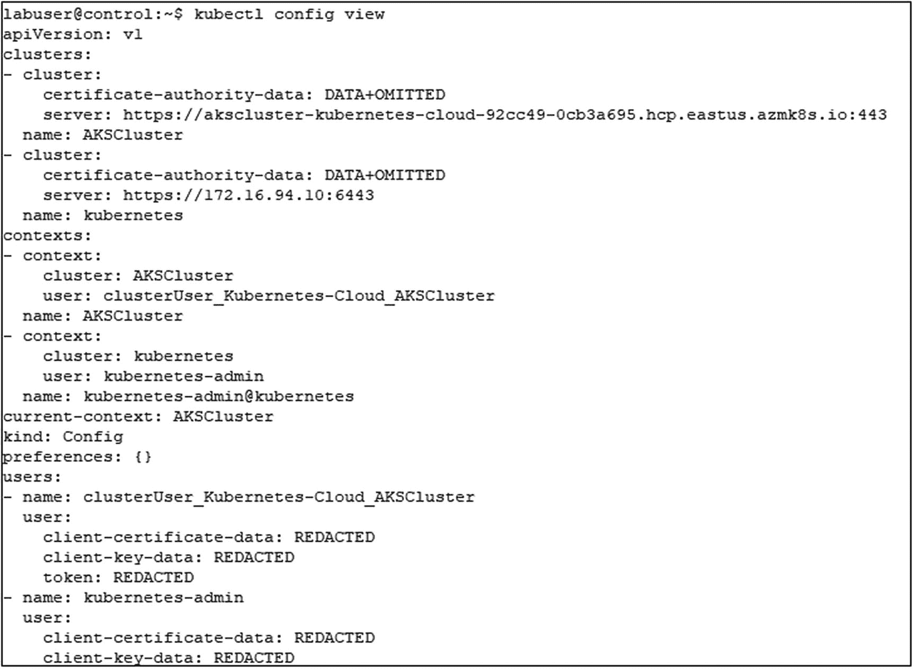
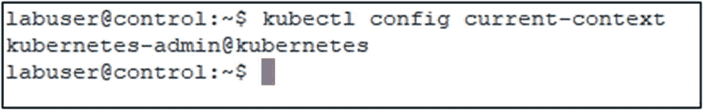
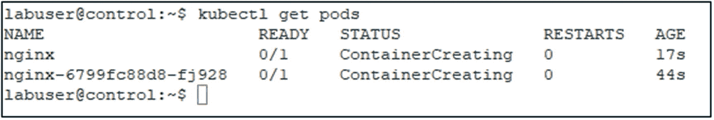
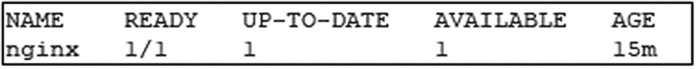
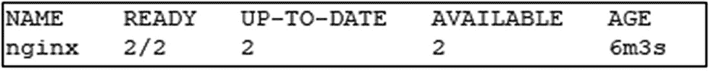
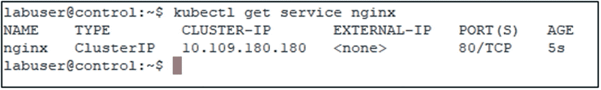
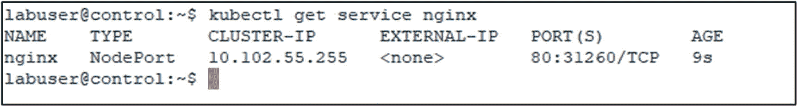

# 5.与您的 Kubernetes 集群交互

随着一个功能集群的启动和运行，我们现在将学习与我们的集群交互的核心方式， *kubectl* 。Kubectl 是命令行客户端，用于在 Kubernetes 中部署和维护应用，以及管理集群本身。有了 kubectl 预备知识，我们将学习如何在集群中部署和访问应用。

为了确保可以从管理工作站访问您的集群，使用清单 [5-1](#PC1) 中的命令将 kubectl 配置复制到集群中。

```
mkdir c:\users\labuser\.kube

$LinuxPW="Str@ngPassw0rd"

pscp -P 22 -pw $LinuxPW labuser@control:/home/labuser/.kube/config c:\users\labuser\.kube

Listing 5-1Copy kubectl config to Windows workstation

```

## 使用 kubectl 与您的集群进行交互

Kubectl 是一个命令行工具，可以创建、读取、更新或删除 Kubernetes 中几乎任何种类的资源。现在记住，在 Kubernetes 中，一切都要通过 API 服务器，所以 kubectl 是您与 API 服务器交互的主要方式。任何时候您需要在 Kubernetes 中创建、修改或查询某些东西，这都是完成这些工作的主要 CLI 工具。

大多数 kubectl 命令实际上由三部分组成:

*   **操作:**你想做什么？

*   **资源:**你想把它做到什么地步？

*   **输出:**对于产生输出的命令，输出应该如何格式化？

典型的命令类似于清单 [5-2](#PC2) 中的通用示例。

```
kubectl <operation> <resource type> <resource name> <output options>

Listing 5-2Generic kubectl command

```

例如，清单 [5-3](#PC3) 中的命令将返回集群中所有节点的详细列表。

```
kubectl get nodes -o wide

Listing 5-3Kubectl command to retrieve detailed list of nodes in a cluster

```

该命令的输出应该类似于我们在图 [5-1](#Fig1) 中看到的。



图 5-1

kubectl get node -o wide 的输出

如果您正在从一个特定的名称空间中寻找一个资源，这个过滤器也会被传递给 kubectl。清单 [5-4](#PC4) 中的命令将返回 mssql-server 名称空间中运行的所有 pod。

```
kubectl get pods -n kube-system

Listing 5-4Kubectl command to retrieve pods in a namespace

```

Note

像 Kubernetes 生态系统中的大多数工具一样，kubectl 可以跨平台运行，所以无论您是在 Windows、Linux 还是 Mac 上运行这些命令，它们都是相同的。

该语法的一个例外如清单 [5-5](#PC5) 所示。

```
kubectl cluster-info

Listing 5-5Kubectl command to get a general overview of your cluster

```

此命令不指定操作、资源或输出。这些都是不需要的，因为该命令为我们提供了群集的概况，如其控制平面 IP 地址和端口以及 KubeDNS 的状态。

您应该会收到或多或少与图 [5-2](#Fig2) 中的输出相匹配的输出。



图 5-2

kubectl 集群信息的输出

让我们仔细看看 kubectl 命令的不同部分。

### 操作

Kubernetes 中有大量使用 kubectl 的操作，所以让我们把重点放在核心操作上，更详细地看看它们:

*   **Apply:** 这将把一个文件的内容——通常是 YAML 文件——部署到您的 Kubernetes 集群。我们在前一章的集群部署中使用了这一点，例如，当我们添加法兰绒时。Apply 还将用于将应用声明性地部署到集群中。

*   **Create:** Create 允许您强制性地将资源添加到您的集群中，我们将在本章的后面更深入地了解这一点，届时我们将解释如何将应用部署到您的集群中。在许多情况下,“创建”和“应用”都可以产生相同的结果。

*   **Run:** Run 将允许您启动一个 pod 并指定容器映像，基本上是引导最基本的 pod 配置。

*   **Explain:** 这为您提供了特定 Kubernetes API 对象或资源的文档，列出了构建该对象所需的描述和字段。这在构建清单时特别有用，也可用于快速查找对象的字段名称。

*   **删除:**这将删除指定的资源。

*   **Get:**ku bectl Get 要做的是显示指定资源类型的基本信息。

*   **Describe:** Describe 为您提供详细的资源信息，这用于显示关于特定资源的非常详细的信息。当出现问题时，这是您的第一站:底部的 events 部分是故障排除的好地方。

*   **Exec:** Exec 允许您执行 pod 中容器内的命令。

*   **日志:**这允许您查看在 pod 内部运行的容器的日志。

如前所述，这是一个简短的清单，我们认为是最重要的，只是让你开始。您可以在[`https://kubernetes.io/docs/reference/kubectl/overview/#operations`](https://kubernetes.io/docs/reference/kubectl/overview/%2523operations)*找到完整的列表，我们强烈建议您查看这些列表！*

 *### 资源

当在命令行工作时，我们将把 kubectl 与一个操作结合起来，就像我们前面看到的资源操作一样。基本上，*您希望对什么*执行该操作。我们还引入了节点、pod 和服务等东西，老实说，Kubernetes 中还有很多很多我们可以使用的对象。这就是我们如何继续并指定我们想要对什么类型的资源执行操作。

一些最常见的资源类型是

*   节点(无)

*   pod(采购订单)

*   服务(服务)

现在，您可以在括号中看到一个别名来表示特定类型的资源，即 nodes no、pods po 和 services svc，这是一个很好的方法，这样我们就可以在命令行中快速执行这些命令。

当使用 kubectl 时，它们是完全同义的，所以运行清单 [5-6](#PC6) 中的命令会得到两次完全相同的结果。

```
kubectl get no
kubectl get nodes

Listing 5-6Kubectl command with and without resource type alias

```

在 [`https://kubernetes.io/docs/reference/kubectl/overview/#resource-types`](https://kubernetes.io/docs/reference/kubectl/overview/%2523resource-types) 的官方文档中有您可用的资源类型的完整列表！

顺便说一下，您还可以通过运行清单 [5-7](#PC7) 中的命令获得 Kubernetes 集群中所有可用资源类型的列表。这也是不使用操作、资源或输出选项的命令的另一个例子。

```
kubectl api-resources

Listing 5-7Kubectl command to list available resource types

```

### 输出

kubectl 命令构造的最后一部分是修改其输出。我们可以通过在命令中添加额外的标志来指定 kubectl 的输出格式。

我们想向您介绍的一个非常有用的格式是 *wide* ，它将添加关于我们的 Kubernetes 对象的附加信息，这些对象与标准输出一起工作。

我们还可以将我们的 Kubernetes 对象输出为 *YAML* 和 *JSON* 。YAML 和 JSON 格式的文件是 Kubernetes 以声明方式描述事物的核心，让我们能够用代码描述我们的配置。我们可以使用 kubectl 输出 YAML 或 JSON，这是一种非常有价值的方式，可以从我们的集群中获取配置数据，并描述我们在集群中部署的资源。如果需要，我们可以将它保存到文件中，并与其他系统、其他环境和其他开发人员交换。

另一个选项是 *jsonpath* ，它只会从 JSON 输出中获取特定的子集或值。例如，当您想要检索像端口或 IP 地址这样的值，以便随后在脚本的变量中使用时，这尤其有用。

可以在 [`https://kubernetes.io/docs/reference/kubectl/overview/#output-options`](https://kubernetes.io/docs/reference/kubectl/overview/%2523output-options) 找到输出选项的完整列表。另一个非常有用的资源，尤其是当你还在熟悉 kubectl 的时候，是 kubectl cheatsheet: [`https://kubernetes.io/docs/reference/kubectl/cheatsheet/`](https://kubernetes.io/docs/reference/kubectl/cheatsheet/) 。

### Kubectl Context

Kubectl 可以用来从同一个工作站管理多个 Kubernetes 集群。这是通过所谓的上下文来处理的。上下文是集群和用于登录该集群的凭据的组合。

让我们首先使用清单 [5-8](#PC8) 中的命令列出所有当前可用的上下文。

```
kubectl config view

Listing 5-8Show config of kubectl including all contexts

```

正如我们在图 [5-3](#Fig3) 中看到的，我们有我们的 kubernetes-admin 上下文(这是我们的 kubeadm 集群)和 AKSCluster 上下文(这是我们在 Azure Kubernetes 服务中的集群)。



图 5-3

当前 kubectl 配置视图

接下来，让我们通过运行清单 [5-9](#PC9) 中的命令来检查我们当前使用的上下文。

```
kubectl config current-context

Listing 5-9Get current kubectl context

```

如图 [5-4](#Fig4) 所示，我们当前的上下文是 kubernetes-admin，所以此时任何 kubectl 命令都将针对我们的 kubeadm 集群执行。



图 5-4

当前库对象上下文

让我们使用清单 [5-10](#PC10) 将上下文更改为 AKSCluster。

```
kubectl config use-context AKSCluster

Listing 5-10Switch kubectl context to AKSCluster

```

这将把我们当前的上下文更改为 aks-admin。kubectl 中的所有命令现在都将针对 AKS 集群执行。

Note

除非另有说明，本章和后续章节中的所有练习都应在上下文*kubernetes-admin @ kubernetes*中执行。

## Kubernetes 中的应用部署

现在我们知道了如何在命令行与集群交互，让我们将话题转移到 Kubernetes 中的应用部署。

像 Kubernetes 中的大多数命令一样，应用可以通过命令式或声明式配置来部署。

### 紧急部署

当您使用命令式配置时，您通常会在命令行上一次执行一个命令，并且一次只能操作一个对象。

让我们运行清单 [5-11](#PC11) 中的命令。

```
kubectl create deployment nginx --image=nginx

Listing 5-11Kubectl command to create a deployment using nginx

```

命令被发送到 API 服务器，API 服务器将基于 nginx 映像创建一个名为 nginx 的部署，但是我们在命令行上一次只能操作一个对象。

当然，这也适用于其他类型的对象。例如，清单 [5-12](#PC12) 中的命令将再次使用 nginx 映像，但是它将创建一个单独的 pod 来运行它。

```
kubectl run nginx --image=nginx

Listing 5-12Kubectl command to run a new nginx pod

```

虽然这无疑是一种管理系统的简单方法，但是如果您的应用堆栈开始增长，并且您的配置和部署变得更加复杂，那么在命令行管理每个单独的对象并不是管理或维护系统的真正可持续的方法。我们希望以声明的方式做事情，这是 Kubernetes 背后的核心原则，我们使用 YAML 或 JSON 在代码中定义应用或集群本身的期望状态。

让我们看看使用清单 [5-13](#PC13) 中的命令的 pod。

```
kubectl get pods

Listing 5-13kubectl command to list pods

```

我们将看到(图 [5-5](#Fig5) )我们的两个 pod:一个是我们单独构建的(名为 nginx)，另一个是我们部署的(名为 nginx-6799fc88d8-fj928)。我们的部署中的 pod 的名称是随机的，并且每次 pod 被终止以及来自相同部署的新 pod 被创建时都会改变。



图 5-5

kubectl get pods 的输出

在我们继续进行声明性部署之前，让我们使用清单 [5-14](#PC14) 中的命令清理并删除之前创建的部署和 pod。

```
kubectl delete deployment nginx
kubectl delete pod nginx

Listing 5-14Kubectl command to remove the imperatively created resources

```

部署的删除将立即完成，而单个 pod 的删除只有在 pod 终止和删除后才会返回。

### 声明性部署

无论是对于更复杂的场景，还是简单地利用更简单的方法将对象的相同配置部署到另一个集群——例如，当将应用从开发系统推到测试系统时——因此强烈建议使用基于清单的声明性方法。您的清单也应该进入您的源代码控制系统，就像您在环境中使用的任何其他代码一样。在这种情况下，我们将只使用一个可以用 JSON 或 YAML 编写的清单，并使用类似清单 [5-15](#PC15) 中的命令将其提供给 API 服务器。顺便说一下，Kubernetes 会将 YAML 编写的清单转换成 JSON。

```
kubectl apply -f deployment.yaml

Listing 5-15Kubectl command to feed a YAML file to the API Server

```

这个命令将获取 deployment.yaml 文件的内容，并将它们传递给 Kubernetes 的 API 服务器，以创建清单中定义的资源。

清单可以由许多不同的对象类型组成，因此我们可以有一个 YAML，它首先创建一个存储类，然后是持久化卷和卷声明，最后是部署和服务定义。都在同一个文件里。所有这些都通过命令行上的一个命令进行部署。

如前所述，我们可以使用 kubectl 通过输出来生成这些清单。让我们首先使用清单 [5-16](#PC16) 中的代码为一个部署生成一个清单，该清单与我们之前强制创建的清单相匹配。为此，我们添加了一个输出格式和模拟开关，这将只生成清单，但不会向我们的集群部署任何东西。

```
kubectl create deployment nginx --image=nginx --dry-run=client -o yaml

Listing 5-16Kubectl command to generate YAML manifest for nginx deployment

```

输出可以在清单 [5-17](#PC17) 中找到。

```
apiVersion: apps/v1
kind: Deployment
metadata:
  creationTimestamp: null
  labels:
    app: nginx
  name: nginx
spec:
  replicas: 1
  selector:
    matchLabels:
      app: nginx
  strategy: {}
  template:
    metadata:
      creationTimestamp: null
      labels:
        app: nginx
    spec:
      containers:
      - image: nginx
        name: nginx
        resources: {}

Listing 5-17Manifest generated from previous listing

```

让我们再次生成该清单，但这一次，我们将把输出重定向到一个名为 nginx.yaml 的文件，如清单 [5-18](#PC18) 所示。

```
kubectl create deployment nginx --image=nginx --dry-run=client -o yaml > nginx.yaml

Listing 5-18Kubectl command to generate YAML manifest for nginx deployment redirected to a file

```

我们现在可以获取该文件并以声明方式创建部署。使用清单 [5-19](#PC19) 中的命令完成此操作。

```
kubectl apply -f nginx.yaml

Listing 5-19Declarative deployment using the previously generated manifest

```

这将生成与上一个类似的部署。通过运行清单 [5-20](#PC20) 中的命令，我们可以验证我们的一个副本(如清单中所定义的)已经准备好了。

```
kubectl get deployment nginx

Listing 5-20Check the status of this deployment

```

如图 [5-6](#Fig6) 所示，输出将确认我们部署的状态。



图 5-6

kubectl get 部署 nginx 的输出

### 修改部署

当然，不需要完全重新部署，也可以修改现有的部署。

例如，假设您想要更新现有部署中的副本(或单元)数量。

乍看之下，最简单的方法似乎是强制这样做，如清单 [5-21](#PC21) 所示。

```
kubectl scale deployment nginx --replicas=2

Listing 5-21Scale up nginx deployment to two replicas

```

正如您在图 [5-7](#Fig7) 中看到的，部署现在显示了两个副本。



图 5-7

重新调整到两个副本后，kubectl get deployment nginx 的输出

但是现在，我们的清单文件和部署不同步，因为清单仍然只反映一个副本。

更好的方法是使用文本编辑器编辑清单。在您选择的文本编辑器中打开文件，并用清单 [5-23](#PC23) 中所示的 20 个副本的新定义替换清单 [5-22](#PC22) 中所示的原始副本定义。

```
spec:
  replicas: 20

Listing 5-23New replica definition with 20 replicas

```

```
spec:
  replicas: 1

Listing 5-22Existing replica definition with one replica

```

现在，我们可以重新应用清单(参见清单 [5-24](#PC24) ，这将把我们的部署扩展到 20 个副本。

```
kubectl apply -f nginx.yaml

Listing 5-24Applying the new definition using kubectl

```

正如您在图 [5-8](#Fig8) 中看到的，部署现在显示了 20 个副本(注意，所有这些副本显示为就绪需要一些时间)。


图 5-8

重新调整到 20 个副本后，kubectl get deployment nginx 的输出

修改现有对象的第三种方法是 *kubectl edit* 。虽然这也带来了 YAML 文件和集群上实际部署的文件之间失去同步的缺点，但这是一种非常方便的方式，例如，一次对一个部署进行多次更改。

运行清单 [5-25](#PC25) 中的代码。

```
kubectl edit deployment nginx

Listing 5-25Edit a running deployment

```

这将在您的默认文本编辑器中打开当前部署的完整清单。找到带有先前定义的 20 个副本的行，并将其更改为 30。当关闭并保存这个编辑器时，这些更改将立即被应用，我们可以使用 kubectl get deployment 再次检查这一点。结果也如图 [5-9](#Fig9) 所示。


图 5-9

重新调整到 30 个副本后，kubectl get deployment nginx 的输出

## 公开和访问集群中的服务

现在，我们有了 nginx 的大规模部署，但是在 pods 中运行的应用还不可访问。让我们继续前进，将该部署公开为 Kubernetes 服务，并为我们的应用运行提供一个持久的 IP 地址和端口。

可以使用 *kubectl expose* 来创建服务。

### 公开 ClusterIP 类型的服务

如果您运行清单 [5-26](#PC26) 中的代码，这将创建一个在端口 80 上公开的服务，目标也是端口 80(因为这是 nginx 的默认端口)。

```
kubectl expose deployment nginx --port=80 --target-port=80

Listing 5-26Expose nginx deployment as a ClusterIP service

```

端口定义了服务监听的端口，而目标端口是应用在容器内部监听的端口。由于我们没有提供任何其他选项，该服务的类型将是 ClusterIP，这是默认的服务类型。我们可以通过运行清单 [5-27](#PC27) 中的命令看到这一点。

```
kubectl get service nginx

Listing 5-27Get service details

```

正如您在图 [5-10](#Fig10) 中看到的，这也显示了运行该服务的 IP 地址。



图 5-10

kubectl get 服务 nginx 的输出

虽然所有这些命令都是必不可少的——正如我们之前提到的，这对于测试来说很好，但通常应该使用 YAML 清单——您也可以通过添加模拟运行开关来修改命令，以生成 YAML 清单，然后您可以将它应用到您的集群，如清单 [5-28](#PC28) 所示。

```
kubectl expose deployment nginx --port=80 --target-port=80
--dry-run=client -o yaml

Listing 5-28Create manifest to expose nginx deployment as a ClusterIP service

```

顺便说一下，如果您只想检索 ClusterIP，这是输出格式 jsonpath 的完美用例，如清单 [5-29](#PC29) 所示。当将这个值存储在自动化脚本的变量中时，这尤其有用。

```
kubectl get service nginx -o jsonpath='{ .spec.clusterIP }'

Listing 5-29Retrieve only the ClusterIP through kubectl

```

例如，我们现在可以通过运行清单 [5-30](#PC30) 中的 *curl* 请求来访问这个服务(确保将 IP 地址改为集群中服务的 ClusterIP)。

```
curl http://10.109.180.180/

Listing 5-30Access ClusterIP service

```

正如我们在第 [3](03.html) 章中所阐述的，ClusterIP 服务可以从集群中的任何节点和单元访问，但不能从外部访问。根据您的应用场景，这可能足够，也可能不够。让我们假设您想要确保您的服务可以从集群外部访问。

首先，使用清单 [5-31](#PC31) 中的命令删除现有的服务。

```
kubectl delete service nginx

Listing 5-31Delete nginx service

```

### 公开节点端口类型的服务

如果您想要公开一个服务，以便它也可以从不属于您的 Kubernetes 集群的机器上被访问，我们需要将这个服务公开为 NodePort 类型。

为此，我们简单地添加类型开关，如清单 [5-32](#PC32) 所示。

```
kubectl expose deployment nginx --port=80 --target-port=80 --type=NodePort

Listing 5-32Expose nginx deployment as a NodePort service

```

让我们使用清单 [5-33](#PC33) 中的命令来看看这个服务。

```
kubectl get service nginx

Listing 5-33Get service details

```

正如您在图 [5-11](#Fig11) 中看到的，服务现在显示了 NodePort 类型以及我们的服务已经部署的(动态)端口。



图 5-11

kubectl get 服务 nginx 的输出

该端口在服务的生命周期内不会更改。如果您删除并再次暴露它，它很可能会显示一个不同的端口。

就像前面例子中的 ClusterIP 一样，我们可以使用 jsonpath 只检索 NodePort，如清单 [5-34](#PC34) 所示。

```
kubectl get service nginx -o jsonpath='{ .spec.ports[*].nodePort }'

Listing 5-34Retrieve only the nodePort through kubectl

```

可以在 Kubernetes 集群的任何节点上访问 NodePort 类型的服务。在我们的例子中，清单 [5-35](#PC35) 中显示的请求可能都在我们部署的不同副本上结束，但是都将产生相同的输出。

```
curl http://control:31260
curl http://node1:31260
curl http://node2:31260
curl http://node3:31260

Listing 5-35Access NodePort service

```

### 公开 LoadBalancer 类型的服务

例如，如果您的 Kubernetes 正在 Azure Kubernetes 服务上运行，您需要使用 LoadBalancer 类型公开服务，这将为您提供一个外部 IP 地址，用于访问服务。这只能在云场景或具有 Kubernetes 集成负载平衡器的内部场景中工作。

让我们从展示清单 [5-36](#PC36) 中所示的部署开始。

```
kubectl expose deployment nginx --port=80 --target-port=80 ​--type=LoadBalancer

Listing 5-36Expose nginx deployment as a LoadBalancer service

```

然后，我们可以再次获得完整的服务细节或者只是服务 IP 地址，如清单 [5-37](#PC37) 所示。

```
kubectl get service nginx
kubectl get service nginx -o jsonpath='{.status.loadBalancer.ingress[0].ip }'

Listing 5-37Get service details

```

使用这个服务 IP 地址，我们可以从外部客户端访问我们的部署。

## 摘要

在这一章中，我们介绍了使用 kubectl 与 Kubernetes 集群进行交互的不同方式，以便从中获取各种不同类型的信息。我们还研究了如何使用命令式和声明式部署方法来部署和访问应用。让我们进入下一章，了解更多关于 Kubernetes 集群中的存储！*