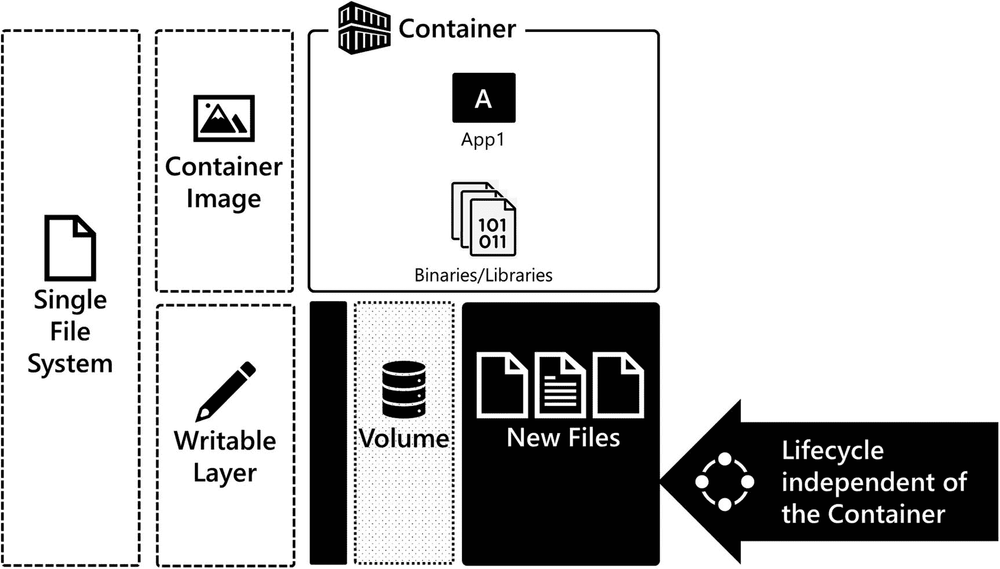

# 6.在 Kubernetes 中存储持久数据

在这一章中，我们将深入探讨基于容器的应用程序中对数据持久性的需求，以及容器如何持久化数据的内部机制。我们将介绍 Kubernetes 中的核心存储概念，例如 Kubernetes 如何使用卷、持久卷和持久卷声明来存储数据，如何提供存储，以及 Kubernetes 如何控制对该存储的访问。我们研究静态和动态供应场景，特别是在我们的实验室中使用 NFS 和 Azure Kubernetes 服务。

## 基于容器的应用程序对数据持久性的需求

正如您在第 [2](02.html) 章中了解到的，容器图像是只读的。当在容器内创建或更改数据时，数据被写入可写层。容器运行时将容器映像和可写层合并到一个文件系统中，容器内运行的应用程序可以看到该文件系统。删除容器时，容器及其可写层都将被删除，可写层中的数据也将永久消失。不是存储持久数据(如数据库数据)的最佳位置。如图 [6-1](#Fig1) 所示，可写层具有容器的生命周期。


图 6-1

容器将数据写入可写层，可写层与容器具有相同的生命周期。当容器被移除时，可写层中的数据也被移除

所以问题是，如何独立于容器的生命周期在容器中存储持久数据？这就是成交量的来源。卷允许您将存储附加到容器，任何创建或更改的数据都将写入该卷。卷具有独立于容器的生命周期，卷是容器运行时使用的持久存储模型。图 [6-2](#Fig2) 突出显示了如何将卷装入文件系统，为容器提供独立于容器生命周期的持久存储。

本章将该模型扩展到 Kubernetes，您将了解 Kubernetes 如何为在 Pod 内部运行的有状态应用程序提供存储，这是独立于 Pod 生命周期的。



图 6-2

卷允许容器独立于容器的生命周期保存数据。移除容器后，卷中的数据会保留下来，并可以附加到新的和其他容器中

## 存储库存储

为了在 Kubernetes 中部署有状态的应用程序，Kubernetes 集群必须实现一些核心功能。首先，群集需要将存储作为应用程序的卷调配和连接到 Pod。接下来，根据应用程序体系结构，群集需要控制对该存储的访问，以实现安全性和应用程序兼容性。Kubernetes API 公开了几个对象，这些对象支持部署有状态应用程序所需的供应、配置和访问控制。下面是 Kubernetes 用来支持有状态应用程序的 API 对象列表:

*   **Volumes:** 作为 Pod 规范的一部分，Volume 是一个可以由 Pod 中运行的容器装载的存储。

*   **持久卷:**集群中由管理员定义和配置或由存储类动态提供的存储。

*   **持久卷声明:**用户在清单中的存储请求。

*   **存储类别:**集群管理员定义集群中可用于配置的存储类别(或组)的一种方式。存储类别有助于动态配置，即按需创建永久卷，以满足用户通过永久卷声明提出的存储请求。

现在让我们更仔细地看看这些 API 对象，以及它们如何使您能够在 Kubernetes 中部署有状态的应用程序。

## 卷

卷是由节点公开的存储资源，安装在 Pod 内部。它是节点上的一个目录或数据块设备，可在 Pod 中运行的容器内访问。一个卷可以由一个 Pod 中的多个容器装载，从而可以在 Pod 中的容器之间共享数据。在规范中，卷被定义为 Pod 的一部分，其生命周期独立于容器，但依赖于 Pod，这意味着当 Pod 被删除时，对卷的访问也被删除。但是，卷上的数据不会被破坏，并且可以连接到新的 pod。

Kubernetes 提供多种类型的卷。根据所分配的存储类型，每种类型的卷都需要独特的配置。在下文中，您将发现 Kubernetes 中常用卷类型的集合。使用卷时，每种卷类型都有唯一的配置属性:

*   **主机路径:**Pod 中节点文件系统上的挂载目录。

*   **Local:** 节点上挂载的存储设备。

*   **NFS:** 将一个现有的 NFS 导出装载到一个 Pod 中。

*   **光纤通道和 iSCSI:** 阻止通过存储网络访问远程存储。

*   **云存储:**访问每个主要云提供商的远程存储块设备和文件服务:
    *   AWS 弹性块存储

    *   蓝色磁盘

    *   蔚蓝文件

    *   GCE 永久磁盘

*   **秘密和配置图:**将包含配置数据的集群 API 对象暴露到 pod 中。

*   **持久卷声明:**请求访问集群中的存储。

完整名单请见 [`https://kubernetes.io/docs/concepts/storage/ volumes/`](https://kubernetes.io/docs/concepts/%2520storage/volumes/) 。

对于 NFS、光纤通道甚至云存储等卷类型，它们需要特定于基础架构的配置元素。例如，当使用 NFS 时，您需要定义 NFS 服务器的网络位置以及您想要访问的导出。当使用云存储时，您需要为想要访问的虚拟磁盘定义一个唯一的标识符，例如资源 ID 或卷 ID。在 Pod 规格中包含特定于基础架构的配置意味着在 Kubernetes 集群之间移动该代码具有挑战性，因为您需要更改 Pod 规格以匹配目标 Kubernetes 集群的存储环境。这增加了出错的风险，降低了代码的可移植性。持续的批量声明有助于解决这一难题。我们将在本章后面了解更多关于持久卷声明的内容。

首先，让我们看看如何在 Pod 中配置卷。在下面的例子中，我们定义了一个运行 *nginx* 的 Pod。该 Pod 也有一个已定义的体积。该卷是一个 NFS 卷，可以访问我们实验室环境中存储服务器上的文件系统。在本例中，NFS 客户端需要额外的配置参数，即 NFS 服务器的网络位置和我们想要装载的 NFS 服务器上的导出路径。需要强调的是，卷是在单元级别定义的，可以安装到单元中运行的任何容器中。在 Pod 中，使用 *volumeMounts* 字段将卷附加到容器中。在清单 [6-1](#PC1) 中，您可以看到使用位置`/usr/share/nginx/html/web-app`处的 *mountPath* 字段挂载到文件系统中的卷名 webcontent。

```
apiVersion: v1
kind: Pod
metadata:
  name: nginx-pod
spec:
  containers:
  - name: nginx
    image: nginx
    ports:
    - containerPort: 80
    volumeMounts:
    - name: webcontent
      mountPath: "/usr/share/nginx/html/web-app"
  volumes:
  - name: webcontent
    nfs:
      server: 172.16.94.5
      path: "/srv/exports/volumes/webcontent"

Listing 6-1Using a Volume in a Pod Spec (volume.yaml)

```

在控制节点上，让我们用`-o wide`输出修饰符获得一个 Pod 列表，以获得 Pod 的 IP 地址，并使用这个 Pod IP 和 curl 来访问 nginx。在图 [6-3](#Fig3) 中，我们正在使用`kubectl get pods -o wide,`，在输出中，您可以看到 nginx Pod 正在运行。


图 6-3

使用存储在永久存储器上的内容访问 nginx

在图 [6-4](#Fig4) 中，您可以看到`/user/share/nginx/html/web-app`处 Pod 内部的持久存储映射。


图 6-4

查看 Pod 内永久存储器上存储的内容

在图 [6-5](#Fig5) 中，您可以看到内容在网络上的物理存储位置。它在`/srv/exports/volumes/webcontent`存储在 NFS 服务器上。当这个 Pod 被调度到集群中的一个节点上时，kubelet 负责将存储附加到该节点，并将其公开给 Pod。


图 6-5

查看存储在 NFS 服务器上的内容

卷为 Kubernetes 中的持久存储提供了解决方案。但是，正如您在代码示例中看到的，清单中有特定于基础结构的代码。这意味着如果您想在另一个集群中使用这段代码，就需要更新清单，这增加了维护工作，降低了代码的可移植性。Kubernetes 的设计者和维护者看到了这个问题，并引入了一个解决方案。回到 Kubernetes 用来支持有状态应用程序的 API 对象，这里列出了一个卷类型，持久卷声明。这种卷类型使我们能够将特定于基础设施的代码分离成单独的 API 对象，即持久卷和持久卷声明。让我们向前看，更详细地探索这些对象。

## 持久卷和持久卷声明

您刚刚学习了在 Kubernetes 中如何使用卷向 Pod 公开存储。但是您也看到了在 Pod 规范中包含特定于基础设施的代码会增加维护并降低清单的可移植性。让我们看看持久卷和持久卷声明如何帮助解决这些挑战，并将特定于基础架构的代码移出 Pod 规范。

### 持久卷

持久卷是 Kubernetes 中的一种 API 资源，由集群管理员定义，或者由集群使用存储类动态提供。持久卷的生命周期独立于容器和 Pod。就像宗卷一样，每个永久宗卷都有一个类型，它定义了您想要附加到 pod 的存储类型。现在，当您使用永久卷时，永久卷对象保存附加到 Pod 的存储的实施细节，而不是在 Pod 规范中包含存储的技术实施细节。在 Pod 规范中，有一个对称为持久卷声明的存储 API 对象的引用。持久卷声明是群集将持久卷映射到 Pod 的请求。

根据持久卷的类型(块或文件系统),持久卷通过 kubelet 挂载或附加到节点上。容器运行时的职责是向 Pod 内的容器公开挂载或附加的持久卷。持久卷是集群中的非命名空间资源，这意味着如果需要，它可以跨命名空间共享。

### 访问模式

持久卷的访问模式定义了对持久卷对象的访问模式。每个永久卷都有一个描述底层存储能力的访问模式。

下表详细列出了 Kubernetes 持久卷和持久卷声明中支持的访问模式:

*   **ReadWriteOnce (RWO):** 只有一个节点可以通过读/写权限访问永久卷。

*   **ReadWriteMany (RWX):** 多个节点可以通过读/写访问来访问永久卷。

*   **ReadOnlyMany (ROX):** 多个节点可以以只读方式访问永久卷。

所选择的访问模式取决于将使用持久卷的应用程序和底层持久卷存储类型。例如，由于 NFS 的性质，NFS 导出可以支持许多读/写客户端。但是，与虚拟磁盘一样，块设备通常只支持一台主机的读写访问，因为由于虚拟磁盘的性质，底层虚拟磁盘通常无法连接到多台主机。在应用程序方面，像 SQL Server 这样的应用程序只能有一个进程同时打开一个数据库文件，需要`ReadWriteOnce`。另一方面，静态文件(如 web 内容)可以是`ReadOnlyMany`，然后可以将持久性卷附加到许多 pod 上，以便对存储在持久性卷中的内容进行横向扩展访问。

访问模式是节点级别，而不是单元级别。因此，即使持久卷是`ReadWriteOnce,`节点上运行的 Pods 也可能访问持久卷。由正在部署的应用程序及其配置来确保在某个时间点只有一个 Pod 正在访问持久性卷。

### 持久卷的类型

Kubernetes 支持持久卷的大量存储类型。以下是我们在 Kubernetes 中使用有状态应用程序时在现场看到的更常见的持久卷类型:

*   **主机路径:** A 将节点文件系统上的一个目录挂载到 Pod 中。

*   **Local:** 节点上挂载的存储设备。

*   **NFS:** 将一个现有的 NFS 导出装载到一个 Pod 中。

*   **光纤通道和 iSCSI:** 阻止通过存储网络访问远程存储。

*   **云存储:**访问每个主要云提供商的远程存储块设备和文件服务:
    *   awsElasticBlockStore

    *   azureDisk

    *   azureFiles

    *   gcePersistentDisk

有关持久卷类型和配置示例的完整列表，请查看 [`https://kubernetes.io/docs/concepts/storage/persistent-volumes/`](https://kubernetes.io/docs/concepts/storage/persistent-volumes/) 。

### 定义持久卷

让我们看看描述持久卷所需的代码(清单 [6-2](#PC2) )。在示例中，您可以看到我们在字段`spec.capacity.storage`中将大小定义为 10GB，在`spec.accessModes`中定义了访问模式，并选择了`ReadWriteMany`。因此群集中不止一个节点可以访问这个持久卷。这个持久卷的类型是`nfs`，因此您可以看到访问 NFS 服务器和路径的实现细节。每种类型的永久卷都有唯一的配置参数。有关其他类型的永久卷的配置详细信息，请查看前面的链接。

```
apiVersion: v1
kind: PersistentVolume
metadata:
  name: pv-nfs-data-static
spec:
  capacity:
    storage: 10Gi
  accessModes:
    - ReadWriteMany
  nfs:
    server: 172.16.94.5
    path: "/srv/exports/volumes/webcontent"

Listing 6-2Example Persistent Volume (pv.yaml)

```

### 持续量声明

当应用程序想要连接到集群中的持久卷时，必须创建持久卷声明。持久卷声明是用户对存储的请求。永久卷声明使您可以只向集群请求存储，而不必在 Pod 规范中提供实施细节。这允许应用程序配置的可移植性，并使您的部署清单在定义 pod 和更高级别的构造时独立于集群，将特定于基础设施的代码从部署代码中分离到专用的存储对象中。

永久卷声明请求基于大小和访问模式，并且由集群中的控制器将永久卷声明映射到永久卷。这个过程叫做绑定。持久卷声明是一种命名空间资源，它绑定到没有命名空间的持久卷。

Note

将永久卷声明绑定到永久卷时，如果群集无法找到基于大小的精确匹配，则可以将声明绑定到大于永久卷声明的请求大小的永久卷。

### 定义持久卷声明

在清单[中，6-3](#PC3) 是持久卷声明的代码。在声明中，我们在字段`spec.resources.requests.storage`中定义了 10GB 的大小，在字段`spec.accessModes.ReadWriteMany`中定义了访问模式。一旦这个 YAML 清单被发送到 API 服务器，集群将尝试查找与持久卷声明的大小和访问模式相匹配的持久卷。这个过程叫做*绑定*，对象的状态变为*绑定*。创建持久卷资源和持久卷声明的过程称为*静态供应*。假设无法为持久卷声明找到持久卷；状态为*未绑定*。如果找不到持久卷，这将阻止从群集请求存储的 Pod 的启动，并且 Pod 将处于*挂起*状态。如果创建了持久卷，并且没有持久卷声明，则其状态为*可用*。

```
apiVersion: v1
kind: PersistentVolumeClaim
metadata:
  name: pvc-nfs-data-static
spec:
  accessModes:
    - ReadWriteMany
  resources:
    requests:
      storage: 10Gi

Listing 6-3Example Persistent Volume Claim (pvc.yaml)

```

## 永久卷和永久卷声明的静态供应

有了这些理论之后，让我们静态地提供一个持久卷和持久卷声明，并部署一个将这些资源用于持久存储的应用程序。

### 供应用程序使用的静态配置存储

首先，使用清单 [6-2](#PC2) (pv.yaml)中的代码创建持久卷，然后执行`kubectl get pv` (pv 是持久卷的别名/首字母缩写)来获取持久卷的状态。在图 [6-6](#Fig6) 中，您可以看到名称`pv-nfs-data-static`，其容量`10GB`，其访问模式`ReadWriteMany`，其回收策略`Retain`，以及其状态`Available`，因为还没有对其进行声明。最后，存储类为空，因为该永久卷不是存储类的一部分。


图 6-6

kubectl get pv 的输出

接下来，使用清单 [6-3](#PC3) (pvc.yaml)中的代码创建持久卷声明，然后执行`kubectl get pvc` (pvc 是持久卷声明的别名/首字母缩写)来获取持久卷声明的状态。在图 [6-7](#Fig7) 中，可以看到持久卷声明的名称，其状态为绑定，该卷就是其绑定的持久卷，`pv-nfs-data-static`。这是之前刚刚静态配置的持久卷，`pv-nfs-data-static`。声明的容量为`10GB`，访问模式为`ReadWriteMany(RWX),`，并且不是存储类的成员。


图 6-7

kubectl get pvc 产量。持久卷声明绑定到 pv-nfs-data-static

当我们创建持久卷声明`pvc-nfs-data-static`时，集群中的一个控制器开始根据大小和访问模式寻找持久卷来满足声明。集群找到了`pv-nfs-data-static`，然后两者绑定在一起。在图 [6-8](#Fig8) 中，我们再次执行`kubectl get pv`。持久卷`pv-nfs-data-static`的状态现已绑定，声明为`default/pvc-nfs-data-static`。默认值是永久卷声明所在的命名空间的名称。


图 6-8

kubectl get pv 的输出带有一个绑定的持久卷和持久卷声明

### 使用持久存储部署应用程序

有了通过静态资源调配创建的存储资源，就该在应用程序中使用该存储了。在清单[中，6-4](#PC4) 是一个使用存储的应用程序的部署清单。在 Pod 模板规范中，卷`webcontent`的类型为`persistentVolumeClaim`。索赔名称是`pvc-nfs-data-static`。这是刚才创建的持久卷声明对象。因此该 Pod 将尝试访问持久卷声明。卷是 Pod 级别的资源，可以在 Pod 中运行的任何容器之间共享。通过*容器*字段将卷映射到容器。字段 volumeMounts 指定了卷在容器文件系统中的挂载位置——在本例中为`/usr/share/nginx/html/web-app`。因此，容器内的应用程序访问该路径，但数据实际上存储在持久卷上，该卷位于实验室的 NFS 服务器上，路径为`/srv/exports/volumes/webcontent`。这是 nginx 的默认内容目录。因此，当应用程序可用时，这个目录中的内容可以通过 HTTP 获得。

```
apiVersion: apps/v1
kind: Deployment
metadata:
  name: nginx-nfs-deployment
spec:
  replicas: 1
  selector:
    matchLabels:
      app: nginx
  template:
    metadata:
      labels:
        app: nginx
    spec:
      volumes:
      - name: webcontent
        persistentVolumeClaim:
          claimName: pvc-nfs-data-static
      containers:
      - name: nginx
        image: nginx
        ports:
        - containerPort: 80
        volumeMounts:
        - name: webcontent
          mountPath: "/usr/share/nginx/html/web-app"
---
apiVersion: v1
kind: Service
metadata:
  name: nginx-nfs-service
spec:
  selector:
    app: nginx
  ports:
  - port: 80
    protocol: TCP
    targetPort: 80

Listing 6-4A Deployment using persistent storage (deployment-static.yaml)

```

在图 [6-9](#Fig9) 中，您可以看到我们的 web 应用程序正在访问 index.html*NFS 服务器*上的内容。


图 6-9

获取服务的 IP 地址，并使用 curl 访问应用程序。返回的文档来自 NFS 服务器

在图 [6-10](#Fig10) 中，您可以看到我们在部署中的一个 pod 中打开了一个 bash shell，并列出了`/usr/share/nginx/html/web-app/`的目录内容，来自 NFS 服务器的内容在该目录中可用。


图 6-10

Pod 内已装入卷的目录列表

最后，在图 [6-11](#Fig11) 中，您可以在存储服务器上看到，在 NFS 导出目录中，这是通过持久卷向 Pod 公开的导出，并装载到容器中以供 nginx 访问。


图 6-11

存储在 NFS 服务器上的内容的目录列表

在本节中，我们使用静态配置为 web 应用程序部署创建存储—创建持久卷和持久卷声明，然后使用该持久卷声明作为附加在 Pod 内的卷。

## 存储类别和动态配置

静态配置是集群管理员手动定义和创建每个持久卷的地方，正如我们在上一节中所探讨的那样。创建永久卷声明资源时，动态预配置会按需创建永久卷资源。这可能是有利的，因为它使群集管理员不必为用户请求手动配置存储。为了便于动态配置，集群管理员创建了一个存储类。让我们详细了解一下 Kubernetes 中动态预配置的工作原理。

### 存储类别

要启用动态配置，集群管理员需要创建一个存储类。存储类是一个 API 对象，用于描述集群中可供分配的存储类。存储类别使您能够定义这些存储层及其配置。然后，您可以动态分配持久卷来访问该存储，并将其附加到集群中的 pod。对存储进行分组的常见方法包括底层存储基础架构的性能属性，如第 1 层固态磁盘或第 2 层硬盘驱动器，或者在云高级或标准存储类型中。

存储类使用供应器，有时称为卷插件，它是部署在集群中的软件，当创建持久卷声明时，它与底层存储基础架构交互操作以创建存储对象，并将该存储作为持久卷呈现回集群。特定于基础架构的配置参数在存储类中定义，并用作从存储类动态分配的永久卷的模板。定义存储类时，您可以配置默认存储类。默认存储类是当永久卷声明未在其清单中指定存储类时使用的存储类。

Note

有关可在 Kubernetes 中使用的许多不同类型存储的存储类配置示例，请查看 [`https://kubernetes.io/docs/concepts/storage/storage-classes/`](https://kubernetes.io/docs/concepts/storage/storage-classes/) 。

### 动态供应

使用集群中定义的存储类，当您创建永久卷声明时，存储类的卷插件会动态创建永久卷。动态配置可用于许多不同类型的物理和云存储，如 Azure 磁盘、Azure 文件、AWS 弹性块存储、光纤通道、GCE 持久磁盘、iSCSI 和 vSphere VMDK。有关支持动态预配置的存储类型的完整列表，请访问 [`https://kubernetes.io/docs/concepts/storage/storage-classes/`](https://kubernetes.io/docs/concepts/storage/storage-classes/) 。

## 回收政策

当应用程序使用永久卷结束并且消费对象(例如 Pod 或部署)被删除时，永久卷声明可以被删除。一旦永久卷声明被删除，回收策略告诉集群如何处理永久卷。目前支持的选项有*保留*和*删除*。回收策略适用于静态和动态调配的永久卷:

*   **Retain:** 当永久卷声明被删除时，保留永久卷及其底层存储

*   **删除:**当永久卷声明被删除时，删除永久卷及其底层存储

回收策略保护持久卷对象的重用，而不是底层存储。如果在删除永久卷声明对象时使用保留回收策略，永久卷对象将不会被删除。永久卷的状态将是*已释放*。如果您想要重用存储在持久卷中的数据，则底层存储需要由集群管理员手动回收。您需要删除持久卷对象，保持底层存储元素不变。然后，您将再次创建一个新配置到该设备的永久卷。这是一个全新的持久卷，但只是重用了底层存储。如果您不打算重用存储，那么集群管理员需要删除底层存储。

对于支持动态资源调配的系统和存储类型，通常使用删除回收策略。当永久卷声明被删除时，删除回收策略删除永久卷及其底层存储。这要求底层存储使用支持动态预配置的卷插件。存储类经常使用*删除回收策略*，给你一种回收/动态物理存储分配给集群的感觉。当在 Azure/GKE/EKS 和其他地方使用虚拟磁盘时，你会在云场景中最常见到这种情况。随着存储子系统开始支持动态资源调配，这种类型的功能在内部变得越来越常见。请咨询您的存储管理员和供应商，了解您的存储系统是否支持动态资源调配。

## 对永久卷和永久卷声明使用动态预配置

在本节中，我们将介绍如何在应用程序部署中使用 Kubernetes 中的存储动态预配置。我们将展示两个场景，基于 NFS 的内部实验室场景和基于 Azure Disk 的云场景。

### 使用 NFS 动态配置磁盘

在本书的实验室环境中，我们选择使用 NFS 是因为它的简单性和可访问性……NFS 易于配置并且广泛可用。对于内部生产场景，请考虑为您的集群和应用程序数据使用企业级存储。

在上一节中，我们刚刚探讨了 NFS 的静态资源调配。让我们深入了解一下如何在实验集群中为 NFS 配置动态预配置。这种配置支持本书后面的演示。我们还想指出，这里强调的动态预配配置概念与其他动态预配器类似。

我们将从清单 [6-5](#PC5) 中的代码开始，为 NFS 动态供应器配置安全性。

```
kind: ServiceAccount
apiVersion: v1
metadata:
  name: nfs-client-provisioner
---
kind: ClusterRole
apiVersion: rbac.authorization.k8s.io/v1
metadata:
  name: nfs-client-provisioner-runner
rules:
  - apiGroups: [""]
    resources: ["persistentvolumes"]
    verbs: ["get", "list", "watch", "create", "delete"]
  - apiGroups: [""]
    resources: ["persistentvolumeclaims"]
    verbs: ["get", "list", "watch", "update"]
  - apiGroups: ["storage.k8s.io"]
    resources: ["storageclasses"]
    verbs: ["get", "list", "watch"]
  - apiGroups: [""]
    resources: ["events"]
    verbs: ["create", "update", "patch"]
---
kind: ClusterRoleBinding
apiVersion: rbac.authorization.k8s.io/v1
metadata:
  name: run-nfs-client-provisioner
subjects:
  - kind: ServiceAccount
    name: nfs-client-provisioner
    namespace: default
roleRef:
  kind: ClusterRole
  name: nfs-client-provisioner-runner
  apiGroup: rbac.authorization.k8s.io
---
kind: Role
apiVersion: rbac.authorization.k8s.io/v1
metadata:
  name: leader-locking-nfs-client-provisioner
rules:
  - apiGroups: [""]
    resources: ["endpoints"]
    verbs: ["get", "list", "watch", "create", "update", "patch"]
---
kind: RoleBinding
apiVersion: rbac.authorization.k8s.io/v1
metadata:
  name: leader-locking-nfs-client-provisioner
subjects:
  - kind: ServiceAccount
    name: nfs-client-provisioner
    namespace: default
roleRef:
  kind: Role
  name: leader-locking-nfs-client-provisioner
  apiGroup: rbac.authorization.k8s.io

Listing 6-5nfs-rbac.yaml

```

接下来，我们将定义存储类本身(清单 [6-6](#PC6) )。

```
apiVersion: storage.k8s.io/v1
kind: StorageClass
metadata:
  name: nfs-storage
provisioner: example.com/nfs
parameters:
  archiveOnDelete: "false"

Listing 6-6nfs-storageclass.yaml

```

这个特定的类还需要 Kubernetes API 服务器中的一个设置。因此，我们需要更新 API 服务器的配置来支持这个配置。在有权限访问的控制平面上打开文件*/etc/kubernetes/manifests/kube-API server . YAML*，找到清单 [6-7](#PC7) 中的部分。

```
spec:
  containers:
  - command:
    - kube-apiserver

Listing 6-7API Server section in kube-apiserver.yaml

```

在这个部分中，添加一行，如清单 [6-8](#PC8) 所示。

```
- --feature-gates=RemoveSelfLink=false

Listing 6-8New line in kube-apiserver.yaml

```

对该文件所做的更改将被 kubelet 自动读取并应用到 API 服务器。在应用更改时，您可能会暂时失去对 API 服务器的访问，并且会重新创建 API 服务器窗格。

Note

目录`/etc/kubernetes/manifests/`包含集群控制平面的静态 pod 清单。此目录中的每个清单都定义了控制面板盒的配置。

我们的动态预配置的最后一步是一个客户端预配置器，它负责在 pod 动态请求卷时创建卷(清单 [6-9](#PC9) )。

```
kind: Deployment
apiVersion: apps/v1
metadata:
  name: nfs-client-provisioner
spec:
  selector:
    matchLabels:
      app: nfs-client-provisioner
  replicas: 1
  strategy:
    type: Recreate
  template:
    metadata:
      labels:
        app: nfs-client-provisioner
    spec:
      serviceAccountName: nfs-client-provisioner
      containers:
        - name: nfs-client-provisioner
          image: quay.io/external_storage/nfs-client-provisioner:latest
          volumeMounts:
            - name: nfs-client-root
              mountPath: /persistentvolumes
          env:
            - name: PROVISIONER_NAME
              value: example.com/nfs
            - name: NFS_SERVER
              value: 172.16.94.5
            - name: NFS_PATH
              value: /srv/exports/volumes
      volumes:
        - name: nfs-client-root
          nfs:
            server: 172.16.94.5
            path: /srv/exports/volumes

Listing 6-9nfs-provisioner.yaml

```

NFS 动态预配置就绪后，让我们创建一个应用程序，使用 NFS 动态预配置来存储持久数据。在清单 [6-10](#PC10) 中，我们重构了 nginx 部署以使用动态预配置。清单的第一部分是名为`pvc-nfs-data-dynamic`的持久卷声明的定义。在该对象中，您可以在 storageClassName 字段中看到它引用了在清单 [6-6](#PC6) 、`nfs-storage`中创建的存储类。卷的类型仍然是`persistentVolumeClaim`，并且引用名为`pvc-nfs-data-dynamic`的持久卷声明。当这个清单被发送到 API 服务器时，持久卷声明被创建，然后是部署。然后，NFS 动态供应器将创建一个持久卷，并将其绑定到持久卷声明，然后 Pod 启动并将该卷装入容器。我们不必直接创建持久卷对象。

```
apiVersion: v1
kind: PersistentVolumeClaim
metadata:
  name: pvc-nfs-data-dynamic
spec:
  accessModes:
  - ReadWriteOnce
  storageClassName: nfs-storage
  resources:
    requests:
      storage: 10Gi
---
apiVersion: apps/v1
kind: Deployment
metadata:
  name: nginx-nfs-deployment-dynamic
spec:
  replicas: 1
  selector:
    matchLabels:
      app: nginx
  template:
    metadata:
      labels:
        app: nginx
    spec:
      containers:
      - name: nginx
        image: nginx
        ports:
        - containerPort: 80
        volumeMounts:
        - name: webcontent
          mountPath: "/usr/share/nginx/html/web-app"
      volumes:
      - name: webcontent
        persistentVolumeClaim:
          claimName: pvc-nfs-data-dynamic
---
apiVersion: v1
kind: Service
metadata:
  name: nginx-nfs-service-dynamic
spec:
  selector:
    app: nginx
  ports:
  - port: 80
    protocol: TCP
    targetPort: 80

Listing 6-10A Deployment using dynamic provisioning (deployment-dynamic.yaml)

```

一旦清单被发送到 API 服务器，持久卷声明就被创建。NFS 动态供应器(卷插件)创建底层持久卷。请注意，存储类是`nfs-storage,`，这是在此场景中用于动态配置的存储类。

图 [6-12](#Fig12) 显示了持续音量声明。


图 6-12

群集中当前的永久卷声明

图 [6-13](#Fig13) 显示了永久卷。


图 6-13

群集中当前的持久卷

### 在 Azure 中动态配置磁盘

让我们再看一个动态预配置场景，这次是在 Azure 中。这里的概念适用于任何主要的云提供商。当您需要使用动态预配置从云中的集群获得存储时，您需要做的第一件事是查看哪些存储类别已经可供您使用。大多数云提供商将提供他们常用的存储子系统作为预配置的存储类，供您动态调配存储。

Tip

确保将您的集群上下文切换到在第 [4 章](04.html) ( `kubectl config use-context AKSCluster`)中创建的 Azure Kubernetes 服务集群。

在图[中，6-14](#Fig14) 是 Azure Kubernetes 服务集群中`kubectl get storageclass`的输出。有五种不同的存储可供动态资源调配使用，每种都有不同的使用情形、性能特征和配置。要从这些存储类之一动态调配存储，您需要从映射到所需存储类型的存储类创建一个永久卷声明。


图 6-14

Azure Kubernetes 服务群集中的可用存储类别

在清单 [6-11](#PC11) 中，创建了两个资源:一个持久卷声明和一个部署。永久卷声明定义了我们希望为此应用程序动态分配的存储类型。就像之前一样，我们定义了访问模式和大小。在这个持久卷声明中，我们还确定了一个 storageClassName，它是 managed-premium。这是创建此永久卷声明时将从中动态分配永久卷的存储类。

```
apiVersion: v1
kind: PersistentVolumeClaim
metadata:
  name: pvc-azure-data-dynamic
spec:
  accessModes:
  - ReadWriteOnce
  storageClassName: managed-premium
  resources:
    requests:
      storage: 10Gi
---
apiVersion: apps/v1
kind: Deployment
metadata:
  name: nginx-azure-deployment-dynamic
spec:
  replicas: 1
  selector:
    matchLabels:
      app: nginx
  template:
    metadata:
      labels:
        app: nginx
    spec:
      containers:
      - name: nginx
        image: nginx
        ports:
        - containerPort: 80
        volumeMounts:
        - name: webcontent
          mountPath: "/usr/share/nginx/html/web-app"
      volumes:
      - name: webcontent
        persistentVolumeClaim:
          claimName: pvc-azure-data-dynamic
---
apiVersion: v1
kind: Service
metadata:
  name: nginx-azure-service-dynamic
spec:
  selector:
    app: nginx
  ports:
  - port: 80
    protocol: TCP
    targetPort: 80
  type: LoadBalancer

Listing 6-11A deployment using a Persistent Volume Claim and dynamic provisioning of Azure storage (deployment-dynamic-azure.yaml)

```

在清单 [6-11](#PC11) 中创建资源后，您将拥有一个持久卷、持久卷声明、部署和访问应用程序的服务。持久卷声明将向群集请求来自存储类`managed-premium`的持久卷，并且底层持久卷是动态配置的。

在图 [6-15](#Fig15) 中，持久卷声明`pvc-azure-data-dynamic`被绑定到持久卷，该持久卷有一个动态生成的名称，前缀为“`pvc-`”。


图 6-15

动态预配的持久卷及其持久卷声明

Note

确保使用`kubectl config use-context kubernetes-admin@kubernetes`将集群上下文切换回实验室集群。

## 摘要

在这一章中，我们介绍了在基于容器的应用程序中数据持久化的需求，以及容器如何在卷中持久化数据的内部机制。然后，我们将该模型扩展到 Kubernetes 集群中，并了解了如何使用持久卷和持久卷声明为部署在 Kubernetes 中的基于容器的应用程序提供存储。我们还在实验室环境中使用 NFS 和在云中使用 Azure Kubernetes 服务查看了动态配置场景。