# 七、在 Kubernetes 上部署 SQL Server

在这一章中，我们将把这些都集中起来，并学习在 Kubernetes 上运行 SQL Server 需要什么。我们将了解在 Pod 中运行 SQL Server 有何独特之处，以及如何控制配置和维护数据库状态。我们将了解如何利用部署来升级 SQL Server。在本章的最后，我们将介绍在 Kubernetes 上运行 SQL Server 时需要注意的事项。我们将了解性能考虑因素、资源管理和备份等内容。

## 在 Pod 中运行 SQL Server

在 Kubernetes 上运行 SQL Server 实际上是将我们到目前为止学到的所有东西都整合到了一起。我们将定义一个或多个持久卷声明来存储我们的 SQL Server 数据。我们将部署一个运行 SQL Server 的 pod，并将 PVCs 附加到这个 pod 上，以克服 Kubernetes 中数据和计算的分离。作为我们的最后一步，我们将通过一个服务公开这个 pod，使它可以被其他应用访问，如图 [7-1](#Fig1) 所示。

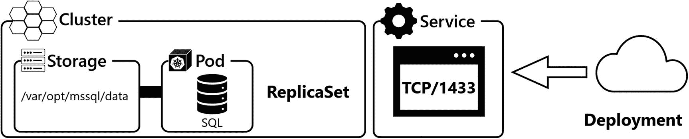

图 7-1

kubernetes SQL Server Pod 的组件

每当我们的 SQL Server pod 被替换时(因为它被删除或破坏)，它将返回到容器映像的初始状态。这也意味着，如果你没有定义任何持久存储，所有的更改和数据都将丢失。因此，pod 需要三个基本设置:

*   **ACCEPT_EULA:** 这用于您接受最终用户许可协议，它将被设置为一个环境变量，并且是 Pod 启动所必需的。

*   **MSSQL_SA_PASSWORD:** 我们的 SQL 实例的 SA 密码，我们将把它存储在 cluster secret 中，在这里对它进行哈希处理，但不加密。

*   **存储:**使用 PVC 的定义。

Kubernetes 将启动容器，存储连接到节点，然后启动容器，映射的存储将安装在容器内。这样，SQL Server 写入的所有数据都将有效地写入永久卷。应用重要设置(EULA 和 sa 密码)后，SQL Server 将检查默认数据目录 */var/opt/mssql/data* 中是否有系统数据库。如果没有系统数据库，SQL Server 会将一组新的系统数据库复制到此目录中。如果默认数据目录中有一组现有的系统数据库，它将使该目录中的系统数据库联机，然后是为此实例配置的用户数据库。

每当我们的 pod 被重新创建时，这个过程都会重复，不管这是因为我们主动触发了它，例如，通过应用升级，还是因为控制平面将 pod 转移到了另一个节点。使用这种方法，您可以将存储在 SQL Server 中的数据的持久性从 Pod 的生命周期中分离出来。当部署一个 Pod 时，存储被装载，容器启动并看到它有一个主数据库，然后 SQL Server 使定义的用户数据库联机。

## 在 Kubernetes 上部署 SQL Server

在开始实际部署之前，必须先做一些准备工作。

### 准备

触发部署之前的两个基本考虑事项和准备步骤是提供 sa 密码的密码以及存储 SQL Server 数据的 PVC。虽然还有很多事情需要考虑，特别是在生产环境中，我们将在本章后面讨论，但它们只是最基本的。

因此，简而言之，我们的步骤是

1.  创造一个秘密。

2.  创建存储(PV/PVC)。

3.  创建 SQL Server 部署。

#### 仓库

我们将在我们的 kubeadm 集群上部署第一台 SQL Server，因此选择了 NFS 作为我们的存储平台，这将允许我们在节点之间移动 pod，而不会丢失对以前生成的数据的访问。如第 [1](01.html) 章所述，这非常适合我们的实验室环境，但不建议用于高性能生产系统。

为此，我们在存储服务器上创建一个名为*/SRV/exports/volumes/SQL-instance-1*的目录。

将清单 [7-1](#PC1) 的内容保存到名为 *sql-storage.yaml* 的文件中。这可能发生在任何连接到集群的客户机上，包括您的管理工作站。

```
apiVersion: v1
kind: PersistentVolume
metadata:
  name: pv-nfs-sql-instance-1
  labels:
    disk: system
spec:
  capacity:
    storage: 10Gi
  accessModes:
    - ReadWriteOnce
  persistentVolumeReclaimPolicy: Retain
  nfs:
    server: storage
    path: "/srv/exports/volumes/sql-instance-1"
---
apiVersion: v1
kind: PersistentVolumeClaim
metadata:
  name: pvc-nfs-sql-instance-1
spec:
  selector:
    matchLabels:
      disk: system
  accessModes:
    - ReadWriteOnce
  resources:
    requests:
      storage: 10Gi

Listing 7-1sql-storage.yaml

```

该文件包含永久卷的定义以及永久卷声明。

让我们使用清单 [7-2](#PC2) 中的代码将这个清单应用于我们的 Kubernetes 集群。

```
kubectl apply -f sql-storage.yaml

Listing 7-2Apply sql-storage.yaml to Kubernetes cluster

```

我们可以验证这两者都是使用 kubectl 创建的(参见清单 [7-3](#PC3) )。

```
kubectl get pv
kubectl get pvc

Listing 7-3Verify previously created PV and PVC

```

两者都可以在图 [7-2](#Fig2) 所示的输出中看到。

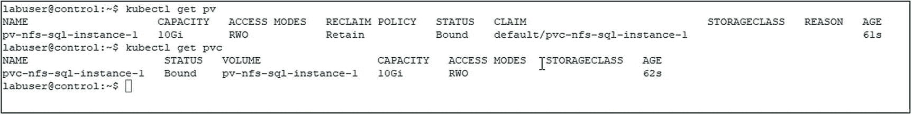

图 7-2

kubectl get node -o wide 的输出

持久卷声明绑定到我们的持久卷。我们的存储现在已经为 SQL Server 做好了准备。

#### 秘密

如前所述，我们需要在集群中存储一个密码，该密码包含 SQL Server 要使用的 sa 密码。这个秘密将存储在我们的集群中，并且可以被我们的 SQL Server 部署引用，因此它对于 SQL Server 是可用的和可访问的。这还有一个好处，就是在部署清单中没有这个秘密，所以可以很容易地共享它，而不会泄露像我们的密码这样的机密信息。这可以通过声明或命令的方式完成，但通常秘密来自安全的秘密存储，例如 Azure Key Vault。

创建这个秘密最简单的方法是通过 kubectl 命令，如清单 [7-4](#PC4) 中所示。

```
kubectl create secret generic mssql --from-literal=SA_PASSWORD=S0methingS@Str0ng!

Listing 7-4Create Kubernetes Secret using kubectl

```

我们现在准备将 SQL Server 部署到 Kubernetes 上。

### 在 YAML 定义 SQL Server 部署

对于我们的 SQL Server 部署，我们将创建另一个清单，我们称之为 *sql-deployment.yaml* 。你会在清单 [7-5](#PC5) 中找到它的内容。

我们想指出三个细节:

*   **策略类型–重新创建:**例如，默认情况下，当应用升级时，Kubernetes 将运行滚动过程，这意味着它将启动一个新的 pod，并在旧的 pod 仍在运行时尝试访问数据库文件。通过将此项设置为重新创建，在创建新的副本集和单元之前，副本集中的所有单元都将被关闭。

    SQL Server 处理这种情况，因为它对文件有独占锁定。但这也意味着容器将创建并重新启动，直到它可以获得文件的排他锁。

*   **securityContext:** 我们的 fsGroup 是 10001，这意味着对 NFS 的所有访问也将使用该组来执行。如果你没有在第 [1](01.html) 章中设置权限和/或创建那个组，这将会失败。

*   **Hostname:** 我们没有定义主机名，因此我们的 SQL Server 将根据其 pod 名称动态命名。我们将在本章后面解释如何进行调整。

```
apiVersion: apps/v1
kind: Deployment
metadata:
  name: mssql-deployment
spec:
  replicas: 1
  strategy:
    type: Recreate
  selector:
    matchLabels:
        app: mssql
  template:
    metadata:
      labels:
        app: mssql
    spec:
      securityContext:
        fsGroup: 10001
      containers:
      - name: mssql
        image: 'mcr.microsoft.com/mssql/server:2019-CU8-ubuntu-18.04'
        ports:
        - containerPort: 1433
        env:
        - name: ACCEPT_EULA
          value: "Y"
        - name: SA_PASSWORD
          valueFrom:

            secretKeyRef:
              name: mssql
              key: SA_PASSWORD
        volumeMounts:
        - name: mssqldb
          mountPath: /var/opt/mssql
      volumes:
      - name: mssqldb
        persistentVolumeClaim:
          claimName: pvc-nfs-sql-instance-1
---
apiVersion: v1
kind: Service
metadata:
  name: mssql-deployment
spec:
  selector:
    app: mssql
  ports:
    - protocol: TCP
      port: 31433
      targetPort: 1433
  type: NodePort

Listing 7-5sql-deployment.yaml

```

除了我们已经提到的设置之外，该清单中最重要的设置如下:

*   **Image:** 有了这个文件，我们将部署一个 SQL Server 2019 CU8。

*   **Volumes:** 我们只连接了一个 PVC，它与我们在上一步中创建的 PVC 相匹配。我们将在 */var/opt/mssql，*放置一个持久卷，写入该目录的任何内容都将被写入持久卷，这是分离数据持久性和 pod 生命周期的关键。

*   **服务:**我们不仅部署了 SQL Server pod，还部署了公开该 pod 的服务。该服务将是 NodePort 类型，因此我们需要在此之前通过 kubectl 检索 TCP 端口，以便访问实例。

为了部署我们的 pod 和服务，我们需要再次应用这个清单，如清单 [7-6](#PC6) 所示。

```
kubectl apply -f sql-deployment.yaml

Listing 7-6Apply sql-deployment.yaml to Kubernetes cluster

```

在这一步之后，我们可以使用 kubectl 来检索清单 [7-7](#PC7) 中命令的部署状态。

```
kubectl get deployment

Listing 7-7Check status of deployment

```

部署准备就绪通常需要几分钟时间，如图 [7-3](#Fig3) 所示，其中显示 0/1。你可能需要重新运行这个命令几次(或者使用 *-手表*开关)直到它完成。请记住，除非您已经预提取了映像，否则第一次部署还涉及到下载 SQL Server 映像，这将需要很长时间，具体取决于您的互联网连接。

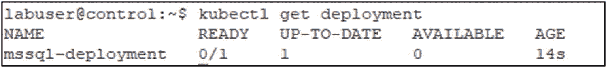

图 7-3

kubectl get 部署的输出

一旦完成，我们还可以通过 kubectl 检查 pod 的创建和外部 TCP 端口，如清单 [7-8](#PC8) 所示。

```
kubectl get pods
kubectl get service

Listing 7-8Check status of pod and service

```

正如您在输出中看到的(图[7-4](#Fig4)), pod 获得了一个唯一的随机名称，该名称将在每次重新创建时更改。在我们的示例中，节点端口是 32651。我们将需要它来进行后续的查询。

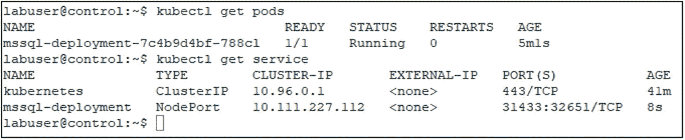

图 7-4

ku bectl get pods/服务的输出

准备好 SQL Server 并检索到连接参数后，我们现在可以使用如清单 [7-9](#PC9) 所示的 sqlcmd 对我们的实例运行第一个查询。

```
sqlcmd -S control,<PORT> -U sa -P <PASSWORD> -Q "SELECT @@SERVERNAME,@@VERSION"

Listing 7-9sqlcmd query for server name and version

```

Note

对于本章中的所有 *sqlcmd* 查询，建议使用您的密码设置一个环境变量，以便您可以在查询中使用它。这同样适用于您的实例的端口。此外，如果你喜欢任何其他客户，随时修改那些你认为合适的。此外，如果从控制平面运行此命令，请确保路径中包含 sqlcmd 的位置。

如果您查看输出(图 [7-5](#Fig5) ，您会注意到服务器名称与我们的 pod 名称相匹配，版本与我们在清单中定义的相匹配。

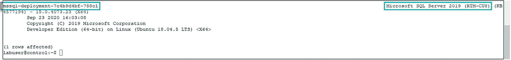

图 7-5

“选择@ @服务器名，@ @版本”的输出

接下来，让我们使用清单 [7-10](#PC10) 中的命令创建一个名为 TestDB1 的用户数据库。

```
sqlcmd -S control,<PORT> -U sa -P <PASSWORD> -Q "CREATE DATABASE TestDB1"

Listing 7-10sqlcmd command to create a new user database

```

如果我们现在使用清单 [7-11](#PC11) 中的命令列出 NFS 共享的目录内容，我们将看到该数据库的 mdf 和 ldf 文件。

Note

在*存储*服务器上运行此命令。

```
ls -al /srv/exports/volumes/sql-instance-1/*

Listing 7-11List directory contents of NFS share

```

您可以在图 [7-6](#Fig6) 中看到之前命令的输出。

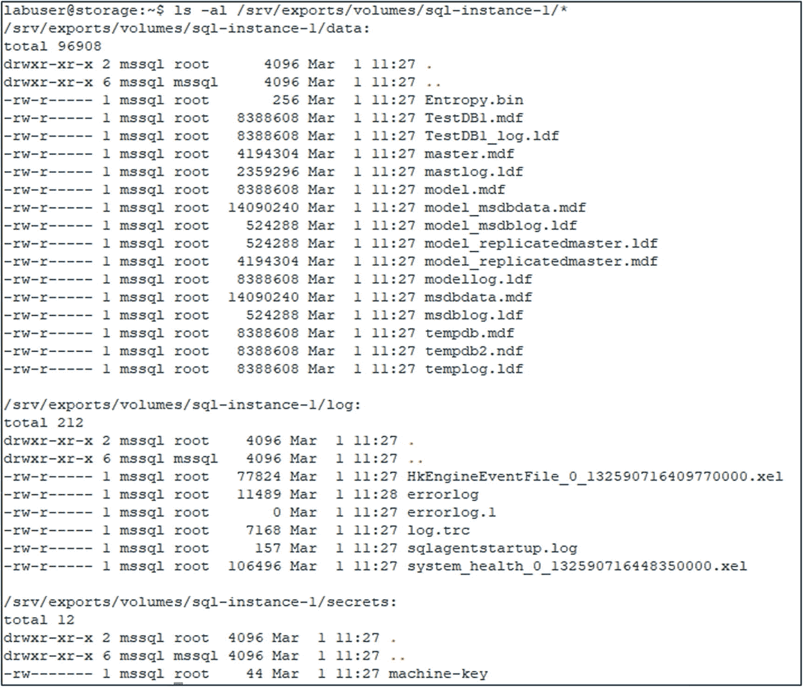

图 7-6

NFS 股份的内容

我们现在有了第一个在线的 SQL Server 用户数据库，运行在我们的 Kubernetes 集群中。

### 其他配置选项

虽然前面提到的环境变量只是最小的一部分，但是还有更多，它们都可以包含在您的 YAML 清单中，就像 *ACCEPT_EULA* 设置一样。最重要的两个可能是

*   **MSSQL_AGENT_ENABLED:** 默认为 false。将其设置为 true 可为此实例启用 SQL 代理服务。

*   **MSSQL_PID 评估:**此设置允许您在开发人员版、快速版、Web 版、标准版和企业版之间进行选择。或者，您可以提供产品密钥。

您可以在 [`https://docs.microsoft.com/en-us/sql/linux/sql-server-linux-configure-environment-variables?view=sql-server-ver15&viewFallbackFrom=sql-server-2019`](https://docs.microsoft.com/en-us/sql/linux/sql-server-linux-configure-environment-variables%253Fview%253Dsql-server-ver15%2526viewFallbackFrom%253Dsql-server-2019) 的官方文档中找到附加配置选项的完整参考，如排序规则和语言 ID。

如果您更喜欢持久性服务器名而不是动态 pod 名，那么您可以在您的部署清单中指定它，如清单 [7-12](#PC12) 所示(添加最后两行是为了将服务器名更改为 *sql01* )。

```
    spec:
      securityContext:
        fsGroup: 10001
      hostname:
        sql01

Listing 7-12Define a static hostname

```

要了解更多关于持久服务器名称的信息，我们推荐这篇博文: [`www.centinosystems.com/blog/sql/persistent-servername-when-deploying-sql-server-in-kubernetes/`](https://www.centinosystems.com/blog/sql/persistent-servername-when-deploying-sql-server-in-kubernetes/) 。

Note

虽然手动设置主机名是可选的，但是复制和许多第三方工具都依赖于此。因此，我们强烈建议在生产环境中进行设置。

### Pod 生命周期和数据持久性

虽然您通常不会手动触发这一过程，但我们之前已经详细阐述了 Kubernetes 将计算和存储分开的事实。虽然豆荚是短暂的，但存储(大部分)是持久的。

让我们使用 kubectl 检索当前 pod 的名称(清单 [7-13](#PC13) )。

```
kubectl get pods

Listing 7-13Get pod name

```

如图 [7-7](#Fig7) 所示，我们目前的 pod 是*MSSQL-deployment-748 c 745 b8d-w2s F8*。

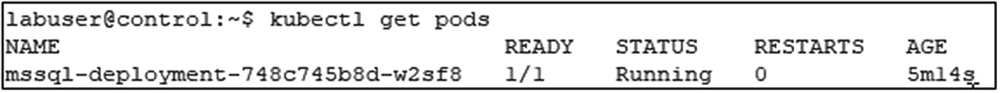

图 7-7

当前 Pod 名称

现在，我们将使用 kubectl 删除这个 pod(清单 [7-14](#PC14) )。

```
kubectl delete pod mssql-deployment-748c745b8d-w2sf8

Listing 7-14Delete pod

```

Kubectl 将确认 pod 已被删除，这需要几秒钟的时间(见图 [7-8](#Fig8) )。


图 7-8

kubectl 删除窗格的输出

如果我们再次检索我们的 pod，您将会看到(图 [7-9](#Fig9) )一个具有新名称的新 pod 被立即创建。

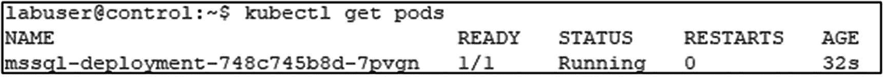

图 7-9

kubectl get pods 的输出

使用 sqlcmd 列出该实例中的所有数据库，如清单 [7-15](#PC15) 所示。

```
sqlcmd -S control,<PORT> -U sa -P <PASSWORD> -Q "SELECT Name FROM sys.databases"

Listing 7-15List databases in our instance

```

您将看到(图 [7-10](#Fig10) )我们的数据库 TestDB1 仍然存在，因为存储被重新连接到新的 pod。

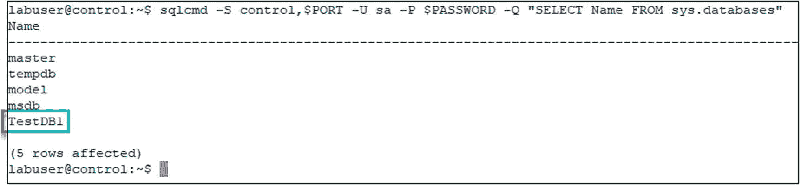

图 7-10

SQL 实例中的数据库列表

## 在部署中升级 SQL Server

在部署中升级现有的 SQL Server 与其初始部署一样简单。我们只需要更新图像，这可以通过在 Pod 规范中修改清单的容器图像并重新应用来完成，也可以通过 kubectl 设置新的图像来完成。在清单 [7-16](#PC16) 的例子中，我们将把 mssql 容器的图像更新为 CU9。

```
kubectl set image deployment mssql-deployment mssql=mcr.microsoft.com/mssql/server:2019-CU9-ubuntu-18.04

Listing 7-16Update image to CU9

```

这里的关键是 Kubernetes 将在部署新的 pod 之前关闭当前的 pod(Kubernetes 默认是添加一个，然后删除旧的)。

如果我们使用 kubectl 来描述部署(清单 [7-17](#PC17) )，我们将会看到旧的副本集被缩小，然后新的副本集被放大。这也是因为我们已经设置了重新创建的策略(见前面)。

```
kubectl describe deployment mssql-deployment

Listing 7-17Describe deployment

```

如图 [7-11](#Fig11) 所示，前面的命令显示了缩放操作。


图 7-11

清单 [7-17](#PC17) 的输出

这也产生了一个新的 pod，我们可以再次通过 kubectl 检索它的名称(图 [7-12](#Fig12) )。

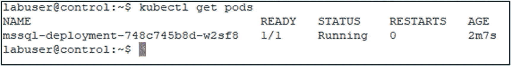

图 7-12

kubectl get pods 的输出

如果您在这个新的 Pod 上运行`kubectl describe pod`，您可以在这个新的 Pod 中看到更新命令期间和之后发生的事件(图 [7-13](#Fig13) )。

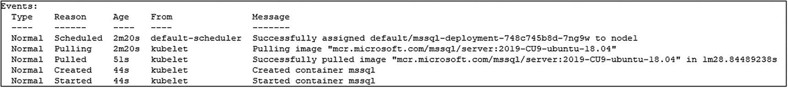

图 7-13

描述 pod

运行清单 [7-18](#PC18) 中的命令。

```
kubectl rollout history deployment mssql-deployment --revision=2

Listing 7-18Retrieve history for second revision of a deployment

```

正如您在图 [7-14](#Fig14) 中看到的，这将向您展示该部署的第二次修订的详细信息。对该部署的任何后续更新都可以用同样的方式进行检索和跟踪。

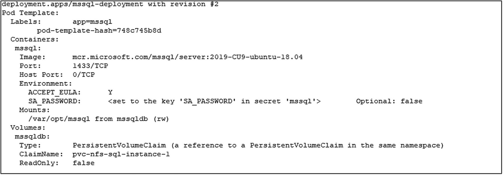

图 7-14

清单 [7-18](#PC18) 的输出

如果我们再次通过 sqlcmd 检索服务器名称和版本(图 [7-15](#Fig15) ，您将看到服务器名称与新的 pod 名称相匹配，并且版本已经更改为 CU9。

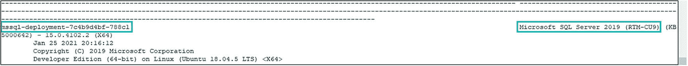

图 7-15

“选择@ @服务器名，@ @版本”的输出

我们还可以再次使用 sqlcmd 来验证我们的 TestDB1 仍然存在(图 [7-16](#Fig16) )。


图 7-16

SQL 实例中的数据库列表

Note

正如我们刚刚升级了 SQL Server 一样，我们也可以使用相同的方法回滚 CU 升级。

## 在生产环境中在 Kubernetes 上运行 SQL Server

就像在 Windows 上运行的传统 SQL Server 一样，在设计生产环境时，有许多因素需要考虑。

### 高级磁盘拓扑

在生产环境中操作 SQL Server 时，存储始终是一个重要的考虑因素。在前面的例子中，我们已经将日志和数据部署到同一个 NFS 驱动器，包括用户和系统数据库的混合。

相反，您可以定义多个持久性卷和持久性卷声明，并将它们附加到您的 pod，这相当于在一个 Windows 服务器上有多个驱动器。

您还可以使用这三个环境变量来指定默认目录:

*   MSSQL _ 数据 _ 目录

*   MSSQL_LOG_DIR 函数

*   MSSQL 备份目录

任何新的用户数据库都将在这些位置创建。

同样，所有的 PVC 将在启动时安装在容器中定义的位置，主数据库将使用户数据库联机。

### 资源管理(限制和请求)

虽然存储配置负责我们的数据部分，但我们还需要考虑计算，这实际上意味着 CPU 和内存。在 Kubernetes 中，这是通过*限制*和*请求*来管理的，这些可以在 Pod 和名称空间级别上定义。

请求是要分配的有保证的最小资源量。如果您为 pod 定义了一个无法实现的请求(例如，在 64GB RAM 的机器上请求 128GB 的内存)，pod 将不会启动。

另一方面，限制定义了可以分配给资源的最大值。默认情况下，没有配置任何限制，这意味着默认情况下，一个 pod 可以消耗(理论上)无限量的内存和 CPU。

在 SQL Server 的情况下，服务器实例设置仍然适用，因此请确保对它们进行设置。

理想情况下，限制和请求应该放入您的清单中(尽管理论上您可以通过 kubectl 强制设置它们)。他们将转到一个名为 *resources* 的新部分，用于每个容器，如清单 [7-19](#PC19) 所示。

```
spec:
 containers:
 - name: mssql
   resources:
     requests:
       cpu: 1
       memory: 2Gi
     limits:
       cpu: 1
       memory: 4Gi

Listing 7-19Resource section in YAML manifest

```

该特定设置将授予 SQL Server 恰好一个 CPU 内核、最少 2GB 的 RAM(根据 [`https://docs.microsoft.com/en-us/sql/linux/sql-server-linux-setup?view=sql-server-ver15#system`](https://docs.microsoft.com/en-us/sql/linux/sql-server-linux-setup%253Fview%253Dsql-server-ver15%2523system) ，这是最低要求)和最大 4GB 的 RAM。4GB 是容器将看到的可用限制。由于 *SQLPAL* 的架构，默认情况下，Linux 上的 SQL Server 只能看到该值的 80%，这可以通过使用 *mssql-conf* 进行调整。

Note

我们强烈建议总是在您的 SQL Server 实例中配置一个`Max Server Memory`,以及 Kubernetes 对 CPU 和内存的限制。

如果你想了解更多关于在 Kubernetes 上运行 SQL Server 的内存设置，我们强烈推荐这篇博文: [`www.centinosystems.com/blog/sql/memory-settings-for-running-sql-server-in-kubernetes/`](https://www.centinosystems.com/blog/sql/memory-settings-for-running-sql-server-in-kubernetes/) 。

## 备份(和恢复)

当然，另一个重要的问题是:我如何以及在哪里备份我的数据？第一部分非常简单:您可以使用您喜欢的现有技术，可以是简单的维护计划或外部工具，如 dbatools ( [`https://dbatools.io/`](https://dbatools.io/) )或 Ola Hallengren 的框架( [`https://ola.hallengren.com/sql-server-backup.html`](https://ola.hallengren.com/sql-server-backup.html) )。也可以使用 SQL Server 代理计划这些备份。

更有趣的部分是“在哪里”的部分。实际上，您有两个选择:

*   **备份到 URL:** 从 SQL Server 2016 开始，微软实现了直接备份到 Azure Blob 存储(以及从中恢复)的能力。确切的语法和要求可以在 [`https://docs.microsoft.com/en-us/sql/relational-databases/backup-restore/sql-server-backup-to-url?view=sql-server-ver15`](https://docs.microsoft.com/en-us/sql/relational-databases/backup-restore/sql-server-backup-to-url%253Fview%253Dsql-server-ver15) 找到。

*   **附加一个额外的永久卷。**或者，您可以附加一个专用的附加卷，它可以是云原生的(如 Azure Disk 或 Azure Files ),也可以是任何其他允许您将数据物理存储在不同位置的存储系统，如 NFS、iSCSI 或光纤通道。

同样的逻辑也适用于恢复。如果您想将一个现有的备份文件复制到您的 SQL 实例中，您可以使用 kubectl 来完成。重要的概念是文件需要能够被 SQL Server 进程访问。

这种复制任务的一般语法可以在清单 [7-20](#PC20) 中找到。

```
kubectl cp LocalFile TargetPod:TargetFile -c ContainerName

Listing 7-20Generic code to copy a local file to a container

```

在我们的具体例子中，要将本地文件 *AdventureWorks2017.bak* 复制到我们的 pod*MSSQL-deployment-748 c 745 b8d-7 pvgn*的数据目录中，该命令将类似于清单 [7-21](#PC21) 中的命令。

```
kubectl cp AdventureWorks2017.bak mssql-deployment-748c745b8d-7pvgn:var/opt/mssql/data/AdventureWorks2017.bak -c mssql

Listing 7-21Code to copy a local file to a container

```

复制后，可以使用 sqlcmd、Azure Data Studio、SQL Server Management Studio 或任何其他客户端工具还原该文件。我们只建议对较小的文件这样做，因为你必须将文件复制到容器中，这会消耗空间和时间。

Note

Kubernetes 只是我们运行 SQL Server 的平台，它不能取代对本地 SQL 备份的需求！

## 摘要

在本章中，我们介绍了在 Kubernetes 的 pod 中运行独立 SQL Server 实例的所有内容，从升级的基本部署到在您的生产环境中在 Kubernetes 上运行 SQL Server 的必要考虑。在下一章中，我们将研究如何监控集群及其应用。