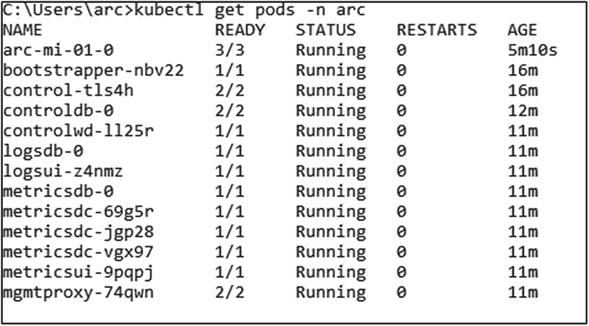
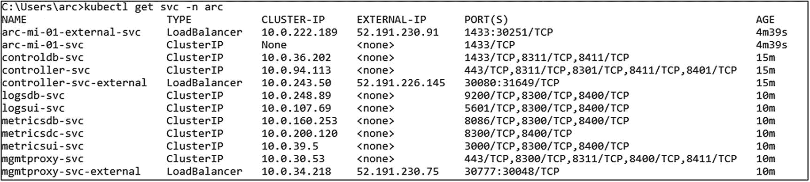
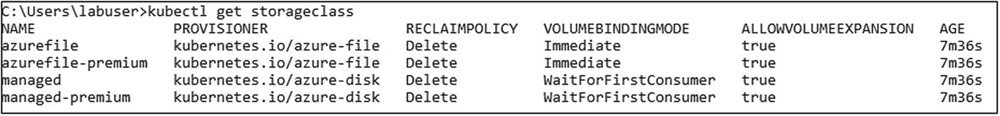
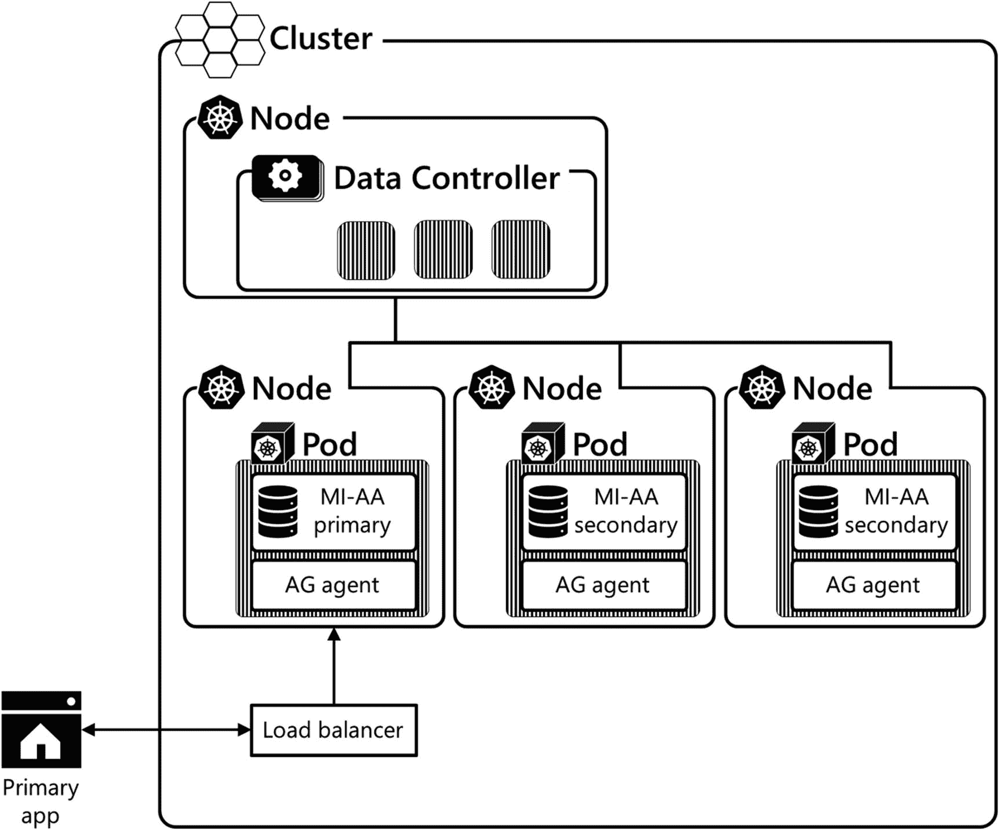

# 9.在 Kubernetes 上支持 Azure Arc 的数据服务和 SQL Server 的高可用性

本章介绍了 Azure Arc 支持的数据服务，以及它们提供的强大功能，使用与 Azure 云相同的自动化和集中控制管理和工具来部署和管理本地、内部和混合云数据资源。我们将向您展示如何在您的企业数据中心部署和管理运行在 SQL Server 上的数据库，就像它们是 Azure 平台的一部分一样，所有这些都使用 Kubernetes 的功能。Azure Arc 支持的数据服务也是如何在 Kubernetes 上实现 SQL Server 的可用性组(ag )(使用托管实例)这一问题的答案。

## Azure Arc 是什么？

在其核心，微软 Azure Arc 提供 Azure 管理服务，无论您在本地或任何云部署了资源。它使您能够为部署在任何地方的跨技术架构的组织核心运营提供一致的管理服务和工具。我们来看看 Azure Arc 的核心特性:

*   **跨内部和混合云的统一体验:**Azure 门户、Azure CLI、PowerShell 和 REST API 等熟悉的工具可供您管理和部署系统。

*   **部署和运营:**借助一套统一的工具，无论您在何处部署，无论是在本地还是在任何云中，部署和运营都是一致的。统一工具使您的组织能够在任何部署场景中使用相同的代码和工具，无论部署在哪里。运营的一个关键要素是性能和可用性监控，Azure Monitor 可帮助您对支持 Azure Arc 的资源进行监控。

*   **整合的访问控制、安全性、策略管理和日志记录:**根据您的资源部署位置实施多个安全模型既具有挑战性，又存在风险，因为您可能需要管理多组安全规则及其实施。Azure Arc 使您能够拥有一个整合的安全模型和实现，并使用 Azure Log Analytics 等工具来集中安全和应用日志。此外，您可以使用 Azure Policy 等服务来管理治理和控制解决方案。

*   **库存和组织:**有了一套可用的工具和关键的 Azure 构造，如资源组、订阅和标签，管理员、操作员和经理可以获得他们的技术资产的完整视图。系统部署在哪里不再重要——服务和资源在 Azure 中注册为受管资源，而不管它们部署在哪里，是在本地还是在任何云中。

Azure Arc 的产品范围从支持 Azure Arc 的服务器和支持 T2 Azure Arc 的 Kubernetes 到支持 T4 Azure Arc 的 SQL 服务器和支持 Azure Arc 的数据服务。

鉴于这本书的范围，让我们总结一下它的本质:Azure Arc 是一系列服务，允许你将以前只能部署到微软 Azure 云的服务运行到任何云中的任何基础设施。在本章的过程中，我们将重点关注 Azure Arc 支持的数据服务中的一些产品。

要了解更多关于 Azure Arc 的一般信息，请参考 [`https://docs.microsoft.com/en-us/azure/azure-arc/`](https://docs.microsoft.com/en-us/azure/azure-arc/) 。

## Azure Arc 支持的数据服务简介

Azure Arc 支持的数据服务架构是硬件、Kubernetes、管理控制平面和数据服务的分层架构。图 [9-1](#Fig1) 突出了架构。


图 9-1

Azure Arc 支持的数据服务架构

基础层是在任何硬件上运行的 Kubernetes，它可以是内部的，也可以是在任何云中，构建在物理机或虚拟机上。然后，部署在 Kubernetes 集群内部的是 Arc 管理控制平面。Arc 管理控制平面是 Azure Arc 的大脑，将 Azure Resource Manager (ARM)扩展到您的内部部署或混合云部署。在所有这些之上是 Azure Arc 支持的数据服务。

让我们仔细看看 Azure Arc 支持的数据服务的核心组件，如图 [9-2](#Fig2) 所示。


图 9-2

Azure Arc 支持的数据服务的核心组件

### Azure Arc 数据控制器

除了 Kubernetes 集群，我们运行 Azure Arc 支持的数据服务需要的第一个组件是数据控制器。它提供了到 Azure Portal 的连接，并部署了一些我们以后需要提供服务的核心服务。

#### 监测(格拉法纳和基巴纳)

在上一章中，我们部署了 Grafana，正如您所记得的，其中包含了相当多的步骤。好消息:当您部署 Azure Arc 数据控制器时，它会自动为您部署一个 Grafana 仪表板，包括它的先决条件。

它还带有预配置的仪表板，如 SQL 托管实例指标，如图 [9-3](#Fig3) 所示。这看起来与我们在前一章中看到的例子不同，因为这个仪表板是为 SQL 托管实例的细节定制的。


图 9-3

Grafana 门户 SQL MI 指标

除了这个仪表板，图 [9-4](#Fig4) 中所示的仪表板也是自动部署的。


图 9-4

Grafana 门户中的内置仪表板

当然，您可以添加任何现有的仪表板或创建您自己的仪表板，就像我们在上一章中所做的那样。

除了 Grafana 之外，支持 Azure Arc 的数据服务也随 Kibana 一起提供，其先决条件默认推出，因此也不需要手动部署。

#### Azure 门户的连接模式

Azure Arc 支持的数据服务带有 Azure Portal 的反向通道，允许您上传安装的日志和指标。这使您可以在一个地方管理您的所有数据资产，无论是在 Azure Arc 内部运行的托管实例还是 Azure 中的 Azure SQL DB。该信息也用于计费目的。

根据您的基础设施、位置和需求，您可以选择两种模式:

*   **直接连接:**在这种模式下，您的日志和指标会不断发送到 Azure Portal，使数据几乎可以立即用于分析。

*   **间接连接:**在此模式下，您需要手动触发或安排指标和日志的导出和上传。如果您所在的位置互联网连接有限，这一点尤其有用。

一旦资源的数据被上传到 Azure，它将显示在门户中，如图 9-5 中的例子所示。


图 9-5

Azure 门户中显示的 CPU 指标

### 数据服务

在我们的数据控制器之上是数据服务，在编写本文时，它可以是一个 Azure Arc SQL 托管实例(T1)或 PostgreSQL 的 Azure 数据库(T3)。

我们将只关注 SQL 托管实例，因为 PostgreSQL 超出了本书的范围。

#### Azure Arc SQL 托管实例

Azure Arc 支持的 SQL 托管实例是 SQL Server 的升级版。它使您能够将工作负载无缝地迁移到 Azure Arc 中，因为它提供了与 SQL Server 的本地安装的高度兼容性，这被记录为几乎 100%兼容。这意味着，将您的数据库从其当前的内部实现迁移到 Azure Arc 支持的 SQL 托管实例将需要很少或不需要数据库更改。当部署启用 Azure Arc 的 SQL 托管实例时，您可以从 SQL Server 的本地版本进行备份，并将该备份直接恢复到启用 Azure Arc 的 SQL 托管实例。

Tip

在 [`https://docs.microsoft.com/en-us/azure/azure-arc/data/managed-instance-features#Unsupported`](https://docs.microsoft.com/en-us/azure/azure-arc/data/managed-instance-features%2523Unsupported) *、*之后，您将找到 Azure Arc 支持的 SQL 托管实例不支持的功能和服务列表。

Azure Arc 支持的 SQL 托管实例在 Kubernetes 的容器内作为 Linux 进程上的 SQL Server 运行。不可用的功能类似于 Linux 上的 SQL Server 不支持的功能。更多信息，请看 [`https://docs.microsoft.com/en-us/sql/linux/sql-server-linux-editions-and-components-2019?#Unsupported`](https://docs.microsoft.com/en-us/sql/linux/sql-server-linux-editions-and-components-2019%253F%2523Unsupported) 。

类似于 Azure PaaS 服务中始终可用的最新或常青 SQL 产品，如 Azure 云托管部署中的 Azure SQL 托管实例，微软将不断向 Microsoft Container Registry 发布更新的 SQL 托管实例容器映像，以用于 Azure Arc 支持的 SQL 托管实例。然后，根据部署中定义的更新策略，您可以指定将更新应用于环境的频率和时间。在 SQL Server 的传统实现中，管理更新是一个充满挑战且耗时的过程。Kubernetes 提供了快速吸收更新和变更并将其部署到集群中的能力。这是 Azure Arc 支持的数据服务中使用的更新模型。

#### PostgreSQL 的 Azure 数据库

Azure Arc 支持的数据服务中目前可用的另一个服务是 Azure Database for PostgreSQL。我们将不会对此进行更详细的讨论，因为这超出了本书的范围。

### 支持 Azure Arc 的数据服务中的 Kubernetes 构造

当然，我们也想知道 Kubernetes 构造是如何反映这一切的。

Azure Arc 支持的数据服务的每个部署都将存在于自己的名称空间中。这将允许您在同一个 Kubernetes 集群上运行多个部署。

如图 [9-6](#Fig6) 所示，在这样的名称空间中，我们将找到控制器、Grafana、Kibana 和其他数据控制器服务的 pod，以及与该控制器相关联的数据服务。



图 9-6

Azure Arc 支持的数据服务命名空间中的窗格

如图 [9-7](#Fig7) 所示，通过 Kubernetes 服务可以访问 pod 中的数据服务、监控和日志应用。



图 9-7

Azure Arc 支持的数据服务命名空间中的服务

为了实现最大的灵活性，Azure Arc 支持的数据服务需要至少一个存储类。每当创建数据控制器或数据服务时，都需要一个存储类。这个类在不同的服务之间可以是不同的，每个服务可以为日志(Kubernetes 日志)、数据和数据日志使用不同的类。

如果你想了解更多关于 Azure Arc 支持的数据服务，我们也推荐我们的新闻书籍 *Azure Arc 支持的数据服务揭示*。

## 部署 Azure Arc 支持的数据服务

现在是时候部署一些支持 Azure Arc 的数据服务了。

### 先决条件

正如所料，在开始部署过程之前，我们需要几个先决条件。

#### 不可思议的群集

根据架构，您可能已经猜到，需要一个 Kubernetes 集群。

如前所述，在这个集群中，我们还需要至少一个允许动态供应的存储类(就像我们在第 [8](08.html) 章中部署 *elasticsearch* 时使用的 NFS 供应器)。

我们将使用我们的*AK cluster*进行此次部署。如果你更喜欢使用你的 *kubeadm* 集群，只需相应地调整*存储等级*。

因此，我们首先将 kubectl 上下文切换回 AKSCluster，如清单 [9-1](#PC1) 所示。

```
kubectl config use-context AKSCluster

Listing 9-1Switch kubectl context to AKSCluster

```

我们还将使用清单 [9-2](#PC2) 中的 kubectl 命令检索这个集群中的存储类。

```
kubectl get storageclass

Listing 9-2List storage classes in AKSCluster

```

除非您已经向该集群部署了任何额外的存储类，否则这应该类似于图 [9-8](#Fig8) 中的输出。



图 9-8

AKS 集群中的存储类

#### 工具作业

虽然我们可以通过 YAML 清单部署 Azure Arc 生态系统中的一切，但微软通过提供另一个层次的抽象让我们的生活变得更容易。使用名为 azdata 的工具，我们可以描述我们需要的环境和服务，这将为我们生成 Kubernetes 中的对象。对于更复杂的场景，可以通过 JSON 文件进行配置，而更简单的用例可以通过命令行参数来运行，这非常类似于 kubectl 中命令式语句和声明式语句的概念。

Note

不要混淆 *Azure CLI* 和 *azdata* 。他们是两种不同的工具！

我们已经在第 [1](01.html) 章的管理工作站上安装了 azdata。

如果你喜欢图形化的体验，Azure Data Studio 还提供了图形化的安装向导。该向导将为在后台调用 azdata 的每个部署创建一个 Jupyter 笔记本。然而，在本书中，我们将关注基于命令行的安装。

### 部署数据控制器

一旦安装了 azdata 并将 kubectl 上下文设置为正确的集群，就可以通过类似清单 [9-3](#PC3) 中的命令部署 Azure Arc 数据控制器。

您需要提供以下设置:

*   **名称:**控制器的名称。

*   **名称空间:**要使用的 Kubernetes 集群中的名称空间——该名称空间不能有任何其他对象。如果它还不存在，就会被创建。

*   **订阅:**您的 Azure 订阅 ID。

*   **资源组:**Azure 中的资源组，服务应该在部署后显示在该资源组中。

*   **位置:**度量和日志的 Azure 区域。

*   **存储类:**数据控制器的数据和日志的存储类。如果省略，将使用默认类。

*   **概要文件名称:**要使用的部署概要文件。

```
azdata arc dc create \
--connectivity-mode Indirect \
--name arc-dc-aks \
--namespace arc \
--subscription <Subscription ID> \
--resource-group "Kubernetes-Cloud" \
--location eastus \
--storage-class managed-premium \
--profile-name azure-arc-aks-premium-storage

Listing 9-3azdata command to create a Data Controller

```

如果您部署到 AKS 之外的另一个目标，您将需要相应地调整*配置文件名*。可以使用清单 [9-4](#PC4) 中的命令检索可用概要文件列表。

Note

我们的例子是使用间接模式，如果你想把你的度量和日志上传到 Azure Portal，需要额外的步骤，这超出了本书的范围。

```
azdata arc dc config list

Listing 9-4azdata command to list profile names for Data Controller

```

输出将类似于图 [9-9](#Fig9) 所示。


图 9-9

Azure Arc 数据控制器的配置文件列表

要部署数据控制器，您需要接受许可协议并提供用户名和密码。

如果您希望在运行 azdata 命令时避免提示它们，也可以在三个环境变量中提供它们:

*   **ACCEPT_EULA:** 设置为“Y”(这仅适用于 SQL 托管实例等数据服务的部署，不适用于数据控制器)

*   **AZDATA_USERNAME:** 要使用的用户名，例如 arcadmin

*   **AZDATA_PASSWORD:** 成为您选择的强密码

如果您想在通过 azdata 部署时跟踪 pod 的创建，可以使用清单 [9-5](#PC5) 中的命令。

```
kubectl get pods -n arc –watch

Listing 9-5Monitor deployment status using kubectl

```

Note

每当您将 *- watch* 开关添加到 *kubectl get* 语句时，kubectl 会一直监视与您的命令匹配的对象，并不断刷新它们的当前状态。

如图 [9-10](#Fig10) 所示，一旦部署完成，azdata 将进行报告。


图 9-10

数据控制器部署的输出

### 部署支持 Azure Arc 的 SQL 托管实例

要通过 azdata 部署 Azure Arc 支持的 SQL 托管实例，我们首先需要登录到我们的集群，如清单 [9-6](#PC6) 所示。

```
azdata login -ns arc

Listing 9-6azdata command to log into your Data Controller

```

Note

如果您没有将用户名和密码存储在环境变量中，该命令将再次提示您输入。

一个新的托管实例可以通过一个简单的 azdata 命令来部署，如清单 [9-7](#PC7) 中所示。唯一需要的参数是实例的名称。如果不提供存储类，将使用默认类。这需要定义一个默认的存储类！

```
azdata arc sql mi create \
          --name arc-mi-01 \
          --storage-class-data managed-premium \
          --storage-class-logs managed-premium \
          --storage-class-data-logs managed-premium \
          --storage-class-backups managed-premium

Listing 9-7azdata command to create a new SQL Managed Instance with parameters

```

部署再次需要用户名和密码，除非您已经通过环境变量提供了用户名和密码，否则会提示您输入。

一旦部署完成，azdata 将返回报告，如图 [9-11](#Fig11) 所示。


图 9-11

创建 MI 后 azdata 的输出

使用清单 [9-8](#PC8) 中的代码查看 pod。

```
kubectl get pods arc-mi-01-0 -n arc

Listing 9-8kubectl get pods

```

我们还可以看到为我们的托管实例创建的 pod(图 [9-12](#Fig12) )。


图 9-12

MI 的 Pod

Note

这是一个单独的舱，里面有三个容器。这并不意味着我们得到了三个 SQL Server 实例。

要使用 *sqlcmd* 、 *Azure Data Studio、*或其他客户端工具连接到我们的实例，我们需要 SQL Server 端点的 IP 地址和端口。除了使用 kubectl 列出服务，我们还可以使用清单 [9-9](#PC9) 中的 *azdata* 命令来实现这个目的。

```
azdata arc sql mi list

Listing 9-9azdata command to list all SQL MIs in the current controller

```

这将返回我们实例的外部端点、它的名称、副本的数量以及它的当前状态，如图 [9-13](#Fig13) 所示。


图 9-13

Azure Arc 命名空间中的托管实例

我们现在可以使用这些信息并连接到我们的 SQL Server。

## Azure Arc SQL 托管实例的高可用性

在撰写本文时，Kubernetes 上的一个“常规”SQL Server，如我们在第 [7](07.html) 章中部署的那个，不支持*可用性组*。

您现在可能想知道，既然 Kubernetes 正在提供本机高可用性，为什么还需要 AG。问题在于您使用的是哪种存储，在一个节点出现故障的情况下，存储需要连接到一个新节点。这可能需要几毫秒到几分钟的时间。几分钟的停机时间在 HA 环境中显然是不可接受的。

这个问题的答案也在于 Arc through *SQL 托管实例始终在可用性组上。*正如你在图 [9-14](#Fig14) 中看到的，它们集合了 Azure Arc SQL 托管实例(我们在本章前面已经介绍过)和可用性组 *(AGs)* 以实现高可用性。



图 9-14

SQL 托管实例始终在可用性组中

当在可用性组上部署 Azure Arc 支持的 *SQL 托管实例时，它提供了以下功能:*

1.  由三个副本组成的组是在内部管理的，包括创建可用性组以及将副本加入所创建的可用性组。

2.  所有数据库都自动添加到可用性组，包括所有用户和系统数据库，如 *master* 和 msdb。此功能提供了跨可用性组副本的单一系统视图。

3.  对于读写和只读连接，外部端点会自动配置为连接到可用性组中的数据库。

4.  能够通过连接到辅助实例来运行只读工作负载。

5.  在单元或节点出现故障时自动进行故障切换和实例重新部署。

6.  升级受到管理。

部署由多个副本支持的托管实例几乎太容易了。要将 Azure Arc SQL 托管实例部署为 AG，您需要做的就是将*副本*开关添加到您的 create 命令中，如清单 [9-10](#PC10) 所示。

```
azdata arc sql mi create \
       --name arc-mi-ha \
       --replicas 3

Listing 9-10azdata command to create a new SQL Managed Instance with parameters

```

一旦这个部署完成，我们就可以检索主节点的端点，并对其运行清单 [9-11](#PC11) 中的命令来检查可用性组的状态。

```
SELECT ag.name agname, ags.* FROM sys.dm_hadr_availability_group_states ags INNER JOIN sys.availability_groups ag ON ag.group_id = ags.group_id

Listing 9-11Get AG health through T-SQL

```

正如您在图 [9-15](#Fig15) 中看到的，一切看起来都很好。


图 9-15

AG 状态

仅供参考，如果我们对单实例部署运行相同的查询，该查询将返回空值(参见图 [9-16](#Fig16) )。


图 9-16

未部署可用性组

还要注意(图 [9-17](#Fig17) )我们的 HA 实例是使用三个而不是一个 pod 部署的——您可以再次使用`kubectl get pods`来验证这一点。


图 9-17

Azure Arc 命名空间中托管实例 AG 的 Pods

Note

这里我们看到三个副本在一个状态集中运行，每个 pod 运行四个容器。

## 摘要

在这一章中，我们看了 Azure Arc 支持的数据服务，以及它们如何通过 *azdata* 添加另一个抽象层来允许复杂解决方案的部署。我们部署了一个支持 Azure Arc 的数据控制器和一个 Azure Arc 管理的实例，并通过将其部署为可用性组来实现高可用性。在我们的下一章，也是最后一章，我们将关注另一个运行在 Kubernetes 上的 SQL Server 实现:大数据集群。