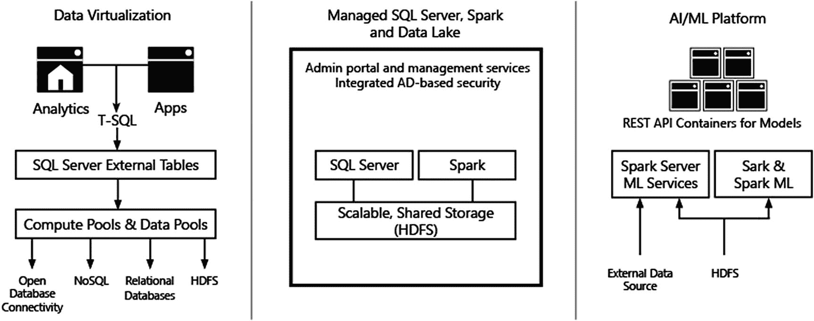
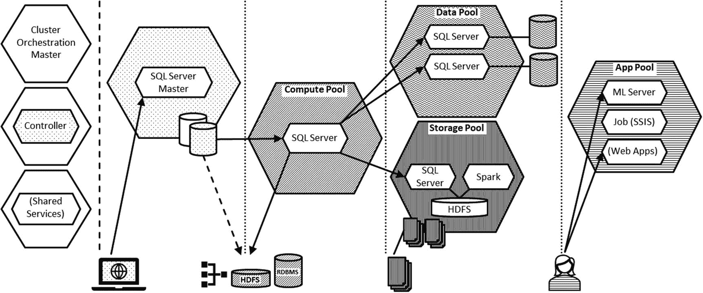
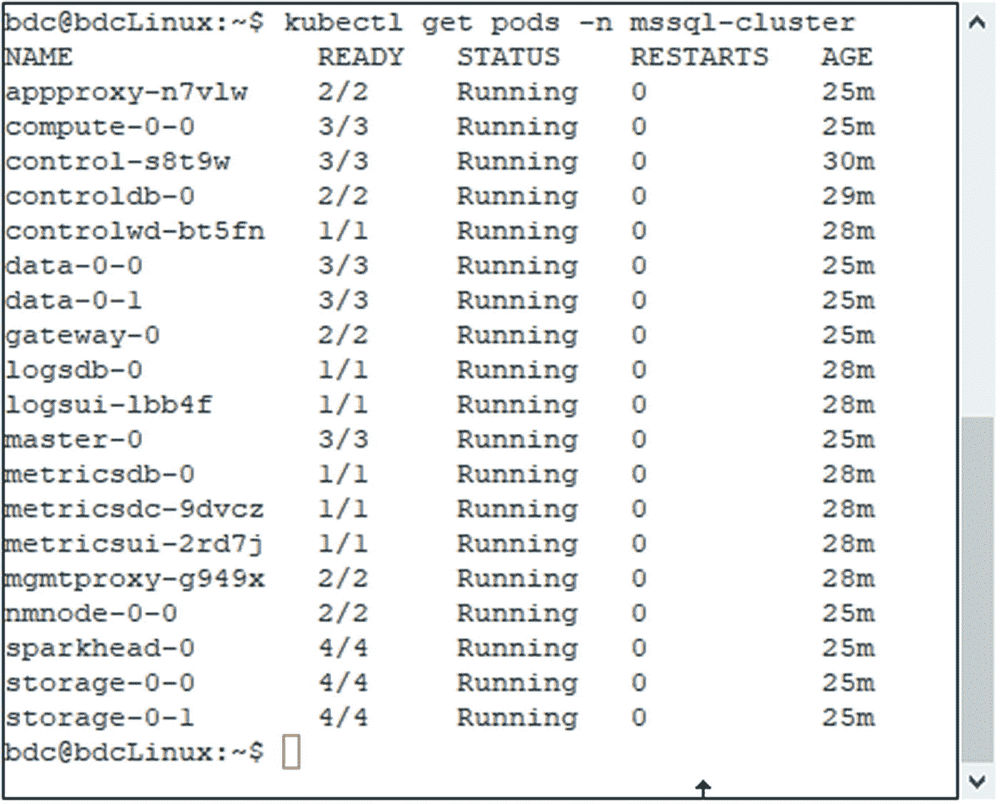
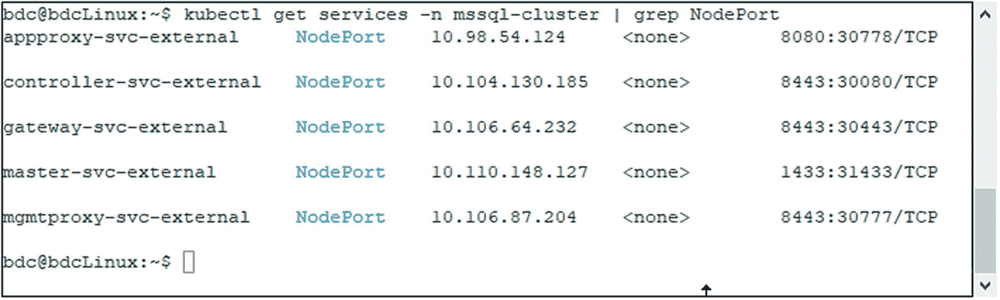
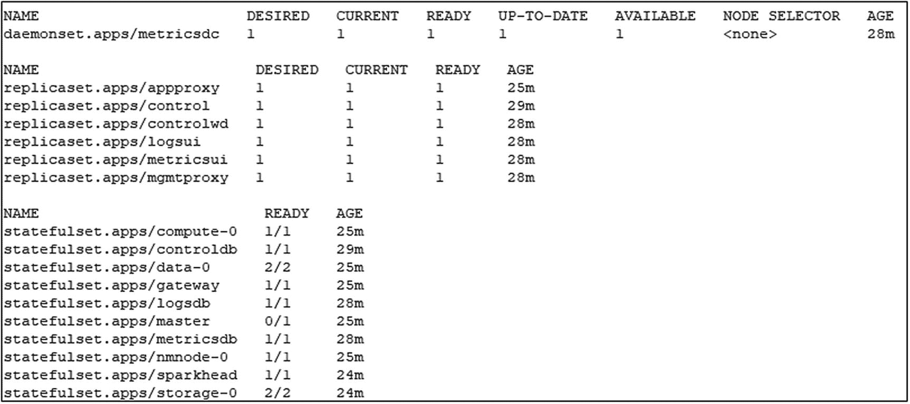
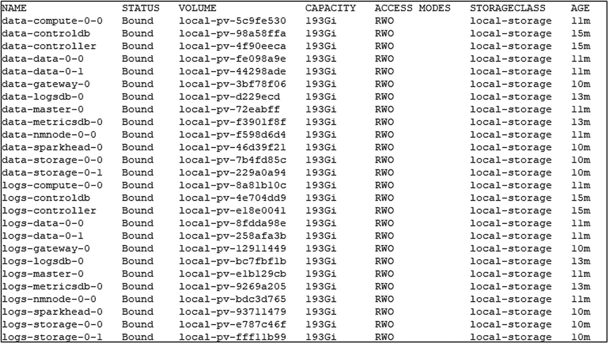
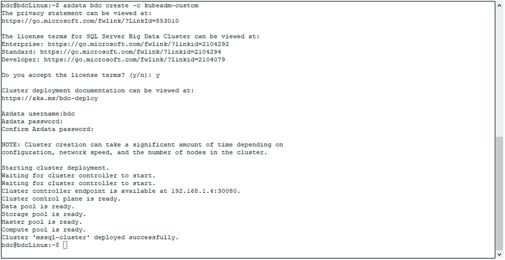
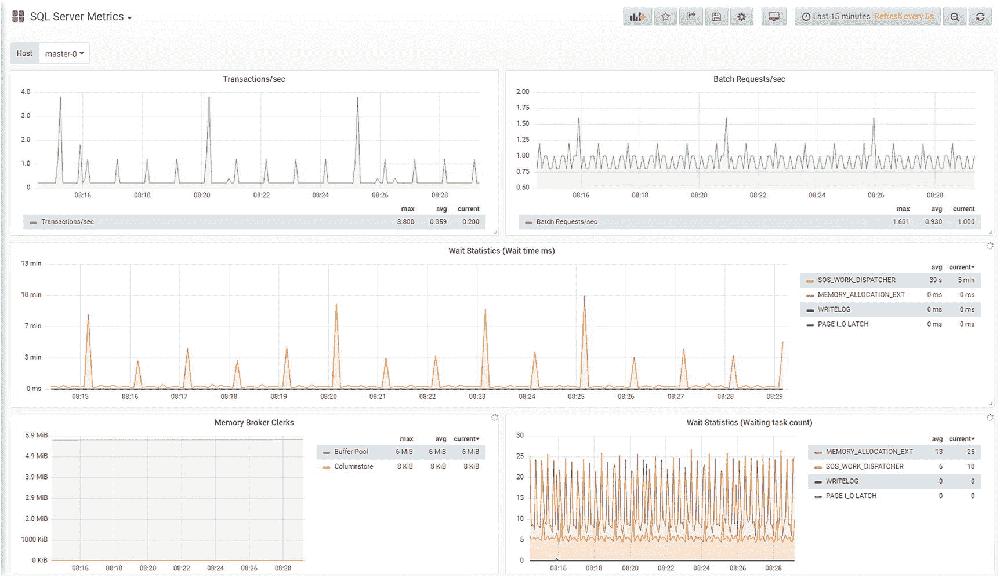
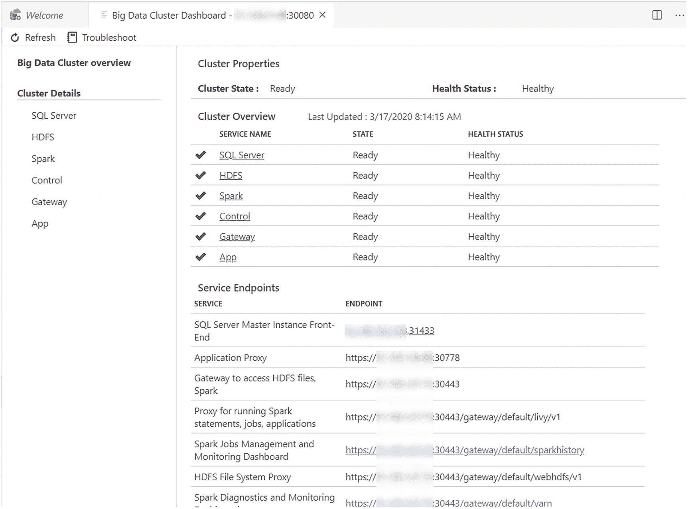
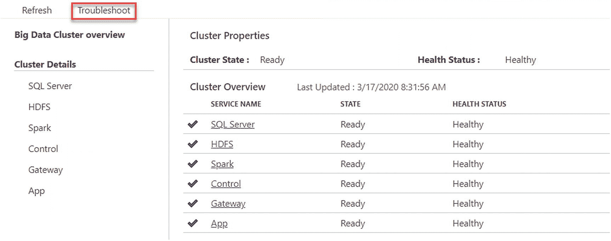

# 10.大数据集群

现在我们知道了如何在 Kubernetes 上部署 SQL Server，让我们在最后一章中看看微软如何设计、构建和部署大数据集群以在 Kubernetes 上运行，以及在 Kubernetes 中构建复杂的分布式系统并将其作为产品发布时遇到的挑战和精心设计的解决方案。我们将查看 BDC 架构，并将其映射回 Kubernetes 对象和构造。

## 大数据集群简介

SQL Server 2019 大数据集群(或简称大数据集群)是 SQL Server 2019 中的一项新功能集，具有广泛的数据虚拟化、数据集市横向扩展和人工智能功能。尽管微软的“云优先”策略是首先向 Azure 发布新的特性和功能，并最终将其推广到内部版本(如果有的话)，但它们是 box 产品的一部分，因此尽管你可以在任何你想安装的地方安装它们，但它们是由客户管理的。

大数据集群只能在 Linux 上运行(让我们先理解一下！)并且只能部署在 Kubernetes 集群中。虽然到目前为止，在本书中，我们已经向您展示了将应用部署到 Kubernetes 的方法，作为 Windows 服务器上传统部署的现代替代方案，但是在这一点上，您无法选择如何部署它。由于这是继我们在上一章介绍的支持 Arc 的数据服务之后的第二个示例，如果您还没有看到 Kubernetes 是如何部署现代数据应用的平台，以及为什么将它作为您未来技能的一部分如此重要，希望这也是重点。

SQL Server 2019 大数据集群本质上是运行在 Kubernetes 环境中的 SQL Server、Apache Spark 和 HDFS 的组合。它们不是单一的特性，而是一组特性。图 [10-1](#Fig1) 将该功能集的不同部分分为不同的组，以帮助您更好地理解所提供的内容。总体想法是通过虚拟化和横向扩展，SQL Server 2019 成为您所有数据的数据中心，即使这些数据在物理上并不位于 SQL Server 中。



图 10-1

SQL Server 2019 大数据集群的功能概述

大数据集群的主要方面从左到右显示。您可以支持数据虚拟化，然后是托管数据平台，最后是人工智能(AI)平台。

让我们更深入地看看它们。

### 数据虚拟化

数据虚拟化将数据引入 SQL Server，而这些数据实际上并不在 SQL Server 中。这是通过 PolyBase 实现的。PolyBase 最初是在 SQL Server 2016 中引入的，引入了*外部表*的概念。虽然 PolyBase 最初只支持基于文件的数据源，但现在它已经得到了极大的增强，可以支持其他数据源，如 Oracle、SQL Server、Teradata、MongoDB 和无数其他数据源。例如，这允许您创建一个表`dbo.Customers`，并像查询本地表一样查询它，但是它的数据位于 Azure SQL 数据库中。虽然这可能会让您想起一些链接服务器，但是 PolyBase 外部表不需要可怕的三点符号(`Servername.databasename.schemaname.tablename`)并且针对它们的查询是多线程的，这一事实只显示了它们提供的一些优势。

外部表没有缓存，因此针对它们的每个查询都会实时命中底层源，这是您在通过 PolyBase 从头构建数据仓库之前应该考虑的事情——考虑延迟和工作负载。

### 托管数据平台

在大数据集群的托管数据平台中，基本上为您提供了两种选择:您可以跨多个 SQL Server 实例横向扩展单个 SQL Server 表，而不是将它们分散在文件或文件组中，而是将它们物理地推入单独的实例中。或者，您可以存储和使用基于文件的数据，如 CSV 或 Parquet 文件(如果您不熟悉 Parquet，可以把它想象成平面文件的聚集列存储)。这些文件将在 SQL Server 中再次通过外部表公开和访问，从而允许您运行一个看似仅使用 SQL Server 数据的查询，但实际上是将 CSV 中的数据与 Oracle 实例中的表以及跨其他几个 SQL Server 扩展的大事实表结合在一起…您明白了。

### 人工智能和应用平台

大数据集群允许您部署应用，例如，SSIS 包或 R 或 Python 应用。然后，可以通过 REST API 公开这些应用，并从大数据集群内部和外部访问这些应用。因此，您的大数据集群同时成为您的数据库、文件服务器和应用服务器，并且全部在单个部署中，无需担心这些组件和池之间的连接。

## BDC 架构

大数据集群可以分为四个逻辑层。可以将这些视为在集群中执行特定功能的各种基础架构和管理部分的集合。每个区域依次扮演一个或多个角色。例如，在数据层内部，有两个角色:存储池和 SQL 数据池。

图 [10-2](#Fig2) 显示了四个逻辑区域以及每个区域中各种角色的概述。



图 10-2

大数据集群架构

您可以立即推断出四个逻辑层:控制层(内部称为控制平面——就像 Kubernetes 本身有另一个控制平面)以及计算、数据和应用区域。

### 大数据集群组件

让我们更深入地了解一下大数据集群的组件。

#### BDC 控制平面

大数据集群的控制平面(不要与 Kubernetes 控制平面混淆)是每个 BDC 部署的核心。它结合了 Grafana 和 Kibana 监控仪表板等功能，以及控制服务和配置存储等重要功能。虽然除了仪表板之外，您可能永远不会与这些组件进行交互，但是如果没有它们，您的 BDC 将什么也做不了。

#### SQL Server 主实例

您可能已经注意到在图 [10-2](#Fig2) 中显示了一个额外的或者几乎独立的角色，即 SQL Server 主实例。

SQL Server 主实例是一个基于 Linux 部署的 SQL Server，其作用就像一个通向大数据集群的入口点。它提供了通过 Azure Data Studio 或其他工具(如 SQL Server Management Studio)连接的外部端点。

#### 计算池

计算池由一个或多个 Linux 上的 SQL Server 实例组成，允许您通过 PolyBase 以分布式方式访问各种数据源。例如，计算池可以访问存储在 HDFS 内部大数据集群上的数据，或者通过 Oracle 或 MongoDB 等任何 PolyBase 连接器访问数据。

计算池的主要优势在于，它提供了跨每个计算池内的多个节点分布或扩展查询的选项，从而提高了多库查询的性能。

每个 BDC 部署都将至少有一个 SQL 实例作为计算池的一部分。您永远不会与它们直接交互——除了调试目的之外——它们将透明地成为整个集群中查询执行的一部分。

#### 贮水池

存储池为您提供了一个带有 Apache Spark 和 SQL Server 端点的 HDFS 集群。就像计算池一样，每个 BDC 至少有一个实例作为其存储池的一部分，但您也可以根据您的工作负载和使用案例决定更多实例。这意味着每个大数据集群都有自己的 HDFS，因此能够自行托管您可能需要在集群中使用的任何基于文件的数据。例如，如果您已经在 Azure Data Lake Store (ADLS)中有一个 HDFS 商店，您还可以通过所谓的分层将它添加为装载点。在这种情况下，您的 ADLS 只会成为存储池中的一个文件夹。

#### 数据库

另一方面，数据池为您提供了多个 Linux 上的 SQL Server Pods/实例，它们可以通过外部表的概念横向扩展单个表。理论上，您也可以像所有其他池一样，只使用一个实例来部署您的数据池。不过，这只有在不打算利用数据池的情况下才有意义，因为显然不能只使用一个实例来扩展一个表。您可以将数据池上的扩展表想象成一个`UNION ALL`——您对一个表运行一个查询，并获得多个物理表的结果。该数据池仅支持`INSERT`和`TRUNCATE`操作，并且不支持事务，因此不要将它视为您的主数据存储，而是 SQL Server 数据的缓存。

#### 应用池

最后一个组件是应用池。它允许您通过 Azure Data Studio、Visual Studio 代码或使用 azdata 的命令行向其部署 MLeap、R、Python 或 SSIS 解决方案。这些应用可以通过`REST API,`交互使用，也可以根据时间表使用。

### BDC 中的 Kubernetes 构造

在 Kubernetes 集群中，每个 BDC 都将被部署到它自己的名称空间，默认情况下是 *mssql-cluster* 。BDC 中的不同组件由单独的 pod 表示。例如，在不同的池中，数据池的每个实例将由其自己的 pod 表示。在图 [10-3](#Fig3) 中可以看到通过 kubectl 检索的 BDC 内的 pod 列表的输出。



图 10-3

BDC 名称空间中 kubectl get pods 的输出

在本例中，我们可以看到，这一特定部署由数据和存储池中的两个实例和应用和计算池中的一个实例以及其他组件的一个或多个窗格组成，如代表 Grafana 仪表板的 *metricsdb* 、 *metricsdc、*和 *metricsui* 窗格。现在你可能已经知道了，随着我们在第 [8](08.html) 章中部署 Grafana 和 Kibana，它们与第 [9](09.html) 章中展示的 Azure Arc 支持的数据服务一起发布，它们现在再次出现，它们已经成为 Kubernetes 世界上 SQL Server 监控和日志管理的事实上的标准。

BDC 的端点通过服务在 Kubernetes 中公开。根据平台的不同，它们要么是节点端口类型，要么是*负载平衡器*，正如我们在图 [10-4](#Fig4) 的例子中看到的。



图 10-4

BDC 名称空间中 ku bectl get services | grep NodePort 的输出

除了这些服务之外，它还公开了许多 *ClusterIP* 服务，以允许这些服务相互通信。

它还创建了许多不同的集合——daemon set、ReplicaSets 和 StatefulSets。如果我们使用`kubectl get all -n mssql-cluster`列出它们，它们都显示在输出的下部(图 [10-5](#Fig5) )。



图 10-5

Kubernetes 采用大数据集群

BDC 中的存储通过存储类别和这些类别中的动态配置来解决。如图 [10-6](#Fig6) 所示，大数据集群将根据需要创建动态持久卷声明(以及底层卷)。



图 10-6

大数据集群中的 PVC

正如您所看到的，大数据集群真正将我们迄今为止接触到的所有东西整合在一起，从 Kubernetes objects over monitoring 到 SQL Server。

## 部署

就像 Azure Arc 支持的数据服务一样，大数据集群正在通过 azdata 部署，并且该过程可以从命令行或 Azure Data Studio 运行，Azure Data Studio 将创建一个笔记本，然后在后台运行 azdata。

部署 BDC 需要一个可用的 Kubernetes 集群，它可以运行在 kubeadm、AKS、EKS 或 OpenShift 上。

为了部署您的 BDC，您将把您的 Kubernetes 上下文更改为所需的目标集群，并使用清单 [10-1](#PC1) 中的代码创建一个配置。

```
azdata bdc config init [--path] [--source -s]

Listing 10-1Create a BDC configuration

```

*路径*就是你的 BDC 的配置文件( *bdc.json* 和 *control.json* )将被清单 [10-1](#PC1) 中的命令创建的文件夹名。 *src* 是现有的基础模板之一，类似于 *aks-dev-test* 或 *kubeadm-prod* 。

例如，在名为 *myBDC* 的子文件夹中创建大数据集群配置的完整命令应该使用典型的开发/测试环境部署在 AKS 上，如清单 [10-2](#PC2) 所示。

```
azdata bdc config init --path myBDC –-source aks-dev-test

Listing 10-2Create a BDC configuration

```

这些文件将用于配置围绕您的部署的一切，从您的大数据群集到 Active Directory 的潜在集成，以针对每个池中的副本数量进行 AD 身份验证，到内存和存储要求。这两个文件之一的例子 bdc.json 可以在清单 [10-3](#PC3) 中看到。

```
{
    "apiVersion": "v1",
    "metadata": {
        "kind": "BigDataCluster",
        "name": "mssql-cluster"
    },
    "spec": {
        "resources": {
            "nmnode-0": {
                "spec": {
                    "replicas": 2
                }
            },
            "sparkhead": {
                "spec": {
                    "replicas": 2
                }
            },
            "zookeeper": {
                "spec": {
                    "replicas": 3
                }
            },
            "gateway": {
                "spec": {
                    "replicas": 1,
                    "endpoints": [
                        {
                            "name": "Knox",
                            "dnsName": "",
                            "serviceType": "NodePort",
                            "port": 30443
                        }
                    ]
                }
            },

            "appproxy": {
                "spec": {
                    "replicas": 1,
                    "endpoints": [
                        {
                            "name": "AppServiceProxy",
                            "dnsName": "",
                            "serviceType": "NodePort",
                            "port": 30778
                        }
                    ]
                }
            },
            "master": {
                "metadata": {
                    "kind": "Pool",
                    "name": "default"
                },
                "spec": {
                    "type": "Master",
                    "replicas": 3,
                    "endpoints": [
                        {
                            "name": "Master",
                            "dnsName": "",
                            "serviceType": "NodePort",
                            "port": 31433
                        },
                        {
                            "name": "MasterSecondary",
                            "dnsName": "",
                            "serviceType": "NodePort",
                            "port": 31436
                        }
                    ],

                    "settings": {
                        "sql": {
                            "hadr.enabled": "true"
                        }
                    }
                }
            },
            "compute-0": {
                "metadata": {
                    "kind": "Pool",
                    "name": "default"
                },
                "spec": {
                    "type": "Compute",
                    "replicas": 1
                }
            },
            "data-0": {
                "metadata": {
                    "kind": "Pool",
                    "name": "default"
                },
                "spec": {
                    "type": "Data",
                    "replicas": 2
                }
            },
            "storage-0": {
                "metadata": {
                    "kind": "Pool",
                    "name": "default"
                },
                "spec": {

                    "type": "Storage",
                    "replicas": 3,
                    "settings": {
                        "spark": {
                            "includeSpark": "true"
                        }
                    }
                }
            }
        },
        "services": {
            "sql": {
                "resources": [
                    "master",
                    "compute-0",
                    "data-0",
                    "storage-0"
                ]
            },
            "hdfs": {
                "resources": [
                    "nmnode-0",
                    "zookeeper",
                    "storage-0",
                    "sparkhead"
                ],
                "settings": {
                    "hdfs-site.dfs.replication": "3"
                }
            },
            "spark": {
                "resources": [
                    "sparkhead",
                    "storage-0"
                ],
                "settings": {
                    "spark-defaults-conf.spark.driver.memory": "2g",
                    "spark-defaults-conf.spark.driver.cores": "1",
                    "spark-defaults-conf.spark.executor.instances": "3",
                    "spark-defaults-conf.spark.executor.memory": "1536m",
                    "spark-defaults-conf.spark.executor.cores": "1",
                    "yarn-site.yarn.nodemanager.resource.memory-mb": "18432",
                    "yarn-site.yarn.nodemanager.resource.cpu-vcores": "6",
                    "yarn-site.yarn.scheduler.maximum-allocation-mb": "18432",
                    "yarn-site.yarn.scheduler.maximum-allocation-vcores": "6",
                    "yarn-site.yarn.scheduler.capacity.maximum-am-resource-percent": "0.3"
                }
            }
        }

    }
}

Listing 10-3Sample bdc.json

```

一旦编辑/创建了配置文件，就可以运行清单 [10-4](#PC4) 中所示的 azdata 来创建集群。

```
azdata bdc create -c < yourPath> --accept-eula yes

Listing 10-4Create cluster using azdata

```

Azdata 会提示您输入用户名和密码，除非您之前已经通过环境变量提供了这些信息。根据您的部署范围和 Kubernetes 集群的性能，这可能需要几分钟到几小时的时间。

您可以跟踪进度并查看它何时完成，如图 [10-7](#Fig7) 所示。



图 10-7

azdata bdc 创建的输出

部署所需的时间还取决于映像是否已经预拉，因为仅这些映像就需要 30GB 以上的下载空间。

## 监测和管理

可以在 Azure Data Studio 中直接监控 BDC，也可以通过 Grafana 和 Kibana 仪表板进行监控，我们已经在前面的章节中遇到过，如图 [10-8](#Fig8) 所示。还要注意如何更改门户的一般行为(如暗模式与亮模式),以及该仪表板与我们在前面章节中使用的仪表板有何细微的不同。



图 10-8

Grafana 门户 SQL Server 指标

Azure Data Studio 为您提供了集群端点的概述以及关于其健康状况的粗略状态，如图 [10-9](#Fig9) 所示。



图 10-9

ADS 中的大数据集群概述

除此之外，如图 [10-10](#Fig10) 所示，它还为您的 BDC 提供了一套故障排除工具。



图 10-10

链接到 ADS 中的故障排除

此按钮后面是一组笔记本，用于对集群的每个组件进行故障排除。打开的第一个笔记本是“TSG100 大数据集群故障排除程序”，它将指导您完成大数据集群的全面调试。如果您已经缩小了导致问题的服务范围，还可以直接导航到该特定组件的 analyzer 笔记本。

## 升级大数据集群

BDC 的升级是通过 azdata 进行的，所以首先要确保您安装了 azdata 的最新版本。为此，运行清单 [10-5](#PC5) 中的代码，就像第一次安装 azdata 时一样。

```
curl -o azdata.msi https://aka.ms/azdata-msi
msiexec azdata.msi

Listing 10-5Update azdata to the latest version

```

现在您可以使用 *azdata* 来升级您的集群。这个命令是 *azdata bdc upgrade，*，后面至少跟着您的集群的名称和目标版本。

例如，要升级到大数据集群 2019 CU9，您可以使用清单 [10-6](#PC6) 中所示的命令。这将更新您的所有 BDC 组件。

```
azdata bdc upgrade --name mybdc --tag 2019-CU9-ubuntu-16.04

Listing 10-6Upgrade your BDC to CU9 using azdata

```

这将需要一些时间，因为首先需要提取所有单个映像，然后升级群集中的每个组件。就像在安装过程中一样，在升级过程完成之前，升级过程将为您提供关于当前正在哪个组件上工作的连续状态更新。

此时，无法在部署后更改大数据集群的大小，因此 azdata 可以将现有集群升级到另一个版本，但是不能更改池中的实例数量。这将需要新的部署。

如果您想了解更多关于大数据集群的信息，包括如何部署它们的细节，我们推荐一本名为 *SQL Server 大数据集群:数据虚拟化、数据湖和 AI 平台*的出版社书籍。

## 摘要

在最后一章中，我们探讨了如何使用 Kubernetes 以简单和自动化的方式部署非常复杂和异构的应用，如大数据集群。这也是本书的结论。我们希望这有助于您更深入地了解 Kubernetes 以及它如何帮助您部署现代数据应用！